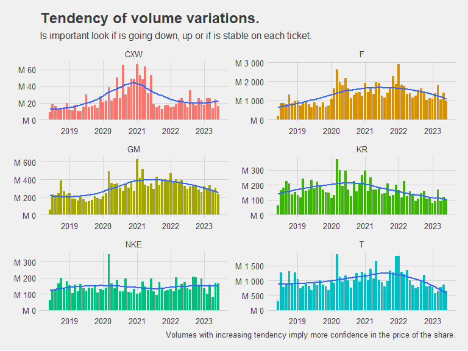
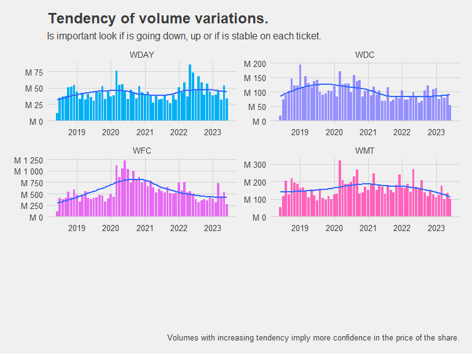
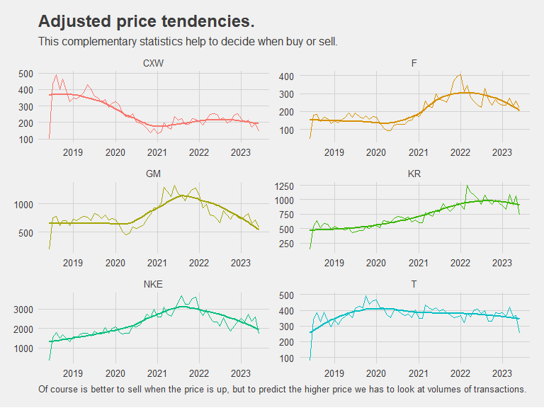
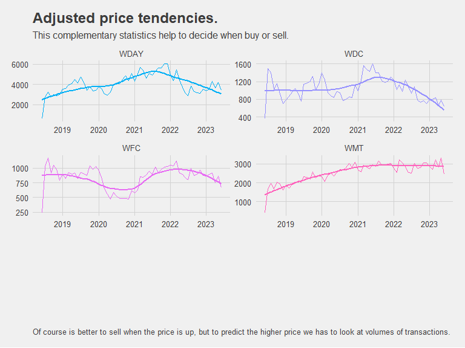
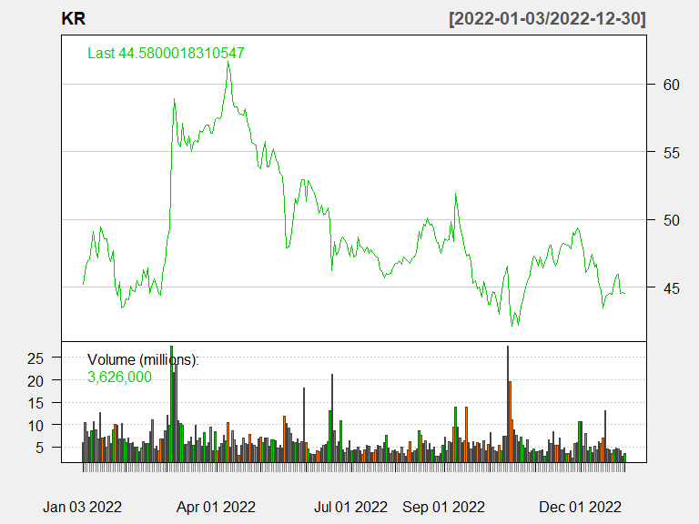
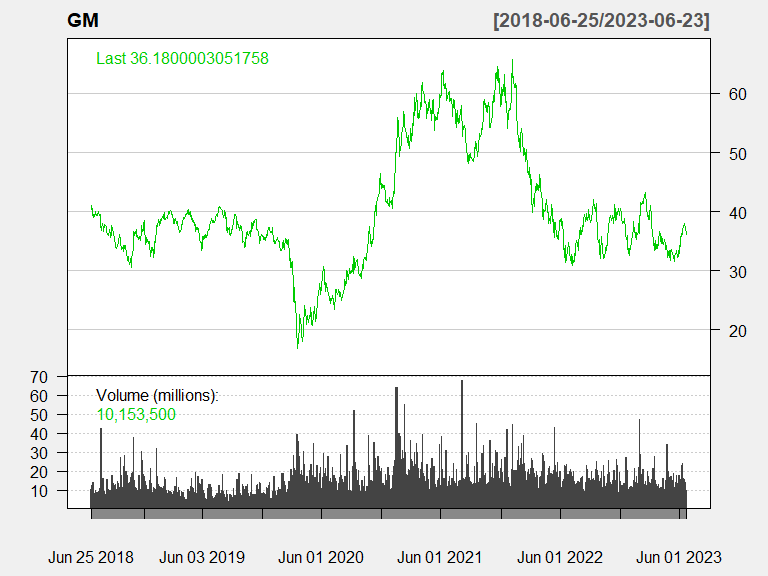

```r
# Use this R-Chunk to import all your datasets!

tickers_today <- c("CXW", "F", "GM", "KR", "WDC", "NKE","T", "WDAY", "WFC", "WMT")

five_years_back <-  Sys.Date() %>% -years(5)

stock <-  tq_get(tickers_today,
       from = five_years_back) 
```

## Background
Your data science income has ballooned, and you need to find somewhere to invest $25,000 that you have saved over the last year. You have a savvy investment friend that is kind enough to tell you ten stocks she has been watching during the last year. You will need to visualize the last five years performance to help in the conversation with your friend.  
Your friend is going to give you her stock tickers at the beginning of your half-hour meeting with her (she is a busy friend). You will need to build an .Rmd file that will build a suite of visualizations rapidly for your conversation. You will need a series of stock performance graphics using library(dygraphs) and library(ggplot2). In real life, you might use one or the other, but this task is built to help you move from ts and xts to tidy objects for visualization.  

## Task  
1. For your coding development use the following tickers: tickers_today <- c("CXW", "F", "GM", "JCP", "KR", "WDC", "NKE","T", "WDAY", "WFC", "WMT").  
2. Use library(dygraphs) to build interactive visualizations of the stock performances over the last five years.  
3. Make a library(ggplot2) graphic that helps you build a solid question around how an investor would use volume in their trading strategy.  
4. Create an .Rmd file with one to two paragraphs summarizing your graphics and the choices you made in your visualization.  
5. Push your .Rmd, .md, and .html file into your git repository.  
6. Publish your assignment via Rstudio Connect at shiny.byui.edu

## Select smaller periods to look for more detailed differences and patterns. Double click to reset period.


```r
# Use this R-Chunk to clean & wrangle your data!


#-------------------- filtering each stock for graph purposes ---------------------

CXW <- stock %>% filter(symbol == "CXW")

#cxw <- CXW %>% select(-symbol, - volume)

CXW <-  CXW %>% select( date, volume, adjusted)

f <- stock %>% filter(symbol == "F") %>% 
               select( date, volume, adjusted)

GM <- stock %>% filter(symbol == "GM") %>% 
               select( date, volume, adjusted)

KR <- stock %>% filter(symbol == "KR") %>% 
               select( date, volume, adjusted)

WDC <- stock %>% filter(symbol == "WDC") %>% 
               select( date, volume, adjusted)

NKE <- stock %>% filter(symbol == "NKE") %>% 
               select( date, volume, adjusted)

t <- stock %>% filter(symbol == "T") %>% 
               select( date, volume, adjusted)

WDAY <- stock %>% filter(symbol == "WDAY") %>% 
               select( date, volume, adjusted)

WFC <- stock %>% filter(symbol == "WFC") %>% 
               select( date, volume, close)


WMT <- stock %>% filter(symbol == "WMT") %>% 
               select( date, volume, adjusted)


# ------------------- this filter the data and pivoted to get a column for each symbol---------------------

# Since dyGraph graph each column as a line this is the way to show each symbol as a different line


st <- stock %>% select(symbol, date, adjusted)
 
s1 <- st %>% pivot_wider(names_from = symbol, values_from = adjusted) %>% 
           dygraph(main = "Stock performances", group = "stocks") %>% 
           dyAxis("y", label = "Adjusted value")


s1
```

```{=html}
<div class="dygraphs html-widget html-fill-item-overflow-hidden html-fill-item" id="htmlwidget-79aa698e87da26220af5" style="width:768px;height:576px;"></div>
<script type="application/json" data-for="htmlwidget-79aa698e87da26220af5">{"x":{"attrs":{"axes":{"x":{"pixelsPerLabel":60},"y":[]},"title":"Stock performances","labels":["day","CXW","F","GM","KR","WDC","NKE","T","WDAY","WFC","WMT"],"legend":"auto","retainDateWindow":false,"ylabel":"Adjusted value"},"scale":"daily","group":"stocks","annotations":[],"shadings":[],"events":[],"format":"date","data":[["2018-06-25T00:00:00.000Z","2018-06-26T00:00:00.000Z","2018-06-27T00:00:00.000Z","2018-06-28T00:00:00.000Z","2018-06-29T00:00:00.000Z","2018-07-02T00:00:00.000Z","2018-07-03T00:00:00.000Z","2018-07-05T00:00:00.000Z","2018-07-06T00:00:00.000Z","2018-07-09T00:00:00.000Z","2018-07-10T00:00:00.000Z","2018-07-11T00:00:00.000Z","2018-07-12T00:00:00.000Z","2018-07-13T00:00:00.000Z","2018-07-16T00:00:00.000Z","2018-07-17T00:00:00.000Z","2018-07-18T00:00:00.000Z","2018-07-19T00:00:00.000Z","2018-07-20T00:00:00.000Z","2018-07-23T00:00:00.000Z","2018-07-24T00:00:00.000Z","2018-07-25T00:00:00.000Z","2018-07-26T00:00:00.000Z","2018-07-27T00:00:00.000Z","2018-07-30T00:00:00.000Z","2018-07-31T00:00:00.000Z","2018-08-01T00:00:00.000Z","2018-08-02T00:00:00.000Z","2018-08-03T00:00:00.000Z","2018-08-06T00:00:00.000Z","2018-08-07T00:00:00.000Z","2018-08-08T00:00:00.000Z","2018-08-09T00:00:00.000Z","2018-08-10T00:00:00.000Z","2018-08-13T00:00:00.000Z","2018-08-14T00:00:00.000Z","2018-08-15T00:00:00.000Z","2018-08-16T00:00:00.000Z","2018-08-17T00:00:00.000Z","2018-08-20T00:00:00.000Z","2018-08-21T00:00:00.000Z","2018-08-22T00:00:00.000Z","2018-08-23T00:00:00.000Z","2018-08-24T00:00:00.000Z","2018-08-27T00:00:00.000Z","2018-08-28T00:00:00.000Z","2018-08-29T00:00:00.000Z","2018-08-30T00:00:00.000Z","2018-08-31T00:00:00.000Z","2018-09-04T00:00:00.000Z","2018-09-05T00:00:00.000Z","2018-09-06T00:00:00.000Z","2018-09-07T00:00:00.000Z","2018-09-10T00:00:00.000Z","2018-09-11T00:00:00.000Z","2018-09-12T00:00:00.000Z","2018-09-13T00:00:00.000Z","2018-09-14T00:00:00.000Z","2018-09-17T00:00:00.000Z","2018-09-18T00:00:00.000Z","2018-09-19T00:00:00.000Z","2018-09-20T00:00:00.000Z","2018-09-21T00:00:00.000Z","2018-09-24T00:00:00.000Z","2018-09-25T00:00:00.000Z","2018-09-26T00:00:00.000Z","2018-09-27T00:00:00.000Z","2018-09-28T00:00:00.000Z","2018-10-01T00:00:00.000Z","2018-10-02T00:00:00.000Z","2018-10-03T00:00:00.000Z","2018-10-04T00:00:00.000Z","2018-10-05T00:00:00.000Z","2018-10-08T00:00:00.000Z","2018-10-09T00:00:00.000Z","2018-10-10T00:00:00.000Z","2018-10-11T00:00:00.000Z","2018-10-12T00:00:00.000Z","2018-10-15T00:00:00.000Z","2018-10-16T00:00:00.000Z","2018-10-17T00:00:00.000Z","2018-10-18T00:00:00.000Z","2018-10-19T00:00:00.000Z","2018-10-22T00:00:00.000Z","2018-10-23T00:00:00.000Z","2018-10-24T00:00:00.000Z","2018-10-25T00:00:00.000Z","2018-10-26T00:00:00.000Z","2018-10-29T00:00:00.000Z","2018-10-30T00:00:00.000Z","2018-10-31T00:00:00.000Z","2018-11-01T00:00:00.000Z","2018-11-02T00:00:00.000Z","2018-11-05T00:00:00.000Z","2018-11-06T00:00:00.000Z","2018-11-07T00:00:00.000Z","2018-11-08T00:00:00.000Z","2018-11-09T00:00:00.000Z","2018-11-12T00:00:00.000Z","2018-11-13T00:00:00.000Z","2018-11-14T00:00:00.000Z","2018-11-15T00:00:00.000Z","2018-11-16T00:00:00.000Z","2018-11-19T00:00:00.000Z","2018-11-20T00:00:00.000Z","2018-11-21T00:00:00.000Z","2018-11-23T00:00:00.000Z","2018-11-26T00:00:00.000Z","2018-11-27T00:00:00.000Z","2018-11-28T00:00:00.000Z","2018-11-29T00:00:00.000Z","2018-11-30T00:00:00.000Z","2018-12-03T00:00:00.000Z","2018-12-04T00:00:00.000Z","2018-12-06T00:00:00.000Z","2018-12-07T00:00:00.000Z","2018-12-10T00:00:00.000Z","2018-12-11T00:00:00.000Z","2018-12-12T00:00:00.000Z","2018-12-13T00:00:00.000Z","2018-12-14T00:00:00.000Z","2018-12-17T00:00:00.000Z","2018-12-18T00:00:00.000Z","2018-12-19T00:00:00.000Z","2018-12-20T00:00:00.000Z","2018-12-21T00:00:00.000Z","2018-12-24T00:00:00.000Z","2018-12-26T00:00:00.000Z","2018-12-27T00:00:00.000Z","2018-12-28T00:00:00.000Z","2018-12-31T00:00:00.000Z","2019-01-02T00:00:00.000Z","2019-01-03T00:00:00.000Z","2019-01-04T00:00:00.000Z","2019-01-07T00:00:00.000Z","2019-01-08T00:00:00.000Z","2019-01-09T00:00:00.000Z","2019-01-10T00:00:00.000Z","2019-01-11T00:00:00.000Z","2019-01-14T00:00:00.000Z","2019-01-15T00:00:00.000Z","2019-01-16T00:00:00.000Z","2019-01-17T00:00:00.000Z","2019-01-18T00:00:00.000Z","2019-01-22T00:00:00.000Z","2019-01-23T00:00:00.000Z","2019-01-24T00:00:00.000Z","2019-01-25T00:00:00.000Z","2019-01-28T00:00:00.000Z","2019-01-29T00:00:00.000Z","2019-01-30T00:00:00.000Z","2019-01-31T00:00:00.000Z","2019-02-01T00:00:00.000Z","2019-02-04T00:00:00.000Z","2019-02-05T00:00:00.000Z","2019-02-06T00:00:00.000Z","2019-02-07T00:00:00.000Z","2019-02-08T00:00:00.000Z","2019-02-11T00:00:00.000Z","2019-02-12T00:00:00.000Z","2019-02-13T00:00:00.000Z","2019-02-14T00:00:00.000Z","2019-02-15T00:00:00.000Z","2019-02-19T00:00:00.000Z","2019-02-20T00:00:00.000Z","2019-02-21T00:00:00.000Z","2019-02-22T00:00:00.000Z","2019-02-25T00:00:00.000Z","2019-02-26T00:00:00.000Z","2019-02-27T00:00:00.000Z","2019-02-28T00:00:00.000Z","2019-03-01T00:00:00.000Z","2019-03-04T00:00:00.000Z","2019-03-05T00:00:00.000Z","2019-03-06T00:00:00.000Z","2019-03-07T00:00:00.000Z","2019-03-08T00:00:00.000Z","2019-03-11T00:00:00.000Z","2019-03-12T00:00:00.000Z","2019-03-13T00:00:00.000Z","2019-03-14T00:00:00.000Z","2019-03-15T00:00:00.000Z","2019-03-18T00:00:00.000Z","2019-03-19T00:00:00.000Z","2019-03-20T00:00:00.000Z","2019-03-21T00:00:00.000Z","2019-03-22T00:00:00.000Z","2019-03-25T00:00:00.000Z","2019-03-26T00:00:00.000Z","2019-03-27T00:00:00.000Z","2019-03-28T00:00:00.000Z","2019-03-29T00:00:00.000Z","2019-04-01T00:00:00.000Z","2019-04-02T00:00:00.000Z","2019-04-03T00:00:00.000Z","2019-04-04T00:00:00.000Z","2019-04-05T00:00:00.000Z","2019-04-08T00:00:00.000Z","2019-04-09T00:00:00.000Z","2019-04-10T00:00:00.000Z","2019-04-11T00:00:00.000Z","2019-04-12T00:00:00.000Z","2019-04-15T00:00:00.000Z","2019-04-16T00:00:00.000Z","2019-04-17T00:00:00.000Z","2019-04-18T00:00:00.000Z","2019-04-22T00:00:00.000Z","2019-04-23T00:00:00.000Z","2019-04-24T00:00:00.000Z","2019-04-25T00:00:00.000Z","2019-04-26T00:00:00.000Z","2019-04-29T00:00:00.000Z","2019-04-30T00:00:00.000Z","2019-05-01T00:00:00.000Z","2019-05-02T00:00:00.000Z","2019-05-03T00:00:00.000Z","2019-05-06T00:00:00.000Z","2019-05-07T00:00:00.000Z","2019-05-08T00:00:00.000Z","2019-05-09T00:00:00.000Z","2019-05-10T00:00:00.000Z","2019-05-13T00:00:00.000Z","2019-05-14T00:00:00.000Z","2019-05-15T00:00:00.000Z","2019-05-16T00:00:00.000Z","2019-05-17T00:00:00.000Z","2019-05-20T00:00:00.000Z","2019-05-21T00:00:00.000Z","2019-05-22T00:00:00.000Z","2019-05-23T00:00:00.000Z","2019-05-24T00:00:00.000Z","2019-05-28T00:00:00.000Z","2019-05-29T00:00:00.000Z","2019-05-30T00:00:00.000Z","2019-05-31T00:00:00.000Z","2019-06-03T00:00:00.000Z","2019-06-04T00:00:00.000Z","2019-06-05T00:00:00.000Z","2019-06-06T00:00:00.000Z","2019-06-07T00:00:00.000Z","2019-06-10T00:00:00.000Z","2019-06-11T00:00:00.000Z","2019-06-12T00:00:00.000Z","2019-06-13T00:00:00.000Z","2019-06-14T00:00:00.000Z","2019-06-17T00:00:00.000Z","2019-06-18T00:00:00.000Z","2019-06-19T00:00:00.000Z","2019-06-20T00:00:00.000Z","2019-06-21T00:00:00.000Z","2019-06-24T00:00:00.000Z","2019-06-25T00:00:00.000Z","2019-06-26T00:00:00.000Z","2019-06-27T00:00:00.000Z","2019-06-28T00:00:00.000Z","2019-07-01T00:00:00.000Z","2019-07-02T00:00:00.000Z","2019-07-03T00:00:00.000Z","2019-07-05T00:00:00.000Z","2019-07-08T00:00:00.000Z","2019-07-09T00:00:00.000Z","2019-07-10T00:00:00.000Z","2019-07-11T00:00:00.000Z","2019-07-12T00:00:00.000Z","2019-07-15T00:00:00.000Z","2019-07-16T00:00:00.000Z","2019-07-17T00:00:00.000Z","2019-07-18T00:00:00.000Z","2019-07-19T00:00:00.000Z","2019-07-22T00:00:00.000Z","2019-07-23T00:00:00.000Z","2019-07-24T00:00:00.000Z","2019-07-25T00:00:00.000Z","2019-07-26T00:00:00.000Z","2019-07-29T00:00:00.000Z","2019-07-30T00:00:00.000Z","2019-07-31T00:00:00.000Z","2019-08-01T00:00:00.000Z","2019-08-02T00:00:00.000Z","2019-08-05T00:00:00.000Z","2019-08-06T00:00:00.000Z","2019-08-07T00:00:00.000Z","2019-08-08T00:00:00.000Z","2019-08-09T00:00:00.000Z","2019-08-12T00:00:00.000Z","2019-08-13T00:00:00.000Z","2019-08-14T00:00:00.000Z","2019-08-15T00:00:00.000Z","2019-08-16T00:00:00.000Z","2019-08-19T00:00:00.000Z","2019-08-20T00:00:00.000Z","2019-08-21T00:00:00.000Z","2019-08-22T00:00:00.000Z","2019-08-23T00:00:00.000Z","2019-08-26T00:00:00.000Z","2019-08-27T00:00:00.000Z","2019-08-28T00:00:00.000Z","2019-08-29T00:00:00.000Z","2019-08-30T00:00:00.000Z","2019-09-03T00:00:00.000Z","2019-09-04T00:00:00.000Z","2019-09-05T00:00:00.000Z","2019-09-06T00:00:00.000Z","2019-09-09T00:00:00.000Z","2019-09-10T00:00:00.000Z","2019-09-11T00:00:00.000Z","2019-09-12T00:00:00.000Z","2019-09-13T00:00:00.000Z","2019-09-16T00:00:00.000Z","2019-09-17T00:00:00.000Z","2019-09-18T00:00:00.000Z","2019-09-19T00:00:00.000Z","2019-09-20T00:00:00.000Z","2019-09-23T00:00:00.000Z","2019-09-24T00:00:00.000Z","2019-09-25T00:00:00.000Z","2019-09-26T00:00:00.000Z","2019-09-27T00:00:00.000Z","2019-09-30T00:00:00.000Z","2019-10-01T00:00:00.000Z","2019-10-02T00:00:00.000Z","2019-10-03T00:00:00.000Z","2019-10-04T00:00:00.000Z","2019-10-07T00:00:00.000Z","2019-10-08T00:00:00.000Z","2019-10-09T00:00:00.000Z","2019-10-10T00:00:00.000Z","2019-10-11T00:00:00.000Z","2019-10-14T00:00:00.000Z","2019-10-15T00:00:00.000Z","2019-10-16T00:00:00.000Z","2019-10-17T00:00:00.000Z","2019-10-18T00:00:00.000Z","2019-10-21T00:00:00.000Z","2019-10-22T00:00:00.000Z","2019-10-23T00:00:00.000Z","2019-10-24T00:00:00.000Z","2019-10-25T00:00:00.000Z","2019-10-28T00:00:00.000Z","2019-10-29T00:00:00.000Z","2019-10-30T00:00:00.000Z","2019-10-31T00:00:00.000Z","2019-11-01T00:00:00.000Z","2019-11-04T00:00:00.000Z","2019-11-05T00:00:00.000Z","2019-11-06T00:00:00.000Z","2019-11-07T00:00:00.000Z","2019-11-08T00:00:00.000Z","2019-11-11T00:00:00.000Z","2019-11-12T00:00:00.000Z","2019-11-13T00:00:00.000Z","2019-11-14T00:00:00.000Z","2019-11-15T00:00:00.000Z","2019-11-18T00:00:00.000Z","2019-11-19T00:00:00.000Z","2019-11-20T00:00:00.000Z","2019-11-21T00:00:00.000Z","2019-11-22T00:00:00.000Z","2019-11-25T00:00:00.000Z","2019-11-26T00:00:00.000Z","2019-11-27T00:00:00.000Z","2019-11-29T00:00:00.000Z","2019-12-02T00:00:00.000Z","2019-12-03T00:00:00.000Z","2019-12-04T00:00:00.000Z","2019-12-05T00:00:00.000Z","2019-12-06T00:00:00.000Z","2019-12-09T00:00:00.000Z","2019-12-10T00:00:00.000Z","2019-12-11T00:00:00.000Z","2019-12-12T00:00:00.000Z","2019-12-13T00:00:00.000Z","2019-12-16T00:00:00.000Z","2019-12-17T00:00:00.000Z","2019-12-18T00:00:00.000Z","2019-12-19T00:00:00.000Z","2019-12-20T00:00:00.000Z","2019-12-23T00:00:00.000Z","2019-12-24T00:00:00.000Z","2019-12-26T00:00:00.000Z","2019-12-27T00:00:00.000Z","2019-12-30T00:00:00.000Z","2019-12-31T00:00:00.000Z","2020-01-02T00:00:00.000Z","2020-01-03T00:00:00.000Z","2020-01-06T00:00:00.000Z","2020-01-07T00:00:00.000Z","2020-01-08T00:00:00.000Z","2020-01-09T00:00:00.000Z","2020-01-10T00:00:00.000Z","2020-01-13T00:00:00.000Z","2020-01-14T00:00:00.000Z","2020-01-15T00:00:00.000Z","2020-01-16T00:00:00.000Z","2020-01-17T00:00:00.000Z","2020-01-21T00:00:00.000Z","2020-01-22T00:00:00.000Z","2020-01-23T00:00:00.000Z","2020-01-24T00:00:00.000Z","2020-01-27T00:00:00.000Z","2020-01-28T00:00:00.000Z","2020-01-29T00:00:00.000Z","2020-01-30T00:00:00.000Z","2020-01-31T00:00:00.000Z","2020-02-03T00:00:00.000Z","2020-02-04T00:00:00.000Z","2020-02-05T00:00:00.000Z","2020-02-06T00:00:00.000Z","2020-02-07T00:00:00.000Z","2020-02-10T00:00:00.000Z","2020-02-11T00:00:00.000Z","2020-02-12T00:00:00.000Z","2020-02-13T00:00:00.000Z","2020-02-14T00:00:00.000Z","2020-02-18T00:00:00.000Z","2020-02-19T00:00:00.000Z","2020-02-20T00:00:00.000Z","2020-02-21T00:00:00.000Z","2020-02-24T00:00:00.000Z","2020-02-25T00:00:00.000Z","2020-02-26T00:00:00.000Z","2020-02-27T00:00:00.000Z","2020-02-28T00:00:00.000Z","2020-03-02T00:00:00.000Z","2020-03-03T00:00:00.000Z","2020-03-04T00:00:00.000Z","2020-03-05T00:00:00.000Z","2020-03-06T00:00:00.000Z","2020-03-09T00:00:00.000Z","2020-03-10T00:00:00.000Z","2020-03-11T00:00:00.000Z","2020-03-12T00:00:00.000Z","2020-03-13T00:00:00.000Z","2020-03-16T00:00:00.000Z","2020-03-17T00:00:00.000Z","2020-03-18T00:00:00.000Z","2020-03-19T00:00:00.000Z","2020-03-20T00:00:00.000Z","2020-03-23T00:00:00.000Z","2020-03-24T00:00:00.000Z","2020-03-25T00:00:00.000Z","2020-03-26T00:00:00.000Z","2020-03-27T00:00:00.000Z","2020-03-30T00:00:00.000Z","2020-03-31T00:00:00.000Z","2020-04-01T00:00:00.000Z","2020-04-02T00:00:00.000Z","2020-04-03T00:00:00.000Z","2020-04-06T00:00:00.000Z","2020-04-07T00:00:00.000Z","2020-04-08T00:00:00.000Z","2020-04-09T00:00:00.000Z","2020-04-13T00:00:00.000Z","2020-04-14T00:00:00.000Z","2020-04-15T00:00:00.000Z","2020-04-16T00:00:00.000Z","2020-04-17T00:00:00.000Z","2020-04-20T00:00:00.000Z","2020-04-21T00:00:00.000Z","2020-04-22T00:00:00.000Z","2020-04-23T00:00:00.000Z","2020-04-24T00:00:00.000Z","2020-04-27T00:00:00.000Z","2020-04-28T00:00:00.000Z","2020-04-29T00:00:00.000Z","2020-04-30T00:00:00.000Z","2020-05-01T00:00:00.000Z","2020-05-04T00:00:00.000Z","2020-05-05T00:00:00.000Z","2020-05-06T00:00:00.000Z","2020-05-07T00:00:00.000Z","2020-05-08T00:00:00.000Z","2020-05-11T00:00:00.000Z","2020-05-12T00:00:00.000Z","2020-05-13T00:00:00.000Z","2020-05-14T00:00:00.000Z","2020-05-15T00:00:00.000Z","2020-05-18T00:00:00.000Z","2020-05-19T00:00:00.000Z","2020-05-20T00:00:00.000Z","2020-05-21T00:00:00.000Z","2020-05-22T00:00:00.000Z","2020-05-26T00:00:00.000Z","2020-05-27T00:00:00.000Z","2020-05-28T00:00:00.000Z","2020-05-29T00:00:00.000Z","2020-06-01T00:00:00.000Z","2020-06-02T00:00:00.000Z","2020-06-03T00:00:00.000Z","2020-06-04T00:00:00.000Z","2020-06-05T00:00:00.000Z","2020-06-08T00:00:00.000Z","2020-06-09T00:00:00.000Z","2020-06-10T00:00:00.000Z","2020-06-11T00:00:00.000Z","2020-06-12T00:00:00.000Z","2020-06-15T00:00:00.000Z","2020-06-16T00:00:00.000Z","2020-06-17T00:00:00.000Z","2020-06-18T00:00:00.000Z","2020-06-19T00:00:00.000Z","2020-06-22T00:00:00.000Z","2020-06-23T00:00:00.000Z","2020-06-24T00:00:00.000Z","2020-06-25T00:00:00.000Z","2020-06-26T00:00:00.000Z","2020-06-29T00:00:00.000Z","2020-06-30T00:00:00.000Z","2020-07-01T00:00:00.000Z","2020-07-02T00:00:00.000Z","2020-07-06T00:00:00.000Z","2020-07-07T00:00:00.000Z","2020-07-08T00:00:00.000Z","2020-07-09T00:00:00.000Z","2020-07-10T00:00:00.000Z","2020-07-13T00:00:00.000Z","2020-07-14T00:00:00.000Z","2020-07-15T00:00:00.000Z","2020-07-16T00:00:00.000Z","2020-07-17T00:00:00.000Z","2020-07-20T00:00:00.000Z","2020-07-21T00:00:00.000Z","2020-07-22T00:00:00.000Z","2020-07-23T00:00:00.000Z","2020-07-24T00:00:00.000Z","2020-07-27T00:00:00.000Z","2020-07-28T00:00:00.000Z","2020-07-29T00:00:00.000Z","2020-07-30T00:00:00.000Z","2020-07-31T00:00:00.000Z","2020-08-03T00:00:00.000Z","2020-08-04T00:00:00.000Z","2020-08-05T00:00:00.000Z","2020-08-06T00:00:00.000Z","2020-08-07T00:00:00.000Z","2020-08-10T00:00:00.000Z","2020-08-11T00:00:00.000Z","2020-08-12T00:00:00.000Z","2020-08-13T00:00:00.000Z","2020-08-14T00:00:00.000Z","2020-08-17T00:00:00.000Z","2020-08-18T00:00:00.000Z","2020-08-19T00:00:00.000Z","2020-08-20T00:00:00.000Z","2020-08-21T00:00:00.000Z","2020-08-24T00:00:00.000Z","2020-08-25T00:00:00.000Z","2020-08-26T00:00:00.000Z","2020-08-27T00:00:00.000Z","2020-08-28T00:00:00.000Z","2020-08-31T00:00:00.000Z","2020-09-01T00:00:00.000Z","2020-09-02T00:00:00.000Z","2020-09-03T00:00:00.000Z","2020-09-04T00:00:00.000Z","2020-09-08T00:00:00.000Z","2020-09-09T00:00:00.000Z","2020-09-10T00:00:00.000Z","2020-09-11T00:00:00.000Z","2020-09-14T00:00:00.000Z","2020-09-15T00:00:00.000Z","2020-09-16T00:00:00.000Z","2020-09-17T00:00:00.000Z","2020-09-18T00:00:00.000Z","2020-09-21T00:00:00.000Z","2020-09-22T00:00:00.000Z","2020-09-23T00:00:00.000Z","2020-09-24T00:00:00.000Z","2020-09-25T00:00:00.000Z","2020-09-28T00:00:00.000Z","2020-09-29T00:00:00.000Z","2020-09-30T00:00:00.000Z","2020-10-01T00:00:00.000Z","2020-10-02T00:00:00.000Z","2020-10-05T00:00:00.000Z","2020-10-06T00:00:00.000Z","2020-10-07T00:00:00.000Z","2020-10-08T00:00:00.000Z","2020-10-09T00:00:00.000Z","2020-10-12T00:00:00.000Z","2020-10-13T00:00:00.000Z","2020-10-14T00:00:00.000Z","2020-10-15T00:00:00.000Z","2020-10-16T00:00:00.000Z","2020-10-19T00:00:00.000Z","2020-10-20T00:00:00.000Z","2020-10-21T00:00:00.000Z","2020-10-22T00:00:00.000Z","2020-10-23T00:00:00.000Z","2020-10-26T00:00:00.000Z","2020-10-27T00:00:00.000Z","2020-10-28T00:00:00.000Z","2020-10-29T00:00:00.000Z","2020-10-30T00:00:00.000Z","2020-11-02T00:00:00.000Z","2020-11-03T00:00:00.000Z","2020-11-04T00:00:00.000Z","2020-11-05T00:00:00.000Z","2020-11-06T00:00:00.000Z","2020-11-09T00:00:00.000Z","2020-11-10T00:00:00.000Z","2020-11-11T00:00:00.000Z","2020-11-12T00:00:00.000Z","2020-11-13T00:00:00.000Z","2020-11-16T00:00:00.000Z","2020-11-17T00:00:00.000Z","2020-11-18T00:00:00.000Z","2020-11-19T00:00:00.000Z","2020-11-20T00:00:00.000Z","2020-11-23T00:00:00.000Z","2020-11-24T00:00:00.000Z","2020-11-25T00:00:00.000Z","2020-11-27T00:00:00.000Z","2020-11-30T00:00:00.000Z","2020-12-01T00:00:00.000Z","2020-12-02T00:00:00.000Z","2020-12-03T00:00:00.000Z","2020-12-04T00:00:00.000Z","2020-12-07T00:00:00.000Z","2020-12-08T00:00:00.000Z","2020-12-09T00:00:00.000Z","2020-12-10T00:00:00.000Z","2020-12-11T00:00:00.000Z","2020-12-14T00:00:00.000Z","2020-12-15T00:00:00.000Z","2020-12-16T00:00:00.000Z","2020-12-17T00:00:00.000Z","2020-12-18T00:00:00.000Z","2020-12-21T00:00:00.000Z","2020-12-22T00:00:00.000Z","2020-12-23T00:00:00.000Z","2020-12-24T00:00:00.000Z","2020-12-28T00:00:00.000Z","2020-12-29T00:00:00.000Z","2020-12-30T00:00:00.000Z","2020-12-31T00:00:00.000Z","2021-01-04T00:00:00.000Z","2021-01-05T00:00:00.000Z","2021-01-06T00:00:00.000Z","2021-01-07T00:00:00.000Z","2021-01-08T00:00:00.000Z","2021-01-11T00:00:00.000Z","2021-01-12T00:00:00.000Z","2021-01-13T00:00:00.000Z","2021-01-14T00:00:00.000Z","2021-01-15T00:00:00.000Z","2021-01-19T00:00:00.000Z","2021-01-20T00:00:00.000Z","2021-01-21T00:00:00.000Z","2021-01-22T00:00:00.000Z","2021-01-25T00:00:00.000Z","2021-01-26T00:00:00.000Z","2021-01-27T00:00:00.000Z","2021-01-28T00:00:00.000Z","2021-01-29T00:00:00.000Z","2021-02-01T00:00:00.000Z","2021-02-02T00:00:00.000Z","2021-02-03T00:00:00.000Z","2021-02-04T00:00:00.000Z","2021-02-05T00:00:00.000Z","2021-02-08T00:00:00.000Z","2021-02-09T00:00:00.000Z","2021-02-10T00:00:00.000Z","2021-02-11T00:00:00.000Z","2021-02-12T00:00:00.000Z","2021-02-16T00:00:00.000Z","2021-02-17T00:00:00.000Z","2021-02-18T00:00:00.000Z","2021-02-19T00:00:00.000Z","2021-02-22T00:00:00.000Z","2021-02-23T00:00:00.000Z","2021-02-24T00:00:00.000Z","2021-02-25T00:00:00.000Z","2021-02-26T00:00:00.000Z","2021-03-01T00:00:00.000Z","2021-03-02T00:00:00.000Z","2021-03-03T00:00:00.000Z","2021-03-04T00:00:00.000Z","2021-03-05T00:00:00.000Z","2021-03-08T00:00:00.000Z","2021-03-09T00:00:00.000Z","2021-03-10T00:00:00.000Z","2021-03-11T00:00:00.000Z","2021-03-12T00:00:00.000Z","2021-03-15T00:00:00.000Z","2021-03-16T00:00:00.000Z","2021-03-17T00:00:00.000Z","2021-03-18T00:00:00.000Z","2021-03-19T00:00:00.000Z","2021-03-22T00:00:00.000Z","2021-03-23T00:00:00.000Z","2021-03-24T00:00:00.000Z","2021-03-25T00:00:00.000Z","2021-03-26T00:00:00.000Z","2021-03-29T00:00:00.000Z","2021-03-30T00:00:00.000Z","2021-03-31T00:00:00.000Z","2021-04-01T00:00:00.000Z","2021-04-05T00:00:00.000Z","2021-04-06T00:00:00.000Z","2021-04-07T00:00:00.000Z","2021-04-08T00:00:00.000Z","2021-04-09T00:00:00.000Z","2021-04-12T00:00:00.000Z","2021-04-13T00:00:00.000Z","2021-04-14T00:00:00.000Z","2021-04-15T00:00:00.000Z","2021-04-16T00:00:00.000Z","2021-04-19T00:00:00.000Z","2021-04-20T00:00:00.000Z","2021-04-21T00:00:00.000Z","2021-04-22T00:00:00.000Z","2021-04-23T00:00:00.000Z","2021-04-26T00:00:00.000Z","2021-04-27T00:00:00.000Z","2021-04-28T00:00:00.000Z","2021-04-29T00:00:00.000Z","2021-04-30T00:00:00.000Z","2021-05-03T00:00:00.000Z","2021-05-04T00:00:00.000Z","2021-05-05T00:00:00.000Z","2021-05-06T00:00:00.000Z","2021-05-07T00:00:00.000Z","2021-05-10T00:00:00.000Z","2021-05-11T00:00:00.000Z","2021-05-12T00:00:00.000Z","2021-05-13T00:00:00.000Z","2021-05-14T00:00:00.000Z","2021-05-17T00:00:00.000Z","2021-05-18T00:00:00.000Z","2021-05-19T00:00:00.000Z","2021-05-20T00:00:00.000Z","2021-05-21T00:00:00.000Z","2021-05-24T00:00:00.000Z","2021-05-25T00:00:00.000Z","2021-05-26T00:00:00.000Z","2021-05-27T00:00:00.000Z","2021-05-28T00:00:00.000Z","2021-06-01T00:00:00.000Z","2021-06-02T00:00:00.000Z","2021-06-03T00:00:00.000Z","2021-06-04T00:00:00.000Z","2021-06-07T00:00:00.000Z","2021-06-08T00:00:00.000Z","2021-06-09T00:00:00.000Z","2021-06-10T00:00:00.000Z","2021-06-11T00:00:00.000Z","2021-06-14T00:00:00.000Z","2021-06-15T00:00:00.000Z","2021-06-16T00:00:00.000Z","2021-06-17T00:00:00.000Z","2021-06-18T00:00:00.000Z","2021-06-21T00:00:00.000Z","2021-06-22T00:00:00.000Z","2021-06-23T00:00:00.000Z","2021-06-24T00:00:00.000Z","2021-06-25T00:00:00.000Z","2021-06-28T00:00:00.000Z","2021-06-29T00:00:00.000Z","2021-06-30T00:00:00.000Z","2021-07-01T00:00:00.000Z","2021-07-02T00:00:00.000Z","2021-07-06T00:00:00.000Z","2021-07-07T00:00:00.000Z","2021-07-08T00:00:00.000Z","2021-07-09T00:00:00.000Z","2021-07-12T00:00:00.000Z","2021-07-13T00:00:00.000Z","2021-07-14T00:00:00.000Z","2021-07-15T00:00:00.000Z","2021-07-16T00:00:00.000Z","2021-07-19T00:00:00.000Z","2021-07-20T00:00:00.000Z","2021-07-21T00:00:00.000Z","2021-07-22T00:00:00.000Z","2021-07-23T00:00:00.000Z","2021-07-26T00:00:00.000Z","2021-07-27T00:00:00.000Z","2021-07-28T00:00:00.000Z","2021-07-29T00:00:00.000Z","2021-07-30T00:00:00.000Z","2021-08-02T00:00:00.000Z","2021-08-03T00:00:00.000Z","2021-08-04T00:00:00.000Z","2021-08-05T00:00:00.000Z","2021-08-06T00:00:00.000Z","2021-08-09T00:00:00.000Z","2021-08-10T00:00:00.000Z","2021-08-11T00:00:00.000Z","2021-08-12T00:00:00.000Z","2021-08-13T00:00:00.000Z","2021-08-16T00:00:00.000Z","2021-08-17T00:00:00.000Z","2021-08-18T00:00:00.000Z","2021-08-19T00:00:00.000Z","2021-08-20T00:00:00.000Z","2021-08-23T00:00:00.000Z","2021-08-24T00:00:00.000Z","2021-08-25T00:00:00.000Z","2021-08-26T00:00:00.000Z","2021-08-27T00:00:00.000Z","2021-08-30T00:00:00.000Z","2021-08-31T00:00:00.000Z","2021-09-01T00:00:00.000Z","2021-09-02T00:00:00.000Z","2021-09-03T00:00:00.000Z","2021-09-07T00:00:00.000Z","2021-09-08T00:00:00.000Z","2021-09-09T00:00:00.000Z","2021-09-10T00:00:00.000Z","2021-09-13T00:00:00.000Z","2021-09-14T00:00:00.000Z","2021-09-15T00:00:00.000Z","2021-09-16T00:00:00.000Z","2021-09-17T00:00:00.000Z","2021-09-20T00:00:00.000Z","2021-09-21T00:00:00.000Z","2021-09-22T00:00:00.000Z","2021-09-23T00:00:00.000Z","2021-09-24T00:00:00.000Z","2021-09-27T00:00:00.000Z","2021-09-28T00:00:00.000Z","2021-09-29T00:00:00.000Z","2021-09-30T00:00:00.000Z","2021-10-01T00:00:00.000Z","2021-10-04T00:00:00.000Z","2021-10-05T00:00:00.000Z","2021-10-06T00:00:00.000Z","2021-10-07T00:00:00.000Z","2021-10-08T00:00:00.000Z","2021-10-11T00:00:00.000Z","2021-10-12T00:00:00.000Z","2021-10-13T00:00:00.000Z","2021-10-14T00:00:00.000Z","2021-10-15T00:00:00.000Z","2021-10-18T00:00:00.000Z","2021-10-19T00:00:00.000Z","2021-10-20T00:00:00.000Z","2021-10-21T00:00:00.000Z","2021-10-22T00:00:00.000Z","2021-10-25T00:00:00.000Z","2021-10-26T00:00:00.000Z","2021-10-27T00:00:00.000Z","2021-10-28T00:00:00.000Z","2021-10-29T00:00:00.000Z","2021-11-01T00:00:00.000Z","2021-11-02T00:00:00.000Z","2021-11-03T00:00:00.000Z","2021-11-04T00:00:00.000Z","2021-11-05T00:00:00.000Z","2021-11-08T00:00:00.000Z","2021-11-09T00:00:00.000Z","2021-11-10T00:00:00.000Z","2021-11-11T00:00:00.000Z","2021-11-12T00:00:00.000Z","2021-11-15T00:00:00.000Z","2021-11-16T00:00:00.000Z","2021-11-17T00:00:00.000Z","2021-11-18T00:00:00.000Z","2021-11-19T00:00:00.000Z","2021-11-22T00:00:00.000Z","2021-11-23T00:00:00.000Z","2021-11-24T00:00:00.000Z","2021-11-26T00:00:00.000Z","2021-11-29T00:00:00.000Z","2021-11-30T00:00:00.000Z","2021-12-01T00:00:00.000Z","2021-12-02T00:00:00.000Z","2021-12-03T00:00:00.000Z","2021-12-06T00:00:00.000Z","2021-12-07T00:00:00.000Z","2021-12-08T00:00:00.000Z","2021-12-09T00:00:00.000Z","2021-12-10T00:00:00.000Z","2021-12-13T00:00:00.000Z","2021-12-14T00:00:00.000Z","2021-12-15T00:00:00.000Z","2021-12-16T00:00:00.000Z","2021-12-17T00:00:00.000Z","2021-12-20T00:00:00.000Z","2021-12-21T00:00:00.000Z","2021-12-22T00:00:00.000Z","2021-12-23T00:00:00.000Z","2021-12-27T00:00:00.000Z","2021-12-28T00:00:00.000Z","2021-12-29T00:00:00.000Z","2021-12-30T00:00:00.000Z","2021-12-31T00:00:00.000Z","2022-01-03T00:00:00.000Z","2022-01-04T00:00:00.000Z","2022-01-05T00:00:00.000Z","2022-01-06T00:00:00.000Z","2022-01-07T00:00:00.000Z","2022-01-10T00:00:00.000Z","2022-01-11T00:00:00.000Z","2022-01-12T00:00:00.000Z","2022-01-13T00:00:00.000Z","2022-01-14T00:00:00.000Z","2022-01-18T00:00:00.000Z","2022-01-19T00:00:00.000Z","2022-01-20T00:00:00.000Z","2022-01-21T00:00:00.000Z","2022-01-24T00:00:00.000Z","2022-01-25T00:00:00.000Z","2022-01-26T00:00:00.000Z","2022-01-27T00:00:00.000Z","2022-01-28T00:00:00.000Z","2022-01-31T00:00:00.000Z","2022-02-01T00:00:00.000Z","2022-02-02T00:00:00.000Z","2022-02-03T00:00:00.000Z","2022-02-04T00:00:00.000Z","2022-02-07T00:00:00.000Z","2022-02-08T00:00:00.000Z","2022-02-09T00:00:00.000Z","2022-02-10T00:00:00.000Z","2022-02-11T00:00:00.000Z","2022-02-14T00:00:00.000Z","2022-02-15T00:00:00.000Z","2022-02-16T00:00:00.000Z","2022-02-17T00:00:00.000Z","2022-02-18T00:00:00.000Z","2022-02-22T00:00:00.000Z","2022-02-23T00:00:00.000Z","2022-02-24T00:00:00.000Z","2022-02-25T00:00:00.000Z","2022-02-28T00:00:00.000Z","2022-03-01T00:00:00.000Z","2022-03-02T00:00:00.000Z","2022-03-03T00:00:00.000Z","2022-03-04T00:00:00.000Z","2022-03-07T00:00:00.000Z","2022-03-08T00:00:00.000Z","2022-03-09T00:00:00.000Z","2022-03-10T00:00:00.000Z","2022-03-11T00:00:00.000Z","2022-03-14T00:00:00.000Z","2022-03-15T00:00:00.000Z","2022-03-16T00:00:00.000Z","2022-03-17T00:00:00.000Z","2022-03-18T00:00:00.000Z","2022-03-21T00:00:00.000Z","2022-03-22T00:00:00.000Z","2022-03-23T00:00:00.000Z","2022-03-24T00:00:00.000Z","2022-03-25T00:00:00.000Z","2022-03-28T00:00:00.000Z","2022-03-29T00:00:00.000Z","2022-03-30T00:00:00.000Z","2022-03-31T00:00:00.000Z","2022-04-01T00:00:00.000Z","2022-04-04T00:00:00.000Z","2022-04-05T00:00:00.000Z","2022-04-06T00:00:00.000Z","2022-04-07T00:00:00.000Z","2022-04-08T00:00:00.000Z","2022-04-11T00:00:00.000Z","2022-04-12T00:00:00.000Z","2022-04-13T00:00:00.000Z","2022-04-14T00:00:00.000Z","2022-04-18T00:00:00.000Z","2022-04-19T00:00:00.000Z","2022-04-20T00:00:00.000Z","2022-04-21T00:00:00.000Z","2022-04-22T00:00:00.000Z","2022-04-25T00:00:00.000Z","2022-04-26T00:00:00.000Z","2022-04-27T00:00:00.000Z","2022-04-28T00:00:00.000Z","2022-04-29T00:00:00.000Z","2022-05-02T00:00:00.000Z","2022-05-03T00:00:00.000Z","2022-05-04T00:00:00.000Z","2022-05-05T00:00:00.000Z","2022-05-06T00:00:00.000Z","2022-05-09T00:00:00.000Z","2022-05-10T00:00:00.000Z","2022-05-11T00:00:00.000Z","2022-05-12T00:00:00.000Z","2022-05-13T00:00:00.000Z","2022-05-16T00:00:00.000Z","2022-05-17T00:00:00.000Z","2022-05-18T00:00:00.000Z","2022-05-19T00:00:00.000Z","2022-05-20T00:00:00.000Z","2022-05-23T00:00:00.000Z","2022-05-24T00:00:00.000Z","2022-05-25T00:00:00.000Z","2022-05-26T00:00:00.000Z","2022-05-27T00:00:00.000Z","2022-05-31T00:00:00.000Z","2022-06-01T00:00:00.000Z","2022-06-02T00:00:00.000Z","2022-06-03T00:00:00.000Z","2022-06-06T00:00:00.000Z","2022-06-07T00:00:00.000Z","2022-06-08T00:00:00.000Z","2022-06-09T00:00:00.000Z","2022-06-10T00:00:00.000Z","2022-06-13T00:00:00.000Z","2022-06-14T00:00:00.000Z","2022-06-15T00:00:00.000Z","2022-06-16T00:00:00.000Z","2022-06-17T00:00:00.000Z","2022-06-21T00:00:00.000Z","2022-06-22T00:00:00.000Z","2022-06-23T00:00:00.000Z","2022-06-24T00:00:00.000Z","2022-06-27T00:00:00.000Z","2022-06-28T00:00:00.000Z","2022-06-29T00:00:00.000Z","2022-06-30T00:00:00.000Z","2022-07-01T00:00:00.000Z","2022-07-05T00:00:00.000Z","2022-07-06T00:00:00.000Z","2022-07-07T00:00:00.000Z","2022-07-08T00:00:00.000Z","2022-07-11T00:00:00.000Z","2022-07-12T00:00:00.000Z","2022-07-13T00:00:00.000Z","2022-07-14T00:00:00.000Z","2022-07-15T00:00:00.000Z","2022-07-18T00:00:00.000Z","2022-07-19T00:00:00.000Z","2022-07-20T00:00:00.000Z","2022-07-21T00:00:00.000Z","2022-07-22T00:00:00.000Z","2022-07-25T00:00:00.000Z","2022-07-26T00:00:00.000Z","2022-07-27T00:00:00.000Z","2022-07-28T00:00:00.000Z","2022-07-29T00:00:00.000Z","2022-08-01T00:00:00.000Z","2022-08-02T00:00:00.000Z","2022-08-03T00:00:00.000Z","2022-08-04T00:00:00.000Z","2022-08-05T00:00:00.000Z","2022-08-08T00:00:00.000Z","2022-08-09T00:00:00.000Z","2022-08-10T00:00:00.000Z","2022-08-11T00:00:00.000Z","2022-08-12T00:00:00.000Z","2022-08-15T00:00:00.000Z","2022-08-16T00:00:00.000Z","2022-08-17T00:00:00.000Z","2022-08-18T00:00:00.000Z","2022-08-19T00:00:00.000Z","2022-08-22T00:00:00.000Z","2022-08-23T00:00:00.000Z","2022-08-24T00:00:00.000Z","2022-08-25T00:00:00.000Z","2022-08-26T00:00:00.000Z","2022-08-29T00:00:00.000Z","2022-08-30T00:00:00.000Z","2022-08-31T00:00:00.000Z","2022-09-01T00:00:00.000Z","2022-09-02T00:00:00.000Z","2022-09-06T00:00:00.000Z","2022-09-07T00:00:00.000Z","2022-09-08T00:00:00.000Z","2022-09-09T00:00:00.000Z","2022-09-12T00:00:00.000Z","2022-09-13T00:00:00.000Z","2022-09-14T00:00:00.000Z","2022-09-15T00:00:00.000Z","2022-09-16T00:00:00.000Z","2022-09-19T00:00:00.000Z","2022-09-20T00:00:00.000Z","2022-09-21T00:00:00.000Z","2022-09-22T00:00:00.000Z","2022-09-23T00:00:00.000Z","2022-09-26T00:00:00.000Z","2022-09-27T00:00:00.000Z","2022-09-28T00:00:00.000Z","2022-09-29T00:00:00.000Z","2022-09-30T00:00:00.000Z","2022-10-03T00:00:00.000Z","2022-10-04T00:00:00.000Z","2022-10-05T00:00:00.000Z","2022-10-06T00:00:00.000Z","2022-10-07T00:00:00.000Z","2022-10-10T00:00:00.000Z","2022-10-11T00:00:00.000Z","2022-10-12T00:00:00.000Z","2022-10-13T00:00:00.000Z","2022-10-14T00:00:00.000Z","2022-10-17T00:00:00.000Z","2022-10-18T00:00:00.000Z","2022-10-19T00:00:00.000Z","2022-10-20T00:00:00.000Z","2022-10-21T00:00:00.000Z","2022-10-24T00:00:00.000Z","2022-10-25T00:00:00.000Z","2022-10-26T00:00:00.000Z","2022-10-27T00:00:00.000Z","2022-10-28T00:00:00.000Z","2022-10-31T00:00:00.000Z","2022-11-01T00:00:00.000Z","2022-11-02T00:00:00.000Z","2022-11-03T00:00:00.000Z","2022-11-04T00:00:00.000Z","2022-11-07T00:00:00.000Z","2022-11-08T00:00:00.000Z","2022-11-09T00:00:00.000Z","2022-11-10T00:00:00.000Z","2022-11-11T00:00:00.000Z","2022-11-14T00:00:00.000Z","2022-11-15T00:00:00.000Z","2022-11-16T00:00:00.000Z","2022-11-17T00:00:00.000Z","2022-11-18T00:00:00.000Z","2022-11-21T00:00:00.000Z","2022-11-22T00:00:00.000Z","2022-11-23T00:00:00.000Z","2022-11-25T00:00:00.000Z","2022-11-28T00:00:00.000Z","2022-11-29T00:00:00.000Z","2022-11-30T00:00:00.000Z","2022-12-01T00:00:00.000Z","2022-12-02T00:00:00.000Z","2022-12-05T00:00:00.000Z","2022-12-06T00:00:00.000Z","2022-12-07T00:00:00.000Z","2022-12-08T00:00:00.000Z","2022-12-09T00:00:00.000Z","2022-12-12T00:00:00.000Z","2022-12-13T00:00:00.000Z","2022-12-14T00:00:00.000Z","2022-12-15T00:00:00.000Z","2022-12-16T00:00:00.000Z","2022-12-19T00:00:00.000Z","2022-12-20T00:00:00.000Z","2022-12-21T00:00:00.000Z","2022-12-22T00:00:00.000Z","2022-12-23T00:00:00.000Z","2022-12-27T00:00:00.000Z","2022-12-28T00:00:00.000Z","2022-12-29T00:00:00.000Z","2022-12-30T00:00:00.000Z","2023-01-03T00:00:00.000Z","2023-01-04T00:00:00.000Z","2023-01-05T00:00:00.000Z","2023-01-06T00:00:00.000Z","2023-01-09T00:00:00.000Z","2023-01-10T00:00:00.000Z","2023-01-11T00:00:00.000Z","2023-01-12T00:00:00.000Z","2023-01-13T00:00:00.000Z","2023-01-17T00:00:00.000Z","2023-01-18T00:00:00.000Z","2023-01-19T00:00:00.000Z","2023-01-20T00:00:00.000Z","2023-01-23T00:00:00.000Z","2023-01-24T00:00:00.000Z","2023-01-25T00:00:00.000Z","2023-01-26T00:00:00.000Z","2023-01-27T00:00:00.000Z","2023-01-30T00:00:00.000Z","2023-01-31T00:00:00.000Z","2023-02-01T00:00:00.000Z","2023-02-02T00:00:00.000Z","2023-02-03T00:00:00.000Z","2023-02-06T00:00:00.000Z","2023-02-07T00:00:00.000Z","2023-02-08T00:00:00.000Z","2023-02-09T00:00:00.000Z","2023-02-10T00:00:00.000Z","2023-02-13T00:00:00.000Z","2023-02-14T00:00:00.000Z","2023-02-15T00:00:00.000Z","2023-02-16T00:00:00.000Z","2023-02-17T00:00:00.000Z","2023-02-21T00:00:00.000Z","2023-02-22T00:00:00.000Z","2023-02-23T00:00:00.000Z","2023-02-24T00:00:00.000Z","2023-02-27T00:00:00.000Z","2023-02-28T00:00:00.000Z","2023-03-01T00:00:00.000Z","2023-03-02T00:00:00.000Z","2023-03-03T00:00:00.000Z","2023-03-06T00:00:00.000Z","2023-03-07T00:00:00.000Z","2023-03-08T00:00:00.000Z","2023-03-09T00:00:00.000Z","2023-03-10T00:00:00.000Z","2023-03-13T00:00:00.000Z","2023-03-14T00:00:00.000Z","2023-03-15T00:00:00.000Z","2023-03-16T00:00:00.000Z","2023-03-17T00:00:00.000Z","2023-03-20T00:00:00.000Z","2023-03-21T00:00:00.000Z","2023-03-22T00:00:00.000Z","2023-03-23T00:00:00.000Z","2023-03-24T00:00:00.000Z","2023-03-27T00:00:00.000Z","2023-03-28T00:00:00.000Z","2023-03-29T00:00:00.000Z","2023-03-30T00:00:00.000Z","2023-03-31T00:00:00.000Z","2023-04-03T00:00:00.000Z","2023-04-04T00:00:00.000Z","2023-04-05T00:00:00.000Z","2023-04-06T00:00:00.000Z","2023-04-10T00:00:00.000Z","2023-04-11T00:00:00.000Z","2023-04-12T00:00:00.000Z","2023-04-13T00:00:00.000Z","2023-04-14T00:00:00.000Z","2023-04-17T00:00:00.000Z","2023-04-18T00:00:00.000Z","2023-04-19T00:00:00.000Z","2023-04-20T00:00:00.000Z","2023-04-21T00:00:00.000Z","2023-04-24T00:00:00.000Z","2023-04-25T00:00:00.000Z","2023-04-26T00:00:00.000Z","2023-04-27T00:00:00.000Z","2023-04-28T00:00:00.000Z","2023-05-01T00:00:00.000Z","2023-05-02T00:00:00.000Z","2023-05-03T00:00:00.000Z","2023-05-04T00:00:00.000Z","2023-05-05T00:00:00.000Z","2023-05-08T00:00:00.000Z","2023-05-09T00:00:00.000Z","2023-05-10T00:00:00.000Z","2023-05-11T00:00:00.000Z","2023-05-12T00:00:00.000Z","2023-05-15T00:00:00.000Z","2023-05-16T00:00:00.000Z","2023-05-17T00:00:00.000Z","2023-05-18T00:00:00.000Z","2023-05-19T00:00:00.000Z","2023-05-22T00:00:00.000Z","2023-05-23T00:00:00.000Z","2023-05-24T00:00:00.000Z","2023-05-25T00:00:00.000Z","2023-05-26T00:00:00.000Z","2023-05-30T00:00:00.000Z","2023-05-31T00:00:00.000Z","2023-06-01T00:00:00.000Z","2023-06-02T00:00:00.000Z","2023-06-05T00:00:00.000Z","2023-06-06T00:00:00.000Z","2023-06-07T00:00:00.000Z","2023-06-08T00:00:00.000Z","2023-06-09T00:00:00.000Z","2023-06-12T00:00:00.000Z","2023-06-13T00:00:00.000Z","2023-06-14T00:00:00.000Z","2023-06-15T00:00:00.000Z","2023-06-16T00:00:00.000Z","2023-06-20T00:00:00.000Z","2023-06-21T00:00:00.000Z","2023-06-22T00:00:00.000Z","2023-06-23T00:00:00.000Z"],[19.647403717041,19.1277637481689,18.9627952575684,19.5566749572754,20.0691108703613,19.8002910614014,19.9935073852539,20.2287254333496,19.9935073852539,19.9683055877686,20.144718170166,20.598352432251,20.6823577880859,20.8671722412109,20.7747650146484,20.3799343109131,20.413537979126,20.673957824707,20.6403541564941,20.7159614562988,20.6319541931152,20.8167686462402,21.0855903625488,21.2620029449463,21.4888191223145,21.5392227172852,21.5308208465576,21.6400299072266,21.3376083374023,21.656831741333,21.6736316680908,21.497220993042,21.1863956451416,21.312406539917,21.0771884918213,20.7915668487549,20.4723453521729,20.9091739654541,21.2283992767334,21.2620029449463,21.4468173980713,21.312406539917,20.9763813018799,20.9847812652588,21.3208084106445,21.5980281829834,21.5644264221191,21.8080425262451,21.7492370605469,21.3628101348877,21.5728244781494,21.631628036499,20.9931831359863,20.7411613464355,20.6151523590088,20.8587684631348,21.1191902160645,21.1947956085205,21.4384155273438,21.4132137298584,21.2956027984619,21.6652336120605,21.0771884918213,20.6403541564941,20.489143371582,20.2035217285156,20.2959308624268,20.8091011047363,20.6209373474121,20.6637020111084,20.5525150299072,20.1419773101807,20.0051326751709,20.4840908050537,20.6551494598389,20.364351272583,20.0136852264404,19.1327381134033,19.1755027770996,19.6288051605225,19.774206161499,19.6715717315674,19.9794731140137,20.0136852264404,20.3472461700439,20.3900108337402,20.6979122161865,20.3044815063477,20.184741973877,20.1932945251465,19.209716796875,19.2781391143799,19.3978786468506,19.9794731140137,18.6366748809814,18.8077297210693,18.9702377319336,18.6879920959473,19.4235363006592,19.2781391143799,18.8675994873047,18.6024627685547,18.3202171325684,18.3031120300293,18.1748199462891,18.1491622924805,18.4399585723877,18.747859954834,18.2774562835693,18.747859954834,18.8248386383057,18.7735195159912,19.0643177032471,18.3373260498047,18.9616851806641,18.9189205169678,18.722204208374,18.5768051147461,18.3629817962646,18.39719581604,17.9695529937744,17.0372886657715,17.182689666748,16.0537128448486,16.4385890960693,15.7458086013794,15.1385564804077,15.5148820877075,15.0872392654419,15.506329536438,15.6202182769775,15.2259864807129,15.3398780822754,15.6903028488159,15.9180793762207,16.426197052002,16.6539726257324,16.8992710113525,17.07448387146,16.5576038360596,16.7941436767578,17.1620903015137,17.0569610595703,17.07448387146,16.7240581512451,16.7328186035156,16.8116664886475,16.7941436767578,16.8554668426514,17.1971302032471,17.144567489624,17.4073867797852,17.0832443237305,17.4949932098389,17.5738391876221,17.4599514007568,17.6439247131348,17.7665767669678,17.7753353118896,17.5300369262695,17.6001224517822,17.521276473999,17.8191375732422,17.9330253601074,18.6951999664307,18.9580192565918,19.3084468841553,19.2471199035645,18.922981262207,18.8003273010254,18.5550327301025,18.2133655548096,18.4586639404297,18.2922096252441,17.4511890411377,17.1796092987061,17.0657234191895,17.3110198974609,17.07448387146,16.8467063903809,16.820426940918,16.7590980529785,16.7590980529785,16.7065372467041,16.6189289093018,17.07448387146,16.8116664886475,16.8029022216797,17.109525680542,16.9781169891357,17.2934989929199,17.427906036377,17.6698341369629,17.6160717010498,17.786319732666,17.9744853973389,18.2164173126221,18.1984939575195,17.8759231567383,18.225378036499,18.162654876709,18.234338760376,18.458345413208,18.1268119812012,18.3956241607666,18.5121097564697,18.234338760376,18.3687419891357,18.4225044250488,18.225378036499,18.4225044250488,18.3149795532227,18.6465110778809,18.9332447052002,18.5837917327881,19.0855712890625,19.1662139892578,18.5569095611572,18.2880973815918,19.345422744751,19.6052703857422,19.4350261688232,19.3543834686279,19.5515117645264,19.8292827606201,19.7844791412354,19.8561630249023,20.0622482299805,20.0174503326416,19.9816055297852,20.0084896087646,19.7217578887939,19.4529457092285,19.4887866973877,19.6231937408447,19.2826995849609,19.3902225494385,19.3723030090332,19.8203220367432,20.4117069244385,20.7163581848145,21.0837326049805,21.262939453125,21.5048694610596,21.325662612915,21.4600677490234,21.567590713501,21.4152660369873,21.325662612915,20.0443305969238,19.8830451965332,19.3723030090332,18.521068572998,18.6733951568604,19.0029239654541,18.4903221130371,18.4903221130371,18.4354000091553,18.5452423095703,18.4354000091553,17.9777183532715,17.7031097412109,16.6504440307617,16.6412906646729,16.4124488830566,15.9913816452026,16.1195335388184,15.5611619949341,15.2224769592285,14.8837938308716,15.4147043228149,15.0210981369019,14.4627265930176,14.810564994812,14.8380250930786,15.1675567626953,15.5337009429932,15.1584014892578,15.1950168609619,15.3780879974365,15.9639205932617,16.2293758392334,16.4948310852051,16.1927623748779,16.1561470031738,16.2659893035889,15.7259273529053,15.7533884048462,16.1744537353516,16.0646114349365,15.8906927108765,15.8540773391724,15.8174648284912,15.2682456970215,15.7625408172607,15.2407846450806,15.5794696807861,15.6343898773193,15.5153942108154,15.7716960906982,15.9089984893799,15.9181518554688,15.8357706069946,16.1103801727295,16.38498878479,16.7511329650879,16.5314445495605,16.302604675293,16.38498878479,16.0737648010254,16.0188446044922,15.8632316589355,15.8906927108765,15.6069288253784,15.8266181945801,16.5589065551758,16.3209133148193,16.2202205657959,16.2202243804932,15.2533922195435,14.9060850143433,15.0938186645508,15.4129657745361,15.2627792358398,14.8497638702393,14.6526432037354,14.1739225387573,14.5869359970093,14.708963394165,14.4649095535278,14.3710432052612,14.5963230133057,14.3898153305054,14.5681629180908,14.971791267395,15.2064599990845,14.9154720306396,14.8591508865356,14.6432571411133,14.5212297439575,14.5212297439575,14.3241090774536,14.7465105056763,15.1501379013062,14.8966979980469,14.6244831085205,14.9530181884766,15.1595249176025,14.9624042510986,14.9248580932617,14.6620302200317,14.7746706008911,14.5024557113647,14.5118427276611,14.4179754257202,14.3710432052612,14.1645355224609,14.1457605361938,14.1645355224609,14.3616561889648,14.4555225372314,14.2208547592163,14.0049610137939,14.0331211090088,14.1739225387573,13.9486398696899,14.1269884109497,14.4273624420166,14.3241090774536,14.1645355224609,14.3992023468018,14.9436311721802,15.0562725067139,15.6945667266846,15.9949436187744,16.0324878692627,16.3704090118408,16.2577686309814,16.2765426635742,16.5769176483154,16.4455051422119,16.2859306335449,16.3140888214111,16.2108364105225,15.5269575119019,15.4980602264404,15.4306354522705,15.3921070098877,14.9875593185425,15.0260877609253,15.2957859039307,15.642541885376,15.8255519866943,15.9892978668213,15.6040143966675,15.5943813323975,15.5462198257446,15.7292308807373,15.632908821106,15.6232767105103,15.9507684707642,15.8159198760986,15.8159198760986,15.3632106781006,15.4595308303833,15.7773904800415,16.2012042999268,16.2204685211182,15.9796657562256,16.1626758575439,16.3264217376709,16.7502326965332,16.2782611846924,16.2301006317139,16.3264217376709,16.1434116363525,16.5768547058105,16.7598667144775,16.2204685211182,15.2668895721436,15.5365877151489,15.1802005767822,14.2651510238647,15.4884281158447,15.1320400238037,15.9315061569214,15.738862991333,15.5654850006104,14.255518913269,14.1591968536377,12.7432775497437,10.4315719604492,11.6548500061035,10.1715049743652,11.3851499557495,8.80374622344971,9.60321140289307,9.53578567504883,8.40882873535156,9.75732421875,9.89217472076416,10.7397985458374,10.9998664855957,11.5200004577637,11.1700000762939,10.0799999237061,9.77999973297119,8.97999954223633,9.60000038146973,9.47999954223633,10.3400001525879,11.2600002288818,12.0200004577637,12.4799995422363,11.960000038147,11.3900003433228,11.6400003433228,11.4200000762939,11.1000003814697,11.1000003814697,10.9300003051758,11.1599998474121,11.8400001525879,12.5,13.210000038147,13.1199998855591,12.1599998474121,11.7200002670288,11.8100004196167,11.539999961853,11,12.3299999237061,11.6499996185303,11,10.3299999237061,10.0500001907349,10.2399997711182,11.6199998855591,11.0600004196167,11.4300003051758,11.5799999237061,11.4799995422363,12.2299995422363,13.0699996948242,12.5600004196167,12.0299997329712,12.5500001907349,12.1999998092651,12.9700002670288,12.9300003051758,13.789999961853,13.960000038147,14.1599998474121,13.2200002670288,11.960000038147,12.3800001144409,12.5,12.5200004577637,10.4300003051758,10.1899995803833,9.84000015258789,10.1000003814697,9.72999954223633,9.35000038146973,9.44999980926514,9.02000045776367,9.52999973297119,9.35999965667725,9.39999961853027,9.52999973297119,9.26000022888184,9.17000007629395,9.25,8.80000019073486,9.25,9.11999988555908,9.10999965667725,9.42000007629395,9.23999977111816,9.14000034332275,8.82999992370605,9.15999984741211,9.15999984741211,9.17000007629395,8.90999984741211,8.84000015258789,8.90999984741211,9.03999996185303,8.78999996185303,8.90999984741211,8.92000007629395,9.21000003814697,9.14000034332275,8.73999977111816,8.73999977111816,8.97999954223633,9.15999984741211,9.89999961853027,9.68000030517578,9.86999988555908,10.0500001907349,9.59000015258789,9.36999988555908,9.3100004196167,9.25,9.65999984741211,9.53999996185303,9.21000003814697,9.43000030517578,9.35000038146973,9.3100004196167,9.40999984741211,9.47999954223633,9.52999973297119,9.48999977111816,9.5,9.39999961853027,9.0600004196167,9.02999973297119,9.13000011444092,9.14999961853027,9.13000011444092,8.93000030517578,8.56999969482422,8.22000026702881,8.21000003814697,8,8,8.03999996185303,8.25,8.15999984741211,8,8.18000030517578,8.3100004196167,8.02999973297119,7.98000001907349,7.90999984741211,7.98999977111816,7.92000007629395,7.8899998664856,7.71999979019165,7.82000017166138,7.94000005722046,7.76000022888184,7.6399998664856,7.65999984741211,6.84999990463257,6.73000001907349,6.61999988555908,6.40999984741211,6,5.92000007629395,6.32000017166138,6.40999984741211,7.19000005722046,7.51000022888184,6.46000003814697,6.17999982833862,6,6.21999979019165,6.38000011444092,6.57999992370605,6.23000001907349,6.59999990463257,6.71999979019165,6.80999994277954,6.71000003814697,6.82000017166138,6.80000019073486,7.09000015258789,7.78999996185303,7.84000015258789,7.67999982833862,7.09000015258789,7.46000003814697,7.6399998664856,7.71000003814697,7.8600001335144,7.59000015258789,7.84999990463257,7.71000003814697,7.55000019073486,7.53000020980835,7.8600001335144,7.76000022888184,7.55000019073486,7.55000019073486,7.40000009536743,7.19999980926514,6.44999980926514,6.73000001907349,6.98000001907349,7.03000020980835,6.82999992370605,6.78000020980835,6.55000019073486,6.69999980926514,6.73000001907349,6.92999982833862,6.84999990463257,6.69000005722046,6.51999998092651,6.8600001335144,6.86999988555908,7.09999990463257,7.34000015258789,7.28000020980835,6.71000003814697,6.76999998092651,6.76999998092651,6.65000009536743,6.26000022888184,7.28999996185303,6.94000005722046,7.1100001335144,7.23000001907349,7.28999996185303,6.92000007629395,7.23999977111816,7.19000005722046,7.63000011444092,7.96000003814697,7.84999990463257,7.61999988555908,7.73000001907349,7.61999988555908,7.59999990463257,6.94999980926514,7.19000005722046,7.59000015258789,7.51000022888184,7.73000001907349,8.22999954223633,7.17999982833862,7.59000015258789,7.42000007629395,7.67000007629395,7.78999996185303,7.73999977111816,8.14999961853027,8.3100004196167,8.53999996185303,8.32999992370605,8.52000045776367,9.09000015258789,9.09000015258789,9.3100004196167,9.25,9.22000026702881,9.01000022888184,8.47999954223633,8.51000022888184,8.63000011444092,8.92000007629395,9.10999965667725,9.0600004196167,9.05000019073486,8.84000015258789,8.97000026702881,9.07999992370605,7.51000022888184,7.26000022888184,7.53000020980835,7.59000015258789,7.6100001335144,7.94000005722046,8.14000034332275,8.60999965667725,8.42000007629395,8.31999969482422,8.72999954223633,8.47000026702881,8.18000030517578,8.14999961853027,8.18000030517578,8,7.96000003814697,7.76999998092651,8.42000007629395,8.34000015258789,8.28999996185303,7.90999984741211,8.14000034332275,8.06999969482422,7.92000007629395,7.71999979019165,7.80000019073486,7.82999992370605,8.13000011444092,8.22000026702881,8.10999965667725,8.0600004196167,7.96999979019165,7.8600001335144,7.55000019073486,7.44999980926514,7.63000011444092,7.82999992370605,8.59000015258789,8.63000011444092,9.06999969482422,9.02999973297119,9.30000019073486,9.43000030517578,11.1199998855591,10.789999961853,11.4099998474121,11.3800001144409,11.289999961853,11.9700002670288,11.9799995422363,11.6999998092651,11.6300001144409,11.3999996185303,11.2399997711182,11.6499996185303,11.1499996185303,11,10.6899995803833,10.4700002670288,10.5900001525879,10.4899997711182,10.4799995422363,10.6000003814697,10.4200000762939,10.4200000762939,10.6199998855591,10.1300001144409,10.1899995803833,9.97000026702881,9.6899995803833,9.55000019073486,10.0100002288818,10.2399997711182,9.82999992370605,9.72999954223633,10.1599998474121,10.1700000762939,10.1300001144409,10.1999998092651,10.2799997329712,10.1599998474121,10.039999961853,10.2700004577637,10.289999961853,10.5100002288818,10.6899995803833,10.5500001907349,10.8000001907349,10.8400001525879,10.7200002670288,10.5500001907349,10.4300003051758,10.0100002288818,9.36999988555908,9.39000034332275,9.44999980926514,9.60000038146973,9.53999996185303,9.38000011444092,9.64000034332275,9.61999988555908,9.72000026702881,9.73999977111816,9.77000045776367,9.5,9.42000007629395,9.18000030517578,9.06999969482422,8.89999961853027,8.97999954223633,8.73999977111816,8.78999996185303,8.8100004196167,8.5600004196167,8.72999954223633,8.61999988555908,8.56999969482422,8.61999988555908,8.52000045776367,8.72000026702881,8.6899995803833,8.94999980926514,8.89999961853027,8.88000011444092,8.81999969482422,8.9399995803833,8.86999988555908,8.97000026702881,9.39999961853027,9.51000022888184,9.47999954223633,9.48999977111816,9.48999977111816,9.40999984741211,9.22999954223633,9.14999961853027,9.22999954223633,9.15999984741211,9,9,8.47000026702881,8.35999965667725,8.5600004196167,8.60999965667725,8.81999969482422,8.92000007629395,9.30000019073486,9.10999965667725,9.56999969482422,9.64000034332275,9.78999996185303,10.6000003814697,10.8699998855591,11.3900003433228,11.4499998092651,11.6300001144409,11.5799999237061,11.3199996948242,11.5900001525879,11.8400001525879,11.8800001144409,11.8800001144409,11.3000001907349,11.0699996948242,10.7700004577637,10.4099998474121,10.3299999237061,10.25,10.4300003051758,10.3699998855591,10.0299997329712,9.80000019073486,9.64000034332275,9.31999969482422,9.6899995803833,9.8100004196167,9.52999973297119,9.85000038146973,9.77000045776367,10.2399997711182,10.289999961853,10.289999961853,10.2600002288818,10.2799997329712,10.1899995803833,9.98999977111816,9.97000026702881,10.1300001144409,10.1700000762939,10.0500001907349,9.97999954223633,10.3699998855591,10.2399997711182,10.6899995803833,10.7200002670288,10.8000001907349,10.9499998092651,10.710000038147,10.5100002288818,10.1099996566772,9.98999977111816,10.1700000762939,10.5699996948242,10.5900001525879,10.1999998092651,9.97000026702881,10.1099996566772,10.289999961853,10.2799997329712,9.9399995803833,9.72999954223633,9.86999988555908,9.60000038146973,10.0600004196167,9.6899995803833,9.72000026702881,9.73999977111816,9.77999973297119,9.84000015258789,9.84000015258789,9.86999988555908,9.23999977111816,9.0600004196167,9,9.15999984741211,9.10999965667725,8.73999977111816,8.71000003814697,8.8100004196167,8.72999954223633,8.59000015258789,8.39999961853027,8.93000030517578,8.90999984741211,8.85000038146973,8.85000038146973,9.43000030517578,9.39999961853027,9.38000011444092,9.47000026702881,9.75,9.69999980926514,9.75,9.77999973297119,10.1000003814697,9.97999954223633,10.1999998092651,10.1300001144409,11.1700000762939,11.4899997711182,11.6499996185303,11.3500003814697,11.4099998474121,11.210000038147,11.1700000762939,11.0900001525879,11.4700002670288,11.6999998092651,13.4499998092651,13.1400003433228,13.789999961853,13.8100004196167,13.4099998474121,13.039999961853,12.9300003051758,12.4899997711182,12.7600002288818,13,12.4300003051758,12.9200000762939,13.2200002670288,13.7299995422363,11.9899997711182,12.1499996185303,11.6199998855591,10.789999961853,10.3599996566772,10.4099998474121,10.6700000762939,11.3299999237061,11.8199996948242,11.5699996948242,12.1000003814697,12.1599998474121,12.4200000762939,12.9099998474121,13.2600002288818,13.0299997329712,13,12.8699998855591,12.6099996566772,12.6800003051758,12.4300003051758,12.8100004196167,13.0600004196167,12.8199996948242,12.3800001144409,12.25,11.6499996185303,11.5100002288818,11.539999961853,10.75,10.8599996566772,11.1000003814697,11,11.0900001525879,11.6700000762939,11.6300001144409,11.3999996185303,11.2799997329712,11.1099996566772,11.1400003433228,11.1400003433228,10.7600002288818,10.7700004577637,11.0500001907349,11.210000038147,11.1099996566772,10.9200000762939,10.7299995422363,10.9899997711182,10.9799995422363,11.289999961853,11.5600004196167,11.0699996948242,11,10.9799995422363,11.1199998855591,11.210000038147,11.0200004577637,10.7700004577637,10.6300001144409,10.8999996185303,10.3800001144409,9.81999969482422,9.57999992370605,9.61999988555908,9.5,9.60000038146973,9.86999988555908,10.0699996948242,10.3000001907349,10.1099996566772,10.0799999237061,9.97999954223633,9.78999996185303,9.75,9.78999996185303,9.63000011444092,9.77999973297119,9.77000045776367,10.0600004196167,9.65999984741211,9.52999973297119,9.60000038146973,9.53999996185303,9.35999965667725,9.59000015258789,9.38000011444092,9.67000007629395,9.86999988555908,9.5600004196167,9.65999984741211,9.57999992370605,9.73999977111816,9.69999980926514,9.4399995803833,9.52999973297119,9.47999954223633,9.1899995803833,8.93000030517578,8.89000034332275,9.10999965667725,8.81999969482422,8.84000015258789,9.39000034332275,9.80000019073486,9.73999977111816,9.64000034332275,9.43000030517578,9.53999996185303,9.61999988555908,9.17000007629395,9.56999969482422,9.39999961853027,9.52000045776367,9.5,9.63000011444092,9.52999973297119,9.55000019073486,9.67000007629395,9.88000011444092,10.0600004196167,10.3199996948242,10.3599996566772,10.4700002670288,10.210000038147,9.94999980926514,10.5,11.210000038147,11.9099998474121,11.6899995803833,10.9300003051758,11.1999998092651,10.7799997329712,11.0299997329712,11.5900001525879,11.8699998855591,12.1199998855591,12.1400003433228,12.1700000762939,12.0100002288818,12.1499996185303,12.1899995803833,12.1499996185303,13.0500001907349,13.2799997329712,13.1499996185303,12.7799997329712,12.7399997711182,12.8400001525879,11.960000038147,12.0799999237061,11.7299995422363,11.6099996566772,11.7200002670288,11.8500003814697,11.5500001907349,11.3999996185303,11.9799995422363,11.3900003433228,11.789999961853,11.710000038147,11.8599996566772,12.3500003814697,11.6599998474121,11.6400003433228,11.5600004196167,11.4799995422363,11.3500003814697,11.3599996566772,11.4899997711182,11.3599996566772,11.1899995803833,11.4200000762939,11.5799999237061,11.5,11.2799997329712,11.039999961853,11,11.0900001525879,10.710000038147,10.6099996566772,11,10.8199996948242,10.5600004196167,10.3800001144409,10.6400003433228,10.6099996566772,10.6099996566772,10.4499998092651,10.1099996566772,10.1899995803833,10.0799999237061,11.3999996185303,11.539999961853,11.6000003814697,10.8900003433228,10.8199996948242,10.9899997711182,10.5600004196167,10.5,10.0600004196167,10.1400003433228,10.039999961853,9.8100004196167,9.71000003814697,9.8100004196167,9.73999977111816,10.1400003433228,9.68000030517578,9.47000026702881,9.82999992370605,9.55000019073486,9.57999992370605,9.27000045776367,9.68000030517578,9.39999961853027,9.07999992370605,8.97999954223633,8.94999980926514,9.01000022888184,8.93000030517578,8.98999977111816,9.01000022888184,9.09000015258789,9.10000038146973,9.07999992370605,9.10999965667725,9.19999980926514,9.25,9.09000015258789,9.10999965667725,9.34000015258789,9.51000022888184,9.56999969482422,9.43000030517578,9.56999969482422,9.35000038146973,9.1899995803833,9.05000019073486,9.17000007629395,9.18000030517578,9.19999980926514,9.23999977111816,8.52000045776367,8.32999992370605,8.5,8.78999996185303,8.78999996185303,8.67000007629395,8.52999973297119,8.36999988555908,8.72000026702881,9.27999973297119,9.51000022888184,9.18000030517578,9.38000011444092,9.21000003814697,8.85999965667725,8.88000011444092,8.89999961853027,8.90999984741211,8.85999965667725,8.84000015258789,8.8100004196167,8.94999980926514,8.48999977111816,8.4399995803833,8.39000034332275,8.61999988555908,8.6899995803833,8.90999984741211,8.61999988555908,9.21000003814697,9.46000003814697,9.39999961853027,9.23999977111816,9.26000022888184,9.14000034332275,9.09000015258789,9.35999965667725,9.30000019073486,9.35999965667725,9.5,9.42000007629395,9.44999980926514],[9.19616603851318,9.21216011047363,9.13219261169434,9.02023983001709,8.85230922698975,8.87629985809326,8.78833389282227,8.83631610870361,8.844313621521,8.95626544952393,8.99624824523926,8.85230922698975,8.83631610870361,8.78033828735352,8.67638301849365,8.68437767028809,8.69237613677979,8.65239334106445,8.56319236755371,8.49021053314209,8.57130146026611,8.53075695037842,8.01988410949707,8.05232048034668,8.16584587097168,8.14152050018311,8.02799224853516,8.04421043395996,8.14152050018311,8.13341045379639,8.1739559173584,8.14962768554688,8.03610038757324,7.89824771881104,7.67119121551514,7.7036304473877,7.66308403015137,7.71173858642578,7.74417638778687,7.88203048706055,7.99555730819702,7.85770130157471,7.80904722213745,7.84959316253662,8.10097503662109,8.1171932220459,8.08475589752197,7.86581230163574,7.68741130828857,7.67930126190186,7.69552040100098,7.64686584472656,7.51712131500244,7.60632181167603,7.54955816268921,7.5738844871521,7.59821081161499,7.66308403015137,7.74417638778687,7.76850271224976,7.93068361282349,7.95501089096069,7.98744821548462,7.77661180496216,7.61443138122559,7.51712131500244,7.48468399047852,7.50090312957764,7.55766630172729,7.46035671234131,7.40359354019165,7.41981029510498,7.39548301696777,7.5090126991272,7.25762987136841,7.15221214294434,7.14410352706909,7.00624799728394,7.14410352706909,7.13599443435669,7.10355663299561,6.90083074569702,6.8927206993103,6.94224977493286,7.09083604812622,6.75238943099976,7.42102575302124,7.41276979446411,7.66041421890259,7.80900049209595,7.88329362869263,7.66866874694824,7.74295997619629,7.86678218841553,7.87503719329834,7.92456531524658,7.80900049209595,7.74295997619629,7.83376359939575,7.87503719329834,7.87503719329834,7.68517827987671,7.47055292129517,7.63565111160278,7.47881078720093,7.52008247375488,7.53659152984619,7.75947141647339,7.66041421890259,7.76772499084473,7.73470544815063,7.76772499084473,7.92456531524658,7.57786750793457,7.44578981399536,7.28069400787354,7.03305244445801,7.04956102371216,7.13210964202881,7.01654243469238,7.03305244445801,7.01654243469238,6.99177837371826,6.86795711517334,6.8184289932251,6.64507913589478,6.29837799072266,6.47998380661011,6.47998380661011,6.44696474075317,6.31488847732544,6.5212574005127,6.42220067977905,6.66984367370605,6.8431921005249,6.90923118591309,7.19814777374268,7.15687322616577,7.28069400787354,7.42102575302124,7.29720401763916,6.8431921005249,6.90097618103027,7.08258056640625,7.01654243469238,6.88446760177612,7.09909009933472,7.3137149810791,7.14861965179443,7.23116683959961,7.31515216827393,7.39073896408081,7.32355117797852,7.30675411224365,7.34874677658081,7.32355117797852,6.9792103767395,7.04639720916748,6.99600505828857,7.10518741607666,7.0631947517395,7.07159328460693,7.17237663269043,7.41593551635742,7.50831937789917,7.31515216827393,7.31515216827393,7.35714530944824,7.45792770385742,7.37394094467163,7.36554384231567,7.38234043121338,7.39913940429688,7.36554384231567,7.20596933364868,7.12198352813721,7.07159328460693,7.23116683959961,7.19757080078125,7.16397762298584,7.0631947517395,7.07999277114868,7.19757080078125,7.30675411224365,7.14718055725098,7.2983546257019,7.17237663269043,7.14718055725098,7.35714530944824,7.23956441879272,7.36554384231567,7.37394094467163,7.54191303253174,7.56710863113403,7.66789245605469,7.76027631759644,7.76867485046387,7.81066799163818,7.73507976531982,7.83586454391479,7.88625478744507,7.93664503097534,7.83586454391479,7.86105728149414,7.97863817214966,8.02063274383545,7.97863817214966,8.10663795471191,8.16637134552002,8.0213041305542,8.88316917419434,8.80636882781982,8.91730117797852,8.78930187225342,8.82343578338623,8.88316917419434,8.84903526306152,8.85756874084473,8.82343578338623,8.70396709442139,8.85756874084473,8.60157012939453,8.73810386657715,8.84050178527832,8.87463569641113,8.78076934814453,8.77223587036133,8.73810386657715,8.50770378112793,8.40530490875244,8.38823699951172,8.34557056427002,8.28583812713623,8.31143856048584,8.123703956604,8.2005033493042,8.46503734588623,8.34557056427002,8.31997108459473,8.32850360870361,8.37970352172852,8.46503734588623,8.40530490875244,8.58450317382812,8.51623630523682,8.57597064971924,8.61863613128662,8.56743717193604,8.56743717193604,8.52476978302002,8.49063682556152,8.39677047729492,8.45650386810303,8.70396709442139,8.72956943511963,8.66130352020264,8.63570308685303,8.70396709442139,8.70396709442139,8.70396709442139,8.65277004241943,8.62716865539551,8.6954345703125,8.95143508911133,8.89170265197754,8.96850299835205,8.81490325927734,8.75516986846924,8.70396709442139,8.67798805236816,8.80789756774902,8.94646835327148,8.27959728240967,8.28825855255127,8.31424045562744,8.27093601226807,8.2536153793335,8.06308174133301,8.03709697723389,7.99379444122314,8.21031093597412,8.2536153793335,8.27959728240967,8.18432903289795,8.0457592010498,8.01977825164795,7.7945990562439,7.67334985733032,7.75995779037476,7.82058143615723,7.75995779037476,7.82924318313599,7.82924318313599,7.59540462493896,7.63870763778687,7.58674383163452,7.7945990562439,7.89852857589722,7.9418306350708,7.88120603561401,7.96781206130981,8.08906173706055,8.08906173706055,8.26227474212646,8.15834903717041,8.15834903717041,8.14968681335449,8.18432903289795,8.05441951751709,8.03709697723389,8.01111698150635,7.88120603561401,7.9418306350708,7.93317079544067,7.88986682891846,7.96781206130981,7.91584920883179,7.8638858795166,7.93317079544067,7.70799398422241,7.45683336257935,7.54344081878662,7.56942224502563,7.51745748519897,7.39620923995972,7.4135308265686,7.46549510955811,7.60406446456909,7.63870763778687,7.855224609375,7.855224609375,7.88986682891846,8.0457592010498,7.94892835617065,7.98413848876953,8.10737895965576,7.57040739059448,7.67604207992554,7.57920980453491,7.60561990737915,7.51759052276611,7.56160497665405,7.82568883895874,7.92251920700073,7.94012689590454,7.85209703445435,7.82568883895874,7.95773267745972,7.99294185638428,7.95773267745972,7.75526666641235,7.73766136169434,7.87850666046143,7.87850666046143,7.83449220657349,7.68484354019165,7.66723871231079,7.82568883895874,7.92251920700073,7.93132352828979,8.01054668426514,7.97533702850342,7.93132352828979,7.82568883895874,7.87850666046143,7.86090135574341,7.94012689590454,7.93132352828979,7.98413848876953,8.01935005187988,8.20420932769775,8.12498378753662,8.26583003997803,8.26583003997803,8.39787006378174,8.28343486785889,8.34505462646484,8.30984401702881,8.3362512588501,8.31864643096924,8.23941993713379,8.14259052276611,8.18660354614258,8.29223823547363,8.10737895965576,8.06336498260498,8.14259052276611,8.14259052276611,8.15139389038086,8.14259052276611,8.1337890625,8.17780113220215,8.08977317810059,8.07216739654541,8.06336498260498,8.10737895965576,8.06336498260498,8.04576015472412,7.92251920700073,7.82568883895874,7.89611148834229,7.93192195892334,7.91401720046997,7.89611148834229,8.03934955596924,8.21840190887451,7.43953323364258,7.38581848144531,7.26048278808594,7.21572113037109,7.25153160095215,7.37686586380005,7.38581848144531,7.25153160095215,7.21572113037109,7.16200590133667,7.18886280059814,7.06352806091309,6.77704811096191,6.47266292572021,6.45475816726685,6.23989725112915,6.23094511032104,6.44580554962158,6.23989725112915,6.33837509155273,6.03398990631104,5.81017684936523,5.28197956085205,5.60426950454712,5.28197956085205,4.78959083557129,5.04026174545288,4.48520660400391,4.48520660400391,4.02862787246704,4.00177049636841,3.87643575668335,3.5899555683136,4.43149089813232,4.82540130615234,4.70006608963013,4.6463508605957,4.50311088562012,4.32406091690063,3.9391028881073,3.90329313278198,3.79586267471313,4.05548620223999,4.2166314125061,4.50311088562012,4.80749607086182,4.61949348449707,4.73587608337402,4.50311088562012,4.42253875732422,4.58368396759033,4.45834827423096,4.27034568786621,4.27034568786621,4.3777756690979,4.35987091064453,4.62844657897949,4.81644868850708,4.70901870727539,4.55682611465454,4.40463352203369,4.35091876983643,4.44939613342285,4.35987091064453,4.35987091064453,4.69111442565918,4.58368396759033,4.45834827423096,4.22558307647705,4.3777756690979,4.38672876358032,4.75378179550171,4.74482917785645,4.91492557525635,5.04026174545288,5.05816602706909,5.22826433181763,5.398362159729,5.23721647262573,5.11188220977783,5.2551212310791,5.28197956085205,5.54160261154175,5.88179731369019,6.57114028930664,6.74123859405518,6.48161554336548,6.09665727615356,5.48788738250732,5.7833194732666,5.8191294670105,5.86389255523682,5.66693687438965,5.66693687438965,5.57741260528564,5.62217473983765,5.50579309463501,5.32674121856689,5.398362159729,5.29093170166016,5.38045692443848,5.44312429428101,5.35359907150269,5.41626691818237,5.54160261154175,5.4789342880249,5.45207786560059,5.22826433181763,5.46102952957153,5.42521905899048,5.69379472732544,6.03398990631104,6.14141988754272,6.0877046585083,5.96236896514893,5.98027515411377,6.12351560592651,6.24884986877441,6.15932512283325,6.20408725738525,6.27570819854736,6.19513511657715,6.03398990631104,5.91760778427124,5.98922777175903,6.14141988754272,6.23094511032104,6.20408725738525,6.14141988754272,6.34732818603516,6.47266292572021,6.36523294448853,6.29361200332642,6.30256509780884,6.24884986877441,6.16827774047852,6.15037202835083,6.12351560592651,5.96236896514893,6.24884986877441,6.21303987503052,6.10560989379883,6.18618249893188,6.21303987503052,6.10560989379883,6.11456203460693,6.22199201583862,6.10560989379883,6.17722988128662,6.29361200332642,6.23989725112915,6.18618249893188,6.2667555809021,6.37418556213379,6.30256509780884,6.28465938568115,6.51742601394653,6.47266292572021,6.15037202835083,6.06980037689209,5.94446468353271,5.96236896514893,5.82808256149292,5.98922777175903,5.90865468978882,5.96236896514893,6.04294204711914,6.16827774047852,6.28465938568115,6.24884986877441,6.47266292572021,6.58009195327759,6.49056720733643,6.86657285690308,6.94714593887329,6.77704811096191,6.82181024551392,6.86657285690308,6.79495286941528,6.92924022674561,7.02771806716919,7.35000896453857,7.30524492263794,7.18886280059814,7.09038591384888,6.89343118667603,7.07248115539551,6.9202880859375,6.90238285064697,7.05457544326782,6.83971500396729,7.15305280685425,6.97400283813477,7.34105491638184,7.50220060348511,7.45743942260742,7.35000896453857,7.64544153213501,7.8782057762146,7.83344316482544,7.89611148834229,7.89611148834229,7.82449102401733,7.93192195892334,8.46012020111084,8.12887668609619,8.1378288269043,8.12887668609619,8.27211761474609,8.23630523681641,8.24525928497314,8.3616418838501,8.25421237945557,8.28106880187988,8.46012020111084,8.16468620300293,8.07516288757324,7.97668361663818,8.19154453277588,8.09306621551514,8.12887668609619,8.01249313354492,7.99458885192871,7.86925363540649,8.04830360412598,7.93192195892334,7.95877981185913,7.89611148834229,7.93192195892334,7.86925363540649,7.62753677368164,7.74391794204712,7.91401720046997,8.11097240447998,8.05725574493408,8.32583141326904,8.7555513381958,8.7555513381958,9.10470008850098,8.80031394958496,8.97041320800781,9.72242259979248,10.3222398757935,10.313289642334,10.1073808670044,10.0178546905518,9.65975475311279,9.59708786010742,9.4269905090332,9.69556617736816,9.72242259979248,10.0268087387085,10.1790008544922,10.3043355941772,10.3490982055664,10.6803417205811,10.528148651123,10.2506198883057,10.2506198883057,10.3311929702759,10.2774772644043,10.2327156066895,10.3670034408569,10.4744329452515,10.4028129577637,10.9847259521484,10.528148651123,10.4744329452515,10.7251043319702,11.2353973388672,10.8952007293701,10.6803417205811,10.9847259521484,11.3249206542969,11.2533016204834,11.5576858520508,11.4681615829468,11.969500541687,11.8173093795776,11.1816816329956,11.3607320785522,11.1816816329956,11.486065864563,11.5039720535278,10.9310121536255,10.8683443069458,11.0294885635376,11.01158618927,10.8772954940796,11.1548252105713,10.9668216705322,10.8952007293701,11.3696842193604,11.5666389465332,11.3965406417847,11.1995868682861,11.1995868682861,11.0832052230835,10.9220590591431,10.9578685760498,10.9578685760498,10.9489154815674,10.8414869308472,10.2506198883057,10.5012903213501,10.6892919540405,10.9399642944336,10.9847259521484,11.1816816329956,11.127965927124,10.0805234909058,10.3311929702759,10.4117660522461,10.2148113250732,10.3938617706299,10.5102424621582,10.5818634033203,10.4833869934082,10.3670034408569,10.1431913375854,10.3401460647583,10.5997695922852,10.8772954940796,10.8683443069458,10.8414869308472,11.1816816329956,11.9336929321289,11.6919755935669,11.4681615829468,12.4439840316772,13.3213319778442,13.0079927444458,13.2586631774902,13.3481884002686,14.3150587081909,14.2971544265747,14.2165803909302,13.9927682876587,13.8584804534912,13.5272388458252,13.6794300079346,13.3123788833618,13.4287605285645,13.446665763855,13.2228536605835,12.9990406036377,13.2318058013916,13.3481884002686,13.8047657012939,13.6615257263184,13.5988569259644,13.392951965332,13.4377136230469,13.3034257888794,13.3481884002686,13.3660936355591,12.9811344146729,12.7394180297852,12.5872240066528,12.963231086731,13.0796127319336,12.9095163345337,12.7573232650757,12.5424613952637,12.1843614578247,11.8889293670654,12.452938079834,12.7036075592041,12.452938079834,12.3723649978638,12.5603666305542,12.3455085754395,12.4081745147705,12.8826589584351,12.4887475967407,12.452938079834,12.5514163970947,11.9247379302979,12.2738885879517,12.3544597625732,12.3096981048584,12.3723649978638,12.4708433151245,12.4439840316772,12.1664581298828,12.0500745773315,11.6293077468872,11.638258934021,11.342827796936,11.2533016204834,11.3965406417847,11.7098789215088,11.790452003479,11.548734664917,11.9157886505127,11.6830215454102,11.6651163101196,11.7367362976074,11.6472120285034,11.5397825241089,11.5934963226318,11.6651163101196,11.4233989715576,11.3517780303955,11.6293077468872,11.5129232406616,11.8352155685425,11.99635887146,12.1306476593018,11.4771146774292,11.43235206604,11.8441667556763,12.2738885879517,12.336555480957,12.6767501831055,12.8110380172729,12.8020849227905,12.6767501831055,12.6767501831055,12.8468475341797,12.7931327819824,12.6409397125244,13.330283164978,13.5361909866333,13.5093336105347,14.0017223358154,13.8853387832642,13.8316249847412,14.0554361343384,13.9301023483276,13.8047657012939,14.3598222732544,14.8163995742798,14.5746822357178,14.3240118026733,14.2702970504761,13.8853387832642,15.0939273834229,15.29088306427,16.069751739502,16.1234664916992,16.6785182952881,17.3857707977295,17.2693862915039,18.0393028259277,18.0124435424805,17.3320541381836,17.5021514892578,17.457389831543,17.7796802520752,17.7170124053955,17.8692035675049,17.5992736816406,17.4463195800781,18.4270534515381,18.175121307373,18.2201099395752,17.7702293395996,17.6982517242432,17.2663669586182,17.6172714233398,17.8782005310059,17.2213764190674,17.2933578491211,17.9591789245605,17.8242168426514,17.6082725524902,19.2998199462891,18.3820667266846,18.0401573181152,18.1661262512207,18.3100872039795,17.7882270812988,17.4733123779297,17.6442642211914,18.1211357116699,18.2201099395752,18.7149772644043,18.6789855957031,18.4990329742432,18.4180583953857,18.6879863739014,19.5877418518066,21.8731288909912,21.2882843017578,22.008092880249,21.9900989532471,21.4592399597168,21.9091205596924,22.01708984375,22.5119590759277,22.6649188995361,21.9361114501953,20.199577331543,19.4797706604004,18.5800132751465,18.3460750579834,17.9771747589111,17.9141941070557,17.5902805328369,17.6716747283936,18.3590049743652,18.6845855712891,18.6574516296387,17.988208770752,16.2427425384521,16.1794395446777,16.0256938934326,16.5954570770264,16.3512725830078,15.8719501495361,15.7905540466309,16.3512725830078,16.2879657745361,15.8629055023193,16.3150997161865,15.6368083953857,15.3293190002441,15.5101957321167,16.1251754760742,15.8809909820557,15.1032238006592,16.3693599700928,15.9171667098999,15.2388801574707,14.443021774292,14.4972839355469,14.8047742843628,14.7686004638672,14.506329536438,14.2350130081177,14.5244150161743,14.9946947097778,14.9946947097778,15.2479228973389,14.9042568206787,15.4559326171875,15.085132598877,15.2207908630371,14.8952121734619,15.0760889053345,16.0528259277344,15.6187200546265,15.2931432723999,15.0580015182495,15.0670480728149,14.3073625564575,13.9184770584106,13.5295934677124,13.610987663269,13.8189945220947,13.8913459777832,14.0270042419434,13.9998722076416,14.171706199646,14.6058101654053,14.5153713226318,14.1988363265991,13.6833381652832,13.8290014266968,13.3920097351074,13.5194664001465,13.3100728988647,12.8912887573242,12.9914331436157,13.2554492950439,13.6378173828125,13.2281370162964,12.9368085861206,12.1720705032349,12.153862953186,11.6804542541504,11.3253965377808,12.2904233932495,11.8807430267334,12.3177356719971,11.6349334716797,11.6986618041992,11.3800220489502,11.6804542541504,11.3071889877319,11.5712051391602,11.9444704055786,12.4087753295898,12.4542961120605,12.3359441757202,12.6454801559448,12.2904233932495,12.2540063858032,12.5089197158813,12.3177356719971,12.0901355743408,11.6076221466064,10.7518444061279,11.1069011688232,11.1706295013428,10.242018699646,10.2238111495972,10.4332046508789,10.4514102935791,10.5242443084717,10.9339246749878,10.9612369537354,10.7518444061279,10.4878282546997,10.1327714920044,10.3057479858398,10.1964998245239,10.0690441131592,10.60618019104,10.5788669586182,10.2784357070923,10.5242443084717,10.478723526001,10.3694763183594,10.8155717849731,10.8884038925171,11.4619569778442,11.5894145965576,11.8352222442627,11.6713495254517,11.6895589828491,11.4164371490479,12.0081977844238,12.7456245422363,13.3738012313843,13.9655628204346,13.8016891479492,14.2842025756836,13.9928741455078,13.9291467666626,14.3661394119263,13.8290014266968,14.2519636154175,14.5553932189941,14.8772115707397,15.0059385299683,15.1070833206177,14.7392902374268,14.8496265411377,14.6013669967651,13.8657817840576,14.0864572525024,14.2703542709351,14.6473407745361,14.1692113876343,14.3163280487061,14.2059898376465,14.0128984451294,13.9669246673584,13.9393396377563,13.8198080062866,14.1876010894775,14.2243795394897,14.1784057617188,14.288743019104,13.5531578063965,13.4795999526978,13.6910810470581,13.5347681045532,13.7278594970703,12.0360136032104,11.9992351531982,11.7417802810669,11.3188180923462,11.024582862854,10.9510250091553,11.1992864608765,10.5464534759521,10.2981939315796,10.5464534759521,11.3647909164429,11.5027141571045,11.3647909164429,11.2176742553711,10.4453105926514,10.6292066574097,10.6108169555664,10.8222980499268,10.7303485870361,10.8774662017822,11.0613632202148,11.1533107757568,10.8222980499268,11.2084789276123,11.4751281738281,11.7969484329224,11.7877540588379,11.9532594680786,12.192325592041,12.2934675216675,12.3210525512695,12.0084295272827,12.192325592041,12.4221963882446,12.5968971252441,12.6152868270874,12.238299369812,13.0382480621338,13.3324823379517,13.063045501709,13.2860279083252,12.9143896102905,12.9236812591553,12.9980087280273,12.9608449935913,13.0723361968994,13.0351715087891,13.0816268920898,12.756443977356,12.7750263214111,12.9143896102905,13.0816268920898,12.8772258758545,12.4312620162964,12.3383531570435,12.1711168289185,12.1896982192993,12.2454442977905,12.5055894851685,12.6077890396118,12.5241708755493,12.1060791015625,11.2606048583984,10.8610954284668,10.6566944122314,10.9447135925293,10.5080404281616,10.5544939041138,10.4058399200439,10.173565864563,10.7217311859131,10.8053503036499,10.8518047332764,11.1584053039551,11.381386756897,11.68798828125,11.7901878356934,11.9295520782471,12.2826080322266,12.4777164459229,11.818060874939,11.7716064453125,11.5300416946411,11.3163509368896,11.5207509994507,11.892388343811,11.8366422653198,11.8830976486206,12.0038795471191,12.329062461853,11.9760065078735,12.5520448684692,12.8121900558472,13.3046083450317,12.2918977737427,12.2082796096802,12.496298789978,12.4684257507324,12.5334615707397,12.5729684829712,12.9285278320312,12.8100080490112,12.7705020904541,12.7507476806641,12.7309951782227,12.049506187439,12.059383392334,11.9211101531982,11.7334537506104,11.9112339019775,11.9211101531982,12.168025970459,12.3951892852783,12.9186506271362,12.8198843002319,12.6717348098755,12.8198843002319,12.2964220046997,11.950740814209,11.8816032409668,11.7828369140625,11.5655508041382,11.6741933822632,11.160608291626,11.042088508606,11.5754280090332,11.3383874893188,11.279128074646,11.3680181503296,11.3778953552246,11.4569082260132,11.9013566970825,12.1383962631226,12.4445724487305,12.523585319519,12.5630922317505,12.2766695022583,12.177903175354,12.5630922317505,12.7112417221069,12.5137090682983,12.3062992095947,12.3655595779419,12.523585319519,12.5729684829712,12.0692596435547,11.7235774993896,11.6643180847168,12.0099992752075,11.7700004577637,11.539999961853,11.6099996566772,11.8800001144409,12.0600004196167,11.8000001907349,11.789999961853,11.5600004196167,11.9899997711182,12.0200004577637,11.8599996566772,11.8900003433228,11.8699998855591,11.6700000762939,11.6400003433228,11.25,11.5,11.6400003433228,11.6499996185303,11.6300001144409,11.7299995422363,11.3299999237061,11.3800001144409,12.0900001525879,12.5900001525879,12,12.1099996566772,12.3900003433228,12.5900001525879,12.9300003051758,13.5900001525879,13.5799999237061,13.7399997711182,13.7799997329712,14.1300001144409,14.1999998092651,14.4499998092651,14.4200000762939,14.2200002670288,14.0200004577637,14.1899995803833,14.0200004577637],[37.3301162719727,37.697811126709,37.1095008850098,37.247386932373,36.2178421020508,36.3097610473633,35.8225746154785,36.2821884155273,35.9972267150879,36.5395736694336,36.8521194458008,36.125919342041,36.0983428955078,36.181079864502,36.364917755127,36.7969627380371,36.6498756408691,36.1351127624512,36.2178421020508,36.0983428955078,36.2913856506348,34.6091804504395,33.7818756103516,34.4988746643066,34.6275634765625,34.8481826782227,34.1403732299805,33.6623764038086,34.6827163696289,34.5632171630859,34.5448341369629,34.6183815002441,34.4804878234863,33.6347923278809,33.2395248413086,33.276294708252,33.037296295166,33.3590316772461,33.4417572021484,33.8002586364746,33.928955078125,33.2119522094727,32.7891006469727,33.0464859008789,34.6459579467773,34.305835723877,34.1219940185547,33.4233741760254,33.1384086608887,32.7247505187988,32.4397888183594,31.9472961425781,31.510555267334,31.4733810424805,31.3804569244385,31.6499404907227,31.8264923095703,32.1796035766602,32.5420074462891,32.6163444519043,33.2017669677734,33.5270004272461,32.8207778930664,32.2911109924316,31.1760234832764,31.3432865142822,31.2875270843506,31.2875270843506,31.780029296875,30.9437065124512,31.5941848754883,31.8264923095703,31.7056922912598,31.8264923095703,30.3397102355957,30.2932453155518,30.0237655639648,29.5405597686768,29.8472061157227,30.0516414642334,29.6706523895264,28.8808002471924,28.9923095703125,29.1224021911621,29.8472061157227,28.3975925445557,29.7357006072998,30.3397102355957,30.7857418060303,31.1667327880859,34.0009155273438,33.8894081115723,33.480541229248,33.6849746704102,33.8801116943359,34.2704048156738,33.9823265075684,33.1738891601562,33.1645965576172,33.3876152038574,32.7371482849121,33.0345001220703,33.2203483581543,33.1553001403809,32.6070518493652,33.0345001220703,33.3876152038574,34.985912322998,34.0938301086426,34.3354415893555,34.1588821411133,35.2646789550781,35.729305267334,33.9358673095703,33.5227012634277,32.5743026733398,32.3207702636719,32.5743026733398,33.5039176940918,32.9686889648438,32.9592933654785,32.5461311340332,32.7714920043945,32.7996635437012,32.1799201965332,30.9685878753662,30.3957939147949,31.4756565093994,31.888822555542,31.851261138916,31.4099235534668,31.5883445739746,30.2831115722656,31.297248840332,32.2644271850586,32.6869812011719,33.0344123840332,32.6118621826172,34.9124412536621,35.363166809082,35.2598762512207,35.3725471496582,35.926570892334,36.2552223205566,35.8232765197754,35.3725471496582,35.8326683044434,36.2833938598633,36.1143684387207,36.1237640380859,36.7059478759766,36.6402206420898,36.414852142334,36.5557060241699,36.9031410217285,37.4759368896484,36.2927894592285,36.3397369384766,36.2740058898926,36.6496047973633,36.6214408874512,36.5181503295898,36.7059478759766,37.1191139221191,37.513500213623,37.2036247253418,37.5510559082031,37.6919136047363,37.663745880127,37.5604515075684,37.0721626281738,37.1191139221191,36.8561935424805,36.8843574523926,36.3115653991699,36.0744781494141,36.0270652770996,36.6245155334473,36.6245155334473,36.7952117919922,36.0650024414062,36.1029319763184,36.0175819396973,36.2925987243652,35.0882186889648,35.4201316833496,34.5571594238281,34.851131439209,34.9649353027344,34.7183685302734,35.1451187133789,35.1830558776855,35.8089485168457,35.856372833252,36.4063987731934,36.7857284545898,36.9279823303223,37.0417785644531,36.8521118164062,37.2219619750977,37.2978324890137,37.6581878662109,37.5254287719727,37.6107749938965,37.9237251281738,38.2177047729492,37.4590339660645,37.7719955444336,37.6676750183105,37.0891952514648,37.6297454833984,37.9426956176758,36.9374656677246,36.7477989196777,36.2736320495605,36.7952117919922,36.121898651123,36.5391616821289,36.2356986999512,35.6382522583008,35.9322319030762,34.670955657959,35.1261520385742,35.4390983581543,35.4485855102539,35.0882186889648,35.0597686767578,35.2115058898926,33.713134765625,33.3148384094238,33.305347442627,33.0493087768555,32.9924125671387,33.0208587646484,31.6173324584961,31.9587345123291,33.8838424682617,33.9881629943848,33.7293586730957,34.0169067382812,34.5153198242188,34.6974411010742,34.1894378662109,34.5249099731445,34.1798515319824,34.6399307250977,35.1766891479492,35.2533683776855,35.4258918762207,35.3875541687012,35.4258918762207,36.1160049438477,36.5473327636719,36.7294425964355,36.9307250976562,37.1415977478027,36.7486114501953,36.5760879516602,36.9019737243652,36.643180847168,36.4994087219238,36.5185737609863,36.8348808288574,37.5825042724609,37.7262802124023,37.7933731079102,37.5345764160156,37.4962387084961,37.8412971496582,38.2055206298828,39.0202407836914,39.1831817626953,39.0585823059082,39.0777473449707,38.9914855957031,38.7518653869629,38.6655960083008,38.4834899902344,38.1288452148438,37.3908004760742,37.4578971862793,37.7550354003906,38.4355621337891,37.9659004211426,37.2470321655273,37.3908004760742,35.6463470458984,34.9562377929688,35.4642333984375,35.8092918395996,35.4258918762207,35.5792503356934,35.713436126709,34.5632514953613,34.745361328125,34.4003105163574,34.9274787902832,35.3779716491699,35.5504951477051,35.3779716491699,36.6527671813965,37.4950218200684,37.5434226989746,38.3179206848145,38.3179206848145,38.2017440795898,37.8241844177246,37.6208801269531,36.0234909057617,37.0690574645996,36.9625625610352,36.575309753418,36.1783905029297,36.0525321960449,35.5975227355957,35.9266738891602,36.4107360839844,36.2267875671387,36.2848777770996,34.9585647583008,33.5741691589355,33.8646011352539,33.7968292236328,33.6419334411621,32.799674987793,33.0513801574707,33.5548057556152,34.4357872009277,34.3680191040039,35.1037826538086,35.4813461303711,35.0360107421875,35.0166511535645,34.7843055725098,35.1521949768066,35.4426231384277,34.6778144836426,35.5684814453125,35.4716606140137,36.9916038513184,36.7011680603027,35.9750823974609,36.7592620849609,37.1658630371094,37.0109672546387,37.1949043273926,37.2626762390137,37.4369354248047,37.4853401184082,37.359489440918,36.0041275024414,35.6265640258789,35.7136917114258,35.4523048400879,35.2199592590332,34.1550331115723,33.5644836425781,34.2034378051758,34.6681327819824,34.7649459838867,34.9876098632812,34.8520774841309,34.7359008789062,34.3970603942871,34.658447265625,34.5508193969727,34.7758712768555,34.6193084716797,34.3551177978516,34.4823226928711,35.3238296508789,34.8835067749023,35.3336143493652,35.5293197631836,36.5078125,36.4588851928711,36.4491081237793,35.9794273376465,35.793514251709,35.6956596374512,35.7739410400391,35.6565208435059,35.8130760192871,36.5763092041016,35.5391006469727,35.0694236755371,34.3942604064941,33.9050064086914,34.3257637023926,33.9050064086914,34.227912902832,34.3942604064941,34.3942604064941,34.7856559753418,34.8345794677734,34.2376976013184,34.1594161987305,34.1300621032715,33.5723190307617,32.6916656494141,32.9167213439941,32.8775825500488,32.6133880615234,32.6721000671387,32.9949989318848,33.6310272216797,34.2768363952637,33.5918884277344,32.9069366455078,33.5136070251465,34.2572631835938,34.7269439697266,34.5312461853027,34.0126419067383,33.6701622009277,34.1691970825195,34.5312461853027,33.9050064086914,32.378547668457,31.0673561096191,31.3119831085205,30.0497150421143,29.8442325592041,30.7444553375244,29.8638038635254,30.8520889282227,29.8121318817139,28.4156131744385,24.4538707733154,26.860631942749,25.7513408660889,22.8196506500244,24.4736804962158,20.7991600036621,20.1256637573242,16.6393280029297,17.5406246185303,17.9665126800537,17.431676864624,20.908109664917,21.2844734191895,22.3442401885986,21.1755256652832,21.1161003112793,20.5812644958496,19.0758018493652,18.0160331726074,17.8674697875977,19.3630256652832,21.0962905883789,22.9087886810303,23.8298950195312,22.7899379730225,22.7602214813232,21.4528465270996,20.6704044342041,22.2650051116943,22.1659603118896,21.0368671417236,21.0962905883789,21.31418800354,21.7400760650635,22.235294342041,21.9678745269775,23.5525760650635,22.0768222808838,20.7001171112061,20.551549911499,21.0566711425781,21.6806468963623,22.2253875732422,23.7011375427246,22.5819435119629,22.3442401885986,21.2547588348389,22.0966320037842,22.4135704040527,24.5727233886719,24.4538707733154,25.2363166809082,25.5532531738281,25.7315311431885,27.1379508972168,27.5242233276367,26.4248371124268,25.6324863433838,26.6823539733887,27.147855758667,28.7919807434082,28.8811206817627,30.317253112793,30.3865833282471,29.574426651001,28.4750423431396,26.2465572357178,27.6925964355469,27.5044116973877,27.5143165588379,26.9002456665039,26.8309154510498,26.3356990814209,26.1178035736084,25.9989490509033,25.0382289886475,24.9887046813965,24.2260704040527,25.0580348968506,25.0580348968506,24.7212867736816,24.9986095428467,25.483922958374,24.8896598815918,24.7014789581299,23.1960144042969,24.15673828125,24.6222438812256,25.3947830200195,26.6229228973389,26.5932140350342,26.1970367431641,25.7612476348877,25.8999042510986,26.0484714508057,26.5040721893311,25.9989490509033,25.4542102813721,26.0781841278076,25.6423931121826,24.9589920043945,24.6519565582275,25.3947830200195,25.5532531738281,26.0781841278076,26.3654136657715,26.4644546508789,27.7124042510986,28.247241973877,27.761926651001,27.2865180969238,27.5935516357422,29.7229900360107,29.554615020752,28.940544128418,28.5542755126953,28.2868576049805,30.0201206207275,29.4060516357422,29.1980590820312,29.4060516357422,29.7328948974609,29.346622467041,29.5050964355469,30.6639041900635,29.1980590820312,29.7130870819092,32.0703239440918,31.6444358825684,29.8814582824707,30.1686859130859,30.8818016052246,31.2779750823975,31.4859676361084,31.6147232055664,31.1987400054932,29.7130870819092,29.1584415435791,29.059398651123,28.8315982818604,28.7226505279541,29.1584415435791,28.4651355743408,29.3070087432861,30.0894527435303,30.1686859130859,30.6639041900635,30.109260559082,31.3175926208496,31.9019508361816,31.8524284362793,31.9019508361816,31.5652008056641,31.3671131134033,32.2783126831055,33.1300926208496,33.0310478210449,35.2595252990723,35.4279022216797,37.0522117614746,36.4777641296387,35.477424621582,34.5563201904297,33.7639694213867,34.5563201904297,34.199764251709,34.2195701599121,35.0119171142578,34.9029731750488,36.7848014831543,37.1116485595703,38.5873908996582,40.6871223449707,40.1720924377441,38.9439544677734,40.796070098877,41.7270774841309,41.5785140991211,42.3114318847656,42.4104766845703,42.6283760070801,44.3418273925781,46.0156631469727,45.0252265930176,44.6290550231934,43.420726776123,44.2526893615723,44.1536445617676,43.6683349609375,43.9753684997559,43.88623046875,43.3811073303223,44.0050773620605,42.4599990844727,41.5190811157227,41.2219543457031,41.2615699768066,41.0238647460938,41.6280326843262,40.6177864074707,40.8158760070801,40.5088424682617,42.044017791748,41.1823425292969,41.2615699768066,41.1724319458008,41.4398498535156,41.2417640686035,40.1225700378418,41.2615699768066,42.5689468383789,42.9056930541992,42.6481819152832,44.579532623291,47.3626556396484,48.2639579772949,51.0371780395508,49.4920997619629,54.3155212402344,55.3257675170898,54.5532302856445,54.8701629638672,52.8793907165527,51.5423011779785,48.8681221008301,50.5518646240234,50.1953048706055,51.0173645019531,52.2157974243164,53.7311668395996,53.6123123168945,53.8896331787109,56.336009979248,55.523853302002,54.3551406860352,52.9883346557617,53.0873794555664,52.9487190246582,52.3841705322266,51.6611518859863,52.0672340393066,51.4828758239746,50.6211929321289,52.3940734863281,50.1160697937012,50.8390922546387,52.0375175476074,53.5925025939941,52.1662788391113,51.3343124389648,53.2359466552734,54.4541816711426,54.1273384094238,56.2864875793457,55.7912750244141,58.693244934082,57.385871887207,56.5737152099609,59.4756927490234,58.7031517028809,59.2478904724121,57.5443420410156,55.6228942871094,55.2762451171875,56.0586853027344,55.9794540405273,55.4050025939941,57.9504203796387,56.9104652404785,57.2472076416016,60.4562225341797,61.3476181030273,60.2482376098633,59.515308380127,59.5846405029297,59.0894203186035,57.9306182861328,57.9207038879395,58.0494651794434,58.148509979248,57.3264465332031,55.2366256713867,56.9401817321777,56.1181144714355,56.979793548584,57.6532897949219,58.4060249328613,57.9900398254395,56.0289726257324,56.6727600097656,56.6034317016602,54.8107376098633,57.0293121337891,58.1584167480469,58.4258346557617,56.8609390258789,55.1970100402832,53.2458457946777,54.0778160095215,55.464427947998,55.5040473937988,55.3554801940918,54.9989242553711,54.9791107177734,56.1775398254395,56.0586853027344,56.217155456543,57.5245323181152,59.198371887207,58.7427711486816,59.0795211791992,59.0795211791992,62.853084564209,62.7639427185059,62.6252822875977,63.3086776733398,62.1696815490723,60.7533531188965,60.9019203186035,60.2086181640625,60.2284278869629,61.1693420410156,59.5054092407227,58.1980285644531,58.7328643798828,58.6734428405762,59.5450210571289,59.4657897949219,59.7233009338379,58.0791778564453,58.2673645019531,58.6041069030762,58.5446853637695,58.3961181640625,56.9104652404785,56.0487823486328,55.523853302002,58.1980285644531,58.4060249328613,58.1683158874512,57.4453010559082,56.405345916748,54.9295921325684,53.6618309020996,55.6129913330078,56.5043830871582,55.1078720092773,54.4145622253418,55.2366256713867,54.473991394043,54.9593086242676,56.7321815490723,56.2963943481445,56.4845733642578,57.3264465332031,52.2157974243164,53.9193458557129,54.523509979248,53.4340324401855,53.7410659790039,53.7509727478027,54.0976219177246,53.1369018554688,52.4435958862305,49.9873161315918,50.3537788391113,48.6106109619141,48.3332862854004,47.7192153930664,49.0959205627441,49.2246780395508,48.1550064086914,49.3237228393555,48.6997489929199,48.5412788391113,48.640323638916,48.4818534851074,48.3530921936035,48.2540512084961,48.5016632080078,47.9569206237793,49.0166893005371,50.3339691162109,50.2547340393066,51.324405670166,51.0272750854492,50.8390922546387,48.897834777832,48.897834777832,50.2943534851074,51.4234466552734,51.7304840087891,52.730827331543,52.344554901123,52.4237861633301,52.2058906555176,52.6218757629395,53.4637451171875,53.8203010559082,53.4142227172852,55.900218963623,58.0098495483398,57.5344390869141,58.3961181640625,57.2174987792969,57.1382637023926,57.4453010559082,56.3459167480469,56.3062973022461,57.1184539794922,57.851375579834,57.2174987792969,57.207592010498,56.8213233947754,53.7410659790039,53.721263885498,53.9094467163086,54.9593086242676,55.058349609375,55.464427947998,58.0791778564453,57.9603271484375,59.0299987792969,58.0593643188477,58.7031517028809,61.2287673950195,62.7936553955078,62.3677711486816,62.0112152099609,63.9920845031738,61.7338905334473,61.2089576721191,63.4473419189453,62.4470024108887,61.5952262878418,59.5945434570312,59.2875137329102,57.3165397644043,57.5047264099121,60.4364166259766,59.1389465332031,59.2676963806152,60.941535949707,60.1987113952637,59.0498008728027,62.6054725646973,58.5644912719727,57.8414764404297,58.0494651794434,57.8315696716309,54.6324577331543,53.5231742858887,54.265998840332,55.5436630249023,56.36572265625,56.8807487487793,56.5638122558594,56.6826591491699,57.5740547180176,58.0692710876465,60.5849800109863,65.1112747192383,62.139965057373,62.268726348877,61.6744613647461,60.4859390258789,60.8722076416016,60.4463195800781,61.1792449951172,60.5156517028809,58.2277488708496,55.7021331787109,54.1273384094238,52.7704429626465,52.1365623474121,51.403636932373,51.8493347167969,50.9579429626465,49.7595138549805,52.225700378418,53.5528869628906,52.9883346557617,52.6020622253418,50.7994689941406,50.2250175476074,48.9869728088379,50.2349243164062,49.8585586547852,48.3629989624023,47.9371185302734,49.1949653625488,49.947696685791,48.3530921936035,48.135196685791,46.3227043151855,45.9364318847656,45.9067192077637,46.9763870239258,46.2731819152832,44.0942230224609,45.8770027160645,44.470588684082,41.994499206543,39.4490814208984,39.8155364990234,41.8756446838379,41.4497528076172,41.1130027770996,40.4395141601562,41.7270774841309,43.4306259155273,43.2424468994141,44.3913497924805,43.1929244995117,44.1338348388672,43.3612937927246,43.9258422851562,43.2325439453125,43.7970886230469,45.8175773620605,44.787525177002,43.3216781616211,42.5491371154785,42.767032623291,41.0238647460938,39.1222305297852,38.3496932983398,38.9736633300781,39.9442939758301,39.6570701599121,39.8353462219238,39.7462043762207,40.2414245605469,41.677562713623,41.3209991455078,40.3206558227539,39.4589805603027,39.4391746520996,37.6761932373047,38.2902603149414,38.3794021606445,37.5474319458008,38.0822715759277,39.5580215454102,40.776252746582,39.5679244995117,39.2014694213867,37.8940849304199,38.3298797607422,36.9135589599609,35.2199172973633,37.8445663452148,36.7451820373535,37.7356147766113,35.4873275756836,35.7745552062988,35.0614395141602,35.6557006835938,34.8732604980469,35.6358909606934,37.0621185302734,38.2011260986328,38.3100738525391,37.9039916992188,38.4982528686523,37.2503051757812,37.468204498291,38.0030364990234,37.3295364379883,36.299488067627,34.6751670837402,31.9712772369385,32.8824844360352,33.8531112670898,31.1195049285889,31.5751056671143,32.3278388977051,32.5160217285156,32.6744918823242,34.486988067627,34.2988052368164,33.664924621582,33.1300926208496,31.4562530517578,31.882137298584,32.060417175293,30.9709396362305,32.3476486206055,32.0009956359863,30.574764251709,31.2284545898438,31.4166355133057,31.2878799438477,32.5556373596191,32.3080253601074,34.0710067749023,34.4275588989258,34.7940254211426,34.3384208679199,34.1898612976074,33.0211410522461,34.3483276367188,35.398193359375,35.913215637207,36.418342590332,35.7844619750977,36.9531784057617,35.8835029602051,35.7151336669922,37.2007827758789,36.2697715759277,37.5870552062988,38.0921745300293,39.1024208068848,39.0231895446777,38.6171112060547,38.0327529907227,38.3496932983398,39.3203163146973,38.1813125610352,38.191219329834,38.8746185302734,40.003719329834,38.8548126220703,39.1321334838867,38.8442535400391,37.9309692382812,38.2784156799316,38.1890754699707,38.427318572998,39.8170967102051,40.2042465209961,40.9884796142578,41.7429313659668,40.2340278625488,40.323371887207,40.3630752563477,39.6781234741211,41.0877494812012,38.7747611999512,37.404842376709,37.1070327758789,35.2209053039551,34.784122467041,34.4565315246582,34.9925842285156,33.0171165466309,31.8556613922119,32.6299629211426,35.5385665893555,34.585578918457,34.3771133422852,33.3744888305664,32.05419921875,31.8556613922119,31.9648609161377,32.5207672119141,32.6498184204102,33.3248558044434,33.9998931884766,33.3844184875488,33.19580078125,34.7444114685059,35.459156036377,36.7397308349609,37.5835266113281,37.8813323974609,38.5662956237793,38.9633750915527,39.0626449584961,38.2387084960938,38.2287788391113,38.715202331543,39.102352142334,38.7648315429688,37.7820663452148,39.4497985839844,40.8197174072266,39.6384124755859,39.9461479187012,38.1890754699707,38.3578300476074,39.4795799255371,39.2314071655273,39.6781234741211,39.8170967102051,40.1645393371582,39.0924263000488,39.4597244262695,40.2638092041016,40.2240142822266,39.6967163085938,38.5923728942871,37.8262939453125,37.7665977478027,38.0053749084473,38.0849685668945,38.2938995361328,38.5724716186523,38.1645622253418,37.4283294677734,35.9658203125,35.2395401000977,35.0206604003906,35.7170944213867,33.3591690063477,33.657642364502,33.1502418518066,32.3642654418945,33.4984550476074,33.4686088562012,33.6476936340332,34.513256072998,34.8216819763184,35.7270431518555,35.7369918823242,36.9209327697754,37.627311706543,38.1347160339355,36.3239822387695,36.4234771728516,36.2543411254883,35.5479583740234,35.1698951721191,36.2543411254883,36.015567779541,36.1349563598633,36.2941360473633,37.756649017334,36.105110168457,39.1196708679199,39.0997695922852,41.2885627746582,40.9204483032227,41.1293754577637,41.1890754699707,41.3582077026367,41.4179000854492,41.1393241882324,41.8059120178223,42.2138252258301,42.7311744689941,42.8804092407227,42.9500503540039,40.9204483032227,40.6816711425781,39.0500259399414,38.9803848266602,39.1097221374512,38.5426254272461,38.5227279663086,39.4202270507812,40.8961181640625,40.3376731872559,39.6296463012695,39.6495895385742,37.7149772644043,36.418586730957,35.6606941223145,35.5011405944824,34.2346687316895,34.5138931274414,33.2873077392578,33.5266380310059,35.0025291442871,33.9554443359375,33.6463088989258,33.6163902282715,34.3543357849121,34.1249732971191,35.6008644104004,35.8900604248047,36.5781440734863,36.1692810058594,35.640754699707,34.9925575256348,34.4939460754395,35.6307792663574,35.3116683959961,34.5238609313965,34.4341125488281,34.3942260742188,35.0424194335938,35.2318916320801,34.4839744567871,33.4468612670898,33.4568328857422,34.1947784423828,32.8186111450195,32.1305274963379,32.6291389465332,32.9482498168945,33.3870277404785,32.9881401062012,32.3898048400879,31.6019992828369,33.1676368713379,33.5665283203125,33.1875839233398,32.9881401062012,33.0280265808105,32.3100280761719,32.2801094055176,31.4524173736572,32.3499145507812,32.8086395263672,32.5693054199219,32.7687492370605,33.3271942138672,32.1903610229492,32.3199996948242,33.1975555419922,33.2673606872559,32.3199996948242,33.0200004577637,34.2799987792969,34.1300010681152,35.2400016784668,36.2200012207031,35.8499984741211,36.2299995422363,36.6699981689453,37.6500015258789,37.3600006103516,38.0299987792969,37.9599990844727,37.3199996948242,37.0099983215332,36.6599998474121,36.1800003051758],[26.423999786377,26.1266956329346,26.1357021331787,25.6131706237793,25.6311893463135,25.4239768981934,25.8564224243164,25.7663288116455,26.2348022460938,25.9014663696289,25.9194850921631,25.1987495422363,25.1807308197021,25.2708187103271,25.2167644500732,25.6041660308838,25.3519039154053,25.3338871002197,25.3519039154053,25.4870471954346,25.1897354125977,25.4780349731445,25.8023624420166,25.8564224243164,26.7753562927246,26.1266956329346,25.8474082946777,26.7933750152588,26.9645538330078,26.946533203125,27.0276165008545,27.5771789550781,26.8654518127441,27.1537475585938,26.9285144805908,27.5621280670166,27.209114074707,27.63454246521,28.3767719268799,28.4220294952393,28.3858242034912,28.7297821044922,29.2457256317139,28.2409992218018,28.2319488525391,28.1595363616943,27.7703151702881,28.0961723327637,28.5125465393066,28.8746109008789,28.9289169311523,29.4720191955566,29.3000316619873,28.7388305664062,28.4129734039307,28.7207317352295,25.8694820404053,25.1634559631348,26.1048202514648,26.5121402740479,26.1410274505615,26.412576675415,27.1095485687256,26.801794052124,26.4849891662598,26.6026554107666,26.2496433258057,26.349214553833,26.0233573913574,26.322057723999,26.5936069488525,26.0505104064941,26.3130111694336,26.5664520263672,25.2720718383789,25.1000881195068,24.2039852142334,24.3669128417969,24.8919048309326,24.6203575134277,24.7018146514893,24.7651824951172,24.9462146759033,25.3263854980469,25.7337074279785,25.2992305755615,25.3444862365723,24.964319229126,25.5526714324951,27.2362670898438,26.9375705718994,26.5483493804932,27.3086833953857,27.7069511413574,27.9060878753662,28.3496170043945,28.3767719268799,28.4129734039307,28.3948764801025,28.4039268493652,27.5401744842529,27.3037776947021,27.4947147369385,27.7856597900391,26.9037208557129,26.8491706848145,26.9946403503418,26.8855361938477,27.3128643035889,27.5038032531738,27.603816986084,26.9673671722412,27.0582904815674,26.0399627685547,26.8764400482178,26.5218467712402,26.1763477325439,26.5854949951172,27.0491924285889,27.0582904815674,26.8673515319824,26.2945461273193,25.9581413269043,25.6671848297119,25.1671161651611,24.9125347137451,24.1851673126221,25.212574005127,24.8943481445312,25.0761966705322,25.0034561157227,24.8216152191162,24.867073059082,25.1489334106445,25.3853282928467,25.8763065338135,25.5035247802734,25.8944892883301,25.8490314483643,25.7308292388916,26.021785736084,26.0945205688477,26.303638458252,26.758243560791,26.6582374572754,26.5854949951172,26.1036109924316,25.5671710968018,25.6580924987793,25.5308017730713,25.6944637298584,25.7581100463867,25.5217132568359,25.5671710968018,25.7308292388916,25.7217445373535,25.6217288970947,25.3034992218018,25.0489177703857,25.9854145050049,26.3309116363525,26.4588184356689,26.952184677124,26.9978637695312,26.2669582366943,26.111644744873,26.0568256378174,26.3583202362061,26.4222793579102,27.2262725830078,26.7968654632568,25.6000080108643,26.1664581298828,26.4222793579102,25.9837322235107,23.3981533050537,22.3566074371338,22.5393352508545,22.365743637085,22.5941562652588,22.6124248504639,22.2561111450195,22.4296989440918,22.228702545166,21.9180641174316,22.2195644378662,22.2378349304199,22.0642433166504,22.3566074371338,22.1738815307617,22.3291969299316,22.4753818511963,22.365743637085,21.7079257965088,21.7444744110107,21.6348361968994,21.8358364105225,21.7992877960205,21.8723850250244,22.8225650787354,23.5169219970703,23.4529705047607,23.2702388763428,23.361608505249,23.3341960906982,23.5534706115723,23.2976474761963,23.0418319702148,23.361608505249,23.5443325042725,22.8408355712891,23.361608505249,23.5534706115723,23.3707389831543,23.5534706115723,23.5169219970703,23.4895114898682,23.5443325042725,23.0966529846191,23.1697406768799,23.5991497039795,23.1971492767334,23.1971530914307,23.1604022979736,22.6551170349121,22.2508964538574,22.1130867004395,22.3243846893311,22.0487747192383,21.6169891357422,21.7915382385254,21.6996746063232,21.1576442718506,20.9279670715332,20.9555263519287,21.0933303833008,21.708854675293,21.4699974060059,21.7731704711914,21.984468460083,22.4070625305176,22.6551170349121,22.627555847168,22.6183738708496,22.2876396179199,22.3795127868652,21.9936561584473,21.7180404663086,21.2495098114014,20.4318656921387,20.2848720550537,20.0735759735107,19.6877212524414,19.6509704589844,19.9449596405029,19.843900680542,19.6969089508057,19.7979640960693,19.9817008972168,20.0276393890381,19.9449596405029,19.889835357666,19.9908866882324,20.1103191375732,20.2848720550537,20.1746311187744,19.8806438446045,19.8990211486816,19.9265823364258,19.1640625,19.1273136138916,19.5131683349609,19.4212970733643,19.7336559295654,19.6877212524414,19.6877212524414,19.4396743774414,19.7704048156738,20.4318656921387,20.1378841400146,20.4686126708984,21.9569072723389,21.451623916626,21.4240589141846,21.1943855285645,21.1760120391846,20.454418182373,20.5654354095459,20.9632358551025,21.2685279846191,21.1945152282715,21.5923156738281,21.8976058959961,21.5460624694824,22.128885269165,21.3887882232666,21.749584197998,21.8976058959961,21.9068565368652,22.2121486663818,22.8134765625,22.9707450866699,22.8504791259766,23.3037948608398,23.8866176605225,23.6553382873535,23.6738414764404,24.2659149169922,24.0346393585205,23.7293434143066,23.3315410614014,23.8866176605225,23.7570972442627,23.7941017150879,23.8773670196533,23.8403606414795,23.8496112823486,23.8126068115234,23.8496112823486,23.6738414764404,23.1742706298828,22.7487201690674,22.9337425231934,22.9799957275391,22.6284523010254,22.6932125091553,22.0548763275146,22.4341773986816,22.2954120635986,22.4896831512451,22.6747093200684,22.6006984710693,22.1473903656006,22.3046588897705,22.9892559051514,23.1095142364502,23.0632591247559,23.3870525360107,23.4333076477051,22.7857246398926,22.8874835968018,22.7949752807617,23.118766784668,23.118766784668,25.7461071014404,24.9782600402832,24.8487434387207,24.9967651367188,24.6174602508545,24.9782600402832,25.0337677001953,25.0430698394775,24.8941745758057,25.136137008667,25.0058460235596,24.7452735900879,24.8476428985596,25.1733570098877,25.1268329620361,25.1640548706055,25.3408718109131,25.4432430267334,25.8154888153076,25.4897727966309,25.7224254608154,24.9407043457031,25.5828342437744,25.9085540771484,25.9364719390869,26.0760669708252,26.2435760498047,26.1412086486816,26.3459434509277,26.7088851928711,26.364559173584,26.7647247314453,26.9880714416504,26.8857040405273,27.0811405181885,26.8857040405273,26.7647247314453,27.0439167022705,26.9787673950195,26.6716613769531,26.7088851928711,26.8019523620605,26.6065196990967,26.4483165740967,26.4669284820557,26.3924751281738,26.4483165740967,26.8391742706299,26.3273334503174,26.1318988800049,26.1970443725586,26.4390048980713,26.401782989502,26.4669284820557,26.2342739105225,26.364559173584,26.364559173584,25.5456066131592,25.638671875,24.9965419769287,25.1082172393799,25.4897727966309,26.1318988800049,26.103982925415,26.0202236175537,26.1877403259277,26.4669284820557,26.6995811462402,26.7931652069092,26.418830871582,27.8038768768311,27.6447811126709,27.869384765625,28.3653812408447,28.3279476165771,27.7664432525635,26.9054679870605,26.540491104126,26.3252449035645,27.7758026123047,27.4576148986816,28.9736766815186,31.3226413726807,29.9843902587891,29.2450695037842,30.5084571838379,28.6274147033691,27.25172996521,28.7397193908691,29.1046962738037,30.8827953338623,31.7344093322754,31.9870929718018,29.73171043396,29.0859813690186,28.2156448364258,26.1474342346191,27.1394290924072,27.2610855102539,27.7477245330811,28.187572479248,28.5431957244873,29.5726222991943,30.2183494567871,30.5365352630615,29.8159351348877,29.0298309326172,29.0672607421875,29.3199405670166,30.0311813354492,29.9750270843506,29.9001617431641,29.8814449310303,29.8814449310303,30.1060447692871,30.2370643615723,30.7704963684082,30.8453598022461,31.1448307037354,30.2838554382324,29.4977512359619,29.5819778442383,29.9095191955566,30.4429512023926,30.7049884796143,30.6769104003906,30.5833263397217,31.2009792327881,31.5659618377686,31.3975067138672,31.9122180938721,30.8215274810791,30.5676574707031,30.332592010498,29.8624706268311,30.3702068328857,30.2009563446045,30.4360237121582,29.4957714080811,31.2916507720947,30.1445446014404,30.6710891723633,30.5488548278809,31.0283870697021,30.7275047302246,31.1318130493164,30.5394554138184,31.0377826690674,30.9531650543213,30.6240749359131,30.7463092803955,30.332592010498,30.1633529663086,30.5864658355713,30.8497371673584,29.9094791412354,30.313793182373,30.1539497375488,30.1821556091309,30.8591365814209,30.8215274810791,30.7275047302246,32.090877532959,31.8275947570801,31.5643310546875,31.498514175415,31.714771270752,31.6677589416504,30.4830341339111,30.8027229309082,31.4420986175537,31.2916507720947,32.1943054199219,31.7523822784424,31.714771270752,31.8275947570801,32.1096839904785,32.7114448547363,33.0593299865723,33.0311279296875,32.6362113952637,32.6832313537598,33.1251449584961,33.0123138427734,32.3541412353516,32.7114448547363,33.0029220581055,33.2755928039551,32.9935150146484,32.9371032714844,33.1345481872559,32.9371032714844,32.2131080627441,32.5421981811523,32.6934242248535,33.4495582580566,34.0261077880859,34.2529602050781,34.2340469360352,33.9504890441895,33.941047668457,34.0828247070312,34.1017227172852,34.3758239746094,34.1773338317871,33.3644981384277,33.7236518859863,33.4590072631836,34.5932083129883,34.1300849914551,33.5251731872559,32.7217750549316,33.2510681152344,32.8352012634277,32.4854850769043,31.0393714904785,30.9259567260742,30.2643337249756,30.7274627685547,31.3890838623047,31.6253757476807,31.8900260925293,31.455249786377,31.5970230102539,31.691535949707,31.852222442627,31.9183807373047,32.0507049560547,32.1546745300293,32.2019348144531,32.6367149353027,32.0885124206543,32.1641273498535,32.4098701477051,32.561092376709,32.7312240600586,32.8919105529785,31.9845390319824,32.1168632507324,32.2019348144531,32.022346496582,31.5025081634521,31.5025081634521,30.8503379821777,30.9637584686279,31.3418254852295,30.5667934417725,30.3966598510742,30.4911727905273,30.4439182281494,30.3021411895752,30.944860458374,30.3304977416992,30.9259567260742,31.3512744903564,29.3097114562988,30.1698150634766,30.3304977416992,30.4445552825928,30.5491104125977,30.701192855835,30.3209896087646,30.4540596008301,31.1384201049805,30.8342609405518,31.395055770874,31.0718860626221,30.7202014923096,30.8247566223145,31.3665447235107,31.3760471343994,30.6916885375977,29.3514766693115,29.0663299560547,29.4180164337158,29.7506904602051,29.6651439666748,29.6651439666748,29.7887077331543,29.7506904602051,29.6461372375488,29.4370212554932,29.4655380249023,29.3419742584229,29.2754364013672,29.3609809875488,29.8362331390381,29.9693069458008,29.8362331390381,29.9027709960938,29.9883155822754,30.1879234313965,30.5396060943604,30.3209896087646,30.6156482696533,30.2449531555176,30.0643558502197,30.1879234313965,29.9598026275635,30.4065361022949,31.4996109008789,32.0318984985352,31.9558525085449,31.4330806732178,31.5661468505859,31.8988265991211,32.8588256835938,35.2350807189941,36.8319282531738,33.6287422180176,32.792293548584,32.0318984985352,31.4615917205811,32.2790145874023,31.7942733764648,31.5091171264648,31.6326866149902,31.9273376464844,31.9463500976562,31.9176788330078,32.4432678222656,32.1661415100098,32.8446311950684,32.3381500244141,32.5101623535156,32.099250793457,31.5640983581543,31.2965297698975,30.9716148376465,30.7804946899414,31.4303112030029,31.1149597167969,31.7743377685547,32.5770568847656,32.9115219116211,33.1982116699219,32.9306335449219,33.6760177612305,33.3893356323242,33.8862533569336,34.2780609130859,34.230281829834,33.7142448425293,33.1504249572754,33.828914642334,34.5838470458984,35.0138854980469,34.1251602172852,34.8705444335938,35.5777015686035,36.2657508850098,36.3899803161621,34.3927345275879,34.3545036315918,35.0998878479004,35.2527885437012,35.5012512207031,35.5777015686035,36.1032905578613,36.2848625183105,35.9121704101562,35.5872535705566,35.5394744873047,35.4630279541016,35.7688255310059,36.0841751098633,36.2275161743164,35.7688255310059,35.6923751831055,34.9183197021484,35.1381187438965,35.0234413146973,35.4152450561523,34.9183197021484,35.7210464477539,34.2971687316895,34.8514366149902,36.0172920227051,36.0555076599121,37.1353607177734,36.7148818969727,35.0043296813965,35.3500518798828,35.7245864868164,35.907039642334,35.7245864868164,34.9563102722168,34.917896270752,35.1387710571289,35.1483764648438,35.0139312744141,34.946704864502,34.8506813049316,35.5133094787598,35.8014068603516,36.4448394775391,36.9634170532227,37.0786552429199,37.4243850708008,37.3475570678711,36.7617530822754,37.251522064209,37.1746978759766,36.8769874572754,36.3680076599121,36.0606994628906,37.6260528564453,37.2131118774414,38.0101852416992,38.2502746582031,37.6356544494629,37.5972442626953,37.654857635498,37.7989196777344,37.3091354370117,36.7905540466309,36.6176910400391,36.8481826782227,35.9262466430664,36.1471328735352,36.3776092529297,36.7521438598633,36.7905540466309,36.5600814819336,36.800163269043,37.2995338439941,37.7989196777344,39.441089630127,38.9609222412109,38.5191650390625,38.154239654541,38.3078880310059,38.2118682861328,38.4423332214355,38.4423332214355,39.1049690246582,39.0857696533203,39.3834686279297,40.9296112060547,40.2573776245117,40.2093658447266,40.0941200256348,40.6030960083008,41.0832672119141,41.294548034668,41.1497840881348,41.3138427734375,41.9314765930176,43.8519248962402,44.6432723999023,44.3248023986816,45.2994995117188,45.1064949035645,44.1510925292969,44.1993446350098,43.591365814209,43.9001846313477,44.5853729248047,44.4213027954102,44.1414451599121,45.6565780639648,45.0196418762207,44.3827095031738,44.6722259521484,44.5178108215332,41.1787338256836,41.3814010620117,40.3294906616211,39.6636085510254,39.4416427612305,39.5091972351074,38.9977188110352,39.0363273620605,38.6985549926758,38.775764465332,38.5827484130859,38.7854118347168,39.0942268371582,39.8952178955078,39.0170249938965,37.7721061706543,38.2449836730957,38.4862442016602,38.1677742004395,38.1195259094238,38.090576171875,38.1967315673828,38.43798828125,38.090576171875,37.752799987793,37.2413291931152,37.839656829834,37.7045555114746,37.9458122253418,37.9265174865723,38.8240089416504,38.9205169677734,38.5634460449219,38.100227355957,38.3028831481934,38.6213531494141,39.0363273620605,39.277587890625,41.4489517211914,41.9025268554688,40.8409652709961,40.2426376342773,40.4645957946777,40.9857292175293,40.7927131652832,41.1515655517578,41.374641418457,40.4338645935059,39.4251976013184,40.1526069641113,39.6579704284668,41.5686111450195,41.7625885009766,41.2582550048828,41.8401756286621,41.073974609375,40.2786865234375,38.9984550476074,43.3046760559082,42.1214408874512,43.7508201599121,43.7120246887207,41.5201148986816,42.3639068603516,43.2561836242676,44.2551498413086,44.2066612243652,44.8273773193359,44.5267143249512,43.4404602050781,44.1387634277344,42.5481758117676,42.2087249755859,41.9080696105957,42.4221000671387,43.0816040039062,43.3628692626953,43.7799110412598,43.8962936401367,43.8284072875977,44.778881072998,45.3995971679688,45.7002563476562,46.6701278686523,47.6205978393555,46.2724761962891,45.719654083252,47.9891471862793,47.6399917602539,47.1259651184082,47.116268157959,45.8457412719727,45.5062789916992,46.2821807861328,43.7217216491699,43.0428123474121,44.0320816040039,42.1602325439453,42.2766151428223,42.8003425598145,42.7712554931641,43.7508201599121,43.4210586547852,43.3240776062012,44.1290702819824,43.7896118164062,43.8090057373047,44.8758659362793,44.515380859375,45.216869354248,43.4241752624512,44.0672073364258,44.4179534912109,43.8820915222168,43.3852005004883,43.2975158691406,45.2655830383301,45.5968437194824,47.106990814209,48.1007690429688,53.6834602355957,57.4247398376465,56.3335380554199,54.2777786254883,53.917293548584,55.6222991943359,54.4531478881836,53.9952354431152,54.7454376220703,53.5762901306152,54.2290687561035,54.384952545166,54.2485504150391,55.115665435791,54.9987602233887,55.2910423278809,55.5346145629883,55.5346145629883,54.940299987793,54.9208106994629,55.8951034545898,56.0022773742676,55.963306427002,56.1679077148438,57.220142364502,58.3405799865723,60.0845565795898,59.0907821655273,57.239631652832,56.8401679992676,56.8206825256348,56.3335380554199,56.3043060302734,56.2166175842285,56.6842803955078,55.5346145629883,55.2325859069824,54.287525177002,54.1511192321777,54.0634384155273,52.5727691650391,52.3389472961426,53.3814315795898,54.336238861084,52.4656028747559,52.4656028747559,53.4301528930664,53.7711448669434,52.9332580566406,53.0310668945312,52.2192611694336,52.0334358215332,50.1066284179688,46.8496513366699,46.9474563598633,47.5929832458496,49.118782043457,50.380485534668,50.0381622314453,50.9966773986816,51.7986907958984,51.8084754943848,50.2239990234375,51.7204475402832,51.3879051208496,51.0064544677734,50.889087677002,50.096851348877,49.3241729736328,49.9696998596191,49.2263679504395,49.2850494384766,49.7643013000488,48.7275466918945,45.1869277954102,47.3386878967285,46.301929473877,46.6833763122559,47.3875885009766,47.6321067810059,47.3680305480957,47.055046081543,46.2921485900879,47.0843849182129,46.1943397521973,46.3606147766113,47.6712303161621,46.9670219421387,46.8496513366699,46.5562286376953,46.898551940918,46.4584197998047,46.702938079834,46.4877586364746,46.2628059387207,46.1650009155273,45.2651710510254,45.2260513305664,44.7076683044434,45.0108757019043,44.9326248168945,45.0304374694824,45.4216575622559,45.7150840759277,45.754207611084,45.9400444030762,45.6759643554688,46.2139015197754,46.0574073791504,45.8422317504883,45.7639923095703,46.155216217041,46.430591583252,46.7354774475098,48.2697219848633,47.7484703063965,48.8008041381836,48.682788848877,49.2925491333008,48.781135559082,48.840145111084,48.5057601928711,47.5812797546387,47.5025978088379,46.7256393432617,47.1485404968262,47.8074836730957,47.6304512023926,47.7189712524414,48.9975051879883,47.5616111755371,51.0825042724609,49.7056198120117,48.554931640625,48.1320343017578,47.0895347595215,46.4994354248047,46.666633605957,46.145378112793,44.5226249694824,44.7488250732422,44.1193923950195,44.257080078125,43.5587997436523,44.699649810791,43.9423637390137,43.027717590332,43.027717590332,43.9620323181152,43.8636817932129,42.9982147216797,42.290096282959,43.529296875,44.925853729248,45.2799110412598,45.8011589050293,42.4474563598633,41.4147911071777,42.4474563598633,42.231086730957,41.4738006591797,42.9096984863281,43.2637557983398,44.030876159668,44.689811706543,44.925853729248,45.997859954834,46.5092735290527,46.3912544250488,45.7913284301758,46.4404335021973,45.6339721679688,46.0765380859375,46.3420753479004,47.2665634155273,47.3157348632812,46.3224105834961,46.0455055236816,46.3520774841309,47.3014717102051,47.6476020812988,47.7267150878906,47.588264465332,47.5487098693848,47.3113594055176,48.4981002807617,48.2904205322266,48.8046760559082,48.6464385986328,47.8750610351562,47.0443420410156,45.560920715332,45.8180465698242,46.4213066101074,46.9355583190918,45.9564971923828,46.19384765625,44.9477691650391,44.2653923034668,43.0094299316406,43.8302574157715,43.9093742370605,44.0873870849609,43.9687080383301,44.7499809265137,45.3829078674316,45.4422454833984,44.0873870849609,44.1269378662109,44.0873870849609,43.9785995483398,44.4730758666992,44.6609725952148,45.2345695495605,45.6795883178711,45.4719123840332,45.1060028076172,45.1653366088867,44.7203102111816,45.6697044372559,44.7598648071289,43.5137939453125,43.9588203430176,44.2060585021973,43.7709197998047,44.4038505554199,43.9687080383301,44.552188873291,43.7214736938477,44.136833190918,44.6807556152344,44.4730758666992,43.9291496276855,44.0478286743164,43.9785995483398,43.7808113098145,43.6027984619141,44.3049507141113,44.3939552307129,43.3992500305176,44.0358619689941,43.6180839538574,43.7672920227051,44.3840103149414,44.3840103149414,43.6777687072754,43.518611907959,43.1804122924805,42.9118385314941,43.1505699157715,45.4881401062012,45.7368202209473,46.2341728210449,46.6618995666504,47.199047088623,47.0001029968262,46.8508949279785,46.6022148132324,46.9304733276367,48.0346031188965,46.8807373046875,46.532585144043,47.0995712280273,47.5074043273926,47.7859268188477,48.2633857727051,48.7905807495117,48.3728065490723,48.6612663269043,48.7806358337402,48.8005294799805,49.1088905334473,49.6758728027344,49.198413848877,47.8058204650879,48.2633857727051,48.6413764953613,47.7063446044922,47.0697326660156,46.8011589050293,46.4032783508301,47.5571403503418,47.5969276428223,47.199047088623,47.547191619873,47.6665573120117,47.9848670959473,47.7162971496582,47.5670890808105,48.0843391418457,48.3728065490723,49.0193634033203,49.1785202026367,48.6811637878418,48.0246543884277,48.9696311950684,48.8900566101074,48.9000015258789,48.8602104187012,48.9000015258789,49.1800003051758,49.0699996948242,48.9300003051758,49.25,49.3300018310547,49.6399993896484,49.9799995422363,49.0999984741211,49.560001373291,48.9000015258789,47.310001373291,45.9599990844727,45.3300018310547,44.6599998474121,45.9199981689453,46.1500015258789,46.0699996948242,45.4599990844727,45.7599983215332,46.1699981689453,46.3800010681152,46.8600006103516,47.2099990844727,45.939998626709,46.1699981689453,45.8300018310547,45.6800003051758,46.0699996948242,46.1399993896484],[72.0593338012695,72.4098129272461,71.2938461303711,71.4145050048828,71.8601150512695,72.4449462890625,71.3588180541992,71.9065170288086,72.3428192138672,73.9673538208008,74.3386688232422,72.5841903686523,73.1968612670898,73.8188171386719,72.8069686889648,73.3268280029297,73.1318817138672,71.9065170288086,71.1453094482422,70.903938293457,69.7249984741211,70.2077178955078,71.5630416870117,66.0303344726562,65.0092086791992,65.1206130981445,64.2665710449219,63.6074714660645,63.0876121520996,63.403247833252,62.8926773071289,62.2428665161133,61.3702583312988,60.1448936462402,59.6157608032227,60.3305511474609,59.3651161193848,60.3955345153809,59.9963645935059,59.4300956726074,60.2377281188965,59.4300956726074,58.8081321716309,59.2351531982422,59.8478355407715,60.0334968566895,58.8452644348145,58.7431488037109,58.7060241699219,55.9211120605469,55.7075958251953,53.6467552185059,53.5539245605469,52.9598121643066,51.0382194519043,52.5142250061035,53.0062255859375,52.8762626647949,53.0804862976074,53.9345283508301,54.2037391662598,55.7447280883789,56.3666915893555,55.6240463256836,55.401252746582,54.7143020629883,54.5645065307617,54.807933807373,54.3210868835449,54.040210723877,54.6394119262695,53.0009727478027,52.5703048706055,52.1021766662598,50.9505882263184,50.6978073120117,50.6790809631348,50.9412269592285,51.0254898071289,52.4860420227051,52.2051620483398,52.2707061767578,52.9354400634766,51.8306694030762,52.1115379333496,49.0032043457031,50.5667304992676,41.3727798461914,38.9010848999023,38.7325630187988,40.3241806030273,44.0785369873047,44.696460723877,45.2769355773926,45.7825088500977,45.436092376709,44.5279312133789,42.8146057128906,40.6893196105957,41.8409042358398,42.1779556274414,43.750846862793,43.6291351318359,42.2341270446777,42.7677917480469,43.9100112915039,44.321964263916,44.8649787902832,45.576530456543,45.0803260803223,42.6179885864258,42.496280670166,43.4137992858887,40.2960929870605,40.8203926086426,39.3504829406738,39.0040702819824,38.9478988647461,38.3580589294434,37.4124526977539,36.3076820373535,35.8114700317383,36.2515106201172,34.2479400634766,34.3509216308594,33.6112861633301,32.8248405456543,34.575626373291,35.0122032165527,34.8698501586914,35.0881385803223,36.3124694824219,33.8353271484375,35.2684669494629,36.5212707519531,36.170108795166,37.764591217041,37.7835731506348,37.9923706054688,36.1226615905762,35.7619972229004,35.9043579101562,34.6135902404785,37.2046241760254,35.6481056213379,35.7050514221191,38.0967750549316,40.9630470275879,41.7602958679199,40.3841018676758,41.598949432373,42.6998977661133,44.6075859069824,45.4143180847168,44.9967155456543,45.5566825866699,43.5256156921387,44.3323440551758,43.5920486450195,44.8543472290039,45.2624626159668,45.5377044677734,45.2244987487793,45.5566825866699,45.9932632446289,44.7879104614258,46.9708366394043,48.7456512451172,48.3755035400391,46.0691986083984,47.7396087646484,49.0303764343262,49.9320220947266,48.1572151184082,45.6705703735352,44.5980911254883,45.0631484985352,47.1321792602539,46.6481437683105,46.4962844848633,45.1580619812012,45.6515922546387,45.8319206237793,45.4427909851074,44.768928527832,49.1442680358887,45.926830291748,45.4522819519043,44.6835174560547,43.0700454711914,43.9049606323242,46.1218070983887,47.3213958740234,48.3482437133789,49.9125022888184,49.3271102905273,49.941291809082,49.5094413757324,48.0891304016113,48.6457366943359,48.7800941467285,49.7397613525391,49.7685585021973,52.1005554199219,52.2541084289551,53.156192779541,52.0237808227539,52.2541084289551,51.7646675109863,50.8145942687988,48.8664627075195,48.4346122741699,49.0583953857422,48.7513008117676,47.7532424926758,48.7513008117676,47.5613059997559,45.3060836791992,44.8166465759277,44.5479393005371,44.0105285644531,41.2562713623047,42.8301315307617,43.6554527282715,43.2715759277344,42.8301315307617,40.2582092285156,41.6977195739746,40.4885292053223,39.816764831543,39.3273315429688,37.9837913513184,38.0605621337891,37.8686294555664,35.7189674377441,35.5846099853516,37.5615310668945,36.3715438842773,36.4579124450684,35.4502563476562,36.4483184814453,36.8609733581543,34.778491973877,35.8341255187988,34.8648567199707,34.8072814941406,36.5730743408203,37.2736320495605,38.0413665771484,38.425235748291,39.3753128051758,39.4424896240234,42.3215026855469,43.2436485290527,46.1556739807129,48.1940994262695,46.9128074645996,46.534236907959,47.0972328186035,48.4076461791992,49.9704399108887,52.4553680419922,52.6689186096191,53.6784210205078,53.0377731323242,49.9801445007324,49.9801445007324,51.3293838500977,50.9216995239258,53.6881332397461,54.3384819030762,55.6780166625977,55.2994537353516,54.8432350158691,54.1540565490723,54.930591583252,52.3097686767578,53.8822631835938,52.7951049804688,51.203197479248,52.008861541748,51.2808532714844,53.581356048584,52.6689186096191,52.5815544128418,53.9696235656738,52.8339347839355,52.4747886657715,53.5716438293457,55.5712394714355,54.5423240661621,54.6976318359375,55.250919342041,53.0280723571777,53.0377731323242,51.1158332824707,51.8729591369629,53.4648704528809,55.5906524658203,55.7847900390625,57.5902519226074,60.1334228515625,60.4149208068848,60.9099655151367,60.4440383911133,62.4145126342773,62.8027801513672,62.7057113647461,61.1429290771484,62.035945892334,61.6962127685547,60.8129005432129,58.9006614685059,59.2015724182129,57.8329238891602,59.2598114013672,59.9878196716309,58.716236114502,57.8911552429199,56.8719482421875,55.1538543701172,56.5836219787598,57.3572616577148,56.7892761230469,54.3704147338867,55.359504699707,56.1527328491211,57.1418190002441,58.0525588989258,59.560676574707,58.228832244873,58.3855209350586,56.9263725280762,57.3866386413574,57.6412582397461,56.4563140869141,58.2875938415527,59.9621849060059,61.4311294555664,61.4898834228516,60.872932434082,50.5805473327637,52.7154083251953,53.8220100402832,53.018985748291,52.6076889038086,52.1376266479492,50.9428863525391,50.9135093688965,51.4521217346191,49.9635925292969,49.3368453979492,49.2976722717285,48.4848556518555,46.5360641479492,47.4957695007324,46.8494338989258,47.456600189209,48.729679107666,47.7014198303223,49.3662223815918,49.2878799438477,47.4957695007324,46.7221260070801,46.4577178955078,46.4087562561035,48.0637626647949,47.064884185791,48.2204513549805,50.0125541687012,52.6174774169922,53.1756744384766,55.3301239013672,56.054801940918,56.0450096130371,57.5531234741211,59.8446731567383,61.4017486572266,60.941478729248,61.4996757507324,60.8435516357422,61.0883750915527,62.1558036804199,64.7715454101562,63.7745971679688,62.5506286621094,66.7851638793945,67.7524871826172,67.7327499389648,67.0615463256836,68.2361526489258,68.3151168823242,65.8079605102539,67.7821044921875,67.3774032592773,67.9005508422852,67.7821044921875,70.0128784179688,68.6211090087891,65.798095703125,67.5254669189453,65.8967971801758,66.0942153930664,64.6530914306641,66.3705902099609,67.5452041625977,67.2293472290039,67.8117141723633,66.1633071899414,67.1405029296875,68.0288696289062,69.4403762817383,68.6803359985352,68.354606628418,67.4267578125,68.6605911254883,68.1670608520508,66.1139602661133,62.7381744384766,58.7602806091309,58.8491172790527,54.4566535949707,54.8416137695312,59.2636871337891,56.1939010620117,58.3753242492676,56.9638137817383,54.022346496582,46.7871246337891,49.3041496276855,44.5563430786133,38.6043128967285,41.2792701721191,32.8398208618164,33.6097373962402,28.8125762939453,30.9347763061523,30.6485252380371,33.9255981445312,39.9467277526855,41.0917282104492,43.7173347473145,41.7037124633789,42.9474182128906,41.0818557739258,38.1699981689453,38.4000015258789,38.2099990844727,43.310001373291,42.8600006103516,45.3400001525879,45.0499992370605,43.7599983215332,44.7700004577637,42.6500015258789,41.0800018310547,42.3199996948242,39.5499992370605,37.8300018310547,39.9300003051758,39.3899993896484,40.689998626709,43.0900001525879,44.7000007629395,47.7299995422363,46.0800018310547,40.4799995422363,39.6699981689453,40.3400001525879,40.6300010681152,41.8499984741211,44.2000007629395,42.3899993896484,40.9799995422363,39.25,40.3400001525879,39.2099990844727,42.3800010681152,41.7400016784668,42.9799995422363,42.689998626709,42.4199981689453,45.0699996948242,46.0099983215332,43.6199989318848,44.3699989318848,43.0800018310547,44,45.439998626709,45.9799995422363,48.4599990844727,48.5299987792969,47.8300018310547,46.8499984741211,42.3499984741211,42.9500007629395,42.9300003051758,44.4700012207031,43.7099990844727,42.8199996948242,44.3899993896484,45.1100006103516,43.5099983215332,42.25,42.5699996948242,40.8699989318848,41.9900016784668,44.1500015258789,42.4500007629395,42.439998626709,42.9500007629395,41.7200012207031,42.7999992370605,42.3199996948242,42.310001373291,41.8499984741211,42.0499992370605,44.0699996948242,43.7999992370605,43.4099998474121,43.5800018310547,44.1699981689453,43.9599990844727,46.1599998474121,42.8499984741211,43.7299995422363,42.8499984741211,42.4199981689453,42.7599983215332,43.0999984741211,43.9000015258789,44.7599983215332,44.4700012207031,37.2999992370605,36.9900016784668,37.3600006103516,36.9799995422363,36.7700004577637,35.7400016784668,35.7400016784668,35.5999984741211,34.7099990844727,34.4500007629395,34.0999984741211,33.7099990844727,34.5400009155273,34.310001373291,34.2999992370605,35.2400016784668,37.8400001525879,38.4199981689453,37.3400001525879,38.8600006103516,37.7099990844727,38.1599998474121,36.4500007629395,36.5499992370605,36.25,37.3699989318848,38.939998626709,37.7799987792969,38.7799987792969,38.2799987792969,37.2099990844727,36.0900001525879,36.4700012207031,38.9199981689453,37.5299987792969,38.4700012207031,38.6199989318848,39.3199996948242,36.5499992370605,36.3300018310547,35.9599990844727,36.5699996948242,36.2599983215332,37.5499992370605,38.7000007629395,38.1199989318848,38.3199996948242,37.8499984741211,37.7299995422363,38,37.939998626709,40.9199981689453,41.4099998474121,42.060001373291,42.939998626709,41.7200012207031,40.4900016784668,40.3199996948242,38.810001373291,38.1100006103516,37.7299995422363,37.0299987792969,37.4799995422363,37.5099983215332,39.1500015258789,39.810001373291,41.4799995422363,41.2700004577637,40.5999984741211,39.310001373291,41.4700012207031,43.5800018310547,42.7200012207031,42.4900016784668,42.6100006103516,42.4199981689453,44.4799995422363,45.8400001525879,45.2599983215332,45.8499984741211,44.8800010681152,47.2700004577637,47.7200012207031,48.4799995422363,51.75,51.1399993896484,52.4199981689453,51.0999984741211,51.6100006103516,51.0900001525879,51.1399993896484,53.5800018310547,53.0200004577637,53.4599990844727,53.189998626709,52.2099990844727,49.7200012207031,49.9300003051758,49.9199981689453,50.060001373291,48.2900009155273,49.5299987792969,55.3899993896484,52.2299995422363,53.060001373291,53.4099998474121,54.7400016784668,51.8199996948242,51.560001373291,49.9000015258789,49.4700012207031,50.3699989318848,51.2099990844727,51.9900016784668,51.8199996948242,53.5099983215332,50.7099990844727,51.2799987792969,52.060001373291,53.189998626709,52.6500015258789,56.4300003051758,57.5900001525879,57.9099998474121,57.7000007629395,59.2599983215332,59.7400016784668,62.1199989318848,61.689998626709,60.3899993896484,63.9599990844727,65.5699996948242,66.6600036621094,67.3000030517578,68.7099990844727,68.879997253418,67.8600006103516,67.1500015258789,70.5299987792969,67.7900009155273,68.5299987792969,72.2099990844727,69.5400009155273,69.6699981689453,63.4900016784668,68.0699996948242,68.8600006103516,69.3300018310547,66.5800018310547,68.6900024414062,68.4700012207031,68.5999984741211,69.7699966430664,71.3000030517578,69.1699981689453,70.5800018310547,70.3300018310547,65.4599990844727,63.6599998474121,64.0500030517578,67.2799987792969,65.3499984741211,65.4599990844727,66.75,71.370002746582,72.0400009155273,72.8199996948242,72.2200012207031,72.9400024414062,72.9300003051758,71.4300003051758,69.8000030517578,68.6900024414062,68.7300033569336,68.8899993896484,68.3099975585938,67.9800033569336,69.4599990844727,66.2600021362305,68.0699996948242,71.4100036621094,72.4499969482422,70.5999984741211,71.129997253418,70.629997253418,70.120002746582,67.2799987792969,68.5800018310547,69.6100006103516,71.6500015258789,68.620002746582,68.1500015258789,64.379997253418,66.370002746582,71.870002746582,76.4199981689453,73.2099990844727,71.2600021362305,72.9499969482422,72.3399963378906,73.9100036621094,73.0500030517578,74.7600021362305,75.8600006103516,75.2300033569336,75.5500030517578,76.5999984741211,76.7799987792969,77.1699981689453,76.129997253418,75.6999969482422,74.8600006103516,73.5599975585938,74.7799987792969,74.7099990844727,74.9199981689453,73.2699966430664,70.7699966430664,69.4700012207031,69.1999969482422,68.4599990844727,69.2399978637695,69.7900009155273,70.75,69.9899978637695,70.6500015258789,71.1699981689453,70.8600006103516,70.2099990844727,69.1500015258789,69.3300018310547,67.8199996948242,70.1699981689453,70.8899993896484,70.0800018310547,70.0100021362305,66.9100036621094,64.1999969482422,62.9900016784668,64.6399993896484,64.4499969482422,63.0499992370605,63.75,64.2699966430664,62.3600006103516,63.5200004577637,64.4599990844727,64.9300003051758,64.6900024414062,66.1399993896484,64.9400024414062,67.0699996948242,68.7600021362305,67.6100006103516,65.5,66.7200012207031,62.3800010681152,63.1500015258789,61.8499984741211,61.1399993896484,61.0099983215332,59.5699996948242,60.0400009155273,62.2799987792969,60.7599983215332,65.5,62.5699996948242,63.2400016784668,62.0699996948242,63.2000007629395,61.0400009155273,61.6399993896484,61.4099998474121,60.4000015258789,58.0800018310547,58.7400016784668,57.9700012207031,58.5099983215332,57.5400009155273,58.2599983215332,58.2799987792969,57.9199981689453,56.6199989318848,55.4700012207031,56.5800018310547,57.4900016784668,57.939998626709,59.060001373291,58.3199996948242,56.7000007629395,56.439998626709,57.0900001525879,56.9500007629395,56.9599990844727,56.4300003051758,57.3899993896484,56.5900001525879,56.1699981689453,54.2000007629395,54.2099990844727,56.5499992370605,55.4099998474121,55.4000015258789,55.6500015258789,56.4099998474121,56.7999992370605,57.0499992370605,56.8300018310547,56.3199996948242,55.4799995422363,57.2799987792969,52.2900009155273,54.1800003051758,55.0299987792969,55.7700004577637,55.0400009155273,56.1800003051758,55.7799987792969,56.25,55.2599983215332,58.8199996948242,60.560001373291,58.9300003051758,58.4799995422363,56.4900016784668,55.7000007629395,56.0200004577637,56.9300003051758,60.5299987792969,59.8699989318848,57.7599983215332,58.9900016784668,57.8400001525879,57.7200012207031,56.9500007629395,57.5200004577637,57.060001373291,59.1699981689453,59,57.3300018310547,57.8699989318848,55.7299995422363,55.6300010681152,56.3499984741211,56.7099990844727,56.8499984741211,55.9000015258789,59.0200004577637,59.7900009155273,61.2000007629395,62.0900001525879,62.8400001525879,66.129997253418,65.370002746582,65.2099990844727,65.9300003051758,67.620002746582,67.0599975585938,64.7399978637695,65.8300018310547,65.5400009155273,66.0199966430664,66.5400009155273,66.5100021362305,66.6399993896484,64.120002746582,61.939998626709,59.9199981689453,57.810001373291,57.0200004577637,55.0900001525879,54.5800018310547,53.8400001525879,49.9000015258789,51.7400016784668,52.5699996948242,53.439998626709,52.2900009155273,51.810001373291,51.8499984741211,52.3699989318848,54.4799995422363,54.0900001525879,53.7299995422363,52.8600006103516,55.8699989318848,56.3899993896484,56.4500007629395,55.5299987792969,53.4199981689453,51.9799995422363,51.8300018310547,52.9500007629395,50.939998626709,49.4900016784668,51.8400001525879,52.0200004577637,50.2700004577637,46.6100006103516,45.7700004577637,47.7700004577637,46.5900001525879,45.2999992370605,44.4700012207031,45.939998626709,48.25,48.8600006103516,49.2999992370605,48.9500007629395,49.7299995422363,48.6800003051758,50.5,50.810001373291,50.7000007629395,51.8899993896484,50.6199989318848,49.6500015258789,48.3899993896484,49.3400001525879,48.1199989318848,47.8600006103516,47.7599983215332,47.2000007629395,47.0200004577637,47.5,47.8600006103516,46.3400001525879,47.2799987792969,48.9500007629395,49.5,50.2400016784668,49.4599990844727,51.0099983215332,49.5800018310547,50.0499992370605,52.6100006103516,53.0699996948242,53.9199981689453,61.7200012207031,62.8600006103516,61.189998626709,59.4500007629395,56.5299987792969,57.3600006103516,55.75,55.5499992370605,58.4500007629395,57.8899993896484,61.189998626709,59.0999984741211,58.0099983215332,56.810001373291,57.3400001525879,56.5999984741211,59.0999984741211,60.6800003051758,62.25,60.689998626709,60.2799987792969,61.9300003051758,60.0800018310547,59.7200012207031,60.3199996948242,57.8199996948242,56.5800018310547,54.0299987792969,50.3600006103516,49.2400016784668,49.9500007629395,46.3499984741211,46.3499984741211,46.5,45.5200004577637,45.9199981689453,47.0699996948242,47.5800018310547,46.7400016784668,45.4000015258789,44.8300018310547,43.4199981689453,43.7900009155273,43.7700004577637,44.8600006103516,45.2400016784668,44.8199996948242,46.0299987792969,46.310001373291,46.0099983215332,47.4099998474121,46.9000015258789,48.560001373291,49.5900001525879,50.4300003051758,47.2200012207031,46.8400001525879,46.9500007629395,48.4300003051758,48.7200012207031,49.0999984741211,49.1199989318848,48.4700012207031,49.3899993896484,49.9099998474121,47.0900001525879,47.5800018310547,46.310001373291,47.6800003051758,49.060001373291,50.6699981689453,49.6100006103516,49.2400016784668,48.2000007629395,48.7200012207031,47.6699981689453,46.060001373291,45.8499984741211,46.2099990844727,47.9099998474121,45.4900016784668,44.7599983215332,43.3600006103516,42.2599983215332,41.9900016784668,41.6500015258789,40.9700012207031,41.4500007629395,42.4099998474121,43.7999992370605,43.2700004577637,39.3199996948242,38.3300018310547,37.7700004577637,37.2200012207031,36.6199989318848,35.5400009155273,34.7799987792969,33.8199996948242,33.8400001525879,32.4000015258789,32.7200012207031,33.1500015258789,32.1800003051758,32.5499992370605,34.0499992370605,36.4599990844727,37.1699981689453,37.060001373291,35.7400016784668,34.6599998474121,34.8199996948242,34.2799987792969,35.0999984741211,33.7200012207031,33.8899993896484,33.6100006103516,33.3600006103516,33.4700012207031,34.8600006103516,34.9199981689453,35.2900009155273,35.2799987792969,34.3400001525879,35.5,34.3699989318848,35.7000007629395,34.5800018310547,33.7099990844727,35.439998626709,36.6199989318848,36.5200004577637,34.3499984741211,37.75,39.75,39.5999984741211,39.4599990844727,36.4199981689453,36.5299987792969,36.8600006103516,35.9500007629395,36.2299995422363,37,37.3400001525879,36.1100006103516,36.0299987792969,36.75,35.8400001525879,35.4500007629395,34.7900009155273,33.8899993896484,34.1399993896484,35.2299995422363,35.7099990844727,36.2099990844727,36.2999992370605,35.8300018310547,32.2099990844727,31.9400005340576,31.5599994659424,32.0800018310547,31.3799991607666,30.6399993896484,30.5900001525879,31.1700000762939,30.2099990844727,31.5699996948242,31.5499992370605,31.4099998474121,33.0499992370605,35.2299995422363,37.1699981689453,37.5900001525879,38.1699981689453,38.4199981689453,37.9599990844727,37.2200012207031,37.3199996948242,37.4700012207031,37.5499992370605,38.4599990844727,41.7900009155273,41.0999984741211,41.310001373291,43.7599983215332,44.9700012207031,44.2400016784668,43.9500007629395,43.3199996948242,44.5800018310547,43.25,42.25,43.0800018310547,42.7400016784668,41.9900016784668,43.0099983215332,43.0400009155273,43.6399993896484,43.6699981689453,42.5699996948242,41.5800018310547,40.0499992370605,39.5699996948242,39.7900009155273,39.1100006103516,38.5099983215332,38.4799995422363,38.1199989318848,38.3800010681152,38.5900001525879,37.7799987792969,37.310001373291,37.9000015258789,37.060001373291,36.060001373291,35.3199996948242,35.2900009155273,34.3899993896484,35.3400001525879,35.0800018310547,35.2000007629395,35.4700012207031,34.7000007629395,35.2700004577637,35.2599983215332,35.2099990844727,34.6100006103516,36.5999984741211,37.2799987792969,37.6699981689453,37.2000007629395,35.939998626709,35.060001373291,35.1500015258789,38.0400009155273,38.3699989318848,38,36.8800010681152,35.4599990844727,36.0200004577637,35.7200012207031,34.6199989318848,33.3199996948242,33.439998626709,32.9000015258789,32.0900001525879,32.6800003051758,32.7599983215332,34.439998626709,34.060001373291,33.4700012207031,33.0499992370605,33.0400009155273,33.4500007629395,34.1800003051758,33.5999984741211,32.8800010681152,32.5499992370605,33.0299987792969,36.75,36.6100006103516,36.9799995422363,38.7400016784668,38.3199996948242,38.3699989318848,37.7999992370605,37.2299995422363,37.8499984741211,39.7099990844727,39.9500007629395,38.7299995422363,38.9700012207031,40.2400016784668,39,39.4799995422363,40.0200004577637,40.0999984741211,39.7799987792969,40.310001373291,40.5800018310547,40.4599990844727,41.0800018310547,40.4700012207031,39.1199989318848,38.4199981689453,38.3499984741211,37.8600006103516],[68.8383026123047,69.0381164550781,67.8868179321289,68.2198333740234,75.8125228881836,74.5470733642578,72.5775375366211,72.8344497680664,72.7678604125977,73.5290069580078,73.804931640625,73.6051406860352,73.614631652832,73.6241455078125,73.9761962890625,73.7097930908203,72.8725051879883,73.2150115966797,73.2245330810547,72.8725051879883,71.8639373779297,73.4148330688477,74.3567886352539,73.1579284667969,72.273063659668,73.1769638061523,73.7763748168945,74.8325042724609,74.9181442260742,75.6507797241211,76.6212463378906,76.5927124023438,77.3158416748047,76.8115386962891,76.2597122192383,76.2501907348633,75.7078552246094,76.1645736694336,75.8791198730469,78.1911697387695,78.9238128662109,78.6288375854492,78.8857498168945,78.4480743408203,78.6383590698242,78.5717544555664,78.7715759277344,77.4490432739258,78.4028396606445,75.9229431152344,76.2281494140625,76.6859817504883,76.5906219482422,78.3074493408203,78.8129653930664,79.165885925293,79.6141738891602,79.6332473754883,79.4138641357422,81.3214797973633,80.5298156738281,81.4263916015625,81.5980834960938,80.3772048950195,80.8732070922852,79.8335418701172,80.6347503662109,80.8064270019531,80.5584335327148,78.9465103149414,78.6889877319336,76.4761581420898,76.4189224243164,76.5238342285156,76.7050628662109,71.4782180786133,71.0680847167969,72.4033966064453,71.5258941650391,73.9008865356445,72.9470977783203,72.1077270507812,70.7819290161133,71.440055847168,69.9616775512695,68.7884902954102,69.7232131958008,68.7407836914062,68.8552398681641,71.0680847167969,71.573600769043,73.2427444458008,73.0424499511719,73.9485549926758,73.0328979492188,74.3682403564453,74.1870193481445,72.8326110839844,71.6308212280273,71.7261962890625,71.7261962890625,70.8963851928711,71.2874450683594,69.1700057983398,67.8346710205078,69.0269317626953,68.1875762939453,69.3512268066406,68.7598495483398,71.2111434936523,70.9059219360352,71.862548828125,74.5602951049805,72.5035171508789,72.2643585205078,70.1597671508789,69.3657455444336,70.3797836303711,71.0972595214844,69.7675247192383,69.3848648071289,66.8689193725586,68.0647201538086,65.9792404174805,64.6016845703125,69.231819152832,65.14697265625,69.8440628051758,70.4754333496094,70.1597671508789,70.925048828125,70.848518371582,69.5953521728516,71.4129409790039,72.4365463256836,73.4027404785156,73.2688217163086,73.1061706542969,72.7426605224609,72.7905044555664,74.5028533935547,74.3115692138672,75.6986618041992,76.9614410400391,77.2484436035156,77.0092697143555,76.9518737792969,77.1144943237305,76.8370666503906,76.7414169311523,77.7554550170898,78.3294296264648,77.9754791259766,78.4346542358398,79.2669143676758,79.1234436035156,78.8173217773438,78.7886199951172,80.0513610839844,81.0367126464844,81.6967849731445,81.0079956054688,81.6776504516602,80.9027709960938,81.1610717773438,80.3096618652344,81.0845413208008,81.4767608642578,82.0794525146484,82.4334030151367,82.0124816894531,83.5950012207031,82.1371688842773,81.9453430175781,81.6480102539062,81.772705078125,81.3315277099609,82.3098068237305,81.9357528686523,82.4153137207031,83.3168487548828,83.2497177124023,84.2279968261719,84.1033020019531,83.1442108154297,84.4102325439453,78.8282699584961,78.9625473022461,79.969612121582,79.6914443969727,80.6026153564453,80.7656478881836,81.7439270019531,80.9191207885742,81.015022277832,81.7918930053711,81.906982421875,81.2643890380859,80.8327865600586,81.4082489013672,81.5233459472656,82.7126159667969,83.2784957885742,84.2088088989258,85.1007919311523,85.5515441894531,83.7868194580078,83.8539428710938,84.7746734619141,83.9786224365234,84.6979522705078,84.6500015258789,84.2375869750977,82.3865356445312,81.7822952270508,82.194709777832,80.1518325805664,79.1639556884766,79.3845596313477,79.5859832763672,80.5162811279297,79.1543579101562,80.2477416992188,80.573844909668,80.8327865600586,81.1109390258789,79.4612884521484,80.2189712524414,79.7969665527344,79.2598724365234,78.7995147705078,77.8787612915039,75.6440734863281,76.0181121826172,74.1907501220703,74.9794006347656,78.4994735717773,79.5574111938477,79.2977447509766,80.2210388183594,79.4227752685547,80.076774597168,79.4708480834961,80.4133987426758,80.2499160766602,78.9707489013672,81.0770111083984,80.3556900024414,81.981071472168,82.4715728759766,81.2693710327148,79.4612579345703,79.3939361572266,80.4614944458008,80.7403869628906,82.1445693969727,81.7117691040039,82.9043655395508,83.5006790161133,85.0972213745117,84.6740341186523,84.0969772338867,84.9144744873047,85.7127456665039,86.0589599609375,85.2126235961914,84.1546859741211,84.0969772338867,83.2409973144531,82.6831588745117,83.38525390625,83.38525390625,83.9430770874023,84.1931457519531,84.2700805664062,83.8661422729492,82.7408599853516,79.9421310424805,78.0378341674805,75.9507827758789,78.1917037963867,78.172477722168,79.8267211914062,78.8457183837891,78.5283279418945,80.1344833374023,77.9320526123047,76.4701538085938,77.210693359375,78.028205871582,77.4511413574219,79.5766525268555,80.1248626708984,77.3646011352539,79.1053848266602,78.8937835693359,80.2883758544922,82.1157379150391,81.4793090820312,81.6432342529297,83.2631912231445,85.2591857910156,85.51953125,85.5002517700195,83.7260131835938,83.6488800048828,84.5359954833984,84.1985168457031,84.1502838134766,84.4588470458984,84.9313430786133,84.5649337768555,83.5813903808594,84.555290222168,84.0635147094727,87.5637359619141,88.875129699707,89.010124206543,90.5625686645508,88.981201171875,88.2194442749023,88.9233322143555,89.7429580688477,89.8393707275391,88.4701461791992,89.2126083374023,89.6754608154297,90.5240020751953,91.4882507324219,91.401481628418,91.4882507324219,92.1439514160156,92.6646347045898,92.7803573608398,92.1825103759766,89.0197601318359,88.2290878295898,87.669807434082,87.6023101806641,86.0884246826172,86.9659271240234,86.3488006591797,85.9920043945312,86.6477127075195,86.6669769287109,86.2812881469727,87.1684112548828,86.5995101928711,86.8309326171875,86.3005676269531,88.0265884399414,88.0072937011719,89.7140350341797,90.8132705688477,90.2636566162109,89.7236785888672,88.8655014038086,90.003303527832,89.5790405273438,89.9936752319336,90.7746963500977,90.383171081543,90.4508361816406,89.3873977661133,90.6055297851562,92.6067352294922,93.7765350341797,93.4188079833984,93.7862167358398,93.9505386352539,94.4726104736328,94.5209350585938,95.5263671875,96.3384704589844,97.2278900146484,97.7886276245117,96.6381683349609,96.7154998779297,96.8121948242188,97.3632431030273,98.1946487426758,97.4502410888672,97.9432983398438,98.8037109375,98.5330276489258,98.4460144042969,98.3976593017578,98.1753158569336,98.1076431274414,97.5469055175781,98.7650604248047,99.4997787475586,99.3741149902344,99.9348373413086,101.056289672852,101.104614257812,101.017616271973,99.5964813232422,98.6393661499023,96.9088439941406,97.0731964111328,96.5221405029297,94.9269866943359,93.0997924804688,95.9710922241211,98.0109634399414,97.1988983154297,96.937858581543,96.1354370117188,96.6961517333984,96.6961517333984,99.5771408081055,99.9348373413086,100.099182128906,98.6103897094727,99.0550918579102,99.1227569580078,96.9185180664062,92.7227554321289,89.8127822875977,88.9427032470703,85.6073379516602,86.6494903564453,89.8486785888672,88.1521530151367,90.9247741699219,87.8128356933594,85.6606521606445,81.5404891967773,85.6024780273438,81.4338531494141,71.9332275390625,73.2710723876953,64.7496109008789,67.7064361572266,65.9614105224609,68.1911544799805,65.3894348144531,60.8815002441406,70.1203689575195,76.5962905883789,81.7246780395508,80.6873779296875,82.7716751098633,80.2123413085938,76.8095779418945,77.691764831543,76.4508666992188,82.0446090698242,81.5889663696289,82.6941375732422,84.1386032104492,81.8797836303711,84.7978439331055,82.4420623779297,83.6635818481445,87.1633148193359,85.2146987915039,82.5971832275391,86.0581207275391,84.6815032958984,85.6703414916992,86.6398010253906,86.0872116088867,85.3795166015625,84.5167007446289,82.9267959594727,83.13037109375,84.5360946655273,85.7382125854492,85.8545303344727,87.6965026855469,88.1521530151367,85.563720703125,83.3921432495117,83.9059524536133,84.3325042724609,88.2587814331055,88.7144241333008,90.1104278564453,91.3804244995117,90.8860015869141,93.6683120727539,96.8190383911133,95.4521026611328,95.8068313598633,96.7398376464844,97.9060745239258,101.181274414062,98.4308853149414,99.8206558227539,101.356201171875,99.7429046630859,99.2472457885742,92.4927673339844,93.7173309326172,95.0876541137695,96.25390625,96.4191131591797,95.6804885864258,93.0856094360352,96.7106704711914,99.0528793334961,97.2646331787109,98.5475158691406,91.0349578857422,93.1730728149414,95.291748046875,94.660026550293,95.6610565185547,97.1383056640625,94.3393096923828,96.0595245361328,94.2615585327148,95.2334289550781,93.746467590332,94.0380401611328,95.7679672241211,94.5239639282227,93.5715484619141,92.9592514038086,95.5930404663086,96.127555847168,95.5347213745117,95.6610565185547,94.4753799438477,93.5618133544922,94.2421264648438,94.0963439941406,94.864128112793,95.5638580322266,94.5920104980469,98.1004486083984,97.6242218017578,98.9945602416992,102.444702148438,102.162864685059,102.260047912598,103.523468017578,103.436004638672,102.687675476074,103.960815429688,105.340881347656,104.971557617188,106.662612915039,108.684104919434,108.373092651367,108.392539978027,107.721939086914,109.372917175293,108.983291625977,111.856658935547,113.765754699707,109.918357849121,109.480056762695,109.791748046875,111.915115356445,111.807975769043,114.9345703125,116.181327819824,116.171577453613,115.509262084961,113.337181091309,111.681350708008,110.424865722656,113.833930969238,123.807922363281,121.509216308594,121.002723693848,121.090393066406,123.067642211914,122.278709411621,123.350135803223,123.350135803223,124.587127685547,124.333885192871,126.681289672852,126.340377807617,127.577392578125,126.096870422363,125.843620300293,124.343627929688,125.648826599121,124.674789428711,124.119606018066,125.152076721191,126.067657470703,126.642333984375,126.613105773926,125.035179138184,124.665046691895,118.908576965332,119.668319702148,116.960548400879,119.210540771484,121.353378295898,124.031936645508,126.330627441406,125.551422119141,125.600120544434,124.392333984375,124.343627929688,123.350135803223,124.947525024414,126.72998046875,128.775421142578,128.210494995117,128.483245849609,129.525405883789,130.645538330078,131.200729370117,132.018905639648,130.762435913086,131.200729370117,131.921539306641,132.057891845703,133.402038574219,133.894897460938,135.417434692383,135.778564453125,135.456451416016,134.275543212891,134.109603881836,133.006759643555,136.042068481445,135.017272949219,137.125396728516,133.982727050781,140.560852050781,139.028579711914,138.355133056641,138.198989868164,139.009017944336,138.169708251953,138.179443359375,138.072113037109,136.73503112793,137.837875366211,138.930953979492,141.468536376953,142.834915161133,143.518096923828,141.566116333008,139.604385375977,137.906188964844,137.340118408203,135.924957275391,139.370178222656,138.208740234375,136.003021240234,134.246246337891,131.855117797852,127.873092651367,131.484222412109,130.38134765625,132.450469970703,136.237274169922,135.300323486328,137.252288818359,141.624664306641,139.965515136719,138.384399414062,139.038345336914,140.092376708984,138.706512451172,138.306350708008,140.53157043457,141.605163574219,138.60888671875,133.387405395508,132.860382080078,132.391906738281,132.284515380859,131.810211181641,134.616989135742,134.000885009766,131.301696777344,129.130615234375,130.411743164062,131.595077514648,132.954437255859,134.558288574219,138.078994750977,137.355285644531,141.746368408203,141.462753295898,141.629013061523,140.015365600586,134.460540771484,135.223327636719,134.098663330078,130.225936889648,125.805503845215,130.059661865234,130.548675537109,130.020523071289,129.961868286133,129.609832763672,132.14274597168,134.137802124023,133.531433105469,130.734466552734,132.465484619141,133.629211425781,130.597518920898,129.345718383789,130.724670410156,131.350555419922,129.648941040039,124.309226989746,127.037727355957,126.333610534668,127.321357727051,128.700302124023,129.199081420898,127.82991027832,130.323699951172,129.697814941406,130.09880065918,128.651428222656,129.296844482422,130.548675537109,134.773498535156,133.39453125,134.098663330078,130.450820922852,130.666015625,132.934906005859,133.404312133789,132.573043823242,130.030334472656,130.33349609375,129.736953735352,131.106109619141,131.360366821289,133.873748779297,133.550994873047,133.722503662109,131.811599731445,131.478424072266,131.478424072266,131.057067871094,131.262847900391,130.674896240234,129.195175170898,128.352401733398,129.293151855469,128.72477722168,127.676261901855,127.784065246582,126.333740234375,125.833976745605,127.470497131348,129.822311401367,130.429901123047,130.919876098633,151.253601074219,149.30354309082,152.821487426758,151.39079284668,154.830383300781,156.53547668457,156.898040771484,156.947036743164,157.407623291016,157.770202636719,158.573760986328,158.348342895508,158.299362182617,158.446365356445,156.643264770508,154.702987670898,156.53547668457,157.848587036133,160.396438598633,163.022659301758,161.77815246582,161.268569946289,162.140731811523,163.640029907227,164.149597167969,165.364715576172,167.794967651367,168.461334228516,170.362426757812,169.33349609375,168.324142456055,168.814102172852,167.834167480469,167.216812133789,168.245742797852,168.902282714844,167.236419677734,165.423538208008,162.268112182617,164.423980712891,166.315277099609,166.570037841797,166.432861328125,163.571441650391,164.489181518555,164.930862426758,161.701583862305,161.524887084961,160.651290893555,160.278305053711,159.64030456543,157.745895385742,160.327377319336,160.572769165039,156.577850341797,155.831848144531,154.997543334961,154.693267822266,153.535018920898,151.405059814453,152.160842895508,154.536209106445,156.636749267578,146.830978393555,145.309555053711,142.620132446289,143.326843261719,142.551406860352,144.347640991211,144.426162719727,146.703414916992,146.055557250977,149.04931640625,149.667694091797,147.508255004883,150.52165222168,153.417236328125,154.241729736328,155.095687866211,156.489486694336,154.909194946289,155.527572631836,159.188781738281,160.464797973633,161.191162109375,160.769073486328,159.355651855469,161.426727294922,164.204513549805,163.262222290039,164.734588623047,169.318435668945,172.204223632812,174.236038208008,168.680419921875,170.614074707031,165.156616210938,163.890426635742,165.971313476562,165.735778808594,168.660827636719,168.572479248047,168.189666748047,171.654556274414,171.0263671875,168.974884033203,168.857086181641,164.921081542969,166.736938476562,166.118560791016,163.625427246094,166.864547729492,167.400466918945,166.092651367188,168.43293762207,167.410293579102,165.296142578125,166.240158081055,164.057174682617,162.641189575195,161.166198730469,160.005889892578,158.668563842773,154.361618041992,163.850692749023,162.680511474609,162.906661987305,164.784820556641,163.644165039062,165.964813232422,164.696334838867,163.889999389648,161.923355102539,163.614654541016,159.543731689453,158.353897094727,154.351806640625,147.930725097656,147.793029785156,149.671203613281,147.094879150391,145.708404541016,144.498916625977,142.689605712891,140.349319458008,140.565643310547,143.564788818359,143.053436279297,141.588302612305,142.227462768555,143.476272583008,145.600234985352,145.747756958008,146.229583740234,142.886291503906,142.964950561523,142.719116210938,141.135971069336,143.820449829102,142.404479980469,137.841857910156,139.228317260742,143.151779174805,144.046615600586,140.418151855469,140.565643310547,135.885025024414,134.547744750977,134.882049560547,136.484878540039,134.272384643555,130.014617919922,133.416885375977,131.735427856445,129.286285400391,122.643600463867,119.460227966309,125.117362976074,124.210655212402,120.859725952148,115.872764587402,117.67635345459,123.382781982422,125.570732116699,129.345443725586,128.310592651367,131.168746948242,131.080017089844,130.173309326172,131.769927978516,132.863906860352,137.131393432617,136.540069580078,132.61750793457,131.592529296875,132.400695800781,130.390151977539,126.507019042969,127.512298583984,126.300033569336,123.175819396973,123.234931945801,125.649566650391,131.533386230469,129.729827880859,135.071563720703,133.908599853516,133.504516601562,127.206771850586,126.093086242676,118.78018951416,119.489791870117,125.215927124023,122.899848937988,124.25993347168,121.086418151855,124.240219116211,116.91748046875,112.837242126465,109.604583740234,107.909423828125,106.362083435059,106.342384338379,111.378593444824,110.974517822266,114.22688293457,107.791152954102,104.903465270996,106.440925598145,107.061836242676,105.741188049316,106.638038635254,111.309616088867,114.315589904785,117.134300231934,116.966751098633,121.628479003906,119.499320983887,118.787963867188,120.210678100586,120.931930541992,117.17749786377,113.353935241699,109.115379333496,109.392021179199,112.079399108887,105.83519744873,106.052558898926,107.376495361328,103.661575317383,106.704643249512,111.555755615234,109.174659729004,101.547256469727,102.011611938477,100.97420501709,99.966438293457,103.068786621094,102.979858398438,106.833076477051,106.635482788086,103.849311828613,102.515502929688,103.849311828613,101.981979370117,103.444229125977,102.693344116211,107.88037109375,109.77734375,110.281227111816,107.811218261719,107.969291687012,103.938217163086,106.566329956055,110.883918762207,113.541633605957,112.929084777832,110.429420471191,112.909324645996,113.106918334961,112.504241943359,112.632682800293,108.789337158203,111.783004760742,112.731475830078,114.677848815918,114.924858093262,116.643981933594,115.636215209961,114.618576049805,111.802757263184,109.016578674316,109.352500915527,110.073738098145,111.862037658691,106.981292724609,106.586082458496,106.566329956055,105.173225402832,105.212753295898,104.771827697754,104.187232971191,107.486740112305,107.73445892334,109.953941345215,111.351036071777,104.752006530762,106.020294189453,104.534027099609,103.166664123535,106.228370666504,101.482223510742,98.8763046264648,97.6476669311523,96.1316680908203,95.1804580688477,95.4083557128906,97.7962875366211,94.457145690918,82.3589477539062,84.6180648803711,87.8283996582031,90.2658767700195,89.3443832397461,86.361946105957,85.8962554931641,87.1843490600586,87.699592590332,88.7399673461914,86.7483901977539,89.1462249755859,88.8588790893555,87.7590408325195,86.0349731445312,87.6896820068359,87.2041702270508,90.8802032470703,91.544059753418,89.7110061645508,92.9708786010742,91.831413269043,92.9114227294922,89.4731979370117,89.5722885131836,94.9129333496094,92.5844573974609,92.8916168212891,91.256721496582,98.5790557861328,105.118621826172,103.434188842773,105.732948303223,104.266502380371,104.395309448242,104.45475769043,102.879318237305,104.999732971191,105.673500061035,104.989814758301,103.998970031738,105.277160644531,108.685668945312,110.092658996582,111.51390838623,108.949699401855,107.270027160645,107.667587280273,110.679054260254,108.750915527344,111.384712219238,112.159942626953,110.768501281738,107.846481323242,105.302131652832,102.419868469238,102.578887939453,115.07202911377,115.996337890625,115.539154052734,116.84114074707,114.276924133301,116.632423400879,116.294509887695,118.023864746094,120.468826293945,119.882438659668,123.768516540527,124.086570739746,125.070510864258,127.157676696777,127.107971191406,128.062103271484,127.356452941895,125.65690612793,123.768516540527,125.845741271973,127.505523681641,126.054458618164,126.04451751709,126.750175476074,126.750175476074,125.597274780273,126.551399230957,128.708129882812,128.270812988281,126.829689025879,124.96118927002,124.563629150391,122.158432006836,121.432891845703,121.48258972168,124.384735107422,125.42830657959,126.700492858887,123.619438171387,124.076622009277,120.359497070312,119.166831970215,119.226463317871,117.318206787109,117.805206298828,118.063629150391,117.854911804199,118.848793029785,120.543212890625,119.775733947754,119.197639465332,119.466751098633,117.483283996582,117.104530334473,116.476600646973,118.609573364258,117.782295227051,120.254165649414,119.995018005371,120.802352905273,125.197891235352,119.107933044434,120.573112487793,120.31396484375,117.423477172852,117.483283996582,120.094688415527,119.705963134766,122.237632751465,121.270812988281,123.284187316895,120.503341674805,119.825576782227,121.510032653809,122.895469665527,123.254287719727,126.015197753906,125.536773681641,125.775985717773,125.795921325684,125.257690429688,124.041694641113,125.118148803711,126.673027038574,124.251007080078,123.433692932129,125.287590026855,126.304244995117,127.500305175781,126.842475891113,126.324180603027,123.264251708984,126.174667358398,126.463722229004,124.689559936523,123.104782104492,121.81901550293,119.815605163574,119.436851501465,116.097846984863,116.596206665039,118.480003356934,114.383491516113,109.818511962891,108.42310333252,107.934715270996,107.127372741699,107.157272338867,106.170516967773,104.914657592773,103.290000915527,107.779998779297,105.199996948242,106.190002441406,107.089996337891,106.199996948242,105.860000610352,106.830001831055,106.779998779297,112.860000610352,112.410003662109,113.589996337891,109.540000915527,109.980003356934,110.459999084473,109.519996643066],[15.9804058074951,15.9350490570068,15.9501695632935,16.2223052978516,16.1819858551025,16.2323818206787,16.4843597412109,16.4289226531982,16.4692440032959,16.5371341705322,16.7171649932861,16.3931121826172,16.5782890319824,16.2902412414551,16.4085483551025,16.3365325927734,16.3108139038086,16.0844917297363,15.9970436096191,15.9456062316895,16.2953796386719,15.5598268508911,15.6112651824951,15.9867563247681,16.4599838256836,16.4445495605469,16.4085483551025,16.3828277587891,16.5988655090332,16.5165634155273,16.6657295227051,16.6451568603516,16.7120227813721,16.5937194824219,16.568000793457,16.5834312438965,16.7017383575439,17.0206508636475,16.9897842407227,17.0309371948242,17.1801071166992,16.809757232666,16.7120227813721,16.7891826629639,16.8869113922119,16.8046169281006,16.5782890319824,16.4394092559814,16.4291191101074,16.3879680633545,16.4702682495117,16.5525665283203,16.5217094421387,16.6605854034424,16.8046169281006,17.190393447876,17.3241310119629,17.2829818725586,17.2932682037354,17.3447074890137,17.164680480957,17.2006816864014,17.3755683898926,17.4424343109131,17.3652801513672,17.1543884277344,17.190393447876,17.2726955413818,17.2264022827148,17.447582244873,17.447582244873,17.5504550933838,17.4835872650146,17.5453109741211,17.5725879669189,17.2316284179688,16.6546211242676,16.9168949127197,16.9745979309082,16.9903316497803,17.084753036499,17.0480327606201,17.2421226501465,17.1372127532959,17.3208065032959,15.9254865646362,15.7261552810669,15.2593030929565,15.5478086471558,15.9831886291504,16.0933437347412,15.9936828613281,16.0094146728516,16.0671138763428,16.2402210235596,16.3136577606201,16.2821826934814,16.0985889434814,16.1457996368408,15.9097480773926,16.0041694641113,15.7995920181274,15.8887691497803,15.9202404022217,15.4324054718018,15.6160001754761,15.4009313583374,15.7104148864746,15.9674520492554,16.1248168945312,16.03564453125,16.3870964050293,16.6336364746094,16.1195755004883,16.0146598815918,15.8100852966309,15.6894369125366,15.5792808532715,15.8205738067627,15.6894369125366,15.8520488739014,15.6632070541382,15.6055097579956,15.6422252655029,15.0284996032715,14.8501482009888,14.3518209457397,14.7295017242432,14.7662200927734,14.9288311004639,14.970796585083,15.4953489303589,15.5163335800171,15.9149971008301,16.2035007476807,16.4080753326416,16.1374626159668,16.298303604126,16.5502815246582,16.4162502288818,16.4055233001709,16.3840808868408,16.4269733428955,16.5985336303711,16.3948040008545,16.5610027313232,16.4055233001709,16.4376907348633,16.4430541992188,16.4591388702393,15.7460861206055,16.1160144805908,16.0838470458984,15.8747587203979,15.8854827880859,15.8479537963867,15.7889776229858,15.8425922393799,15.9283723831177,15.9819831848145,15.9980688095093,15.9712619781494,16.3358287811279,16.4216060638428,16.5395584106445,16.5288314819336,16.7003955841064,16.6896686553955,16.737922668457,16.6521453857422,16.6843147277832,16.5234756469727,16.0731239318848,16.0570373535156,15.9819831848145,16.040958404541,16.0624027252197,16.2017955780029,16.4216060638428,16.2339649200439,16.2339649200439,16.4430541992188,16.512752532959,16.4484157562256,16.357271194458,16.6521453857422,16.6575031280518,16.4966678619385,16.8290672302246,16.8344249725342,16.625337600708,16.8129844665527,17.1292991638184,16.9577369689941,17.0864086151123,17.1453838348389,17.3437538146973,17.3651943206787,17.3844947814941,17.4556713104248,17.6308860778809,17.6308860778809,17.5323276519775,17.6582641601562,17.4939994812012,17.5377979278564,17.5651760101318,17.5761299133301,16.858850479126,16.6124534606934,16.798620223999,16.9081287384033,16.9519329071045,16.858850479126,16.7657699584961,16.8095722198486,16.7493457794189,16.7164878845215,16.5905532836914,16.6343555450439,16.7657699584961,16.6836357116699,17.0231151580811,17.1107177734375,17.3133106231689,17.4118671417236,17.6254119873047,17.7458667755127,17.6746883392334,17.5980319976807,17.6692123413086,17.4830493927002,17.4720993041992,17.4447193145752,16.7438659667969,17.0231151580811,17.2366561889648,17.3461608886719,17.5761299133301,17.7896766662598,17.4830493927002,17.5816040039062,17.6199321746826,17.6801643371582,17.7130222320557,17.6856384277344,17.7622985839844,17.7458667755127,17.8170509338379,17.7677707672119,17.8389511108398,17.8225288391113,17.8115768432617,18.0579681396484,18.3481674194336,18.3043613433838,18.5288562774658,18.6055145263672,18.7807235717773,18.7533512115479,18.7339305877686,18.8568172454834,18.6892490386963,18.795373916626,18.8288879394531,18.7562732696533,18.5775356292725,18.4825839996338,18.3150196075439,17.9463710784912,17.9240283966064,18.5663661956787,18.8847465515137,19.0746479034424,19.180778503418,19.0914077758789,19.018798828125,19.0578937530518,19.0858211517334,18.7060050964355,18.96852684021,19.0243797302246,19.2924880981445,19.2924880981445,19.258975982666,19.4712257385254,19.0411376953125,19.180778503418,19.5326652526855,19.7616748809814,19.5382499694824,19.6387939453125,19.7672576904297,19.4488830566406,19.5103225708008,19.3930263519287,19.5270824432373,19.6332054138184,19.6946449279785,19.7616748809814,19.9515819549561,20.0465335845947,20.2476177215576,20.5492343902588,20.9904956817627,21.6384181976318,21.4373397827148,21.1748161315918,20.8396816253662,20.7558994293213,20.5324802398682,20.750316619873,21.1748161315918,21.0016651153564,20.8787803649902,20.8787803649902,20.8787803649902,20.9067115783691,21.1357135772705,20.8955383300781,20.7112140655518,20.7726573944092,20.9513969421387,21.035177230835,20.934642791748,21.0741291046143,21.2845897674561,21.3755989074707,21.3130283355713,21.5576114654541,21.4950408935547,21.5064239501953,21.8818321228027,21.7453212738037,21.7111911773682,21.4666042327881,20.9433078765869,20.9944972991943,21.8932075500488,21.6486206054688,21.7282543182373,21.8932075500488,22.154857635498,22.1207275390625,22.2799949645996,22.325496673584,22.4221935272217,22.3994388580322,22.3937530517578,22.2799949645996,22.2743053436279,22.154857635498,22.4676971435547,22.5416431427002,21.6144924163818,21.1480731964111,21.3869762420654,21.4722919464111,21.19358253479,21.2732124328613,21.4211006164551,21.2618370056152,21.227710723877,21.3585338592529,21.6713752746582,21.7225646972656,21.7282543182373,21.6372451782227,21.6486206054688,21.7111911773682,21.8135738372803,21.7623805999756,21.9500904083252,21.8988952636719,22.0354080200195,22.1434783935547,22.2686195373535,22.2231140136719,22.1605415344238,22.2743053436279,22.3198089599609,22.2060470581055,22.2287998199463,22.1036643981934,22.2174224853516,22.2401752471924,22.325496673584,22.3937530517578,22.462345123291,22.3291912078857,22.0570945739746,22.0513038635254,21.9239444732666,22.0165672302246,22.2191944122314,22.3002452850342,22.6012859344482,22.3639259338379,22.288667678833,22.1439361572266,22.3349781036377,21.4492206573486,21.6692180633545,21.7792110443115,21.3971214294434,21.7850017547607,21.8892078399658,22.2539329528809,22.2597236633301,22.1960411071777,22.097620010376,22.0223598480225,22.1786689758301,22.1439361572266,22.1497230529785,22.2539329528809,22.3523464202881,22.3176097869873,22.0281467437744,21.6229000091553,21.4781684875488,20.6850395202637,20.3897876739502,21.5244808197021,21.0150260925293,22.1034107208252,21.5244808197021,21.4376449584961,20.0829563140869,20.7545108795166,19.9845390319824,18.1377639770508,19.9555931091309,18.4156494140625,19.5329761505127,19.0177326202393,18.0335578918457,16.4704551696777,15.4978618621826,16.2620429992676,16.4415092468262,17.7151470184326,17.2751617431641,17.5009479522705,16.8757057189941,16.238883972168,16.6499214172363,15.8973188400269,17.0435905456543,17.4141044616699,17.7094478607178,18.2071361541748,17.8871974945068,18.4441318511963,17.8279457092285,17.869421005249,18.5033855438232,18.3552627563477,17.6975975036621,17.4606056213379,17.4783821105957,17.6028003692627,18.0945663452148,18.1597442626953,18.6218795776367,18.053092956543,17.7153739929199,17.5376281738281,17.6205768585205,17.0577125549316,17.1169605255127,17.6502017974854,17.4072818756104,17.1169605255127,16.642972946167,16.933292388916,16.7733192443848,17.4487571716309,17.1584358215332,17.531702041626,17.6383476257324,17.7035236358643,18.2604637145996,18.8707256317139,18.4026622772217,18.2841625213623,18.3256359100342,18.3611831665039,18.6692790985107,18.8411026000977,19.4158096313477,19.6883563995361,19.326940536499,19.0425434112549,17.8753471374512,18.0708694458008,18.0708694458008,18.2367630004883,17.9286689758301,17.9819946289062,17.9582958221436,17.8397922515869,17.9227428436279,17.430980682373,17.6087284088135,17.2295322418213,17.7212982177734,17.9108963012695,17.7153739929199,17.8220195770264,18.0649433135986,17.9642200469971,18.0471668243408,17.9068222045898,18.2644748687744,18.0401821136475,18.1614189147949,18.1917304992676,18.4220848083496,18.3372135162354,18.0947418212891,18.3372135162354,18.2826595306396,18.1250514984131,17.9250087738037,17.7552738189697,17.9977474212646,17.9189453125,17.9250087738037,17.9310703277588,17.9553146362305,18.1917304992676,18.0947418212891,18.0886764526367,18.1977939605713,18.30690574646,18.30690574646,18.2947807312012,18.1311092376709,18.1917304992676,18.0947418212891,18.05837059021,18.0219974517822,17.9856243133545,17.9977474212646,18.2038536071777,18.1250514984131,18.1796073913574,18.1250514984131,18.2099170684814,18.0704917907715,17.8643894195557,18.0038108825684,17.9371318817139,17.8340797424316,17.888635635376,17.803768157959,17.524923324585,17.5794773101807,17.6643466949463,17.6522235870361,17.7249641418457,17.6219100952148,17.5370445251465,17.355188369751,17.2824478149414,16.8944854736328,16.997537612915,16.997537612915,17.2036418914795,17.1551513671875,17.2824478149414,17.2703247070312,17.385498046875,17.3794384002686,17.4036846160889,17.4582443237305,17.7678127288818,17.5877170562744,17.4697170257568,17.2337245941162,17.0722560882568,17.0474166870117,16.9728927612305,16.6934242248535,16.6189022064209,16.5940570831299,17.5628757476807,17.2771987915039,17.003942489624,16.7182674407959,16.4574356079102,16.6189022064209,16.7803707122803,16.9790992736816,17.0536231994629,16.7927894592285,17.0846786499023,17.0412063598633,17.5752944946289,17.916862487793,17.8423404693604,17.6622428894043,17.9541244506836,17.9913883209229,18.0286502838135,17.7740268707275,17.5628757476807,17.5877170562744,17.7740268707275,18.1528587341309,18.0038070678711,18.0286502838135,17.8547611236572,17.9292869567871,18.0659141540527,18.1528587341309,18.3453788757324,18.4074859619141,19.1340961456299,19.5377655029297,19.0595722198486,19.2582988739014,18.9726257324219,18.9912548065186,18.8111534118652,18.3950614929199,18.2584323883057,18.016227722168,17.6373977661133,17.8547611236572,17.8175010681152,17.7305526733398,17.7243404388428,17.6932907104492,17.8609714508057,18.2832736968994,18.1714859008789,18.5254783630371,18.5751609802246,18.4470596313477,18.3517112731934,18.2754325866699,18.1864356994629,18.6186923980713,18.5424098968506,18.4025650024414,18.4089202880859,18.3262844085693,18.3898506164551,18.5042724609375,18.9110984802246,18.523344039917,18.3072147369385,18.1991500854492,18.2118644714355,18.1419410705566,18.1228713989258,18.3644256591797,18.3898506164551,18.288143157959,18.1927947998047,18.1482982635498,18.2372932434082,18.3072147369385,18.4152793884277,18.7966804504395,18.5805511474609,18.43434715271,18.6377620697021,18.5487670898438,18.6759014129639,18.1991500854492,17.7287559509277,17.8558902740479,17.9385261535645,18.2563610076904,18.3834915161133,18.8284645080566,19.0636558532715,18.8411769866943,19.0636558532715,18.7776069641113,18.949239730835,19.0255184173584,19.0636558532715,19.1653652191162,19.0763721466064,18.9174537658691,19.0636558532715,19.0700149536133,19.0636558532715,19.1208667755127,19.2670707702637,19.4259872436523,19.5340538024902,19.241641998291,19.3687801361084,19.5213394165039,19.6929702758789,19.6611862182617,19.5041637420654,19.5301704406738,19.4781608581543,19.2636127471924,19.3286266326904,19.3416290283203,19.4716567993164,19.4976615905762,19.4326477050781,19.5756778717041,20.3883533477783,20.4143581390381,20.0957889556885,20.0047702789307,20.1282978057861,20.3753490447998,20.4208583831787,20.4793720245361,20.8174457550049,20.8239479064941,21.0709972381592,20.9084644317627,21.2140293121338,20.9734764099121,20.7849388122559,20.9409713745117,20.9604740142822,20.3948516845703,19.2116012573242,18.8280200958252,19.2701168060303,19.5106658935547,19.3416290283203,19.1920967102051,19.2116012573242,19.3156242370605,19.1335868835449,19.0620708465576,19.2506103515625,19.0035572052002,19.0295600891113,18.9060344696045,18.8410243988037,18.8605251312256,18.9710502624512,19.0620708465576,18.9125385284424,19.0360660552979,18.893030166626,18.6849918365479,18.6264781951904,18.8085136413574,18.710994720459,18.6264781951904,18.7174968719482,18.7825107574463,18.710994720459,18.6329784393311,18.710994720459,18.9255409240723,19.0035572052002,18.8670272827148,18.8085136413574,18.7675437927246,18.947359085083,18.9673385620117,18.8274822235107,18.820821762085,18.9340419769287,18.8741035461426,18.5078086853027,18.5877246856689,18.5810661315918,18.6543235778809,18.7475643157959,18.7675437927246,18.7808628082275,18.6543235778809,18.8408012390137,18.6809635162354,18.7209243774414,18.7742023468018,18.5477638244629,18.6077041625977,18.6210250854492,18.5477638244629,18.7076015472412,18.7542247772217,18.660982131958,18.7742023468018,18.7808628082275,18.7742023468018,18.5344486236572,18.3346500396729,18.3612899780273,18.3279895782471,18.2813720703125,18.2680530548096,17.9949970245361,18.0682563781738,18.1348552703857,18.2613906860352,18.1082153320312,18.4079113006592,18.3546295166016,18.2613906860352,18.3812694549561,18.2613906860352,18.1015567779541,18.3279895782471,18.2014541625977,18.3612899780273,18.3812694549561,18.3346500396729,18.1215343475342,17.9550380706787,17.9883403778076,18.1082153320312,18.0682563781738,18.2480735778809,18.1415138244629,18.2480735778809,17.9883403778076,18.0882358551025,18.1481742858887,18.2147750854492,18.1881332397461,18.5082035064697,18.2895755767822,17.7840023040771,17.3740749359131,17.2852535247803,17.5038814544678,17.5585403442383,17.3057537078857,17.4833869934082,17.7020149230957,17.5995330810547,17.4150638580322,17.5175476074219,17.333080291748,17.1212844848633,17.4560585021973,17.2579288482666,17.333080291748,17.2374305725098,17.2032718658447,16.9436492919922,17.1486129760742,16.9983043670654,16.8821601867676,17.0461311340332,17.0256366729736,17.0393009185791,16.9436492919922,16.8480014801025,16.8480014801025,16.6635341644287,16.4858989715576,16.8753261566162,16.9163227081299,16.718189239502,16.5473861694336,16.3219261169434,15.5977249145508,15.1877965927124,15.7480306625366,16.0281448364258,15.9051675796509,15.7685260772705,15.8300161361694,15.6728763580322,15.6045532226562,15.3312711715698,15.2287874221802,15.1468019485474,16.1989459991455,16.2467746734619,16.5268936157227,16.718189239502,16.9299850463867,16.99147605896,16.9299850463867,16.9573154449463,16.8343353271484,16.9299850463867,16.8070068359375,17.3740749359131,17.5175476074219,17.9069786071777,17.838659286499,18.4480838775635,18.5673732757568,18.4831676483154,18.5603561401367,18.8059539794922,19.0726089477539,19.1638317108154,19.1427803039551,18.9603328704834,18.6726322174072,18.4831676483154,18.5814075469971,17.0165824890137,16.9253635406494,17.6902313232422,17.8937282562256,17.1358757019043,17.2200813293457,17.2341136932373,16.8972930908203,16.7920360565186,16.7990531921387,17.1920127868652,17.0165824890137,16.9323787689209,16.8762435913086,17.0797386169434,16.7990531921387,16.6727447509766,16.7499332427979,16.6657276153564,16.4973163604736,16.3008346557617,16.7779998779297,16.6236248016357,16.5113468170166,16.7148456573486,16.7779998779297,16.7499332427979,16.5394172668457,16.139440536499,16.3218879699707,16.2727661132812,16.2727661132812,16.0622539520264,16.2025947570801,16.2727661132812,16.2727661132812,16.2938175201416,16.2517108917236,16.2867984771729,16.2867984771729,16.3710079193115,16.7288799285889,16.7499332427979,16.8341369628906,16.939395904541,16.5815181732178,16.8271198272705,16.9674644470215,16.7639656066895,16.8622074127197,16.6516933441162,16.939395904541,18.2376499176025,18.1726150512695,18.302677154541,18.4157752990723,18.3403759002686,18.3686485290527,18.3121013641357,19.0472240447998,18.3969230651855,18.3875007629395,18.1895809173584,17.9728126525879,18.302677154541,17.7748966217041,18.0199375152588,18.2178554534912,18.8021850585938,18.8021850585938,18.8775806427002,18.4251956939697,18.2461280822754,18.3121013641357,18.5854148864746,18.6985130310059,19.1131954193115,19.386510848999,19.0660724639893,19.0472240447998,19.2262916564941,19.5467300415039,19.9425659179688,20.0745105743408,20.0933609008789,20.0650863647461,20.0650863647461,19.9991130828857,19.9708423614502,19.6975269317627,19.7352256774902,19.9237174987793,19.8388938903809,19.6786727905273,19.4996070861816,18.6231174468994,18.3309497833252,18.3215274810791,17.8691425323486,18.2649784088135,18.8116073608398,19.1508960723877,19.4242115020752,19.7823486328125,19.5844287872314,19.4242115020752,19.744649887085,19.7540740966797,20.0839366912842,19.9519901275635,19.876594543457,19.933141708374,19.8643798828125,19.730676651001,19.6733779907227,19.5301246643066,19.4155235290527,19.6447257995605,19.6065254211426,19.8643798828125,19.5587749481201,18.0689449310303,17.572338104248,17.6964912414551,17.4768333435059,17.5627861022949,17.7442398071289,17.9352436065674,17.8874912261963,17.5341358184814,17.5436878204346,17.448184967041,17.524585723877,17.1903285980225,17.285831451416,17.199878692627,17.2285308837891,17.448184967041,17.5627861022949,17.7346897125244,17.5914363861084,17.6009883880615,17.6009883880615,17.3144798278809,17.2476291656494,17.199878692627,17.2762813568115,17.085277557373,16.980224609375,17.0184268951416,16.7510223388672,16.7128200531006,16.4167652130127,16.0347595214844,16.1111583709717,16.0156574249268,16.2639617919922,16.598217010498,16.0729579925537,16.0156574249268,16.0061073303223,15.987006187439,16.0061073303223,15.8151016235352,15.5190477371216,15.5094966888428,15.2898426055908,14.9651365280151,15.0224370956421,15.1179389953613,14.8314342498779,14.6499814987183,15.1847896575928,15.3662443161011,15.2134418487549,14.8907432556152,14.521390914917,14.4825124740601,14.3950338363647,14.2200775146484,14.6963481903076,14.5699901580811,14.8810243606567,15.1628980636597,15.1045789718628,16.2709560394287,16.62087059021,17.0193824768066,17.1943378448486,17.6317291259766,17.5248107910156,17.9622020721436,17.7192077636719,17.8358459472656,17.9136047363281,17.660888671875,17.8066844940186,17.8455657958984,18.0496807098389,17.8650035858154,18.3121166229248,18.5162315368652,18.525951385498,18.4870719909668,18.3995952606201,18.4190330505371,18.4384727478027,18.3121166229248,18.4676322937012,18.5551109313965,18.5842704772949,18.2926750183105,18.477352142334,18.7397880554199,18.6523094177246,18.4870719909668,18.2246379852295,18.632869720459,18.7592258453369,18.5842704772949,18.5551109313965,18.7592258453369,18.5842704772949,18.370433807373,17.9524822235107,17.9719219207764,17.3595752716064,17.5636901855469,17.6414489746094,17.7580871582031,17.7969665527344,17.9427623748779,17.7094860076904,17.9330444335938,17.8941631317139,18.2149181365967,18.6037082672119,18.6717472076416,18.9827823638916,18.7737464904785,19.197732925415,19.1385726928711,19.1385726928711,19.2766132354736,19.0596904754639,18.7540264129639,18.6751461029053,18.961088180542,18.8329086303711,18.892068862915,20.134449005127,19.7203216552734,19.6710224151611,19.8780841827393,20.085147857666,19.8978042602539,19.9964065551758,19.552698135376,19.3061943054199,18.9808101654053,18.892068862915,18.7047252655029,18.8033275604248,18.9906711578369,18.8822078704834,18.9808101654053,18.9906711578369,19.1681537628174,18.9413681030273,19.1089916229248,19.0794124603271,18.9709491729736,18.7638874053955,18.645565032959,18.3990592956543,18.3990592956543,18.5469627380371,18.5075225830078,18.4483604431152,18.349760055542,18.063814163208,18.1722774505615,18.0440940856934,18.1821365356445,18.053955078125,18.1328353881836,17.8764705657959,18.2314376831055,18.2807388305664,18.1328353881836,18.2018566131592,18.349760055542,18.6061248779297,18.4582214355469,18.7343063354492,18.8131866455078,18.9808101654053,19.1188507080078,19.3653564453125,19.6019992828369,19.6499996185303,19.5699996948242,19.6900005340576,19.7700004577637,19.9599990844727,19.9300003051758,19.7900009155273,19.8199996948242,19.7000007629395,17.6499996185303,18.2199993133545,17.5300006866455,17.5100002288818,17.2000007629395,17.6100006103516,17.6700000762939,17.5,17.0699996948242,17.0900001525879,16.9099998474121,17.1299991607666,17.1200008392334,17.0200004577637,17.0400009155273,16.9599990844727,17.0300006866455,16.9500007629395,16.5300006866455,16.6599998474121,16.5499992370605,16.3099994659424,16.3799991607666,16.1000003814697,15.9499998092651,15.1499996185303,15.5,15.6400003433228,15.7299995422363,15.8100004196167,15.210000038147,15.3900003433228,15.6700000762939,16.1000003814697,16.0699996948242,15.9499998092651,15.9300003051758,15.8199996948242,15.8400001525879,16.0300006866455,16.0599994659424,15.7799997329712,15.6099996566772,15.5799999237061,15.4499998092651],[120.720001220703,121.819999694824,117.720001220703,119.910003662109,121.120002746582,124.26000213623,123.73999786377,126.389999389648,128.75,129.100006103516,129.139999389648,131.619995117188,137.309997558594,134.759994506836,132.880004882812,133.199996948242,133.190002441406,132.979995727539,132.330001831055,133.919998168945,130.910003662109,133.669998168945,134.410003662109,130.550003051758,123.900001525879,124.019996643066,126.379997253418,130.779998779297,129.160003662109,131.550003051758,132.75,135.009994506836,136.529998779297,137.169998168945,137.089996337891,137.399993896484,139.199996948242,140.050003051758,142.649993896484,143.289993286133,145.009994506836,146.139999389648,145.679992675781,151,151.679992675781,152.259994506836,153.779998779297,153.809997558594,154.539993286133,156.690002441406,142.210006713867,144.520004272461,144.929992675781,143.660003662109,146.149993896484,148.210006713867,150.539993286133,151.070007324219,144.729995727539,143.679992675781,140.660003662109,141.660003662109,138.630004882812,141.5,143.789993286133,144.509994506836,145.970001220703,145.979995727539,145.869995117188,142.899993896484,145.660003662109,139.759994506836,139.970001220703,132.419998168945,131.669998168945,124.300003051758,124.75,128.309997558594,127,134.190002441406,137.25,130.429992675781,127.699996948242,129.720001220703,128.779998779297,122.110000610352,125.839996337891,120.650001525879,122.75,128.020004272461,133.020004272461,137.889999389648,132.839996337891,130.320007324219,134.979995727539,144.240005493164,145.990005493164,139.929992675781,133.100006103516,135.059997558594,132.389999389648,136.179992675781,134.229995727539,124.069999694824,126.809997558594,133.100006103516,135.259994506836,140.229995727539,138.75,145.830001831055,145.300003051758,164,167.800003051758,165.020004272461,168.130004882812,160.429992675781,159.679992675781,162.940002441406,165.520004272461,164.649993896484,162.029998779297,153.759994506836,155.710006713867,155.690002441406,152.059997558594,144.929992675781,142.410003662109,153.809997558594,158.490005493164,159.559997558594,159.679992675781,159.740005493164,154.020004272461,163.350006103516,163.5,166.949996948242,166.179992675781,167.960006713867,167.460006713867,163.330001831055,164.470001220703,165.339996337891,166.580001831055,172.080001831055,170.770004272461,171.660003662109,171.199996948242,175.580001831055,172.5,166.690002441406,172.619995117188,181.529998779297,186.059997558594,186.779998779297,189.289993286133,188.479995727539,186.610000610352,189.410003662109,190.300003051758,189.520004272461,187.75,188.539993286133,190.789993286133,192.740005493164,188.649993896484,189.470001220703,194.699996948242,196.229995727539,195.119995117188,197.449996948242,197.929992675781,189.139999389648,179.220001220703,181.960006713867,182.429992675781,181.75,181.610000610352,185.5,187.339996337891,186.160003662109,187.039993286133,186.690002441406,187.509994506836,191.529998779297,192.710006713867,197.580001831055,191.080001831055,190.699996948242,192.639999389648,189.679992675781,190.199996948242,192.850006103516,192.75,193.779998779297,193.5,185.470001220703,186.289993286133,187.110000610352,190.800003051758,195.100006103516,195.869995117188,195.75,192.910003662109,195.789993286133,191.020004272461,187.830001831055,189.369995117188,195.199996948242,195.369995117188,198.820007324219,204.410003662109,204.509994506836,205.630004882812,201.179992675781,198.649993896484,203.119995117188,202.979995727539,198.539993286133,196.919998168945,200.350006103516,203.529998779297,194.080001831055,201.279998779297,204.990005493164,212,210.380004882812,202.809997558594,206.830001831055,210.410003662109,205.320007324219,210.720001220703,212.869995117188,203.229995727539,207.910003662109,204.119995117188,191.880004882812,195.789993286133,199.600006103516,204.110000610352,211.470001220703,213.690002441406,205.770004272461,209.449996948242,208.460006713867,208,209.029998779297,213.240005493164,215.759994506836,220.110000610352,216.330001831055,209.070007324219,204.520004272461,204.580001831055,206.259994506836,205.580001831055,213.470001220703,213.960006713867,216.800003051758,216.009994506836,215.270004272461,218.740005493164,219.229995727539,224.300003051758,222.169998168945,218,213.5,218.009994506836,217.880004882812,214.240005493164,214.339996337891,211.970001220703,214.589996337891,215.009994506836,215.889999389648,212.5,205.970001220703,199.979995727539,203.860000610352,195.830001831055,187.839996337891,187.330001831055,187.149993896484,192.789993286133,191.520004272461,189.740005493164,192.149993896484,185.770004272461,185.990005493164,192.389999389648,187.639999389648,186.149993896484,190.919998168945,193.369995117188,192.130004882812,193.860000610352,188.350006103516,185.309997558594,187.649993896484,177.279998779297,174.979995727539,173.669998168945,175.899993896484,172.300003051758,171.039993286133,173.889999389648,172.559997558594,170.380004882812,167.589996337891,173,175.070007324219,175.509994506836,172.740005493164,174.970001220703,174.449996948242,167.509994506836,169.979995727539,174.440002441406,168.649993896484,169.960006713867,168.740005493164,165.809997558594,172.089996337891,173.880004882812,177.839996337891,169.490005493164,173.289993286133,174.320007324219,180.440002441406,180.240005493164,180.960006713867,160.460006713867,157.830001831055,154.539993286133,154.089996337891,153.020004272461,152.289993286133,158.589996337891,160.75,159.399993896484,158.110000610352,164.100006103516,162.160003662109,165.330001831055,165.190002441406,161.380004882812,161.550003051758,160.440002441406,162.419998168945,163.970001220703,163.710006713867,166.380004882812,164.800003051758,165.979995727539,164,166.889999389648,172.559997558594,171.509994506836,172.839996337891,176.449996948242,177.990005493164,179.679992675781,179.119995117188,171.929992675781,173.5,165.389999389648,160.970001220703,166.220001220703,163.630004882812,163.220001220703,165,159.740005493164,159.460006713867,160.449996948242,159.610000610352,161.479995727539,161.570007324219,167.160003662109,165.610000610352,166.190002441406,165.360000610352,165.850006103516,163.839996337891,164.449996948242,167.460006713867,168.440002441406,169.490005493164,172.949996948242,178.710006713867,179.479995727539,180.110000610352,181.919998168945,179.979995727539,179.179992675781,182.779998779297,181.059997558594,182.309997558594,182.410003662109,184.380004882812,186.070007324219,183.960006713867,186.679992675781,183.610000610352,188.149993896484,184.630004882812,188.570007324219,194.699996948242,188.470001220703,187.5,192.080001831055,194.860000610352,193.070007324219,194.399993896484,194.669998168945,196.990005493164,199.380004882812,197.580001831055,190.559997558594,183.860000610352,177.110000610352,175.470001220703,175.360000610352,171.199996948242,173.25,172.889999389648,166.559997558594,170.889999389648,165.309997558594,158.679992675781,142.970001220703,150.309997558594,142.029998779297,131.289993286133,137.759994506836,120.190002441406,124.019996643066,113.870002746582,126.73999786377,125,127.150001525879,132.389999389648,135.729995727539,145.279998779297,136.210006713867,137.300003051758,130.220001220703,126.279998779297,122.370002746582,116.080001831055,130.309997558594,131.800003051758,142.110000610352,145.410003662109,141.179992675781,149.449996948242,146.070007324219,142.580001831055,149.300003051758,150.899993896484,140.149993896484,145.820007324219,143.600006103516,144.960006713867,148.100006103516,145.070007324219,154.770004272461,153.899993896484,146.660003662109,148.470001220703,152.179992675781,152.279998779297,160.660003662109,165.550003051758,166.580001831055,159.729995727539,153.759994506836,155.229995727539,154.300003051758,150.559997558594,157.419998168945,159.539993286133,163.830001831055,168.149993896484,168.339996337891,170.380004882812,182.559997558594,183.429992675781,177.960006713867,178.830001831055,181.710006713867,175.300003051758,178.669998168945,181.229995727539,179.759994506836,183.050003051758,173.5,173.550003051758,178,181.139999389648,182.559997558594,187.809997558594,183.559997558594,184.940002441406,185.339996337891,180.070007324219,186.259994506836,187.479995727539,186.179992675781,187.360000610352,191.470001220703,188.449996948242,190.789993286133,191.600006103516,198.300003051758,197.559997558594,195.880004882812,184.770004272461,185.679992675781,183.229995727539,181.710006713867,182.830001831055,193.990005493164,188.5,188.570007324219,185.369995117188,182.779998779297,183.759994506836,180.380004882812,183.910003662109,180.580001831055,180.919998168945,181.589996337891,181.490005493164,183.990005493164,183.690002441406,177.470001220703,181.050003051758,177.550003051758,178.25,183.759994506836,181.580001831055,185.240005493164,191.559997558594,191.199996948242,194.320007324219,192.649993896484,191.600006103516,194.029998779297,213.619995117188,216.630004882812,243.880004882812,239.710006713867,241.75,233.479995727539,223,215.800003051758,208.580001831055,210.75,207.309997558594,206.199996948242,208.410003662109,207.630004882812,205.619995117188,203.190002441406,200.449996948242,203.550003051758,211.800003051758,207.389999389648,208.690002441406,215.779998779297,220.339996337891,220.779998779297,215.130004882812,220.520004272461,218.979995727539,222.039993286133,217.009994506836,227.210006713867,224.039993286133,225.729995727539,228.190002441406,232.899993896484,230.539993286133,226.669998168945,229.449996948242,227.639999389648,224.429992675781,224.309997558594,220.850006103516,224.139999389648,210.330001831055,214.169998168945,209.699996948242,217.630004882812,210.119995117188,205.479995727539,209.179992675781,215.240005493164,225.229995727539,225,223.399993896484,213.899993896484,218.619995117188,219.809997558594,222,224.970001220703,226.779998779297,223.610000610352,230.800003051758,209.399993896484,207.100006103516,213.139999389648,214.880004882812,223.860000610352,224.789993286133,225.699996948242,225.429992675781,224.169998168945,222.179992675781,227.279998779297,228.169998168945,219.479995727539,218.289993286133,219.240005493164,220.369995117188,220.25,230.589996337891,239.809997558594,241.389999389648,242.320007324219,257.709991455078,248.759994506836,248.759994506836,241.919998168945,237.720001220703,236.929992675781,239.610000610352,228.080001831055,225.360000610352,220,226.210006713867,227.649993896484,228.830001831055,225.619995117188,229.070007324219,227.330001831055,222.559997558594,221.039993286133,226.789993286133,229.389999389648,235.529998779297,234.990005493164,235.600006103516,223.449996948242,228.559997558594,227.529998779297,236.690002441406,257.760009765625,258.630004882812,264.190002441406,263.950012207031,272.790008544922,275.369995117188,274.089996337891,275.989990234375,281.359985351562,274.869995117188,271.049987792969,272.790008544922,276.339996337891,269.950012207031,261.730010986328,262.779998779297,251.190002441406,245.179992675781,252.800003051758,247.960006713867,236.699996948242,230.350006103516,237.020004272461,231.070007324219,245.919998168945,242.710006713867,257.269989013672,252.729995727539,254.880004882812,257.119995117188,260.720001220703,249.139999389648,251.229995727539,257.269989013672,257.390014648438,246.070007324219,246.149993896484,249.660003662109,243.119995117188,243.229995727539,248.429992675781,254.970001220703,255,254.899993896484,251.929992675781,257.040008544922,257.609985351562,259.510009765625,265.929992675781,259.850006103516,260.290008544922,256.350006103516,254.509994506836,249.919998168945,251.619995117188,252.949996948242,254.800003051758,259.239990234375,261.329986572266,260.890014648438,254.669998168945,247,243.75,237.160003662109,235.940002441406,234.929992675781,236.710006713867,232.289993286133,236.899993896484,224.5,222.580001831055,228.770004272461,229.449996948242,225.089996337891,226,233.429992675781,231.419998168945,234,236.570007324219,237.070007324219,229.350006103516,228.720001220703,226.410003662109,226.830001831055,221.240005493164,223.309997558594,225.649993896484,224.720001220703,225.460006713867,229.070007324219,230.089996337891,232.279998779297,231.809997558594,230.199996948242,235.039993286133,236.490005493164,236.929992675781,238.970001220703,238.690002441406,241.710006713867,243,242.910003662109,246.389999389648,238.740005493164,235.509994506836,238.300003051758,238.550003051758,238.649993896484,237.089996337891,239.940002441406,236.389999389648,232.990005493164,232.029998779297,228.699996948242,227.529998779297,226.149993896484,230.830001831055,237.360000610352,237.919998168945,240.399993896484,238.610000610352,230.660003662109,234.389999389648,235.25,234.399993896484,233.649993896484,235.360000610352,232.229995727539,236,235.720001220703,234.190002441406,230.699996948242,231.369995117188,235.330001831055,236.679992675781,232.580001831055,231.360000610352,231.580001831055,231.899993896484,235.949996948242,242.619995117188,245.809997558594,246.110000610352,246.759994506836,269.279998779297,271.369995117188,273.160003662109,273.369995117188,271.320007324219,277.739990234375,274.369995117188,272.200012207031,270,267.529998779297,267.75,269.779998779297,269.850006103516,271.070007324219,268.510009765625,267.190002441406,270.179992675781,270.709991455078,270.070007324219,268.429992675781,263.779998779297,252.369995117188,249.509994506836,249.889999389648,254.550003051758,249.679992675781,252.050003051758,256.329986572266,257.859985351562,255.899993896484,253.669998168945,257.190002441406,266.600006103516,271.109985351562,270.989990234375,272.670013427734,277.269989013672,277.260009765625,281.010009765625,280.790008544922,282.149993896484,282.760009765625,283.130004882812,286.739990234375,289.980010986328,288.070007324219,291.279998779297,288.959991455078,290.480010986328,289.920013427734,292.730010986328,293.480010986328,291.010009765625,295.239990234375,296.450012207031,295.600006103516,299.839996337891,300.899993896484,299.089996337891,286.600006103516,274.75,274.279998779297,277.880004882812,277.549987792969,281.589996337891,274.230010986328,260.859985351562,266.660003662109,266.989990234375,269.089996337891,280.239990234375,282.299987792969,279.350006103516,279.679992675781,280.920013427734,273.350006103516,279.220001220703,272.230010986328,273.880004882812,269.700012207031,278.859985351562,277.880004882812,278.049987792969,279.350006103516,275.799987792969,275.75,276.5,273.179992675781,263.720001220703,253.059997558594,248.259994506836,250.630004882812,250.240005493164,252.309997558594,255.720001220703,257.959991455078,249.410003662109,254.309997558594,245.860000610352,249.460006713867,251.770004272461,245.690002441406,247.630004882812,236.110000610352,225.039993286133,226.179992675781,238.179992675781,253.009994506836,252.740005493164,242.850006103516,233.020004272461,236.789993286133,236.449996948242,238.509994506836,243.449996948242,239.639999389648,232.770004272461,232.979995727539,235.460006713867,228.309997558594,216.710006713867,214.470001220703,218.089996337891,213.009994506836,222.360000610352,225.229995727539,229.050003051758,240.330001831055,248.389999389648,245.369995117188,240.210006713867,224.410003662109,219.899993896484,233.529998779297,228.449996948242,224.910003662109,220.910003662109,221.419998168945,227.470001220703,235.300003051758,243.600006103516,242.839996337891,244.149993896484,236.779998779297,241.229995727539,238.089996337891,244.229995727539,246.259994506836,241.559997558594,239.460006713867,237.929992675781,243,239.720001220703,230.139999389648,233.25,228.770004272461,227.210006713867,225.970001220703,228.660003662109,224.669998168945,219.5,224.619995117188,220.139999389648,212.449996948242,206.130004882812,209.130004882812,201.899993896484,206.720001220703,215.460006713867,206.699996948242,208.410003662109,201.300003051758,207.759994506836,195.820007324219,189.460006713867,176.210006713867,183.669998168945,173.139999389648,171.919998168945,182.289993286133,176.059997558594,173.339996337891,162.949996948242,164.520004272461,165.990005493164,165.789993286133,158.770004272461,164.509994506836,168.149993896484,158.789993286133,156.300003051758,156.559997558594,169.440002441406,162.130004882812,158.860000610352,159.25,160.039993286133,153.830001831055,149.279998779297,142.229995727539,139.380004882812,142.809997558594,136.860000610352,139.380004882812,138.600006103516,136.589996337891,142.190002441406,152.050003051758,148.050003051758,144.25,146.309997558594,139.580001831055,142.350006103516,146.369995117188,145.940002441406,147.600006103516,148.009994506836,145.539993286133,137.779998779297,140.050003051758,137.919998168945,140.710006713867,138.740005493164,141.839996337891,147.300003051758,149.779998779297,148,145.440002441406,140.910003662109,150.100006103516,152.809997558594,155.100006103516,155.580001831055,155.059997558594,160.360000610352,162.539993286133,161.710006713867,166.800003051758,166.429992675781,171.330001831055,166.080001831055,176.229995727539,179.550003051758,177.789993286133,175.889999389648,173.130004882812,168.179992675781,160.850006103516,157.660003662109,160.380004882812,162.360000610352,166.460006713867,160.889999389648,164.270004272461,164.559997558594,161.089996337891,158.539993286133,159.899993896484,165.770004272461,167.580001831055,169.960006713867,169.75,160.110000610352,160.130004882812,154.330001831055,152.289993286133,155,152.649993896484,150.979995727539,150.490005493164,151.240005493164,146.970001220703,149.179992675781,156.850006103516,156.259994506836,152.220001220703,154.25,159,159.449996948242,159.5,152.880004882812,147.830001831055,142.699996948242,143.929992675781,142.710006713867,139.589996337891,148.940002441406,152.610000610352,146.5,145.419998168945,149.479995727539,147.949996948242,156.179992675781,154.729995727539,155.240005493164,157.649993896484,155.820007324219,151.600006103516,143.509994506836,140.220001220703,132.630004882812,136.520004272461,140.179992675781,134.949996948242,153.130004882812,156.949996948242,153.380004882812,160.740005493164,155.389999389648,148.809997558594,146.740005493164,143.199996948242,146.289993286133,149.339996337891,148.979995727539,145.25,143.300003051758,167.899993896484,169.479995727539,170.990005493164,164.610000610352,161.360000610352,164.720001220703,169.330001831055,169.600006103516,172.729995727539,177.330001831055,179.289993286133,175.419998168945,175.220001220703,170.039993286133,172.089996337891,170.080001831055,165.610000610352,164.639999389648,163.399993896484,162.990005493164,167.789993286133,167.330001831055,169.350006103516,171.220001220703,160.190002441406,161.139999389648,162.929992675781,160.210006713867,163.919998168945,163.589996337891,167.149993896484,166.690002441406,164.289993286133,167.539993286133,173.399993896484,176.429992675781,172.529998779297,174.440002441406,178.880004882812,177.660003662109,176.479995727539,181.429992675781,185.330001831055,190.979995727539,185.850006103516,183.729995727539,191.75,188.729995727539,189.770004272461,186.850006103516,188.25,189.539993286133,190.929992675781,187.75,185.800003051758,181.919998168945,184.369995117188,187.210006713867,183.130004882812,184.929992675781,185.470001220703,184.119995117188,188.169998168945,191.550003051758,188.820007324219,186.639999389648,183.490005493164,181.470001220703,178.270004272461,181.25,183.410003662109,184.360000610352,191.720001220703,188.770004272461,190.639999389648,190.699996948242,184.289993286133,188.039993286133,190.429992675781,188.149993896484,189.679992675781,198.25,200.050003051758,206.539993286133,204.369995117188,202.600006103516,197.869995117188,196.809997558594,196.940002441406,195.979995727539,191.740005493164,194.850006103516,194.039993286133,195.619995117188,193.539993286133,192.029998779297,191.050003051758,190.990005493164,189.089996337891,182.880004882812,187.160003662109,187.130004882812,186.139999389648,186.339996337891,183.130004882812,183.320007324219,181.919998168945,181.479995727539,179.600006103516,178.429992675781,179.399993896484,178.320007324219,182.759994506836,185.460006713867,185.309997558594,188.220001220703,195.75,195.710006713867,196.410003662109,192.869995117188,196.190002441406,196.410003662109,216.070007324219,209.080001831055,211.990005493164,215.309997558594,213.5,213.479995727539,215,203.440002441406,204.490005493164,204.380004882812,209.649993896484,214.059997558594,217.309997558594,224.309997558594,222.399993896484,223.740005493164,219.830001831055,221,222.25],[46.6753578186035,46.2169036865234,46.0871543884277,46.3899116516113,47.95556640625,48.7167549133301,48.0593566894531,47.7825622558594,48.3448104858398,49.1060180664062,48.9762573242188,48.5005073547363,48.4659042358398,47.886360168457,49.2963066101074,48.9243621826172,48.9330101013184,48.7254066467285,48.794605255127,50.1699485778809,50.4727020263672,50.3689117431641,50.4381141662598,50.7149085998535,50.5938148498535,49.5558128356934,49.8672103881836,50.4208106994629,50.8879051208496,50.9398040771484,50.8792572021484,51.1993141174316,50.9204750061035,50.5806617736816,50.1972808837891,50.598087310791,50.5283813476562,51.1121673583984,51.2864379882812,51.4345588684082,51.3735771179199,51.5565490722656,51.0773162841797,51.138313293457,51.4955596923828,51.4694137573242,51.3735771179199,50.9379005432129,50.9553260803223,51.2341575622559,51.364860534668,50.4761047363281,50.0142974853516,50.0665702819824,49.9968757629395,48.7421607971191,47.9231033325195,47.6878509521484,47.3218879699707,47.4874382019043,48.114803314209,48.4023361206055,47.9143981933594,47.2783203125,47.2521820068359,46.3198585510254,46.0236206054688,45.7970695495605,45.5269546508789,45.4223823547363,45.87548828125,46.624828338623,46.3460083007812,46.7642402648926,46.6422538757324,45.6837882995605,44.8211708068848,45.4049644470215,46.3895606994629,46.8165168762207,47.4525833129883,46.2675819396973,46.0846099853516,45.0041542053223,44.9257354736328,43.7320137023926,45.1871376037598,44.6556205749512,45.5095176696777,45.9103317260742,46.380859375,46.6683883666992,46.7119598388672,46.7555313110352,46.6596832275391,46.6858253479004,46.6946029663086,46.5891990661621,45.9831161499023,46.3256912231445,45.807445526123,46.3959693908691,46.5013618469238,46.8351402282715,46.1500091552734,46.0533905029297,45.5263633728027,46.4486503601074,46.7209625244141,47.7398719787598,47.4675827026367,47.6783905029297,47.643253326416,45.4824409484863,44.8763618469238,44.1473007202148,42.8648719787598,41.9513549804688,41.9337959289551,41.3101425170898,40.8797378540039,40.9412269592285,40.862174987793,40.1155471801758,40.4405517578125,39.6324462890625,38.2973098754883,40.045280456543,39.9925727844238,40.2121696472168,40.4756889343262,41.2310829162598,40.9060821533203,42.1182441711426,41.8459587097168,41.7581214904785,41.9864883422852,41.9425735473633,42.0479774475098,42.5310897827148,41.8722991943359,42.9878463745117,43.2425765991211,43.9277038574219,43.7959594726562,44.0243301391602,43.9013557434082,44.0331192016602,43.7608222961426,43.7871742248535,43.997974395752,43.3509559631348,43.3509559631348,43.4839057922363,43.6700325012207,43.6257247924805,42.6152954101562,42.2341651916504,42.2341651916504,43.4750442504883,43.4484443664551,43.0052795410156,43.6257247924805,43.7675361633301,44.1486625671387,43.9270820617676,43.4484443664551,44.0157089233398,43.9536628723145,44.2284317016602,44.2195663452148,44.3436622619629,44.4145698547363,44.2195663452148,44.157527923584,44.0334320068359,44.1397933959961,44.1043357849121,44.0068511962891,44.2461585998535,44.6272888183594,44.9020538330078,45.8504371643066,45.5668144226074,44.6716079711914,44.1929817199707,42.819149017334,42.6152954101562,43.4395790100098,43.2268714904785,43.5104942321777,42.8280143737793,43.2623252868652,42.7305221557617,43.3066291809082,43.5813980102539,43.2357330322266,43.3243637084961,42.6684646606445,42.3582496643066,42.3139419555664,41.2060089111328,41.4541854858398,42.2341651916504,42.1455307006836,42.1721267700195,41.8884925842285,41.96826171875,42.0834884643555,42.1100807189941,42.5089225769043,42.7836952209473,42.907787322998,42.7482414245605,42.8102836608887,43.1204986572266,42.9255065917969,41.8087196350098,41.6580429077148,41.8280792236328,42.1949882507324,41.4611663818359,41.6043510437012,41.0226593017578,41.0763549804688,40.8973655700684,40.673641204834,41.4611663818359,41.2553329467773,40.7720832824707,41.3179702758789,40.7989349365234,40.7004928588867,40.3156776428223,39.7071418762207,39.841381072998,40.879467010498,41.0405502319336,41.0942535400391,40.8347244262695,41.4074668884277,41.3985137939453,40.1903915405273,40.5304527282715,40.7989349365234,40.5125579833984,41.2553329467773,40.8526229858398,41.0405502319336,41.9623107910156,41.4074668884277,41.291130065918,40.9868583679199,41.4253616333008,42.3471221923828,42.6782379150391,42.2665748596191,42.6513938903809,42.749828338623,42.5350494384766,42.8035278320312,42.1949882507324,42.1860427856445,42.3829193115234,41.8012199401855,40.5394058227539,40.4588661193848,41.0047569274902,41.1926879882812,41.595401763916,42.2397384643555,43.3583793640137,43.0362014770508,44.1190414428711,43.2062301635742,43.4478530883789,43.3225708007812,42.114444732666,42.4545097351074,41.291130065918,41.9981079101562,40.9958114624023,41.9912910461426,41.9007911682129,41.1134567260742,41.5931015014648,39.792179107666,39.2582397460938,40.1722755432129,40.950553894043,40.4347229003906,40.7243156433105,41.285400390625,40.1994247436523,40.7062072753906,40.4980697631836,41.149658203125,41.8012466430664,42.1451377868652,41.7107391357422,42.0817909240723,43.0953674316406,42.6700325012207,43.8103065490723,43.7198066711426,44.2085037231445,44.0275077819824,44.2718544006348,44.3261489868164,44.1270599365234,44.2808990478516,44.2628059387207,44.0094146728516,44.3080520629883,44.0275077819824,44.5795516967773,44.2265968322754,45.891773223877,45.6474266052246,44.3985557556152,43.864616394043,43.873664855957,44.534294128418,44.1723098754883,43.2763748168945,43.575008392334,44.0275077819824,44.534294128418,44.5886001586914,45.3487892150879,44.8781967163086,44.8962898254395,45.2220878601074,45.6655311584473,45.8103332519531,46.090877532959,46.2447204589844,46.6700706481934,46.7424621582031,47.2130508422852,47.0863609313965,46.7243690490723,47.2221069335938,47.7107963562012,48.2356872558594,48.6881790161133,49.3368721008301,49.4282264709473,49.3825607299805,49.5378761291504,48.6881790161133,48.8709182739258,49.1541442871094,49.3368721008301,49.3642768859863,48.9165954589844,48.934871673584,49.5926933288574,49.5287284851074,49.1632843017578,49.6475143432617,49.7571411132812,48.9896850585938,48.0394897460938,48.6425018310547,48.6333618164062,49.674919128418,49.2637748718262,49.0536346435547,48.5785446166992,49.6657867431641,49.1450080871582,49.5378761291504,49.6475143432617,49.0353622436523,48.9988212585449,48.7247276306152,49.1632843017578,49.172420501709,49.4739112854004,49.2637748718262,48.9714164733887,49.1541442871094,49.1084518432617,48.806957244873,48.5145874023438,48.1125946044922,48.2587699890137,48.1765365600586,47.9663963317871,47.6100845336914,45.0427322387695,44.1473579406738,44.9970474243164,44.9330978393555,44.7138252258301,44.3666343688965,44.0559997558594,43.4621238708496,43.0327110290527,43.2793998718262,43.1880340576172,43.7727661132812,42.8865280151367,43.0509910583496,43.178897857666,44.1382255554199,44.3044357299805,44.175163269043,44.110523223877,44.3136749267578,44.1289939880371,44.433708190918,44.5260543823242,43.3902816772461,43.4826202392578,43.7134704589844,44.0458946228027,42.836238861084,41.6635284423828,40.758602142334,39.2165374755859,37.7206382751465,39.0226173400879,37.4251556396484,38.2285079956055,35.9200210571289,34.2486724853516,29.991828918457,32.3926544189453,29.8533306121826,25.1163120269775,28.5236320495605,24.4699363708496,27.3601608276367,25.9658355712891,26.1228122711182,24.4699363708496,23.31569480896,26.7045478820801,26.7507171630859,28.5328731536865,27.9603691101074,27.6279430389404,26.5014038085938,24.534574508667,25.1347789764404,24.2206249237061,26.4367637634277,26.5660438537598,27.9603691101074,30.656681060791,29.0222682952881,27.8680248260498,26.2613201141357,24.8300609588623,26.2059135437012,25.5595436096191,24.7838897705078,24.7469520568848,24.4976444244385,24.8577613830566,26.23362159729,26.6583824157715,27.7018146514893,26.8245887756348,25.4764385223389,25.2548236846924,24.3037281036377,23.6481132507324,23.7705993652344,23.9590282440186,23.3466300964355,22.6494331359863,21.2267723083496,22.668270111084,22.0087642669678,23.9401874542236,22.5646381378174,23.1016674041748,23.0451316833496,22.7719097137451,24.7410182952881,26.3332633972168,25.645486831665,24.9388656616211,25.523006439209,25.8150730133057,27.1623573303223,28.4719524383545,29.8380832672119,31.3926448822021,30.7425498962402,27.991455078125,25.2403602600098,26.3521041870117,26.578218460083,26.870288848877,25.8621845245361,25.9563999176025,26.0035057067871,25.7679672241211,25.6549110412598,24.6091175079346,25.7868137359619,23.8742332458496,24.2134113311768,24.1191902160645,23.638692855835,23.8742332458496,24.0155544281006,23.0451316833496,23.1299247741699,22.6494331359863,23.9967136383057,23.9401874542236,22.847282409668,23.8836555480957,23.9872913360596,23.5067920684814,23.148775100708,24.6844863891602,24.7410182952881,24.825813293457,24.7410182952881,24.0155544281006,24.0532474517822,24.288782119751,23.2241458892822,22.8567066192627,22.884973526001,22.819019317627,22.9886093139648,22.9318447113037,23.7170524597168,23.3670196533203,23.9535617828369,23.8305778503418,23.6697521209717,23.9346370697021,23.1494331359863,22.7426414489746,22.771017074585,22.4682846069336,22.3642234802246,23.1683540344238,23.2818756103516,22.7426414489746,23.2629585266113,23.3575611114502,22.846700668335,22.7520942687988,23.2440338134766,23.1967353820801,23.4521617889404,22.6764183044434,22.553430557251,22.6574974060059,22.9602222442627,23.4710845947266,23.5373058319092,24.3225116729736,23.7548961639404,23.7738132476807,22.7426414489746,22.373685836792,21.5979385375977,22.0614948272705,22.3642234802246,22.5345115661621,22.004732131958,22.2412414550781,22.2885417938232,22.6953372955322,23.1305122375488,22.8750820159912,23.4710845947266,23.9346370697021,23.9346370697021,24.2941341400146,23.4048633575439,21.9952716827393,21.711462020874,21.6263198852539,21.3235912322998,21.5790157318115,21.4749526977539,21.9952716827393,22.0236511230469,21.4749526977539,20.6424407958984,20.0369853973389,19.9991397857666,20.2924137115479,20.7181282043457,20.8978729248047,20.6992034912109,21.2219123840332,20.82275390625,23.0181255340576,22.9896144866943,22.9896144866943,22.6284732818604,22.8755683898926,23.6643810272217,23.7974376678467,23.8164405822754,24.8618583679199,24.2156009674072,24.9949111938477,27.190279006958,27.1712741851807,27.047721862793,25.9928016662598,26.6675701141357,27.4373760223389,27.7129878997803,28.0836334228516,27.8840579986572,27.50390625,27.6084423065186,28.0266094207764,27.6369552612305,27.2187900543213,28.2547016143799,28.1786727905273,28.0076065063477,27.5704326629639,28.0836334228516,27.5229110717773,28.8439331054688,28.3592414855957,28.4447765350342,28.3022212982178,28.2737083435059,28.6823711395264,28.226188659668,29.0150012969971,31.0678176879883,31.7710952758789,31.543004989624,31.5905265808105,32.255786895752,32.122730255127,33.0255928039551,30.4500751495361,31.0107955932617,30.8492298126221,30.4120559692383,30.3170204162598,30.6401500701904,29.8228206634521,28.6728687286377,29.2811088562012,28.3972568511963,28.5018005371094,29.2240867614746,30.1269454956055,31.1375331878662,31.0421943664551,31.84303855896,31.7095584869385,31.6523628234863,31.1947383880615,31.9669761657715,33.1682395935059,34.8843307495117,35.2370796203613,36.0665245056152,35.5230979919434,35.40869140625,36.5050888061523,35.8091163635254,34.4839057922363,35.3610191345215,35.40869140625,35.9330558776855,35.4277572631836,35.6851806640625,36.8673706054688,36.3525466918945,37.7349548339844,37.0675811767578,38.1067695617676,37.8493576049805,37.5156669616699,37.9828300476074,38.9076080322266,37.7826194763184,37.1533889770508,36.4574127197266,36.3430099487305,37.4680061340332,37.9065551757812,36.6480941772461,37.5538063049316,37.2487258911133,37.7826194763184,37.6396141052246,37.9923629760742,38.1258392333984,38.1639747619629,38.612060546875,38.8694763183594,37.9351654052734,40.0326080322266,40.2709503173828,41.7963676452637,41.8345031738281,40.5569686889648,41.2243347167969,40.7095031738281,41.8154335021973,42.0823822021484,42.9880981445312,42.9785690307617,44.0844917297363,42.9499626159668,43.359920501709,43.607795715332,43.798469543457,44.5532913208008,44.4673004150391,44.5246200561523,43.6838226318359,43.6073837280273,44.3335304260254,44.8685913085938,45.766731262207,44.7730484008789,44.1137733459473,43.6933708190918,43.8366966247559,44.1806640625,44.0373420715332,44.3335304260254,44.6775016784668,44.6392860412598,45.1552314758301,44.7252769470215,44.3908653259277,44.8685913085938,45.0119132995605,44.5341835021973,43.8749160766602,43.0818786621094,43.6455993652344,43.1392097473145,43.4353981018066,43.5405044555664,40.8843154907227,39.890625,41.352481842041,41.6009063720703,42.002197265625,43.1678657531738,44.3144302368164,43.7507019042969,42.795238494873,43.2729721069336,43.3876266479492,43.0627670288086,41.5531311035156,41.4671478271484,40.4352378845215,41.9544296264648,42.1932983398438,41.3047142028809,42.9481086730957,42.9958877563477,42.3079528808594,41.1327285766602,42.8430099487305,43.76025390625,43.0245513916016,42.6041412353516,43.0054359436035,43.1296501159668,43.4831733703613,44.429084777832,43.8940162658691,43.7507019042969,44.7443885803223,44.094669342041,45.0926818847656,46.8008079528809,46.6856536865234,47.6260795593262,48.6144943237305,49.0847053527832,48.3362045288086,47.414966583252,46.7432250976562,46.0331115722656,45.3421783447266,45.505313873291,45.6876411437988,46.4073638916016,47.2998046875,47.0694961547852,47.7988090515137,46.4553375244141,43.8547592163086,41.6956100463867,42.7703895568848,42.3865356445312,42.5208854675293,42.0506706237793,42.5688705444336,42.5400810241699,43.9123382568359,44.1906280517578,44.7568092346191,44.4113426208496,44.593677520752,43.960319519043,43.9986991882324,45.1790466308594,45.8699645996094,45.9851188659668,45.6396675109863,44.0658798217773,45.1310577392578,44.5360984802246,45.1214714050293,45.1214714050293,46.0235061645508,45.9371376037598,45.8315811157227,46.0618934631348,45.3709678649902,44.7663993835449,44.1906280517578,43.4805107116699,46.4265518188477,47.434154510498,48.3074150085449,48.1346817016602,48.2978134155273,48.6144943237305,48.5761108398438,48.5857048034668,48.0291213989258,49.2862281799316,49.0942993164062,49.6220932006836,49.2286491394043,49.900390625,48.7636642456055,48.590259552002,49.0044898986816,48.0604286193848,48.5131950378418,48.7347564697266,49.0911903381348,49.2067909240723,48.5228309631348,48.012264251709,48.0700645446777,47.0296669006348,48.4939308166504,49.5150566101074,49.428352355957,46.6539764404297,47.3572006225586,46.0278053283691,45.4787101745605,47.1163711547852,45.998908996582,47.0200309753418,48.4072303771973,47.5980377197266,47.8677597045898,48.3590621948242,46.7792091369629,47.0970993041992,47.1452598571777,48.455394744873,46.1915740966797,45.1319122314453,46.0567092895508,46.2686424255371,46.5865364074707,46.9815063476562,46.6443328857422,46.6732406616211,46.336067199707,46.2204780578613,48.8696212768555,50.8155517578125,50.3724136352539,51.6632766723633,52.7614707946777,53.320198059082,54.0041618347168,54.3316955566406,53.946361541748,55.9308204650879,54.6110610961914,53.5321273803711,52.9830360412598,51.7018051147461,51.3646430969238,51.6247444152832,52.1545753479004,51.7885055541992,52.2027397155762,51.8270454406738,53.5610313415527,53.8789291381836,53.385425567627,54.5079078674316,55.4755592346191,56.8496246337891,57.1495971679688,57.1399192810059,56.4238586425781,55.9787368774414,56.4915924072266,56.2593574523926,54.3337287902832,53.8305511474609,53.491870880127,52.2048873901367,51.0050010681152,52.3597145080566,51.6436500549316,48.6632843017578,50.5308494567871,49.5825500488281,47.2117958068848,44.3281936645508,44.9571685791016,47.5698356628418,47.4246788024902,46.9021530151367,48.2471885681152,48.4891052246094,49.930908203125,49.8147888183594,49.7567253112793,49.4857902526855,51.6630058288574,49.4664344787598,49.6696434020996,50.8598594665527,50.1341133117676,49.930908203125,48.4891052246094,46.8924713134766,47.1343879699707,46.8924713134766,46.5634689331055,46.3409156799316,46.1957664489746,47.1537437438965,47.7343368530273,46.8537635803223,46.9698867797852,44.8507232666016,45.6442031860352,46.2828521728516,47.0763359069824,46.2344741821289,44.8410530090332,44.3475456237793,43.1379852294922,43.1379852294922,43.7088928222656,42.2187118530273,42.2574195861816,42.7315635681152,44.4926948547363,43.5489387512207,43.3446197509766,42.770580291748,41.9143981933594,41.4181938171387,40.6787567138672,41.4862976074219,41.0679359436035,42.5273475646973,40.9706382751465,40.8636131286621,40.5425453186035,42.6343727111816,42.1187133789062,42.9262580871582,44.3662071228027,44.6483612060547,44.5316123962402,43.938117980957,44.1035194396973,43.6073150634766,43.8992004394531,44.2397308349609,43.4224586486816,41.5154838562012,38.9955673217773,37.93505859375,36.4172630310059,37.1372413635254,36.6313171386719,37.4388542175293,37.93505859375,37.5556106567383,36.8745460510254,39.6571655273438,39.151237487793,39.0928573608398,38.6355743408203,38.1101875305176,38.8398933410645,39.0150260925293,38.4312553405762,39.0344848632812,39.0928573608398,38.7134094238281,38.5285530090332,38.0128898620605,37.691822052002,40.0171585083008,40.0755310058594,41.7392654418945,41.564136505127,42.1089820861816,42.0019607543945,42.3230285644531,41.7392654418945,42.5273475646973,42.1478996276855,42.6830215454102,42.3619499206543,41.7198104858398,42.7024803161621,41.8991737365723,42.8690147399902,42.3106231689453,42.5163497924805,43.4274139404297,44.3286819458008,45.0046310424805,44.8185005187988,45.1221885681152,45.2005615234375,45.2005615234375,44.426643371582,43.5057830810547,43.4665946960449,43.7311019897461,44.4658317565918,43.0747451782227,43.0257568359375,43.241283416748,42.8200340270996,42.8102378845215,42.4967613220215,42.0069389343262,42.9473915100098,44.3090858459473,44.407054901123,44.6029815673828,42.3400115966797,42.3987884521484,43.241283416748,43.0453491210938,43.4176177978516,42.5261459350586,41.4093551635742,40.6746253967285,39.5872268676758,39.195369720459,39.2149620056152,39.9790840148926,39.6753959655762,39.4010925292969,40.7334060668945,42.6534996032715,42.4281806945801,41.3799667358398,40.9391288757324,40.6060562133789,39.4108924865723,39.6851844787598,41.5171165466309,42.2910308837891,43.06494140625,43.7604904174805,42.7318687438965,42.7612571716309,43.9172325134277,44.2796974182129,44.4462356567383,44.7695198059082,44.7205390930176,45.4062805175781,45.0536155700684,45.994068145752,45.9254951477051,44.9001045227051,46.0832481384277,46.4086074829102,46.5170631408691,45.3240661621094,47.2762451171875,46.8818626403809,46.2114181518555,46.0536651611328,45.5606918334961,45.3437843322754,45.8466186523438,46.1818389892578,46.4480476379395,46.6649551391602,46.7734069824219,46.3198699951172,46.9015846252441,47.2762451171875,46.2114181518555,45.2944869995117,43.0465240478516,42.7901802062988,41.8535270690918,41.9817008972168,41.9028205871582,42.2577667236328,42.0211372375488,41.5873184204102,40.7886962890625,40.6112289428711,41.2323799133301,40.4041786193848,40.5422134399414,40.1083946228027,40.4041786193848,40.4633369445801,40.5422134399414,40.7492637634277,40.7098236083984,41.2028007507324,42.0507164001465,41.8239440917969,42.1986083984375,41.7943687438965,41.7647895812988,42.1394538879395,42.2281875610352,43.5986557006836,43.5000610351562,42.7704620361328,42.3464965820312,43.3028678894043,44.3972702026367,43.8254203796387,44.7029151916504,45.1663131713867,45.4719543457031,45.6395683288574,46.2114181518555,46.6649551391602,46.8634033203125,47.2106895446777,47.3099098205566,47.7564163208008,47.8754844665527,47.2007637023926,47.141227722168,47.7564163208008,48.1235466003418,47.5976600646973,46.8534812927246,47.1213874816895,45.8810882568359,45.6528701782227,45.8910102844238,46.2581367492676,46.4168930053711,46.4069747924805,46.3176727294922,45.4444999694824,46.4863510131836,46.2680625915527,44.10498046875,43.4997177124023,40.8107528686523,41.0389671325684,38.1118621826172,39.8582000732422,38.5484466552734,38.9949531555176,37.4669075012207,37.1890830993652,38.1813201904297,36.9112548828125,36.3258361816406,35.9487838745117,37.1791610717773,36.8914108276367,37.6752815246582,37.0898590087891,37.0898590087891,37.4272193908691,36.524284362793,36.6036605834961,37.6058235168457,38.3301582336426,39.0644111633301,38.8858070373535,39.3521614074707,39.3323173522949,40.9794311523438,41.5450057983398,41.9121360778809,41.3465576171875,40.9198989868164,41.1282691955566,40.2352523803711,39.1537132263184,39.3521614074707,39.441463470459,40.0764923095703,38.5385246276855,38.3500022888184,36.7200012207031,37.939998626709,38.3800010681152,38.5400009155273,38.2799987792969,38.3300018310547,37.4900016784668,38.7700004577637,38.3899993896484,40.4599990844727,40.2099990844727,40.0299987792969,40.9799995422363,41.2099990844727,40.8699989318848,40.9000015258789,41.2299995422363,40.9799995422363,39.810001373291,40.060001373291,41.2400016784668,40.4500007629395,41.2599983215332,42.0699996948242,42.3699989318848,42.1300010681152,41.8300018310547,42.6500015258789,42.0800018310547,42.3600006103516,42.1800003051758,41.8899993896484,41.6500015258789,41.060001373291,40.6100006103516],[79.2575149536133,78.8083953857422,79.642463684082,78.698371887207,78.5059127807617,76.993522644043,77.396842956543,77.515998840332,77.4609985351562,78.7625503540039,79.9357757568359,79.3125,79.3033294677734,80.3849182128906,80.3299179077148,80.8340301513672,80.7240371704102,80.4032363891602,80.7148742675781,80.3207397460938,80.6232147216797,80.5682144165039,80.8707046508789,80.7790374755859,81.4664764404297,81.7872848510742,80.8798675537109,81.3564834594727,82.1264343261719,82.1905899047852,82.2822341918945,82.5388946533203,82.0595016479492,83.1381378173828,82.6403045654297,83.7558212280273,83.1750030517578,90.9375305175781,90.2092132568359,88.5036697387695,88.5774307250977,88.1994323730469,87.7477035522461,87.5356674194336,87.1577072143555,88.5681991577148,88.1717834472656,88.5958633422852,88.3746109008789,87.9136428833008,89.0752716064453,88.9185333251953,88.3469543457031,89.3333969116211,89.0937042236328,88.4760055541992,87.6924057006836,87.2037811279297,87.4158172607422,87.9781799316406,87.8030242919922,88.2732009887695,88.4114837646484,87.5080032348633,87.673942565918,87.2037811279297,86.7797012329102,86.5768890380859,87.0286102294922,87.7200622558594,86.7243804931641,86.8534469604492,86.0237274169922,87.2959747314453,89.4993362426758,88.2824020385742,86.5860900878906,87.4065780639648,86.4939117431641,88.3285140991211,89.0199508666992,88.6603775024414,89.5638732910156,89.5546646118164,90.1631240844727,89.9418563842773,91.4353561401367,91.2141036987305,92.006950378418,94.4223480224609,92.4494476318359,92.7260513305664,93.4266738891602,94.8740997314453,95.2613067626953,96.1739959716797,96.6902465820312,97.3171615600586,95.7591247558594,94.9017639160156,93.6018447875977,91.7672424316406,90.0617218017578,89.222770690918,86.8073577880859,86.8165512084961,87.673942565918,87.7200622558594,87.61865234375,89.8496780395508,89.6929397583008,90.0248336791992,91.0389404296875,88.3285140991211,87.8465118408203,86.3819274902344,87.0771484375,86.9937133789062,86.3077774047852,86.1687393188477,85.1398239135742,84.1387100219727,84.4260787963867,83.9347839355469,80.903694152832,80.7646484375,79.5503387451172,83.8050384521484,84.898811340332,85.3993682861328,86.3448486328125,86.5209655761719,86.0760345458984,86.6136703491211,87.6333160400391,88.2450942993164,87.9577331542969,88.0226211547852,87.9113845825195,88.0133361816406,89.218376159668,89.3110580444336,89.6725845336914,90.5902404785156,90.3677825927734,91.4986572265625,91.1742324829102,89.8579635620117,89.9692001342773,89.6447677612305,87.8743133544922,88.8290557861328,87.0029830932617,87.8465118408203,88.6158599853516,88.652946472168,89.6633224487305,88.5973358154297,89.1720352172852,89.8857879638672,90.7849044799805,91.3225479125977,92.6851425170898,94.7336883544922,92.5831756591797,92.1289672851562,92.2772903442383,91.8787078857422,91.4801177978516,90.9424819946289,91.7582092285156,90.7756423950195,90.7014999389648,91.1556777954102,91.0815353393555,90.3307189941406,90.4604797363281,91.2854614257812,91.1834945678711,91.7952728271484,91.5343322753906,91.7207183837891,92.8763275146484,93.0533981323242,91.9257583618164,92.3171539306641,91.5902481079102,91.4877395629883,91.6275329589844,90.5930862426758,90.5185241699219,90.8913116455078,91.1615600585938,90.3414688110352,90.5744552612305,91.4318237304688,92.1028289794922,92.4756088256836,91.9723434448242,92.8203964233398,93.9387359619141,94.6469955444336,95.4577713012695,95.9237365722656,96.1380767822266,96.1567230224609,95.40185546875,96.0542144775391,96.4828948974609,96.4735717773438,94.6190338134766,94.6469955444336,95.8398666381836,94.4606094360352,94.2649002075195,95.1316070556641,95.4857330322266,94.4046783447266,93.4727554321289,93.2572708129883,95.4776916503906,93.5851898193359,93.9599456787109,93.575813293457,94.9155578613281,94.4939575195312,95.1123046875,94.7375411987305,95.7775039672852,95.4308395385742,96.1897125244141,95.9555053710938,95.6744232177734,95.7400131225586,95.0373611450195,95.524528503418,96.0866622924805,97.8292617797852,98.475715637207,99.3657531738281,100.733589172363,101.127082824707,101.951553344727,101.792282104492,102.185760498047,102.270072937012,102.729164123535,102.701034545898,103.356857299805,104.115730285645,104.218803405762,103.73161315918,103.206977844238,103.150733947754,103.516128540039,103.637939453125,104.556076049805,105.23063659668,104.912094116211,105.605369567871,105.75528717041,105.848983764648,106.729644775391,107.366714477539,107.722755432129,107.516639709473,107.366714477539,107.479141235352,106.710906982422,105.699073791504,105.015144348145,104.930816650391,105.13695526123,105.886451721191,105.183784484863,104.987037658691,103.413078308105,102.476196289062,102.494926452637,99.1409149169922,100.499382019043,101.370674133301,102.170928955078,101.003479003906,99.0639953613281,101.125885009766,99.9866714477539,106.096977233887,106.379425048828,107.151428222656,105.494422912598,105.466163635254,105.362617492676,104.345779418945,105.437911987305,105.8427734375,106.125205993652,107.405654907227,107.575134277344,107.932884216309,109.128578186035,108.686088562012,108.017639160156,109.524002075195,109.260398864746,109.232131958008,110.07950592041,110.559646606445,108.808464050293,109.693466186523,110.305465698242,110.25838470459,110.135986328125,110.738548278809,111.47290802002,111.53881072998,111.378761291504,111.519989013672,111.736518859863,110.955101013184,109.326293945312,109.505180358887,111.246948242188,110.371360778809,110.700889587402,111.971893310547,112.612113952637,113.205261230469,112.197853088379,112.53678894043,112.433219909668,112.828666687012,112.169609069824,112.734489440918,112.583869934082,112.367324829102,112.131950378418,112.075462341309,112.244934082031,110.296043395996,111.1904296875,110.399604797363,110.738548278809,110.691459655762,111.905982971191,112.508544921875,113.195838928223,112.452049255371,112.075462341309,112.150772094727,113.901962280273,113.591262817383,111.915412902832,113.214668273926,112.875717163086,112.160179138184,112.847480773926,112.376739501953,111.962471008301,112.216667175293,111.811836242676,112.122520446777,112.301422119141,111.727104187012,111.745948791504,112.218803405762,113.27799987793,112.880798339844,112.672729492188,112.540344238281,113.259086608887,113.760307312012,113.996757507324,114.696578979492,113.353652954102,113.561721801758,113.760307312012,112.568710327148,113.022644042969,113.032104492188,113.098289489746,112.918632507324,112.389015197754,112.483612060547,111.490577697754,111.263626098633,110.232780456543,109.854515075684,110.989372253418,110.062553405762,109.589698791504,109.873413085938,109.022285461426,109.608619689941,108.71964263916,109.315444946289,109.797752380371,109.523498535156,108.161659240723,109.570793151855,110.270606994629,109.599159240723,110.251708984375,108.27515411377,108.067092895508,109.012817382812,110.469223022461,109.996353149414,110.128768920898,108.993911743164,109.135749816895,109.561325073242,111.065032958984,111.490577697754,113.13614654541,111.292007446289,111.301445007324,112.143127441406,110.005821228027,108.180572509766,107.60368347168,104.407173156738,101.834823608398,109.589698791504,106.780921936035,110.431396484375,109.62752532959,110.866432189941,110.800224304199,113.287452697754,108.218406677246,98.4018783569336,107.906326293945,100.96475982666,112.786231994629,115.92601776123,113.465774536133,108.260299682617,108.554763793945,109.267196655273,103.919242858887,104.318199157715,104.090232849121,109.41918182373,107.927833557129,108.421775817871,112.705833435059,113.494255065918,119.754112243652,115.87850189209,115.736015319824,115.698020935059,119.022682189941,122.537322998047,122.30933380127,125.700492858887,125.501014709473,123.344734191895,122.736801147461,124.997566223145,122.090881347656,122.955276489258,121.872398376465,121.587409973145,117.407852172852,115.460548400879,116.761909484863,117.502830505371,118.481254577637,117.12287902832,116.292846679688,117.294609069824,117.991096496582,118.096046447754,118.029251098633,117.752563476562,120.156860351562,121.797882080078,119.212310791016,119.689361572266,119.250480651855,118.620780944824,118.17236328125,116.855751037598,118.01016998291,118.363182067871,118.267776489258,118.248687744141,117.800277709961,116.502716064453,115.977966308594,115.67268371582,115.777626037598,115.596351623535,114.575485229492,112.333381652832,112.657806396484,114.155708312988,113.564155578613,112.571922302246,114.34651184082,116.092475891113,115.510475158691,114.775848388672,114.212921142578,112.886764526367,113.592788696289,114.279708862305,114.193855285645,113.735908508301,113.430595397949,121.120475769043,118.725746154785,121.883720397949,124.679191589355,123.572479248047,125.948104858398,125.938613891602,126.129386901855,125.690536499023,125.432907104492,126.253425598145,126.56827545166,125.595100402832,125.213470458984,125.184852600098,125.709594726562,124.688743591309,124.144897460938,123.457962036133,123.36255645752,125.595100402832,123.849143981934,123.410285949707,124.001808166504,125.824081420898,124.221229553223,125.833641052246,126.312614440918,127.031127929688,129.905151367188,129.052536010742,126.849113464355,125.086402893066,126.101898193359,125.814476013184,125.143852233887,125.2109375,130.891876220703,134.407745361328,133.018661499023,141.391571044922,141.477813720703,138.469680786133,136.831497192383,132.635452270508,134.014938354492,131.064300537109,130.958923339844,131.552886962891,131.591232299805,130.537414550781,130.949371337891,129.608169555664,131.313400268555,132.50129699707,130.278762817383,130.958923339844,131.505020141602,131.48583984375,131.380462646484,134.034118652344,137.071044921875,134.599334716797,135.844757080078,134.723876953125,134.97297668457,135.423217773438,136.783599853516,138.191864013672,140.088684082031,137.894897460938,138.460083007812,138.632553100586,136.94645690918,137.856536865234,138.335556030273,137.521286010742,137.808654785156,136.189636230469,136.869812011719,134.158676147461,134.043701171875,132.9228515625,134.503555297852,136.783599853516,135.998046875,137.444625854492,139.648010253906,137.511688232422,139.446823120117,141.765213012695,142.004745483398,144.217697143555,146.037902832031,143.096817016602,142.828598022461,145.731338500977,143.930313110352,144.591323852539,145.003234863281,145.453536987305,145.233200073242,146.373199462891,146.229522705078,144.198547363281,143.029769897461,142.656158447266,141.889724731445,143.173477172852,142.042999267578,141.379592895508,141.34114074707,140.043106079102,139.975814819336,139.83154296875,140.475784301758,140.331558227539,140.350799560547,138.64892578125,137.706649780273,137.975891113281,139.629684448242,138.745071411133,138.629684448242,138.600860595703,140.889221191406,140.139251708984,141.014221191406,141.004608154297,140.985366821289,141.619979858398,143.235305786133,141.773818969727,141.312316894531,139.071990966797,137.8701171875,139.908462524414,139.273910522461,140.696914672852,140.57194519043,141.831481933594,138.302795410156,138.216278076172,135.081756591797,133.908721923828,135.350982666016,135.764419555664,137.043228149414,138.802780151367,139.446960449219,140.216171264648,138.581649780273,138.475860595703,138.90852355957,140.052703857422,141.533432006836,132.360687255859,133.014511108398,132.389526367188,130.254989624023,128.081985473633,126.870475769043,124.918663024902,126.312843322754,125.101333618164,122.678329467773,122.620643615723,124.149444580078,122.957176208496,123.928298950195,127.091613769531,127.043563842773,128.956924438477,128.293518066406,128.25505065918,127.187774658203,125.527099609375,127.197448730469,127.805732727051,129.32160949707,128.520202636719,129.38916015625,130.470565795898,131.957443237305,131.059524536133,131.146438598633,130.943649291992,134.62223815918,135.269180297852,134.979537963867,134.892639160156,134.960205078125,134.979537963867,134.564361572266,134.516082763672,135.327133178711,135.761611938477,134.892639160156,135.935394287109,136.331253051758,134.853988647461,135.076065063477,133.154708862305,133.608535766602,133.135375976562,134.815399169922,135.085739135742,137.219528198242,135.867797851562,135.751937866211,136.721267700195,135.897338867188,136.498306274414,135.267288208008,131.768081665039,133.997482299805,135.238220214844,134.627548217773,137.554840087891,137.564559936523,138.049209594727,137.399795532227,137.409439086914,137.9716796875,137.806884765625,137.341613769531,137.671157836914,137.312530517578,137.012054443359,137.254379272461,137.496688842773,136.57585144043,135.538681030273,134.81169128418,135.587158203125,136.430450439453,136.246307373047,135.703475952148,132.940933227539,133.493438720703,131.021697998047,132.213958740234,132.824630737305,131.787475585938,132.708312988281,134.278594970703,133.861801147461,133.086334228516,136.692169189453,135.044357299805,135.810119628906,135.64533996582,135.422378540039,135.306060791016,135.994277954102,135.751937866211,136.265670776367,137.205902099609,137.312530517578,137.215606689453,136.895721435547,137.516098022461,136.837585449219,136.934524536133,138.058898925781,138.252777099609,138.262451171875,137.700241088867,137.874740600586,138.175231933594,137.855346679688,139.40625,138.456298828125,141.024978637695,140.772964477539,141.112243652344,144.117065429688,145.406265258789,145.017105102539,145.474365234375,146.661285400391,146.612640380859,145.056060791016,146.038635253906,147.342300415039,146.369430541992,144.861465454102,144.919845581055,143.353500366211,142.546020507812,143.694000244141,144.083160400391,143.771820068359,144.530685424805,145.201965332031,143.275665283203,143.460525512695,142.44873046875,141.933090209961,141.125625610352,140.38623046875,140.629455566406,141.096435546875,140.804550170898,138.868530273438,139.14094543457,138.819885253906,138.897735595703,139.286895751953,138.391815185547,136.68928527832,136.630905151367,135.599685668945,133.33283996582,132.048675537109,132.914520263672,133.887390136719,135.463470458984,135.872055053711,135.745590209961,135.599685668945,134.617065429688,136.076370239258,136.737945556641,137.837265014648,140.765640258789,142.040130615234,142.828125,144.316635131836,145.989990234375,144.715530395508,143.528610229492,144.42366027832,145.36735534668,145.727325439453,145.659225463867,146.106719970703,147.176895141602,146.155380249023,145.221450805664,145.727325439453,144.413940429688,144.472305297852,143.752365112305,142.925430297852,139.286895751953,138.090240478516,139.277130126953,138.528015136719,140.853225708008,141.855285644531,142.565460205078,140.969924926758,138.761535644531,136.81575012207,133.42041015625,131.795700073242,133.780380249023,135.22998046875,134.792190551758,133.430145263672,135.286071777344,137.757339477539,140.238403320312,141.576629638672,142.38737487793,140.013748168945,135.530242919922,135.969818115234,136.38005065918,136.555908203125,136.253082275391,137.493606567383,139.466735839844,139.398376464844,139.847686767578,141.332412719727,141.293334960938,138.704849243164,140.580291748047,140.189575195312,141.527786254883,141.254287719727,140.853790283203,140.111434936523,142.094314575195,141.69384765625,139.212783813477,140.599822998047,137.942962646484,136.93684387207,136.94660949707,133.967376708984,132.599884033203,132.687789916992,134.328811645508,136.565658569336,137.64013671875,137.581527709961,137.718292236328,136.096817016602,134.758605957031,134.787887573242,134.494873046875,132.922225952148,132.189636230469,130.84162902832,131.251876831055,130.431396484375,135.657241821289,134.787887573242,133.283630371094,131.916107177734,131.408187866211,133.215270996094,132.023559570312,132.83430480957,133.000366210938,136.057723999023,139.505813598633,138.38249206543,135.5205078125,136.22380065918,139.320236206055,138.773223876953,140.707260131836,142.397125244141,141.977096557617,142.192825317383,142.614486694336,141.427993774414,141.006332397461,139.192276000977,140.055191040039,140.663116455078,143.163589477539,144.369705200195,146.958404541016,146.026870727539,148.076263427734,148.105667114258,148.52734375,151.978958129883,153.498809814453,154.351913452148,151.292526245117,150.253143310547,154.165634155273,154.028350830078,152.851654052734,154.587265014648,156.52880859375,156.764144897461,153.812606811523,153.891067504883,152.282943725586,151.243515014648,153.175231933594,150.017776489258,149.027404785156,149.547134399414,151.616134643555,150.31706237793,147.1875,148.909744262695,146.813537597656,145.278274536133,145.140502929688,145.701477050781,145.858947753906,129.266403198242,120.48787689209,117.181182861328,117.309120178223,120.655181884766,122.160911560059,121.412971496582,124.001251220703,126.441902160645,126.589530944824,123.4599609375,125.487297058105,123.33203125,122.889175415039,121.412971496582,120.35994720459,119.100234985352,119.769454956055,117.515785217285,117.564987182617,117.486259460449,118.706596374512,116.413558959961,120.232009887695,118.775482177734,121.658996582031,121.757415771484,122.151069641113,120.428833007812,119.985969543457,119.6513671875,120.684707641602,122.279006958008,123.145042419434,123.33203125,123.410766601562,123.4599609375,123.086006164551,123.381248474121,125.792373657227,127.022552490234,126.72730255127,127.504768371582,128.567657470703,130.447357177734,130.112762451172,129.925750732422,120.045028686523,124.581886291504,127.691764831543,129.955276489258,130.4375,130.575271606445,128.429870605469,123.578063964844,124.572044372559,125.585716247559,126.825721740723,127.091430664062,128.317092895508,130.689300537109,131.064910888672,137.75651550293,137.90478515625,137.460006713867,135.433731079102,133.012100219727,132.448669433594,133.407470703125,134.297027587891,130.076477050781,131.341659545898,130.946273803711,131.015472412109,132.923126220703,131.460250854492,130.807907104492,134.168548583984,134.850540161133,135.255813598633,136.471588134766,133.654556274414,133.358032226562,131.924819946289,131.648071289062,132.774856567383,132.00390625,133.209777832031,131.845748901367,128.554290771484,129.789825439453,129.433990478516,131.569000244141,130.718948364258,128.198455810547,130.995712280273,132.69580078125,131.38117980957,130.155532836914,127.071670532227,127.822875976562,131.134078979492,129.651443481445,130.748611450195,128.919998168945,129.849136352539,132.587066650391,132.211456298828,132.537628173828,135.216262817383,137.796051025391,138.448425292969,139.506011962891,139.100769042969,140.860153198242,140.682250976562,140.049652099609,139.120544433594,139.090896606445,139.337997436523,140.800857543945,141.136917114258,137.855361938477,140.711898803711,140.929351806641,136.787857055664,145.733093261719,146.780822753906,146.286605834961,148.490798950195,149.400131225586,149.933883666992,150.65544128418,151.297927856445,151.732818603516,151.199066162109,150.65544128418,151.594436645508,151.446182250977,149.894348144531,148.154724121094,147.383758544922,147.611953735352,144.169204711914,146.857925415039,146.332092285156,145.518524169922,144.218795776367,141.629302978516,141.678894042969,142.919097900391,144.040222167969,142.353561401367,142.641296386719,142.680969238281,140.180740356445,141.033996582031,140.676834106445,142.472625732422,142.631362915039,142.145217895508,145.627655029297,143.81201171875,143.722732543945,144.982772827148,143.673126220703,144.149337768555,143.276275634766,139.734298706055,137.74006652832,139.436645507812,141.520156860352,141.897171020508,141.222503662109,141.093536376953,142.174987792969,141.033996582031,142.740493774414,143.534225463867,142.492462158203,140.597473144531,139.575531005859,139.873184204102,139.119171142578,140.408966064453,142.591674804688,144.76448059082,144.347793579102,145.419311523438,143.137359619141,145.290328979492,146.17333984375,143.107604980469,140.974472045898,141.351501464844,140.329574584961,141.014175415039,139.049697875977,139.39697265625,139.565628051758,139.545776367188,138.156768798828,137.015808105469,136.09309387207,135.894668579102,136.291534423828,137.015808105469,138.543716430664,137.756698608398,138.872451782227,140.366775512695,139.888595581055,138.992004394531,140.117721557617,141.263381958008,143.624404907227,143.066528320312,143.684173583984,145.118728637695,146.891998291016,148.127304077148,146.672821044922,149.103591918945,150.22932434082,149.940414428711,149.502090454102,148.774841308594,148.924285888672,147.918090820312,148.954162597656,149.282913208008,149.442306518555,150.398681640625,151.155792236328,152.181900024414,150.99641418457,150.338912963867,150.80712890625,150.398681640625,151.016326904297,150.607879638672,150.049987792969,150.470001220703,151.770004272461,152.720001220703,152.979995727539,152.550003051758,153.119995117188,153.070007324219,151.880004882812,149.779998779297,149.529998779297,151.470001220703,149.910003662109,148.589996337891,148.309997558594,147.630004882812,146.160003662109,146.419998168945,146.059997558594,146.869995117188,147.410003662109,148.820007324219,149.800003051758,149.779998779297,150,152.169998168945,153.089996337891,154.100006103516,155.300003051758,156.869995117188,157.729995727539,155.529998779297,154.160003662109,154.460006713867,155.75,155.460006713867]]},"evals":[],"jsHooks":[]}</script>
```

```r
#------------------ test to try facet the graphs in some way (poor results) -------------------------
# create a list of dygraphs objects

#plotobj <- list(p1, p2, p2, p1, p2, p1, ncol = 3)
  # end list
# render the dygraphs objects using htmltools
#htmltools::browsable(htmltools::tagList(plotobj))
```

## What volume variations express about a stock Performance
### This interactive graphs show the interaction of volume and price adjusted per ticket. 

```r
# Use this R-Chunk to plot & visualize your data!

# From here a graph to match volume wit each adjusted price 


Cxw <- dygraph(CXW, main = "CXW", group = "stocks") %>%
  dySeries("volume", axis = "y2" ) %>%
  dyAxis("y", label = "Adjusted value") %>%
  dyAxis("y2", label = "Volume" ) %>%
  dyHighlight(highlightCircleSize = 5, highlightSeriesBackgroundAlpha = 0.2) %>% 
  dyOptions(axisLabelWidth = 90, colors = RColorBrewer::brewer.pal(2,"Dark2"))

Cxw 
```

```{=html}
<div class="dygraphs html-widget html-fill-item-overflow-hidden html-fill-item" id="htmlwidget-9cae234e505bcb216270" style="width:768px;height:576px;"></div>
<script type="application/json" data-for="htmlwidget-9cae234e505bcb216270">{"x":{"attrs":{"axes":{"x":{"pixelsPerLabel":60,"drawAxis":true},"y":{"drawAxis":true},"y2":[]},"series":{"volume":{"axis":"y2"}},"title":"CXW","labels":["day","adjusted","volume"],"legend":"auto","retainDateWindow":false,"ylabel":"Adjusted value","y2label":"Volume","highlightCircleSize":5,"highlightSeriesBackgroundAlpha":0.2,"highlightSeriesOpts":[],"hideOverlayOnMouseOut":true,"stackedGraph":false,"fillGraph":false,"fillAlpha":0.15,"stepPlot":false,"drawPoints":false,"pointSize":1,"drawGapEdgePoints":false,"connectSeparatedPoints":false,"strokeWidth":1,"strokeBorderColor":"white","colors":["#1B9E77","#D95F02","#7570B3"],"colorValue":0.5,"colorSaturation":1,"includeZero":false,"drawAxesAtZero":false,"logscale":false,"axisTickSize":3,"axisLineColor":"black","axisLineWidth":0.3,"axisLabelColor":"black","axisLabelFontSize":14,"axisLabelWidth":90,"drawGrid":true,"gridLineWidth":0.3,"rightGap":5,"digitsAfterDecimal":2,"labelsKMB":false,"labelsKMG2":false,"labelsUTC":false,"maxNumberWidth":6,"animatedZooms":false,"mobileDisableYTouch":true,"disableZoom":false},"scale":"daily","group":"stocks","annotations":[],"shadings":[],"events":[],"format":"date","data":[["2018-06-25T00:00:00.000Z","2018-06-26T00:00:00.000Z","2018-06-27T00:00:00.000Z","2018-06-28T00:00:00.000Z","2018-06-29T00:00:00.000Z","2018-07-02T00:00:00.000Z","2018-07-03T00:00:00.000Z","2018-07-05T00:00:00.000Z","2018-07-06T00:00:00.000Z","2018-07-09T00:00:00.000Z","2018-07-10T00:00:00.000Z","2018-07-11T00:00:00.000Z","2018-07-12T00:00:00.000Z","2018-07-13T00:00:00.000Z","2018-07-16T00:00:00.000Z","2018-07-17T00:00:00.000Z","2018-07-18T00:00:00.000Z","2018-07-19T00:00:00.000Z","2018-07-20T00:00:00.000Z","2018-07-23T00:00:00.000Z","2018-07-24T00:00:00.000Z","2018-07-25T00:00:00.000Z","2018-07-26T00:00:00.000Z","2018-07-27T00:00:00.000Z","2018-07-30T00:00:00.000Z","2018-07-31T00:00:00.000Z","2018-08-01T00:00:00.000Z","2018-08-02T00:00:00.000Z","2018-08-03T00:00:00.000Z","2018-08-06T00:00:00.000Z","2018-08-07T00:00:00.000Z","2018-08-08T00:00:00.000Z","2018-08-09T00:00:00.000Z","2018-08-10T00:00:00.000Z","2018-08-13T00:00:00.000Z","2018-08-14T00:00:00.000Z","2018-08-15T00:00:00.000Z","2018-08-16T00:00:00.000Z","2018-08-17T00:00:00.000Z","2018-08-20T00:00:00.000Z","2018-08-21T00:00:00.000Z","2018-08-22T00:00:00.000Z","2018-08-23T00:00:00.000Z","2018-08-24T00:00:00.000Z","2018-08-27T00:00:00.000Z","2018-08-28T00:00:00.000Z","2018-08-29T00:00:00.000Z","2018-08-30T00:00:00.000Z","2018-08-31T00:00:00.000Z","2018-09-04T00:00:00.000Z","2018-09-05T00:00:00.000Z","2018-09-06T00:00:00.000Z","2018-09-07T00:00:00.000Z","2018-09-10T00:00:00.000Z","2018-09-11T00:00:00.000Z","2018-09-12T00:00:00.000Z","2018-09-13T00:00:00.000Z","2018-09-14T00:00:00.000Z","2018-09-17T00:00:00.000Z","2018-09-18T00:00:00.000Z","2018-09-19T00:00:00.000Z","2018-09-20T00:00:00.000Z","2018-09-21T00:00:00.000Z","2018-09-24T00:00:00.000Z","2018-09-25T00:00:00.000Z","2018-09-26T00:00:00.000Z","2018-09-27T00:00:00.000Z","2018-09-28T00:00:00.000Z","2018-10-01T00:00:00.000Z","2018-10-02T00:00:00.000Z","2018-10-03T00:00:00.000Z","2018-10-04T00:00:00.000Z","2018-10-05T00:00:00.000Z","2018-10-08T00:00:00.000Z","2018-10-09T00:00:00.000Z","2018-10-10T00:00:00.000Z","2018-10-11T00:00:00.000Z","2018-10-12T00:00:00.000Z","2018-10-15T00:00:00.000Z","2018-10-16T00:00:00.000Z","2018-10-17T00:00:00.000Z","2018-10-18T00:00:00.000Z","2018-10-19T00:00:00.000Z","2018-10-22T00:00:00.000Z","2018-10-23T00:00:00.000Z","2018-10-24T00:00:00.000Z","2018-10-25T00:00:00.000Z","2018-10-26T00:00:00.000Z","2018-10-29T00:00:00.000Z","2018-10-30T00:00:00.000Z","2018-10-31T00:00:00.000Z","2018-11-01T00:00:00.000Z","2018-11-02T00:00:00.000Z","2018-11-05T00:00:00.000Z","2018-11-06T00:00:00.000Z","2018-11-07T00:00:00.000Z","2018-11-08T00:00:00.000Z","2018-11-09T00:00:00.000Z","2018-11-12T00:00:00.000Z","2018-11-13T00:00:00.000Z","2018-11-14T00:00:00.000Z","2018-11-15T00:00:00.000Z","2018-11-16T00:00:00.000Z","2018-11-19T00:00:00.000Z","2018-11-20T00:00:00.000Z","2018-11-21T00:00:00.000Z","2018-11-23T00:00:00.000Z","2018-11-26T00:00:00.000Z","2018-11-27T00:00:00.000Z","2018-11-28T00:00:00.000Z","2018-11-29T00:00:00.000Z","2018-11-30T00:00:00.000Z","2018-12-03T00:00:00.000Z","2018-12-04T00:00:00.000Z","2018-12-06T00:00:00.000Z","2018-12-07T00:00:00.000Z","2018-12-10T00:00:00.000Z","2018-12-11T00:00:00.000Z","2018-12-12T00:00:00.000Z","2018-12-13T00:00:00.000Z","2018-12-14T00:00:00.000Z","2018-12-17T00:00:00.000Z","2018-12-18T00:00:00.000Z","2018-12-19T00:00:00.000Z","2018-12-20T00:00:00.000Z","2018-12-21T00:00:00.000Z","2018-12-24T00:00:00.000Z","2018-12-26T00:00:00.000Z","2018-12-27T00:00:00.000Z","2018-12-28T00:00:00.000Z","2018-12-31T00:00:00.000Z","2019-01-02T00:00:00.000Z","2019-01-03T00:00:00.000Z","2019-01-04T00:00:00.000Z","2019-01-07T00:00:00.000Z","2019-01-08T00:00:00.000Z","2019-01-09T00:00:00.000Z","2019-01-10T00:00:00.000Z","2019-01-11T00:00:00.000Z","2019-01-14T00:00:00.000Z","2019-01-15T00:00:00.000Z","2019-01-16T00:00:00.000Z","2019-01-17T00:00:00.000Z","2019-01-18T00:00:00.000Z","2019-01-22T00:00:00.000Z","2019-01-23T00:00:00.000Z","2019-01-24T00:00:00.000Z","2019-01-25T00:00:00.000Z","2019-01-28T00:00:00.000Z","2019-01-29T00:00:00.000Z","2019-01-30T00:00:00.000Z","2019-01-31T00:00:00.000Z","2019-02-01T00:00:00.000Z","2019-02-04T00:00:00.000Z","2019-02-05T00:00:00.000Z","2019-02-06T00:00:00.000Z","2019-02-07T00:00:00.000Z","2019-02-08T00:00:00.000Z","2019-02-11T00:00:00.000Z","2019-02-12T00:00:00.000Z","2019-02-13T00:00:00.000Z","2019-02-14T00:00:00.000Z","2019-02-15T00:00:00.000Z","2019-02-19T00:00:00.000Z","2019-02-20T00:00:00.000Z","2019-02-21T00:00:00.000Z","2019-02-22T00:00:00.000Z","2019-02-25T00:00:00.000Z","2019-02-26T00:00:00.000Z","2019-02-27T00:00:00.000Z","2019-02-28T00:00:00.000Z","2019-03-01T00:00:00.000Z","2019-03-04T00:00:00.000Z","2019-03-05T00:00:00.000Z","2019-03-06T00:00:00.000Z","2019-03-07T00:00:00.000Z","2019-03-08T00:00:00.000Z","2019-03-11T00:00:00.000Z","2019-03-12T00:00:00.000Z","2019-03-13T00:00:00.000Z","2019-03-14T00:00:00.000Z","2019-03-15T00:00:00.000Z","2019-03-18T00:00:00.000Z","2019-03-19T00:00:00.000Z","2019-03-20T00:00:00.000Z","2019-03-21T00:00:00.000Z","2019-03-22T00:00:00.000Z","2019-03-25T00:00:00.000Z","2019-03-26T00:00:00.000Z","2019-03-27T00:00:00.000Z","2019-03-28T00:00:00.000Z","2019-03-29T00:00:00.000Z","2019-04-01T00:00:00.000Z","2019-04-02T00:00:00.000Z","2019-04-03T00:00:00.000Z","2019-04-04T00:00:00.000Z","2019-04-05T00:00:00.000Z","2019-04-08T00:00:00.000Z","2019-04-09T00:00:00.000Z","2019-04-10T00:00:00.000Z","2019-04-11T00:00:00.000Z","2019-04-12T00:00:00.000Z","2019-04-15T00:00:00.000Z","2019-04-16T00:00:00.000Z","2019-04-17T00:00:00.000Z","2019-04-18T00:00:00.000Z","2019-04-22T00:00:00.000Z","2019-04-23T00:00:00.000Z","2019-04-24T00:00:00.000Z","2019-04-25T00:00:00.000Z","2019-04-26T00:00:00.000Z","2019-04-29T00:00:00.000Z","2019-04-30T00:00:00.000Z","2019-05-01T00:00:00.000Z","2019-05-02T00:00:00.000Z","2019-05-03T00:00:00.000Z","2019-05-06T00:00:00.000Z","2019-05-07T00:00:00.000Z","2019-05-08T00:00:00.000Z","2019-05-09T00:00:00.000Z","2019-05-10T00:00:00.000Z","2019-05-13T00:00:00.000Z","2019-05-14T00:00:00.000Z","2019-05-15T00:00:00.000Z","2019-05-16T00:00:00.000Z","2019-05-17T00:00:00.000Z","2019-05-20T00:00:00.000Z","2019-05-21T00:00:00.000Z","2019-05-22T00:00:00.000Z","2019-05-23T00:00:00.000Z","2019-05-24T00:00:00.000Z","2019-05-28T00:00:00.000Z","2019-05-29T00:00:00.000Z","2019-05-30T00:00:00.000Z","2019-05-31T00:00:00.000Z","2019-06-03T00:00:00.000Z","2019-06-04T00:00:00.000Z","2019-06-05T00:00:00.000Z","2019-06-06T00:00:00.000Z","2019-06-07T00:00:00.000Z","2019-06-10T00:00:00.000Z","2019-06-11T00:00:00.000Z","2019-06-12T00:00:00.000Z","2019-06-13T00:00:00.000Z","2019-06-14T00:00:00.000Z","2019-06-17T00:00:00.000Z","2019-06-18T00:00:00.000Z","2019-06-19T00:00:00.000Z","2019-06-20T00:00:00.000Z","2019-06-21T00:00:00.000Z","2019-06-24T00:00:00.000Z","2019-06-25T00:00:00.000Z","2019-06-26T00:00:00.000Z","2019-06-27T00:00:00.000Z","2019-06-28T00:00:00.000Z","2019-07-01T00:00:00.000Z","2019-07-02T00:00:00.000Z","2019-07-03T00:00:00.000Z","2019-07-05T00:00:00.000Z","2019-07-08T00:00:00.000Z","2019-07-09T00:00:00.000Z","2019-07-10T00:00:00.000Z","2019-07-11T00:00:00.000Z","2019-07-12T00:00:00.000Z","2019-07-15T00:00:00.000Z","2019-07-16T00:00:00.000Z","2019-07-17T00:00:00.000Z","2019-07-18T00:00:00.000Z","2019-07-19T00:00:00.000Z","2019-07-22T00:00:00.000Z","2019-07-23T00:00:00.000Z","2019-07-24T00:00:00.000Z","2019-07-25T00:00:00.000Z","2019-07-26T00:00:00.000Z","2019-07-29T00:00:00.000Z","2019-07-30T00:00:00.000Z","2019-07-31T00:00:00.000Z","2019-08-01T00:00:00.000Z","2019-08-02T00:00:00.000Z","2019-08-05T00:00:00.000Z","2019-08-06T00:00:00.000Z","2019-08-07T00:00:00.000Z","2019-08-08T00:00:00.000Z","2019-08-09T00:00:00.000Z","2019-08-12T00:00:00.000Z","2019-08-13T00:00:00.000Z","2019-08-14T00:00:00.000Z","2019-08-15T00:00:00.000Z","2019-08-16T00:00:00.000Z","2019-08-19T00:00:00.000Z","2019-08-20T00:00:00.000Z","2019-08-21T00:00:00.000Z","2019-08-22T00:00:00.000Z","2019-08-23T00:00:00.000Z","2019-08-26T00:00:00.000Z","2019-08-27T00:00:00.000Z","2019-08-28T00:00:00.000Z","2019-08-29T00:00:00.000Z","2019-08-30T00:00:00.000Z","2019-09-03T00:00:00.000Z","2019-09-04T00:00:00.000Z","2019-09-05T00:00:00.000Z","2019-09-06T00:00:00.000Z","2019-09-09T00:00:00.000Z","2019-09-10T00:00:00.000Z","2019-09-11T00:00:00.000Z","2019-09-12T00:00:00.000Z","2019-09-13T00:00:00.000Z","2019-09-16T00:00:00.000Z","2019-09-17T00:00:00.000Z","2019-09-18T00:00:00.000Z","2019-09-19T00:00:00.000Z","2019-09-20T00:00:00.000Z","2019-09-23T00:00:00.000Z","2019-09-24T00:00:00.000Z","2019-09-25T00:00:00.000Z","2019-09-26T00:00:00.000Z","2019-09-27T00:00:00.000Z","2019-09-30T00:00:00.000Z","2019-10-01T00:00:00.000Z","2019-10-02T00:00:00.000Z","2019-10-03T00:00:00.000Z","2019-10-04T00:00:00.000Z","2019-10-07T00:00:00.000Z","2019-10-08T00:00:00.000Z","2019-10-09T00:00:00.000Z","2019-10-10T00:00:00.000Z","2019-10-11T00:00:00.000Z","2019-10-14T00:00:00.000Z","2019-10-15T00:00:00.000Z","2019-10-16T00:00:00.000Z","2019-10-17T00:00:00.000Z","2019-10-18T00:00:00.000Z","2019-10-21T00:00:00.000Z","2019-10-22T00:00:00.000Z","2019-10-23T00:00:00.000Z","2019-10-24T00:00:00.000Z","2019-10-25T00:00:00.000Z","2019-10-28T00:00:00.000Z","2019-10-29T00:00:00.000Z","2019-10-30T00:00:00.000Z","2019-10-31T00:00:00.000Z","2019-11-01T00:00:00.000Z","2019-11-04T00:00:00.000Z","2019-11-05T00:00:00.000Z","2019-11-06T00:00:00.000Z","2019-11-07T00:00:00.000Z","2019-11-08T00:00:00.000Z","2019-11-11T00:00:00.000Z","2019-11-12T00:00:00.000Z","2019-11-13T00:00:00.000Z","2019-11-14T00:00:00.000Z","2019-11-15T00:00:00.000Z","2019-11-18T00:00:00.000Z","2019-11-19T00:00:00.000Z","2019-11-20T00:00:00.000Z","2019-11-21T00:00:00.000Z","2019-11-22T00:00:00.000Z","2019-11-25T00:00:00.000Z","2019-11-26T00:00:00.000Z","2019-11-27T00:00:00.000Z","2019-11-29T00:00:00.000Z","2019-12-02T00:00:00.000Z","2019-12-03T00:00:00.000Z","2019-12-04T00:00:00.000Z","2019-12-05T00:00:00.000Z","2019-12-06T00:00:00.000Z","2019-12-09T00:00:00.000Z","2019-12-10T00:00:00.000Z","2019-12-11T00:00:00.000Z","2019-12-12T00:00:00.000Z","2019-12-13T00:00:00.000Z","2019-12-16T00:00:00.000Z","2019-12-17T00:00:00.000Z","2019-12-18T00:00:00.000Z","2019-12-19T00:00:00.000Z","2019-12-20T00:00:00.000Z","2019-12-23T00:00:00.000Z","2019-12-24T00:00:00.000Z","2019-12-26T00:00:00.000Z","2019-12-27T00:00:00.000Z","2019-12-30T00:00:00.000Z","2019-12-31T00:00:00.000Z","2020-01-02T00:00:00.000Z","2020-01-03T00:00:00.000Z","2020-01-06T00:00:00.000Z","2020-01-07T00:00:00.000Z","2020-01-08T00:00:00.000Z","2020-01-09T00:00:00.000Z","2020-01-10T00:00:00.000Z","2020-01-13T00:00:00.000Z","2020-01-14T00:00:00.000Z","2020-01-15T00:00:00.000Z","2020-01-16T00:00:00.000Z","2020-01-17T00:00:00.000Z","2020-01-21T00:00:00.000Z","2020-01-22T00:00:00.000Z","2020-01-23T00:00:00.000Z","2020-01-24T00:00:00.000Z","2020-01-27T00:00:00.000Z","2020-01-28T00:00:00.000Z","2020-01-29T00:00:00.000Z","2020-01-30T00:00:00.000Z","2020-01-31T00:00:00.000Z","2020-02-03T00:00:00.000Z","2020-02-04T00:00:00.000Z","2020-02-05T00:00:00.000Z","2020-02-06T00:00:00.000Z","2020-02-07T00:00:00.000Z","2020-02-10T00:00:00.000Z","2020-02-11T00:00:00.000Z","2020-02-12T00:00:00.000Z","2020-02-13T00:00:00.000Z","2020-02-14T00:00:00.000Z","2020-02-18T00:00:00.000Z","2020-02-19T00:00:00.000Z","2020-02-20T00:00:00.000Z","2020-02-21T00:00:00.000Z","2020-02-24T00:00:00.000Z","2020-02-25T00:00:00.000Z","2020-02-26T00:00:00.000Z","2020-02-27T00:00:00.000Z","2020-02-28T00:00:00.000Z","2020-03-02T00:00:00.000Z","2020-03-03T00:00:00.000Z","2020-03-04T00:00:00.000Z","2020-03-05T00:00:00.000Z","2020-03-06T00:00:00.000Z","2020-03-09T00:00:00.000Z","2020-03-10T00:00:00.000Z","2020-03-11T00:00:00.000Z","2020-03-12T00:00:00.000Z","2020-03-13T00:00:00.000Z","2020-03-16T00:00:00.000Z","2020-03-17T00:00:00.000Z","2020-03-18T00:00:00.000Z","2020-03-19T00:00:00.000Z","2020-03-20T00:00:00.000Z","2020-03-23T00:00:00.000Z","2020-03-24T00:00:00.000Z","2020-03-25T00:00:00.000Z","2020-03-26T00:00:00.000Z","2020-03-27T00:00:00.000Z","2020-03-30T00:00:00.000Z","2020-03-31T00:00:00.000Z","2020-04-01T00:00:00.000Z","2020-04-02T00:00:00.000Z","2020-04-03T00:00:00.000Z","2020-04-06T00:00:00.000Z","2020-04-07T00:00:00.000Z","2020-04-08T00:00:00.000Z","2020-04-09T00:00:00.000Z","2020-04-13T00:00:00.000Z","2020-04-14T00:00:00.000Z","2020-04-15T00:00:00.000Z","2020-04-16T00:00:00.000Z","2020-04-17T00:00:00.000Z","2020-04-20T00:00:00.000Z","2020-04-21T00:00:00.000Z","2020-04-22T00:00:00.000Z","2020-04-23T00:00:00.000Z","2020-04-24T00:00:00.000Z","2020-04-27T00:00:00.000Z","2020-04-28T00:00:00.000Z","2020-04-29T00:00:00.000Z","2020-04-30T00:00:00.000Z","2020-05-01T00:00:00.000Z","2020-05-04T00:00:00.000Z","2020-05-05T00:00:00.000Z","2020-05-06T00:00:00.000Z","2020-05-07T00:00:00.000Z","2020-05-08T00:00:00.000Z","2020-05-11T00:00:00.000Z","2020-05-12T00:00:00.000Z","2020-05-13T00:00:00.000Z","2020-05-14T00:00:00.000Z","2020-05-15T00:00:00.000Z","2020-05-18T00:00:00.000Z","2020-05-19T00:00:00.000Z","2020-05-20T00:00:00.000Z","2020-05-21T00:00:00.000Z","2020-05-22T00:00:00.000Z","2020-05-26T00:00:00.000Z","2020-05-27T00:00:00.000Z","2020-05-28T00:00:00.000Z","2020-05-29T00:00:00.000Z","2020-06-01T00:00:00.000Z","2020-06-02T00:00:00.000Z","2020-06-03T00:00:00.000Z","2020-06-04T00:00:00.000Z","2020-06-05T00:00:00.000Z","2020-06-08T00:00:00.000Z","2020-06-09T00:00:00.000Z","2020-06-10T00:00:00.000Z","2020-06-11T00:00:00.000Z","2020-06-12T00:00:00.000Z","2020-06-15T00:00:00.000Z","2020-06-16T00:00:00.000Z","2020-06-17T00:00:00.000Z","2020-06-18T00:00:00.000Z","2020-06-19T00:00:00.000Z","2020-06-22T00:00:00.000Z","2020-06-23T00:00:00.000Z","2020-06-24T00:00:00.000Z","2020-06-25T00:00:00.000Z","2020-06-26T00:00:00.000Z","2020-06-29T00:00:00.000Z","2020-06-30T00:00:00.000Z","2020-07-01T00:00:00.000Z","2020-07-02T00:00:00.000Z","2020-07-06T00:00:00.000Z","2020-07-07T00:00:00.000Z","2020-07-08T00:00:00.000Z","2020-07-09T00:00:00.000Z","2020-07-10T00:00:00.000Z","2020-07-13T00:00:00.000Z","2020-07-14T00:00:00.000Z","2020-07-15T00:00:00.000Z","2020-07-16T00:00:00.000Z","2020-07-17T00:00:00.000Z","2020-07-20T00:00:00.000Z","2020-07-21T00:00:00.000Z","2020-07-22T00:00:00.000Z","2020-07-23T00:00:00.000Z","2020-07-24T00:00:00.000Z","2020-07-27T00:00:00.000Z","2020-07-28T00:00:00.000Z","2020-07-29T00:00:00.000Z","2020-07-30T00:00:00.000Z","2020-07-31T00:00:00.000Z","2020-08-03T00:00:00.000Z","2020-08-04T00:00:00.000Z","2020-08-05T00:00:00.000Z","2020-08-06T00:00:00.000Z","2020-08-07T00:00:00.000Z","2020-08-10T00:00:00.000Z","2020-08-11T00:00:00.000Z","2020-08-12T00:00:00.000Z","2020-08-13T00:00:00.000Z","2020-08-14T00:00:00.000Z","2020-08-17T00:00:00.000Z","2020-08-18T00:00:00.000Z","2020-08-19T00:00:00.000Z","2020-08-20T00:00:00.000Z","2020-08-21T00:00:00.000Z","2020-08-24T00:00:00.000Z","2020-08-25T00:00:00.000Z","2020-08-26T00:00:00.000Z","2020-08-27T00:00:00.000Z","2020-08-28T00:00:00.000Z","2020-08-31T00:00:00.000Z","2020-09-01T00:00:00.000Z","2020-09-02T00:00:00.000Z","2020-09-03T00:00:00.000Z","2020-09-04T00:00:00.000Z","2020-09-08T00:00:00.000Z","2020-09-09T00:00:00.000Z","2020-09-10T00:00:00.000Z","2020-09-11T00:00:00.000Z","2020-09-14T00:00:00.000Z","2020-09-15T00:00:00.000Z","2020-09-16T00:00:00.000Z","2020-09-17T00:00:00.000Z","2020-09-18T00:00:00.000Z","2020-09-21T00:00:00.000Z","2020-09-22T00:00:00.000Z","2020-09-23T00:00:00.000Z","2020-09-24T00:00:00.000Z","2020-09-25T00:00:00.000Z","2020-09-28T00:00:00.000Z","2020-09-29T00:00:00.000Z","2020-09-30T00:00:00.000Z","2020-10-01T00:00:00.000Z","2020-10-02T00:00:00.000Z","2020-10-05T00:00:00.000Z","2020-10-06T00:00:00.000Z","2020-10-07T00:00:00.000Z","2020-10-08T00:00:00.000Z","2020-10-09T00:00:00.000Z","2020-10-12T00:00:00.000Z","2020-10-13T00:00:00.000Z","2020-10-14T00:00:00.000Z","2020-10-15T00:00:00.000Z","2020-10-16T00:00:00.000Z","2020-10-19T00:00:00.000Z","2020-10-20T00:00:00.000Z","2020-10-21T00:00:00.000Z","2020-10-22T00:00:00.000Z","2020-10-23T00:00:00.000Z","2020-10-26T00:00:00.000Z","2020-10-27T00:00:00.000Z","2020-10-28T00:00:00.000Z","2020-10-29T00:00:00.000Z","2020-10-30T00:00:00.000Z","2020-11-02T00:00:00.000Z","2020-11-03T00:00:00.000Z","2020-11-04T00:00:00.000Z","2020-11-05T00:00:00.000Z","2020-11-06T00:00:00.000Z","2020-11-09T00:00:00.000Z","2020-11-10T00:00:00.000Z","2020-11-11T00:00:00.000Z","2020-11-12T00:00:00.000Z","2020-11-13T00:00:00.000Z","2020-11-16T00:00:00.000Z","2020-11-17T00:00:00.000Z","2020-11-18T00:00:00.000Z","2020-11-19T00:00:00.000Z","2020-11-20T00:00:00.000Z","2020-11-23T00:00:00.000Z","2020-11-24T00:00:00.000Z","2020-11-25T00:00:00.000Z","2020-11-27T00:00:00.000Z","2020-11-30T00:00:00.000Z","2020-12-01T00:00:00.000Z","2020-12-02T00:00:00.000Z","2020-12-03T00:00:00.000Z","2020-12-04T00:00:00.000Z","2020-12-07T00:00:00.000Z","2020-12-08T00:00:00.000Z","2020-12-09T00:00:00.000Z","2020-12-10T00:00:00.000Z","2020-12-11T00:00:00.000Z","2020-12-14T00:00:00.000Z","2020-12-15T00:00:00.000Z","2020-12-16T00:00:00.000Z","2020-12-17T00:00:00.000Z","2020-12-18T00:00:00.000Z","2020-12-21T00:00:00.000Z","2020-12-22T00:00:00.000Z","2020-12-23T00:00:00.000Z","2020-12-24T00:00:00.000Z","2020-12-28T00:00:00.000Z","2020-12-29T00:00:00.000Z","2020-12-30T00:00:00.000Z","2020-12-31T00:00:00.000Z","2021-01-04T00:00:00.000Z","2021-01-05T00:00:00.000Z","2021-01-06T00:00:00.000Z","2021-01-07T00:00:00.000Z","2021-01-08T00:00:00.000Z","2021-01-11T00:00:00.000Z","2021-01-12T00:00:00.000Z","2021-01-13T00:00:00.000Z","2021-01-14T00:00:00.000Z","2021-01-15T00:00:00.000Z","2021-01-19T00:00:00.000Z","2021-01-20T00:00:00.000Z","2021-01-21T00:00:00.000Z","2021-01-22T00:00:00.000Z","2021-01-25T00:00:00.000Z","2021-01-26T00:00:00.000Z","2021-01-27T00:00:00.000Z","2021-01-28T00:00:00.000Z","2021-01-29T00:00:00.000Z","2021-02-01T00:00:00.000Z","2021-02-02T00:00:00.000Z","2021-02-03T00:00:00.000Z","2021-02-04T00:00:00.000Z","2021-02-05T00:00:00.000Z","2021-02-08T00:00:00.000Z","2021-02-09T00:00:00.000Z","2021-02-10T00:00:00.000Z","2021-02-11T00:00:00.000Z","2021-02-12T00:00:00.000Z","2021-02-16T00:00:00.000Z","2021-02-17T00:00:00.000Z","2021-02-18T00:00:00.000Z","2021-02-19T00:00:00.000Z","2021-02-22T00:00:00.000Z","2021-02-23T00:00:00.000Z","2021-02-24T00:00:00.000Z","2021-02-25T00:00:00.000Z","2021-02-26T00:00:00.000Z","2021-03-01T00:00:00.000Z","2021-03-02T00:00:00.000Z","2021-03-03T00:00:00.000Z","2021-03-04T00:00:00.000Z","2021-03-05T00:00:00.000Z","2021-03-08T00:00:00.000Z","2021-03-09T00:00:00.000Z","2021-03-10T00:00:00.000Z","2021-03-11T00:00:00.000Z","2021-03-12T00:00:00.000Z","2021-03-15T00:00:00.000Z","2021-03-16T00:00:00.000Z","2021-03-17T00:00:00.000Z","2021-03-18T00:00:00.000Z","2021-03-19T00:00:00.000Z","2021-03-22T00:00:00.000Z","2021-03-23T00:00:00.000Z","2021-03-24T00:00:00.000Z","2021-03-25T00:00:00.000Z","2021-03-26T00:00:00.000Z","2021-03-29T00:00:00.000Z","2021-03-30T00:00:00.000Z","2021-03-31T00:00:00.000Z","2021-04-01T00:00:00.000Z","2021-04-05T00:00:00.000Z","2021-04-06T00:00:00.000Z","2021-04-07T00:00:00.000Z","2021-04-08T00:00:00.000Z","2021-04-09T00:00:00.000Z","2021-04-12T00:00:00.000Z","2021-04-13T00:00:00.000Z","2021-04-14T00:00:00.000Z","2021-04-15T00:00:00.000Z","2021-04-16T00:00:00.000Z","2021-04-19T00:00:00.000Z","2021-04-20T00:00:00.000Z","2021-04-21T00:00:00.000Z","2021-04-22T00:00:00.000Z","2021-04-23T00:00:00.000Z","2021-04-26T00:00:00.000Z","2021-04-27T00:00:00.000Z","2021-04-28T00:00:00.000Z","2021-04-29T00:00:00.000Z","2021-04-30T00:00:00.000Z","2021-05-03T00:00:00.000Z","2021-05-04T00:00:00.000Z","2021-05-05T00:00:00.000Z","2021-05-06T00:00:00.000Z","2021-05-07T00:00:00.000Z","2021-05-10T00:00:00.000Z","2021-05-11T00:00:00.000Z","2021-05-12T00:00:00.000Z","2021-05-13T00:00:00.000Z","2021-05-14T00:00:00.000Z","2021-05-17T00:00:00.000Z","2021-05-18T00:00:00.000Z","2021-05-19T00:00:00.000Z","2021-05-20T00:00:00.000Z","2021-05-21T00:00:00.000Z","2021-05-24T00:00:00.000Z","2021-05-25T00:00:00.000Z","2021-05-26T00:00:00.000Z","2021-05-27T00:00:00.000Z","2021-05-28T00:00:00.000Z","2021-06-01T00:00:00.000Z","2021-06-02T00:00:00.000Z","2021-06-03T00:00:00.000Z","2021-06-04T00:00:00.000Z","2021-06-07T00:00:00.000Z","2021-06-08T00:00:00.000Z","2021-06-09T00:00:00.000Z","2021-06-10T00:00:00.000Z","2021-06-11T00:00:00.000Z","2021-06-14T00:00:00.000Z","2021-06-15T00:00:00.000Z","2021-06-16T00:00:00.000Z","2021-06-17T00:00:00.000Z","2021-06-18T00:00:00.000Z","2021-06-21T00:00:00.000Z","2021-06-22T00:00:00.000Z","2021-06-23T00:00:00.000Z","2021-06-24T00:00:00.000Z","2021-06-25T00:00:00.000Z","2021-06-28T00:00:00.000Z","2021-06-29T00:00:00.000Z","2021-06-30T00:00:00.000Z","2021-07-01T00:00:00.000Z","2021-07-02T00:00:00.000Z","2021-07-06T00:00:00.000Z","2021-07-07T00:00:00.000Z","2021-07-08T00:00:00.000Z","2021-07-09T00:00:00.000Z","2021-07-12T00:00:00.000Z","2021-07-13T00:00:00.000Z","2021-07-14T00:00:00.000Z","2021-07-15T00:00:00.000Z","2021-07-16T00:00:00.000Z","2021-07-19T00:00:00.000Z","2021-07-20T00:00:00.000Z","2021-07-21T00:00:00.000Z","2021-07-22T00:00:00.000Z","2021-07-23T00:00:00.000Z","2021-07-26T00:00:00.000Z","2021-07-27T00:00:00.000Z","2021-07-28T00:00:00.000Z","2021-07-29T00:00:00.000Z","2021-07-30T00:00:00.000Z","2021-08-02T00:00:00.000Z","2021-08-03T00:00:00.000Z","2021-08-04T00:00:00.000Z","2021-08-05T00:00:00.000Z","2021-08-06T00:00:00.000Z","2021-08-09T00:00:00.000Z","2021-08-10T00:00:00.000Z","2021-08-11T00:00:00.000Z","2021-08-12T00:00:00.000Z","2021-08-13T00:00:00.000Z","2021-08-16T00:00:00.000Z","2021-08-17T00:00:00.000Z","2021-08-18T00:00:00.000Z","2021-08-19T00:00:00.000Z","2021-08-20T00:00:00.000Z","2021-08-23T00:00:00.000Z","2021-08-24T00:00:00.000Z","2021-08-25T00:00:00.000Z","2021-08-26T00:00:00.000Z","2021-08-27T00:00:00.000Z","2021-08-30T00:00:00.000Z","2021-08-31T00:00:00.000Z","2021-09-01T00:00:00.000Z","2021-09-02T00:00:00.000Z","2021-09-03T00:00:00.000Z","2021-09-07T00:00:00.000Z","2021-09-08T00:00:00.000Z","2021-09-09T00:00:00.000Z","2021-09-10T00:00:00.000Z","2021-09-13T00:00:00.000Z","2021-09-14T00:00:00.000Z","2021-09-15T00:00:00.000Z","2021-09-16T00:00:00.000Z","2021-09-17T00:00:00.000Z","2021-09-20T00:00:00.000Z","2021-09-21T00:00:00.000Z","2021-09-22T00:00:00.000Z","2021-09-23T00:00:00.000Z","2021-09-24T00:00:00.000Z","2021-09-27T00:00:00.000Z","2021-09-28T00:00:00.000Z","2021-09-29T00:00:00.000Z","2021-09-30T00:00:00.000Z","2021-10-01T00:00:00.000Z","2021-10-04T00:00:00.000Z","2021-10-05T00:00:00.000Z","2021-10-06T00:00:00.000Z","2021-10-07T00:00:00.000Z","2021-10-08T00:00:00.000Z","2021-10-11T00:00:00.000Z","2021-10-12T00:00:00.000Z","2021-10-13T00:00:00.000Z","2021-10-14T00:00:00.000Z","2021-10-15T00:00:00.000Z","2021-10-18T00:00:00.000Z","2021-10-19T00:00:00.000Z","2021-10-20T00:00:00.000Z","2021-10-21T00:00:00.000Z","2021-10-22T00:00:00.000Z","2021-10-25T00:00:00.000Z","2021-10-26T00:00:00.000Z","2021-10-27T00:00:00.000Z","2021-10-28T00:00:00.000Z","2021-10-29T00:00:00.000Z","2021-11-01T00:00:00.000Z","2021-11-02T00:00:00.000Z","2021-11-03T00:00:00.000Z","2021-11-04T00:00:00.000Z","2021-11-05T00:00:00.000Z","2021-11-08T00:00:00.000Z","2021-11-09T00:00:00.000Z","2021-11-10T00:00:00.000Z","2021-11-11T00:00:00.000Z","2021-11-12T00:00:00.000Z","2021-11-15T00:00:00.000Z","2021-11-16T00:00:00.000Z","2021-11-17T00:00:00.000Z","2021-11-18T00:00:00.000Z","2021-11-19T00:00:00.000Z","2021-11-22T00:00:00.000Z","2021-11-23T00:00:00.000Z","2021-11-24T00:00:00.000Z","2021-11-26T00:00:00.000Z","2021-11-29T00:00:00.000Z","2021-11-30T00:00:00.000Z","2021-12-01T00:00:00.000Z","2021-12-02T00:00:00.000Z","2021-12-03T00:00:00.000Z","2021-12-06T00:00:00.000Z","2021-12-07T00:00:00.000Z","2021-12-08T00:00:00.000Z","2021-12-09T00:00:00.000Z","2021-12-10T00:00:00.000Z","2021-12-13T00:00:00.000Z","2021-12-14T00:00:00.000Z","2021-12-15T00:00:00.000Z","2021-12-16T00:00:00.000Z","2021-12-17T00:00:00.000Z","2021-12-20T00:00:00.000Z","2021-12-21T00:00:00.000Z","2021-12-22T00:00:00.000Z","2021-12-23T00:00:00.000Z","2021-12-27T00:00:00.000Z","2021-12-28T00:00:00.000Z","2021-12-29T00:00:00.000Z","2021-12-30T00:00:00.000Z","2021-12-31T00:00:00.000Z","2022-01-03T00:00:00.000Z","2022-01-04T00:00:00.000Z","2022-01-05T00:00:00.000Z","2022-01-06T00:00:00.000Z","2022-01-07T00:00:00.000Z","2022-01-10T00:00:00.000Z","2022-01-11T00:00:00.000Z","2022-01-12T00:00:00.000Z","2022-01-13T00:00:00.000Z","2022-01-14T00:00:00.000Z","2022-01-18T00:00:00.000Z","2022-01-19T00:00:00.000Z","2022-01-20T00:00:00.000Z","2022-01-21T00:00:00.000Z","2022-01-24T00:00:00.000Z","2022-01-25T00:00:00.000Z","2022-01-26T00:00:00.000Z","2022-01-27T00:00:00.000Z","2022-01-28T00:00:00.000Z","2022-01-31T00:00:00.000Z","2022-02-01T00:00:00.000Z","2022-02-02T00:00:00.000Z","2022-02-03T00:00:00.000Z","2022-02-04T00:00:00.000Z","2022-02-07T00:00:00.000Z","2022-02-08T00:00:00.000Z","2022-02-09T00:00:00.000Z","2022-02-10T00:00:00.000Z","2022-02-11T00:00:00.000Z","2022-02-14T00:00:00.000Z","2022-02-15T00:00:00.000Z","2022-02-16T00:00:00.000Z","2022-02-17T00:00:00.000Z","2022-02-18T00:00:00.000Z","2022-02-22T00:00:00.000Z","2022-02-23T00:00:00.000Z","2022-02-24T00:00:00.000Z","2022-02-25T00:00:00.000Z","2022-02-28T00:00:00.000Z","2022-03-01T00:00:00.000Z","2022-03-02T00:00:00.000Z","2022-03-03T00:00:00.000Z","2022-03-04T00:00:00.000Z","2022-03-07T00:00:00.000Z","2022-03-08T00:00:00.000Z","2022-03-09T00:00:00.000Z","2022-03-10T00:00:00.000Z","2022-03-11T00:00:00.000Z","2022-03-14T00:00:00.000Z","2022-03-15T00:00:00.000Z","2022-03-16T00:00:00.000Z","2022-03-17T00:00:00.000Z","2022-03-18T00:00:00.000Z","2022-03-21T00:00:00.000Z","2022-03-22T00:00:00.000Z","2022-03-23T00:00:00.000Z","2022-03-24T00:00:00.000Z","2022-03-25T00:00:00.000Z","2022-03-28T00:00:00.000Z","2022-03-29T00:00:00.000Z","2022-03-30T00:00:00.000Z","2022-03-31T00:00:00.000Z","2022-04-01T00:00:00.000Z","2022-04-04T00:00:00.000Z","2022-04-05T00:00:00.000Z","2022-04-06T00:00:00.000Z","2022-04-07T00:00:00.000Z","2022-04-08T00:00:00.000Z","2022-04-11T00:00:00.000Z","2022-04-12T00:00:00.000Z","2022-04-13T00:00:00.000Z","2022-04-14T00:00:00.000Z","2022-04-18T00:00:00.000Z","2022-04-19T00:00:00.000Z","2022-04-20T00:00:00.000Z","2022-04-21T00:00:00.000Z","2022-04-22T00:00:00.000Z","2022-04-25T00:00:00.000Z","2022-04-26T00:00:00.000Z","2022-04-27T00:00:00.000Z","2022-04-28T00:00:00.000Z","2022-04-29T00:00:00.000Z","2022-05-02T00:00:00.000Z","2022-05-03T00:00:00.000Z","2022-05-04T00:00:00.000Z","2022-05-05T00:00:00.000Z","2022-05-06T00:00:00.000Z","2022-05-09T00:00:00.000Z","2022-05-10T00:00:00.000Z","2022-05-11T00:00:00.000Z","2022-05-12T00:00:00.000Z","2022-05-13T00:00:00.000Z","2022-05-16T00:00:00.000Z","2022-05-17T00:00:00.000Z","2022-05-18T00:00:00.000Z","2022-05-19T00:00:00.000Z","2022-05-20T00:00:00.000Z","2022-05-23T00:00:00.000Z","2022-05-24T00:00:00.000Z","2022-05-25T00:00:00.000Z","2022-05-26T00:00:00.000Z","2022-05-27T00:00:00.000Z","2022-05-31T00:00:00.000Z","2022-06-01T00:00:00.000Z","2022-06-02T00:00:00.000Z","2022-06-03T00:00:00.000Z","2022-06-06T00:00:00.000Z","2022-06-07T00:00:00.000Z","2022-06-08T00:00:00.000Z","2022-06-09T00:00:00.000Z","2022-06-10T00:00:00.000Z","2022-06-13T00:00:00.000Z","2022-06-14T00:00:00.000Z","2022-06-15T00:00:00.000Z","2022-06-16T00:00:00.000Z","2022-06-17T00:00:00.000Z","2022-06-21T00:00:00.000Z","2022-06-22T00:00:00.000Z","2022-06-23T00:00:00.000Z","2022-06-24T00:00:00.000Z","2022-06-27T00:00:00.000Z","2022-06-28T00:00:00.000Z","2022-06-29T00:00:00.000Z","2022-06-30T00:00:00.000Z","2022-07-01T00:00:00.000Z","2022-07-05T00:00:00.000Z","2022-07-06T00:00:00.000Z","2022-07-07T00:00:00.000Z","2022-07-08T00:00:00.000Z","2022-07-11T00:00:00.000Z","2022-07-12T00:00:00.000Z","2022-07-13T00:00:00.000Z","2022-07-14T00:00:00.000Z","2022-07-15T00:00:00.000Z","2022-07-18T00:00:00.000Z","2022-07-19T00:00:00.000Z","2022-07-20T00:00:00.000Z","2022-07-21T00:00:00.000Z","2022-07-22T00:00:00.000Z","2022-07-25T00:00:00.000Z","2022-07-26T00:00:00.000Z","2022-07-27T00:00:00.000Z","2022-07-28T00:00:00.000Z","2022-07-29T00:00:00.000Z","2022-08-01T00:00:00.000Z","2022-08-02T00:00:00.000Z","2022-08-03T00:00:00.000Z","2022-08-04T00:00:00.000Z","2022-08-05T00:00:00.000Z","2022-08-08T00:00:00.000Z","2022-08-09T00:00:00.000Z","2022-08-10T00:00:00.000Z","2022-08-11T00:00:00.000Z","2022-08-12T00:00:00.000Z","2022-08-15T00:00:00.000Z","2022-08-16T00:00:00.000Z","2022-08-17T00:00:00.000Z","2022-08-18T00:00:00.000Z","2022-08-19T00:00:00.000Z","2022-08-22T00:00:00.000Z","2022-08-23T00:00:00.000Z","2022-08-24T00:00:00.000Z","2022-08-25T00:00:00.000Z","2022-08-26T00:00:00.000Z","2022-08-29T00:00:00.000Z","2022-08-30T00:00:00.000Z","2022-08-31T00:00:00.000Z","2022-09-01T00:00:00.000Z","2022-09-02T00:00:00.000Z","2022-09-06T00:00:00.000Z","2022-09-07T00:00:00.000Z","2022-09-08T00:00:00.000Z","2022-09-09T00:00:00.000Z","2022-09-12T00:00:00.000Z","2022-09-13T00:00:00.000Z","2022-09-14T00:00:00.000Z","2022-09-15T00:00:00.000Z","2022-09-16T00:00:00.000Z","2022-09-19T00:00:00.000Z","2022-09-20T00:00:00.000Z","2022-09-21T00:00:00.000Z","2022-09-22T00:00:00.000Z","2022-09-23T00:00:00.000Z","2022-09-26T00:00:00.000Z","2022-09-27T00:00:00.000Z","2022-09-28T00:00:00.000Z","2022-09-29T00:00:00.000Z","2022-09-30T00:00:00.000Z","2022-10-03T00:00:00.000Z","2022-10-04T00:00:00.000Z","2022-10-05T00:00:00.000Z","2022-10-06T00:00:00.000Z","2022-10-07T00:00:00.000Z","2022-10-10T00:00:00.000Z","2022-10-11T00:00:00.000Z","2022-10-12T00:00:00.000Z","2022-10-13T00:00:00.000Z","2022-10-14T00:00:00.000Z","2022-10-17T00:00:00.000Z","2022-10-18T00:00:00.000Z","2022-10-19T00:00:00.000Z","2022-10-20T00:00:00.000Z","2022-10-21T00:00:00.000Z","2022-10-24T00:00:00.000Z","2022-10-25T00:00:00.000Z","2022-10-26T00:00:00.000Z","2022-10-27T00:00:00.000Z","2022-10-28T00:00:00.000Z","2022-10-31T00:00:00.000Z","2022-11-01T00:00:00.000Z","2022-11-02T00:00:00.000Z","2022-11-03T00:00:00.000Z","2022-11-04T00:00:00.000Z","2022-11-07T00:00:00.000Z","2022-11-08T00:00:00.000Z","2022-11-09T00:00:00.000Z","2022-11-10T00:00:00.000Z","2022-11-11T00:00:00.000Z","2022-11-14T00:00:00.000Z","2022-11-15T00:00:00.000Z","2022-11-16T00:00:00.000Z","2022-11-17T00:00:00.000Z","2022-11-18T00:00:00.000Z","2022-11-21T00:00:00.000Z","2022-11-22T00:00:00.000Z","2022-11-23T00:00:00.000Z","2022-11-25T00:00:00.000Z","2022-11-28T00:00:00.000Z","2022-11-29T00:00:00.000Z","2022-11-30T00:00:00.000Z","2022-12-01T00:00:00.000Z","2022-12-02T00:00:00.000Z","2022-12-05T00:00:00.000Z","2022-12-06T00:00:00.000Z","2022-12-07T00:00:00.000Z","2022-12-08T00:00:00.000Z","2022-12-09T00:00:00.000Z","2022-12-12T00:00:00.000Z","2022-12-13T00:00:00.000Z","2022-12-14T00:00:00.000Z","2022-12-15T00:00:00.000Z","2022-12-16T00:00:00.000Z","2022-12-19T00:00:00.000Z","2022-12-20T00:00:00.000Z","2022-12-21T00:00:00.000Z","2022-12-22T00:00:00.000Z","2022-12-23T00:00:00.000Z","2022-12-27T00:00:00.000Z","2022-12-28T00:00:00.000Z","2022-12-29T00:00:00.000Z","2022-12-30T00:00:00.000Z","2023-01-03T00:00:00.000Z","2023-01-04T00:00:00.000Z","2023-01-05T00:00:00.000Z","2023-01-06T00:00:00.000Z","2023-01-09T00:00:00.000Z","2023-01-10T00:00:00.000Z","2023-01-11T00:00:00.000Z","2023-01-12T00:00:00.000Z","2023-01-13T00:00:00.000Z","2023-01-17T00:00:00.000Z","2023-01-18T00:00:00.000Z","2023-01-19T00:00:00.000Z","2023-01-20T00:00:00.000Z","2023-01-23T00:00:00.000Z","2023-01-24T00:00:00.000Z","2023-01-25T00:00:00.000Z","2023-01-26T00:00:00.000Z","2023-01-27T00:00:00.000Z","2023-01-30T00:00:00.000Z","2023-01-31T00:00:00.000Z","2023-02-01T00:00:00.000Z","2023-02-02T00:00:00.000Z","2023-02-03T00:00:00.000Z","2023-02-06T00:00:00.000Z","2023-02-07T00:00:00.000Z","2023-02-08T00:00:00.000Z","2023-02-09T00:00:00.000Z","2023-02-10T00:00:00.000Z","2023-02-13T00:00:00.000Z","2023-02-14T00:00:00.000Z","2023-02-15T00:00:00.000Z","2023-02-16T00:00:00.000Z","2023-02-17T00:00:00.000Z","2023-02-21T00:00:00.000Z","2023-02-22T00:00:00.000Z","2023-02-23T00:00:00.000Z","2023-02-24T00:00:00.000Z","2023-02-27T00:00:00.000Z","2023-02-28T00:00:00.000Z","2023-03-01T00:00:00.000Z","2023-03-02T00:00:00.000Z","2023-03-03T00:00:00.000Z","2023-03-06T00:00:00.000Z","2023-03-07T00:00:00.000Z","2023-03-08T00:00:00.000Z","2023-03-09T00:00:00.000Z","2023-03-10T00:00:00.000Z","2023-03-13T00:00:00.000Z","2023-03-14T00:00:00.000Z","2023-03-15T00:00:00.000Z","2023-03-16T00:00:00.000Z","2023-03-17T00:00:00.000Z","2023-03-20T00:00:00.000Z","2023-03-21T00:00:00.000Z","2023-03-22T00:00:00.000Z","2023-03-23T00:00:00.000Z","2023-03-24T00:00:00.000Z","2023-03-27T00:00:00.000Z","2023-03-28T00:00:00.000Z","2023-03-29T00:00:00.000Z","2023-03-30T00:00:00.000Z","2023-03-31T00:00:00.000Z","2023-04-03T00:00:00.000Z","2023-04-04T00:00:00.000Z","2023-04-05T00:00:00.000Z","2023-04-06T00:00:00.000Z","2023-04-10T00:00:00.000Z","2023-04-11T00:00:00.000Z","2023-04-12T00:00:00.000Z","2023-04-13T00:00:00.000Z","2023-04-14T00:00:00.000Z","2023-04-17T00:00:00.000Z","2023-04-18T00:00:00.000Z","2023-04-19T00:00:00.000Z","2023-04-20T00:00:00.000Z","2023-04-21T00:00:00.000Z","2023-04-24T00:00:00.000Z","2023-04-25T00:00:00.000Z","2023-04-26T00:00:00.000Z","2023-04-27T00:00:00.000Z","2023-04-28T00:00:00.000Z","2023-05-01T00:00:00.000Z","2023-05-02T00:00:00.000Z","2023-05-03T00:00:00.000Z","2023-05-04T00:00:00.000Z","2023-05-05T00:00:00.000Z","2023-05-08T00:00:00.000Z","2023-05-09T00:00:00.000Z","2023-05-10T00:00:00.000Z","2023-05-11T00:00:00.000Z","2023-05-12T00:00:00.000Z","2023-05-15T00:00:00.000Z","2023-05-16T00:00:00.000Z","2023-05-17T00:00:00.000Z","2023-05-18T00:00:00.000Z","2023-05-19T00:00:00.000Z","2023-05-22T00:00:00.000Z","2023-05-23T00:00:00.000Z","2023-05-24T00:00:00.000Z","2023-05-25T00:00:00.000Z","2023-05-26T00:00:00.000Z","2023-05-30T00:00:00.000Z","2023-05-31T00:00:00.000Z","2023-06-01T00:00:00.000Z","2023-06-02T00:00:00.000Z","2023-06-05T00:00:00.000Z","2023-06-06T00:00:00.000Z","2023-06-07T00:00:00.000Z","2023-06-08T00:00:00.000Z","2023-06-09T00:00:00.000Z","2023-06-12T00:00:00.000Z","2023-06-13T00:00:00.000Z","2023-06-14T00:00:00.000Z","2023-06-15T00:00:00.000Z","2023-06-16T00:00:00.000Z","2023-06-20T00:00:00.000Z","2023-06-21T00:00:00.000Z","2023-06-22T00:00:00.000Z","2023-06-23T00:00:00.000Z"],[19.647403717041,19.1277637481689,18.9627952575684,19.5566749572754,20.0691108703613,19.8002910614014,19.9935073852539,20.2287254333496,19.9935073852539,19.9683055877686,20.144718170166,20.598352432251,20.6823577880859,20.8671722412109,20.7747650146484,20.3799343109131,20.413537979126,20.673957824707,20.6403541564941,20.7159614562988,20.6319541931152,20.8167686462402,21.0855903625488,21.2620029449463,21.4888191223145,21.5392227172852,21.5308208465576,21.6400299072266,21.3376083374023,21.656831741333,21.6736316680908,21.497220993042,21.1863956451416,21.312406539917,21.0771884918213,20.7915668487549,20.4723453521729,20.9091739654541,21.2283992767334,21.2620029449463,21.4468173980713,21.312406539917,20.9763813018799,20.9847812652588,21.3208084106445,21.5980281829834,21.5644264221191,21.8080425262451,21.7492370605469,21.3628101348877,21.5728244781494,21.631628036499,20.9931831359863,20.7411613464355,20.6151523590088,20.8587684631348,21.1191902160645,21.1947956085205,21.4384155273438,21.4132137298584,21.2956027984619,21.6652336120605,21.0771884918213,20.6403541564941,20.489143371582,20.2035217285156,20.2959308624268,20.8091011047363,20.6209373474121,20.6637020111084,20.5525150299072,20.1419773101807,20.0051326751709,20.4840908050537,20.6551494598389,20.364351272583,20.0136852264404,19.1327381134033,19.1755027770996,19.6288051605225,19.774206161499,19.6715717315674,19.9794731140137,20.0136852264404,20.3472461700439,20.3900108337402,20.6979122161865,20.3044815063477,20.184741973877,20.1932945251465,19.209716796875,19.2781391143799,19.3978786468506,19.9794731140137,18.6366748809814,18.8077297210693,18.9702377319336,18.6879920959473,19.4235363006592,19.2781391143799,18.8675994873047,18.6024627685547,18.3202171325684,18.3031120300293,18.1748199462891,18.1491622924805,18.4399585723877,18.747859954834,18.2774562835693,18.747859954834,18.8248386383057,18.7735195159912,19.0643177032471,18.3373260498047,18.9616851806641,18.9189205169678,18.722204208374,18.5768051147461,18.3629817962646,18.39719581604,17.9695529937744,17.0372886657715,17.182689666748,16.0537128448486,16.4385890960693,15.7458086013794,15.1385564804077,15.5148820877075,15.0872392654419,15.506329536438,15.6202182769775,15.2259864807129,15.3398780822754,15.6903028488159,15.9180793762207,16.426197052002,16.6539726257324,16.8992710113525,17.07448387146,16.5576038360596,16.7941436767578,17.1620903015137,17.0569610595703,17.07448387146,16.7240581512451,16.7328186035156,16.8116664886475,16.7941436767578,16.8554668426514,17.1971302032471,17.144567489624,17.4073867797852,17.0832443237305,17.4949932098389,17.5738391876221,17.4599514007568,17.6439247131348,17.7665767669678,17.7753353118896,17.5300369262695,17.6001224517822,17.521276473999,17.8191375732422,17.9330253601074,18.6951999664307,18.9580192565918,19.3084468841553,19.2471199035645,18.922981262207,18.8003273010254,18.5550327301025,18.2133655548096,18.4586639404297,18.2922096252441,17.4511890411377,17.1796092987061,17.0657234191895,17.3110198974609,17.07448387146,16.8467063903809,16.820426940918,16.7590980529785,16.7590980529785,16.7065372467041,16.6189289093018,17.07448387146,16.8116664886475,16.8029022216797,17.109525680542,16.9781169891357,17.2934989929199,17.427906036377,17.6698341369629,17.6160717010498,17.786319732666,17.9744853973389,18.2164173126221,18.1984939575195,17.8759231567383,18.225378036499,18.162654876709,18.234338760376,18.458345413208,18.1268119812012,18.3956241607666,18.5121097564697,18.234338760376,18.3687419891357,18.4225044250488,18.225378036499,18.4225044250488,18.3149795532227,18.6465110778809,18.9332447052002,18.5837917327881,19.0855712890625,19.1662139892578,18.5569095611572,18.2880973815918,19.345422744751,19.6052703857422,19.4350261688232,19.3543834686279,19.5515117645264,19.8292827606201,19.7844791412354,19.8561630249023,20.0622482299805,20.0174503326416,19.9816055297852,20.0084896087646,19.7217578887939,19.4529457092285,19.4887866973877,19.6231937408447,19.2826995849609,19.3902225494385,19.3723030090332,19.8203220367432,20.4117069244385,20.7163581848145,21.0837326049805,21.262939453125,21.5048694610596,21.325662612915,21.4600677490234,21.567590713501,21.4152660369873,21.325662612915,20.0443305969238,19.8830451965332,19.3723030090332,18.521068572998,18.6733951568604,19.0029239654541,18.4903221130371,18.4903221130371,18.4354000091553,18.5452423095703,18.4354000091553,17.9777183532715,17.7031097412109,16.6504440307617,16.6412906646729,16.4124488830566,15.9913816452026,16.1195335388184,15.5611619949341,15.2224769592285,14.8837938308716,15.4147043228149,15.0210981369019,14.4627265930176,14.810564994812,14.8380250930786,15.1675567626953,15.5337009429932,15.1584014892578,15.1950168609619,15.3780879974365,15.9639205932617,16.2293758392334,16.4948310852051,16.1927623748779,16.1561470031738,16.2659893035889,15.7259273529053,15.7533884048462,16.1744537353516,16.0646114349365,15.8906927108765,15.8540773391724,15.8174648284912,15.2682456970215,15.7625408172607,15.2407846450806,15.5794696807861,15.6343898773193,15.5153942108154,15.7716960906982,15.9089984893799,15.9181518554688,15.8357706069946,16.1103801727295,16.38498878479,16.7511329650879,16.5314445495605,16.302604675293,16.38498878479,16.0737648010254,16.0188446044922,15.8632316589355,15.8906927108765,15.6069288253784,15.8266181945801,16.5589065551758,16.3209133148193,16.2202205657959,16.2202243804932,15.2533922195435,14.9060850143433,15.0938186645508,15.4129657745361,15.2627792358398,14.8497638702393,14.6526432037354,14.1739225387573,14.5869359970093,14.708963394165,14.4649095535278,14.3710432052612,14.5963230133057,14.3898153305054,14.5681629180908,14.971791267395,15.2064599990845,14.9154720306396,14.8591508865356,14.6432571411133,14.5212297439575,14.5212297439575,14.3241090774536,14.7465105056763,15.1501379013062,14.8966979980469,14.6244831085205,14.9530181884766,15.1595249176025,14.9624042510986,14.9248580932617,14.6620302200317,14.7746706008911,14.5024557113647,14.5118427276611,14.4179754257202,14.3710432052612,14.1645355224609,14.1457605361938,14.1645355224609,14.3616561889648,14.4555225372314,14.2208547592163,14.0049610137939,14.0331211090088,14.1739225387573,13.9486398696899,14.1269884109497,14.4273624420166,14.3241090774536,14.1645355224609,14.3992023468018,14.9436311721802,15.0562725067139,15.6945667266846,15.9949436187744,16.0324878692627,16.3704090118408,16.2577686309814,16.2765426635742,16.5769176483154,16.4455051422119,16.2859306335449,16.3140888214111,16.2108364105225,15.5269575119019,15.4980602264404,15.4306354522705,15.3921070098877,14.9875593185425,15.0260877609253,15.2957859039307,15.642541885376,15.8255519866943,15.9892978668213,15.6040143966675,15.5943813323975,15.5462198257446,15.7292308807373,15.632908821106,15.6232767105103,15.9507684707642,15.8159198760986,15.8159198760986,15.3632106781006,15.4595308303833,15.7773904800415,16.2012042999268,16.2204685211182,15.9796657562256,16.1626758575439,16.3264217376709,16.7502326965332,16.2782611846924,16.2301006317139,16.3264217376709,16.1434116363525,16.5768547058105,16.7598667144775,16.2204685211182,15.2668895721436,15.5365877151489,15.1802005767822,14.2651510238647,15.4884281158447,15.1320400238037,15.9315061569214,15.738862991333,15.5654850006104,14.255518913269,14.1591968536377,12.7432775497437,10.4315719604492,11.6548500061035,10.1715049743652,11.3851499557495,8.80374622344971,9.60321140289307,9.53578567504883,8.40882873535156,9.75732421875,9.89217472076416,10.7397985458374,10.9998664855957,11.5200004577637,11.1700000762939,10.0799999237061,9.77999973297119,8.97999954223633,9.60000038146973,9.47999954223633,10.3400001525879,11.2600002288818,12.0200004577637,12.4799995422363,11.960000038147,11.3900003433228,11.6400003433228,11.4200000762939,11.1000003814697,11.1000003814697,10.9300003051758,11.1599998474121,11.8400001525879,12.5,13.210000038147,13.1199998855591,12.1599998474121,11.7200002670288,11.8100004196167,11.539999961853,11,12.3299999237061,11.6499996185303,11,10.3299999237061,10.0500001907349,10.2399997711182,11.6199998855591,11.0600004196167,11.4300003051758,11.5799999237061,11.4799995422363,12.2299995422363,13.0699996948242,12.5600004196167,12.0299997329712,12.5500001907349,12.1999998092651,12.9700002670288,12.9300003051758,13.789999961853,13.960000038147,14.1599998474121,13.2200002670288,11.960000038147,12.3800001144409,12.5,12.5200004577637,10.4300003051758,10.1899995803833,9.84000015258789,10.1000003814697,9.72999954223633,9.35000038146973,9.44999980926514,9.02000045776367,9.52999973297119,9.35999965667725,9.39999961853027,9.52999973297119,9.26000022888184,9.17000007629395,9.25,8.80000019073486,9.25,9.11999988555908,9.10999965667725,9.42000007629395,9.23999977111816,9.14000034332275,8.82999992370605,9.15999984741211,9.15999984741211,9.17000007629395,8.90999984741211,8.84000015258789,8.90999984741211,9.03999996185303,8.78999996185303,8.90999984741211,8.92000007629395,9.21000003814697,9.14000034332275,8.73999977111816,8.73999977111816,8.97999954223633,9.15999984741211,9.89999961853027,9.68000030517578,9.86999988555908,10.0500001907349,9.59000015258789,9.36999988555908,9.3100004196167,9.25,9.65999984741211,9.53999996185303,9.21000003814697,9.43000030517578,9.35000038146973,9.3100004196167,9.40999984741211,9.47999954223633,9.52999973297119,9.48999977111816,9.5,9.39999961853027,9.0600004196167,9.02999973297119,9.13000011444092,9.14999961853027,9.13000011444092,8.93000030517578,8.56999969482422,8.22000026702881,8.21000003814697,8,8,8.03999996185303,8.25,8.15999984741211,8,8.18000030517578,8.3100004196167,8.02999973297119,7.98000001907349,7.90999984741211,7.98999977111816,7.92000007629395,7.8899998664856,7.71999979019165,7.82000017166138,7.94000005722046,7.76000022888184,7.6399998664856,7.65999984741211,6.84999990463257,6.73000001907349,6.61999988555908,6.40999984741211,6,5.92000007629395,6.32000017166138,6.40999984741211,7.19000005722046,7.51000022888184,6.46000003814697,6.17999982833862,6,6.21999979019165,6.38000011444092,6.57999992370605,6.23000001907349,6.59999990463257,6.71999979019165,6.80999994277954,6.71000003814697,6.82000017166138,6.80000019073486,7.09000015258789,7.78999996185303,7.84000015258789,7.67999982833862,7.09000015258789,7.46000003814697,7.6399998664856,7.71000003814697,7.8600001335144,7.59000015258789,7.84999990463257,7.71000003814697,7.55000019073486,7.53000020980835,7.8600001335144,7.76000022888184,7.55000019073486,7.55000019073486,7.40000009536743,7.19999980926514,6.44999980926514,6.73000001907349,6.98000001907349,7.03000020980835,6.82999992370605,6.78000020980835,6.55000019073486,6.69999980926514,6.73000001907349,6.92999982833862,6.84999990463257,6.69000005722046,6.51999998092651,6.8600001335144,6.86999988555908,7.09999990463257,7.34000015258789,7.28000020980835,6.71000003814697,6.76999998092651,6.76999998092651,6.65000009536743,6.26000022888184,7.28999996185303,6.94000005722046,7.1100001335144,7.23000001907349,7.28999996185303,6.92000007629395,7.23999977111816,7.19000005722046,7.63000011444092,7.96000003814697,7.84999990463257,7.61999988555908,7.73000001907349,7.61999988555908,7.59999990463257,6.94999980926514,7.19000005722046,7.59000015258789,7.51000022888184,7.73000001907349,8.22999954223633,7.17999982833862,7.59000015258789,7.42000007629395,7.67000007629395,7.78999996185303,7.73999977111816,8.14999961853027,8.3100004196167,8.53999996185303,8.32999992370605,8.52000045776367,9.09000015258789,9.09000015258789,9.3100004196167,9.25,9.22000026702881,9.01000022888184,8.47999954223633,8.51000022888184,8.63000011444092,8.92000007629395,9.10999965667725,9.0600004196167,9.05000019073486,8.84000015258789,8.97000026702881,9.07999992370605,7.51000022888184,7.26000022888184,7.53000020980835,7.59000015258789,7.6100001335144,7.94000005722046,8.14000034332275,8.60999965667725,8.42000007629395,8.31999969482422,8.72999954223633,8.47000026702881,8.18000030517578,8.14999961853027,8.18000030517578,8,7.96000003814697,7.76999998092651,8.42000007629395,8.34000015258789,8.28999996185303,7.90999984741211,8.14000034332275,8.06999969482422,7.92000007629395,7.71999979019165,7.80000019073486,7.82999992370605,8.13000011444092,8.22000026702881,8.10999965667725,8.0600004196167,7.96999979019165,7.8600001335144,7.55000019073486,7.44999980926514,7.63000011444092,7.82999992370605,8.59000015258789,8.63000011444092,9.06999969482422,9.02999973297119,9.30000019073486,9.43000030517578,11.1199998855591,10.789999961853,11.4099998474121,11.3800001144409,11.289999961853,11.9700002670288,11.9799995422363,11.6999998092651,11.6300001144409,11.3999996185303,11.2399997711182,11.6499996185303,11.1499996185303,11,10.6899995803833,10.4700002670288,10.5900001525879,10.4899997711182,10.4799995422363,10.6000003814697,10.4200000762939,10.4200000762939,10.6199998855591,10.1300001144409,10.1899995803833,9.97000026702881,9.6899995803833,9.55000019073486,10.0100002288818,10.2399997711182,9.82999992370605,9.72999954223633,10.1599998474121,10.1700000762939,10.1300001144409,10.1999998092651,10.2799997329712,10.1599998474121,10.039999961853,10.2700004577637,10.289999961853,10.5100002288818,10.6899995803833,10.5500001907349,10.8000001907349,10.8400001525879,10.7200002670288,10.5500001907349,10.4300003051758,10.0100002288818,9.36999988555908,9.39000034332275,9.44999980926514,9.60000038146973,9.53999996185303,9.38000011444092,9.64000034332275,9.61999988555908,9.72000026702881,9.73999977111816,9.77000045776367,9.5,9.42000007629395,9.18000030517578,9.06999969482422,8.89999961853027,8.97999954223633,8.73999977111816,8.78999996185303,8.8100004196167,8.5600004196167,8.72999954223633,8.61999988555908,8.56999969482422,8.61999988555908,8.52000045776367,8.72000026702881,8.6899995803833,8.94999980926514,8.89999961853027,8.88000011444092,8.81999969482422,8.9399995803833,8.86999988555908,8.97000026702881,9.39999961853027,9.51000022888184,9.47999954223633,9.48999977111816,9.48999977111816,9.40999984741211,9.22999954223633,9.14999961853027,9.22999954223633,9.15999984741211,9,9,8.47000026702881,8.35999965667725,8.5600004196167,8.60999965667725,8.81999969482422,8.92000007629395,9.30000019073486,9.10999965667725,9.56999969482422,9.64000034332275,9.78999996185303,10.6000003814697,10.8699998855591,11.3900003433228,11.4499998092651,11.6300001144409,11.5799999237061,11.3199996948242,11.5900001525879,11.8400001525879,11.8800001144409,11.8800001144409,11.3000001907349,11.0699996948242,10.7700004577637,10.4099998474121,10.3299999237061,10.25,10.4300003051758,10.3699998855591,10.0299997329712,9.80000019073486,9.64000034332275,9.31999969482422,9.6899995803833,9.8100004196167,9.52999973297119,9.85000038146973,9.77000045776367,10.2399997711182,10.289999961853,10.289999961853,10.2600002288818,10.2799997329712,10.1899995803833,9.98999977111816,9.97000026702881,10.1300001144409,10.1700000762939,10.0500001907349,9.97999954223633,10.3699998855591,10.2399997711182,10.6899995803833,10.7200002670288,10.8000001907349,10.9499998092651,10.710000038147,10.5100002288818,10.1099996566772,9.98999977111816,10.1700000762939,10.5699996948242,10.5900001525879,10.1999998092651,9.97000026702881,10.1099996566772,10.289999961853,10.2799997329712,9.9399995803833,9.72999954223633,9.86999988555908,9.60000038146973,10.0600004196167,9.6899995803833,9.72000026702881,9.73999977111816,9.77999973297119,9.84000015258789,9.84000015258789,9.86999988555908,9.23999977111816,9.0600004196167,9,9.15999984741211,9.10999965667725,8.73999977111816,8.71000003814697,8.8100004196167,8.72999954223633,8.59000015258789,8.39999961853027,8.93000030517578,8.90999984741211,8.85000038146973,8.85000038146973,9.43000030517578,9.39999961853027,9.38000011444092,9.47000026702881,9.75,9.69999980926514,9.75,9.77999973297119,10.1000003814697,9.97999954223633,10.1999998092651,10.1300001144409,11.1700000762939,11.4899997711182,11.6499996185303,11.3500003814697,11.4099998474121,11.210000038147,11.1700000762939,11.0900001525879,11.4700002670288,11.6999998092651,13.4499998092651,13.1400003433228,13.789999961853,13.8100004196167,13.4099998474121,13.039999961853,12.9300003051758,12.4899997711182,12.7600002288818,13,12.4300003051758,12.9200000762939,13.2200002670288,13.7299995422363,11.9899997711182,12.1499996185303,11.6199998855591,10.789999961853,10.3599996566772,10.4099998474121,10.6700000762939,11.3299999237061,11.8199996948242,11.5699996948242,12.1000003814697,12.1599998474121,12.4200000762939,12.9099998474121,13.2600002288818,13.0299997329712,13,12.8699998855591,12.6099996566772,12.6800003051758,12.4300003051758,12.8100004196167,13.0600004196167,12.8199996948242,12.3800001144409,12.25,11.6499996185303,11.5100002288818,11.539999961853,10.75,10.8599996566772,11.1000003814697,11,11.0900001525879,11.6700000762939,11.6300001144409,11.3999996185303,11.2799997329712,11.1099996566772,11.1400003433228,11.1400003433228,10.7600002288818,10.7700004577637,11.0500001907349,11.210000038147,11.1099996566772,10.9200000762939,10.7299995422363,10.9899997711182,10.9799995422363,11.289999961853,11.5600004196167,11.0699996948242,11,10.9799995422363,11.1199998855591,11.210000038147,11.0200004577637,10.7700004577637,10.6300001144409,10.8999996185303,10.3800001144409,9.81999969482422,9.57999992370605,9.61999988555908,9.5,9.60000038146973,9.86999988555908,10.0699996948242,10.3000001907349,10.1099996566772,10.0799999237061,9.97999954223633,9.78999996185303,9.75,9.78999996185303,9.63000011444092,9.77999973297119,9.77000045776367,10.0600004196167,9.65999984741211,9.52999973297119,9.60000038146973,9.53999996185303,9.35999965667725,9.59000015258789,9.38000011444092,9.67000007629395,9.86999988555908,9.5600004196167,9.65999984741211,9.57999992370605,9.73999977111816,9.69999980926514,9.4399995803833,9.52999973297119,9.47999954223633,9.1899995803833,8.93000030517578,8.89000034332275,9.10999965667725,8.81999969482422,8.84000015258789,9.39000034332275,9.80000019073486,9.73999977111816,9.64000034332275,9.43000030517578,9.53999996185303,9.61999988555908,9.17000007629395,9.56999969482422,9.39999961853027,9.52000045776367,9.5,9.63000011444092,9.52999973297119,9.55000019073486,9.67000007629395,9.88000011444092,10.0600004196167,10.3199996948242,10.3599996566772,10.4700002670288,10.210000038147,9.94999980926514,10.5,11.210000038147,11.9099998474121,11.6899995803833,10.9300003051758,11.1999998092651,10.7799997329712,11.0299997329712,11.5900001525879,11.8699998855591,12.1199998855591,12.1400003433228,12.1700000762939,12.0100002288818,12.1499996185303,12.1899995803833,12.1499996185303,13.0500001907349,13.2799997329712,13.1499996185303,12.7799997329712,12.7399997711182,12.8400001525879,11.960000038147,12.0799999237061,11.7299995422363,11.6099996566772,11.7200002670288,11.8500003814697,11.5500001907349,11.3999996185303,11.9799995422363,11.3900003433228,11.789999961853,11.710000038147,11.8599996566772,12.3500003814697,11.6599998474121,11.6400003433228,11.5600004196167,11.4799995422363,11.3500003814697,11.3599996566772,11.4899997711182,11.3599996566772,11.1899995803833,11.4200000762939,11.5799999237061,11.5,11.2799997329712,11.039999961853,11,11.0900001525879,10.710000038147,10.6099996566772,11,10.8199996948242,10.5600004196167,10.3800001144409,10.6400003433228,10.6099996566772,10.6099996566772,10.4499998092651,10.1099996566772,10.1899995803833,10.0799999237061,11.3999996185303,11.539999961853,11.6000003814697,10.8900003433228,10.8199996948242,10.9899997711182,10.5600004196167,10.5,10.0600004196167,10.1400003433228,10.039999961853,9.8100004196167,9.71000003814697,9.8100004196167,9.73999977111816,10.1400003433228,9.68000030517578,9.47000026702881,9.82999992370605,9.55000019073486,9.57999992370605,9.27000045776367,9.68000030517578,9.39999961853027,9.07999992370605,8.97999954223633,8.94999980926514,9.01000022888184,8.93000030517578,8.98999977111816,9.01000022888184,9.09000015258789,9.10000038146973,9.07999992370605,9.10999965667725,9.19999980926514,9.25,9.09000015258789,9.10999965667725,9.34000015258789,9.51000022888184,9.56999969482422,9.43000030517578,9.56999969482422,9.35000038146973,9.1899995803833,9.05000019073486,9.17000007629395,9.18000030517578,9.19999980926514,9.23999977111816,8.52000045776367,8.32999992370605,8.5,8.78999996185303,8.78999996185303,8.67000007629395,8.52999973297119,8.36999988555908,8.72000026702881,9.27999973297119,9.51000022888184,9.18000030517578,9.38000011444092,9.21000003814697,8.85999965667725,8.88000011444092,8.89999961853027,8.90999984741211,8.85999965667725,8.84000015258789,8.8100004196167,8.94999980926514,8.48999977111816,8.4399995803833,8.39000034332275,8.61999988555908,8.6899995803833,8.90999984741211,8.61999988555908,9.21000003814697,9.46000003814697,9.39999961853027,9.23999977111816,9.26000022888184,9.14000034332275,9.09000015258789,9.35999965667725,9.30000019073486,9.35999965667725,9.5,9.42000007629395,9.44999980926514],[1743800,1863900,1684700,1771300,1922900,1165700,581900,1584900,833200,954400,931300,887400,923900,596900,712200,763600,636800,1216600,733300,759500,798600,542600,648300,697300,784000,1420900,746500,458200,430700,594100,702100,710900,1079300,807100,640400,1006300,741800,667400,502400,496500,484900,653400,842000,429800,788300,745200,821000,707700,796700,400200,475000,506800,603600,770900,625700,486400,379600,463300,654900,487100,523900,555500,1364500,967100,937100,947600,618200,686900,429000,310200,474400,467300,492800,661000,803600,615100,593400,777300,699000,892200,485600,507600,492000,405600,611200,662100,571800,954500,608400,542300,958000,655300,672100,819100,1612600,775000,524200,584500,734000,297600,636900,576000,1206900,575200,704400,633500,344000,782200,380100,568400,399800,1234600,601100,593700,693500,820600,526000,565700,1000800,556000,711800,1202400,1401000,2065100,1671000,2710400,489400,915900,1055700,1115100,1008900,798700,677000,727400,584100,582700,583200,468600,587100,844000,523000,495300,495800,505900,580600,374500,347500,496300,621000,457800,534000,526000,453500,586600,688000,442200,442400,354000,422500,347700,310600,680300,829600,534600,889300,853400,593400,889300,630100,408500,692000,878400,834100,488800,971400,738900,521900,669400,764700,1242600,790700,1259500,783200,671200,1196200,595200,808000,699300,521300,518200,906100,1451400,870800,655700,598700,597000,811000,373700,652700,496000,430300,367200,451600,484600,512000,511000,500700,464300,264800,336200,252400,231800,489100,366500,368400,432800,417000,372500,392800,1004100,671900,530400,685300,457100,447400,383100,394600,350200,286300,414400,214800,484400,406400,373900,619800,700000,408700,649600,587100,854800,698100,741500,639400,565200,523500,436700,401900,343600,304000,1746800,649200,689500,1431900,1696200,1596400,856100,1023400,454900,1123800,1012100,1492700,1189300,2348400,1690100,2011300,1749000,1339800,1226200,1180700,2459800,2064500,1174000,1619000,915100,879500,865700,1358900,834700,690000,1185500,1492100,1349500,942300,566300,559500,483600,672300,495200,437500,635200,431700,468400,514200,772900,433100,697500,413200,281100,449800,607400,517200,728100,481600,681100,640900,777500,817200,675300,709200,780400,457300,557700,2177200,812600,745900,1113500,1013200,1006400,835200,1489000,1411500,666700,622600,504300,613900,598000,1250600,1281800,582000,1011100,689400,532500,672700,580100,806700,1119500,503100,521800,643000,586500,407100,605200,570000,813300,719900,752000,923400,626300,597300,659100,579800,433800,1183700,671700,615600,771900,708000,844000,667900,889900,634700,350000,1086900,829300,2300200,970000,1564800,1744200,1583700,873600,1130500,1368800,1694800,1814300,1468900,937300,3124600,1237800,359100,564000,928100,838800,1177700,1558600,1555500,992600,1006300,1673500,1405300,975400,637700,1154700,1255000,791800,965300,776900,594900,690400,718100,598800,894800,919600,526200,960300,875700,1912900,1134600,644900,586300,839800,933800,2532500,1770000,729900,634100,611300,754000,949800,935300,1501100,1071100,1333100,2621400,1778700,1274200,1280400,1068500,1363800,1495000,1796800,1938700,2752500,1952900,1891400,2665900,2200700,2433300,2383500,1904900,1276600,1555800,1568100,1173400,1324500,1654600,1097500,1082000,1438500,1124000,1469900,1190400,1396600,1316100,1095800,1080900,958700,1058700,765400,852200,597200,815500,596700,931800,966800,1373000,1392600,1318200,1186500,838200,1349400,1255700,1400600,1617000,1299100,1378400,2337300,1218600,1781200,1006700,1080700,1078000,798200,999200,1221600,762100,1245200,903200,1133700,1065800,892000,1330700,1645800,1215900,1252500,1772900,1370100,1263200,1102500,9323700,3330800,5248200,2524200,2227500,2105100,2104800,3553700,2339000,2281400,3664000,1059900,1710100,1134500,1668400,1522600,1003500,1020200,1034100,1013400,598500,641400,1044900,1147700,780900,775100,704400,865700,814000,842100,1019000,1126700,1184800,3507500,1668300,2219900,1661000,1374700,1705100,5894400,3247500,28089800,1894400,1799400,2003300,1101500,1005100,1010300,774500,963100,1155000,767500,1529800,1395700,994300,1051400,1178600,1115100,997900,968700,1057100,1401700,1014200,1190700,1105000,5078800,1926400,1099900,1111100,1217100,1368100,1520400,1313500,1568300,1736400,1526000,1411500,1514600,1501800,1263800,1642300,1069800,1087600,929500,933800,1010500,987400,1225900,4108500,4089600,1695500,2333500,2141200,2303000,1878800,1877900,2979000,3114100,7109700,2536700,3084800,3389700,2253500,1976200,1503000,1833700,2209200,1545100,1639400,1314800,1188800,2466000,2994900,2081100,651400,2931800,1665400,1256400,1891800,1524600,1598800,1344700,1889700,1499300,1265700,1729100,1023800,1013100,961900,3149400,1582400,3807200,1866600,790500,1391900,1539000,3874100,11306800,3481900,3411800,5779100,2735600,2451100,1973300,1898700,1395100,2141900,1926300,1314700,4279700,4699300,1672400,4032000,9642600,5482300,3183700,4587700,2254800,1580100,2748800,1975400,1326200,1651400,2314500,3101800,2441100,2050400,2621500,1279700,3418400,2945600,3861100,1525400,3489400,6454500,5750300,2252300,1442800,2202000,2336300,2312900,2453500,1884600,1716100,1762000,1463800,3523900,2185500,1736900,3789800,4095100,1264800,2060900,1940300,1719500,1675300,1813900,950800,1499300,1041600,1068100,1104100,12741000,8806000,5541000,3174800,1680800,2896600,1535800,3037300,2437600,2460200,2547600,1361000,1458500,1181600,1769200,2746200,2303200,2599400,2580500,1069400,1541600,3491200,1236500,2495800,1699400,1718100,1258000,1019000,1870900,1303800,1302100,1167200,1096500,1501000,1175900,1418400,1051200,1353600,2671200,1928300,1395800,1510900,1577300,1354600,15772300,4117600,2398200,1595000,1688500,2535500,1975900,2923400,1109000,876300,899300,939700,1868200,1267500,1536500,1234100,769100,1348800,853700,1166700,1125900,995600,1163700,1161800,562500,843100,1004300,1405400,1080000,742900,543800,601600,600900,471200,522200,377000,1051300,661200,846200,596700,841500,505800,901900,829600,755400,486100,432900,560000,460100,641600,1109600,890000,557700,602700,586700,479400,593400,643300,628700,635200,466000,437900,620500,587300,745700,738600,690900,884100,714500,599400,2945100,1302600,664800,816400,526700,663000,864300,681000,605900,573400,679000,480600,522500,422500,512000,1087300,718900,916500,290800,387200,508100,376300,288900,386200,476800,479800,848600,824600,730800,636700,648000,549700,775500,624700,484400,860600,632000,655200,1168200,966900,1326200,1040700,913500,764100,959300,894400,774200,518800,342900,516800,614800,1151800,644000,1016800,585700,715600,918800,493600,584400,471000,653500,874800,1201200,883400,3224400,1093900,563500,569100,443500,624500,715100,434900,504800,578400,432900,463600,1062400,841600,523600,524000,739100,663600,596300,474600,542100,648300,513100,975700,1273900,1008200,840600,725100,768400,901800,571000,616600,724300,628900,1470700,733000,686700,1138100,975000,778500,509800,417200,352900,668800,707900,792300,2276100,710200,745300,638100,1138700,596500,611200,699600,717900,852000,531300,761500,491100,995400,632500,747100,1674600,432300,553700,881300,296500,490800,575400,649100,588200,2845800,1182500,755300,1443400,691100,612700,511200,905400,615100,1198700,4925600,1501400,1481600,1838600,905400,774400,1077300,1010600,553400,478200,606800,1086700,580300,803900,3337600,1103800,964200,1434500,1068500,1613900,1264100,1162100,888800,1012800,1343500,1484800,1074800,975700,1154900,735700,933900,1288800,1174300,794500,949700,1477200,867600,844800,825100,637500,1142000,666400,599000,2109400,2443000,743600,858800,575900,894800,560100,664200,852500,967500,612000,961300,958900,572500,416900,518200,538400,453400,366500,563700,471600,1034400,911900,532900,447700,1050500,1109100,876000,1337900,723200,847300,1909600,2877300,1476200,1532100,1290000,1284200,1539200,1470100,2701400,2097900,2159100,1980800,1032100,787400,1925700,1753100,905000,736100,2087300,910200,664000,1073300,619100,629700,1179600,690800,670600,652300,595100,903300,894700,925200,3462000,514300,948400,623100,675900,1140100,988700,839400,702400,569900,1177500,851800,1369600,695300,570200,935900,544600,601800,756700,695500,525500,754000,749100,671500,625500,944800,1174800,1037000,761300,897500,762500,748600,995900,851700,1603400,1168100,1490100,1424300,2521900,1398500,928100,1355000,1262500,1603100,781000,1264900,975600,856200,423400,327400,889700,1693700,1366200,865200,687000,717000,692400,1255800,665700,1023500,824300,942200,721900,823200,4779400,2026000,1374900,652600,723300,436600,968900,1747300,532600,765100,808200,757500,848500,614200,968000,720500,864000,781200,527300,614500,833800,1190000,1041800,999700,994400,1159300,982900,460900,723800,1282800,1070600,816700,1140000,1145000,1293300,1803600,3629200,1524200,1522300,2614300,930200,1152700,872500,1053000,1462100,767700,718100,656800,1011600,655200,738900,1133100,1045300,1091800,851800,1140900,1311200,1217700,1550600,1639400,1209900,3513000,963900,989000,828400,1113600,606100,705400,525900,936200,524000,963100,618400,524700,564700,583100,901700,1106400,644400,745900,787300,437000,396200,686700,593200,778000,638000,1605600,940500,844200,677700,562700,831600,1006100,1903000,923000,1937000,3196800,1755900,1803600,1134900,878900,565300,762900,593800,730000,810300,677200,979500,874400,542200,815100,820900,863500,702000,678000,837300,1008500,634400,865700,1110900,780700,769200,950400,2672500,788300,910800,964800,1556500]],"fixedtz":false,"tzone":"UTC"},"evals":[],"jsHooks":[]}</script>
```

```r
#p11 <- dygraph(cxw, group = "stocks") %>%
 # dyCandlestick()

#p11  
  
f1 <- dygraph(f, main = "F", group = "stocks") %>% 
  dySeries("volume", axis = "y2" ) %>%
  dyAxis("y", label = "Adjusted value") %>%
  dyAxis("y2", label = "Volume" ) %>%
  dyHighlight(highlightCircleSize = 5, highlightSeriesBackgroundAlpha = 0.2) %>% 
  dyOptions(axisLabelWidth = 90, colors = RColorBrewer::brewer.pal(2,"Dark2"))


f1
```

```{=html}
<div class="dygraphs html-widget html-fill-item-overflow-hidden html-fill-item" id="htmlwidget-92d29ce75529343d710e" style="width:768px;height:576px;"></div>
<script type="application/json" data-for="htmlwidget-92d29ce75529343d710e">{"x":{"attrs":{"axes":{"x":{"pixelsPerLabel":60,"drawAxis":true},"y":{"drawAxis":true},"y2":[]},"series":{"volume":{"axis":"y2"}},"title":"F","labels":["day","adjusted","volume"],"legend":"auto","retainDateWindow":false,"ylabel":"Adjusted value","y2label":"Volume","highlightCircleSize":5,"highlightSeriesBackgroundAlpha":0.2,"highlightSeriesOpts":[],"hideOverlayOnMouseOut":true,"stackedGraph":false,"fillGraph":false,"fillAlpha":0.15,"stepPlot":false,"drawPoints":false,"pointSize":1,"drawGapEdgePoints":false,"connectSeparatedPoints":false,"strokeWidth":1,"strokeBorderColor":"white","colors":["#1B9E77","#D95F02","#7570B3"],"colorValue":0.5,"colorSaturation":1,"includeZero":false,"drawAxesAtZero":false,"logscale":false,"axisTickSize":3,"axisLineColor":"black","axisLineWidth":0.3,"axisLabelColor":"black","axisLabelFontSize":14,"axisLabelWidth":90,"drawGrid":true,"gridLineWidth":0.3,"rightGap":5,"digitsAfterDecimal":2,"labelsKMB":false,"labelsKMG2":false,"labelsUTC":false,"maxNumberWidth":6,"animatedZooms":false,"mobileDisableYTouch":true,"disableZoom":false},"scale":"daily","group":"stocks","annotations":[],"shadings":[],"events":[],"format":"date","data":[["2018-06-25T00:00:00.000Z","2018-06-26T00:00:00.000Z","2018-06-27T00:00:00.000Z","2018-06-28T00:00:00.000Z","2018-06-29T00:00:00.000Z","2018-07-02T00:00:00.000Z","2018-07-03T00:00:00.000Z","2018-07-05T00:00:00.000Z","2018-07-06T00:00:00.000Z","2018-07-09T00:00:00.000Z","2018-07-10T00:00:00.000Z","2018-07-11T00:00:00.000Z","2018-07-12T00:00:00.000Z","2018-07-13T00:00:00.000Z","2018-07-16T00:00:00.000Z","2018-07-17T00:00:00.000Z","2018-07-18T00:00:00.000Z","2018-07-19T00:00:00.000Z","2018-07-20T00:00:00.000Z","2018-07-23T00:00:00.000Z","2018-07-24T00:00:00.000Z","2018-07-25T00:00:00.000Z","2018-07-26T00:00:00.000Z","2018-07-27T00:00:00.000Z","2018-07-30T00:00:00.000Z","2018-07-31T00:00:00.000Z","2018-08-01T00:00:00.000Z","2018-08-02T00:00:00.000Z","2018-08-03T00:00:00.000Z","2018-08-06T00:00:00.000Z","2018-08-07T00:00:00.000Z","2018-08-08T00:00:00.000Z","2018-08-09T00:00:00.000Z","2018-08-10T00:00:00.000Z","2018-08-13T00:00:00.000Z","2018-08-14T00:00:00.000Z","2018-08-15T00:00:00.000Z","2018-08-16T00:00:00.000Z","2018-08-17T00:00:00.000Z","2018-08-20T00:00:00.000Z","2018-08-21T00:00:00.000Z","2018-08-22T00:00:00.000Z","2018-08-23T00:00:00.000Z","2018-08-24T00:00:00.000Z","2018-08-27T00:00:00.000Z","2018-08-28T00:00:00.000Z","2018-08-29T00:00:00.000Z","2018-08-30T00:00:00.000Z","2018-08-31T00:00:00.000Z","2018-09-04T00:00:00.000Z","2018-09-05T00:00:00.000Z","2018-09-06T00:00:00.000Z","2018-09-07T00:00:00.000Z","2018-09-10T00:00:00.000Z","2018-09-11T00:00:00.000Z","2018-09-12T00:00:00.000Z","2018-09-13T00:00:00.000Z","2018-09-14T00:00:00.000Z","2018-09-17T00:00:00.000Z","2018-09-18T00:00:00.000Z","2018-09-19T00:00:00.000Z","2018-09-20T00:00:00.000Z","2018-09-21T00:00:00.000Z","2018-09-24T00:00:00.000Z","2018-09-25T00:00:00.000Z","2018-09-26T00:00:00.000Z","2018-09-27T00:00:00.000Z","2018-09-28T00:00:00.000Z","2018-10-01T00:00:00.000Z","2018-10-02T00:00:00.000Z","2018-10-03T00:00:00.000Z","2018-10-04T00:00:00.000Z","2018-10-05T00:00:00.000Z","2018-10-08T00:00:00.000Z","2018-10-09T00:00:00.000Z","2018-10-10T00:00:00.000Z","2018-10-11T00:00:00.000Z","2018-10-12T00:00:00.000Z","2018-10-15T00:00:00.000Z","2018-10-16T00:00:00.000Z","2018-10-17T00:00:00.000Z","2018-10-18T00:00:00.000Z","2018-10-19T00:00:00.000Z","2018-10-22T00:00:00.000Z","2018-10-23T00:00:00.000Z","2018-10-24T00:00:00.000Z","2018-10-25T00:00:00.000Z","2018-10-26T00:00:00.000Z","2018-10-29T00:00:00.000Z","2018-10-30T00:00:00.000Z","2018-10-31T00:00:00.000Z","2018-11-01T00:00:00.000Z","2018-11-02T00:00:00.000Z","2018-11-05T00:00:00.000Z","2018-11-06T00:00:00.000Z","2018-11-07T00:00:00.000Z","2018-11-08T00:00:00.000Z","2018-11-09T00:00:00.000Z","2018-11-12T00:00:00.000Z","2018-11-13T00:00:00.000Z","2018-11-14T00:00:00.000Z","2018-11-15T00:00:00.000Z","2018-11-16T00:00:00.000Z","2018-11-19T00:00:00.000Z","2018-11-20T00:00:00.000Z","2018-11-21T00:00:00.000Z","2018-11-23T00:00:00.000Z","2018-11-26T00:00:00.000Z","2018-11-27T00:00:00.000Z","2018-11-28T00:00:00.000Z","2018-11-29T00:00:00.000Z","2018-11-30T00:00:00.000Z","2018-12-03T00:00:00.000Z","2018-12-04T00:00:00.000Z","2018-12-06T00:00:00.000Z","2018-12-07T00:00:00.000Z","2018-12-10T00:00:00.000Z","2018-12-11T00:00:00.000Z","2018-12-12T00:00:00.000Z","2018-12-13T00:00:00.000Z","2018-12-14T00:00:00.000Z","2018-12-17T00:00:00.000Z","2018-12-18T00:00:00.000Z","2018-12-19T00:00:00.000Z","2018-12-20T00:00:00.000Z","2018-12-21T00:00:00.000Z","2018-12-24T00:00:00.000Z","2018-12-26T00:00:00.000Z","2018-12-27T00:00:00.000Z","2018-12-28T00:00:00.000Z","2018-12-31T00:00:00.000Z","2019-01-02T00:00:00.000Z","2019-01-03T00:00:00.000Z","2019-01-04T00:00:00.000Z","2019-01-07T00:00:00.000Z","2019-01-08T00:00:00.000Z","2019-01-09T00:00:00.000Z","2019-01-10T00:00:00.000Z","2019-01-11T00:00:00.000Z","2019-01-14T00:00:00.000Z","2019-01-15T00:00:00.000Z","2019-01-16T00:00:00.000Z","2019-01-17T00:00:00.000Z","2019-01-18T00:00:00.000Z","2019-01-22T00:00:00.000Z","2019-01-23T00:00:00.000Z","2019-01-24T00:00:00.000Z","2019-01-25T00:00:00.000Z","2019-01-28T00:00:00.000Z","2019-01-29T00:00:00.000Z","2019-01-30T00:00:00.000Z","2019-01-31T00:00:00.000Z","2019-02-01T00:00:00.000Z","2019-02-04T00:00:00.000Z","2019-02-05T00:00:00.000Z","2019-02-06T00:00:00.000Z","2019-02-07T00:00:00.000Z","2019-02-08T00:00:00.000Z","2019-02-11T00:00:00.000Z","2019-02-12T00:00:00.000Z","2019-02-13T00:00:00.000Z","2019-02-14T00:00:00.000Z","2019-02-15T00:00:00.000Z","2019-02-19T00:00:00.000Z","2019-02-20T00:00:00.000Z","2019-02-21T00:00:00.000Z","2019-02-22T00:00:00.000Z","2019-02-25T00:00:00.000Z","2019-02-26T00:00:00.000Z","2019-02-27T00:00:00.000Z","2019-02-28T00:00:00.000Z","2019-03-01T00:00:00.000Z","2019-03-04T00:00:00.000Z","2019-03-05T00:00:00.000Z","2019-03-06T00:00:00.000Z","2019-03-07T00:00:00.000Z","2019-03-08T00:00:00.000Z","2019-03-11T00:00:00.000Z","2019-03-12T00:00:00.000Z","2019-03-13T00:00:00.000Z","2019-03-14T00:00:00.000Z","2019-03-15T00:00:00.000Z","2019-03-18T00:00:00.000Z","2019-03-19T00:00:00.000Z","2019-03-20T00:00:00.000Z","2019-03-21T00:00:00.000Z","2019-03-22T00:00:00.000Z","2019-03-25T00:00:00.000Z","2019-03-26T00:00:00.000Z","2019-03-27T00:00:00.000Z","2019-03-28T00:00:00.000Z","2019-03-29T00:00:00.000Z","2019-04-01T00:00:00.000Z","2019-04-02T00:00:00.000Z","2019-04-03T00:00:00.000Z","2019-04-04T00:00:00.000Z","2019-04-05T00:00:00.000Z","2019-04-08T00:00:00.000Z","2019-04-09T00:00:00.000Z","2019-04-10T00:00:00.000Z","2019-04-11T00:00:00.000Z","2019-04-12T00:00:00.000Z","2019-04-15T00:00:00.000Z","2019-04-16T00:00:00.000Z","2019-04-17T00:00:00.000Z","2019-04-18T00:00:00.000Z","2019-04-22T00:00:00.000Z","2019-04-23T00:00:00.000Z","2019-04-24T00:00:00.000Z","2019-04-25T00:00:00.000Z","2019-04-26T00:00:00.000Z","2019-04-29T00:00:00.000Z","2019-04-30T00:00:00.000Z","2019-05-01T00:00:00.000Z","2019-05-02T00:00:00.000Z","2019-05-03T00:00:00.000Z","2019-05-06T00:00:00.000Z","2019-05-07T00:00:00.000Z","2019-05-08T00:00:00.000Z","2019-05-09T00:00:00.000Z","2019-05-10T00:00:00.000Z","2019-05-13T00:00:00.000Z","2019-05-14T00:00:00.000Z","2019-05-15T00:00:00.000Z","2019-05-16T00:00:00.000Z","2019-05-17T00:00:00.000Z","2019-05-20T00:00:00.000Z","2019-05-21T00:00:00.000Z","2019-05-22T00:00:00.000Z","2019-05-23T00:00:00.000Z","2019-05-24T00:00:00.000Z","2019-05-28T00:00:00.000Z","2019-05-29T00:00:00.000Z","2019-05-30T00:00:00.000Z","2019-05-31T00:00:00.000Z","2019-06-03T00:00:00.000Z","2019-06-04T00:00:00.000Z","2019-06-05T00:00:00.000Z","2019-06-06T00:00:00.000Z","2019-06-07T00:00:00.000Z","2019-06-10T00:00:00.000Z","2019-06-11T00:00:00.000Z","2019-06-12T00:00:00.000Z","2019-06-13T00:00:00.000Z","2019-06-14T00:00:00.000Z","2019-06-17T00:00:00.000Z","2019-06-18T00:00:00.000Z","2019-06-19T00:00:00.000Z","2019-06-20T00:00:00.000Z","2019-06-21T00:00:00.000Z","2019-06-24T00:00:00.000Z","2019-06-25T00:00:00.000Z","2019-06-26T00:00:00.000Z","2019-06-27T00:00:00.000Z","2019-06-28T00:00:00.000Z","2019-07-01T00:00:00.000Z","2019-07-02T00:00:00.000Z","2019-07-03T00:00:00.000Z","2019-07-05T00:00:00.000Z","2019-07-08T00:00:00.000Z","2019-07-09T00:00:00.000Z","2019-07-10T00:00:00.000Z","2019-07-11T00:00:00.000Z","2019-07-12T00:00:00.000Z","2019-07-15T00:00:00.000Z","2019-07-16T00:00:00.000Z","2019-07-17T00:00:00.000Z","2019-07-18T00:00:00.000Z","2019-07-19T00:00:00.000Z","2019-07-22T00:00:00.000Z","2019-07-23T00:00:00.000Z","2019-07-24T00:00:00.000Z","2019-07-25T00:00:00.000Z","2019-07-26T00:00:00.000Z","2019-07-29T00:00:00.000Z","2019-07-30T00:00:00.000Z","2019-07-31T00:00:00.000Z","2019-08-01T00:00:00.000Z","2019-08-02T00:00:00.000Z","2019-08-05T00:00:00.000Z","2019-08-06T00:00:00.000Z","2019-08-07T00:00:00.000Z","2019-08-08T00:00:00.000Z","2019-08-09T00:00:00.000Z","2019-08-12T00:00:00.000Z","2019-08-13T00:00:00.000Z","2019-08-14T00:00:00.000Z","2019-08-15T00:00:00.000Z","2019-08-16T00:00:00.000Z","2019-08-19T00:00:00.000Z","2019-08-20T00:00:00.000Z","2019-08-21T00:00:00.000Z","2019-08-22T00:00:00.000Z","2019-08-23T00:00:00.000Z","2019-08-26T00:00:00.000Z","2019-08-27T00:00:00.000Z","2019-08-28T00:00:00.000Z","2019-08-29T00:00:00.000Z","2019-08-30T00:00:00.000Z","2019-09-03T00:00:00.000Z","2019-09-04T00:00:00.000Z","2019-09-05T00:00:00.000Z","2019-09-06T00:00:00.000Z","2019-09-09T00:00:00.000Z","2019-09-10T00:00:00.000Z","2019-09-11T00:00:00.000Z","2019-09-12T00:00:00.000Z","2019-09-13T00:00:00.000Z","2019-09-16T00:00:00.000Z","2019-09-17T00:00:00.000Z","2019-09-18T00:00:00.000Z","2019-09-19T00:00:00.000Z","2019-09-20T00:00:00.000Z","2019-09-23T00:00:00.000Z","2019-09-24T00:00:00.000Z","2019-09-25T00:00:00.000Z","2019-09-26T00:00:00.000Z","2019-09-27T00:00:00.000Z","2019-09-30T00:00:00.000Z","2019-10-01T00:00:00.000Z","2019-10-02T00:00:00.000Z","2019-10-03T00:00:00.000Z","2019-10-04T00:00:00.000Z","2019-10-07T00:00:00.000Z","2019-10-08T00:00:00.000Z","2019-10-09T00:00:00.000Z","2019-10-10T00:00:00.000Z","2019-10-11T00:00:00.000Z","2019-10-14T00:00:00.000Z","2019-10-15T00:00:00.000Z","2019-10-16T00:00:00.000Z","2019-10-17T00:00:00.000Z","2019-10-18T00:00:00.000Z","2019-10-21T00:00:00.000Z","2019-10-22T00:00:00.000Z","2019-10-23T00:00:00.000Z","2019-10-24T00:00:00.000Z","2019-10-25T00:00:00.000Z","2019-10-28T00:00:00.000Z","2019-10-29T00:00:00.000Z","2019-10-30T00:00:00.000Z","2019-10-31T00:00:00.000Z","2019-11-01T00:00:00.000Z","2019-11-04T00:00:00.000Z","2019-11-05T00:00:00.000Z","2019-11-06T00:00:00.000Z","2019-11-07T00:00:00.000Z","2019-11-08T00:00:00.000Z","2019-11-11T00:00:00.000Z","2019-11-12T00:00:00.000Z","2019-11-13T00:00:00.000Z","2019-11-14T00:00:00.000Z","2019-11-15T00:00:00.000Z","2019-11-18T00:00:00.000Z","2019-11-19T00:00:00.000Z","2019-11-20T00:00:00.000Z","2019-11-21T00:00:00.000Z","2019-11-22T00:00:00.000Z","2019-11-25T00:00:00.000Z","2019-11-26T00:00:00.000Z","2019-11-27T00:00:00.000Z","2019-11-29T00:00:00.000Z","2019-12-02T00:00:00.000Z","2019-12-03T00:00:00.000Z","2019-12-04T00:00:00.000Z","2019-12-05T00:00:00.000Z","2019-12-06T00:00:00.000Z","2019-12-09T00:00:00.000Z","2019-12-10T00:00:00.000Z","2019-12-11T00:00:00.000Z","2019-12-12T00:00:00.000Z","2019-12-13T00:00:00.000Z","2019-12-16T00:00:00.000Z","2019-12-17T00:00:00.000Z","2019-12-18T00:00:00.000Z","2019-12-19T00:00:00.000Z","2019-12-20T00:00:00.000Z","2019-12-23T00:00:00.000Z","2019-12-24T00:00:00.000Z","2019-12-26T00:00:00.000Z","2019-12-27T00:00:00.000Z","2019-12-30T00:00:00.000Z","2019-12-31T00:00:00.000Z","2020-01-02T00:00:00.000Z","2020-01-03T00:00:00.000Z","2020-01-06T00:00:00.000Z","2020-01-07T00:00:00.000Z","2020-01-08T00:00:00.000Z","2020-01-09T00:00:00.000Z","2020-01-10T00:00:00.000Z","2020-01-13T00:00:00.000Z","2020-01-14T00:00:00.000Z","2020-01-15T00:00:00.000Z","2020-01-16T00:00:00.000Z","2020-01-17T00:00:00.000Z","2020-01-21T00:00:00.000Z","2020-01-22T00:00:00.000Z","2020-01-23T00:00:00.000Z","2020-01-24T00:00:00.000Z","2020-01-27T00:00:00.000Z","2020-01-28T00:00:00.000Z","2020-01-29T00:00:00.000Z","2020-01-30T00:00:00.000Z","2020-01-31T00:00:00.000Z","2020-02-03T00:00:00.000Z","2020-02-04T00:00:00.000Z","2020-02-05T00:00:00.000Z","2020-02-06T00:00:00.000Z","2020-02-07T00:00:00.000Z","2020-02-10T00:00:00.000Z","2020-02-11T00:00:00.000Z","2020-02-12T00:00:00.000Z","2020-02-13T00:00:00.000Z","2020-02-14T00:00:00.000Z","2020-02-18T00:00:00.000Z","2020-02-19T00:00:00.000Z","2020-02-20T00:00:00.000Z","2020-02-21T00:00:00.000Z","2020-02-24T00:00:00.000Z","2020-02-25T00:00:00.000Z","2020-02-26T00:00:00.000Z","2020-02-27T00:00:00.000Z","2020-02-28T00:00:00.000Z","2020-03-02T00:00:00.000Z","2020-03-03T00:00:00.000Z","2020-03-04T00:00:00.000Z","2020-03-05T00:00:00.000Z","2020-03-06T00:00:00.000Z","2020-03-09T00:00:00.000Z","2020-03-10T00:00:00.000Z","2020-03-11T00:00:00.000Z","2020-03-12T00:00:00.000Z","2020-03-13T00:00:00.000Z","2020-03-16T00:00:00.000Z","2020-03-17T00:00:00.000Z","2020-03-18T00:00:00.000Z","2020-03-19T00:00:00.000Z","2020-03-20T00:00:00.000Z","2020-03-23T00:00:00.000Z","2020-03-24T00:00:00.000Z","2020-03-25T00:00:00.000Z","2020-03-26T00:00:00.000Z","2020-03-27T00:00:00.000Z","2020-03-30T00:00:00.000Z","2020-03-31T00:00:00.000Z","2020-04-01T00:00:00.000Z","2020-04-02T00:00:00.000Z","2020-04-03T00:00:00.000Z","2020-04-06T00:00:00.000Z","2020-04-07T00:00:00.000Z","2020-04-08T00:00:00.000Z","2020-04-09T00:00:00.000Z","2020-04-13T00:00:00.000Z","2020-04-14T00:00:00.000Z","2020-04-15T00:00:00.000Z","2020-04-16T00:00:00.000Z","2020-04-17T00:00:00.000Z","2020-04-20T00:00:00.000Z","2020-04-21T00:00:00.000Z","2020-04-22T00:00:00.000Z","2020-04-23T00:00:00.000Z","2020-04-24T00:00:00.000Z","2020-04-27T00:00:00.000Z","2020-04-28T00:00:00.000Z","2020-04-29T00:00:00.000Z","2020-04-30T00:00:00.000Z","2020-05-01T00:00:00.000Z","2020-05-04T00:00:00.000Z","2020-05-05T00:00:00.000Z","2020-05-06T00:00:00.000Z","2020-05-07T00:00:00.000Z","2020-05-08T00:00:00.000Z","2020-05-11T00:00:00.000Z","2020-05-12T00:00:00.000Z","2020-05-13T00:00:00.000Z","2020-05-14T00:00:00.000Z","2020-05-15T00:00:00.000Z","2020-05-18T00:00:00.000Z","2020-05-19T00:00:00.000Z","2020-05-20T00:00:00.000Z","2020-05-21T00:00:00.000Z","2020-05-22T00:00:00.000Z","2020-05-26T00:00:00.000Z","2020-05-27T00:00:00.000Z","2020-05-28T00:00:00.000Z","2020-05-29T00:00:00.000Z","2020-06-01T00:00:00.000Z","2020-06-02T00:00:00.000Z","2020-06-03T00:00:00.000Z","2020-06-04T00:00:00.000Z","2020-06-05T00:00:00.000Z","2020-06-08T00:00:00.000Z","2020-06-09T00:00:00.000Z","2020-06-10T00:00:00.000Z","2020-06-11T00:00:00.000Z","2020-06-12T00:00:00.000Z","2020-06-15T00:00:00.000Z","2020-06-16T00:00:00.000Z","2020-06-17T00:00:00.000Z","2020-06-18T00:00:00.000Z","2020-06-19T00:00:00.000Z","2020-06-22T00:00:00.000Z","2020-06-23T00:00:00.000Z","2020-06-24T00:00:00.000Z","2020-06-25T00:00:00.000Z","2020-06-26T00:00:00.000Z","2020-06-29T00:00:00.000Z","2020-06-30T00:00:00.000Z","2020-07-01T00:00:00.000Z","2020-07-02T00:00:00.000Z","2020-07-06T00:00:00.000Z","2020-07-07T00:00:00.000Z","2020-07-08T00:00:00.000Z","2020-07-09T00:00:00.000Z","2020-07-10T00:00:00.000Z","2020-07-13T00:00:00.000Z","2020-07-14T00:00:00.000Z","2020-07-15T00:00:00.000Z","2020-07-16T00:00:00.000Z","2020-07-17T00:00:00.000Z","2020-07-20T00:00:00.000Z","2020-07-21T00:00:00.000Z","2020-07-22T00:00:00.000Z","2020-07-23T00:00:00.000Z","2020-07-24T00:00:00.000Z","2020-07-27T00:00:00.000Z","2020-07-28T00:00:00.000Z","2020-07-29T00:00:00.000Z","2020-07-30T00:00:00.000Z","2020-07-31T00:00:00.000Z","2020-08-03T00:00:00.000Z","2020-08-04T00:00:00.000Z","2020-08-05T00:00:00.000Z","2020-08-06T00:00:00.000Z","2020-08-07T00:00:00.000Z","2020-08-10T00:00:00.000Z","2020-08-11T00:00:00.000Z","2020-08-12T00:00:00.000Z","2020-08-13T00:00:00.000Z","2020-08-14T00:00:00.000Z","2020-08-17T00:00:00.000Z","2020-08-18T00:00:00.000Z","2020-08-19T00:00:00.000Z","2020-08-20T00:00:00.000Z","2020-08-21T00:00:00.000Z","2020-08-24T00:00:00.000Z","2020-08-25T00:00:00.000Z","2020-08-26T00:00:00.000Z","2020-08-27T00:00:00.000Z","2020-08-28T00:00:00.000Z","2020-08-31T00:00:00.000Z","2020-09-01T00:00:00.000Z","2020-09-02T00:00:00.000Z","2020-09-03T00:00:00.000Z","2020-09-04T00:00:00.000Z","2020-09-08T00:00:00.000Z","2020-09-09T00:00:00.000Z","2020-09-10T00:00:00.000Z","2020-09-11T00:00:00.000Z","2020-09-14T00:00:00.000Z","2020-09-15T00:00:00.000Z","2020-09-16T00:00:00.000Z","2020-09-17T00:00:00.000Z","2020-09-18T00:00:00.000Z","2020-09-21T00:00:00.000Z","2020-09-22T00:00:00.000Z","2020-09-23T00:00:00.000Z","2020-09-24T00:00:00.000Z","2020-09-25T00:00:00.000Z","2020-09-28T00:00:00.000Z","2020-09-29T00:00:00.000Z","2020-09-30T00:00:00.000Z","2020-10-01T00:00:00.000Z","2020-10-02T00:00:00.000Z","2020-10-05T00:00:00.000Z","2020-10-06T00:00:00.000Z","2020-10-07T00:00:00.000Z","2020-10-08T00:00:00.000Z","2020-10-09T00:00:00.000Z","2020-10-12T00:00:00.000Z","2020-10-13T00:00:00.000Z","2020-10-14T00:00:00.000Z","2020-10-15T00:00:00.000Z","2020-10-16T00:00:00.000Z","2020-10-19T00:00:00.000Z","2020-10-20T00:00:00.000Z","2020-10-21T00:00:00.000Z","2020-10-22T00:00:00.000Z","2020-10-23T00:00:00.000Z","2020-10-26T00:00:00.000Z","2020-10-27T00:00:00.000Z","2020-10-28T00:00:00.000Z","2020-10-29T00:00:00.000Z","2020-10-30T00:00:00.000Z","2020-11-02T00:00:00.000Z","2020-11-03T00:00:00.000Z","2020-11-04T00:00:00.000Z","2020-11-05T00:00:00.000Z","2020-11-06T00:00:00.000Z","2020-11-09T00:00:00.000Z","2020-11-10T00:00:00.000Z","2020-11-11T00:00:00.000Z","2020-11-12T00:00:00.000Z","2020-11-13T00:00:00.000Z","2020-11-16T00:00:00.000Z","2020-11-17T00:00:00.000Z","2020-11-18T00:00:00.000Z","2020-11-19T00:00:00.000Z","2020-11-20T00:00:00.000Z","2020-11-23T00:00:00.000Z","2020-11-24T00:00:00.000Z","2020-11-25T00:00:00.000Z","2020-11-27T00:00:00.000Z","2020-11-30T00:00:00.000Z","2020-12-01T00:00:00.000Z","2020-12-02T00:00:00.000Z","2020-12-03T00:00:00.000Z","2020-12-04T00:00:00.000Z","2020-12-07T00:00:00.000Z","2020-12-08T00:00:00.000Z","2020-12-09T00:00:00.000Z","2020-12-10T00:00:00.000Z","2020-12-11T00:00:00.000Z","2020-12-14T00:00:00.000Z","2020-12-15T00:00:00.000Z","2020-12-16T00:00:00.000Z","2020-12-17T00:00:00.000Z","2020-12-18T00:00:00.000Z","2020-12-21T00:00:00.000Z","2020-12-22T00:00:00.000Z","2020-12-23T00:00:00.000Z","2020-12-24T00:00:00.000Z","2020-12-28T00:00:00.000Z","2020-12-29T00:00:00.000Z","2020-12-30T00:00:00.000Z","2020-12-31T00:00:00.000Z","2021-01-04T00:00:00.000Z","2021-01-05T00:00:00.000Z","2021-01-06T00:00:00.000Z","2021-01-07T00:00:00.000Z","2021-01-08T00:00:00.000Z","2021-01-11T00:00:00.000Z","2021-01-12T00:00:00.000Z","2021-01-13T00:00:00.000Z","2021-01-14T00:00:00.000Z","2021-01-15T00:00:00.000Z","2021-01-19T00:00:00.000Z","2021-01-20T00:00:00.000Z","2021-01-21T00:00:00.000Z","2021-01-22T00:00:00.000Z","2021-01-25T00:00:00.000Z","2021-01-26T00:00:00.000Z","2021-01-27T00:00:00.000Z","2021-01-28T00:00:00.000Z","2021-01-29T00:00:00.000Z","2021-02-01T00:00:00.000Z","2021-02-02T00:00:00.000Z","2021-02-03T00:00:00.000Z","2021-02-04T00:00:00.000Z","2021-02-05T00:00:00.000Z","2021-02-08T00:00:00.000Z","2021-02-09T00:00:00.000Z","2021-02-10T00:00:00.000Z","2021-02-11T00:00:00.000Z","2021-02-12T00:00:00.000Z","2021-02-16T00:00:00.000Z","2021-02-17T00:00:00.000Z","2021-02-18T00:00:00.000Z","2021-02-19T00:00:00.000Z","2021-02-22T00:00:00.000Z","2021-02-23T00:00:00.000Z","2021-02-24T00:00:00.000Z","2021-02-25T00:00:00.000Z","2021-02-26T00:00:00.000Z","2021-03-01T00:00:00.000Z","2021-03-02T00:00:00.000Z","2021-03-03T00:00:00.000Z","2021-03-04T00:00:00.000Z","2021-03-05T00:00:00.000Z","2021-03-08T00:00:00.000Z","2021-03-09T00:00:00.000Z","2021-03-10T00:00:00.000Z","2021-03-11T00:00:00.000Z","2021-03-12T00:00:00.000Z","2021-03-15T00:00:00.000Z","2021-03-16T00:00:00.000Z","2021-03-17T00:00:00.000Z","2021-03-18T00:00:00.000Z","2021-03-19T00:00:00.000Z","2021-03-22T00:00:00.000Z","2021-03-23T00:00:00.000Z","2021-03-24T00:00:00.000Z","2021-03-25T00:00:00.000Z","2021-03-26T00:00:00.000Z","2021-03-29T00:00:00.000Z","2021-03-30T00:00:00.000Z","2021-03-31T00:00:00.000Z","2021-04-01T00:00:00.000Z","2021-04-05T00:00:00.000Z","2021-04-06T00:00:00.000Z","2021-04-07T00:00:00.000Z","2021-04-08T00:00:00.000Z","2021-04-09T00:00:00.000Z","2021-04-12T00:00:00.000Z","2021-04-13T00:00:00.000Z","2021-04-14T00:00:00.000Z","2021-04-15T00:00:00.000Z","2021-04-16T00:00:00.000Z","2021-04-19T00:00:00.000Z","2021-04-20T00:00:00.000Z","2021-04-21T00:00:00.000Z","2021-04-22T00:00:00.000Z","2021-04-23T00:00:00.000Z","2021-04-26T00:00:00.000Z","2021-04-27T00:00:00.000Z","2021-04-28T00:00:00.000Z","2021-04-29T00:00:00.000Z","2021-04-30T00:00:00.000Z","2021-05-03T00:00:00.000Z","2021-05-04T00:00:00.000Z","2021-05-05T00:00:00.000Z","2021-05-06T00:00:00.000Z","2021-05-07T00:00:00.000Z","2021-05-10T00:00:00.000Z","2021-05-11T00:00:00.000Z","2021-05-12T00:00:00.000Z","2021-05-13T00:00:00.000Z","2021-05-14T00:00:00.000Z","2021-05-17T00:00:00.000Z","2021-05-18T00:00:00.000Z","2021-05-19T00:00:00.000Z","2021-05-20T00:00:00.000Z","2021-05-21T00:00:00.000Z","2021-05-24T00:00:00.000Z","2021-05-25T00:00:00.000Z","2021-05-26T00:00:00.000Z","2021-05-27T00:00:00.000Z","2021-05-28T00:00:00.000Z","2021-06-01T00:00:00.000Z","2021-06-02T00:00:00.000Z","2021-06-03T00:00:00.000Z","2021-06-04T00:00:00.000Z","2021-06-07T00:00:00.000Z","2021-06-08T00:00:00.000Z","2021-06-09T00:00:00.000Z","2021-06-10T00:00:00.000Z","2021-06-11T00:00:00.000Z","2021-06-14T00:00:00.000Z","2021-06-15T00:00:00.000Z","2021-06-16T00:00:00.000Z","2021-06-17T00:00:00.000Z","2021-06-18T00:00:00.000Z","2021-06-21T00:00:00.000Z","2021-06-22T00:00:00.000Z","2021-06-23T00:00:00.000Z","2021-06-24T00:00:00.000Z","2021-06-25T00:00:00.000Z","2021-06-28T00:00:00.000Z","2021-06-29T00:00:00.000Z","2021-06-30T00:00:00.000Z","2021-07-01T00:00:00.000Z","2021-07-02T00:00:00.000Z","2021-07-06T00:00:00.000Z","2021-07-07T00:00:00.000Z","2021-07-08T00:00:00.000Z","2021-07-09T00:00:00.000Z","2021-07-12T00:00:00.000Z","2021-07-13T00:00:00.000Z","2021-07-14T00:00:00.000Z","2021-07-15T00:00:00.000Z","2021-07-16T00:00:00.000Z","2021-07-19T00:00:00.000Z","2021-07-20T00:00:00.000Z","2021-07-21T00:00:00.000Z","2021-07-22T00:00:00.000Z","2021-07-23T00:00:00.000Z","2021-07-26T00:00:00.000Z","2021-07-27T00:00:00.000Z","2021-07-28T00:00:00.000Z","2021-07-29T00:00:00.000Z","2021-07-30T00:00:00.000Z","2021-08-02T00:00:00.000Z","2021-08-03T00:00:00.000Z","2021-08-04T00:00:00.000Z","2021-08-05T00:00:00.000Z","2021-08-06T00:00:00.000Z","2021-08-09T00:00:00.000Z","2021-08-10T00:00:00.000Z","2021-08-11T00:00:00.000Z","2021-08-12T00:00:00.000Z","2021-08-13T00:00:00.000Z","2021-08-16T00:00:00.000Z","2021-08-17T00:00:00.000Z","2021-08-18T00:00:00.000Z","2021-08-19T00:00:00.000Z","2021-08-20T00:00:00.000Z","2021-08-23T00:00:00.000Z","2021-08-24T00:00:00.000Z","2021-08-25T00:00:00.000Z","2021-08-26T00:00:00.000Z","2021-08-27T00:00:00.000Z","2021-08-30T00:00:00.000Z","2021-08-31T00:00:00.000Z","2021-09-01T00:00:00.000Z","2021-09-02T00:00:00.000Z","2021-09-03T00:00:00.000Z","2021-09-07T00:00:00.000Z","2021-09-08T00:00:00.000Z","2021-09-09T00:00:00.000Z","2021-09-10T00:00:00.000Z","2021-09-13T00:00:00.000Z","2021-09-14T00:00:00.000Z","2021-09-15T00:00:00.000Z","2021-09-16T00:00:00.000Z","2021-09-17T00:00:00.000Z","2021-09-20T00:00:00.000Z","2021-09-21T00:00:00.000Z","2021-09-22T00:00:00.000Z","2021-09-23T00:00:00.000Z","2021-09-24T00:00:00.000Z","2021-09-27T00:00:00.000Z","2021-09-28T00:00:00.000Z","2021-09-29T00:00:00.000Z","2021-09-30T00:00:00.000Z","2021-10-01T00:00:00.000Z","2021-10-04T00:00:00.000Z","2021-10-05T00:00:00.000Z","2021-10-06T00:00:00.000Z","2021-10-07T00:00:00.000Z","2021-10-08T00:00:00.000Z","2021-10-11T00:00:00.000Z","2021-10-12T00:00:00.000Z","2021-10-13T00:00:00.000Z","2021-10-14T00:00:00.000Z","2021-10-15T00:00:00.000Z","2021-10-18T00:00:00.000Z","2021-10-19T00:00:00.000Z","2021-10-20T00:00:00.000Z","2021-10-21T00:00:00.000Z","2021-10-22T00:00:00.000Z","2021-10-25T00:00:00.000Z","2021-10-26T00:00:00.000Z","2021-10-27T00:00:00.000Z","2021-10-28T00:00:00.000Z","2021-10-29T00:00:00.000Z","2021-11-01T00:00:00.000Z","2021-11-02T00:00:00.000Z","2021-11-03T00:00:00.000Z","2021-11-04T00:00:00.000Z","2021-11-05T00:00:00.000Z","2021-11-08T00:00:00.000Z","2021-11-09T00:00:00.000Z","2021-11-10T00:00:00.000Z","2021-11-11T00:00:00.000Z","2021-11-12T00:00:00.000Z","2021-11-15T00:00:00.000Z","2021-11-16T00:00:00.000Z","2021-11-17T00:00:00.000Z","2021-11-18T00:00:00.000Z","2021-11-19T00:00:00.000Z","2021-11-22T00:00:00.000Z","2021-11-23T00:00:00.000Z","2021-11-24T00:00:00.000Z","2021-11-26T00:00:00.000Z","2021-11-29T00:00:00.000Z","2021-11-30T00:00:00.000Z","2021-12-01T00:00:00.000Z","2021-12-02T00:00:00.000Z","2021-12-03T00:00:00.000Z","2021-12-06T00:00:00.000Z","2021-12-07T00:00:00.000Z","2021-12-08T00:00:00.000Z","2021-12-09T00:00:00.000Z","2021-12-10T00:00:00.000Z","2021-12-13T00:00:00.000Z","2021-12-14T00:00:00.000Z","2021-12-15T00:00:00.000Z","2021-12-16T00:00:00.000Z","2021-12-17T00:00:00.000Z","2021-12-20T00:00:00.000Z","2021-12-21T00:00:00.000Z","2021-12-22T00:00:00.000Z","2021-12-23T00:00:00.000Z","2021-12-27T00:00:00.000Z","2021-12-28T00:00:00.000Z","2021-12-29T00:00:00.000Z","2021-12-30T00:00:00.000Z","2021-12-31T00:00:00.000Z","2022-01-03T00:00:00.000Z","2022-01-04T00:00:00.000Z","2022-01-05T00:00:00.000Z","2022-01-06T00:00:00.000Z","2022-01-07T00:00:00.000Z","2022-01-10T00:00:00.000Z","2022-01-11T00:00:00.000Z","2022-01-12T00:00:00.000Z","2022-01-13T00:00:00.000Z","2022-01-14T00:00:00.000Z","2022-01-18T00:00:00.000Z","2022-01-19T00:00:00.000Z","2022-01-20T00:00:00.000Z","2022-01-21T00:00:00.000Z","2022-01-24T00:00:00.000Z","2022-01-25T00:00:00.000Z","2022-01-26T00:00:00.000Z","2022-01-27T00:00:00.000Z","2022-01-28T00:00:00.000Z","2022-01-31T00:00:00.000Z","2022-02-01T00:00:00.000Z","2022-02-02T00:00:00.000Z","2022-02-03T00:00:00.000Z","2022-02-04T00:00:00.000Z","2022-02-07T00:00:00.000Z","2022-02-08T00:00:00.000Z","2022-02-09T00:00:00.000Z","2022-02-10T00:00:00.000Z","2022-02-11T00:00:00.000Z","2022-02-14T00:00:00.000Z","2022-02-15T00:00:00.000Z","2022-02-16T00:00:00.000Z","2022-02-17T00:00:00.000Z","2022-02-18T00:00:00.000Z","2022-02-22T00:00:00.000Z","2022-02-23T00:00:00.000Z","2022-02-24T00:00:00.000Z","2022-02-25T00:00:00.000Z","2022-02-28T00:00:00.000Z","2022-03-01T00:00:00.000Z","2022-03-02T00:00:00.000Z","2022-03-03T00:00:00.000Z","2022-03-04T00:00:00.000Z","2022-03-07T00:00:00.000Z","2022-03-08T00:00:00.000Z","2022-03-09T00:00:00.000Z","2022-03-10T00:00:00.000Z","2022-03-11T00:00:00.000Z","2022-03-14T00:00:00.000Z","2022-03-15T00:00:00.000Z","2022-03-16T00:00:00.000Z","2022-03-17T00:00:00.000Z","2022-03-18T00:00:00.000Z","2022-03-21T00:00:00.000Z","2022-03-22T00:00:00.000Z","2022-03-23T00:00:00.000Z","2022-03-24T00:00:00.000Z","2022-03-25T00:00:00.000Z","2022-03-28T00:00:00.000Z","2022-03-29T00:00:00.000Z","2022-03-30T00:00:00.000Z","2022-03-31T00:00:00.000Z","2022-04-01T00:00:00.000Z","2022-04-04T00:00:00.000Z","2022-04-05T00:00:00.000Z","2022-04-06T00:00:00.000Z","2022-04-07T00:00:00.000Z","2022-04-08T00:00:00.000Z","2022-04-11T00:00:00.000Z","2022-04-12T00:00:00.000Z","2022-04-13T00:00:00.000Z","2022-04-14T00:00:00.000Z","2022-04-18T00:00:00.000Z","2022-04-19T00:00:00.000Z","2022-04-20T00:00:00.000Z","2022-04-21T00:00:00.000Z","2022-04-22T00:00:00.000Z","2022-04-25T00:00:00.000Z","2022-04-26T00:00:00.000Z","2022-04-27T00:00:00.000Z","2022-04-28T00:00:00.000Z","2022-04-29T00:00:00.000Z","2022-05-02T00:00:00.000Z","2022-05-03T00:00:00.000Z","2022-05-04T00:00:00.000Z","2022-05-05T00:00:00.000Z","2022-05-06T00:00:00.000Z","2022-05-09T00:00:00.000Z","2022-05-10T00:00:00.000Z","2022-05-11T00:00:00.000Z","2022-05-12T00:00:00.000Z","2022-05-13T00:00:00.000Z","2022-05-16T00:00:00.000Z","2022-05-17T00:00:00.000Z","2022-05-18T00:00:00.000Z","2022-05-19T00:00:00.000Z","2022-05-20T00:00:00.000Z","2022-05-23T00:00:00.000Z","2022-05-24T00:00:00.000Z","2022-05-25T00:00:00.000Z","2022-05-26T00:00:00.000Z","2022-05-27T00:00:00.000Z","2022-05-31T00:00:00.000Z","2022-06-01T00:00:00.000Z","2022-06-02T00:00:00.000Z","2022-06-03T00:00:00.000Z","2022-06-06T00:00:00.000Z","2022-06-07T00:00:00.000Z","2022-06-08T00:00:00.000Z","2022-06-09T00:00:00.000Z","2022-06-10T00:00:00.000Z","2022-06-13T00:00:00.000Z","2022-06-14T00:00:00.000Z","2022-06-15T00:00:00.000Z","2022-06-16T00:00:00.000Z","2022-06-17T00:00:00.000Z","2022-06-21T00:00:00.000Z","2022-06-22T00:00:00.000Z","2022-06-23T00:00:00.000Z","2022-06-24T00:00:00.000Z","2022-06-27T00:00:00.000Z","2022-06-28T00:00:00.000Z","2022-06-29T00:00:00.000Z","2022-06-30T00:00:00.000Z","2022-07-01T00:00:00.000Z","2022-07-05T00:00:00.000Z","2022-07-06T00:00:00.000Z","2022-07-07T00:00:00.000Z","2022-07-08T00:00:00.000Z","2022-07-11T00:00:00.000Z","2022-07-12T00:00:00.000Z","2022-07-13T00:00:00.000Z","2022-07-14T00:00:00.000Z","2022-07-15T00:00:00.000Z","2022-07-18T00:00:00.000Z","2022-07-19T00:00:00.000Z","2022-07-20T00:00:00.000Z","2022-07-21T00:00:00.000Z","2022-07-22T00:00:00.000Z","2022-07-25T00:00:00.000Z","2022-07-26T00:00:00.000Z","2022-07-27T00:00:00.000Z","2022-07-28T00:00:00.000Z","2022-07-29T00:00:00.000Z","2022-08-01T00:00:00.000Z","2022-08-02T00:00:00.000Z","2022-08-03T00:00:00.000Z","2022-08-04T00:00:00.000Z","2022-08-05T00:00:00.000Z","2022-08-08T00:00:00.000Z","2022-08-09T00:00:00.000Z","2022-08-10T00:00:00.000Z","2022-08-11T00:00:00.000Z","2022-08-12T00:00:00.000Z","2022-08-15T00:00:00.000Z","2022-08-16T00:00:00.000Z","2022-08-17T00:00:00.000Z","2022-08-18T00:00:00.000Z","2022-08-19T00:00:00.000Z","2022-08-22T00:00:00.000Z","2022-08-23T00:00:00.000Z","2022-08-24T00:00:00.000Z","2022-08-25T00:00:00.000Z","2022-08-26T00:00:00.000Z","2022-08-29T00:00:00.000Z","2022-08-30T00:00:00.000Z","2022-08-31T00:00:00.000Z","2022-09-01T00:00:00.000Z","2022-09-02T00:00:00.000Z","2022-09-06T00:00:00.000Z","2022-09-07T00:00:00.000Z","2022-09-08T00:00:00.000Z","2022-09-09T00:00:00.000Z","2022-09-12T00:00:00.000Z","2022-09-13T00:00:00.000Z","2022-09-14T00:00:00.000Z","2022-09-15T00:00:00.000Z","2022-09-16T00:00:00.000Z","2022-09-19T00:00:00.000Z","2022-09-20T00:00:00.000Z","2022-09-21T00:00:00.000Z","2022-09-22T00:00:00.000Z","2022-09-23T00:00:00.000Z","2022-09-26T00:00:00.000Z","2022-09-27T00:00:00.000Z","2022-09-28T00:00:00.000Z","2022-09-29T00:00:00.000Z","2022-09-30T00:00:00.000Z","2022-10-03T00:00:00.000Z","2022-10-04T00:00:00.000Z","2022-10-05T00:00:00.000Z","2022-10-06T00:00:00.000Z","2022-10-07T00:00:00.000Z","2022-10-10T00:00:00.000Z","2022-10-11T00:00:00.000Z","2022-10-12T00:00:00.000Z","2022-10-13T00:00:00.000Z","2022-10-14T00:00:00.000Z","2022-10-17T00:00:00.000Z","2022-10-18T00:00:00.000Z","2022-10-19T00:00:00.000Z","2022-10-20T00:00:00.000Z","2022-10-21T00:00:00.000Z","2022-10-24T00:00:00.000Z","2022-10-25T00:00:00.000Z","2022-10-26T00:00:00.000Z","2022-10-27T00:00:00.000Z","2022-10-28T00:00:00.000Z","2022-10-31T00:00:00.000Z","2022-11-01T00:00:00.000Z","2022-11-02T00:00:00.000Z","2022-11-03T00:00:00.000Z","2022-11-04T00:00:00.000Z","2022-11-07T00:00:00.000Z","2022-11-08T00:00:00.000Z","2022-11-09T00:00:00.000Z","2022-11-10T00:00:00.000Z","2022-11-11T00:00:00.000Z","2022-11-14T00:00:00.000Z","2022-11-15T00:00:00.000Z","2022-11-16T00:00:00.000Z","2022-11-17T00:00:00.000Z","2022-11-18T00:00:00.000Z","2022-11-21T00:00:00.000Z","2022-11-22T00:00:00.000Z","2022-11-23T00:00:00.000Z","2022-11-25T00:00:00.000Z","2022-11-28T00:00:00.000Z","2022-11-29T00:00:00.000Z","2022-11-30T00:00:00.000Z","2022-12-01T00:00:00.000Z","2022-12-02T00:00:00.000Z","2022-12-05T00:00:00.000Z","2022-12-06T00:00:00.000Z","2022-12-07T00:00:00.000Z","2022-12-08T00:00:00.000Z","2022-12-09T00:00:00.000Z","2022-12-12T00:00:00.000Z","2022-12-13T00:00:00.000Z","2022-12-14T00:00:00.000Z","2022-12-15T00:00:00.000Z","2022-12-16T00:00:00.000Z","2022-12-19T00:00:00.000Z","2022-12-20T00:00:00.000Z","2022-12-21T00:00:00.000Z","2022-12-22T00:00:00.000Z","2022-12-23T00:00:00.000Z","2022-12-27T00:00:00.000Z","2022-12-28T00:00:00.000Z","2022-12-29T00:00:00.000Z","2022-12-30T00:00:00.000Z","2023-01-03T00:00:00.000Z","2023-01-04T00:00:00.000Z","2023-01-05T00:00:00.000Z","2023-01-06T00:00:00.000Z","2023-01-09T00:00:00.000Z","2023-01-10T00:00:00.000Z","2023-01-11T00:00:00.000Z","2023-01-12T00:00:00.000Z","2023-01-13T00:00:00.000Z","2023-01-17T00:00:00.000Z","2023-01-18T00:00:00.000Z","2023-01-19T00:00:00.000Z","2023-01-20T00:00:00.000Z","2023-01-23T00:00:00.000Z","2023-01-24T00:00:00.000Z","2023-01-25T00:00:00.000Z","2023-01-26T00:00:00.000Z","2023-01-27T00:00:00.000Z","2023-01-30T00:00:00.000Z","2023-01-31T00:00:00.000Z","2023-02-01T00:00:00.000Z","2023-02-02T00:00:00.000Z","2023-02-03T00:00:00.000Z","2023-02-06T00:00:00.000Z","2023-02-07T00:00:00.000Z","2023-02-08T00:00:00.000Z","2023-02-09T00:00:00.000Z","2023-02-10T00:00:00.000Z","2023-02-13T00:00:00.000Z","2023-02-14T00:00:00.000Z","2023-02-15T00:00:00.000Z","2023-02-16T00:00:00.000Z","2023-02-17T00:00:00.000Z","2023-02-21T00:00:00.000Z","2023-02-22T00:00:00.000Z","2023-02-23T00:00:00.000Z","2023-02-24T00:00:00.000Z","2023-02-27T00:00:00.000Z","2023-02-28T00:00:00.000Z","2023-03-01T00:00:00.000Z","2023-03-02T00:00:00.000Z","2023-03-03T00:00:00.000Z","2023-03-06T00:00:00.000Z","2023-03-07T00:00:00.000Z","2023-03-08T00:00:00.000Z","2023-03-09T00:00:00.000Z","2023-03-10T00:00:00.000Z","2023-03-13T00:00:00.000Z","2023-03-14T00:00:00.000Z","2023-03-15T00:00:00.000Z","2023-03-16T00:00:00.000Z","2023-03-17T00:00:00.000Z","2023-03-20T00:00:00.000Z","2023-03-21T00:00:00.000Z","2023-03-22T00:00:00.000Z","2023-03-23T00:00:00.000Z","2023-03-24T00:00:00.000Z","2023-03-27T00:00:00.000Z","2023-03-28T00:00:00.000Z","2023-03-29T00:00:00.000Z","2023-03-30T00:00:00.000Z","2023-03-31T00:00:00.000Z","2023-04-03T00:00:00.000Z","2023-04-04T00:00:00.000Z","2023-04-05T00:00:00.000Z","2023-04-06T00:00:00.000Z","2023-04-10T00:00:00.000Z","2023-04-11T00:00:00.000Z","2023-04-12T00:00:00.000Z","2023-04-13T00:00:00.000Z","2023-04-14T00:00:00.000Z","2023-04-17T00:00:00.000Z","2023-04-18T00:00:00.000Z","2023-04-19T00:00:00.000Z","2023-04-20T00:00:00.000Z","2023-04-21T00:00:00.000Z","2023-04-24T00:00:00.000Z","2023-04-25T00:00:00.000Z","2023-04-26T00:00:00.000Z","2023-04-27T00:00:00.000Z","2023-04-28T00:00:00.000Z","2023-05-01T00:00:00.000Z","2023-05-02T00:00:00.000Z","2023-05-03T00:00:00.000Z","2023-05-04T00:00:00.000Z","2023-05-05T00:00:00.000Z","2023-05-08T00:00:00.000Z","2023-05-09T00:00:00.000Z","2023-05-10T00:00:00.000Z","2023-05-11T00:00:00.000Z","2023-05-12T00:00:00.000Z","2023-05-15T00:00:00.000Z","2023-05-16T00:00:00.000Z","2023-05-17T00:00:00.000Z","2023-05-18T00:00:00.000Z","2023-05-19T00:00:00.000Z","2023-05-22T00:00:00.000Z","2023-05-23T00:00:00.000Z","2023-05-24T00:00:00.000Z","2023-05-25T00:00:00.000Z","2023-05-26T00:00:00.000Z","2023-05-30T00:00:00.000Z","2023-05-31T00:00:00.000Z","2023-06-01T00:00:00.000Z","2023-06-02T00:00:00.000Z","2023-06-05T00:00:00.000Z","2023-06-06T00:00:00.000Z","2023-06-07T00:00:00.000Z","2023-06-08T00:00:00.000Z","2023-06-09T00:00:00.000Z","2023-06-12T00:00:00.000Z","2023-06-13T00:00:00.000Z","2023-06-14T00:00:00.000Z","2023-06-15T00:00:00.000Z","2023-06-16T00:00:00.000Z","2023-06-20T00:00:00.000Z","2023-06-21T00:00:00.000Z","2023-06-22T00:00:00.000Z","2023-06-23T00:00:00.000Z"],[9.19616603851318,9.21216011047363,9.13219261169434,9.02023983001709,8.85230922698975,8.87629985809326,8.78833389282227,8.83631610870361,8.844313621521,8.95626544952393,8.99624824523926,8.85230922698975,8.83631610870361,8.78033828735352,8.67638301849365,8.68437767028809,8.69237613677979,8.65239334106445,8.56319236755371,8.49021053314209,8.57130146026611,8.53075695037842,8.01988410949707,8.05232048034668,8.16584587097168,8.14152050018311,8.02799224853516,8.04421043395996,8.14152050018311,8.13341045379639,8.1739559173584,8.14962768554688,8.03610038757324,7.89824771881104,7.67119121551514,7.7036304473877,7.66308403015137,7.71173858642578,7.74417638778687,7.88203048706055,7.99555730819702,7.85770130157471,7.80904722213745,7.84959316253662,8.10097503662109,8.1171932220459,8.08475589752197,7.86581230163574,7.68741130828857,7.67930126190186,7.69552040100098,7.64686584472656,7.51712131500244,7.60632181167603,7.54955816268921,7.5738844871521,7.59821081161499,7.66308403015137,7.74417638778687,7.76850271224976,7.93068361282349,7.95501089096069,7.98744821548462,7.77661180496216,7.61443138122559,7.51712131500244,7.48468399047852,7.50090312957764,7.55766630172729,7.46035671234131,7.40359354019165,7.41981029510498,7.39548301696777,7.5090126991272,7.25762987136841,7.15221214294434,7.14410352706909,7.00624799728394,7.14410352706909,7.13599443435669,7.10355663299561,6.90083074569702,6.8927206993103,6.94224977493286,7.09083604812622,6.75238943099976,7.42102575302124,7.41276979446411,7.66041421890259,7.80900049209595,7.88329362869263,7.66866874694824,7.74295997619629,7.86678218841553,7.87503719329834,7.92456531524658,7.80900049209595,7.74295997619629,7.83376359939575,7.87503719329834,7.87503719329834,7.68517827987671,7.47055292129517,7.63565111160278,7.47881078720093,7.52008247375488,7.53659152984619,7.75947141647339,7.66041421890259,7.76772499084473,7.73470544815063,7.76772499084473,7.92456531524658,7.57786750793457,7.44578981399536,7.28069400787354,7.03305244445801,7.04956102371216,7.13210964202881,7.01654243469238,7.03305244445801,7.01654243469238,6.99177837371826,6.86795711517334,6.8184289932251,6.64507913589478,6.29837799072266,6.47998380661011,6.47998380661011,6.44696474075317,6.31488847732544,6.5212574005127,6.42220067977905,6.66984367370605,6.8431921005249,6.90923118591309,7.19814777374268,7.15687322616577,7.28069400787354,7.42102575302124,7.29720401763916,6.8431921005249,6.90097618103027,7.08258056640625,7.01654243469238,6.88446760177612,7.09909009933472,7.3137149810791,7.14861965179443,7.23116683959961,7.31515216827393,7.39073896408081,7.32355117797852,7.30675411224365,7.34874677658081,7.32355117797852,6.9792103767395,7.04639720916748,6.99600505828857,7.10518741607666,7.0631947517395,7.07159328460693,7.17237663269043,7.41593551635742,7.50831937789917,7.31515216827393,7.31515216827393,7.35714530944824,7.45792770385742,7.37394094467163,7.36554384231567,7.38234043121338,7.39913940429688,7.36554384231567,7.20596933364868,7.12198352813721,7.07159328460693,7.23116683959961,7.19757080078125,7.16397762298584,7.0631947517395,7.07999277114868,7.19757080078125,7.30675411224365,7.14718055725098,7.2983546257019,7.17237663269043,7.14718055725098,7.35714530944824,7.23956441879272,7.36554384231567,7.37394094467163,7.54191303253174,7.56710863113403,7.66789245605469,7.76027631759644,7.76867485046387,7.81066799163818,7.73507976531982,7.83586454391479,7.88625478744507,7.93664503097534,7.83586454391479,7.86105728149414,7.97863817214966,8.02063274383545,7.97863817214966,8.10663795471191,8.16637134552002,8.0213041305542,8.88316917419434,8.80636882781982,8.91730117797852,8.78930187225342,8.82343578338623,8.88316917419434,8.84903526306152,8.85756874084473,8.82343578338623,8.70396709442139,8.85756874084473,8.60157012939453,8.73810386657715,8.84050178527832,8.87463569641113,8.78076934814453,8.77223587036133,8.73810386657715,8.50770378112793,8.40530490875244,8.38823699951172,8.34557056427002,8.28583812713623,8.31143856048584,8.123703956604,8.2005033493042,8.46503734588623,8.34557056427002,8.31997108459473,8.32850360870361,8.37970352172852,8.46503734588623,8.40530490875244,8.58450317382812,8.51623630523682,8.57597064971924,8.61863613128662,8.56743717193604,8.56743717193604,8.52476978302002,8.49063682556152,8.39677047729492,8.45650386810303,8.70396709442139,8.72956943511963,8.66130352020264,8.63570308685303,8.70396709442139,8.70396709442139,8.70396709442139,8.65277004241943,8.62716865539551,8.6954345703125,8.95143508911133,8.89170265197754,8.96850299835205,8.81490325927734,8.75516986846924,8.70396709442139,8.67798805236816,8.80789756774902,8.94646835327148,8.27959728240967,8.28825855255127,8.31424045562744,8.27093601226807,8.2536153793335,8.06308174133301,8.03709697723389,7.99379444122314,8.21031093597412,8.2536153793335,8.27959728240967,8.18432903289795,8.0457592010498,8.01977825164795,7.7945990562439,7.67334985733032,7.75995779037476,7.82058143615723,7.75995779037476,7.82924318313599,7.82924318313599,7.59540462493896,7.63870763778687,7.58674383163452,7.7945990562439,7.89852857589722,7.9418306350708,7.88120603561401,7.96781206130981,8.08906173706055,8.08906173706055,8.26227474212646,8.15834903717041,8.15834903717041,8.14968681335449,8.18432903289795,8.05441951751709,8.03709697723389,8.01111698150635,7.88120603561401,7.9418306350708,7.93317079544067,7.88986682891846,7.96781206130981,7.91584920883179,7.8638858795166,7.93317079544067,7.70799398422241,7.45683336257935,7.54344081878662,7.56942224502563,7.51745748519897,7.39620923995972,7.4135308265686,7.46549510955811,7.60406446456909,7.63870763778687,7.855224609375,7.855224609375,7.88986682891846,8.0457592010498,7.94892835617065,7.98413848876953,8.10737895965576,7.57040739059448,7.67604207992554,7.57920980453491,7.60561990737915,7.51759052276611,7.56160497665405,7.82568883895874,7.92251920700073,7.94012689590454,7.85209703445435,7.82568883895874,7.95773267745972,7.99294185638428,7.95773267745972,7.75526666641235,7.73766136169434,7.87850666046143,7.87850666046143,7.83449220657349,7.68484354019165,7.66723871231079,7.82568883895874,7.92251920700073,7.93132352828979,8.01054668426514,7.97533702850342,7.93132352828979,7.82568883895874,7.87850666046143,7.86090135574341,7.94012689590454,7.93132352828979,7.98413848876953,8.01935005187988,8.20420932769775,8.12498378753662,8.26583003997803,8.26583003997803,8.39787006378174,8.28343486785889,8.34505462646484,8.30984401702881,8.3362512588501,8.31864643096924,8.23941993713379,8.14259052276611,8.18660354614258,8.29223823547363,8.10737895965576,8.06336498260498,8.14259052276611,8.14259052276611,8.15139389038086,8.14259052276611,8.1337890625,8.17780113220215,8.08977317810059,8.07216739654541,8.06336498260498,8.10737895965576,8.06336498260498,8.04576015472412,7.92251920700073,7.82568883895874,7.89611148834229,7.93192195892334,7.91401720046997,7.89611148834229,8.03934955596924,8.21840190887451,7.43953323364258,7.38581848144531,7.26048278808594,7.21572113037109,7.25153160095215,7.37686586380005,7.38581848144531,7.25153160095215,7.21572113037109,7.16200590133667,7.18886280059814,7.06352806091309,6.77704811096191,6.47266292572021,6.45475816726685,6.23989725112915,6.23094511032104,6.44580554962158,6.23989725112915,6.33837509155273,6.03398990631104,5.81017684936523,5.28197956085205,5.60426950454712,5.28197956085205,4.78959083557129,5.04026174545288,4.48520660400391,4.48520660400391,4.02862787246704,4.00177049636841,3.87643575668335,3.5899555683136,4.43149089813232,4.82540130615234,4.70006608963013,4.6463508605957,4.50311088562012,4.32406091690063,3.9391028881073,3.90329313278198,3.79586267471313,4.05548620223999,4.2166314125061,4.50311088562012,4.80749607086182,4.61949348449707,4.73587608337402,4.50311088562012,4.42253875732422,4.58368396759033,4.45834827423096,4.27034568786621,4.27034568786621,4.3777756690979,4.35987091064453,4.62844657897949,4.81644868850708,4.70901870727539,4.55682611465454,4.40463352203369,4.35091876983643,4.44939613342285,4.35987091064453,4.35987091064453,4.69111442565918,4.58368396759033,4.45834827423096,4.22558307647705,4.3777756690979,4.38672876358032,4.75378179550171,4.74482917785645,4.91492557525635,5.04026174545288,5.05816602706909,5.22826433181763,5.398362159729,5.23721647262573,5.11188220977783,5.2551212310791,5.28197956085205,5.54160261154175,5.88179731369019,6.57114028930664,6.74123859405518,6.48161554336548,6.09665727615356,5.48788738250732,5.7833194732666,5.8191294670105,5.86389255523682,5.66693687438965,5.66693687438965,5.57741260528564,5.62217473983765,5.50579309463501,5.32674121856689,5.398362159729,5.29093170166016,5.38045692443848,5.44312429428101,5.35359907150269,5.41626691818237,5.54160261154175,5.4789342880249,5.45207786560059,5.22826433181763,5.46102952957153,5.42521905899048,5.69379472732544,6.03398990631104,6.14141988754272,6.0877046585083,5.96236896514893,5.98027515411377,6.12351560592651,6.24884986877441,6.15932512283325,6.20408725738525,6.27570819854736,6.19513511657715,6.03398990631104,5.91760778427124,5.98922777175903,6.14141988754272,6.23094511032104,6.20408725738525,6.14141988754272,6.34732818603516,6.47266292572021,6.36523294448853,6.29361200332642,6.30256509780884,6.24884986877441,6.16827774047852,6.15037202835083,6.12351560592651,5.96236896514893,6.24884986877441,6.21303987503052,6.10560989379883,6.18618249893188,6.21303987503052,6.10560989379883,6.11456203460693,6.22199201583862,6.10560989379883,6.17722988128662,6.29361200332642,6.23989725112915,6.18618249893188,6.2667555809021,6.37418556213379,6.30256509780884,6.28465938568115,6.51742601394653,6.47266292572021,6.15037202835083,6.06980037689209,5.94446468353271,5.96236896514893,5.82808256149292,5.98922777175903,5.90865468978882,5.96236896514893,6.04294204711914,6.16827774047852,6.28465938568115,6.24884986877441,6.47266292572021,6.58009195327759,6.49056720733643,6.86657285690308,6.94714593887329,6.77704811096191,6.82181024551392,6.86657285690308,6.79495286941528,6.92924022674561,7.02771806716919,7.35000896453857,7.30524492263794,7.18886280059814,7.09038591384888,6.89343118667603,7.07248115539551,6.9202880859375,6.90238285064697,7.05457544326782,6.83971500396729,7.15305280685425,6.97400283813477,7.34105491638184,7.50220060348511,7.45743942260742,7.35000896453857,7.64544153213501,7.8782057762146,7.83344316482544,7.89611148834229,7.89611148834229,7.82449102401733,7.93192195892334,8.46012020111084,8.12887668609619,8.1378288269043,8.12887668609619,8.27211761474609,8.23630523681641,8.24525928497314,8.3616418838501,8.25421237945557,8.28106880187988,8.46012020111084,8.16468620300293,8.07516288757324,7.97668361663818,8.19154453277588,8.09306621551514,8.12887668609619,8.01249313354492,7.99458885192871,7.86925363540649,8.04830360412598,7.93192195892334,7.95877981185913,7.89611148834229,7.93192195892334,7.86925363540649,7.62753677368164,7.74391794204712,7.91401720046997,8.11097240447998,8.05725574493408,8.32583141326904,8.7555513381958,8.7555513381958,9.10470008850098,8.80031394958496,8.97041320800781,9.72242259979248,10.3222398757935,10.313289642334,10.1073808670044,10.0178546905518,9.65975475311279,9.59708786010742,9.4269905090332,9.69556617736816,9.72242259979248,10.0268087387085,10.1790008544922,10.3043355941772,10.3490982055664,10.6803417205811,10.528148651123,10.2506198883057,10.2506198883057,10.3311929702759,10.2774772644043,10.2327156066895,10.3670034408569,10.4744329452515,10.4028129577637,10.9847259521484,10.528148651123,10.4744329452515,10.7251043319702,11.2353973388672,10.8952007293701,10.6803417205811,10.9847259521484,11.3249206542969,11.2533016204834,11.5576858520508,11.4681615829468,11.969500541687,11.8173093795776,11.1816816329956,11.3607320785522,11.1816816329956,11.486065864563,11.5039720535278,10.9310121536255,10.8683443069458,11.0294885635376,11.01158618927,10.8772954940796,11.1548252105713,10.9668216705322,10.8952007293701,11.3696842193604,11.5666389465332,11.3965406417847,11.1995868682861,11.1995868682861,11.0832052230835,10.9220590591431,10.9578685760498,10.9578685760498,10.9489154815674,10.8414869308472,10.2506198883057,10.5012903213501,10.6892919540405,10.9399642944336,10.9847259521484,11.1816816329956,11.127965927124,10.0805234909058,10.3311929702759,10.4117660522461,10.2148113250732,10.3938617706299,10.5102424621582,10.5818634033203,10.4833869934082,10.3670034408569,10.1431913375854,10.3401460647583,10.5997695922852,10.8772954940796,10.8683443069458,10.8414869308472,11.1816816329956,11.9336929321289,11.6919755935669,11.4681615829468,12.4439840316772,13.3213319778442,13.0079927444458,13.2586631774902,13.3481884002686,14.3150587081909,14.2971544265747,14.2165803909302,13.9927682876587,13.8584804534912,13.5272388458252,13.6794300079346,13.3123788833618,13.4287605285645,13.446665763855,13.2228536605835,12.9990406036377,13.2318058013916,13.3481884002686,13.8047657012939,13.6615257263184,13.5988569259644,13.392951965332,13.4377136230469,13.3034257888794,13.3481884002686,13.3660936355591,12.9811344146729,12.7394180297852,12.5872240066528,12.963231086731,13.0796127319336,12.9095163345337,12.7573232650757,12.5424613952637,12.1843614578247,11.8889293670654,12.452938079834,12.7036075592041,12.452938079834,12.3723649978638,12.5603666305542,12.3455085754395,12.4081745147705,12.8826589584351,12.4887475967407,12.452938079834,12.5514163970947,11.9247379302979,12.2738885879517,12.3544597625732,12.3096981048584,12.3723649978638,12.4708433151245,12.4439840316772,12.1664581298828,12.0500745773315,11.6293077468872,11.638258934021,11.342827796936,11.2533016204834,11.3965406417847,11.7098789215088,11.790452003479,11.548734664917,11.9157886505127,11.6830215454102,11.6651163101196,11.7367362976074,11.6472120285034,11.5397825241089,11.5934963226318,11.6651163101196,11.4233989715576,11.3517780303955,11.6293077468872,11.5129232406616,11.8352155685425,11.99635887146,12.1306476593018,11.4771146774292,11.43235206604,11.8441667556763,12.2738885879517,12.336555480957,12.6767501831055,12.8110380172729,12.8020849227905,12.6767501831055,12.6767501831055,12.8468475341797,12.7931327819824,12.6409397125244,13.330283164978,13.5361909866333,13.5093336105347,14.0017223358154,13.8853387832642,13.8316249847412,14.0554361343384,13.9301023483276,13.8047657012939,14.3598222732544,14.8163995742798,14.5746822357178,14.3240118026733,14.2702970504761,13.8853387832642,15.0939273834229,15.29088306427,16.069751739502,16.1234664916992,16.6785182952881,17.3857707977295,17.2693862915039,18.0393028259277,18.0124435424805,17.3320541381836,17.5021514892578,17.457389831543,17.7796802520752,17.7170124053955,17.8692035675049,17.5992736816406,17.4463195800781,18.4270534515381,18.175121307373,18.2201099395752,17.7702293395996,17.6982517242432,17.2663669586182,17.6172714233398,17.8782005310059,17.2213764190674,17.2933578491211,17.9591789245605,17.8242168426514,17.6082725524902,19.2998199462891,18.3820667266846,18.0401573181152,18.1661262512207,18.3100872039795,17.7882270812988,17.4733123779297,17.6442642211914,18.1211357116699,18.2201099395752,18.7149772644043,18.6789855957031,18.4990329742432,18.4180583953857,18.6879863739014,19.5877418518066,21.8731288909912,21.2882843017578,22.008092880249,21.9900989532471,21.4592399597168,21.9091205596924,22.01708984375,22.5119590759277,22.6649188995361,21.9361114501953,20.199577331543,19.4797706604004,18.5800132751465,18.3460750579834,17.9771747589111,17.9141941070557,17.5902805328369,17.6716747283936,18.3590049743652,18.6845855712891,18.6574516296387,17.988208770752,16.2427425384521,16.1794395446777,16.0256938934326,16.5954570770264,16.3512725830078,15.8719501495361,15.7905540466309,16.3512725830078,16.2879657745361,15.8629055023193,16.3150997161865,15.6368083953857,15.3293190002441,15.5101957321167,16.1251754760742,15.8809909820557,15.1032238006592,16.3693599700928,15.9171667098999,15.2388801574707,14.443021774292,14.4972839355469,14.8047742843628,14.7686004638672,14.506329536438,14.2350130081177,14.5244150161743,14.9946947097778,14.9946947097778,15.2479228973389,14.9042568206787,15.4559326171875,15.085132598877,15.2207908630371,14.8952121734619,15.0760889053345,16.0528259277344,15.6187200546265,15.2931432723999,15.0580015182495,15.0670480728149,14.3073625564575,13.9184770584106,13.5295934677124,13.610987663269,13.8189945220947,13.8913459777832,14.0270042419434,13.9998722076416,14.171706199646,14.6058101654053,14.5153713226318,14.1988363265991,13.6833381652832,13.8290014266968,13.3920097351074,13.5194664001465,13.3100728988647,12.8912887573242,12.9914331436157,13.2554492950439,13.6378173828125,13.2281370162964,12.9368085861206,12.1720705032349,12.153862953186,11.6804542541504,11.3253965377808,12.2904233932495,11.8807430267334,12.3177356719971,11.6349334716797,11.6986618041992,11.3800220489502,11.6804542541504,11.3071889877319,11.5712051391602,11.9444704055786,12.4087753295898,12.4542961120605,12.3359441757202,12.6454801559448,12.2904233932495,12.2540063858032,12.5089197158813,12.3177356719971,12.0901355743408,11.6076221466064,10.7518444061279,11.1069011688232,11.1706295013428,10.242018699646,10.2238111495972,10.4332046508789,10.4514102935791,10.5242443084717,10.9339246749878,10.9612369537354,10.7518444061279,10.4878282546997,10.1327714920044,10.3057479858398,10.1964998245239,10.0690441131592,10.60618019104,10.5788669586182,10.2784357070923,10.5242443084717,10.478723526001,10.3694763183594,10.8155717849731,10.8884038925171,11.4619569778442,11.5894145965576,11.8352222442627,11.6713495254517,11.6895589828491,11.4164371490479,12.0081977844238,12.7456245422363,13.3738012313843,13.9655628204346,13.8016891479492,14.2842025756836,13.9928741455078,13.9291467666626,14.3661394119263,13.8290014266968,14.2519636154175,14.5553932189941,14.8772115707397,15.0059385299683,15.1070833206177,14.7392902374268,14.8496265411377,14.6013669967651,13.8657817840576,14.0864572525024,14.2703542709351,14.6473407745361,14.1692113876343,14.3163280487061,14.2059898376465,14.0128984451294,13.9669246673584,13.9393396377563,13.8198080062866,14.1876010894775,14.2243795394897,14.1784057617188,14.288743019104,13.5531578063965,13.4795999526978,13.6910810470581,13.5347681045532,13.7278594970703,12.0360136032104,11.9992351531982,11.7417802810669,11.3188180923462,11.024582862854,10.9510250091553,11.1992864608765,10.5464534759521,10.2981939315796,10.5464534759521,11.3647909164429,11.5027141571045,11.3647909164429,11.2176742553711,10.4453105926514,10.6292066574097,10.6108169555664,10.8222980499268,10.7303485870361,10.8774662017822,11.0613632202148,11.1533107757568,10.8222980499268,11.2084789276123,11.4751281738281,11.7969484329224,11.7877540588379,11.9532594680786,12.192325592041,12.2934675216675,12.3210525512695,12.0084295272827,12.192325592041,12.4221963882446,12.5968971252441,12.6152868270874,12.238299369812,13.0382480621338,13.3324823379517,13.063045501709,13.2860279083252,12.9143896102905,12.9236812591553,12.9980087280273,12.9608449935913,13.0723361968994,13.0351715087891,13.0816268920898,12.756443977356,12.7750263214111,12.9143896102905,13.0816268920898,12.8772258758545,12.4312620162964,12.3383531570435,12.1711168289185,12.1896982192993,12.2454442977905,12.5055894851685,12.6077890396118,12.5241708755493,12.1060791015625,11.2606048583984,10.8610954284668,10.6566944122314,10.9447135925293,10.5080404281616,10.5544939041138,10.4058399200439,10.173565864563,10.7217311859131,10.8053503036499,10.8518047332764,11.1584053039551,11.381386756897,11.68798828125,11.7901878356934,11.9295520782471,12.2826080322266,12.4777164459229,11.818060874939,11.7716064453125,11.5300416946411,11.3163509368896,11.5207509994507,11.892388343811,11.8366422653198,11.8830976486206,12.0038795471191,12.329062461853,11.9760065078735,12.5520448684692,12.8121900558472,13.3046083450317,12.2918977737427,12.2082796096802,12.496298789978,12.4684257507324,12.5334615707397,12.5729684829712,12.9285278320312,12.8100080490112,12.7705020904541,12.7507476806641,12.7309951782227,12.049506187439,12.059383392334,11.9211101531982,11.7334537506104,11.9112339019775,11.9211101531982,12.168025970459,12.3951892852783,12.9186506271362,12.8198843002319,12.6717348098755,12.8198843002319,12.2964220046997,11.950740814209,11.8816032409668,11.7828369140625,11.5655508041382,11.6741933822632,11.160608291626,11.042088508606,11.5754280090332,11.3383874893188,11.279128074646,11.3680181503296,11.3778953552246,11.4569082260132,11.9013566970825,12.1383962631226,12.4445724487305,12.523585319519,12.5630922317505,12.2766695022583,12.177903175354,12.5630922317505,12.7112417221069,12.5137090682983,12.3062992095947,12.3655595779419,12.523585319519,12.5729684829712,12.0692596435547,11.7235774993896,11.6643180847168,12.0099992752075,11.7700004577637,11.539999961853,11.6099996566772,11.8800001144409,12.0600004196167,11.8000001907349,11.789999961853,11.5600004196167,11.9899997711182,12.0200004577637,11.8599996566772,11.8900003433228,11.8699998855591,11.6700000762939,11.6400003433228,11.25,11.5,11.6400003433228,11.6499996185303,11.6300001144409,11.7299995422363,11.3299999237061,11.3800001144409,12.0900001525879,12.5900001525879,12,12.1099996566772,12.3900003433228,12.5900001525879,12.9300003051758,13.5900001525879,13.5799999237061,13.7399997711182,13.7799997329712,14.1300001144409,14.1999998092651,14.4499998092651,14.4200000762939,14.2200002670288,14.0200004577637,14.1899995803833,14.0200004577637],[36101900,36627700,27242000,43836400,44718500,37892800,16544800,32008500,25646700,23916800,21231500,30030100,27025200,36561500,46156800,37584300,36420000,40308800,41531200,34942000,47303000,92497700,103893000,46171100,35877000,38026900,44126700,40318900,25925100,22247900,27961200,22600900,35682600,39180500,66586200,37657400,36298600,28857700,32742900,25252500,46413900,30803700,31511800,18380000,49769300,33845500,37336400,48539300,76424900,54111100,44561900,29519100,51229900,30421700,27158400,25450000,29315700,30013300,29544400,57055400,40111500,46314400,74488600,43170800,44406100,58597500,57272200,30987200,44864700,41806400,47023100,38889600,36952200,43657700,58356900,54104100,66170800,59308500,40183200,36772000,48795100,59669200,59831100,39803500,55443300,58895100,90399200,100639800,92275100,58062000,68507100,59794400,48499200,41274300,40928600,37347400,55810100,52203600,36317200,33098000,46677600,57170100,54582500,56292500,35159900,25882700,13520800,46304400,34283200,33199500,29207600,36269500,64668600,57930300,53963600,43534800,56499700,42294500,40602700,34200400,35613300,44469900,38263000,75272900,58926200,57542300,38709500,58810000,49813000,47331700,57816000,47494400,39172400,43039800,40729400,45644000,48404900,39490400,41559900,44833800,65311700,73869900,56722600,51127900,47182600,45196900,79516400,53098800,42116300,30485000,29906100,39389100,34124000,28855600,26166800,32644300,55161800,38650100,27403500,26235100,27182900,23569900,58080300,37929200,55316900,44730400,40947500,56615400,38348800,34093300,43960500,37699500,46196900,40852600,50378600,54286000,43766800,36875300,37805000,49018700,36307900,66555500,37198300,57293600,54539700,46843100,41964000,45849500,47852100,39895800,38914700,33962800,45653100,30699400,56663600,39483100,37854700,26221100,29879100,28469500,26488100,38646000,41206700,40950000,30688300,29843000,38718500,39493700,39796300,52596700,156136700,62500500,46079300,41805500,34508400,36291200,28640600,41154500,33472200,43621300,37629500,51102100,31297200,44050200,32697000,34565400,29535900,30099300,51407200,43153800,22131500,27656200,32262600,24759600,48250400,39446800,37324100,42464800,28291100,18848700,33883400,26434200,21746700,25555900,21553200,19383800,32591700,29051300,32086500,47904000,28091200,28682000,33739100,42954600,37551600,38452600,29708000,19326600,21397900,23244100,25140600,29082200,27667500,40761600,33753500,29530500,25204400,25810600,38505600,36238600,74624800,61107500,133898600,47710200,36487800,36944700,56715500,58060800,41495200,47963400,51856100,43042400,25469000,38739700,23050400,28231500,45967400,40682800,27369900,21844000,25108600,20434800,20974700,44982300,31888200,23024400,35147300,22011000,32057900,26331000,27406400,36626800,29210100,48059400,70567300,34190300,35687700,27161300,50052600,27391200,24309400,28780700,37491300,22051100,33092500,20510300,26556300,32459500,21510000,39559500,68137000,40827900,27827400,29340400,31091200,16898500,28069600,34175700,24794500,29771700,27190300,28361200,42422900,33610200,35878500,44770400,120395200,51373600,39635300,36771800,28685300,29124100,55354900,46716500,37569700,39497700,32640400,29476800,24846600,28703900,34491200,26527800,26416300,38291400,31168900,38271500,33161400,34966700,30580900,30093800,37396100,13096200,37232700,40653100,29982900,25768600,31086900,21772900,34217700,33204200,48390900,35334500,42337600,35503900,45905300,42236000,50191200,54784400,11881600,28961300,28272800,36074900,32342100,43425700,45040800,43372300,44984100,45994900,51817400,39796300,48553700,42935600,55923900,44310400,41644900,49556400,39914800,75848700,68100900,60769300,85163400,59057400,42827800,59813700,71405400,86196400,145792500,68823400,98256500,71834900,80164500,111536800,67648800,46359700,65094800,69668200,52318200,58326300,110048200,108888300,92469500,118642400,116490700,96766000,97457800,70588100,78070900,109932200,103901700,101873600,98587100,89453100,125375300,110310900,104233500,125954700,126603800,129378600,134925000,146192100,198999400,138227600,106324000,97879700,231800800,119174500,90891700,85659900,102205300,115150400,117022200,175681700,99320000,74877000,74727700,58951200,91989300,71079400,82400200,62237200,61959800,54320400,91082800,106222800,126393000,93437900,82660100,84214700,96301300,89390400,67222900,101207100,75734000,70965200,100192300,108061100,80544700,136157700,94836300,87685400,87098200,76656500,86046300,110413900,76930200,92936300,61879700,80046000,98876600,115798600,208648200,113169300,115749600,147327100,116184700,88778000,104742600,109535200,67831400,61301800,126127800,71724300,86672800,75536300,73612700,118435400,58208400,61909300,62454700,67270500,63921800,56652000,60928600,82693000,73710700,80190700,106131800,101648700,93498500,80769000,71361700,63285100,75629600,88652600,62292000,60370200,56312500,59437200,58991000,115301700,53845900,69377600,81728400,48668500,47480100,57229000,74016400,59161400,50066800,43517700,64555200,40444200,44158100,41824500,39158900,64974700,49550000,48600100,45740900,39936900,50089500,48189900,59008900,78130900,70017500,84749300,56501400,69228600,55080600,58704300,65198500,46245800,84850100,71929400,72850300,55865500,52588600,59822900,53761800,47582600,38987300,55944600,58340600,60798400,42359400,78203800,50664100,54513300,50977900,97692900,74562600,57752100,49336200,47509400,38960700,63447000,51981100,74008500,62249000,62131000,64154500,82938300,118999900,79345600,59962900,65108800,67326800,61442600,50912100,110511300,87468400,75644400,81064900,79475100,84853900,46754500,77759300,56672700,57024300,71537100,99520500,95217800,27853900,77970100,68863000,48345000,50302100,48775500,58305200,56296700,60780300,83372800,73438200,76826000,69606100,55274500,49301600,78764600,63908100,59031200,54086700,27927000,38068400,37537900,38461900,40176500,85043100,70127800,72590200,77117100,59162200,95968300,124808500,89549300,112695300,99985000,78732800,125033200,282394100,130866600,118954500,66267500,82863000,77388700,73925800,157114400,80440700,82968600,106845000,113402100,75756700,102250800,76282500,55762900,44401200,48392100,49554000,37777100,48615600,62183000,72904500,95152800,75249400,69614500,43172800,104789000,80169700,88339600,79345700,86129700,61568700,62111200,56536500,87160100,64476000,125425300,109324400,76733300,90885200,81362100,73020200,54534400,54201800,49239800,44747900,49762300,60456900,61907500,82332700,67499400,42264000,52622000,40555400,40422800,51556000,49877500,38209300,33132900,39063500,83170800,49641100,73064400,51833300,40863800,42037800,68023400,230430600,90786500,61987300,71007700,64495500,50032800,41525800,51703500,56882600,55663100,56598500,48619200,52201700,72472900,70220800,106243900,200958600,111374300,113383400,227538700,278939100,152105300,89071000,77517200,179671400,151788000,90915300,93891100,60079100,78147500,50613500,82666000,62612700,69112900,126653100,76319700,63385000,65545900,94985700,79859800,111760500,79477400,68208200,72213500,51112200,43652000,73990600,72992500,62706800,65981200,49205200,45360600,39056200,44952300,48065200,99949200,70731800,53817500,40440100,37927900,43838000,41963200,70653500,111154800,74955700,64673700,53257700,81502700,60524400,44450600,38760400,32120800,42795600,38547900,45118500,38664300,74625300,50966700,69038800,53615600,64573600,53672500,51195500,57559800,57587300,42720100,42212700,58875700,49053200,41616700,64008900,57980900,68806400,48792500,62270800,47640800,60282100,76426100,76182400,126152200,60473100,75784000,68708100,57440200,68769700,107090900,56805500,78820500,51880900,78332500,55915800,61020300,96557500,99468900,45302300,89134000,63363500,50875100,77211800,48643800,44668300,105213700,95855000,60646800,67808000,64882300,96094300,215237600,100560700,125246500,115146200,104755500,157505500,122232200,153490400,164928500,229109600,96436500,77837900,84838600,66557200,80855200,111368800,64610400,137861700,90984500,77324300,49434000,68778700,103238400,125295600,94142300,120275200,88147400,75885600,63246800,63357600,169657200,126632300,124559700,79679700,107020900,98710700,74565600,58930900,75806400,50610500,59651800,53020500,37883000,51470100,51899600,110449000,311645200,253540000,155058800,127017500,122800700,106011600,104050000,185780500,146012200,110518100,153198200,152014100,145532900,186674000,116775800,135786400,105674400,87677100,91361900,117651800,95377600,103016000,211100500,84610000,142694300,87118600,76195300,94534100,78625000,65883300,57442100,55368600,106404200,98550700,79855400,110443900,78888000,82367800,94819500,138638200,95395500,91304000,87999200,101020300,62846700,72992600,54985900,66341700,65263700,82677600,58500200,89144000,72583600,77647100,63296800,56314200,62023100,54634400,90676900,57853400,52529400,64695700,51146500,91708000,102881600,101229100,75085800,66117100,49138700,51871800,39312900,40205800,55398300,47351500,49898500,56193700,58361400,60345300,65847900,131556500,83184900,64734000,55734200,59774900,57889200,66622200,71242000,75506700,71644900,113203900,78944200,65055400,50891400,68362500,58459600,78183400,51929600,51082800,41193100,45709200,54195700,79689900,50726200,42979700,43625200,37711100,38940300,39441900,30468000,55644400,80676300,82369300,70393200,80380100,80248800,66283400,46098900,53655000,55457600,44009900,45866900,39474200,59238200,54356000,87269800,71282900,63000400,55235600,48833600,58414500,48274300,48176300,49306900,45873400,62650800,51932200,66949200,46724700,36830500,49272300,64572300,144096500,94551600,109521700,74626800,95846000,85039800,68093500,75988100,67676800,71607000,61567000,53182500,51779600,54028900,57118300,39414200,48597200,71321800,51289000,39508700,56401300,54517300,50416500,66034400,52058200,65299800,64565400,58676700,55087200,60075900,63328600,52656500,80842500,59571800,61377000,68454800,48696200,196340000,94271600,82004400,104043700,89300400,87044400,72701600,84534900,71688200,66198300,87629200,87919100,64531900,56494500,115548900,75173200,59628500,70487400,55127700,59561700,53603400,54130000,55568100,55132700,64717700,66391600,86833600,88421500,55777900,54676700,47454700,73673500,58782600,61489100,48176900,52731900,74199200,75638500,60187600,57691600,61835700,47484200,54317900,37101900,34087100,28738800,25974200,12980900,35249700,28380800,61537300,45335100,42417400,39714500,39996000,36609800,32376300,41553600,35473800,57872100,51199900,55725300,118345700,88062500,82057900,49256000,75158700,38200700,44837400,49375400,53550300,39232200,45809000,53429700,50785600,53089100,50865500,47065500,51911600,58113700,96444000,60774900,48774400,52918500,44349200,49688000,41537400,37739000,48970900,62114600,64512600,83093300,70641000,102579800,165500200,77262800,70671100,62028400,78667100,68205200,64201900,75352900,65850000,64145500,54401000,77724200,52844700,57952800,50631600,60378100,59796800,85328800,78214100,80080200,50571200,46540400,46421000,65423500,73897400,119167600,93844200,108909300,74017200,249885100,74975100,74794900,69729100,74225300,72425300,55941100,41385900,48655400,57751300,66868200,55956300,54655700,53332900,36355800,61326200,63633600,53845500,75485700,43542000,40191100,38865900,69451800,79563100,46926500,57794700,63114700,58105300,53280300,54996800,59834200,91090400,94050700,79792900,64138800,49943800,42878300,49193100,43030800,45100700,53197000,60514900,50077500,38181400,43450100,57417200,56843800,71391000,51328900,123257500,86226900,86275300,64407800,65211200,49890200,57258400,99342000,64254700,70296200,44584700,61781100,69748500,61463400,75366700,56645800,49984300,46862500,48182500]],"fixedtz":false,"tzone":"UTC"},"evals":[],"jsHooks":[]}</script>
```

```r
Gm <- dygraph(GM, main = "GM", group = "stocks") %>%
  dySeries("volume", axis = "y2" ) %>%
  dyAxis("y", label = "Adjusted value") %>%
  dyAxis("y2", label = "Volume" ) %>%
  dyHighlight(highlightCircleSize = 5, highlightSeriesBackgroundAlpha = 0.2) %>% 
  dyOptions(axisLabelWidth = 90, colors = RColorBrewer::brewer.pal(2,"Dark2"))

Gm
```

```{=html}
<div class="dygraphs html-widget html-fill-item-overflow-hidden html-fill-item" id="htmlwidget-5866a6741af8f6816c4e" style="width:768px;height:576px;"></div>
<script type="application/json" data-for="htmlwidget-5866a6741af8f6816c4e">{"x":{"attrs":{"axes":{"x":{"pixelsPerLabel":60,"drawAxis":true},"y":{"drawAxis":true},"y2":[]},"series":{"volume":{"axis":"y2"}},"title":"GM","labels":["day","adjusted","volume"],"legend":"auto","retainDateWindow":false,"ylabel":"Adjusted value","y2label":"Volume","highlightCircleSize":5,"highlightSeriesBackgroundAlpha":0.2,"highlightSeriesOpts":[],"hideOverlayOnMouseOut":true,"stackedGraph":false,"fillGraph":false,"fillAlpha":0.15,"stepPlot":false,"drawPoints":false,"pointSize":1,"drawGapEdgePoints":false,"connectSeparatedPoints":false,"strokeWidth":1,"strokeBorderColor":"white","colors":["#1B9E77","#D95F02","#7570B3"],"colorValue":0.5,"colorSaturation":1,"includeZero":false,"drawAxesAtZero":false,"logscale":false,"axisTickSize":3,"axisLineColor":"black","axisLineWidth":0.3,"axisLabelColor":"black","axisLabelFontSize":14,"axisLabelWidth":90,"drawGrid":true,"gridLineWidth":0.3,"rightGap":5,"digitsAfterDecimal":2,"labelsKMB":false,"labelsKMG2":false,"labelsUTC":false,"maxNumberWidth":6,"animatedZooms":false,"mobileDisableYTouch":true,"disableZoom":false},"scale":"daily","group":"stocks","annotations":[],"shadings":[],"events":[],"format":"date","data":[["2018-06-25T00:00:00.000Z","2018-06-26T00:00:00.000Z","2018-06-27T00:00:00.000Z","2018-06-28T00:00:00.000Z","2018-06-29T00:00:00.000Z","2018-07-02T00:00:00.000Z","2018-07-03T00:00:00.000Z","2018-07-05T00:00:00.000Z","2018-07-06T00:00:00.000Z","2018-07-09T00:00:00.000Z","2018-07-10T00:00:00.000Z","2018-07-11T00:00:00.000Z","2018-07-12T00:00:00.000Z","2018-07-13T00:00:00.000Z","2018-07-16T00:00:00.000Z","2018-07-17T00:00:00.000Z","2018-07-18T00:00:00.000Z","2018-07-19T00:00:00.000Z","2018-07-20T00:00:00.000Z","2018-07-23T00:00:00.000Z","2018-07-24T00:00:00.000Z","2018-07-25T00:00:00.000Z","2018-07-26T00:00:00.000Z","2018-07-27T00:00:00.000Z","2018-07-30T00:00:00.000Z","2018-07-31T00:00:00.000Z","2018-08-01T00:00:00.000Z","2018-08-02T00:00:00.000Z","2018-08-03T00:00:00.000Z","2018-08-06T00:00:00.000Z","2018-08-07T00:00:00.000Z","2018-08-08T00:00:00.000Z","2018-08-09T00:00:00.000Z","2018-08-10T00:00:00.000Z","2018-08-13T00:00:00.000Z","2018-08-14T00:00:00.000Z","2018-08-15T00:00:00.000Z","2018-08-16T00:00:00.000Z","2018-08-17T00:00:00.000Z","2018-08-20T00:00:00.000Z","2018-08-21T00:00:00.000Z","2018-08-22T00:00:00.000Z","2018-08-23T00:00:00.000Z","2018-08-24T00:00:00.000Z","2018-08-27T00:00:00.000Z","2018-08-28T00:00:00.000Z","2018-08-29T00:00:00.000Z","2018-08-30T00:00:00.000Z","2018-08-31T00:00:00.000Z","2018-09-04T00:00:00.000Z","2018-09-05T00:00:00.000Z","2018-09-06T00:00:00.000Z","2018-09-07T00:00:00.000Z","2018-09-10T00:00:00.000Z","2018-09-11T00:00:00.000Z","2018-09-12T00:00:00.000Z","2018-09-13T00:00:00.000Z","2018-09-14T00:00:00.000Z","2018-09-17T00:00:00.000Z","2018-09-18T00:00:00.000Z","2018-09-19T00:00:00.000Z","2018-09-20T00:00:00.000Z","2018-09-21T00:00:00.000Z","2018-09-24T00:00:00.000Z","2018-09-25T00:00:00.000Z","2018-09-26T00:00:00.000Z","2018-09-27T00:00:00.000Z","2018-09-28T00:00:00.000Z","2018-10-01T00:00:00.000Z","2018-10-02T00:00:00.000Z","2018-10-03T00:00:00.000Z","2018-10-04T00:00:00.000Z","2018-10-05T00:00:00.000Z","2018-10-08T00:00:00.000Z","2018-10-09T00:00:00.000Z","2018-10-10T00:00:00.000Z","2018-10-11T00:00:00.000Z","2018-10-12T00:00:00.000Z","2018-10-15T00:00:00.000Z","2018-10-16T00:00:00.000Z","2018-10-17T00:00:00.000Z","2018-10-18T00:00:00.000Z","2018-10-19T00:00:00.000Z","2018-10-22T00:00:00.000Z","2018-10-23T00:00:00.000Z","2018-10-24T00:00:00.000Z","2018-10-25T00:00:00.000Z","2018-10-26T00:00:00.000Z","2018-10-29T00:00:00.000Z","2018-10-30T00:00:00.000Z","2018-10-31T00:00:00.000Z","2018-11-01T00:00:00.000Z","2018-11-02T00:00:00.000Z","2018-11-05T00:00:00.000Z","2018-11-06T00:00:00.000Z","2018-11-07T00:00:00.000Z","2018-11-08T00:00:00.000Z","2018-11-09T00:00:00.000Z","2018-11-12T00:00:00.000Z","2018-11-13T00:00:00.000Z","2018-11-14T00:00:00.000Z","2018-11-15T00:00:00.000Z","2018-11-16T00:00:00.000Z","2018-11-19T00:00:00.000Z","2018-11-20T00:00:00.000Z","2018-11-21T00:00:00.000Z","2018-11-23T00:00:00.000Z","2018-11-26T00:00:00.000Z","2018-11-27T00:00:00.000Z","2018-11-28T00:00:00.000Z","2018-11-29T00:00:00.000Z","2018-11-30T00:00:00.000Z","2018-12-03T00:00:00.000Z","2018-12-04T00:00:00.000Z","2018-12-06T00:00:00.000Z","2018-12-07T00:00:00.000Z","2018-12-10T00:00:00.000Z","2018-12-11T00:00:00.000Z","2018-12-12T00:00:00.000Z","2018-12-13T00:00:00.000Z","2018-12-14T00:00:00.000Z","2018-12-17T00:00:00.000Z","2018-12-18T00:00:00.000Z","2018-12-19T00:00:00.000Z","2018-12-20T00:00:00.000Z","2018-12-21T00:00:00.000Z","2018-12-24T00:00:00.000Z","2018-12-26T00:00:00.000Z","2018-12-27T00:00:00.000Z","2018-12-28T00:00:00.000Z","2018-12-31T00:00:00.000Z","2019-01-02T00:00:00.000Z","2019-01-03T00:00:00.000Z","2019-01-04T00:00:00.000Z","2019-01-07T00:00:00.000Z","2019-01-08T00:00:00.000Z","2019-01-09T00:00:00.000Z","2019-01-10T00:00:00.000Z","2019-01-11T00:00:00.000Z","2019-01-14T00:00:00.000Z","2019-01-15T00:00:00.000Z","2019-01-16T00:00:00.000Z","2019-01-17T00:00:00.000Z","2019-01-18T00:00:00.000Z","2019-01-22T00:00:00.000Z","2019-01-23T00:00:00.000Z","2019-01-24T00:00:00.000Z","2019-01-25T00:00:00.000Z","2019-01-28T00:00:00.000Z","2019-01-29T00:00:00.000Z","2019-01-30T00:00:00.000Z","2019-01-31T00:00:00.000Z","2019-02-01T00:00:00.000Z","2019-02-04T00:00:00.000Z","2019-02-05T00:00:00.000Z","2019-02-06T00:00:00.000Z","2019-02-07T00:00:00.000Z","2019-02-08T00:00:00.000Z","2019-02-11T00:00:00.000Z","2019-02-12T00:00:00.000Z","2019-02-13T00:00:00.000Z","2019-02-14T00:00:00.000Z","2019-02-15T00:00:00.000Z","2019-02-19T00:00:00.000Z","2019-02-20T00:00:00.000Z","2019-02-21T00:00:00.000Z","2019-02-22T00:00:00.000Z","2019-02-25T00:00:00.000Z","2019-02-26T00:00:00.000Z","2019-02-27T00:00:00.000Z","2019-02-28T00:00:00.000Z","2019-03-01T00:00:00.000Z","2019-03-04T00:00:00.000Z","2019-03-05T00:00:00.000Z","2019-03-06T00:00:00.000Z","2019-03-07T00:00:00.000Z","2019-03-08T00:00:00.000Z","2019-03-11T00:00:00.000Z","2019-03-12T00:00:00.000Z","2019-03-13T00:00:00.000Z","2019-03-14T00:00:00.000Z","2019-03-15T00:00:00.000Z","2019-03-18T00:00:00.000Z","2019-03-19T00:00:00.000Z","2019-03-20T00:00:00.000Z","2019-03-21T00:00:00.000Z","2019-03-22T00:00:00.000Z","2019-03-25T00:00:00.000Z","2019-03-26T00:00:00.000Z","2019-03-27T00:00:00.000Z","2019-03-28T00:00:00.000Z","2019-03-29T00:00:00.000Z","2019-04-01T00:00:00.000Z","2019-04-02T00:00:00.000Z","2019-04-03T00:00:00.000Z","2019-04-04T00:00:00.000Z","2019-04-05T00:00:00.000Z","2019-04-08T00:00:00.000Z","2019-04-09T00:00:00.000Z","2019-04-10T00:00:00.000Z","2019-04-11T00:00:00.000Z","2019-04-12T00:00:00.000Z","2019-04-15T00:00:00.000Z","2019-04-16T00:00:00.000Z","2019-04-17T00:00:00.000Z","2019-04-18T00:00:00.000Z","2019-04-22T00:00:00.000Z","2019-04-23T00:00:00.000Z","2019-04-24T00:00:00.000Z","2019-04-25T00:00:00.000Z","2019-04-26T00:00:00.000Z","2019-04-29T00:00:00.000Z","2019-04-30T00:00:00.000Z","2019-05-01T00:00:00.000Z","2019-05-02T00:00:00.000Z","2019-05-03T00:00:00.000Z","2019-05-06T00:00:00.000Z","2019-05-07T00:00:00.000Z","2019-05-08T00:00:00.000Z","2019-05-09T00:00:00.000Z","2019-05-10T00:00:00.000Z","2019-05-13T00:00:00.000Z","2019-05-14T00:00:00.000Z","2019-05-15T00:00:00.000Z","2019-05-16T00:00:00.000Z","2019-05-17T00:00:00.000Z","2019-05-20T00:00:00.000Z","2019-05-21T00:00:00.000Z","2019-05-22T00:00:00.000Z","2019-05-23T00:00:00.000Z","2019-05-24T00:00:00.000Z","2019-05-28T00:00:00.000Z","2019-05-29T00:00:00.000Z","2019-05-30T00:00:00.000Z","2019-05-31T00:00:00.000Z","2019-06-03T00:00:00.000Z","2019-06-04T00:00:00.000Z","2019-06-05T00:00:00.000Z","2019-06-06T00:00:00.000Z","2019-06-07T00:00:00.000Z","2019-06-10T00:00:00.000Z","2019-06-11T00:00:00.000Z","2019-06-12T00:00:00.000Z","2019-06-13T00:00:00.000Z","2019-06-14T00:00:00.000Z","2019-06-17T00:00:00.000Z","2019-06-18T00:00:00.000Z","2019-06-19T00:00:00.000Z","2019-06-20T00:00:00.000Z","2019-06-21T00:00:00.000Z","2019-06-24T00:00:00.000Z","2019-06-25T00:00:00.000Z","2019-06-26T00:00:00.000Z","2019-06-27T00:00:00.000Z","2019-06-28T00:00:00.000Z","2019-07-01T00:00:00.000Z","2019-07-02T00:00:00.000Z","2019-07-03T00:00:00.000Z","2019-07-05T00:00:00.000Z","2019-07-08T00:00:00.000Z","2019-07-09T00:00:00.000Z","2019-07-10T00:00:00.000Z","2019-07-11T00:00:00.000Z","2019-07-12T00:00:00.000Z","2019-07-15T00:00:00.000Z","2019-07-16T00:00:00.000Z","2019-07-17T00:00:00.000Z","2019-07-18T00:00:00.000Z","2019-07-19T00:00:00.000Z","2019-07-22T00:00:00.000Z","2019-07-23T00:00:00.000Z","2019-07-24T00:00:00.000Z","2019-07-25T00:00:00.000Z","2019-07-26T00:00:00.000Z","2019-07-29T00:00:00.000Z","2019-07-30T00:00:00.000Z","2019-07-31T00:00:00.000Z","2019-08-01T00:00:00.000Z","2019-08-02T00:00:00.000Z","2019-08-05T00:00:00.000Z","2019-08-06T00:00:00.000Z","2019-08-07T00:00:00.000Z","2019-08-08T00:00:00.000Z","2019-08-09T00:00:00.000Z","2019-08-12T00:00:00.000Z","2019-08-13T00:00:00.000Z","2019-08-14T00:00:00.000Z","2019-08-15T00:00:00.000Z","2019-08-16T00:00:00.000Z","2019-08-19T00:00:00.000Z","2019-08-20T00:00:00.000Z","2019-08-21T00:00:00.000Z","2019-08-22T00:00:00.000Z","2019-08-23T00:00:00.000Z","2019-08-26T00:00:00.000Z","2019-08-27T00:00:00.000Z","2019-08-28T00:00:00.000Z","2019-08-29T00:00:00.000Z","2019-08-30T00:00:00.000Z","2019-09-03T00:00:00.000Z","2019-09-04T00:00:00.000Z","2019-09-05T00:00:00.000Z","2019-09-06T00:00:00.000Z","2019-09-09T00:00:00.000Z","2019-09-10T00:00:00.000Z","2019-09-11T00:00:00.000Z","2019-09-12T00:00:00.000Z","2019-09-13T00:00:00.000Z","2019-09-16T00:00:00.000Z","2019-09-17T00:00:00.000Z","2019-09-18T00:00:00.000Z","2019-09-19T00:00:00.000Z","2019-09-20T00:00:00.000Z","2019-09-23T00:00:00.000Z","2019-09-24T00:00:00.000Z","2019-09-25T00:00:00.000Z","2019-09-26T00:00:00.000Z","2019-09-27T00:00:00.000Z","2019-09-30T00:00:00.000Z","2019-10-01T00:00:00.000Z","2019-10-02T00:00:00.000Z","2019-10-03T00:00:00.000Z","2019-10-04T00:00:00.000Z","2019-10-07T00:00:00.000Z","2019-10-08T00:00:00.000Z","2019-10-09T00:00:00.000Z","2019-10-10T00:00:00.000Z","2019-10-11T00:00:00.000Z","2019-10-14T00:00:00.000Z","2019-10-15T00:00:00.000Z","2019-10-16T00:00:00.000Z","2019-10-17T00:00:00.000Z","2019-10-18T00:00:00.000Z","2019-10-21T00:00:00.000Z","2019-10-22T00:00:00.000Z","2019-10-23T00:00:00.000Z","2019-10-24T00:00:00.000Z","2019-10-25T00:00:00.000Z","2019-10-28T00:00:00.000Z","2019-10-29T00:00:00.000Z","2019-10-30T00:00:00.000Z","2019-10-31T00:00:00.000Z","2019-11-01T00:00:00.000Z","2019-11-04T00:00:00.000Z","2019-11-05T00:00:00.000Z","2019-11-06T00:00:00.000Z","2019-11-07T00:00:00.000Z","2019-11-08T00:00:00.000Z","2019-11-11T00:00:00.000Z","2019-11-12T00:00:00.000Z","2019-11-13T00:00:00.000Z","2019-11-14T00:00:00.000Z","2019-11-15T00:00:00.000Z","2019-11-18T00:00:00.000Z","2019-11-19T00:00:00.000Z","2019-11-20T00:00:00.000Z","2019-11-21T00:00:00.000Z","2019-11-22T00:00:00.000Z","2019-11-25T00:00:00.000Z","2019-11-26T00:00:00.000Z","2019-11-27T00:00:00.000Z","2019-11-29T00:00:00.000Z","2019-12-02T00:00:00.000Z","2019-12-03T00:00:00.000Z","2019-12-04T00:00:00.000Z","2019-12-05T00:00:00.000Z","2019-12-06T00:00:00.000Z","2019-12-09T00:00:00.000Z","2019-12-10T00:00:00.000Z","2019-12-11T00:00:00.000Z","2019-12-12T00:00:00.000Z","2019-12-13T00:00:00.000Z","2019-12-16T00:00:00.000Z","2019-12-17T00:00:00.000Z","2019-12-18T00:00:00.000Z","2019-12-19T00:00:00.000Z","2019-12-20T00:00:00.000Z","2019-12-23T00:00:00.000Z","2019-12-24T00:00:00.000Z","2019-12-26T00:00:00.000Z","2019-12-27T00:00:00.000Z","2019-12-30T00:00:00.000Z","2019-12-31T00:00:00.000Z","2020-01-02T00:00:00.000Z","2020-01-03T00:00:00.000Z","2020-01-06T00:00:00.000Z","2020-01-07T00:00:00.000Z","2020-01-08T00:00:00.000Z","2020-01-09T00:00:00.000Z","2020-01-10T00:00:00.000Z","2020-01-13T00:00:00.000Z","2020-01-14T00:00:00.000Z","2020-01-15T00:00:00.000Z","2020-01-16T00:00:00.000Z","2020-01-17T00:00:00.000Z","2020-01-21T00:00:00.000Z","2020-01-22T00:00:00.000Z","2020-01-23T00:00:00.000Z","2020-01-24T00:00:00.000Z","2020-01-27T00:00:00.000Z","2020-01-28T00:00:00.000Z","2020-01-29T00:00:00.000Z","2020-01-30T00:00:00.000Z","2020-01-31T00:00:00.000Z","2020-02-03T00:00:00.000Z","2020-02-04T00:00:00.000Z","2020-02-05T00:00:00.000Z","2020-02-06T00:00:00.000Z","2020-02-07T00:00:00.000Z","2020-02-10T00:00:00.000Z","2020-02-11T00:00:00.000Z","2020-02-12T00:00:00.000Z","2020-02-13T00:00:00.000Z","2020-02-14T00:00:00.000Z","2020-02-18T00:00:00.000Z","2020-02-19T00:00:00.000Z","2020-02-20T00:00:00.000Z","2020-02-21T00:00:00.000Z","2020-02-24T00:00:00.000Z","2020-02-25T00:00:00.000Z","2020-02-26T00:00:00.000Z","2020-02-27T00:00:00.000Z","2020-02-28T00:00:00.000Z","2020-03-02T00:00:00.000Z","2020-03-03T00:00:00.000Z","2020-03-04T00:00:00.000Z","2020-03-05T00:00:00.000Z","2020-03-06T00:00:00.000Z","2020-03-09T00:00:00.000Z","2020-03-10T00:00:00.000Z","2020-03-11T00:00:00.000Z","2020-03-12T00:00:00.000Z","2020-03-13T00:00:00.000Z","2020-03-16T00:00:00.000Z","2020-03-17T00:00:00.000Z","2020-03-18T00:00:00.000Z","2020-03-19T00:00:00.000Z","2020-03-20T00:00:00.000Z","2020-03-23T00:00:00.000Z","2020-03-24T00:00:00.000Z","2020-03-25T00:00:00.000Z","2020-03-26T00:00:00.000Z","2020-03-27T00:00:00.000Z","2020-03-30T00:00:00.000Z","2020-03-31T00:00:00.000Z","2020-04-01T00:00:00.000Z","2020-04-02T00:00:00.000Z","2020-04-03T00:00:00.000Z","2020-04-06T00:00:00.000Z","2020-04-07T00:00:00.000Z","2020-04-08T00:00:00.000Z","2020-04-09T00:00:00.000Z","2020-04-13T00:00:00.000Z","2020-04-14T00:00:00.000Z","2020-04-15T00:00:00.000Z","2020-04-16T00:00:00.000Z","2020-04-17T00:00:00.000Z","2020-04-20T00:00:00.000Z","2020-04-21T00:00:00.000Z","2020-04-22T00:00:00.000Z","2020-04-23T00:00:00.000Z","2020-04-24T00:00:00.000Z","2020-04-27T00:00:00.000Z","2020-04-28T00:00:00.000Z","2020-04-29T00:00:00.000Z","2020-04-30T00:00:00.000Z","2020-05-01T00:00:00.000Z","2020-05-04T00:00:00.000Z","2020-05-05T00:00:00.000Z","2020-05-06T00:00:00.000Z","2020-05-07T00:00:00.000Z","2020-05-08T00:00:00.000Z","2020-05-11T00:00:00.000Z","2020-05-12T00:00:00.000Z","2020-05-13T00:00:00.000Z","2020-05-14T00:00:00.000Z","2020-05-15T00:00:00.000Z","2020-05-18T00:00:00.000Z","2020-05-19T00:00:00.000Z","2020-05-20T00:00:00.000Z","2020-05-21T00:00:00.000Z","2020-05-22T00:00:00.000Z","2020-05-26T00:00:00.000Z","2020-05-27T00:00:00.000Z","2020-05-28T00:00:00.000Z","2020-05-29T00:00:00.000Z","2020-06-01T00:00:00.000Z","2020-06-02T00:00:00.000Z","2020-06-03T00:00:00.000Z","2020-06-04T00:00:00.000Z","2020-06-05T00:00:00.000Z","2020-06-08T00:00:00.000Z","2020-06-09T00:00:00.000Z","2020-06-10T00:00:00.000Z","2020-06-11T00:00:00.000Z","2020-06-12T00:00:00.000Z","2020-06-15T00:00:00.000Z","2020-06-16T00:00:00.000Z","2020-06-17T00:00:00.000Z","2020-06-18T00:00:00.000Z","2020-06-19T00:00:00.000Z","2020-06-22T00:00:00.000Z","2020-06-23T00:00:00.000Z","2020-06-24T00:00:00.000Z","2020-06-25T00:00:00.000Z","2020-06-26T00:00:00.000Z","2020-06-29T00:00:00.000Z","2020-06-30T00:00:00.000Z","2020-07-01T00:00:00.000Z","2020-07-02T00:00:00.000Z","2020-07-06T00:00:00.000Z","2020-07-07T00:00:00.000Z","2020-07-08T00:00:00.000Z","2020-07-09T00:00:00.000Z","2020-07-10T00:00:00.000Z","2020-07-13T00:00:00.000Z","2020-07-14T00:00:00.000Z","2020-07-15T00:00:00.000Z","2020-07-16T00:00:00.000Z","2020-07-17T00:00:00.000Z","2020-07-20T00:00:00.000Z","2020-07-21T00:00:00.000Z","2020-07-22T00:00:00.000Z","2020-07-23T00:00:00.000Z","2020-07-24T00:00:00.000Z","2020-07-27T00:00:00.000Z","2020-07-28T00:00:00.000Z","2020-07-29T00:00:00.000Z","2020-07-30T00:00:00.000Z","2020-07-31T00:00:00.000Z","2020-08-03T00:00:00.000Z","2020-08-04T00:00:00.000Z","2020-08-05T00:00:00.000Z","2020-08-06T00:00:00.000Z","2020-08-07T00:00:00.000Z","2020-08-10T00:00:00.000Z","2020-08-11T00:00:00.000Z","2020-08-12T00:00:00.000Z","2020-08-13T00:00:00.000Z","2020-08-14T00:00:00.000Z","2020-08-17T00:00:00.000Z","2020-08-18T00:00:00.000Z","2020-08-19T00:00:00.000Z","2020-08-20T00:00:00.000Z","2020-08-21T00:00:00.000Z","2020-08-24T00:00:00.000Z","2020-08-25T00:00:00.000Z","2020-08-26T00:00:00.000Z","2020-08-27T00:00:00.000Z","2020-08-28T00:00:00.000Z","2020-08-31T00:00:00.000Z","2020-09-01T00:00:00.000Z","2020-09-02T00:00:00.000Z","2020-09-03T00:00:00.000Z","2020-09-04T00:00:00.000Z","2020-09-08T00:00:00.000Z","2020-09-09T00:00:00.000Z","2020-09-10T00:00:00.000Z","2020-09-11T00:00:00.000Z","2020-09-14T00:00:00.000Z","2020-09-15T00:00:00.000Z","2020-09-16T00:00:00.000Z","2020-09-17T00:00:00.000Z","2020-09-18T00:00:00.000Z","2020-09-21T00:00:00.000Z","2020-09-22T00:00:00.000Z","2020-09-23T00:00:00.000Z","2020-09-24T00:00:00.000Z","2020-09-25T00:00:00.000Z","2020-09-28T00:00:00.000Z","2020-09-29T00:00:00.000Z","2020-09-30T00:00:00.000Z","2020-10-01T00:00:00.000Z","2020-10-02T00:00:00.000Z","2020-10-05T00:00:00.000Z","2020-10-06T00:00:00.000Z","2020-10-07T00:00:00.000Z","2020-10-08T00:00:00.000Z","2020-10-09T00:00:00.000Z","2020-10-12T00:00:00.000Z","2020-10-13T00:00:00.000Z","2020-10-14T00:00:00.000Z","2020-10-15T00:00:00.000Z","2020-10-16T00:00:00.000Z","2020-10-19T00:00:00.000Z","2020-10-20T00:00:00.000Z","2020-10-21T00:00:00.000Z","2020-10-22T00:00:00.000Z","2020-10-23T00:00:00.000Z","2020-10-26T00:00:00.000Z","2020-10-27T00:00:00.000Z","2020-10-28T00:00:00.000Z","2020-10-29T00:00:00.000Z","2020-10-30T00:00:00.000Z","2020-11-02T00:00:00.000Z","2020-11-03T00:00:00.000Z","2020-11-04T00:00:00.000Z","2020-11-05T00:00:00.000Z","2020-11-06T00:00:00.000Z","2020-11-09T00:00:00.000Z","2020-11-10T00:00:00.000Z","2020-11-11T00:00:00.000Z","2020-11-12T00:00:00.000Z","2020-11-13T00:00:00.000Z","2020-11-16T00:00:00.000Z","2020-11-17T00:00:00.000Z","2020-11-18T00:00:00.000Z","2020-11-19T00:00:00.000Z","2020-11-20T00:00:00.000Z","2020-11-23T00:00:00.000Z","2020-11-24T00:00:00.000Z","2020-11-25T00:00:00.000Z","2020-11-27T00:00:00.000Z","2020-11-30T00:00:00.000Z","2020-12-01T00:00:00.000Z","2020-12-02T00:00:00.000Z","2020-12-03T00:00:00.000Z","2020-12-04T00:00:00.000Z","2020-12-07T00:00:00.000Z","2020-12-08T00:00:00.000Z","2020-12-09T00:00:00.000Z","2020-12-10T00:00:00.000Z","2020-12-11T00:00:00.000Z","2020-12-14T00:00:00.000Z","2020-12-15T00:00:00.000Z","2020-12-16T00:00:00.000Z","2020-12-17T00:00:00.000Z","2020-12-18T00:00:00.000Z","2020-12-21T00:00:00.000Z","2020-12-22T00:00:00.000Z","2020-12-23T00:00:00.000Z","2020-12-24T00:00:00.000Z","2020-12-28T00:00:00.000Z","2020-12-29T00:00:00.000Z","2020-12-30T00:00:00.000Z","2020-12-31T00:00:00.000Z","2021-01-04T00:00:00.000Z","2021-01-05T00:00:00.000Z","2021-01-06T00:00:00.000Z","2021-01-07T00:00:00.000Z","2021-01-08T00:00:00.000Z","2021-01-11T00:00:00.000Z","2021-01-12T00:00:00.000Z","2021-01-13T00:00:00.000Z","2021-01-14T00:00:00.000Z","2021-01-15T00:00:00.000Z","2021-01-19T00:00:00.000Z","2021-01-20T00:00:00.000Z","2021-01-21T00:00:00.000Z","2021-01-22T00:00:00.000Z","2021-01-25T00:00:00.000Z","2021-01-26T00:00:00.000Z","2021-01-27T00:00:00.000Z","2021-01-28T00:00:00.000Z","2021-01-29T00:00:00.000Z","2021-02-01T00:00:00.000Z","2021-02-02T00:00:00.000Z","2021-02-03T00:00:00.000Z","2021-02-04T00:00:00.000Z","2021-02-05T00:00:00.000Z","2021-02-08T00:00:00.000Z","2021-02-09T00:00:00.000Z","2021-02-10T00:00:00.000Z","2021-02-11T00:00:00.000Z","2021-02-12T00:00:00.000Z","2021-02-16T00:00:00.000Z","2021-02-17T00:00:00.000Z","2021-02-18T00:00:00.000Z","2021-02-19T00:00:00.000Z","2021-02-22T00:00:00.000Z","2021-02-23T00:00:00.000Z","2021-02-24T00:00:00.000Z","2021-02-25T00:00:00.000Z","2021-02-26T00:00:00.000Z","2021-03-01T00:00:00.000Z","2021-03-02T00:00:00.000Z","2021-03-03T00:00:00.000Z","2021-03-04T00:00:00.000Z","2021-03-05T00:00:00.000Z","2021-03-08T00:00:00.000Z","2021-03-09T00:00:00.000Z","2021-03-10T00:00:00.000Z","2021-03-11T00:00:00.000Z","2021-03-12T00:00:00.000Z","2021-03-15T00:00:00.000Z","2021-03-16T00:00:00.000Z","2021-03-17T00:00:00.000Z","2021-03-18T00:00:00.000Z","2021-03-19T00:00:00.000Z","2021-03-22T00:00:00.000Z","2021-03-23T00:00:00.000Z","2021-03-24T00:00:00.000Z","2021-03-25T00:00:00.000Z","2021-03-26T00:00:00.000Z","2021-03-29T00:00:00.000Z","2021-03-30T00:00:00.000Z","2021-03-31T00:00:00.000Z","2021-04-01T00:00:00.000Z","2021-04-05T00:00:00.000Z","2021-04-06T00:00:00.000Z","2021-04-07T00:00:00.000Z","2021-04-08T00:00:00.000Z","2021-04-09T00:00:00.000Z","2021-04-12T00:00:00.000Z","2021-04-13T00:00:00.000Z","2021-04-14T00:00:00.000Z","2021-04-15T00:00:00.000Z","2021-04-16T00:00:00.000Z","2021-04-19T00:00:00.000Z","2021-04-20T00:00:00.000Z","2021-04-21T00:00:00.000Z","2021-04-22T00:00:00.000Z","2021-04-23T00:00:00.000Z","2021-04-26T00:00:00.000Z","2021-04-27T00:00:00.000Z","2021-04-28T00:00:00.000Z","2021-04-29T00:00:00.000Z","2021-04-30T00:00:00.000Z","2021-05-03T00:00:00.000Z","2021-05-04T00:00:00.000Z","2021-05-05T00:00:00.000Z","2021-05-06T00:00:00.000Z","2021-05-07T00:00:00.000Z","2021-05-10T00:00:00.000Z","2021-05-11T00:00:00.000Z","2021-05-12T00:00:00.000Z","2021-05-13T00:00:00.000Z","2021-05-14T00:00:00.000Z","2021-05-17T00:00:00.000Z","2021-05-18T00:00:00.000Z","2021-05-19T00:00:00.000Z","2021-05-20T00:00:00.000Z","2021-05-21T00:00:00.000Z","2021-05-24T00:00:00.000Z","2021-05-25T00:00:00.000Z","2021-05-26T00:00:00.000Z","2021-05-27T00:00:00.000Z","2021-05-28T00:00:00.000Z","2021-06-01T00:00:00.000Z","2021-06-02T00:00:00.000Z","2021-06-03T00:00:00.000Z","2021-06-04T00:00:00.000Z","2021-06-07T00:00:00.000Z","2021-06-08T00:00:00.000Z","2021-06-09T00:00:00.000Z","2021-06-10T00:00:00.000Z","2021-06-11T00:00:00.000Z","2021-06-14T00:00:00.000Z","2021-06-15T00:00:00.000Z","2021-06-16T00:00:00.000Z","2021-06-17T00:00:00.000Z","2021-06-18T00:00:00.000Z","2021-06-21T00:00:00.000Z","2021-06-22T00:00:00.000Z","2021-06-23T00:00:00.000Z","2021-06-24T00:00:00.000Z","2021-06-25T00:00:00.000Z","2021-06-28T00:00:00.000Z","2021-06-29T00:00:00.000Z","2021-06-30T00:00:00.000Z","2021-07-01T00:00:00.000Z","2021-07-02T00:00:00.000Z","2021-07-06T00:00:00.000Z","2021-07-07T00:00:00.000Z","2021-07-08T00:00:00.000Z","2021-07-09T00:00:00.000Z","2021-07-12T00:00:00.000Z","2021-07-13T00:00:00.000Z","2021-07-14T00:00:00.000Z","2021-07-15T00:00:00.000Z","2021-07-16T00:00:00.000Z","2021-07-19T00:00:00.000Z","2021-07-20T00:00:00.000Z","2021-07-21T00:00:00.000Z","2021-07-22T00:00:00.000Z","2021-07-23T00:00:00.000Z","2021-07-26T00:00:00.000Z","2021-07-27T00:00:00.000Z","2021-07-28T00:00:00.000Z","2021-07-29T00:00:00.000Z","2021-07-30T00:00:00.000Z","2021-08-02T00:00:00.000Z","2021-08-03T00:00:00.000Z","2021-08-04T00:00:00.000Z","2021-08-05T00:00:00.000Z","2021-08-06T00:00:00.000Z","2021-08-09T00:00:00.000Z","2021-08-10T00:00:00.000Z","2021-08-11T00:00:00.000Z","2021-08-12T00:00:00.000Z","2021-08-13T00:00:00.000Z","2021-08-16T00:00:00.000Z","2021-08-17T00:00:00.000Z","2021-08-18T00:00:00.000Z","2021-08-19T00:00:00.000Z","2021-08-20T00:00:00.000Z","2021-08-23T00:00:00.000Z","2021-08-24T00:00:00.000Z","2021-08-25T00:00:00.000Z","2021-08-26T00:00:00.000Z","2021-08-27T00:00:00.000Z","2021-08-30T00:00:00.000Z","2021-08-31T00:00:00.000Z","2021-09-01T00:00:00.000Z","2021-09-02T00:00:00.000Z","2021-09-03T00:00:00.000Z","2021-09-07T00:00:00.000Z","2021-09-08T00:00:00.000Z","2021-09-09T00:00:00.000Z","2021-09-10T00:00:00.000Z","2021-09-13T00:00:00.000Z","2021-09-14T00:00:00.000Z","2021-09-15T00:00:00.000Z","2021-09-16T00:00:00.000Z","2021-09-17T00:00:00.000Z","2021-09-20T00:00:00.000Z","2021-09-21T00:00:00.000Z","2021-09-22T00:00:00.000Z","2021-09-23T00:00:00.000Z","2021-09-24T00:00:00.000Z","2021-09-27T00:00:00.000Z","2021-09-28T00:00:00.000Z","2021-09-29T00:00:00.000Z","2021-09-30T00:00:00.000Z","2021-10-01T00:00:00.000Z","2021-10-04T00:00:00.000Z","2021-10-05T00:00:00.000Z","2021-10-06T00:00:00.000Z","2021-10-07T00:00:00.000Z","2021-10-08T00:00:00.000Z","2021-10-11T00:00:00.000Z","2021-10-12T00:00:00.000Z","2021-10-13T00:00:00.000Z","2021-10-14T00:00:00.000Z","2021-10-15T00:00:00.000Z","2021-10-18T00:00:00.000Z","2021-10-19T00:00:00.000Z","2021-10-20T00:00:00.000Z","2021-10-21T00:00:00.000Z","2021-10-22T00:00:00.000Z","2021-10-25T00:00:00.000Z","2021-10-26T00:00:00.000Z","2021-10-27T00:00:00.000Z","2021-10-28T00:00:00.000Z","2021-10-29T00:00:00.000Z","2021-11-01T00:00:00.000Z","2021-11-02T00:00:00.000Z","2021-11-03T00:00:00.000Z","2021-11-04T00:00:00.000Z","2021-11-05T00:00:00.000Z","2021-11-08T00:00:00.000Z","2021-11-09T00:00:00.000Z","2021-11-10T00:00:00.000Z","2021-11-11T00:00:00.000Z","2021-11-12T00:00:00.000Z","2021-11-15T00:00:00.000Z","2021-11-16T00:00:00.000Z","2021-11-17T00:00:00.000Z","2021-11-18T00:00:00.000Z","2021-11-19T00:00:00.000Z","2021-11-22T00:00:00.000Z","2021-11-23T00:00:00.000Z","2021-11-24T00:00:00.000Z","2021-11-26T00:00:00.000Z","2021-11-29T00:00:00.000Z","2021-11-30T00:00:00.000Z","2021-12-01T00:00:00.000Z","2021-12-02T00:00:00.000Z","2021-12-03T00:00:00.000Z","2021-12-06T00:00:00.000Z","2021-12-07T00:00:00.000Z","2021-12-08T00:00:00.000Z","2021-12-09T00:00:00.000Z","2021-12-10T00:00:00.000Z","2021-12-13T00:00:00.000Z","2021-12-14T00:00:00.000Z","2021-12-15T00:00:00.000Z","2021-12-16T00:00:00.000Z","2021-12-17T00:00:00.000Z","2021-12-20T00:00:00.000Z","2021-12-21T00:00:00.000Z","2021-12-22T00:00:00.000Z","2021-12-23T00:00:00.000Z","2021-12-27T00:00:00.000Z","2021-12-28T00:00:00.000Z","2021-12-29T00:00:00.000Z","2021-12-30T00:00:00.000Z","2021-12-31T00:00:00.000Z","2022-01-03T00:00:00.000Z","2022-01-04T00:00:00.000Z","2022-01-05T00:00:00.000Z","2022-01-06T00:00:00.000Z","2022-01-07T00:00:00.000Z","2022-01-10T00:00:00.000Z","2022-01-11T00:00:00.000Z","2022-01-12T00:00:00.000Z","2022-01-13T00:00:00.000Z","2022-01-14T00:00:00.000Z","2022-01-18T00:00:00.000Z","2022-01-19T00:00:00.000Z","2022-01-20T00:00:00.000Z","2022-01-21T00:00:00.000Z","2022-01-24T00:00:00.000Z","2022-01-25T00:00:00.000Z","2022-01-26T00:00:00.000Z","2022-01-27T00:00:00.000Z","2022-01-28T00:00:00.000Z","2022-01-31T00:00:00.000Z","2022-02-01T00:00:00.000Z","2022-02-02T00:00:00.000Z","2022-02-03T00:00:00.000Z","2022-02-04T00:00:00.000Z","2022-02-07T00:00:00.000Z","2022-02-08T00:00:00.000Z","2022-02-09T00:00:00.000Z","2022-02-10T00:00:00.000Z","2022-02-11T00:00:00.000Z","2022-02-14T00:00:00.000Z","2022-02-15T00:00:00.000Z","2022-02-16T00:00:00.000Z","2022-02-17T00:00:00.000Z","2022-02-18T00:00:00.000Z","2022-02-22T00:00:00.000Z","2022-02-23T00:00:00.000Z","2022-02-24T00:00:00.000Z","2022-02-25T00:00:00.000Z","2022-02-28T00:00:00.000Z","2022-03-01T00:00:00.000Z","2022-03-02T00:00:00.000Z","2022-03-03T00:00:00.000Z","2022-03-04T00:00:00.000Z","2022-03-07T00:00:00.000Z","2022-03-08T00:00:00.000Z","2022-03-09T00:00:00.000Z","2022-03-10T00:00:00.000Z","2022-03-11T00:00:00.000Z","2022-03-14T00:00:00.000Z","2022-03-15T00:00:00.000Z","2022-03-16T00:00:00.000Z","2022-03-17T00:00:00.000Z","2022-03-18T00:00:00.000Z","2022-03-21T00:00:00.000Z","2022-03-22T00:00:00.000Z","2022-03-23T00:00:00.000Z","2022-03-24T00:00:00.000Z","2022-03-25T00:00:00.000Z","2022-03-28T00:00:00.000Z","2022-03-29T00:00:00.000Z","2022-03-30T00:00:00.000Z","2022-03-31T00:00:00.000Z","2022-04-01T00:00:00.000Z","2022-04-04T00:00:00.000Z","2022-04-05T00:00:00.000Z","2022-04-06T00:00:00.000Z","2022-04-07T00:00:00.000Z","2022-04-08T00:00:00.000Z","2022-04-11T00:00:00.000Z","2022-04-12T00:00:00.000Z","2022-04-13T00:00:00.000Z","2022-04-14T00:00:00.000Z","2022-04-18T00:00:00.000Z","2022-04-19T00:00:00.000Z","2022-04-20T00:00:00.000Z","2022-04-21T00:00:00.000Z","2022-04-22T00:00:00.000Z","2022-04-25T00:00:00.000Z","2022-04-26T00:00:00.000Z","2022-04-27T00:00:00.000Z","2022-04-28T00:00:00.000Z","2022-04-29T00:00:00.000Z","2022-05-02T00:00:00.000Z","2022-05-03T00:00:00.000Z","2022-05-04T00:00:00.000Z","2022-05-05T00:00:00.000Z","2022-05-06T00:00:00.000Z","2022-05-09T00:00:00.000Z","2022-05-10T00:00:00.000Z","2022-05-11T00:00:00.000Z","2022-05-12T00:00:00.000Z","2022-05-13T00:00:00.000Z","2022-05-16T00:00:00.000Z","2022-05-17T00:00:00.000Z","2022-05-18T00:00:00.000Z","2022-05-19T00:00:00.000Z","2022-05-20T00:00:00.000Z","2022-05-23T00:00:00.000Z","2022-05-24T00:00:00.000Z","2022-05-25T00:00:00.000Z","2022-05-26T00:00:00.000Z","2022-05-27T00:00:00.000Z","2022-05-31T00:00:00.000Z","2022-06-01T00:00:00.000Z","2022-06-02T00:00:00.000Z","2022-06-03T00:00:00.000Z","2022-06-06T00:00:00.000Z","2022-06-07T00:00:00.000Z","2022-06-08T00:00:00.000Z","2022-06-09T00:00:00.000Z","2022-06-10T00:00:00.000Z","2022-06-13T00:00:00.000Z","2022-06-14T00:00:00.000Z","2022-06-15T00:00:00.000Z","2022-06-16T00:00:00.000Z","2022-06-17T00:00:00.000Z","2022-06-21T00:00:00.000Z","2022-06-22T00:00:00.000Z","2022-06-23T00:00:00.000Z","2022-06-24T00:00:00.000Z","2022-06-27T00:00:00.000Z","2022-06-28T00:00:00.000Z","2022-06-29T00:00:00.000Z","2022-06-30T00:00:00.000Z","2022-07-01T00:00:00.000Z","2022-07-05T00:00:00.000Z","2022-07-06T00:00:00.000Z","2022-07-07T00:00:00.000Z","2022-07-08T00:00:00.000Z","2022-07-11T00:00:00.000Z","2022-07-12T00:00:00.000Z","2022-07-13T00:00:00.000Z","2022-07-14T00:00:00.000Z","2022-07-15T00:00:00.000Z","2022-07-18T00:00:00.000Z","2022-07-19T00:00:00.000Z","2022-07-20T00:00:00.000Z","2022-07-21T00:00:00.000Z","2022-07-22T00:00:00.000Z","2022-07-25T00:00:00.000Z","2022-07-26T00:00:00.000Z","2022-07-27T00:00:00.000Z","2022-07-28T00:00:00.000Z","2022-07-29T00:00:00.000Z","2022-08-01T00:00:00.000Z","2022-08-02T00:00:00.000Z","2022-08-03T00:00:00.000Z","2022-08-04T00:00:00.000Z","2022-08-05T00:00:00.000Z","2022-08-08T00:00:00.000Z","2022-08-09T00:00:00.000Z","2022-08-10T00:00:00.000Z","2022-08-11T00:00:00.000Z","2022-08-12T00:00:00.000Z","2022-08-15T00:00:00.000Z","2022-08-16T00:00:00.000Z","2022-08-17T00:00:00.000Z","2022-08-18T00:00:00.000Z","2022-08-19T00:00:00.000Z","2022-08-22T00:00:00.000Z","2022-08-23T00:00:00.000Z","2022-08-24T00:00:00.000Z","2022-08-25T00:00:00.000Z","2022-08-26T00:00:00.000Z","2022-08-29T00:00:00.000Z","2022-08-30T00:00:00.000Z","2022-08-31T00:00:00.000Z","2022-09-01T00:00:00.000Z","2022-09-02T00:00:00.000Z","2022-09-06T00:00:00.000Z","2022-09-07T00:00:00.000Z","2022-09-08T00:00:00.000Z","2022-09-09T00:00:00.000Z","2022-09-12T00:00:00.000Z","2022-09-13T00:00:00.000Z","2022-09-14T00:00:00.000Z","2022-09-15T00:00:00.000Z","2022-09-16T00:00:00.000Z","2022-09-19T00:00:00.000Z","2022-09-20T00:00:00.000Z","2022-09-21T00:00:00.000Z","2022-09-22T00:00:00.000Z","2022-09-23T00:00:00.000Z","2022-09-26T00:00:00.000Z","2022-09-27T00:00:00.000Z","2022-09-28T00:00:00.000Z","2022-09-29T00:00:00.000Z","2022-09-30T00:00:00.000Z","2022-10-03T00:00:00.000Z","2022-10-04T00:00:00.000Z","2022-10-05T00:00:00.000Z","2022-10-06T00:00:00.000Z","2022-10-07T00:00:00.000Z","2022-10-10T00:00:00.000Z","2022-10-11T00:00:00.000Z","2022-10-12T00:00:00.000Z","2022-10-13T00:00:00.000Z","2022-10-14T00:00:00.000Z","2022-10-17T00:00:00.000Z","2022-10-18T00:00:00.000Z","2022-10-19T00:00:00.000Z","2022-10-20T00:00:00.000Z","2022-10-21T00:00:00.000Z","2022-10-24T00:00:00.000Z","2022-10-25T00:00:00.000Z","2022-10-26T00:00:00.000Z","2022-10-27T00:00:00.000Z","2022-10-28T00:00:00.000Z","2022-10-31T00:00:00.000Z","2022-11-01T00:00:00.000Z","2022-11-02T00:00:00.000Z","2022-11-03T00:00:00.000Z","2022-11-04T00:00:00.000Z","2022-11-07T00:00:00.000Z","2022-11-08T00:00:00.000Z","2022-11-09T00:00:00.000Z","2022-11-10T00:00:00.000Z","2022-11-11T00:00:00.000Z","2022-11-14T00:00:00.000Z","2022-11-15T00:00:00.000Z","2022-11-16T00:00:00.000Z","2022-11-17T00:00:00.000Z","2022-11-18T00:00:00.000Z","2022-11-21T00:00:00.000Z","2022-11-22T00:00:00.000Z","2022-11-23T00:00:00.000Z","2022-11-25T00:00:00.000Z","2022-11-28T00:00:00.000Z","2022-11-29T00:00:00.000Z","2022-11-30T00:00:00.000Z","2022-12-01T00:00:00.000Z","2022-12-02T00:00:00.000Z","2022-12-05T00:00:00.000Z","2022-12-06T00:00:00.000Z","2022-12-07T00:00:00.000Z","2022-12-08T00:00:00.000Z","2022-12-09T00:00:00.000Z","2022-12-12T00:00:00.000Z","2022-12-13T00:00:00.000Z","2022-12-14T00:00:00.000Z","2022-12-15T00:00:00.000Z","2022-12-16T00:00:00.000Z","2022-12-19T00:00:00.000Z","2022-12-20T00:00:00.000Z","2022-12-21T00:00:00.000Z","2022-12-22T00:00:00.000Z","2022-12-23T00:00:00.000Z","2022-12-27T00:00:00.000Z","2022-12-28T00:00:00.000Z","2022-12-29T00:00:00.000Z","2022-12-30T00:00:00.000Z","2023-01-03T00:00:00.000Z","2023-01-04T00:00:00.000Z","2023-01-05T00:00:00.000Z","2023-01-06T00:00:00.000Z","2023-01-09T00:00:00.000Z","2023-01-10T00:00:00.000Z","2023-01-11T00:00:00.000Z","2023-01-12T00:00:00.000Z","2023-01-13T00:00:00.000Z","2023-01-17T00:00:00.000Z","2023-01-18T00:00:00.000Z","2023-01-19T00:00:00.000Z","2023-01-20T00:00:00.000Z","2023-01-23T00:00:00.000Z","2023-01-24T00:00:00.000Z","2023-01-25T00:00:00.000Z","2023-01-26T00:00:00.000Z","2023-01-27T00:00:00.000Z","2023-01-30T00:00:00.000Z","2023-01-31T00:00:00.000Z","2023-02-01T00:00:00.000Z","2023-02-02T00:00:00.000Z","2023-02-03T00:00:00.000Z","2023-02-06T00:00:00.000Z","2023-02-07T00:00:00.000Z","2023-02-08T00:00:00.000Z","2023-02-09T00:00:00.000Z","2023-02-10T00:00:00.000Z","2023-02-13T00:00:00.000Z","2023-02-14T00:00:00.000Z","2023-02-15T00:00:00.000Z","2023-02-16T00:00:00.000Z","2023-02-17T00:00:00.000Z","2023-02-21T00:00:00.000Z","2023-02-22T00:00:00.000Z","2023-02-23T00:00:00.000Z","2023-02-24T00:00:00.000Z","2023-02-27T00:00:00.000Z","2023-02-28T00:00:00.000Z","2023-03-01T00:00:00.000Z","2023-03-02T00:00:00.000Z","2023-03-03T00:00:00.000Z","2023-03-06T00:00:00.000Z","2023-03-07T00:00:00.000Z","2023-03-08T00:00:00.000Z","2023-03-09T00:00:00.000Z","2023-03-10T00:00:00.000Z","2023-03-13T00:00:00.000Z","2023-03-14T00:00:00.000Z","2023-03-15T00:00:00.000Z","2023-03-16T00:00:00.000Z","2023-03-17T00:00:00.000Z","2023-03-20T00:00:00.000Z","2023-03-21T00:00:00.000Z","2023-03-22T00:00:00.000Z","2023-03-23T00:00:00.000Z","2023-03-24T00:00:00.000Z","2023-03-27T00:00:00.000Z","2023-03-28T00:00:00.000Z","2023-03-29T00:00:00.000Z","2023-03-30T00:00:00.000Z","2023-03-31T00:00:00.000Z","2023-04-03T00:00:00.000Z","2023-04-04T00:00:00.000Z","2023-04-05T00:00:00.000Z","2023-04-06T00:00:00.000Z","2023-04-10T00:00:00.000Z","2023-04-11T00:00:00.000Z","2023-04-12T00:00:00.000Z","2023-04-13T00:00:00.000Z","2023-04-14T00:00:00.000Z","2023-04-17T00:00:00.000Z","2023-04-18T00:00:00.000Z","2023-04-19T00:00:00.000Z","2023-04-20T00:00:00.000Z","2023-04-21T00:00:00.000Z","2023-04-24T00:00:00.000Z","2023-04-25T00:00:00.000Z","2023-04-26T00:00:00.000Z","2023-04-27T00:00:00.000Z","2023-04-28T00:00:00.000Z","2023-05-01T00:00:00.000Z","2023-05-02T00:00:00.000Z","2023-05-03T00:00:00.000Z","2023-05-04T00:00:00.000Z","2023-05-05T00:00:00.000Z","2023-05-08T00:00:00.000Z","2023-05-09T00:00:00.000Z","2023-05-10T00:00:00.000Z","2023-05-11T00:00:00.000Z","2023-05-12T00:00:00.000Z","2023-05-15T00:00:00.000Z","2023-05-16T00:00:00.000Z","2023-05-17T00:00:00.000Z","2023-05-18T00:00:00.000Z","2023-05-19T00:00:00.000Z","2023-05-22T00:00:00.000Z","2023-05-23T00:00:00.000Z","2023-05-24T00:00:00.000Z","2023-05-25T00:00:00.000Z","2023-05-26T00:00:00.000Z","2023-05-30T00:00:00.000Z","2023-05-31T00:00:00.000Z","2023-06-01T00:00:00.000Z","2023-06-02T00:00:00.000Z","2023-06-05T00:00:00.000Z","2023-06-06T00:00:00.000Z","2023-06-07T00:00:00.000Z","2023-06-08T00:00:00.000Z","2023-06-09T00:00:00.000Z","2023-06-12T00:00:00.000Z","2023-06-13T00:00:00.000Z","2023-06-14T00:00:00.000Z","2023-06-15T00:00:00.000Z","2023-06-16T00:00:00.000Z","2023-06-20T00:00:00.000Z","2023-06-21T00:00:00.000Z","2023-06-22T00:00:00.000Z","2023-06-23T00:00:00.000Z"],[37.3301162719727,37.697811126709,37.1095008850098,37.247386932373,36.2178421020508,36.3097610473633,35.8225746154785,36.2821884155273,35.9972267150879,36.5395736694336,36.8521194458008,36.125919342041,36.0983428955078,36.181079864502,36.364917755127,36.7969627380371,36.6498756408691,36.1351127624512,36.2178421020508,36.0983428955078,36.2913856506348,34.6091804504395,33.7818756103516,34.4988746643066,34.6275634765625,34.8481826782227,34.1403732299805,33.6623764038086,34.6827163696289,34.5632171630859,34.5448341369629,34.6183815002441,34.4804878234863,33.6347923278809,33.2395248413086,33.276294708252,33.037296295166,33.3590316772461,33.4417572021484,33.8002586364746,33.928955078125,33.2119522094727,32.7891006469727,33.0464859008789,34.6459579467773,34.305835723877,34.1219940185547,33.4233741760254,33.1384086608887,32.7247505187988,32.4397888183594,31.9472961425781,31.510555267334,31.4733810424805,31.3804569244385,31.6499404907227,31.8264923095703,32.1796035766602,32.5420074462891,32.6163444519043,33.2017669677734,33.5270004272461,32.8207778930664,32.2911109924316,31.1760234832764,31.3432865142822,31.2875270843506,31.2875270843506,31.780029296875,30.9437065124512,31.5941848754883,31.8264923095703,31.7056922912598,31.8264923095703,30.3397102355957,30.2932453155518,30.0237655639648,29.5405597686768,29.8472061157227,30.0516414642334,29.6706523895264,28.8808002471924,28.9923095703125,29.1224021911621,29.8472061157227,28.3975925445557,29.7357006072998,30.3397102355957,30.7857418060303,31.1667327880859,34.0009155273438,33.8894081115723,33.480541229248,33.6849746704102,33.8801116943359,34.2704048156738,33.9823265075684,33.1738891601562,33.1645965576172,33.3876152038574,32.7371482849121,33.0345001220703,33.2203483581543,33.1553001403809,32.6070518493652,33.0345001220703,33.3876152038574,34.985912322998,34.0938301086426,34.3354415893555,34.1588821411133,35.2646789550781,35.729305267334,33.9358673095703,33.5227012634277,32.5743026733398,32.3207702636719,32.5743026733398,33.5039176940918,32.9686889648438,32.9592933654785,32.5461311340332,32.7714920043945,32.7996635437012,32.1799201965332,30.9685878753662,30.3957939147949,31.4756565093994,31.888822555542,31.851261138916,31.4099235534668,31.5883445739746,30.2831115722656,31.297248840332,32.2644271850586,32.6869812011719,33.0344123840332,32.6118621826172,34.9124412536621,35.363166809082,35.2598762512207,35.3725471496582,35.926570892334,36.2552223205566,35.8232765197754,35.3725471496582,35.8326683044434,36.2833938598633,36.1143684387207,36.1237640380859,36.7059478759766,36.6402206420898,36.414852142334,36.5557060241699,36.9031410217285,37.4759368896484,36.2927894592285,36.3397369384766,36.2740058898926,36.6496047973633,36.6214408874512,36.5181503295898,36.7059478759766,37.1191139221191,37.513500213623,37.2036247253418,37.5510559082031,37.6919136047363,37.663745880127,37.5604515075684,37.0721626281738,37.1191139221191,36.8561935424805,36.8843574523926,36.3115653991699,36.0744781494141,36.0270652770996,36.6245155334473,36.6245155334473,36.7952117919922,36.0650024414062,36.1029319763184,36.0175819396973,36.2925987243652,35.0882186889648,35.4201316833496,34.5571594238281,34.851131439209,34.9649353027344,34.7183685302734,35.1451187133789,35.1830558776855,35.8089485168457,35.856372833252,36.4063987731934,36.7857284545898,36.9279823303223,37.0417785644531,36.8521118164062,37.2219619750977,37.2978324890137,37.6581878662109,37.5254287719727,37.6107749938965,37.9237251281738,38.2177047729492,37.4590339660645,37.7719955444336,37.6676750183105,37.0891952514648,37.6297454833984,37.9426956176758,36.9374656677246,36.7477989196777,36.2736320495605,36.7952117919922,36.121898651123,36.5391616821289,36.2356986999512,35.6382522583008,35.9322319030762,34.670955657959,35.1261520385742,35.4390983581543,35.4485855102539,35.0882186889648,35.0597686767578,35.2115058898926,33.713134765625,33.3148384094238,33.305347442627,33.0493087768555,32.9924125671387,33.0208587646484,31.6173324584961,31.9587345123291,33.8838424682617,33.9881629943848,33.7293586730957,34.0169067382812,34.5153198242188,34.6974411010742,34.1894378662109,34.5249099731445,34.1798515319824,34.6399307250977,35.1766891479492,35.2533683776855,35.4258918762207,35.3875541687012,35.4258918762207,36.1160049438477,36.5473327636719,36.7294425964355,36.9307250976562,37.1415977478027,36.7486114501953,36.5760879516602,36.9019737243652,36.643180847168,36.4994087219238,36.5185737609863,36.8348808288574,37.5825042724609,37.7262802124023,37.7933731079102,37.5345764160156,37.4962387084961,37.8412971496582,38.2055206298828,39.0202407836914,39.1831817626953,39.0585823059082,39.0777473449707,38.9914855957031,38.7518653869629,38.6655960083008,38.4834899902344,38.1288452148438,37.3908004760742,37.4578971862793,37.7550354003906,38.4355621337891,37.9659004211426,37.2470321655273,37.3908004760742,35.6463470458984,34.9562377929688,35.4642333984375,35.8092918395996,35.4258918762207,35.5792503356934,35.713436126709,34.5632514953613,34.745361328125,34.4003105163574,34.9274787902832,35.3779716491699,35.5504951477051,35.3779716491699,36.6527671813965,37.4950218200684,37.5434226989746,38.3179206848145,38.3179206848145,38.2017440795898,37.8241844177246,37.6208801269531,36.0234909057617,37.0690574645996,36.9625625610352,36.575309753418,36.1783905029297,36.0525321960449,35.5975227355957,35.9266738891602,36.4107360839844,36.2267875671387,36.2848777770996,34.9585647583008,33.5741691589355,33.8646011352539,33.7968292236328,33.6419334411621,32.799674987793,33.0513801574707,33.5548057556152,34.4357872009277,34.3680191040039,35.1037826538086,35.4813461303711,35.0360107421875,35.0166511535645,34.7843055725098,35.1521949768066,35.4426231384277,34.6778144836426,35.5684814453125,35.4716606140137,36.9916038513184,36.7011680603027,35.9750823974609,36.7592620849609,37.1658630371094,37.0109672546387,37.1949043273926,37.2626762390137,37.4369354248047,37.4853401184082,37.359489440918,36.0041275024414,35.6265640258789,35.7136917114258,35.4523048400879,35.2199592590332,34.1550331115723,33.5644836425781,34.2034378051758,34.6681327819824,34.7649459838867,34.9876098632812,34.8520774841309,34.7359008789062,34.3970603942871,34.658447265625,34.5508193969727,34.7758712768555,34.6193084716797,34.3551177978516,34.4823226928711,35.3238296508789,34.8835067749023,35.3336143493652,35.5293197631836,36.5078125,36.4588851928711,36.4491081237793,35.9794273376465,35.793514251709,35.6956596374512,35.7739410400391,35.6565208435059,35.8130760192871,36.5763092041016,35.5391006469727,35.0694236755371,34.3942604064941,33.9050064086914,34.3257637023926,33.9050064086914,34.227912902832,34.3942604064941,34.3942604064941,34.7856559753418,34.8345794677734,34.2376976013184,34.1594161987305,34.1300621032715,33.5723190307617,32.6916656494141,32.9167213439941,32.8775825500488,32.6133880615234,32.6721000671387,32.9949989318848,33.6310272216797,34.2768363952637,33.5918884277344,32.9069366455078,33.5136070251465,34.2572631835938,34.7269439697266,34.5312461853027,34.0126419067383,33.6701622009277,34.1691970825195,34.5312461853027,33.9050064086914,32.378547668457,31.0673561096191,31.3119831085205,30.0497150421143,29.8442325592041,30.7444553375244,29.8638038635254,30.8520889282227,29.8121318817139,28.4156131744385,24.4538707733154,26.860631942749,25.7513408660889,22.8196506500244,24.4736804962158,20.7991600036621,20.1256637573242,16.6393280029297,17.5406246185303,17.9665126800537,17.431676864624,20.908109664917,21.2844734191895,22.3442401885986,21.1755256652832,21.1161003112793,20.5812644958496,19.0758018493652,18.0160331726074,17.8674697875977,19.3630256652832,21.0962905883789,22.9087886810303,23.8298950195312,22.7899379730225,22.7602214813232,21.4528465270996,20.6704044342041,22.2650051116943,22.1659603118896,21.0368671417236,21.0962905883789,21.31418800354,21.7400760650635,22.235294342041,21.9678745269775,23.5525760650635,22.0768222808838,20.7001171112061,20.551549911499,21.0566711425781,21.6806468963623,22.2253875732422,23.7011375427246,22.5819435119629,22.3442401885986,21.2547588348389,22.0966320037842,22.4135704040527,24.5727233886719,24.4538707733154,25.2363166809082,25.5532531738281,25.7315311431885,27.1379508972168,27.5242233276367,26.4248371124268,25.6324863433838,26.6823539733887,27.147855758667,28.7919807434082,28.8811206817627,30.317253112793,30.3865833282471,29.574426651001,28.4750423431396,26.2465572357178,27.6925964355469,27.5044116973877,27.5143165588379,26.9002456665039,26.8309154510498,26.3356990814209,26.1178035736084,25.9989490509033,25.0382289886475,24.9887046813965,24.2260704040527,25.0580348968506,25.0580348968506,24.7212867736816,24.9986095428467,25.483922958374,24.8896598815918,24.7014789581299,23.1960144042969,24.15673828125,24.6222438812256,25.3947830200195,26.6229228973389,26.5932140350342,26.1970367431641,25.7612476348877,25.8999042510986,26.0484714508057,26.5040721893311,25.9989490509033,25.4542102813721,26.0781841278076,25.6423931121826,24.9589920043945,24.6519565582275,25.3947830200195,25.5532531738281,26.0781841278076,26.3654136657715,26.4644546508789,27.7124042510986,28.247241973877,27.761926651001,27.2865180969238,27.5935516357422,29.7229900360107,29.554615020752,28.940544128418,28.5542755126953,28.2868576049805,30.0201206207275,29.4060516357422,29.1980590820312,29.4060516357422,29.7328948974609,29.346622467041,29.5050964355469,30.6639041900635,29.1980590820312,29.7130870819092,32.0703239440918,31.6444358825684,29.8814582824707,30.1686859130859,30.8818016052246,31.2779750823975,31.4859676361084,31.6147232055664,31.1987400054932,29.7130870819092,29.1584415435791,29.059398651123,28.8315982818604,28.7226505279541,29.1584415435791,28.4651355743408,29.3070087432861,30.0894527435303,30.1686859130859,30.6639041900635,30.109260559082,31.3175926208496,31.9019508361816,31.8524284362793,31.9019508361816,31.5652008056641,31.3671131134033,32.2783126831055,33.1300926208496,33.0310478210449,35.2595252990723,35.4279022216797,37.0522117614746,36.4777641296387,35.477424621582,34.5563201904297,33.7639694213867,34.5563201904297,34.199764251709,34.2195701599121,35.0119171142578,34.9029731750488,36.7848014831543,37.1116485595703,38.5873908996582,40.6871223449707,40.1720924377441,38.9439544677734,40.796070098877,41.7270774841309,41.5785140991211,42.3114318847656,42.4104766845703,42.6283760070801,44.3418273925781,46.0156631469727,45.0252265930176,44.6290550231934,43.420726776123,44.2526893615723,44.1536445617676,43.6683349609375,43.9753684997559,43.88623046875,43.3811073303223,44.0050773620605,42.4599990844727,41.5190811157227,41.2219543457031,41.2615699768066,41.0238647460938,41.6280326843262,40.6177864074707,40.8158760070801,40.5088424682617,42.044017791748,41.1823425292969,41.2615699768066,41.1724319458008,41.4398498535156,41.2417640686035,40.1225700378418,41.2615699768066,42.5689468383789,42.9056930541992,42.6481819152832,44.579532623291,47.3626556396484,48.2639579772949,51.0371780395508,49.4920997619629,54.3155212402344,55.3257675170898,54.5532302856445,54.8701629638672,52.8793907165527,51.5423011779785,48.8681221008301,50.5518646240234,50.1953048706055,51.0173645019531,52.2157974243164,53.7311668395996,53.6123123168945,53.8896331787109,56.336009979248,55.523853302002,54.3551406860352,52.9883346557617,53.0873794555664,52.9487190246582,52.3841705322266,51.6611518859863,52.0672340393066,51.4828758239746,50.6211929321289,52.3940734863281,50.1160697937012,50.8390922546387,52.0375175476074,53.5925025939941,52.1662788391113,51.3343124389648,53.2359466552734,54.4541816711426,54.1273384094238,56.2864875793457,55.7912750244141,58.693244934082,57.385871887207,56.5737152099609,59.4756927490234,58.7031517028809,59.2478904724121,57.5443420410156,55.6228942871094,55.2762451171875,56.0586853027344,55.9794540405273,55.4050025939941,57.9504203796387,56.9104652404785,57.2472076416016,60.4562225341797,61.3476181030273,60.2482376098633,59.515308380127,59.5846405029297,59.0894203186035,57.9306182861328,57.9207038879395,58.0494651794434,58.148509979248,57.3264465332031,55.2366256713867,56.9401817321777,56.1181144714355,56.979793548584,57.6532897949219,58.4060249328613,57.9900398254395,56.0289726257324,56.6727600097656,56.6034317016602,54.8107376098633,57.0293121337891,58.1584167480469,58.4258346557617,56.8609390258789,55.1970100402832,53.2458457946777,54.0778160095215,55.464427947998,55.5040473937988,55.3554801940918,54.9989242553711,54.9791107177734,56.1775398254395,56.0586853027344,56.217155456543,57.5245323181152,59.198371887207,58.7427711486816,59.0795211791992,59.0795211791992,62.853084564209,62.7639427185059,62.6252822875977,63.3086776733398,62.1696815490723,60.7533531188965,60.9019203186035,60.2086181640625,60.2284278869629,61.1693420410156,59.5054092407227,58.1980285644531,58.7328643798828,58.6734428405762,59.5450210571289,59.4657897949219,59.7233009338379,58.0791778564453,58.2673645019531,58.6041069030762,58.5446853637695,58.3961181640625,56.9104652404785,56.0487823486328,55.523853302002,58.1980285644531,58.4060249328613,58.1683158874512,57.4453010559082,56.405345916748,54.9295921325684,53.6618309020996,55.6129913330078,56.5043830871582,55.1078720092773,54.4145622253418,55.2366256713867,54.473991394043,54.9593086242676,56.7321815490723,56.2963943481445,56.4845733642578,57.3264465332031,52.2157974243164,53.9193458557129,54.523509979248,53.4340324401855,53.7410659790039,53.7509727478027,54.0976219177246,53.1369018554688,52.4435958862305,49.9873161315918,50.3537788391113,48.6106109619141,48.3332862854004,47.7192153930664,49.0959205627441,49.2246780395508,48.1550064086914,49.3237228393555,48.6997489929199,48.5412788391113,48.640323638916,48.4818534851074,48.3530921936035,48.2540512084961,48.5016632080078,47.9569206237793,49.0166893005371,50.3339691162109,50.2547340393066,51.324405670166,51.0272750854492,50.8390922546387,48.897834777832,48.897834777832,50.2943534851074,51.4234466552734,51.7304840087891,52.730827331543,52.344554901123,52.4237861633301,52.2058906555176,52.6218757629395,53.4637451171875,53.8203010559082,53.4142227172852,55.900218963623,58.0098495483398,57.5344390869141,58.3961181640625,57.2174987792969,57.1382637023926,57.4453010559082,56.3459167480469,56.3062973022461,57.1184539794922,57.851375579834,57.2174987792969,57.207592010498,56.8213233947754,53.7410659790039,53.721263885498,53.9094467163086,54.9593086242676,55.058349609375,55.464427947998,58.0791778564453,57.9603271484375,59.0299987792969,58.0593643188477,58.7031517028809,61.2287673950195,62.7936553955078,62.3677711486816,62.0112152099609,63.9920845031738,61.7338905334473,61.2089576721191,63.4473419189453,62.4470024108887,61.5952262878418,59.5945434570312,59.2875137329102,57.3165397644043,57.5047264099121,60.4364166259766,59.1389465332031,59.2676963806152,60.941535949707,60.1987113952637,59.0498008728027,62.6054725646973,58.5644912719727,57.8414764404297,58.0494651794434,57.8315696716309,54.6324577331543,53.5231742858887,54.265998840332,55.5436630249023,56.36572265625,56.8807487487793,56.5638122558594,56.6826591491699,57.5740547180176,58.0692710876465,60.5849800109863,65.1112747192383,62.139965057373,62.268726348877,61.6744613647461,60.4859390258789,60.8722076416016,60.4463195800781,61.1792449951172,60.5156517028809,58.2277488708496,55.7021331787109,54.1273384094238,52.7704429626465,52.1365623474121,51.403636932373,51.8493347167969,50.9579429626465,49.7595138549805,52.225700378418,53.5528869628906,52.9883346557617,52.6020622253418,50.7994689941406,50.2250175476074,48.9869728088379,50.2349243164062,49.8585586547852,48.3629989624023,47.9371185302734,49.1949653625488,49.947696685791,48.3530921936035,48.135196685791,46.3227043151855,45.9364318847656,45.9067192077637,46.9763870239258,46.2731819152832,44.0942230224609,45.8770027160645,44.470588684082,41.994499206543,39.4490814208984,39.8155364990234,41.8756446838379,41.4497528076172,41.1130027770996,40.4395141601562,41.7270774841309,43.4306259155273,43.2424468994141,44.3913497924805,43.1929244995117,44.1338348388672,43.3612937927246,43.9258422851562,43.2325439453125,43.7970886230469,45.8175773620605,44.787525177002,43.3216781616211,42.5491371154785,42.767032623291,41.0238647460938,39.1222305297852,38.3496932983398,38.9736633300781,39.9442939758301,39.6570701599121,39.8353462219238,39.7462043762207,40.2414245605469,41.677562713623,41.3209991455078,40.3206558227539,39.4589805603027,39.4391746520996,37.6761932373047,38.2902603149414,38.3794021606445,37.5474319458008,38.0822715759277,39.5580215454102,40.776252746582,39.5679244995117,39.2014694213867,37.8940849304199,38.3298797607422,36.9135589599609,35.2199172973633,37.8445663452148,36.7451820373535,37.7356147766113,35.4873275756836,35.7745552062988,35.0614395141602,35.6557006835938,34.8732604980469,35.6358909606934,37.0621185302734,38.2011260986328,38.3100738525391,37.9039916992188,38.4982528686523,37.2503051757812,37.468204498291,38.0030364990234,37.3295364379883,36.299488067627,34.6751670837402,31.9712772369385,32.8824844360352,33.8531112670898,31.1195049285889,31.5751056671143,32.3278388977051,32.5160217285156,32.6744918823242,34.486988067627,34.2988052368164,33.664924621582,33.1300926208496,31.4562530517578,31.882137298584,32.060417175293,30.9709396362305,32.3476486206055,32.0009956359863,30.574764251709,31.2284545898438,31.4166355133057,31.2878799438477,32.5556373596191,32.3080253601074,34.0710067749023,34.4275588989258,34.7940254211426,34.3384208679199,34.1898612976074,33.0211410522461,34.3483276367188,35.398193359375,35.913215637207,36.418342590332,35.7844619750977,36.9531784057617,35.8835029602051,35.7151336669922,37.2007827758789,36.2697715759277,37.5870552062988,38.0921745300293,39.1024208068848,39.0231895446777,38.6171112060547,38.0327529907227,38.3496932983398,39.3203163146973,38.1813125610352,38.191219329834,38.8746185302734,40.003719329834,38.8548126220703,39.1321334838867,38.8442535400391,37.9309692382812,38.2784156799316,38.1890754699707,38.427318572998,39.8170967102051,40.2042465209961,40.9884796142578,41.7429313659668,40.2340278625488,40.323371887207,40.3630752563477,39.6781234741211,41.0877494812012,38.7747611999512,37.404842376709,37.1070327758789,35.2209053039551,34.784122467041,34.4565315246582,34.9925842285156,33.0171165466309,31.8556613922119,32.6299629211426,35.5385665893555,34.585578918457,34.3771133422852,33.3744888305664,32.05419921875,31.8556613922119,31.9648609161377,32.5207672119141,32.6498184204102,33.3248558044434,33.9998931884766,33.3844184875488,33.19580078125,34.7444114685059,35.459156036377,36.7397308349609,37.5835266113281,37.8813323974609,38.5662956237793,38.9633750915527,39.0626449584961,38.2387084960938,38.2287788391113,38.715202331543,39.102352142334,38.7648315429688,37.7820663452148,39.4497985839844,40.8197174072266,39.6384124755859,39.9461479187012,38.1890754699707,38.3578300476074,39.4795799255371,39.2314071655273,39.6781234741211,39.8170967102051,40.1645393371582,39.0924263000488,39.4597244262695,40.2638092041016,40.2240142822266,39.6967163085938,38.5923728942871,37.8262939453125,37.7665977478027,38.0053749084473,38.0849685668945,38.2938995361328,38.5724716186523,38.1645622253418,37.4283294677734,35.9658203125,35.2395401000977,35.0206604003906,35.7170944213867,33.3591690063477,33.657642364502,33.1502418518066,32.3642654418945,33.4984550476074,33.4686088562012,33.6476936340332,34.513256072998,34.8216819763184,35.7270431518555,35.7369918823242,36.9209327697754,37.627311706543,38.1347160339355,36.3239822387695,36.4234771728516,36.2543411254883,35.5479583740234,35.1698951721191,36.2543411254883,36.015567779541,36.1349563598633,36.2941360473633,37.756649017334,36.105110168457,39.1196708679199,39.0997695922852,41.2885627746582,40.9204483032227,41.1293754577637,41.1890754699707,41.3582077026367,41.4179000854492,41.1393241882324,41.8059120178223,42.2138252258301,42.7311744689941,42.8804092407227,42.9500503540039,40.9204483032227,40.6816711425781,39.0500259399414,38.9803848266602,39.1097221374512,38.5426254272461,38.5227279663086,39.4202270507812,40.8961181640625,40.3376731872559,39.6296463012695,39.6495895385742,37.7149772644043,36.418586730957,35.6606941223145,35.5011405944824,34.2346687316895,34.5138931274414,33.2873077392578,33.5266380310059,35.0025291442871,33.9554443359375,33.6463088989258,33.6163902282715,34.3543357849121,34.1249732971191,35.6008644104004,35.8900604248047,36.5781440734863,36.1692810058594,35.640754699707,34.9925575256348,34.4939460754395,35.6307792663574,35.3116683959961,34.5238609313965,34.4341125488281,34.3942260742188,35.0424194335938,35.2318916320801,34.4839744567871,33.4468612670898,33.4568328857422,34.1947784423828,32.8186111450195,32.1305274963379,32.6291389465332,32.9482498168945,33.3870277404785,32.9881401062012,32.3898048400879,31.6019992828369,33.1676368713379,33.5665283203125,33.1875839233398,32.9881401062012,33.0280265808105,32.3100280761719,32.2801094055176,31.4524173736572,32.3499145507812,32.8086395263672,32.5693054199219,32.7687492370605,33.3271942138672,32.1903610229492,32.3199996948242,33.1975555419922,33.2673606872559,32.3199996948242,33.0200004577637,34.2799987792969,34.1300010681152,35.2400016784668,36.2200012207031,35.8499984741211,36.2299995422363,36.6699981689453,37.6500015258789,37.3600006103516,38.0299987792969,37.9599990844727,37.3199996948242,37.0099983215332,36.6599998474121,36.1800003051758],[10614800,12818900,9542900,10173900,14054900,8608100,4975800,8351400,7897100,8149000,10140100,8840000,8250300,5144500,7466400,8806100,9180900,6778700,10949600,7687700,10760100,42672300,16719400,12629300,9460600,16479300,11179700,13066100,9374800,5266800,7652100,6759900,12413800,9325800,15573600,7326100,10720400,9413800,7796700,7072800,10048500,8871200,8742400,7278000,17968000,9638800,7223400,9765400,13713300,12821600,12763700,12913600,13209300,10682100,8521300,9342300,14848700,13652800,10905300,8868100,10938200,11394200,27172000,9971000,14805300,18074500,11659300,8836700,13737600,22731200,28301800,18912600,10748600,8405600,19919900,17224300,18015300,14950700,13621000,11876700,9099000,14349100,12754600,11052900,16580800,18781400,16763600,18038600,19548100,16287500,37775200,15233200,13268200,11477100,11187700,9457800,10807900,9037500,10062100,8594000,10883400,17675600,11681500,11595800,10332900,6555600,4231400,30361800,25559100,12439900,8251200,18108900,17168900,14234700,14533700,9236700,12320000,12531800,10324900,9001000,8415300,10674200,8492400,11882000,14957400,21381100,9110200,12490400,13653000,8678000,8455500,7662300,11618300,10784000,10722300,10532900,9917600,9143700,32257100,14361100,11999100,17427400,13060500,10494100,12134400,7752800,7809100,8842600,11384400,5745200,11033000,11219300,8040300,9960000,12158000,16883000,15800700,8111500,9364900,9725800,6735900,7050500,8582300,9122200,9794800,7436000,6742300,9252300,7611600,8671900,9053400,7706200,7524500,4866200,9413300,8999800,6911000,12218800,6633600,7334100,8692900,16854700,7583800,9003300,11680000,8168100,10049500,6922200,6867200,7006500,5591300,9432600,7145600,5667100,8815300,7116100,4497800,5992400,6528900,5471100,4581500,4949700,5179400,5985300,8643500,10678000,7203800,9507500,5564700,8154600,11830500,9601100,16035500,8843300,11291900,7201000,7506200,11257000,7082900,8898600,6440600,19454800,6534600,8190400,5734600,7970000,17521900,8387600,13264100,13746200,5262500,7895400,12911200,8550000,15779900,11019400,12875700,9605600,9749200,6561000,8498000,4652000,5509500,3917300,4953400,5454900,8226900,10884800,8639700,13004600,7449000,12930500,11911400,8106600,11480900,10218000,6679300,4409400,4851900,5787300,6204700,5153100,4598400,7164700,5448800,8584800,5727300,5713800,8194500,6812800,12584300,7318200,8304800,5705900,5711200,5436900,10155700,18102900,9144900,9478000,7104500,7924700,6204200,6125000,4130100,6318700,9878100,7904300,7171900,3899900,4110400,3791800,4044300,7834100,4838500,6221600,7284600,5123700,4599000,6093900,8105700,10747000,5012700,7543800,7233600,6991800,6982100,10133600,15650300,11349200,5949800,4924600,18762200,7044100,6965500,8414900,8301200,6879500,7477000,9991600,12940100,12044600,7037700,6640500,10686900,6329300,10914900,12177900,5630700,10249400,13294400,8122200,6858800,7039300,6730400,6413900,6718800,8735600,10645500,18562500,7393200,7652700,7925300,7782300,7317800,7280900,8070100,5913000,3907400,12687200,12447200,13019300,12358900,9766600,10534600,14056200,14379800,13566900,12208000,8245900,5838700,3927000,6782000,8211000,8962100,6892800,8404200,6922700,7594600,7754200,11352800,8276000,11233700,8869800,12651000,10774000,13976100,8754500,2924200,5439700,5753500,5353900,5160200,7454400,9173000,8408200,17556800,13229400,9610400,9644900,7465700,6827100,7173900,7280800,9871700,11550500,7358400,8595200,9386600,10359100,8871000,6977700,11533000,18631400,17934700,14346300,19050400,11866300,14437100,12260600,12718600,12076300,7578400,8946000,10531000,9079500,7817900,8431500,14743100,14621900,14421900,14940400,20827000,14994600,15816200,16227800,17921300,20009500,28350600,18287700,21309700,20344500,17909800,18056800,23544400,39591100,34361800,35702000,25419700,24082900,27617200,16959000,18349700,18477800,20303000,17467100,17920600,13835500,22442100,30405600,23774400,22490500,14802600,12654700,12760900,11501700,17166300,15912400,13507300,9547300,10673000,11990500,20240600,22085500,23541000,15272400,17874500,16188800,17802300,34430500,16977100,16554500,16754000,12182900,16832600,15629100,14221300,23277000,18484600,14056800,14320700,14317400,18870500,15030700,11641000,22203900,10452800,10953800,16860900,16328800,29418600,15234200,16945500,15648000,19121900,21587200,15321200,17466100,11123800,11086400,27880400,13079500,12455400,14887800,14328300,16476800,10011700,14322000,11963000,22202300,9172100,11950500,11111600,17778200,15660000,14766800,16477100,14893700,9736400,8116100,8663500,9738200,10702600,13653500,8584800,16598100,12854300,28792100,16012000,17789000,10441200,15728800,9075100,14171800,8038600,10853600,17260200,10060800,7586100,8587700,33827800,23102800,14504200,9680200,9841200,20137900,13006700,9740000,8745400,9180200,9585200,9007100,16246200,22358100,13822000,52000000,22375200,24845100,13638700,11972100,21096300,16397800,11459900,15039900,20577900,11106800,10899600,12393700,9350400,8395700,7419900,11522000,15052900,9474000,8314100,10293700,11794500,17323300,9411700,6932600,7842100,8006200,11829800,11947300,10527300,38660900,23277900,23288900,16296300,15448100,11168600,15010800,14230400,13074000,14648400,11439100,14740600,35075000,18089200,22100800,26746900,19841100,20239900,15004300,16692100,16088200,27632500,17214500,16881200,22569600,20048700,16122300,7528800,21600500,12984400,11280700,13437800,11895200,9207500,10160400,12470500,18235600,15555600,9995700,12510300,15134100,12081600,21808300,15533900,10559000,17573100,7825400,10471400,7987700,6491900,11101300,15768100,18045800,22694900,13625700,18426200,25864100,63889300,49229700,36839800,25293700,64144000,47428500,39843100,23895600,39844200,21648200,38315200,37573400,26466800,21451300,20457400,30706500,19243300,17250200,26990000,25168800,55329800,29871400,15317400,18541600,13989700,17615900,15354400,14501300,21202700,18375000,20628900,17125100,15385300,36267200,19667200,26231900,25190000,24450500,17902200,22760600,20244700,29829600,19660100,16177000,23746200,34798000,23346200,30094900,21280800,20567200,16178500,16358900,16058400,19606800,20761300,17783600,24633000,39518700,17167900,19016300,12182300,10231000,17416600,14618100,14395700,11087300,12262500,23736100,14648700,15822200,10803300,11553900,9293500,10485200,21315600,15348300,11585100,22262300,26805500,20108100,15480500,14591600,22773200,19348700,13308600,11313000,11041000,11464400,11693700,11504000,15150900,8943000,16362200,14242700,33843800,12668100,10429000,11975400,38547800,21072300,15549700,13027200,14371300,16141900,10205000,15443300,10737000,31080000,19712100,25602800,12276900,8928500,11527900,14445300,14255100,17152700,12171800,12330500,11752100,9689700,16155600,13077600,14087400,24361300,14513200,14604200,12520500,12103400,13611400,20942100,13292000,11035200,12019900,14536000,9589000,13374900,10549200,15439000,13185500,12397500,12273500,67667200,28571400,14970100,16080000,14479100,15814600,10760900,11849200,17019000,28477800,15271400,23387300,16898400,30149200,21394700,14406600,16599200,14874300,13709000,14293100,10982100,13349300,9932500,12309900,11136300,13739500,22774700,18506500,12587300,13658500,12617300,45115700,24540600,14172700,14038300,14043200,11643500,13861400,16422900,10881100,16324300,16660400,29206700,18201500,29520800,31006000,33724900,17665700,17095000,18813800,11450100,12914600,12667900,10589000,13399900,11585400,11077600,14151000,16335800,36397600,23020300,16680700,15677600,16377500,14419400,24026100,16302200,14385500,13822900,22778600,29033900,31152400,14372100,16115000,29983400,23308100,19520600,19836200,16225100,12685000,13272600,15033100,21282200,26353700,25365100,19596100,16728200,14135700,10004100,12964800,22839800,27327000,17928700,14471600,17772200,42175800,19073900,15571300,16694000,13722300,9078900,8577700,7982300,11965900,9856300,20980200,44691300,43578700,20650900,17136100,18980400,16463800,20215000,19283000,16180300,18299100,20576000,21554100,25692800,32931800,22164500,23174300,21357400,26732600,20255200,23169600,34371700,23751800,22794900,18046500,38629700,24290800,17017600,20183800,17549800,15238500,13865500,13482800,16615900,19620300,13667700,21003700,13465100,18226700,21534200,19006400,18956300,26534700,25949900,24145100,21309000,17991200,13617900,18914000,16051000,17014500,13909000,19834400,17903900,14703000,15142300,11106200,10351200,12175200,16784100,12818800,17335000,16791500,12593000,19853900,29254900,28297600,22086800,25015300,17212800,10897600,13315700,11798000,13852800,12989800,12544000,17718400,18704400,21679500,19827700,22795600,16737800,16119900,19132700,15813700,15317100,14684900,18508800,20206400,18050800,43172200,22997300,16512200,15505700,19255700,15545100,24408000,19959800,16717000,15409500,14568400,15684100,19857900,12190800,10735500,11670500,11029000,14517600,10210300,9306500,15875500,23202000,17891000,19116000,22783200,23649700,16627600,14974100,14410100,18401600,10443100,15197100,11426700,20144800,21175000,19646200,17101100,14022900,11765200,17121600,19773400,16196700,14450400,12982900,12679300,13186300,10110600,10857400,13616700,14782700,14533000,12292800,11802100,14375900,12224200,13124000,16047700,16882100,10878600,17398800,12752200,10663300,10221400,8905300,9626400,13944400,10656700,7004100,23306500,20921400,15394400,12710300,15211900,16179500,13408900,15090600,15390300,11370800,10860500,19717300,15832400,15754700,12912900,16332900,14841600,15239200,15193900,20899600,13267700,25401500,20455600,13519700,17888900,16777700,13541700,12046200,14825100,16159900,14697300,19811700,18679400,11435800,11193900,22996100,16763800,10810300,17199800,11994100,10960500,11144700,10311300,13579800,14094700,18575100,25537500,19638600,13842600,10459800,13957700,10840600,13324200,12128600,15089600,11526900,10946400,10526200,20197600,13035200,14968900,12390000,12032500,26006900,22849200,12281900,8394400,9097000,4615300,19395400,10582400,14805900,12335100,9224100,7633200,12775500,11613800,8622500,8865500,13873200,12154500,11964600,11293600,27530500,12248000,10934300,9959900,20227800,10619100,9984400,9550900,11634900,11807400,11793300,11326300,11932000,9783500,11617900,10280400,15190300,15318500,21242800,13916100,11322700,11403600,17187200,17001900,12072100,13715600,19559000,21995400,23596800,47396300,25569500,28757000,18566700,14285700,11542500,12318500,20848900,11447400,12854800,13012400,11660100,14549600,13034100,12320100,9870000,19930700,12929600,17310600,17166700,14164800,12908600,13429700,9810000,12126900,10674800,15604100,14139400,21584200,18938200,17992100,23883900,27743500,14938800,13685100,12929700,12585400,11912100,11318400,12214200,13290000,9300200,10872700,10887900,11279900,10949400,10068100,11530400,16410500,12027400,16066200,9162900,10248900,9444600,11002300,15294800,12358700,16836800,34044400,18780900,19730100,15510700,16892300,14527600,13494400,14807400,17183400,11267400,11841900,15418400,12319500,13026000,18841100,11069600,11269500,14241000,12598700,8866400,17717900,13357500,10492700,13656800,12671700,17934200,12466700,15308500,10067800,15596900,23167200,16196100,24307400,14901900,16449900,14879200,15692500,14518700,14380100,9085800,8616300,10153500]],"fixedtz":false,"tzone":"UTC"},"evals":[],"jsHooks":[]}</script>
```

```r
Kr <- dygraph(KR, main = "KR", group = "stocks") %>%
  dySeries("volume", axis = "y2" ) %>%
  dyAxis("y", label = "Adjusted value") %>%
  dyAxis("y2", label = "Volume" ) %>%
  dyHighlight(highlightCircleSize = 5, highlightSeriesBackgroundAlpha = 0.2) %>% 
  dyOptions(axisLabelWidth = 90, colors = RColorBrewer::brewer.pal(2,"Dark2"))

Kr
```

```{=html}
<div class="dygraphs html-widget html-fill-item-overflow-hidden html-fill-item" id="htmlwidget-e9584ce6160f065f49f6" style="width:768px;height:576px;"></div>
<script type="application/json" data-for="htmlwidget-e9584ce6160f065f49f6">{"x":{"attrs":{"axes":{"x":{"pixelsPerLabel":60,"drawAxis":true},"y":{"drawAxis":true},"y2":[]},"series":{"volume":{"axis":"y2"}},"title":"KR","labels":["day","adjusted","volume"],"legend":"auto","retainDateWindow":false,"ylabel":"Adjusted value","y2label":"Volume","highlightCircleSize":5,"highlightSeriesBackgroundAlpha":0.2,"highlightSeriesOpts":[],"hideOverlayOnMouseOut":true,"stackedGraph":false,"fillGraph":false,"fillAlpha":0.15,"stepPlot":false,"drawPoints":false,"pointSize":1,"drawGapEdgePoints":false,"connectSeparatedPoints":false,"strokeWidth":1,"strokeBorderColor":"white","colors":["#1B9E77","#D95F02","#7570B3"],"colorValue":0.5,"colorSaturation":1,"includeZero":false,"drawAxesAtZero":false,"logscale":false,"axisTickSize":3,"axisLineColor":"black","axisLineWidth":0.3,"axisLabelColor":"black","axisLabelFontSize":14,"axisLabelWidth":90,"drawGrid":true,"gridLineWidth":0.3,"rightGap":5,"digitsAfterDecimal":2,"labelsKMB":false,"labelsKMG2":false,"labelsUTC":false,"maxNumberWidth":6,"animatedZooms":false,"mobileDisableYTouch":true,"disableZoom":false},"scale":"daily","group":"stocks","annotations":[],"shadings":[],"events":[],"format":"date","data":[["2018-06-25T00:00:00.000Z","2018-06-26T00:00:00.000Z","2018-06-27T00:00:00.000Z","2018-06-28T00:00:00.000Z","2018-06-29T00:00:00.000Z","2018-07-02T00:00:00.000Z","2018-07-03T00:00:00.000Z","2018-07-05T00:00:00.000Z","2018-07-06T00:00:00.000Z","2018-07-09T00:00:00.000Z","2018-07-10T00:00:00.000Z","2018-07-11T00:00:00.000Z","2018-07-12T00:00:00.000Z","2018-07-13T00:00:00.000Z","2018-07-16T00:00:00.000Z","2018-07-17T00:00:00.000Z","2018-07-18T00:00:00.000Z","2018-07-19T00:00:00.000Z","2018-07-20T00:00:00.000Z","2018-07-23T00:00:00.000Z","2018-07-24T00:00:00.000Z","2018-07-25T00:00:00.000Z","2018-07-26T00:00:00.000Z","2018-07-27T00:00:00.000Z","2018-07-30T00:00:00.000Z","2018-07-31T00:00:00.000Z","2018-08-01T00:00:00.000Z","2018-08-02T00:00:00.000Z","2018-08-03T00:00:00.000Z","2018-08-06T00:00:00.000Z","2018-08-07T00:00:00.000Z","2018-08-08T00:00:00.000Z","2018-08-09T00:00:00.000Z","2018-08-10T00:00:00.000Z","2018-08-13T00:00:00.000Z","2018-08-14T00:00:00.000Z","2018-08-15T00:00:00.000Z","2018-08-16T00:00:00.000Z","2018-08-17T00:00:00.000Z","2018-08-20T00:00:00.000Z","2018-08-21T00:00:00.000Z","2018-08-22T00:00:00.000Z","2018-08-23T00:00:00.000Z","2018-08-24T00:00:00.000Z","2018-08-27T00:00:00.000Z","2018-08-28T00:00:00.000Z","2018-08-29T00:00:00.000Z","2018-08-30T00:00:00.000Z","2018-08-31T00:00:00.000Z","2018-09-04T00:00:00.000Z","2018-09-05T00:00:00.000Z","2018-09-06T00:00:00.000Z","2018-09-07T00:00:00.000Z","2018-09-10T00:00:00.000Z","2018-09-11T00:00:00.000Z","2018-09-12T00:00:00.000Z","2018-09-13T00:00:00.000Z","2018-09-14T00:00:00.000Z","2018-09-17T00:00:00.000Z","2018-09-18T00:00:00.000Z","2018-09-19T00:00:00.000Z","2018-09-20T00:00:00.000Z","2018-09-21T00:00:00.000Z","2018-09-24T00:00:00.000Z","2018-09-25T00:00:00.000Z","2018-09-26T00:00:00.000Z","2018-09-27T00:00:00.000Z","2018-09-28T00:00:00.000Z","2018-10-01T00:00:00.000Z","2018-10-02T00:00:00.000Z","2018-10-03T00:00:00.000Z","2018-10-04T00:00:00.000Z","2018-10-05T00:00:00.000Z","2018-10-08T00:00:00.000Z","2018-10-09T00:00:00.000Z","2018-10-10T00:00:00.000Z","2018-10-11T00:00:00.000Z","2018-10-12T00:00:00.000Z","2018-10-15T00:00:00.000Z","2018-10-16T00:00:00.000Z","2018-10-17T00:00:00.000Z","2018-10-18T00:00:00.000Z","2018-10-19T00:00:00.000Z","2018-10-22T00:00:00.000Z","2018-10-23T00:00:00.000Z","2018-10-24T00:00:00.000Z","2018-10-25T00:00:00.000Z","2018-10-26T00:00:00.000Z","2018-10-29T00:00:00.000Z","2018-10-30T00:00:00.000Z","2018-10-31T00:00:00.000Z","2018-11-01T00:00:00.000Z","2018-11-02T00:00:00.000Z","2018-11-05T00:00:00.000Z","2018-11-06T00:00:00.000Z","2018-11-07T00:00:00.000Z","2018-11-08T00:00:00.000Z","2018-11-09T00:00:00.000Z","2018-11-12T00:00:00.000Z","2018-11-13T00:00:00.000Z","2018-11-14T00:00:00.000Z","2018-11-15T00:00:00.000Z","2018-11-16T00:00:00.000Z","2018-11-19T00:00:00.000Z","2018-11-20T00:00:00.000Z","2018-11-21T00:00:00.000Z","2018-11-23T00:00:00.000Z","2018-11-26T00:00:00.000Z","2018-11-27T00:00:00.000Z","2018-11-28T00:00:00.000Z","2018-11-29T00:00:00.000Z","2018-11-30T00:00:00.000Z","2018-12-03T00:00:00.000Z","2018-12-04T00:00:00.000Z","2018-12-06T00:00:00.000Z","2018-12-07T00:00:00.000Z","2018-12-10T00:00:00.000Z","2018-12-11T00:00:00.000Z","2018-12-12T00:00:00.000Z","2018-12-13T00:00:00.000Z","2018-12-14T00:00:00.000Z","2018-12-17T00:00:00.000Z","2018-12-18T00:00:00.000Z","2018-12-19T00:00:00.000Z","2018-12-20T00:00:00.000Z","2018-12-21T00:00:00.000Z","2018-12-24T00:00:00.000Z","2018-12-26T00:00:00.000Z","2018-12-27T00:00:00.000Z","2018-12-28T00:00:00.000Z","2018-12-31T00:00:00.000Z","2019-01-02T00:00:00.000Z","2019-01-03T00:00:00.000Z","2019-01-04T00:00:00.000Z","2019-01-07T00:00:00.000Z","2019-01-08T00:00:00.000Z","2019-01-09T00:00:00.000Z","2019-01-10T00:00:00.000Z","2019-01-11T00:00:00.000Z","2019-01-14T00:00:00.000Z","2019-01-15T00:00:00.000Z","2019-01-16T00:00:00.000Z","2019-01-17T00:00:00.000Z","2019-01-18T00:00:00.000Z","2019-01-22T00:00:00.000Z","2019-01-23T00:00:00.000Z","2019-01-24T00:00:00.000Z","2019-01-25T00:00:00.000Z","2019-01-28T00:00:00.000Z","2019-01-29T00:00:00.000Z","2019-01-30T00:00:00.000Z","2019-01-31T00:00:00.000Z","2019-02-01T00:00:00.000Z","2019-02-04T00:00:00.000Z","2019-02-05T00:00:00.000Z","2019-02-06T00:00:00.000Z","2019-02-07T00:00:00.000Z","2019-02-08T00:00:00.000Z","2019-02-11T00:00:00.000Z","2019-02-12T00:00:00.000Z","2019-02-13T00:00:00.000Z","2019-02-14T00:00:00.000Z","2019-02-15T00:00:00.000Z","2019-02-19T00:00:00.000Z","2019-02-20T00:00:00.000Z","2019-02-21T00:00:00.000Z","2019-02-22T00:00:00.000Z","2019-02-25T00:00:00.000Z","2019-02-26T00:00:00.000Z","2019-02-27T00:00:00.000Z","2019-02-28T00:00:00.000Z","2019-03-01T00:00:00.000Z","2019-03-04T00:00:00.000Z","2019-03-05T00:00:00.000Z","2019-03-06T00:00:00.000Z","2019-03-07T00:00:00.000Z","2019-03-08T00:00:00.000Z","2019-03-11T00:00:00.000Z","2019-03-12T00:00:00.000Z","2019-03-13T00:00:00.000Z","2019-03-14T00:00:00.000Z","2019-03-15T00:00:00.000Z","2019-03-18T00:00:00.000Z","2019-03-19T00:00:00.000Z","2019-03-20T00:00:00.000Z","2019-03-21T00:00:00.000Z","2019-03-22T00:00:00.000Z","2019-03-25T00:00:00.000Z","2019-03-26T00:00:00.000Z","2019-03-27T00:00:00.000Z","2019-03-28T00:00:00.000Z","2019-03-29T00:00:00.000Z","2019-04-01T00:00:00.000Z","2019-04-02T00:00:00.000Z","2019-04-03T00:00:00.000Z","2019-04-04T00:00:00.000Z","2019-04-05T00:00:00.000Z","2019-04-08T00:00:00.000Z","2019-04-09T00:00:00.000Z","2019-04-10T00:00:00.000Z","2019-04-11T00:00:00.000Z","2019-04-12T00:00:00.000Z","2019-04-15T00:00:00.000Z","2019-04-16T00:00:00.000Z","2019-04-17T00:00:00.000Z","2019-04-18T00:00:00.000Z","2019-04-22T00:00:00.000Z","2019-04-23T00:00:00.000Z","2019-04-24T00:00:00.000Z","2019-04-25T00:00:00.000Z","2019-04-26T00:00:00.000Z","2019-04-29T00:00:00.000Z","2019-04-30T00:00:00.000Z","2019-05-01T00:00:00.000Z","2019-05-02T00:00:00.000Z","2019-05-03T00:00:00.000Z","2019-05-06T00:00:00.000Z","2019-05-07T00:00:00.000Z","2019-05-08T00:00:00.000Z","2019-05-09T00:00:00.000Z","2019-05-10T00:00:00.000Z","2019-05-13T00:00:00.000Z","2019-05-14T00:00:00.000Z","2019-05-15T00:00:00.000Z","2019-05-16T00:00:00.000Z","2019-05-17T00:00:00.000Z","2019-05-20T00:00:00.000Z","2019-05-21T00:00:00.000Z","2019-05-22T00:00:00.000Z","2019-05-23T00:00:00.000Z","2019-05-24T00:00:00.000Z","2019-05-28T00:00:00.000Z","2019-05-29T00:00:00.000Z","2019-05-30T00:00:00.000Z","2019-05-31T00:00:00.000Z","2019-06-03T00:00:00.000Z","2019-06-04T00:00:00.000Z","2019-06-05T00:00:00.000Z","2019-06-06T00:00:00.000Z","2019-06-07T00:00:00.000Z","2019-06-10T00:00:00.000Z","2019-06-11T00:00:00.000Z","2019-06-12T00:00:00.000Z","2019-06-13T00:00:00.000Z","2019-06-14T00:00:00.000Z","2019-06-17T00:00:00.000Z","2019-06-18T00:00:00.000Z","2019-06-19T00:00:00.000Z","2019-06-20T00:00:00.000Z","2019-06-21T00:00:00.000Z","2019-06-24T00:00:00.000Z","2019-06-25T00:00:00.000Z","2019-06-26T00:00:00.000Z","2019-06-27T00:00:00.000Z","2019-06-28T00:00:00.000Z","2019-07-01T00:00:00.000Z","2019-07-02T00:00:00.000Z","2019-07-03T00:00:00.000Z","2019-07-05T00:00:00.000Z","2019-07-08T00:00:00.000Z","2019-07-09T00:00:00.000Z","2019-07-10T00:00:00.000Z","2019-07-11T00:00:00.000Z","2019-07-12T00:00:00.000Z","2019-07-15T00:00:00.000Z","2019-07-16T00:00:00.000Z","2019-07-17T00:00:00.000Z","2019-07-18T00:00:00.000Z","2019-07-19T00:00:00.000Z","2019-07-22T00:00:00.000Z","2019-07-23T00:00:00.000Z","2019-07-24T00:00:00.000Z","2019-07-25T00:00:00.000Z","2019-07-26T00:00:00.000Z","2019-07-29T00:00:00.000Z","2019-07-30T00:00:00.000Z","2019-07-31T00:00:00.000Z","2019-08-01T00:00:00.000Z","2019-08-02T00:00:00.000Z","2019-08-05T00:00:00.000Z","2019-08-06T00:00:00.000Z","2019-08-07T00:00:00.000Z","2019-08-08T00:00:00.000Z","2019-08-09T00:00:00.000Z","2019-08-12T00:00:00.000Z","2019-08-13T00:00:00.000Z","2019-08-14T00:00:00.000Z","2019-08-15T00:00:00.000Z","2019-08-16T00:00:00.000Z","2019-08-19T00:00:00.000Z","2019-08-20T00:00:00.000Z","2019-08-21T00:00:00.000Z","2019-08-22T00:00:00.000Z","2019-08-23T00:00:00.000Z","2019-08-26T00:00:00.000Z","2019-08-27T00:00:00.000Z","2019-08-28T00:00:00.000Z","2019-08-29T00:00:00.000Z","2019-08-30T00:00:00.000Z","2019-09-03T00:00:00.000Z","2019-09-04T00:00:00.000Z","2019-09-05T00:00:00.000Z","2019-09-06T00:00:00.000Z","2019-09-09T00:00:00.000Z","2019-09-10T00:00:00.000Z","2019-09-11T00:00:00.000Z","2019-09-12T00:00:00.000Z","2019-09-13T00:00:00.000Z","2019-09-16T00:00:00.000Z","2019-09-17T00:00:00.000Z","2019-09-18T00:00:00.000Z","2019-09-19T00:00:00.000Z","2019-09-20T00:00:00.000Z","2019-09-23T00:00:00.000Z","2019-09-24T00:00:00.000Z","2019-09-25T00:00:00.000Z","2019-09-26T00:00:00.000Z","2019-09-27T00:00:00.000Z","2019-09-30T00:00:00.000Z","2019-10-01T00:00:00.000Z","2019-10-02T00:00:00.000Z","2019-10-03T00:00:00.000Z","2019-10-04T00:00:00.000Z","2019-10-07T00:00:00.000Z","2019-10-08T00:00:00.000Z","2019-10-09T00:00:00.000Z","2019-10-10T00:00:00.000Z","2019-10-11T00:00:00.000Z","2019-10-14T00:00:00.000Z","2019-10-15T00:00:00.000Z","2019-10-16T00:00:00.000Z","2019-10-17T00:00:00.000Z","2019-10-18T00:00:00.000Z","2019-10-21T00:00:00.000Z","2019-10-22T00:00:00.000Z","2019-10-23T00:00:00.000Z","2019-10-24T00:00:00.000Z","2019-10-25T00:00:00.000Z","2019-10-28T00:00:00.000Z","2019-10-29T00:00:00.000Z","2019-10-30T00:00:00.000Z","2019-10-31T00:00:00.000Z","2019-11-01T00:00:00.000Z","2019-11-04T00:00:00.000Z","2019-11-05T00:00:00.000Z","2019-11-06T00:00:00.000Z","2019-11-07T00:00:00.000Z","2019-11-08T00:00:00.000Z","2019-11-11T00:00:00.000Z","2019-11-12T00:00:00.000Z","2019-11-13T00:00:00.000Z","2019-11-14T00:00:00.000Z","2019-11-15T00:00:00.000Z","2019-11-18T00:00:00.000Z","2019-11-19T00:00:00.000Z","2019-11-20T00:00:00.000Z","2019-11-21T00:00:00.000Z","2019-11-22T00:00:00.000Z","2019-11-25T00:00:00.000Z","2019-11-26T00:00:00.000Z","2019-11-27T00:00:00.000Z","2019-11-29T00:00:00.000Z","2019-12-02T00:00:00.000Z","2019-12-03T00:00:00.000Z","2019-12-04T00:00:00.000Z","2019-12-05T00:00:00.000Z","2019-12-06T00:00:00.000Z","2019-12-09T00:00:00.000Z","2019-12-10T00:00:00.000Z","2019-12-11T00:00:00.000Z","2019-12-12T00:00:00.000Z","2019-12-13T00:00:00.000Z","2019-12-16T00:00:00.000Z","2019-12-17T00:00:00.000Z","2019-12-18T00:00:00.000Z","2019-12-19T00:00:00.000Z","2019-12-20T00:00:00.000Z","2019-12-23T00:00:00.000Z","2019-12-24T00:00:00.000Z","2019-12-26T00:00:00.000Z","2019-12-27T00:00:00.000Z","2019-12-30T00:00:00.000Z","2019-12-31T00:00:00.000Z","2020-01-02T00:00:00.000Z","2020-01-03T00:00:00.000Z","2020-01-06T00:00:00.000Z","2020-01-07T00:00:00.000Z","2020-01-08T00:00:00.000Z","2020-01-09T00:00:00.000Z","2020-01-10T00:00:00.000Z","2020-01-13T00:00:00.000Z","2020-01-14T00:00:00.000Z","2020-01-15T00:00:00.000Z","2020-01-16T00:00:00.000Z","2020-01-17T00:00:00.000Z","2020-01-21T00:00:00.000Z","2020-01-22T00:00:00.000Z","2020-01-23T00:00:00.000Z","2020-01-24T00:00:00.000Z","2020-01-27T00:00:00.000Z","2020-01-28T00:00:00.000Z","2020-01-29T00:00:00.000Z","2020-01-30T00:00:00.000Z","2020-01-31T00:00:00.000Z","2020-02-03T00:00:00.000Z","2020-02-04T00:00:00.000Z","2020-02-05T00:00:00.000Z","2020-02-06T00:00:00.000Z","2020-02-07T00:00:00.000Z","2020-02-10T00:00:00.000Z","2020-02-11T00:00:00.000Z","2020-02-12T00:00:00.000Z","2020-02-13T00:00:00.000Z","2020-02-14T00:00:00.000Z","2020-02-18T00:00:00.000Z","2020-02-19T00:00:00.000Z","2020-02-20T00:00:00.000Z","2020-02-21T00:00:00.000Z","2020-02-24T00:00:00.000Z","2020-02-25T00:00:00.000Z","2020-02-26T00:00:00.000Z","2020-02-27T00:00:00.000Z","2020-02-28T00:00:00.000Z","2020-03-02T00:00:00.000Z","2020-03-03T00:00:00.000Z","2020-03-04T00:00:00.000Z","2020-03-05T00:00:00.000Z","2020-03-06T00:00:00.000Z","2020-03-09T00:00:00.000Z","2020-03-10T00:00:00.000Z","2020-03-11T00:00:00.000Z","2020-03-12T00:00:00.000Z","2020-03-13T00:00:00.000Z","2020-03-16T00:00:00.000Z","2020-03-17T00:00:00.000Z","2020-03-18T00:00:00.000Z","2020-03-19T00:00:00.000Z","2020-03-20T00:00:00.000Z","2020-03-23T00:00:00.000Z","2020-03-24T00:00:00.000Z","2020-03-25T00:00:00.000Z","2020-03-26T00:00:00.000Z","2020-03-27T00:00:00.000Z","2020-03-30T00:00:00.000Z","2020-03-31T00:00:00.000Z","2020-04-01T00:00:00.000Z","2020-04-02T00:00:00.000Z","2020-04-03T00:00:00.000Z","2020-04-06T00:00:00.000Z","2020-04-07T00:00:00.000Z","2020-04-08T00:00:00.000Z","2020-04-09T00:00:00.000Z","2020-04-13T00:00:00.000Z","2020-04-14T00:00:00.000Z","2020-04-15T00:00:00.000Z","2020-04-16T00:00:00.000Z","2020-04-17T00:00:00.000Z","2020-04-20T00:00:00.000Z","2020-04-21T00:00:00.000Z","2020-04-22T00:00:00.000Z","2020-04-23T00:00:00.000Z","2020-04-24T00:00:00.000Z","2020-04-27T00:00:00.000Z","2020-04-28T00:00:00.000Z","2020-04-29T00:00:00.000Z","2020-04-30T00:00:00.000Z","2020-05-01T00:00:00.000Z","2020-05-04T00:00:00.000Z","2020-05-05T00:00:00.000Z","2020-05-06T00:00:00.000Z","2020-05-07T00:00:00.000Z","2020-05-08T00:00:00.000Z","2020-05-11T00:00:00.000Z","2020-05-12T00:00:00.000Z","2020-05-13T00:00:00.000Z","2020-05-14T00:00:00.000Z","2020-05-15T00:00:00.000Z","2020-05-18T00:00:00.000Z","2020-05-19T00:00:00.000Z","2020-05-20T00:00:00.000Z","2020-05-21T00:00:00.000Z","2020-05-22T00:00:00.000Z","2020-05-26T00:00:00.000Z","2020-05-27T00:00:00.000Z","2020-05-28T00:00:00.000Z","2020-05-29T00:00:00.000Z","2020-06-01T00:00:00.000Z","2020-06-02T00:00:00.000Z","2020-06-03T00:00:00.000Z","2020-06-04T00:00:00.000Z","2020-06-05T00:00:00.000Z","2020-06-08T00:00:00.000Z","2020-06-09T00:00:00.000Z","2020-06-10T00:00:00.000Z","2020-06-11T00:00:00.000Z","2020-06-12T00:00:00.000Z","2020-06-15T00:00:00.000Z","2020-06-16T00:00:00.000Z","2020-06-17T00:00:00.000Z","2020-06-18T00:00:00.000Z","2020-06-19T00:00:00.000Z","2020-06-22T00:00:00.000Z","2020-06-23T00:00:00.000Z","2020-06-24T00:00:00.000Z","2020-06-25T00:00:00.000Z","2020-06-26T00:00:00.000Z","2020-06-29T00:00:00.000Z","2020-06-30T00:00:00.000Z","2020-07-01T00:00:00.000Z","2020-07-02T00:00:00.000Z","2020-07-06T00:00:00.000Z","2020-07-07T00:00:00.000Z","2020-07-08T00:00:00.000Z","2020-07-09T00:00:00.000Z","2020-07-10T00:00:00.000Z","2020-07-13T00:00:00.000Z","2020-07-14T00:00:00.000Z","2020-07-15T00:00:00.000Z","2020-07-16T00:00:00.000Z","2020-07-17T00:00:00.000Z","2020-07-20T00:00:00.000Z","2020-07-21T00:00:00.000Z","2020-07-22T00:00:00.000Z","2020-07-23T00:00:00.000Z","2020-07-24T00:00:00.000Z","2020-07-27T00:00:00.000Z","2020-07-28T00:00:00.000Z","2020-07-29T00:00:00.000Z","2020-07-30T00:00:00.000Z","2020-07-31T00:00:00.000Z","2020-08-03T00:00:00.000Z","2020-08-04T00:00:00.000Z","2020-08-05T00:00:00.000Z","2020-08-06T00:00:00.000Z","2020-08-07T00:00:00.000Z","2020-08-10T00:00:00.000Z","2020-08-11T00:00:00.000Z","2020-08-12T00:00:00.000Z","2020-08-13T00:00:00.000Z","2020-08-14T00:00:00.000Z","2020-08-17T00:00:00.000Z","2020-08-18T00:00:00.000Z","2020-08-19T00:00:00.000Z","2020-08-20T00:00:00.000Z","2020-08-21T00:00:00.000Z","2020-08-24T00:00:00.000Z","2020-08-25T00:00:00.000Z","2020-08-26T00:00:00.000Z","2020-08-27T00:00:00.000Z","2020-08-28T00:00:00.000Z","2020-08-31T00:00:00.000Z","2020-09-01T00:00:00.000Z","2020-09-02T00:00:00.000Z","2020-09-03T00:00:00.000Z","2020-09-04T00:00:00.000Z","2020-09-08T00:00:00.000Z","2020-09-09T00:00:00.000Z","2020-09-10T00:00:00.000Z","2020-09-11T00:00:00.000Z","2020-09-14T00:00:00.000Z","2020-09-15T00:00:00.000Z","2020-09-16T00:00:00.000Z","2020-09-17T00:00:00.000Z","2020-09-18T00:00:00.000Z","2020-09-21T00:00:00.000Z","2020-09-22T00:00:00.000Z","2020-09-23T00:00:00.000Z","2020-09-24T00:00:00.000Z","2020-09-25T00:00:00.000Z","2020-09-28T00:00:00.000Z","2020-09-29T00:00:00.000Z","2020-09-30T00:00:00.000Z","2020-10-01T00:00:00.000Z","2020-10-02T00:00:00.000Z","2020-10-05T00:00:00.000Z","2020-10-06T00:00:00.000Z","2020-10-07T00:00:00.000Z","2020-10-08T00:00:00.000Z","2020-10-09T00:00:00.000Z","2020-10-12T00:00:00.000Z","2020-10-13T00:00:00.000Z","2020-10-14T00:00:00.000Z","2020-10-15T00:00:00.000Z","2020-10-16T00:00:00.000Z","2020-10-19T00:00:00.000Z","2020-10-20T00:00:00.000Z","2020-10-21T00:00:00.000Z","2020-10-22T00:00:00.000Z","2020-10-23T00:00:00.000Z","2020-10-26T00:00:00.000Z","2020-10-27T00:00:00.000Z","2020-10-28T00:00:00.000Z","2020-10-29T00:00:00.000Z","2020-10-30T00:00:00.000Z","2020-11-02T00:00:00.000Z","2020-11-03T00:00:00.000Z","2020-11-04T00:00:00.000Z","2020-11-05T00:00:00.000Z","2020-11-06T00:00:00.000Z","2020-11-09T00:00:00.000Z","2020-11-10T00:00:00.000Z","2020-11-11T00:00:00.000Z","2020-11-12T00:00:00.000Z","2020-11-13T00:00:00.000Z","2020-11-16T00:00:00.000Z","2020-11-17T00:00:00.000Z","2020-11-18T00:00:00.000Z","2020-11-19T00:00:00.000Z","2020-11-20T00:00:00.000Z","2020-11-23T00:00:00.000Z","2020-11-24T00:00:00.000Z","2020-11-25T00:00:00.000Z","2020-11-27T00:00:00.000Z","2020-11-30T00:00:00.000Z","2020-12-01T00:00:00.000Z","2020-12-02T00:00:00.000Z","2020-12-03T00:00:00.000Z","2020-12-04T00:00:00.000Z","2020-12-07T00:00:00.000Z","2020-12-08T00:00:00.000Z","2020-12-09T00:00:00.000Z","2020-12-10T00:00:00.000Z","2020-12-11T00:00:00.000Z","2020-12-14T00:00:00.000Z","2020-12-15T00:00:00.000Z","2020-12-16T00:00:00.000Z","2020-12-17T00:00:00.000Z","2020-12-18T00:00:00.000Z","2020-12-21T00:00:00.000Z","2020-12-22T00:00:00.000Z","2020-12-23T00:00:00.000Z","2020-12-24T00:00:00.000Z","2020-12-28T00:00:00.000Z","2020-12-29T00:00:00.000Z","2020-12-30T00:00:00.000Z","2020-12-31T00:00:00.000Z","2021-01-04T00:00:00.000Z","2021-01-05T00:00:00.000Z","2021-01-06T00:00:00.000Z","2021-01-07T00:00:00.000Z","2021-01-08T00:00:00.000Z","2021-01-11T00:00:00.000Z","2021-01-12T00:00:00.000Z","2021-01-13T00:00:00.000Z","2021-01-14T00:00:00.000Z","2021-01-15T00:00:00.000Z","2021-01-19T00:00:00.000Z","2021-01-20T00:00:00.000Z","2021-01-21T00:00:00.000Z","2021-01-22T00:00:00.000Z","2021-01-25T00:00:00.000Z","2021-01-26T00:00:00.000Z","2021-01-27T00:00:00.000Z","2021-01-28T00:00:00.000Z","2021-01-29T00:00:00.000Z","2021-02-01T00:00:00.000Z","2021-02-02T00:00:00.000Z","2021-02-03T00:00:00.000Z","2021-02-04T00:00:00.000Z","2021-02-05T00:00:00.000Z","2021-02-08T00:00:00.000Z","2021-02-09T00:00:00.000Z","2021-02-10T00:00:00.000Z","2021-02-11T00:00:00.000Z","2021-02-12T00:00:00.000Z","2021-02-16T00:00:00.000Z","2021-02-17T00:00:00.000Z","2021-02-18T00:00:00.000Z","2021-02-19T00:00:00.000Z","2021-02-22T00:00:00.000Z","2021-02-23T00:00:00.000Z","2021-02-24T00:00:00.000Z","2021-02-25T00:00:00.000Z","2021-02-26T00:00:00.000Z","2021-03-01T00:00:00.000Z","2021-03-02T00:00:00.000Z","2021-03-03T00:00:00.000Z","2021-03-04T00:00:00.000Z","2021-03-05T00:00:00.000Z","2021-03-08T00:00:00.000Z","2021-03-09T00:00:00.000Z","2021-03-10T00:00:00.000Z","2021-03-11T00:00:00.000Z","2021-03-12T00:00:00.000Z","2021-03-15T00:00:00.000Z","2021-03-16T00:00:00.000Z","2021-03-17T00:00:00.000Z","2021-03-18T00:00:00.000Z","2021-03-19T00:00:00.000Z","2021-03-22T00:00:00.000Z","2021-03-23T00:00:00.000Z","2021-03-24T00:00:00.000Z","2021-03-25T00:00:00.000Z","2021-03-26T00:00:00.000Z","2021-03-29T00:00:00.000Z","2021-03-30T00:00:00.000Z","2021-03-31T00:00:00.000Z","2021-04-01T00:00:00.000Z","2021-04-05T00:00:00.000Z","2021-04-06T00:00:00.000Z","2021-04-07T00:00:00.000Z","2021-04-08T00:00:00.000Z","2021-04-09T00:00:00.000Z","2021-04-12T00:00:00.000Z","2021-04-13T00:00:00.000Z","2021-04-14T00:00:00.000Z","2021-04-15T00:00:00.000Z","2021-04-16T00:00:00.000Z","2021-04-19T00:00:00.000Z","2021-04-20T00:00:00.000Z","2021-04-21T00:00:00.000Z","2021-04-22T00:00:00.000Z","2021-04-23T00:00:00.000Z","2021-04-26T00:00:00.000Z","2021-04-27T00:00:00.000Z","2021-04-28T00:00:00.000Z","2021-04-29T00:00:00.000Z","2021-04-30T00:00:00.000Z","2021-05-03T00:00:00.000Z","2021-05-04T00:00:00.000Z","2021-05-05T00:00:00.000Z","2021-05-06T00:00:00.000Z","2021-05-07T00:00:00.000Z","2021-05-10T00:00:00.000Z","2021-05-11T00:00:00.000Z","2021-05-12T00:00:00.000Z","2021-05-13T00:00:00.000Z","2021-05-14T00:00:00.000Z","2021-05-17T00:00:00.000Z","2021-05-18T00:00:00.000Z","2021-05-19T00:00:00.000Z","2021-05-20T00:00:00.000Z","2021-05-21T00:00:00.000Z","2021-05-24T00:00:00.000Z","2021-05-25T00:00:00.000Z","2021-05-26T00:00:00.000Z","2021-05-27T00:00:00.000Z","2021-05-28T00:00:00.000Z","2021-06-01T00:00:00.000Z","2021-06-02T00:00:00.000Z","2021-06-03T00:00:00.000Z","2021-06-04T00:00:00.000Z","2021-06-07T00:00:00.000Z","2021-06-08T00:00:00.000Z","2021-06-09T00:00:00.000Z","2021-06-10T00:00:00.000Z","2021-06-11T00:00:00.000Z","2021-06-14T00:00:00.000Z","2021-06-15T00:00:00.000Z","2021-06-16T00:00:00.000Z","2021-06-17T00:00:00.000Z","2021-06-18T00:00:00.000Z","2021-06-21T00:00:00.000Z","2021-06-22T00:00:00.000Z","2021-06-23T00:00:00.000Z","2021-06-24T00:00:00.000Z","2021-06-25T00:00:00.000Z","2021-06-28T00:00:00.000Z","2021-06-29T00:00:00.000Z","2021-06-30T00:00:00.000Z","2021-07-01T00:00:00.000Z","2021-07-02T00:00:00.000Z","2021-07-06T00:00:00.000Z","2021-07-07T00:00:00.000Z","2021-07-08T00:00:00.000Z","2021-07-09T00:00:00.000Z","2021-07-12T00:00:00.000Z","2021-07-13T00:00:00.000Z","2021-07-14T00:00:00.000Z","2021-07-15T00:00:00.000Z","2021-07-16T00:00:00.000Z","2021-07-19T00:00:00.000Z","2021-07-20T00:00:00.000Z","2021-07-21T00:00:00.000Z","2021-07-22T00:00:00.000Z","2021-07-23T00:00:00.000Z","2021-07-26T00:00:00.000Z","2021-07-27T00:00:00.000Z","2021-07-28T00:00:00.000Z","2021-07-29T00:00:00.000Z","2021-07-30T00:00:00.000Z","2021-08-02T00:00:00.000Z","2021-08-03T00:00:00.000Z","2021-08-04T00:00:00.000Z","2021-08-05T00:00:00.000Z","2021-08-06T00:00:00.000Z","2021-08-09T00:00:00.000Z","2021-08-10T00:00:00.000Z","2021-08-11T00:00:00.000Z","2021-08-12T00:00:00.000Z","2021-08-13T00:00:00.000Z","2021-08-16T00:00:00.000Z","2021-08-17T00:00:00.000Z","2021-08-18T00:00:00.000Z","2021-08-19T00:00:00.000Z","2021-08-20T00:00:00.000Z","2021-08-23T00:00:00.000Z","2021-08-24T00:00:00.000Z","2021-08-25T00:00:00.000Z","2021-08-26T00:00:00.000Z","2021-08-27T00:00:00.000Z","2021-08-30T00:00:00.000Z","2021-08-31T00:00:00.000Z","2021-09-01T00:00:00.000Z","2021-09-02T00:00:00.000Z","2021-09-03T00:00:00.000Z","2021-09-07T00:00:00.000Z","2021-09-08T00:00:00.000Z","2021-09-09T00:00:00.000Z","2021-09-10T00:00:00.000Z","2021-09-13T00:00:00.000Z","2021-09-14T00:00:00.000Z","2021-09-15T00:00:00.000Z","2021-09-16T00:00:00.000Z","2021-09-17T00:00:00.000Z","2021-09-20T00:00:00.000Z","2021-09-21T00:00:00.000Z","2021-09-22T00:00:00.000Z","2021-09-23T00:00:00.000Z","2021-09-24T00:00:00.000Z","2021-09-27T00:00:00.000Z","2021-09-28T00:00:00.000Z","2021-09-29T00:00:00.000Z","2021-09-30T00:00:00.000Z","2021-10-01T00:00:00.000Z","2021-10-04T00:00:00.000Z","2021-10-05T00:00:00.000Z","2021-10-06T00:00:00.000Z","2021-10-07T00:00:00.000Z","2021-10-08T00:00:00.000Z","2021-10-11T00:00:00.000Z","2021-10-12T00:00:00.000Z","2021-10-13T00:00:00.000Z","2021-10-14T00:00:00.000Z","2021-10-15T00:00:00.000Z","2021-10-18T00:00:00.000Z","2021-10-19T00:00:00.000Z","2021-10-20T00:00:00.000Z","2021-10-21T00:00:00.000Z","2021-10-22T00:00:00.000Z","2021-10-25T00:00:00.000Z","2021-10-26T00:00:00.000Z","2021-10-27T00:00:00.000Z","2021-10-28T00:00:00.000Z","2021-10-29T00:00:00.000Z","2021-11-01T00:00:00.000Z","2021-11-02T00:00:00.000Z","2021-11-03T00:00:00.000Z","2021-11-04T00:00:00.000Z","2021-11-05T00:00:00.000Z","2021-11-08T00:00:00.000Z","2021-11-09T00:00:00.000Z","2021-11-10T00:00:00.000Z","2021-11-11T00:00:00.000Z","2021-11-12T00:00:00.000Z","2021-11-15T00:00:00.000Z","2021-11-16T00:00:00.000Z","2021-11-17T00:00:00.000Z","2021-11-18T00:00:00.000Z","2021-11-19T00:00:00.000Z","2021-11-22T00:00:00.000Z","2021-11-23T00:00:00.000Z","2021-11-24T00:00:00.000Z","2021-11-26T00:00:00.000Z","2021-11-29T00:00:00.000Z","2021-11-30T00:00:00.000Z","2021-12-01T00:00:00.000Z","2021-12-02T00:00:00.000Z","2021-12-03T00:00:00.000Z","2021-12-06T00:00:00.000Z","2021-12-07T00:00:00.000Z","2021-12-08T00:00:00.000Z","2021-12-09T00:00:00.000Z","2021-12-10T00:00:00.000Z","2021-12-13T00:00:00.000Z","2021-12-14T00:00:00.000Z","2021-12-15T00:00:00.000Z","2021-12-16T00:00:00.000Z","2021-12-17T00:00:00.000Z","2021-12-20T00:00:00.000Z","2021-12-21T00:00:00.000Z","2021-12-22T00:00:00.000Z","2021-12-23T00:00:00.000Z","2021-12-27T00:00:00.000Z","2021-12-28T00:00:00.000Z","2021-12-29T00:00:00.000Z","2021-12-30T00:00:00.000Z","2021-12-31T00:00:00.000Z","2022-01-03T00:00:00.000Z","2022-01-04T00:00:00.000Z","2022-01-05T00:00:00.000Z","2022-01-06T00:00:00.000Z","2022-01-07T00:00:00.000Z","2022-01-10T00:00:00.000Z","2022-01-11T00:00:00.000Z","2022-01-12T00:00:00.000Z","2022-01-13T00:00:00.000Z","2022-01-14T00:00:00.000Z","2022-01-18T00:00:00.000Z","2022-01-19T00:00:00.000Z","2022-01-20T00:00:00.000Z","2022-01-21T00:00:00.000Z","2022-01-24T00:00:00.000Z","2022-01-25T00:00:00.000Z","2022-01-26T00:00:00.000Z","2022-01-27T00:00:00.000Z","2022-01-28T00:00:00.000Z","2022-01-31T00:00:00.000Z","2022-02-01T00:00:00.000Z","2022-02-02T00:00:00.000Z","2022-02-03T00:00:00.000Z","2022-02-04T00:00:00.000Z","2022-02-07T00:00:00.000Z","2022-02-08T00:00:00.000Z","2022-02-09T00:00:00.000Z","2022-02-10T00:00:00.000Z","2022-02-11T00:00:00.000Z","2022-02-14T00:00:00.000Z","2022-02-15T00:00:00.000Z","2022-02-16T00:00:00.000Z","2022-02-17T00:00:00.000Z","2022-02-18T00:00:00.000Z","2022-02-22T00:00:00.000Z","2022-02-23T00:00:00.000Z","2022-02-24T00:00:00.000Z","2022-02-25T00:00:00.000Z","2022-02-28T00:00:00.000Z","2022-03-01T00:00:00.000Z","2022-03-02T00:00:00.000Z","2022-03-03T00:00:00.000Z","2022-03-04T00:00:00.000Z","2022-03-07T00:00:00.000Z","2022-03-08T00:00:00.000Z","2022-03-09T00:00:00.000Z","2022-03-10T00:00:00.000Z","2022-03-11T00:00:00.000Z","2022-03-14T00:00:00.000Z","2022-03-15T00:00:00.000Z","2022-03-16T00:00:00.000Z","2022-03-17T00:00:00.000Z","2022-03-18T00:00:00.000Z","2022-03-21T00:00:00.000Z","2022-03-22T00:00:00.000Z","2022-03-23T00:00:00.000Z","2022-03-24T00:00:00.000Z","2022-03-25T00:00:00.000Z","2022-03-28T00:00:00.000Z","2022-03-29T00:00:00.000Z","2022-03-30T00:00:00.000Z","2022-03-31T00:00:00.000Z","2022-04-01T00:00:00.000Z","2022-04-04T00:00:00.000Z","2022-04-05T00:00:00.000Z","2022-04-06T00:00:00.000Z","2022-04-07T00:00:00.000Z","2022-04-08T00:00:00.000Z","2022-04-11T00:00:00.000Z","2022-04-12T00:00:00.000Z","2022-04-13T00:00:00.000Z","2022-04-14T00:00:00.000Z","2022-04-18T00:00:00.000Z","2022-04-19T00:00:00.000Z","2022-04-20T00:00:00.000Z","2022-04-21T00:00:00.000Z","2022-04-22T00:00:00.000Z","2022-04-25T00:00:00.000Z","2022-04-26T00:00:00.000Z","2022-04-27T00:00:00.000Z","2022-04-28T00:00:00.000Z","2022-04-29T00:00:00.000Z","2022-05-02T00:00:00.000Z","2022-05-03T00:00:00.000Z","2022-05-04T00:00:00.000Z","2022-05-05T00:00:00.000Z","2022-05-06T00:00:00.000Z","2022-05-09T00:00:00.000Z","2022-05-10T00:00:00.000Z","2022-05-11T00:00:00.000Z","2022-05-12T00:00:00.000Z","2022-05-13T00:00:00.000Z","2022-05-16T00:00:00.000Z","2022-05-17T00:00:00.000Z","2022-05-18T00:00:00.000Z","2022-05-19T00:00:00.000Z","2022-05-20T00:00:00.000Z","2022-05-23T00:00:00.000Z","2022-05-24T00:00:00.000Z","2022-05-25T00:00:00.000Z","2022-05-26T00:00:00.000Z","2022-05-27T00:00:00.000Z","2022-05-31T00:00:00.000Z","2022-06-01T00:00:00.000Z","2022-06-02T00:00:00.000Z","2022-06-03T00:00:00.000Z","2022-06-06T00:00:00.000Z","2022-06-07T00:00:00.000Z","2022-06-08T00:00:00.000Z","2022-06-09T00:00:00.000Z","2022-06-10T00:00:00.000Z","2022-06-13T00:00:00.000Z","2022-06-14T00:00:00.000Z","2022-06-15T00:00:00.000Z","2022-06-16T00:00:00.000Z","2022-06-17T00:00:00.000Z","2022-06-21T00:00:00.000Z","2022-06-22T00:00:00.000Z","2022-06-23T00:00:00.000Z","2022-06-24T00:00:00.000Z","2022-06-27T00:00:00.000Z","2022-06-28T00:00:00.000Z","2022-06-29T00:00:00.000Z","2022-06-30T00:00:00.000Z","2022-07-01T00:00:00.000Z","2022-07-05T00:00:00.000Z","2022-07-06T00:00:00.000Z","2022-07-07T00:00:00.000Z","2022-07-08T00:00:00.000Z","2022-07-11T00:00:00.000Z","2022-07-12T00:00:00.000Z","2022-07-13T00:00:00.000Z","2022-07-14T00:00:00.000Z","2022-07-15T00:00:00.000Z","2022-07-18T00:00:00.000Z","2022-07-19T00:00:00.000Z","2022-07-20T00:00:00.000Z","2022-07-21T00:00:00.000Z","2022-07-22T00:00:00.000Z","2022-07-25T00:00:00.000Z","2022-07-26T00:00:00.000Z","2022-07-27T00:00:00.000Z","2022-07-28T00:00:00.000Z","2022-07-29T00:00:00.000Z","2022-08-01T00:00:00.000Z","2022-08-02T00:00:00.000Z","2022-08-03T00:00:00.000Z","2022-08-04T00:00:00.000Z","2022-08-05T00:00:00.000Z","2022-08-08T00:00:00.000Z","2022-08-09T00:00:00.000Z","2022-08-10T00:00:00.000Z","2022-08-11T00:00:00.000Z","2022-08-12T00:00:00.000Z","2022-08-15T00:00:00.000Z","2022-08-16T00:00:00.000Z","2022-08-17T00:00:00.000Z","2022-08-18T00:00:00.000Z","2022-08-19T00:00:00.000Z","2022-08-22T00:00:00.000Z","2022-08-23T00:00:00.000Z","2022-08-24T00:00:00.000Z","2022-08-25T00:00:00.000Z","2022-08-26T00:00:00.000Z","2022-08-29T00:00:00.000Z","2022-08-30T00:00:00.000Z","2022-08-31T00:00:00.000Z","2022-09-01T00:00:00.000Z","2022-09-02T00:00:00.000Z","2022-09-06T00:00:00.000Z","2022-09-07T00:00:00.000Z","2022-09-08T00:00:00.000Z","2022-09-09T00:00:00.000Z","2022-09-12T00:00:00.000Z","2022-09-13T00:00:00.000Z","2022-09-14T00:00:00.000Z","2022-09-15T00:00:00.000Z","2022-09-16T00:00:00.000Z","2022-09-19T00:00:00.000Z","2022-09-20T00:00:00.000Z","2022-09-21T00:00:00.000Z","2022-09-22T00:00:00.000Z","2022-09-23T00:00:00.000Z","2022-09-26T00:00:00.000Z","2022-09-27T00:00:00.000Z","2022-09-28T00:00:00.000Z","2022-09-29T00:00:00.000Z","2022-09-30T00:00:00.000Z","2022-10-03T00:00:00.000Z","2022-10-04T00:00:00.000Z","2022-10-05T00:00:00.000Z","2022-10-06T00:00:00.000Z","2022-10-07T00:00:00.000Z","2022-10-10T00:00:00.000Z","2022-10-11T00:00:00.000Z","2022-10-12T00:00:00.000Z","2022-10-13T00:00:00.000Z","2022-10-14T00:00:00.000Z","2022-10-17T00:00:00.000Z","2022-10-18T00:00:00.000Z","2022-10-19T00:00:00.000Z","2022-10-20T00:00:00.000Z","2022-10-21T00:00:00.000Z","2022-10-24T00:00:00.000Z","2022-10-25T00:00:00.000Z","2022-10-26T00:00:00.000Z","2022-10-27T00:00:00.000Z","2022-10-28T00:00:00.000Z","2022-10-31T00:00:00.000Z","2022-11-01T00:00:00.000Z","2022-11-02T00:00:00.000Z","2022-11-03T00:00:00.000Z","2022-11-04T00:00:00.000Z","2022-11-07T00:00:00.000Z","2022-11-08T00:00:00.000Z","2022-11-09T00:00:00.000Z","2022-11-10T00:00:00.000Z","2022-11-11T00:00:00.000Z","2022-11-14T00:00:00.000Z","2022-11-15T00:00:00.000Z","2022-11-16T00:00:00.000Z","2022-11-17T00:00:00.000Z","2022-11-18T00:00:00.000Z","2022-11-21T00:00:00.000Z","2022-11-22T00:00:00.000Z","2022-11-23T00:00:00.000Z","2022-11-25T00:00:00.000Z","2022-11-28T00:00:00.000Z","2022-11-29T00:00:00.000Z","2022-11-30T00:00:00.000Z","2022-12-01T00:00:00.000Z","2022-12-02T00:00:00.000Z","2022-12-05T00:00:00.000Z","2022-12-06T00:00:00.000Z","2022-12-07T00:00:00.000Z","2022-12-08T00:00:00.000Z","2022-12-09T00:00:00.000Z","2022-12-12T00:00:00.000Z","2022-12-13T00:00:00.000Z","2022-12-14T00:00:00.000Z","2022-12-15T00:00:00.000Z","2022-12-16T00:00:00.000Z","2022-12-19T00:00:00.000Z","2022-12-20T00:00:00.000Z","2022-12-21T00:00:00.000Z","2022-12-22T00:00:00.000Z","2022-12-23T00:00:00.000Z","2022-12-27T00:00:00.000Z","2022-12-28T00:00:00.000Z","2022-12-29T00:00:00.000Z","2022-12-30T00:00:00.000Z","2023-01-03T00:00:00.000Z","2023-01-04T00:00:00.000Z","2023-01-05T00:00:00.000Z","2023-01-06T00:00:00.000Z","2023-01-09T00:00:00.000Z","2023-01-10T00:00:00.000Z","2023-01-11T00:00:00.000Z","2023-01-12T00:00:00.000Z","2023-01-13T00:00:00.000Z","2023-01-17T00:00:00.000Z","2023-01-18T00:00:00.000Z","2023-01-19T00:00:00.000Z","2023-01-20T00:00:00.000Z","2023-01-23T00:00:00.000Z","2023-01-24T00:00:00.000Z","2023-01-25T00:00:00.000Z","2023-01-26T00:00:00.000Z","2023-01-27T00:00:00.000Z","2023-01-30T00:00:00.000Z","2023-01-31T00:00:00.000Z","2023-02-01T00:00:00.000Z","2023-02-02T00:00:00.000Z","2023-02-03T00:00:00.000Z","2023-02-06T00:00:00.000Z","2023-02-07T00:00:00.000Z","2023-02-08T00:00:00.000Z","2023-02-09T00:00:00.000Z","2023-02-10T00:00:00.000Z","2023-02-13T00:00:00.000Z","2023-02-14T00:00:00.000Z","2023-02-15T00:00:00.000Z","2023-02-16T00:00:00.000Z","2023-02-17T00:00:00.000Z","2023-02-21T00:00:00.000Z","2023-02-22T00:00:00.000Z","2023-02-23T00:00:00.000Z","2023-02-24T00:00:00.000Z","2023-02-27T00:00:00.000Z","2023-02-28T00:00:00.000Z","2023-03-01T00:00:00.000Z","2023-03-02T00:00:00.000Z","2023-03-03T00:00:00.000Z","2023-03-06T00:00:00.000Z","2023-03-07T00:00:00.000Z","2023-03-08T00:00:00.000Z","2023-03-09T00:00:00.000Z","2023-03-10T00:00:00.000Z","2023-03-13T00:00:00.000Z","2023-03-14T00:00:00.000Z","2023-03-15T00:00:00.000Z","2023-03-16T00:00:00.000Z","2023-03-17T00:00:00.000Z","2023-03-20T00:00:00.000Z","2023-03-21T00:00:00.000Z","2023-03-22T00:00:00.000Z","2023-03-23T00:00:00.000Z","2023-03-24T00:00:00.000Z","2023-03-27T00:00:00.000Z","2023-03-28T00:00:00.000Z","2023-03-29T00:00:00.000Z","2023-03-30T00:00:00.000Z","2023-03-31T00:00:00.000Z","2023-04-03T00:00:00.000Z","2023-04-04T00:00:00.000Z","2023-04-05T00:00:00.000Z","2023-04-06T00:00:00.000Z","2023-04-10T00:00:00.000Z","2023-04-11T00:00:00.000Z","2023-04-12T00:00:00.000Z","2023-04-13T00:00:00.000Z","2023-04-14T00:00:00.000Z","2023-04-17T00:00:00.000Z","2023-04-18T00:00:00.000Z","2023-04-19T00:00:00.000Z","2023-04-20T00:00:00.000Z","2023-04-21T00:00:00.000Z","2023-04-24T00:00:00.000Z","2023-04-25T00:00:00.000Z","2023-04-26T00:00:00.000Z","2023-04-27T00:00:00.000Z","2023-04-28T00:00:00.000Z","2023-05-01T00:00:00.000Z","2023-05-02T00:00:00.000Z","2023-05-03T00:00:00.000Z","2023-05-04T00:00:00.000Z","2023-05-05T00:00:00.000Z","2023-05-08T00:00:00.000Z","2023-05-09T00:00:00.000Z","2023-05-10T00:00:00.000Z","2023-05-11T00:00:00.000Z","2023-05-12T00:00:00.000Z","2023-05-15T00:00:00.000Z","2023-05-16T00:00:00.000Z","2023-05-17T00:00:00.000Z","2023-05-18T00:00:00.000Z","2023-05-19T00:00:00.000Z","2023-05-22T00:00:00.000Z","2023-05-23T00:00:00.000Z","2023-05-24T00:00:00.000Z","2023-05-25T00:00:00.000Z","2023-05-26T00:00:00.000Z","2023-05-30T00:00:00.000Z","2023-05-31T00:00:00.000Z","2023-06-01T00:00:00.000Z","2023-06-02T00:00:00.000Z","2023-06-05T00:00:00.000Z","2023-06-06T00:00:00.000Z","2023-06-07T00:00:00.000Z","2023-06-08T00:00:00.000Z","2023-06-09T00:00:00.000Z","2023-06-12T00:00:00.000Z","2023-06-13T00:00:00.000Z","2023-06-14T00:00:00.000Z","2023-06-15T00:00:00.000Z","2023-06-16T00:00:00.000Z","2023-06-20T00:00:00.000Z","2023-06-21T00:00:00.000Z","2023-06-22T00:00:00.000Z","2023-06-23T00:00:00.000Z"],[26.423999786377,26.1266956329346,26.1357021331787,25.6131706237793,25.6311893463135,25.4239768981934,25.8564224243164,25.7663288116455,26.2348022460938,25.9014663696289,25.9194850921631,25.1987495422363,25.1807308197021,25.2708187103271,25.2167644500732,25.6041660308838,25.3519039154053,25.3338871002197,25.3519039154053,25.4870471954346,25.1897354125977,25.4780349731445,25.8023624420166,25.8564224243164,26.7753562927246,26.1266956329346,25.8474082946777,26.7933750152588,26.9645538330078,26.946533203125,27.0276165008545,27.5771789550781,26.8654518127441,27.1537475585938,26.9285144805908,27.5621280670166,27.209114074707,27.63454246521,28.3767719268799,28.4220294952393,28.3858242034912,28.7297821044922,29.2457256317139,28.2409992218018,28.2319488525391,28.1595363616943,27.7703151702881,28.0961723327637,28.5125465393066,28.8746109008789,28.9289169311523,29.4720191955566,29.3000316619873,28.7388305664062,28.4129734039307,28.7207317352295,25.8694820404053,25.1634559631348,26.1048202514648,26.5121402740479,26.1410274505615,26.412576675415,27.1095485687256,26.801794052124,26.4849891662598,26.6026554107666,26.2496433258057,26.349214553833,26.0233573913574,26.322057723999,26.5936069488525,26.0505104064941,26.3130111694336,26.5664520263672,25.2720718383789,25.1000881195068,24.2039852142334,24.3669128417969,24.8919048309326,24.6203575134277,24.7018146514893,24.7651824951172,24.9462146759033,25.3263854980469,25.7337074279785,25.2992305755615,25.3444862365723,24.964319229126,25.5526714324951,27.2362670898438,26.9375705718994,26.5483493804932,27.3086833953857,27.7069511413574,27.9060878753662,28.3496170043945,28.3767719268799,28.4129734039307,28.3948764801025,28.4039268493652,27.5401744842529,27.3037776947021,27.4947147369385,27.7856597900391,26.9037208557129,26.8491706848145,26.9946403503418,26.8855361938477,27.3128643035889,27.5038032531738,27.603816986084,26.9673671722412,27.0582904815674,26.0399627685547,26.8764400482178,26.5218467712402,26.1763477325439,26.5854949951172,27.0491924285889,27.0582904815674,26.8673515319824,26.2945461273193,25.9581413269043,25.6671848297119,25.1671161651611,24.9125347137451,24.1851673126221,25.212574005127,24.8943481445312,25.0761966705322,25.0034561157227,24.8216152191162,24.867073059082,25.1489334106445,25.3853282928467,25.8763065338135,25.5035247802734,25.8944892883301,25.8490314483643,25.7308292388916,26.021785736084,26.0945205688477,26.303638458252,26.758243560791,26.6582374572754,26.5854949951172,26.1036109924316,25.5671710968018,25.6580924987793,25.5308017730713,25.6944637298584,25.7581100463867,25.5217132568359,25.5671710968018,25.7308292388916,25.7217445373535,25.6217288970947,25.3034992218018,25.0489177703857,25.9854145050049,26.3309116363525,26.4588184356689,26.952184677124,26.9978637695312,26.2669582366943,26.111644744873,26.0568256378174,26.3583202362061,26.4222793579102,27.2262725830078,26.7968654632568,25.6000080108643,26.1664581298828,26.4222793579102,25.9837322235107,23.3981533050537,22.3566074371338,22.5393352508545,22.365743637085,22.5941562652588,22.6124248504639,22.2561111450195,22.4296989440918,22.228702545166,21.9180641174316,22.2195644378662,22.2378349304199,22.0642433166504,22.3566074371338,22.1738815307617,22.3291969299316,22.4753818511963,22.365743637085,21.7079257965088,21.7444744110107,21.6348361968994,21.8358364105225,21.7992877960205,21.8723850250244,22.8225650787354,23.5169219970703,23.4529705047607,23.2702388763428,23.361608505249,23.3341960906982,23.5534706115723,23.2976474761963,23.0418319702148,23.361608505249,23.5443325042725,22.8408355712891,23.361608505249,23.5534706115723,23.3707389831543,23.5534706115723,23.5169219970703,23.4895114898682,23.5443325042725,23.0966529846191,23.1697406768799,23.5991497039795,23.1971492767334,23.1971530914307,23.1604022979736,22.6551170349121,22.2508964538574,22.1130867004395,22.3243846893311,22.0487747192383,21.6169891357422,21.7915382385254,21.6996746063232,21.1576442718506,20.9279670715332,20.9555263519287,21.0933303833008,21.708854675293,21.4699974060059,21.7731704711914,21.984468460083,22.4070625305176,22.6551170349121,22.627555847168,22.6183738708496,22.2876396179199,22.3795127868652,21.9936561584473,21.7180404663086,21.2495098114014,20.4318656921387,20.2848720550537,20.0735759735107,19.6877212524414,19.6509704589844,19.9449596405029,19.843900680542,19.6969089508057,19.7979640960693,19.9817008972168,20.0276393890381,19.9449596405029,19.889835357666,19.9908866882324,20.1103191375732,20.2848720550537,20.1746311187744,19.8806438446045,19.8990211486816,19.9265823364258,19.1640625,19.1273136138916,19.5131683349609,19.4212970733643,19.7336559295654,19.6877212524414,19.6877212524414,19.4396743774414,19.7704048156738,20.4318656921387,20.1378841400146,20.4686126708984,21.9569072723389,21.451623916626,21.4240589141846,21.1943855285645,21.1760120391846,20.454418182373,20.5654354095459,20.9632358551025,21.2685279846191,21.1945152282715,21.5923156738281,21.8976058959961,21.5460624694824,22.128885269165,21.3887882232666,21.749584197998,21.8976058959961,21.9068565368652,22.2121486663818,22.8134765625,22.9707450866699,22.8504791259766,23.3037948608398,23.8866176605225,23.6553382873535,23.6738414764404,24.2659149169922,24.0346393585205,23.7293434143066,23.3315410614014,23.8866176605225,23.7570972442627,23.7941017150879,23.8773670196533,23.8403606414795,23.8496112823486,23.8126068115234,23.8496112823486,23.6738414764404,23.1742706298828,22.7487201690674,22.9337425231934,22.9799957275391,22.6284523010254,22.6932125091553,22.0548763275146,22.4341773986816,22.2954120635986,22.4896831512451,22.6747093200684,22.6006984710693,22.1473903656006,22.3046588897705,22.9892559051514,23.1095142364502,23.0632591247559,23.3870525360107,23.4333076477051,22.7857246398926,22.8874835968018,22.7949752807617,23.118766784668,23.118766784668,25.7461071014404,24.9782600402832,24.8487434387207,24.9967651367188,24.6174602508545,24.9782600402832,25.0337677001953,25.0430698394775,24.8941745758057,25.136137008667,25.0058460235596,24.7452735900879,24.8476428985596,25.1733570098877,25.1268329620361,25.1640548706055,25.3408718109131,25.4432430267334,25.8154888153076,25.4897727966309,25.7224254608154,24.9407043457031,25.5828342437744,25.9085540771484,25.9364719390869,26.0760669708252,26.2435760498047,26.1412086486816,26.3459434509277,26.7088851928711,26.364559173584,26.7647247314453,26.9880714416504,26.8857040405273,27.0811405181885,26.8857040405273,26.7647247314453,27.0439167022705,26.9787673950195,26.6716613769531,26.7088851928711,26.8019523620605,26.6065196990967,26.4483165740967,26.4669284820557,26.3924751281738,26.4483165740967,26.8391742706299,26.3273334503174,26.1318988800049,26.1970443725586,26.4390048980713,26.401782989502,26.4669284820557,26.2342739105225,26.364559173584,26.364559173584,25.5456066131592,25.638671875,24.9965419769287,25.1082172393799,25.4897727966309,26.1318988800049,26.103982925415,26.0202236175537,26.1877403259277,26.4669284820557,26.6995811462402,26.7931652069092,26.418830871582,27.8038768768311,27.6447811126709,27.869384765625,28.3653812408447,28.3279476165771,27.7664432525635,26.9054679870605,26.540491104126,26.3252449035645,27.7758026123047,27.4576148986816,28.9736766815186,31.3226413726807,29.9843902587891,29.2450695037842,30.5084571838379,28.6274147033691,27.25172996521,28.7397193908691,29.1046962738037,30.8827953338623,31.7344093322754,31.9870929718018,29.73171043396,29.0859813690186,28.2156448364258,26.1474342346191,27.1394290924072,27.2610855102539,27.7477245330811,28.187572479248,28.5431957244873,29.5726222991943,30.2183494567871,30.5365352630615,29.8159351348877,29.0298309326172,29.0672607421875,29.3199405670166,30.0311813354492,29.9750270843506,29.9001617431641,29.8814449310303,29.8814449310303,30.1060447692871,30.2370643615723,30.7704963684082,30.8453598022461,31.1448307037354,30.2838554382324,29.4977512359619,29.5819778442383,29.9095191955566,30.4429512023926,30.7049884796143,30.6769104003906,30.5833263397217,31.2009792327881,31.5659618377686,31.3975067138672,31.9122180938721,30.8215274810791,30.5676574707031,30.332592010498,29.8624706268311,30.3702068328857,30.2009563446045,30.4360237121582,29.4957714080811,31.2916507720947,30.1445446014404,30.6710891723633,30.5488548278809,31.0283870697021,30.7275047302246,31.1318130493164,30.5394554138184,31.0377826690674,30.9531650543213,30.6240749359131,30.7463092803955,30.332592010498,30.1633529663086,30.5864658355713,30.8497371673584,29.9094791412354,30.313793182373,30.1539497375488,30.1821556091309,30.8591365814209,30.8215274810791,30.7275047302246,32.090877532959,31.8275947570801,31.5643310546875,31.498514175415,31.714771270752,31.6677589416504,30.4830341339111,30.8027229309082,31.4420986175537,31.2916507720947,32.1943054199219,31.7523822784424,31.714771270752,31.8275947570801,32.1096839904785,32.7114448547363,33.0593299865723,33.0311279296875,32.6362113952637,32.6832313537598,33.1251449584961,33.0123138427734,32.3541412353516,32.7114448547363,33.0029220581055,33.2755928039551,32.9935150146484,32.9371032714844,33.1345481872559,32.9371032714844,32.2131080627441,32.5421981811523,32.6934242248535,33.4495582580566,34.0261077880859,34.2529602050781,34.2340469360352,33.9504890441895,33.941047668457,34.0828247070312,34.1017227172852,34.3758239746094,34.1773338317871,33.3644981384277,33.7236518859863,33.4590072631836,34.5932083129883,34.1300849914551,33.5251731872559,32.7217750549316,33.2510681152344,32.8352012634277,32.4854850769043,31.0393714904785,30.9259567260742,30.2643337249756,30.7274627685547,31.3890838623047,31.6253757476807,31.8900260925293,31.455249786377,31.5970230102539,31.691535949707,31.852222442627,31.9183807373047,32.0507049560547,32.1546745300293,32.2019348144531,32.6367149353027,32.0885124206543,32.1641273498535,32.4098701477051,32.561092376709,32.7312240600586,32.8919105529785,31.9845390319824,32.1168632507324,32.2019348144531,32.022346496582,31.5025081634521,31.5025081634521,30.8503379821777,30.9637584686279,31.3418254852295,30.5667934417725,30.3966598510742,30.4911727905273,30.4439182281494,30.3021411895752,30.944860458374,30.3304977416992,30.9259567260742,31.3512744903564,29.3097114562988,30.1698150634766,30.3304977416992,30.4445552825928,30.5491104125977,30.701192855835,30.3209896087646,30.4540596008301,31.1384201049805,30.8342609405518,31.395055770874,31.0718860626221,30.7202014923096,30.8247566223145,31.3665447235107,31.3760471343994,30.6916885375977,29.3514766693115,29.0663299560547,29.4180164337158,29.7506904602051,29.6651439666748,29.6651439666748,29.7887077331543,29.7506904602051,29.6461372375488,29.4370212554932,29.4655380249023,29.3419742584229,29.2754364013672,29.3609809875488,29.8362331390381,29.9693069458008,29.8362331390381,29.9027709960938,29.9883155822754,30.1879234313965,30.5396060943604,30.3209896087646,30.6156482696533,30.2449531555176,30.0643558502197,30.1879234313965,29.9598026275635,30.4065361022949,31.4996109008789,32.0318984985352,31.9558525085449,31.4330806732178,31.5661468505859,31.8988265991211,32.8588256835938,35.2350807189941,36.8319282531738,33.6287422180176,32.792293548584,32.0318984985352,31.4615917205811,32.2790145874023,31.7942733764648,31.5091171264648,31.6326866149902,31.9273376464844,31.9463500976562,31.9176788330078,32.4432678222656,32.1661415100098,32.8446311950684,32.3381500244141,32.5101623535156,32.099250793457,31.5640983581543,31.2965297698975,30.9716148376465,30.7804946899414,31.4303112030029,31.1149597167969,31.7743377685547,32.5770568847656,32.9115219116211,33.1982116699219,32.9306335449219,33.6760177612305,33.3893356323242,33.8862533569336,34.2780609130859,34.230281829834,33.7142448425293,33.1504249572754,33.828914642334,34.5838470458984,35.0138854980469,34.1251602172852,34.8705444335938,35.5777015686035,36.2657508850098,36.3899803161621,34.3927345275879,34.3545036315918,35.0998878479004,35.2527885437012,35.5012512207031,35.5777015686035,36.1032905578613,36.2848625183105,35.9121704101562,35.5872535705566,35.5394744873047,35.4630279541016,35.7688255310059,36.0841751098633,36.2275161743164,35.7688255310059,35.6923751831055,34.9183197021484,35.1381187438965,35.0234413146973,35.4152450561523,34.9183197021484,35.7210464477539,34.2971687316895,34.8514366149902,36.0172920227051,36.0555076599121,37.1353607177734,36.7148818969727,35.0043296813965,35.3500518798828,35.7245864868164,35.907039642334,35.7245864868164,34.9563102722168,34.917896270752,35.1387710571289,35.1483764648438,35.0139312744141,34.946704864502,34.8506813049316,35.5133094787598,35.8014068603516,36.4448394775391,36.9634170532227,37.0786552429199,37.4243850708008,37.3475570678711,36.7617530822754,37.251522064209,37.1746978759766,36.8769874572754,36.3680076599121,36.0606994628906,37.6260528564453,37.2131118774414,38.0101852416992,38.2502746582031,37.6356544494629,37.5972442626953,37.654857635498,37.7989196777344,37.3091354370117,36.7905540466309,36.6176910400391,36.8481826782227,35.9262466430664,36.1471328735352,36.3776092529297,36.7521438598633,36.7905540466309,36.5600814819336,36.800163269043,37.2995338439941,37.7989196777344,39.441089630127,38.9609222412109,38.5191650390625,38.154239654541,38.3078880310059,38.2118682861328,38.4423332214355,38.4423332214355,39.1049690246582,39.0857696533203,39.3834686279297,40.9296112060547,40.2573776245117,40.2093658447266,40.0941200256348,40.6030960083008,41.0832672119141,41.294548034668,41.1497840881348,41.3138427734375,41.9314765930176,43.8519248962402,44.6432723999023,44.3248023986816,45.2994995117188,45.1064949035645,44.1510925292969,44.1993446350098,43.591365814209,43.9001846313477,44.5853729248047,44.4213027954102,44.1414451599121,45.6565780639648,45.0196418762207,44.3827095031738,44.6722259521484,44.5178108215332,41.1787338256836,41.3814010620117,40.3294906616211,39.6636085510254,39.4416427612305,39.5091972351074,38.9977188110352,39.0363273620605,38.6985549926758,38.775764465332,38.5827484130859,38.7854118347168,39.0942268371582,39.8952178955078,39.0170249938965,37.7721061706543,38.2449836730957,38.4862442016602,38.1677742004395,38.1195259094238,38.090576171875,38.1967315673828,38.43798828125,38.090576171875,37.752799987793,37.2413291931152,37.839656829834,37.7045555114746,37.9458122253418,37.9265174865723,38.8240089416504,38.9205169677734,38.5634460449219,38.100227355957,38.3028831481934,38.6213531494141,39.0363273620605,39.277587890625,41.4489517211914,41.9025268554688,40.8409652709961,40.2426376342773,40.4645957946777,40.9857292175293,40.7927131652832,41.1515655517578,41.374641418457,40.4338645935059,39.4251976013184,40.1526069641113,39.6579704284668,41.5686111450195,41.7625885009766,41.2582550048828,41.8401756286621,41.073974609375,40.2786865234375,38.9984550476074,43.3046760559082,42.1214408874512,43.7508201599121,43.7120246887207,41.5201148986816,42.3639068603516,43.2561836242676,44.2551498413086,44.2066612243652,44.8273773193359,44.5267143249512,43.4404602050781,44.1387634277344,42.5481758117676,42.2087249755859,41.9080696105957,42.4221000671387,43.0816040039062,43.3628692626953,43.7799110412598,43.8962936401367,43.8284072875977,44.778881072998,45.3995971679688,45.7002563476562,46.6701278686523,47.6205978393555,46.2724761962891,45.719654083252,47.9891471862793,47.6399917602539,47.1259651184082,47.116268157959,45.8457412719727,45.5062789916992,46.2821807861328,43.7217216491699,43.0428123474121,44.0320816040039,42.1602325439453,42.2766151428223,42.8003425598145,42.7712554931641,43.7508201599121,43.4210586547852,43.3240776062012,44.1290702819824,43.7896118164062,43.8090057373047,44.8758659362793,44.515380859375,45.216869354248,43.4241752624512,44.0672073364258,44.4179534912109,43.8820915222168,43.3852005004883,43.2975158691406,45.2655830383301,45.5968437194824,47.106990814209,48.1007690429688,53.6834602355957,57.4247398376465,56.3335380554199,54.2777786254883,53.917293548584,55.6222991943359,54.4531478881836,53.9952354431152,54.7454376220703,53.5762901306152,54.2290687561035,54.384952545166,54.2485504150391,55.115665435791,54.9987602233887,55.2910423278809,55.5346145629883,55.5346145629883,54.940299987793,54.9208106994629,55.8951034545898,56.0022773742676,55.963306427002,56.1679077148438,57.220142364502,58.3405799865723,60.0845565795898,59.0907821655273,57.239631652832,56.8401679992676,56.8206825256348,56.3335380554199,56.3043060302734,56.2166175842285,56.6842803955078,55.5346145629883,55.2325859069824,54.287525177002,54.1511192321777,54.0634384155273,52.5727691650391,52.3389472961426,53.3814315795898,54.336238861084,52.4656028747559,52.4656028747559,53.4301528930664,53.7711448669434,52.9332580566406,53.0310668945312,52.2192611694336,52.0334358215332,50.1066284179688,46.8496513366699,46.9474563598633,47.5929832458496,49.118782043457,50.380485534668,50.0381622314453,50.9966773986816,51.7986907958984,51.8084754943848,50.2239990234375,51.7204475402832,51.3879051208496,51.0064544677734,50.889087677002,50.096851348877,49.3241729736328,49.9696998596191,49.2263679504395,49.2850494384766,49.7643013000488,48.7275466918945,45.1869277954102,47.3386878967285,46.301929473877,46.6833763122559,47.3875885009766,47.6321067810059,47.3680305480957,47.055046081543,46.2921485900879,47.0843849182129,46.1943397521973,46.3606147766113,47.6712303161621,46.9670219421387,46.8496513366699,46.5562286376953,46.898551940918,46.4584197998047,46.702938079834,46.4877586364746,46.2628059387207,46.1650009155273,45.2651710510254,45.2260513305664,44.7076683044434,45.0108757019043,44.9326248168945,45.0304374694824,45.4216575622559,45.7150840759277,45.754207611084,45.9400444030762,45.6759643554688,46.2139015197754,46.0574073791504,45.8422317504883,45.7639923095703,46.155216217041,46.430591583252,46.7354774475098,48.2697219848633,47.7484703063965,48.8008041381836,48.682788848877,49.2925491333008,48.781135559082,48.840145111084,48.5057601928711,47.5812797546387,47.5025978088379,46.7256393432617,47.1485404968262,47.8074836730957,47.6304512023926,47.7189712524414,48.9975051879883,47.5616111755371,51.0825042724609,49.7056198120117,48.554931640625,48.1320343017578,47.0895347595215,46.4994354248047,46.666633605957,46.145378112793,44.5226249694824,44.7488250732422,44.1193923950195,44.257080078125,43.5587997436523,44.699649810791,43.9423637390137,43.027717590332,43.027717590332,43.9620323181152,43.8636817932129,42.9982147216797,42.290096282959,43.529296875,44.925853729248,45.2799110412598,45.8011589050293,42.4474563598633,41.4147911071777,42.4474563598633,42.231086730957,41.4738006591797,42.9096984863281,43.2637557983398,44.030876159668,44.689811706543,44.925853729248,45.997859954834,46.5092735290527,46.3912544250488,45.7913284301758,46.4404335021973,45.6339721679688,46.0765380859375,46.3420753479004,47.2665634155273,47.3157348632812,46.3224105834961,46.0455055236816,46.3520774841309,47.3014717102051,47.6476020812988,47.7267150878906,47.588264465332,47.5487098693848,47.3113594055176,48.4981002807617,48.2904205322266,48.8046760559082,48.6464385986328,47.8750610351562,47.0443420410156,45.560920715332,45.8180465698242,46.4213066101074,46.9355583190918,45.9564971923828,46.19384765625,44.9477691650391,44.2653923034668,43.0094299316406,43.8302574157715,43.9093742370605,44.0873870849609,43.9687080383301,44.7499809265137,45.3829078674316,45.4422454833984,44.0873870849609,44.1269378662109,44.0873870849609,43.9785995483398,44.4730758666992,44.6609725952148,45.2345695495605,45.6795883178711,45.4719123840332,45.1060028076172,45.1653366088867,44.7203102111816,45.6697044372559,44.7598648071289,43.5137939453125,43.9588203430176,44.2060585021973,43.7709197998047,44.4038505554199,43.9687080383301,44.552188873291,43.7214736938477,44.136833190918,44.6807556152344,44.4730758666992,43.9291496276855,44.0478286743164,43.9785995483398,43.7808113098145,43.6027984619141,44.3049507141113,44.3939552307129,43.3992500305176,44.0358619689941,43.6180839538574,43.7672920227051,44.3840103149414,44.3840103149414,43.6777687072754,43.518611907959,43.1804122924805,42.9118385314941,43.1505699157715,45.4881401062012,45.7368202209473,46.2341728210449,46.6618995666504,47.199047088623,47.0001029968262,46.8508949279785,46.6022148132324,46.9304733276367,48.0346031188965,46.8807373046875,46.532585144043,47.0995712280273,47.5074043273926,47.7859268188477,48.2633857727051,48.7905807495117,48.3728065490723,48.6612663269043,48.7806358337402,48.8005294799805,49.1088905334473,49.6758728027344,49.198413848877,47.8058204650879,48.2633857727051,48.6413764953613,47.7063446044922,47.0697326660156,46.8011589050293,46.4032783508301,47.5571403503418,47.5969276428223,47.199047088623,47.547191619873,47.6665573120117,47.9848670959473,47.7162971496582,47.5670890808105,48.0843391418457,48.3728065490723,49.0193634033203,49.1785202026367,48.6811637878418,48.0246543884277,48.9696311950684,48.8900566101074,48.9000015258789,48.8602104187012,48.9000015258789,49.1800003051758,49.0699996948242,48.9300003051758,49.25,49.3300018310547,49.6399993896484,49.9799995422363,49.0999984741211,49.560001373291,48.9000015258789,47.310001373291,45.9599990844727,45.3300018310547,44.6599998474121,45.9199981689453,46.1500015258789,46.0699996948242,45.4599990844727,45.7599983215332,46.1699981689453,46.3800010681152,46.8600006103516,47.2099990844727,45.939998626709,46.1699981689453,45.8300018310547,45.6800003051758,46.0699996948242,46.1399993896484],[15978600,13523400,9889200,14987100,7351300,9545800,4641300,8165500,6987800,5523500,5882100,10538300,7269300,6277300,7527700,8201900,8034600,7362500,6672200,8076000,8851700,10265500,7503600,5939100,12226600,9100600,7644400,9660500,7332900,5940400,7375200,6901500,6707500,6361200,5072700,10790900,7588200,10463800,10983600,5941100,5111600,13288800,11686900,8486100,6684100,5749600,6886600,6507900,7356500,8774500,6881000,8404900,6488100,10614100,14372000,11846000,32474400,18729600,16749800,10436600,10168400,9027600,16765400,10477500,9837600,6790200,9543600,7887900,7692700,8648400,9948400,8392500,7899400,4158500,14954900,10049500,10385800,10772800,6745500,6548400,7415000,6446000,6060700,7857100,8234500,7699100,5803200,8689800,11927000,18527200,13348700,9236300,11641800,7014600,6082900,7791500,5644000,6935400,5927800,6806100,8510700,5861600,4530900,5879200,6564800,4690300,1787000,5399200,7007100,5203100,4565900,10031300,9392600,13875800,16511700,10834500,7298300,5495600,8012100,6421100,7924300,6228900,7530800,5751100,11553400,10979800,3603900,5446700,7415700,4054200,5122800,5512200,8780700,10299000,8238600,6063000,5669500,6859900,4447600,8317900,4592400,5165400,4386600,5500100,4577200,5379600,9579200,7997900,5721900,4151500,4684600,6217900,5164500,4005300,6587400,4837500,4115700,4411800,5061700,8450900,6533400,7282500,5059000,3679200,8916200,4976900,5496100,5437000,5244500,10557800,10246200,19034900,7943200,8544100,11784500,45424700,19717800,15712100,15447200,8167700,8713900,12911200,7227900,10318300,7094700,5857200,6415100,5714300,4715700,7728900,6573900,7094000,10620100,10286000,10688700,8213500,5362100,4726000,5953300,14217300,18409900,10419600,4613900,4428700,6078300,4811200,5032800,5748500,5303800,5304800,10233300,6295700,5241000,4792600,5743200,4367800,8698400,6127400,6762200,6131800,7383200,5238700,5695100,4235000,9996700,16177000,9357200,15445600,6977900,6702700,5229200,6715700,9705600,7429800,8250500,7476800,9040200,4227000,6564300,6812300,9762700,11197500,6805000,8832900,7835600,14319100,13111600,11300900,28762900,26306700,9738700,15139200,15903400,8460500,10571800,7948500,10437900,5279600,5802500,9034200,5200800,7953600,6102100,6051200,7398900,5659700,7303800,6487400,7071100,10966300,9577700,12400500,10592900,9593300,6599700,8743200,10717200,12353600,17253800,13792700,12238900,30946500,15310800,8259800,7820800,7462300,9269400,9670300,6025100,7218800,7963600,6136200,6468600,7348700,5626600,10237200,7035800,5470700,6170500,8153000,11940400,11177300,11326500,10083700,11613100,14352500,30230500,12448900,6994800,8053000,7449300,10035200,8801900,5231800,5084900,8881300,5129300,4655500,6117000,7813800,7809900,11157100,7781900,7982700,7873700,4706900,14008100,8096400,4431400,7753600,5978000,4016000,7250200,4404200,7216800,7093900,5113100,6370600,6191100,11876200,5037200,7027200,6107600,9042100,26560000,14409200,9614900,6614100,7003000,7176500,6385400,4149900,5678000,8600000,5536000,4662000,4280600,5181700,4978500,6779000,3893100,3703000,9022200,8380100,10504200,14335700,9630700,6564000,7430500,5260400,6193200,6695000,6643800,10595600,8949500,8431100,9343600,4323600,1641100,3872300,3361800,4602700,3752500,6224900,5442000,6929600,5882200,7341600,5725300,4549300,3796000,6134700,5676400,5537500,5614300,7318200,4821800,3959600,4642200,4241700,3323300,4454300,3938600,6094400,5321700,5330300,5243800,5524100,5952000,4511200,4096200,4375600,3682000,4807900,15999100,7528100,6187500,9065300,7668600,7335200,7565800,8376600,13513900,11950800,10566900,9597800,25208100,14613600,13149900,16506300,12935100,15294000,16518300,24770300,25167900,25779400,16699300,21979200,13199900,13695000,20521000,18238900,14993000,12972800,17225200,17162600,18951500,14538900,15549200,16983100,18720700,17327700,13509400,13328100,16203200,14498700,15774600,11003100,14815400,9431900,11731700,9341400,10093800,13705600,14016500,12290200,7737000,9609800,7269600,7380100,6262700,7916000,8767100,6569600,8875900,11098400,15070900,12812000,7409600,7838100,7097000,6134500,9838000,14999700,13326500,16545000,6933400,6764100,6579500,8774800,11374100,9460400,7507500,7871600,12449200,9668800,11006800,9299200,16036600,45334700,28994600,14389700,12699900,15060000,14754300,14473300,12207700,14651000,9122100,8613000,7075400,11560600,9703300,7193800,10514100,8143600,9866600,8596900,7005400,6167900,8063200,11880200,6465200,5534600,5034400,5249500,5719100,5557300,5757400,7294500,5694800,5352700,7168300,4582400,4449900,4850500,7306400,5189900,6207000,10493600,6611100,7774200,5053000,4265100,4945700,4576700,3941700,4732600,6213500,7028200,8123200,8454100,10797800,9319000,7584400,9244500,10371700,11600300,21628400,16737600,12842500,21914100,10615800,18410000,8611300,6711300,6180100,5840900,5060900,5062400,6598200,12820400,8658300,5702700,5274700,7658300,6114500,4451700,6388500,5526700,4785000,12084500,5598200,4953500,6491300,6887300,4694200,9890200,6179100,7771000,8724400,11676500,7313700,8447800,7478500,6431900,9293000,7239900,7473800,20654500,10234400,9264800,9012200,6621000,10473800,11181700,7229200,9113100,7789300,12656100,11293200,8671800,5265800,34108800,10814800,18396400,33237100,18170100,18498200,12405600,12967000,9034800,10604000,10292800,9040400,12657900,11127000,13345400,12270000,13974400,9509500,2919000,7026300,6465100,6713300,7089100,11297100,9001500,11872200,9479300,9175400,8842200,10568400,8671800,20648100,14722600,9645300,10878500,8579900,9458200,32565400,24965000,40043200,28535200,17188900,13036700,11133600,10162700,8426200,8367600,8826500,10256100,7172600,6119900,7025100,8262800,7076700,7997200,7545300,7199200,9732300,6993900,8040200,8254500,9789000,11486900,11354300,16866700,16962100,11357700,9017100,9629800,9215000,10914000,11781900,7327000,9266500,9321200,12271000,8064200,10462000,11097900,7091200,9376300,9505500,10591400,18974100,11932700,9525500,12831100,11805600,9538800,7618700,7381600,10907700,6639700,6425100,6792500,6592800,7519800,5509400,6622800,5832400,9005600,6323000,5617200,5355700,9032400,6919500,10632400,7251000,10428400,8049900,9773100,14766600,9749200,6646200,6692600,5950200,8218300,7416500,4508600,8621500,5077100,4040500,4949700,16336400,11356600,7065400,7705700,7938700,7792100,5715900,6624700,6905500,6373600,5034800,5843400,10660000,11134300,22228400,16210800,10839400,9580600,5770500,5050900,5930000,5939600,5575700,9055800,5589700,6047900,9161500,4777900,5706100,5033400,4392200,4576600,7317800,11655100,8131500,13948100,9975300,5609800,6523700,4924400,4875800,4019400,3897300,4962400,9505400,5233800,10302000,5364100,4246000,4238000,4509900,5590900,5149600,4293000,3587100,5455400,14008600,11777800,11885500,6685900,5802900,6978400,5368100,7359100,3701300,5840800,8581400,6880400,12094600,5460300,7705300,8349000,9825800,25247300,9335800,11345000,10541300,10108200,25839200,7950900,6492900,6155900,7241600,7089900,7591200,7734600,8553600,7756400,9587800,8508700,7348000,6908700,5631000,4012300,4855100,5249500,4318600,5872600,6922900,7190600,5396200,5366300,3970500,7945300,5515400,4180800,3954300,3857000,6012500,5251500,5786400,10831900,7479600,6137100,4899800,3441200,3977900,4817100,3677900,4050700,6231100,10087200,4352100,7030800,6711900,5141900,4706900,7507200,5960000,13103900,8936400,26027500,12398500,10308200,6616200,18433300,8312900,7090000,8903600,6991500,9058300,9585300,13750500,10286000,10436600,6016000,4115600,3772400,5230600,3985300,4571900,4755500,6024700,10378100,8367700,7115600,8672700,10633500,8873500,6787000,12665700,7060700,7173100,4956300,7489900,5832900,8880200,9981100,9921800,6770500,10170300,6861900,5870600,7003600,5855200,5992800,5049300,5041000,3874000,4799300,6226600,5799700,5780600,8416000,11145200,4525000,5229800,4070900,6877700,6691400,8712800,12129700,9920000,27439600,21597500,23454400,10915700,10180400,9926500,5621000,5524100,6127900,7093200,5364800,9908000,6458600,7006000,5209300,8267000,5090400,5879100,9428400,4083700,8476600,4232100,4999900,5848300,7514500,6436400,10513400,4893700,8529700,6504500,5301300,3172800,5372200,6986500,5673200,5586700,7862600,5848800,5304200,4921800,6856400,7232700,6058400,6979500,7047200,5087800,6677800,6505200,6442100,4666100,5355900,4692300,11792100,10326900,9137900,8053000,6268200,5993900,6797000,5866700,6215600,18085900,6045300,4563300,3623100,3421100,3389500,4051200,3876700,4839900,5447400,5567500,6177000,13182700,21124500,8713900,5212800,6224800,10800100,4333700,3684700,4674200,6448600,4131000,4416300,4404000,5002900,4100000,3411800,4249700,5326600,5250900,3684800,3694400,4363400,5354400,5211800,4458500,6041600,7518500,4764200,3631100,4180200,4330600,3863300,3487500,4882200,3541600,2975700,4293700,6233400,3766800,4063100,4564700,8608400,7550800,5697800,6426900,4404700,5798200,4350100,4999400,2886000,2839600,3564800,5408100,7283900,4086400,6189700,6012400,9401600,13877700,9407400,6987100,5937900,6305800,13928800,5997300,4566800,6223700,5211900,5965800,5785200,4591200,6285000,4046400,5625800,8225500,4973300,4085000,3836400,5269900,4213300,7378400,7441200,27509100,19688900,11020300,8771000,7653200,6084600,7103800,5418100,4730700,6610400,3638500,4052300,4638000,3864500,4018000,4107600,4357800,2887100,3839700,6522600,5721900,8480600,5400500,5276900,6961900,4433000,4656600,3524500,3597200,4091700,2438800,5846200,6008000,10713400,10564400,5145200,7997900,4102400,4855400,3792600,5210300,4260500,6225300,5731700,7070200,13022400,4556200,4444400,3486200,4340400,4693200,4601000,4223900,2897600,3626000,3570100,4299700,4749800,4385800,4736600,3434600,4994300,3312400,3429400,3834000,4005200,4422200,3978500,3556300,2721800,3351700,3106600,3672000,4544800,5007000,5387300,4816500,5025100,4413800,3487100,4791300,3660300,3726200,4477600,4941500,3987200,4493300,4230100,5973400,4718600,5079600,5039500,5586100,6000400,7008800,12908600,8240500,6271000,8262100,7354500,6352200,7329300,8891300,6577100,7340600,7188700,15100200,5776300,4560400,7411900,8511200,6830200,6508200,4732500,5164600,3743800,4811100,6118200,3928500,7469300,4393700,4518900,6710700,7214200,5503100,3908200,5852200,5113500,4566000,3917700,3776300,4634000,3851000,2897000,2482600,4972500,4484000,4200900,4659300,3402400,3770300,3303000,3842000,5119800,3743800,4074700,4924600,4495000,4432500,4532000,4509000,4787400,4984300,5842400,12037900,8018100,6550600,13800300,8704100,6218200,4295400,4276700,7948700,4189000,3790800,4099800,5138700,6548300,18125600,10576600,5682800,5442800,4059900,5160300]],"fixedtz":false,"tzone":"UTC"},"evals":[],"jsHooks":[]}</script>
```

```r
Wdc <- dygraph(WDC, main = "WDC", group = "stocks") %>%
  dySeries("volume", axis = "y2" ) %>%
  dyAxis("y", label = "Adjusted value") %>%
  dyAxis("y2", label = "Volume" ) %>%
  dyHighlight(highlightCircleSize = 5, highlightSeriesBackgroundAlpha = 0.2) %>% 
  dyOptions(axisLabelWidth = 90, colors = RColorBrewer::brewer.pal(2,"Dark2"))

Wdc
```

```{=html}
<div class="dygraphs html-widget html-fill-item-overflow-hidden html-fill-item" id="htmlwidget-717a7e1fe2613130618e" style="width:768px;height:576px;"></div>
<script type="application/json" data-for="htmlwidget-717a7e1fe2613130618e">{"x":{"attrs":{"axes":{"x":{"pixelsPerLabel":60,"drawAxis":true},"y":{"drawAxis":true},"y2":[]},"series":{"volume":{"axis":"y2"}},"title":"WDC","labels":["day","adjusted","volume"],"legend":"auto","retainDateWindow":false,"ylabel":"Adjusted value","y2label":"Volume","highlightCircleSize":5,"highlightSeriesBackgroundAlpha":0.2,"highlightSeriesOpts":[],"hideOverlayOnMouseOut":true,"stackedGraph":false,"fillGraph":false,"fillAlpha":0.15,"stepPlot":false,"drawPoints":false,"pointSize":1,"drawGapEdgePoints":false,"connectSeparatedPoints":false,"strokeWidth":1,"strokeBorderColor":"white","colors":["#1B9E77","#D95F02","#7570B3"],"colorValue":0.5,"colorSaturation":1,"includeZero":false,"drawAxesAtZero":false,"logscale":false,"axisTickSize":3,"axisLineColor":"black","axisLineWidth":0.3,"axisLabelColor":"black","axisLabelFontSize":14,"axisLabelWidth":90,"drawGrid":true,"gridLineWidth":0.3,"rightGap":5,"digitsAfterDecimal":2,"labelsKMB":false,"labelsKMG2":false,"labelsUTC":false,"maxNumberWidth":6,"animatedZooms":false,"mobileDisableYTouch":true,"disableZoom":false},"scale":"daily","group":"stocks","annotations":[],"shadings":[],"events":[],"format":"date","data":[["2018-06-25T00:00:00.000Z","2018-06-26T00:00:00.000Z","2018-06-27T00:00:00.000Z","2018-06-28T00:00:00.000Z","2018-06-29T00:00:00.000Z","2018-07-02T00:00:00.000Z","2018-07-03T00:00:00.000Z","2018-07-05T00:00:00.000Z","2018-07-06T00:00:00.000Z","2018-07-09T00:00:00.000Z","2018-07-10T00:00:00.000Z","2018-07-11T00:00:00.000Z","2018-07-12T00:00:00.000Z","2018-07-13T00:00:00.000Z","2018-07-16T00:00:00.000Z","2018-07-17T00:00:00.000Z","2018-07-18T00:00:00.000Z","2018-07-19T00:00:00.000Z","2018-07-20T00:00:00.000Z","2018-07-23T00:00:00.000Z","2018-07-24T00:00:00.000Z","2018-07-25T00:00:00.000Z","2018-07-26T00:00:00.000Z","2018-07-27T00:00:00.000Z","2018-07-30T00:00:00.000Z","2018-07-31T00:00:00.000Z","2018-08-01T00:00:00.000Z","2018-08-02T00:00:00.000Z","2018-08-03T00:00:00.000Z","2018-08-06T00:00:00.000Z","2018-08-07T00:00:00.000Z","2018-08-08T00:00:00.000Z","2018-08-09T00:00:00.000Z","2018-08-10T00:00:00.000Z","2018-08-13T00:00:00.000Z","2018-08-14T00:00:00.000Z","2018-08-15T00:00:00.000Z","2018-08-16T00:00:00.000Z","2018-08-17T00:00:00.000Z","2018-08-20T00:00:00.000Z","2018-08-21T00:00:00.000Z","2018-08-22T00:00:00.000Z","2018-08-23T00:00:00.000Z","2018-08-24T00:00:00.000Z","2018-08-27T00:00:00.000Z","2018-08-28T00:00:00.000Z","2018-08-29T00:00:00.000Z","2018-08-30T00:00:00.000Z","2018-08-31T00:00:00.000Z","2018-09-04T00:00:00.000Z","2018-09-05T00:00:00.000Z","2018-09-06T00:00:00.000Z","2018-09-07T00:00:00.000Z","2018-09-10T00:00:00.000Z","2018-09-11T00:00:00.000Z","2018-09-12T00:00:00.000Z","2018-09-13T00:00:00.000Z","2018-09-14T00:00:00.000Z","2018-09-17T00:00:00.000Z","2018-09-18T00:00:00.000Z","2018-09-19T00:00:00.000Z","2018-09-20T00:00:00.000Z","2018-09-21T00:00:00.000Z","2018-09-24T00:00:00.000Z","2018-09-25T00:00:00.000Z","2018-09-26T00:00:00.000Z","2018-09-27T00:00:00.000Z","2018-09-28T00:00:00.000Z","2018-10-01T00:00:00.000Z","2018-10-02T00:00:00.000Z","2018-10-03T00:00:00.000Z","2018-10-04T00:00:00.000Z","2018-10-05T00:00:00.000Z","2018-10-08T00:00:00.000Z","2018-10-09T00:00:00.000Z","2018-10-10T00:00:00.000Z","2018-10-11T00:00:00.000Z","2018-10-12T00:00:00.000Z","2018-10-15T00:00:00.000Z","2018-10-16T00:00:00.000Z","2018-10-17T00:00:00.000Z","2018-10-18T00:00:00.000Z","2018-10-19T00:00:00.000Z","2018-10-22T00:00:00.000Z","2018-10-23T00:00:00.000Z","2018-10-24T00:00:00.000Z","2018-10-25T00:00:00.000Z","2018-10-26T00:00:00.000Z","2018-10-29T00:00:00.000Z","2018-10-30T00:00:00.000Z","2018-10-31T00:00:00.000Z","2018-11-01T00:00:00.000Z","2018-11-02T00:00:00.000Z","2018-11-05T00:00:00.000Z","2018-11-06T00:00:00.000Z","2018-11-07T00:00:00.000Z","2018-11-08T00:00:00.000Z","2018-11-09T00:00:00.000Z","2018-11-12T00:00:00.000Z","2018-11-13T00:00:00.000Z","2018-11-14T00:00:00.000Z","2018-11-15T00:00:00.000Z","2018-11-16T00:00:00.000Z","2018-11-19T00:00:00.000Z","2018-11-20T00:00:00.000Z","2018-11-21T00:00:00.000Z","2018-11-23T00:00:00.000Z","2018-11-26T00:00:00.000Z","2018-11-27T00:00:00.000Z","2018-11-28T00:00:00.000Z","2018-11-29T00:00:00.000Z","2018-11-30T00:00:00.000Z","2018-12-03T00:00:00.000Z","2018-12-04T00:00:00.000Z","2018-12-06T00:00:00.000Z","2018-12-07T00:00:00.000Z","2018-12-10T00:00:00.000Z","2018-12-11T00:00:00.000Z","2018-12-12T00:00:00.000Z","2018-12-13T00:00:00.000Z","2018-12-14T00:00:00.000Z","2018-12-17T00:00:00.000Z","2018-12-18T00:00:00.000Z","2018-12-19T00:00:00.000Z","2018-12-20T00:00:00.000Z","2018-12-21T00:00:00.000Z","2018-12-24T00:00:00.000Z","2018-12-26T00:00:00.000Z","2018-12-27T00:00:00.000Z","2018-12-28T00:00:00.000Z","2018-12-31T00:00:00.000Z","2019-01-02T00:00:00.000Z","2019-01-03T00:00:00.000Z","2019-01-04T00:00:00.000Z","2019-01-07T00:00:00.000Z","2019-01-08T00:00:00.000Z","2019-01-09T00:00:00.000Z","2019-01-10T00:00:00.000Z","2019-01-11T00:00:00.000Z","2019-01-14T00:00:00.000Z","2019-01-15T00:00:00.000Z","2019-01-16T00:00:00.000Z","2019-01-17T00:00:00.000Z","2019-01-18T00:00:00.000Z","2019-01-22T00:00:00.000Z","2019-01-23T00:00:00.000Z","2019-01-24T00:00:00.000Z","2019-01-25T00:00:00.000Z","2019-01-28T00:00:00.000Z","2019-01-29T00:00:00.000Z","2019-01-30T00:00:00.000Z","2019-01-31T00:00:00.000Z","2019-02-01T00:00:00.000Z","2019-02-04T00:00:00.000Z","2019-02-05T00:00:00.000Z","2019-02-06T00:00:00.000Z","2019-02-07T00:00:00.000Z","2019-02-08T00:00:00.000Z","2019-02-11T00:00:00.000Z","2019-02-12T00:00:00.000Z","2019-02-13T00:00:00.000Z","2019-02-14T00:00:00.000Z","2019-02-15T00:00:00.000Z","2019-02-19T00:00:00.000Z","2019-02-20T00:00:00.000Z","2019-02-21T00:00:00.000Z","2019-02-22T00:00:00.000Z","2019-02-25T00:00:00.000Z","2019-02-26T00:00:00.000Z","2019-02-27T00:00:00.000Z","2019-02-28T00:00:00.000Z","2019-03-01T00:00:00.000Z","2019-03-04T00:00:00.000Z","2019-03-05T00:00:00.000Z","2019-03-06T00:00:00.000Z","2019-03-07T00:00:00.000Z","2019-03-08T00:00:00.000Z","2019-03-11T00:00:00.000Z","2019-03-12T00:00:00.000Z","2019-03-13T00:00:00.000Z","2019-03-14T00:00:00.000Z","2019-03-15T00:00:00.000Z","2019-03-18T00:00:00.000Z","2019-03-19T00:00:00.000Z","2019-03-20T00:00:00.000Z","2019-03-21T00:00:00.000Z","2019-03-22T00:00:00.000Z","2019-03-25T00:00:00.000Z","2019-03-26T00:00:00.000Z","2019-03-27T00:00:00.000Z","2019-03-28T00:00:00.000Z","2019-03-29T00:00:00.000Z","2019-04-01T00:00:00.000Z","2019-04-02T00:00:00.000Z","2019-04-03T00:00:00.000Z","2019-04-04T00:00:00.000Z","2019-04-05T00:00:00.000Z","2019-04-08T00:00:00.000Z","2019-04-09T00:00:00.000Z","2019-04-10T00:00:00.000Z","2019-04-11T00:00:00.000Z","2019-04-12T00:00:00.000Z","2019-04-15T00:00:00.000Z","2019-04-16T00:00:00.000Z","2019-04-17T00:00:00.000Z","2019-04-18T00:00:00.000Z","2019-04-22T00:00:00.000Z","2019-04-23T00:00:00.000Z","2019-04-24T00:00:00.000Z","2019-04-25T00:00:00.000Z","2019-04-26T00:00:00.000Z","2019-04-29T00:00:00.000Z","2019-04-30T00:00:00.000Z","2019-05-01T00:00:00.000Z","2019-05-02T00:00:00.000Z","2019-05-03T00:00:00.000Z","2019-05-06T00:00:00.000Z","2019-05-07T00:00:00.000Z","2019-05-08T00:00:00.000Z","2019-05-09T00:00:00.000Z","2019-05-10T00:00:00.000Z","2019-05-13T00:00:00.000Z","2019-05-14T00:00:00.000Z","2019-05-15T00:00:00.000Z","2019-05-16T00:00:00.000Z","2019-05-17T00:00:00.000Z","2019-05-20T00:00:00.000Z","2019-05-21T00:00:00.000Z","2019-05-22T00:00:00.000Z","2019-05-23T00:00:00.000Z","2019-05-24T00:00:00.000Z","2019-05-28T00:00:00.000Z","2019-05-29T00:00:00.000Z","2019-05-30T00:00:00.000Z","2019-05-31T00:00:00.000Z","2019-06-03T00:00:00.000Z","2019-06-04T00:00:00.000Z","2019-06-05T00:00:00.000Z","2019-06-06T00:00:00.000Z","2019-06-07T00:00:00.000Z","2019-06-10T00:00:00.000Z","2019-06-11T00:00:00.000Z","2019-06-12T00:00:00.000Z","2019-06-13T00:00:00.000Z","2019-06-14T00:00:00.000Z","2019-06-17T00:00:00.000Z","2019-06-18T00:00:00.000Z","2019-06-19T00:00:00.000Z","2019-06-20T00:00:00.000Z","2019-06-21T00:00:00.000Z","2019-06-24T00:00:00.000Z","2019-06-25T00:00:00.000Z","2019-06-26T00:00:00.000Z","2019-06-27T00:00:00.000Z","2019-06-28T00:00:00.000Z","2019-07-01T00:00:00.000Z","2019-07-02T00:00:00.000Z","2019-07-03T00:00:00.000Z","2019-07-05T00:00:00.000Z","2019-07-08T00:00:00.000Z","2019-07-09T00:00:00.000Z","2019-07-10T00:00:00.000Z","2019-07-11T00:00:00.000Z","2019-07-12T00:00:00.000Z","2019-07-15T00:00:00.000Z","2019-07-16T00:00:00.000Z","2019-07-17T00:00:00.000Z","2019-07-18T00:00:00.000Z","2019-07-19T00:00:00.000Z","2019-07-22T00:00:00.000Z","2019-07-23T00:00:00.000Z","2019-07-24T00:00:00.000Z","2019-07-25T00:00:00.000Z","2019-07-26T00:00:00.000Z","2019-07-29T00:00:00.000Z","2019-07-30T00:00:00.000Z","2019-07-31T00:00:00.000Z","2019-08-01T00:00:00.000Z","2019-08-02T00:00:00.000Z","2019-08-05T00:00:00.000Z","2019-08-06T00:00:00.000Z","2019-08-07T00:00:00.000Z","2019-08-08T00:00:00.000Z","2019-08-09T00:00:00.000Z","2019-08-12T00:00:00.000Z","2019-08-13T00:00:00.000Z","2019-08-14T00:00:00.000Z","2019-08-15T00:00:00.000Z","2019-08-16T00:00:00.000Z","2019-08-19T00:00:00.000Z","2019-08-20T00:00:00.000Z","2019-08-21T00:00:00.000Z","2019-08-22T00:00:00.000Z","2019-08-23T00:00:00.000Z","2019-08-26T00:00:00.000Z","2019-08-27T00:00:00.000Z","2019-08-28T00:00:00.000Z","2019-08-29T00:00:00.000Z","2019-08-30T00:00:00.000Z","2019-09-03T00:00:00.000Z","2019-09-04T00:00:00.000Z","2019-09-05T00:00:00.000Z","2019-09-06T00:00:00.000Z","2019-09-09T00:00:00.000Z","2019-09-10T00:00:00.000Z","2019-09-11T00:00:00.000Z","2019-09-12T00:00:00.000Z","2019-09-13T00:00:00.000Z","2019-09-16T00:00:00.000Z","2019-09-17T00:00:00.000Z","2019-09-18T00:00:00.000Z","2019-09-19T00:00:00.000Z","2019-09-20T00:00:00.000Z","2019-09-23T00:00:00.000Z","2019-09-24T00:00:00.000Z","2019-09-25T00:00:00.000Z","2019-09-26T00:00:00.000Z","2019-09-27T00:00:00.000Z","2019-09-30T00:00:00.000Z","2019-10-01T00:00:00.000Z","2019-10-02T00:00:00.000Z","2019-10-03T00:00:00.000Z","2019-10-04T00:00:00.000Z","2019-10-07T00:00:00.000Z","2019-10-08T00:00:00.000Z","2019-10-09T00:00:00.000Z","2019-10-10T00:00:00.000Z","2019-10-11T00:00:00.000Z","2019-10-14T00:00:00.000Z","2019-10-15T00:00:00.000Z","2019-10-16T00:00:00.000Z","2019-10-17T00:00:00.000Z","2019-10-18T00:00:00.000Z","2019-10-21T00:00:00.000Z","2019-10-22T00:00:00.000Z","2019-10-23T00:00:00.000Z","2019-10-24T00:00:00.000Z","2019-10-25T00:00:00.000Z","2019-10-28T00:00:00.000Z","2019-10-29T00:00:00.000Z","2019-10-30T00:00:00.000Z","2019-10-31T00:00:00.000Z","2019-11-01T00:00:00.000Z","2019-11-04T00:00:00.000Z","2019-11-05T00:00:00.000Z","2019-11-06T00:00:00.000Z","2019-11-07T00:00:00.000Z","2019-11-08T00:00:00.000Z","2019-11-11T00:00:00.000Z","2019-11-12T00:00:00.000Z","2019-11-13T00:00:00.000Z","2019-11-14T00:00:00.000Z","2019-11-15T00:00:00.000Z","2019-11-18T00:00:00.000Z","2019-11-19T00:00:00.000Z","2019-11-20T00:00:00.000Z","2019-11-21T00:00:00.000Z","2019-11-22T00:00:00.000Z","2019-11-25T00:00:00.000Z","2019-11-26T00:00:00.000Z","2019-11-27T00:00:00.000Z","2019-11-29T00:00:00.000Z","2019-12-02T00:00:00.000Z","2019-12-03T00:00:00.000Z","2019-12-04T00:00:00.000Z","2019-12-05T00:00:00.000Z","2019-12-06T00:00:00.000Z","2019-12-09T00:00:00.000Z","2019-12-10T00:00:00.000Z","2019-12-11T00:00:00.000Z","2019-12-12T00:00:00.000Z","2019-12-13T00:00:00.000Z","2019-12-16T00:00:00.000Z","2019-12-17T00:00:00.000Z","2019-12-18T00:00:00.000Z","2019-12-19T00:00:00.000Z","2019-12-20T00:00:00.000Z","2019-12-23T00:00:00.000Z","2019-12-24T00:00:00.000Z","2019-12-26T00:00:00.000Z","2019-12-27T00:00:00.000Z","2019-12-30T00:00:00.000Z","2019-12-31T00:00:00.000Z","2020-01-02T00:00:00.000Z","2020-01-03T00:00:00.000Z","2020-01-06T00:00:00.000Z","2020-01-07T00:00:00.000Z","2020-01-08T00:00:00.000Z","2020-01-09T00:00:00.000Z","2020-01-10T00:00:00.000Z","2020-01-13T00:00:00.000Z","2020-01-14T00:00:00.000Z","2020-01-15T00:00:00.000Z","2020-01-16T00:00:00.000Z","2020-01-17T00:00:00.000Z","2020-01-21T00:00:00.000Z","2020-01-22T00:00:00.000Z","2020-01-23T00:00:00.000Z","2020-01-24T00:00:00.000Z","2020-01-27T00:00:00.000Z","2020-01-28T00:00:00.000Z","2020-01-29T00:00:00.000Z","2020-01-30T00:00:00.000Z","2020-01-31T00:00:00.000Z","2020-02-03T00:00:00.000Z","2020-02-04T00:00:00.000Z","2020-02-05T00:00:00.000Z","2020-02-06T00:00:00.000Z","2020-02-07T00:00:00.000Z","2020-02-10T00:00:00.000Z","2020-02-11T00:00:00.000Z","2020-02-12T00:00:00.000Z","2020-02-13T00:00:00.000Z","2020-02-14T00:00:00.000Z","2020-02-18T00:00:00.000Z","2020-02-19T00:00:00.000Z","2020-02-20T00:00:00.000Z","2020-02-21T00:00:00.000Z","2020-02-24T00:00:00.000Z","2020-02-25T00:00:00.000Z","2020-02-26T00:00:00.000Z","2020-02-27T00:00:00.000Z","2020-02-28T00:00:00.000Z","2020-03-02T00:00:00.000Z","2020-03-03T00:00:00.000Z","2020-03-04T00:00:00.000Z","2020-03-05T00:00:00.000Z","2020-03-06T00:00:00.000Z","2020-03-09T00:00:00.000Z","2020-03-10T00:00:00.000Z","2020-03-11T00:00:00.000Z","2020-03-12T00:00:00.000Z","2020-03-13T00:00:00.000Z","2020-03-16T00:00:00.000Z","2020-03-17T00:00:00.000Z","2020-03-18T00:00:00.000Z","2020-03-19T00:00:00.000Z","2020-03-20T00:00:00.000Z","2020-03-23T00:00:00.000Z","2020-03-24T00:00:00.000Z","2020-03-25T00:00:00.000Z","2020-03-26T00:00:00.000Z","2020-03-27T00:00:00.000Z","2020-03-30T00:00:00.000Z","2020-03-31T00:00:00.000Z","2020-04-01T00:00:00.000Z","2020-04-02T00:00:00.000Z","2020-04-03T00:00:00.000Z","2020-04-06T00:00:00.000Z","2020-04-07T00:00:00.000Z","2020-04-08T00:00:00.000Z","2020-04-09T00:00:00.000Z","2020-04-13T00:00:00.000Z","2020-04-14T00:00:00.000Z","2020-04-15T00:00:00.000Z","2020-04-16T00:00:00.000Z","2020-04-17T00:00:00.000Z","2020-04-20T00:00:00.000Z","2020-04-21T00:00:00.000Z","2020-04-22T00:00:00.000Z","2020-04-23T00:00:00.000Z","2020-04-24T00:00:00.000Z","2020-04-27T00:00:00.000Z","2020-04-28T00:00:00.000Z","2020-04-29T00:00:00.000Z","2020-04-30T00:00:00.000Z","2020-05-01T00:00:00.000Z","2020-05-04T00:00:00.000Z","2020-05-05T00:00:00.000Z","2020-05-06T00:00:00.000Z","2020-05-07T00:00:00.000Z","2020-05-08T00:00:00.000Z","2020-05-11T00:00:00.000Z","2020-05-12T00:00:00.000Z","2020-05-13T00:00:00.000Z","2020-05-14T00:00:00.000Z","2020-05-15T00:00:00.000Z","2020-05-18T00:00:00.000Z","2020-05-19T00:00:00.000Z","2020-05-20T00:00:00.000Z","2020-05-21T00:00:00.000Z","2020-05-22T00:00:00.000Z","2020-05-26T00:00:00.000Z","2020-05-27T00:00:00.000Z","2020-05-28T00:00:00.000Z","2020-05-29T00:00:00.000Z","2020-06-01T00:00:00.000Z","2020-06-02T00:00:00.000Z","2020-06-03T00:00:00.000Z","2020-06-04T00:00:00.000Z","2020-06-05T00:00:00.000Z","2020-06-08T00:00:00.000Z","2020-06-09T00:00:00.000Z","2020-06-10T00:00:00.000Z","2020-06-11T00:00:00.000Z","2020-06-12T00:00:00.000Z","2020-06-15T00:00:00.000Z","2020-06-16T00:00:00.000Z","2020-06-17T00:00:00.000Z","2020-06-18T00:00:00.000Z","2020-06-19T00:00:00.000Z","2020-06-22T00:00:00.000Z","2020-06-23T00:00:00.000Z","2020-06-24T00:00:00.000Z","2020-06-25T00:00:00.000Z","2020-06-26T00:00:00.000Z","2020-06-29T00:00:00.000Z","2020-06-30T00:00:00.000Z","2020-07-01T00:00:00.000Z","2020-07-02T00:00:00.000Z","2020-07-06T00:00:00.000Z","2020-07-07T00:00:00.000Z","2020-07-08T00:00:00.000Z","2020-07-09T00:00:00.000Z","2020-07-10T00:00:00.000Z","2020-07-13T00:00:00.000Z","2020-07-14T00:00:00.000Z","2020-07-15T00:00:00.000Z","2020-07-16T00:00:00.000Z","2020-07-17T00:00:00.000Z","2020-07-20T00:00:00.000Z","2020-07-21T00:00:00.000Z","2020-07-22T00:00:00.000Z","2020-07-23T00:00:00.000Z","2020-07-24T00:00:00.000Z","2020-07-27T00:00:00.000Z","2020-07-28T00:00:00.000Z","2020-07-29T00:00:00.000Z","2020-07-30T00:00:00.000Z","2020-07-31T00:00:00.000Z","2020-08-03T00:00:00.000Z","2020-08-04T00:00:00.000Z","2020-08-05T00:00:00.000Z","2020-08-06T00:00:00.000Z","2020-08-07T00:00:00.000Z","2020-08-10T00:00:00.000Z","2020-08-11T00:00:00.000Z","2020-08-12T00:00:00.000Z","2020-08-13T00:00:00.000Z","2020-08-14T00:00:00.000Z","2020-08-17T00:00:00.000Z","2020-08-18T00:00:00.000Z","2020-08-19T00:00:00.000Z","2020-08-20T00:00:00.000Z","2020-08-21T00:00:00.000Z","2020-08-24T00:00:00.000Z","2020-08-25T00:00:00.000Z","2020-08-26T00:00:00.000Z","2020-08-27T00:00:00.000Z","2020-08-28T00:00:00.000Z","2020-08-31T00:00:00.000Z","2020-09-01T00:00:00.000Z","2020-09-02T00:00:00.000Z","2020-09-03T00:00:00.000Z","2020-09-04T00:00:00.000Z","2020-09-08T00:00:00.000Z","2020-09-09T00:00:00.000Z","2020-09-10T00:00:00.000Z","2020-09-11T00:00:00.000Z","2020-09-14T00:00:00.000Z","2020-09-15T00:00:00.000Z","2020-09-16T00:00:00.000Z","2020-09-17T00:00:00.000Z","2020-09-18T00:00:00.000Z","2020-09-21T00:00:00.000Z","2020-09-22T00:00:00.000Z","2020-09-23T00:00:00.000Z","2020-09-24T00:00:00.000Z","2020-09-25T00:00:00.000Z","2020-09-28T00:00:00.000Z","2020-09-29T00:00:00.000Z","2020-09-30T00:00:00.000Z","2020-10-01T00:00:00.000Z","2020-10-02T00:00:00.000Z","2020-10-05T00:00:00.000Z","2020-10-06T00:00:00.000Z","2020-10-07T00:00:00.000Z","2020-10-08T00:00:00.000Z","2020-10-09T00:00:00.000Z","2020-10-12T00:00:00.000Z","2020-10-13T00:00:00.000Z","2020-10-14T00:00:00.000Z","2020-10-15T00:00:00.000Z","2020-10-16T00:00:00.000Z","2020-10-19T00:00:00.000Z","2020-10-20T00:00:00.000Z","2020-10-21T00:00:00.000Z","2020-10-22T00:00:00.000Z","2020-10-23T00:00:00.000Z","2020-10-26T00:00:00.000Z","2020-10-27T00:00:00.000Z","2020-10-28T00:00:00.000Z","2020-10-29T00:00:00.000Z","2020-10-30T00:00:00.000Z","2020-11-02T00:00:00.000Z","2020-11-03T00:00:00.000Z","2020-11-04T00:00:00.000Z","2020-11-05T00:00:00.000Z","2020-11-06T00:00:00.000Z","2020-11-09T00:00:00.000Z","2020-11-10T00:00:00.000Z","2020-11-11T00:00:00.000Z","2020-11-12T00:00:00.000Z","2020-11-13T00:00:00.000Z","2020-11-16T00:00:00.000Z","2020-11-17T00:00:00.000Z","2020-11-18T00:00:00.000Z","2020-11-19T00:00:00.000Z","2020-11-20T00:00:00.000Z","2020-11-23T00:00:00.000Z","2020-11-24T00:00:00.000Z","2020-11-25T00:00:00.000Z","2020-11-27T00:00:00.000Z","2020-11-30T00:00:00.000Z","2020-12-01T00:00:00.000Z","2020-12-02T00:00:00.000Z","2020-12-03T00:00:00.000Z","2020-12-04T00:00:00.000Z","2020-12-07T00:00:00.000Z","2020-12-08T00:00:00.000Z","2020-12-09T00:00:00.000Z","2020-12-10T00:00:00.000Z","2020-12-11T00:00:00.000Z","2020-12-14T00:00:00.000Z","2020-12-15T00:00:00.000Z","2020-12-16T00:00:00.000Z","2020-12-17T00:00:00.000Z","2020-12-18T00:00:00.000Z","2020-12-21T00:00:00.000Z","2020-12-22T00:00:00.000Z","2020-12-23T00:00:00.000Z","2020-12-24T00:00:00.000Z","2020-12-28T00:00:00.000Z","2020-12-29T00:00:00.000Z","2020-12-30T00:00:00.000Z","2020-12-31T00:00:00.000Z","2021-01-04T00:00:00.000Z","2021-01-05T00:00:00.000Z","2021-01-06T00:00:00.000Z","2021-01-07T00:00:00.000Z","2021-01-08T00:00:00.000Z","2021-01-11T00:00:00.000Z","2021-01-12T00:00:00.000Z","2021-01-13T00:00:00.000Z","2021-01-14T00:00:00.000Z","2021-01-15T00:00:00.000Z","2021-01-19T00:00:00.000Z","2021-01-20T00:00:00.000Z","2021-01-21T00:00:00.000Z","2021-01-22T00:00:00.000Z","2021-01-25T00:00:00.000Z","2021-01-26T00:00:00.000Z","2021-01-27T00:00:00.000Z","2021-01-28T00:00:00.000Z","2021-01-29T00:00:00.000Z","2021-02-01T00:00:00.000Z","2021-02-02T00:00:00.000Z","2021-02-03T00:00:00.000Z","2021-02-04T00:00:00.000Z","2021-02-05T00:00:00.000Z","2021-02-08T00:00:00.000Z","2021-02-09T00:00:00.000Z","2021-02-10T00:00:00.000Z","2021-02-11T00:00:00.000Z","2021-02-12T00:00:00.000Z","2021-02-16T00:00:00.000Z","2021-02-17T00:00:00.000Z","2021-02-18T00:00:00.000Z","2021-02-19T00:00:00.000Z","2021-02-22T00:00:00.000Z","2021-02-23T00:00:00.000Z","2021-02-24T00:00:00.000Z","2021-02-25T00:00:00.000Z","2021-02-26T00:00:00.000Z","2021-03-01T00:00:00.000Z","2021-03-02T00:00:00.000Z","2021-03-03T00:00:00.000Z","2021-03-04T00:00:00.000Z","2021-03-05T00:00:00.000Z","2021-03-08T00:00:00.000Z","2021-03-09T00:00:00.000Z","2021-03-10T00:00:00.000Z","2021-03-11T00:00:00.000Z","2021-03-12T00:00:00.000Z","2021-03-15T00:00:00.000Z","2021-03-16T00:00:00.000Z","2021-03-17T00:00:00.000Z","2021-03-18T00:00:00.000Z","2021-03-19T00:00:00.000Z","2021-03-22T00:00:00.000Z","2021-03-23T00:00:00.000Z","2021-03-24T00:00:00.000Z","2021-03-25T00:00:00.000Z","2021-03-26T00:00:00.000Z","2021-03-29T00:00:00.000Z","2021-03-30T00:00:00.000Z","2021-03-31T00:00:00.000Z","2021-04-01T00:00:00.000Z","2021-04-05T00:00:00.000Z","2021-04-06T00:00:00.000Z","2021-04-07T00:00:00.000Z","2021-04-08T00:00:00.000Z","2021-04-09T00:00:00.000Z","2021-04-12T00:00:00.000Z","2021-04-13T00:00:00.000Z","2021-04-14T00:00:00.000Z","2021-04-15T00:00:00.000Z","2021-04-16T00:00:00.000Z","2021-04-19T00:00:00.000Z","2021-04-20T00:00:00.000Z","2021-04-21T00:00:00.000Z","2021-04-22T00:00:00.000Z","2021-04-23T00:00:00.000Z","2021-04-26T00:00:00.000Z","2021-04-27T00:00:00.000Z","2021-04-28T00:00:00.000Z","2021-04-29T00:00:00.000Z","2021-04-30T00:00:00.000Z","2021-05-03T00:00:00.000Z","2021-05-04T00:00:00.000Z","2021-05-05T00:00:00.000Z","2021-05-06T00:00:00.000Z","2021-05-07T00:00:00.000Z","2021-05-10T00:00:00.000Z","2021-05-11T00:00:00.000Z","2021-05-12T00:00:00.000Z","2021-05-13T00:00:00.000Z","2021-05-14T00:00:00.000Z","2021-05-17T00:00:00.000Z","2021-05-18T00:00:00.000Z","2021-05-19T00:00:00.000Z","2021-05-20T00:00:00.000Z","2021-05-21T00:00:00.000Z","2021-05-24T00:00:00.000Z","2021-05-25T00:00:00.000Z","2021-05-26T00:00:00.000Z","2021-05-27T00:00:00.000Z","2021-05-28T00:00:00.000Z","2021-06-01T00:00:00.000Z","2021-06-02T00:00:00.000Z","2021-06-03T00:00:00.000Z","2021-06-04T00:00:00.000Z","2021-06-07T00:00:00.000Z","2021-06-08T00:00:00.000Z","2021-06-09T00:00:00.000Z","2021-06-10T00:00:00.000Z","2021-06-11T00:00:00.000Z","2021-06-14T00:00:00.000Z","2021-06-15T00:00:00.000Z","2021-06-16T00:00:00.000Z","2021-06-17T00:00:00.000Z","2021-06-18T00:00:00.000Z","2021-06-21T00:00:00.000Z","2021-06-22T00:00:00.000Z","2021-06-23T00:00:00.000Z","2021-06-24T00:00:00.000Z","2021-06-25T00:00:00.000Z","2021-06-28T00:00:00.000Z","2021-06-29T00:00:00.000Z","2021-06-30T00:00:00.000Z","2021-07-01T00:00:00.000Z","2021-07-02T00:00:00.000Z","2021-07-06T00:00:00.000Z","2021-07-07T00:00:00.000Z","2021-07-08T00:00:00.000Z","2021-07-09T00:00:00.000Z","2021-07-12T00:00:00.000Z","2021-07-13T00:00:00.000Z","2021-07-14T00:00:00.000Z","2021-07-15T00:00:00.000Z","2021-07-16T00:00:00.000Z","2021-07-19T00:00:00.000Z","2021-07-20T00:00:00.000Z","2021-07-21T00:00:00.000Z","2021-07-22T00:00:00.000Z","2021-07-23T00:00:00.000Z","2021-07-26T00:00:00.000Z","2021-07-27T00:00:00.000Z","2021-07-28T00:00:00.000Z","2021-07-29T00:00:00.000Z","2021-07-30T00:00:00.000Z","2021-08-02T00:00:00.000Z","2021-08-03T00:00:00.000Z","2021-08-04T00:00:00.000Z","2021-08-05T00:00:00.000Z","2021-08-06T00:00:00.000Z","2021-08-09T00:00:00.000Z","2021-08-10T00:00:00.000Z","2021-08-11T00:00:00.000Z","2021-08-12T00:00:00.000Z","2021-08-13T00:00:00.000Z","2021-08-16T00:00:00.000Z","2021-08-17T00:00:00.000Z","2021-08-18T00:00:00.000Z","2021-08-19T00:00:00.000Z","2021-08-20T00:00:00.000Z","2021-08-23T00:00:00.000Z","2021-08-24T00:00:00.000Z","2021-08-25T00:00:00.000Z","2021-08-26T00:00:00.000Z","2021-08-27T00:00:00.000Z","2021-08-30T00:00:00.000Z","2021-08-31T00:00:00.000Z","2021-09-01T00:00:00.000Z","2021-09-02T00:00:00.000Z","2021-09-03T00:00:00.000Z","2021-09-07T00:00:00.000Z","2021-09-08T00:00:00.000Z","2021-09-09T00:00:00.000Z","2021-09-10T00:00:00.000Z","2021-09-13T00:00:00.000Z","2021-09-14T00:00:00.000Z","2021-09-15T00:00:00.000Z","2021-09-16T00:00:00.000Z","2021-09-17T00:00:00.000Z","2021-09-20T00:00:00.000Z","2021-09-21T00:00:00.000Z","2021-09-22T00:00:00.000Z","2021-09-23T00:00:00.000Z","2021-09-24T00:00:00.000Z","2021-09-27T00:00:00.000Z","2021-09-28T00:00:00.000Z","2021-09-29T00:00:00.000Z","2021-09-30T00:00:00.000Z","2021-10-01T00:00:00.000Z","2021-10-04T00:00:00.000Z","2021-10-05T00:00:00.000Z","2021-10-06T00:00:00.000Z","2021-10-07T00:00:00.000Z","2021-10-08T00:00:00.000Z","2021-10-11T00:00:00.000Z","2021-10-12T00:00:00.000Z","2021-10-13T00:00:00.000Z","2021-10-14T00:00:00.000Z","2021-10-15T00:00:00.000Z","2021-10-18T00:00:00.000Z","2021-10-19T00:00:00.000Z","2021-10-20T00:00:00.000Z","2021-10-21T00:00:00.000Z","2021-10-22T00:00:00.000Z","2021-10-25T00:00:00.000Z","2021-10-26T00:00:00.000Z","2021-10-27T00:00:00.000Z","2021-10-28T00:00:00.000Z","2021-10-29T00:00:00.000Z","2021-11-01T00:00:00.000Z","2021-11-02T00:00:00.000Z","2021-11-03T00:00:00.000Z","2021-11-04T00:00:00.000Z","2021-11-05T00:00:00.000Z","2021-11-08T00:00:00.000Z","2021-11-09T00:00:00.000Z","2021-11-10T00:00:00.000Z","2021-11-11T00:00:00.000Z","2021-11-12T00:00:00.000Z","2021-11-15T00:00:00.000Z","2021-11-16T00:00:00.000Z","2021-11-17T00:00:00.000Z","2021-11-18T00:00:00.000Z","2021-11-19T00:00:00.000Z","2021-11-22T00:00:00.000Z","2021-11-23T00:00:00.000Z","2021-11-24T00:00:00.000Z","2021-11-26T00:00:00.000Z","2021-11-29T00:00:00.000Z","2021-11-30T00:00:00.000Z","2021-12-01T00:00:00.000Z","2021-12-02T00:00:00.000Z","2021-12-03T00:00:00.000Z","2021-12-06T00:00:00.000Z","2021-12-07T00:00:00.000Z","2021-12-08T00:00:00.000Z","2021-12-09T00:00:00.000Z","2021-12-10T00:00:00.000Z","2021-12-13T00:00:00.000Z","2021-12-14T00:00:00.000Z","2021-12-15T00:00:00.000Z","2021-12-16T00:00:00.000Z","2021-12-17T00:00:00.000Z","2021-12-20T00:00:00.000Z","2021-12-21T00:00:00.000Z","2021-12-22T00:00:00.000Z","2021-12-23T00:00:00.000Z","2021-12-27T00:00:00.000Z","2021-12-28T00:00:00.000Z","2021-12-29T00:00:00.000Z","2021-12-30T00:00:00.000Z","2021-12-31T00:00:00.000Z","2022-01-03T00:00:00.000Z","2022-01-04T00:00:00.000Z","2022-01-05T00:00:00.000Z","2022-01-06T00:00:00.000Z","2022-01-07T00:00:00.000Z","2022-01-10T00:00:00.000Z","2022-01-11T00:00:00.000Z","2022-01-12T00:00:00.000Z","2022-01-13T00:00:00.000Z","2022-01-14T00:00:00.000Z","2022-01-18T00:00:00.000Z","2022-01-19T00:00:00.000Z","2022-01-20T00:00:00.000Z","2022-01-21T00:00:00.000Z","2022-01-24T00:00:00.000Z","2022-01-25T00:00:00.000Z","2022-01-26T00:00:00.000Z","2022-01-27T00:00:00.000Z","2022-01-28T00:00:00.000Z","2022-01-31T00:00:00.000Z","2022-02-01T00:00:00.000Z","2022-02-02T00:00:00.000Z","2022-02-03T00:00:00.000Z","2022-02-04T00:00:00.000Z","2022-02-07T00:00:00.000Z","2022-02-08T00:00:00.000Z","2022-02-09T00:00:00.000Z","2022-02-10T00:00:00.000Z","2022-02-11T00:00:00.000Z","2022-02-14T00:00:00.000Z","2022-02-15T00:00:00.000Z","2022-02-16T00:00:00.000Z","2022-02-17T00:00:00.000Z","2022-02-18T00:00:00.000Z","2022-02-22T00:00:00.000Z","2022-02-23T00:00:00.000Z","2022-02-24T00:00:00.000Z","2022-02-25T00:00:00.000Z","2022-02-28T00:00:00.000Z","2022-03-01T00:00:00.000Z","2022-03-02T00:00:00.000Z","2022-03-03T00:00:00.000Z","2022-03-04T00:00:00.000Z","2022-03-07T00:00:00.000Z","2022-03-08T00:00:00.000Z","2022-03-09T00:00:00.000Z","2022-03-10T00:00:00.000Z","2022-03-11T00:00:00.000Z","2022-03-14T00:00:00.000Z","2022-03-15T00:00:00.000Z","2022-03-16T00:00:00.000Z","2022-03-17T00:00:00.000Z","2022-03-18T00:00:00.000Z","2022-03-21T00:00:00.000Z","2022-03-22T00:00:00.000Z","2022-03-23T00:00:00.000Z","2022-03-24T00:00:00.000Z","2022-03-25T00:00:00.000Z","2022-03-28T00:00:00.000Z","2022-03-29T00:00:00.000Z","2022-03-30T00:00:00.000Z","2022-03-31T00:00:00.000Z","2022-04-01T00:00:00.000Z","2022-04-04T00:00:00.000Z","2022-04-05T00:00:00.000Z","2022-04-06T00:00:00.000Z","2022-04-07T00:00:00.000Z","2022-04-08T00:00:00.000Z","2022-04-11T00:00:00.000Z","2022-04-12T00:00:00.000Z","2022-04-13T00:00:00.000Z","2022-04-14T00:00:00.000Z","2022-04-18T00:00:00.000Z","2022-04-19T00:00:00.000Z","2022-04-20T00:00:00.000Z","2022-04-21T00:00:00.000Z","2022-04-22T00:00:00.000Z","2022-04-25T00:00:00.000Z","2022-04-26T00:00:00.000Z","2022-04-27T00:00:00.000Z","2022-04-28T00:00:00.000Z","2022-04-29T00:00:00.000Z","2022-05-02T00:00:00.000Z","2022-05-03T00:00:00.000Z","2022-05-04T00:00:00.000Z","2022-05-05T00:00:00.000Z","2022-05-06T00:00:00.000Z","2022-05-09T00:00:00.000Z","2022-05-10T00:00:00.000Z","2022-05-11T00:00:00.000Z","2022-05-12T00:00:00.000Z","2022-05-13T00:00:00.000Z","2022-05-16T00:00:00.000Z","2022-05-17T00:00:00.000Z","2022-05-18T00:00:00.000Z","2022-05-19T00:00:00.000Z","2022-05-20T00:00:00.000Z","2022-05-23T00:00:00.000Z","2022-05-24T00:00:00.000Z","2022-05-25T00:00:00.000Z","2022-05-26T00:00:00.000Z","2022-05-27T00:00:00.000Z","2022-05-31T00:00:00.000Z","2022-06-01T00:00:00.000Z","2022-06-02T00:00:00.000Z","2022-06-03T00:00:00.000Z","2022-06-06T00:00:00.000Z","2022-06-07T00:00:00.000Z","2022-06-08T00:00:00.000Z","2022-06-09T00:00:00.000Z","2022-06-10T00:00:00.000Z","2022-06-13T00:00:00.000Z","2022-06-14T00:00:00.000Z","2022-06-15T00:00:00.000Z","2022-06-16T00:00:00.000Z","2022-06-17T00:00:00.000Z","2022-06-21T00:00:00.000Z","2022-06-22T00:00:00.000Z","2022-06-23T00:00:00.000Z","2022-06-24T00:00:00.000Z","2022-06-27T00:00:00.000Z","2022-06-28T00:00:00.000Z","2022-06-29T00:00:00.000Z","2022-06-30T00:00:00.000Z","2022-07-01T00:00:00.000Z","2022-07-05T00:00:00.000Z","2022-07-06T00:00:00.000Z","2022-07-07T00:00:00.000Z","2022-07-08T00:00:00.000Z","2022-07-11T00:00:00.000Z","2022-07-12T00:00:00.000Z","2022-07-13T00:00:00.000Z","2022-07-14T00:00:00.000Z","2022-07-15T00:00:00.000Z","2022-07-18T00:00:00.000Z","2022-07-19T00:00:00.000Z","2022-07-20T00:00:00.000Z","2022-07-21T00:00:00.000Z","2022-07-22T00:00:00.000Z","2022-07-25T00:00:00.000Z","2022-07-26T00:00:00.000Z","2022-07-27T00:00:00.000Z","2022-07-28T00:00:00.000Z","2022-07-29T00:00:00.000Z","2022-08-01T00:00:00.000Z","2022-08-02T00:00:00.000Z","2022-08-03T00:00:00.000Z","2022-08-04T00:00:00.000Z","2022-08-05T00:00:00.000Z","2022-08-08T00:00:00.000Z","2022-08-09T00:00:00.000Z","2022-08-10T00:00:00.000Z","2022-08-11T00:00:00.000Z","2022-08-12T00:00:00.000Z","2022-08-15T00:00:00.000Z","2022-08-16T00:00:00.000Z","2022-08-17T00:00:00.000Z","2022-08-18T00:00:00.000Z","2022-08-19T00:00:00.000Z","2022-08-22T00:00:00.000Z","2022-08-23T00:00:00.000Z","2022-08-24T00:00:00.000Z","2022-08-25T00:00:00.000Z","2022-08-26T00:00:00.000Z","2022-08-29T00:00:00.000Z","2022-08-30T00:00:00.000Z","2022-08-31T00:00:00.000Z","2022-09-01T00:00:00.000Z","2022-09-02T00:00:00.000Z","2022-09-06T00:00:00.000Z","2022-09-07T00:00:00.000Z","2022-09-08T00:00:00.000Z","2022-09-09T00:00:00.000Z","2022-09-12T00:00:00.000Z","2022-09-13T00:00:00.000Z","2022-09-14T00:00:00.000Z","2022-09-15T00:00:00.000Z","2022-09-16T00:00:00.000Z","2022-09-19T00:00:00.000Z","2022-09-20T00:00:00.000Z","2022-09-21T00:00:00.000Z","2022-09-22T00:00:00.000Z","2022-09-23T00:00:00.000Z","2022-09-26T00:00:00.000Z","2022-09-27T00:00:00.000Z","2022-09-28T00:00:00.000Z","2022-09-29T00:00:00.000Z","2022-09-30T00:00:00.000Z","2022-10-03T00:00:00.000Z","2022-10-04T00:00:00.000Z","2022-10-05T00:00:00.000Z","2022-10-06T00:00:00.000Z","2022-10-07T00:00:00.000Z","2022-10-10T00:00:00.000Z","2022-10-11T00:00:00.000Z","2022-10-12T00:00:00.000Z","2022-10-13T00:00:00.000Z","2022-10-14T00:00:00.000Z","2022-10-17T00:00:00.000Z","2022-10-18T00:00:00.000Z","2022-10-19T00:00:00.000Z","2022-10-20T00:00:00.000Z","2022-10-21T00:00:00.000Z","2022-10-24T00:00:00.000Z","2022-10-25T00:00:00.000Z","2022-10-26T00:00:00.000Z","2022-10-27T00:00:00.000Z","2022-10-28T00:00:00.000Z","2022-10-31T00:00:00.000Z","2022-11-01T00:00:00.000Z","2022-11-02T00:00:00.000Z","2022-11-03T00:00:00.000Z","2022-11-04T00:00:00.000Z","2022-11-07T00:00:00.000Z","2022-11-08T00:00:00.000Z","2022-11-09T00:00:00.000Z","2022-11-10T00:00:00.000Z","2022-11-11T00:00:00.000Z","2022-11-14T00:00:00.000Z","2022-11-15T00:00:00.000Z","2022-11-16T00:00:00.000Z","2022-11-17T00:00:00.000Z","2022-11-18T00:00:00.000Z","2022-11-21T00:00:00.000Z","2022-11-22T00:00:00.000Z","2022-11-23T00:00:00.000Z","2022-11-25T00:00:00.000Z","2022-11-28T00:00:00.000Z","2022-11-29T00:00:00.000Z","2022-11-30T00:00:00.000Z","2022-12-01T00:00:00.000Z","2022-12-02T00:00:00.000Z","2022-12-05T00:00:00.000Z","2022-12-06T00:00:00.000Z","2022-12-07T00:00:00.000Z","2022-12-08T00:00:00.000Z","2022-12-09T00:00:00.000Z","2022-12-12T00:00:00.000Z","2022-12-13T00:00:00.000Z","2022-12-14T00:00:00.000Z","2022-12-15T00:00:00.000Z","2022-12-16T00:00:00.000Z","2022-12-19T00:00:00.000Z","2022-12-20T00:00:00.000Z","2022-12-21T00:00:00.000Z","2022-12-22T00:00:00.000Z","2022-12-23T00:00:00.000Z","2022-12-27T00:00:00.000Z","2022-12-28T00:00:00.000Z","2022-12-29T00:00:00.000Z","2022-12-30T00:00:00.000Z","2023-01-03T00:00:00.000Z","2023-01-04T00:00:00.000Z","2023-01-05T00:00:00.000Z","2023-01-06T00:00:00.000Z","2023-01-09T00:00:00.000Z","2023-01-10T00:00:00.000Z","2023-01-11T00:00:00.000Z","2023-01-12T00:00:00.000Z","2023-01-13T00:00:00.000Z","2023-01-17T00:00:00.000Z","2023-01-18T00:00:00.000Z","2023-01-19T00:00:00.000Z","2023-01-20T00:00:00.000Z","2023-01-23T00:00:00.000Z","2023-01-24T00:00:00.000Z","2023-01-25T00:00:00.000Z","2023-01-26T00:00:00.000Z","2023-01-27T00:00:00.000Z","2023-01-30T00:00:00.000Z","2023-01-31T00:00:00.000Z","2023-02-01T00:00:00.000Z","2023-02-02T00:00:00.000Z","2023-02-03T00:00:00.000Z","2023-02-06T00:00:00.000Z","2023-02-07T00:00:00.000Z","2023-02-08T00:00:00.000Z","2023-02-09T00:00:00.000Z","2023-02-10T00:00:00.000Z","2023-02-13T00:00:00.000Z","2023-02-14T00:00:00.000Z","2023-02-15T00:00:00.000Z","2023-02-16T00:00:00.000Z","2023-02-17T00:00:00.000Z","2023-02-21T00:00:00.000Z","2023-02-22T00:00:00.000Z","2023-02-23T00:00:00.000Z","2023-02-24T00:00:00.000Z","2023-02-27T00:00:00.000Z","2023-02-28T00:00:00.000Z","2023-03-01T00:00:00.000Z","2023-03-02T00:00:00.000Z","2023-03-03T00:00:00.000Z","2023-03-06T00:00:00.000Z","2023-03-07T00:00:00.000Z","2023-03-08T00:00:00.000Z","2023-03-09T00:00:00.000Z","2023-03-10T00:00:00.000Z","2023-03-13T00:00:00.000Z","2023-03-14T00:00:00.000Z","2023-03-15T00:00:00.000Z","2023-03-16T00:00:00.000Z","2023-03-17T00:00:00.000Z","2023-03-20T00:00:00.000Z","2023-03-21T00:00:00.000Z","2023-03-22T00:00:00.000Z","2023-03-23T00:00:00.000Z","2023-03-24T00:00:00.000Z","2023-03-27T00:00:00.000Z","2023-03-28T00:00:00.000Z","2023-03-29T00:00:00.000Z","2023-03-30T00:00:00.000Z","2023-03-31T00:00:00.000Z","2023-04-03T00:00:00.000Z","2023-04-04T00:00:00.000Z","2023-04-05T00:00:00.000Z","2023-04-06T00:00:00.000Z","2023-04-10T00:00:00.000Z","2023-04-11T00:00:00.000Z","2023-04-12T00:00:00.000Z","2023-04-13T00:00:00.000Z","2023-04-14T00:00:00.000Z","2023-04-17T00:00:00.000Z","2023-04-18T00:00:00.000Z","2023-04-19T00:00:00.000Z","2023-04-20T00:00:00.000Z","2023-04-21T00:00:00.000Z","2023-04-24T00:00:00.000Z","2023-04-25T00:00:00.000Z","2023-04-26T00:00:00.000Z","2023-04-27T00:00:00.000Z","2023-04-28T00:00:00.000Z","2023-05-01T00:00:00.000Z","2023-05-02T00:00:00.000Z","2023-05-03T00:00:00.000Z","2023-05-04T00:00:00.000Z","2023-05-05T00:00:00.000Z","2023-05-08T00:00:00.000Z","2023-05-09T00:00:00.000Z","2023-05-10T00:00:00.000Z","2023-05-11T00:00:00.000Z","2023-05-12T00:00:00.000Z","2023-05-15T00:00:00.000Z","2023-05-16T00:00:00.000Z","2023-05-17T00:00:00.000Z","2023-05-18T00:00:00.000Z","2023-05-19T00:00:00.000Z","2023-05-22T00:00:00.000Z","2023-05-23T00:00:00.000Z","2023-05-24T00:00:00.000Z","2023-05-25T00:00:00.000Z","2023-05-26T00:00:00.000Z","2023-05-30T00:00:00.000Z","2023-05-31T00:00:00.000Z","2023-06-01T00:00:00.000Z","2023-06-02T00:00:00.000Z","2023-06-05T00:00:00.000Z","2023-06-06T00:00:00.000Z","2023-06-07T00:00:00.000Z","2023-06-08T00:00:00.000Z","2023-06-09T00:00:00.000Z","2023-06-12T00:00:00.000Z","2023-06-13T00:00:00.000Z","2023-06-14T00:00:00.000Z","2023-06-15T00:00:00.000Z","2023-06-16T00:00:00.000Z","2023-06-20T00:00:00.000Z","2023-06-21T00:00:00.000Z","2023-06-22T00:00:00.000Z","2023-06-23T00:00:00.000Z"],[72.0593338012695,72.4098129272461,71.2938461303711,71.4145050048828,71.8601150512695,72.4449462890625,71.3588180541992,71.9065170288086,72.3428192138672,73.9673538208008,74.3386688232422,72.5841903686523,73.1968612670898,73.8188171386719,72.8069686889648,73.3268280029297,73.1318817138672,71.9065170288086,71.1453094482422,70.903938293457,69.7249984741211,70.2077178955078,71.5630416870117,66.0303344726562,65.0092086791992,65.1206130981445,64.2665710449219,63.6074714660645,63.0876121520996,63.403247833252,62.8926773071289,62.2428665161133,61.3702583312988,60.1448936462402,59.6157608032227,60.3305511474609,59.3651161193848,60.3955345153809,59.9963645935059,59.4300956726074,60.2377281188965,59.4300956726074,58.8081321716309,59.2351531982422,59.8478355407715,60.0334968566895,58.8452644348145,58.7431488037109,58.7060241699219,55.9211120605469,55.7075958251953,53.6467552185059,53.5539245605469,52.9598121643066,51.0382194519043,52.5142250061035,53.0062255859375,52.8762626647949,53.0804862976074,53.9345283508301,54.2037391662598,55.7447280883789,56.3666915893555,55.6240463256836,55.401252746582,54.7143020629883,54.5645065307617,54.807933807373,54.3210868835449,54.040210723877,54.6394119262695,53.0009727478027,52.5703048706055,52.1021766662598,50.9505882263184,50.6978073120117,50.6790809631348,50.9412269592285,51.0254898071289,52.4860420227051,52.2051620483398,52.2707061767578,52.9354400634766,51.8306694030762,52.1115379333496,49.0032043457031,50.5667304992676,41.3727798461914,38.9010848999023,38.7325630187988,40.3241806030273,44.0785369873047,44.696460723877,45.2769355773926,45.7825088500977,45.436092376709,44.5279312133789,42.8146057128906,40.6893196105957,41.8409042358398,42.1779556274414,43.750846862793,43.6291351318359,42.2341270446777,42.7677917480469,43.9100112915039,44.321964263916,44.8649787902832,45.576530456543,45.0803260803223,42.6179885864258,42.496280670166,43.4137992858887,40.2960929870605,40.8203926086426,39.3504829406738,39.0040702819824,38.9478988647461,38.3580589294434,37.4124526977539,36.3076820373535,35.8114700317383,36.2515106201172,34.2479400634766,34.3509216308594,33.6112861633301,32.8248405456543,34.575626373291,35.0122032165527,34.8698501586914,35.0881385803223,36.3124694824219,33.8353271484375,35.2684669494629,36.5212707519531,36.170108795166,37.764591217041,37.7835731506348,37.9923706054688,36.1226615905762,35.7619972229004,35.9043579101562,34.6135902404785,37.2046241760254,35.6481056213379,35.7050514221191,38.0967750549316,40.9630470275879,41.7602958679199,40.3841018676758,41.598949432373,42.6998977661133,44.6075859069824,45.4143180847168,44.9967155456543,45.5566825866699,43.5256156921387,44.3323440551758,43.5920486450195,44.8543472290039,45.2624626159668,45.5377044677734,45.2244987487793,45.5566825866699,45.9932632446289,44.7879104614258,46.9708366394043,48.7456512451172,48.3755035400391,46.0691986083984,47.7396087646484,49.0303764343262,49.9320220947266,48.1572151184082,45.6705703735352,44.5980911254883,45.0631484985352,47.1321792602539,46.6481437683105,46.4962844848633,45.1580619812012,45.6515922546387,45.8319206237793,45.4427909851074,44.768928527832,49.1442680358887,45.926830291748,45.4522819519043,44.6835174560547,43.0700454711914,43.9049606323242,46.1218070983887,47.3213958740234,48.3482437133789,49.9125022888184,49.3271102905273,49.941291809082,49.5094413757324,48.0891304016113,48.6457366943359,48.7800941467285,49.7397613525391,49.7685585021973,52.1005554199219,52.2541084289551,53.156192779541,52.0237808227539,52.2541084289551,51.7646675109863,50.8145942687988,48.8664627075195,48.4346122741699,49.0583953857422,48.7513008117676,47.7532424926758,48.7513008117676,47.5613059997559,45.3060836791992,44.8166465759277,44.5479393005371,44.0105285644531,41.2562713623047,42.8301315307617,43.6554527282715,43.2715759277344,42.8301315307617,40.2582092285156,41.6977195739746,40.4885292053223,39.816764831543,39.3273315429688,37.9837913513184,38.0605621337891,37.8686294555664,35.7189674377441,35.5846099853516,37.5615310668945,36.3715438842773,36.4579124450684,35.4502563476562,36.4483184814453,36.8609733581543,34.778491973877,35.8341255187988,34.8648567199707,34.8072814941406,36.5730743408203,37.2736320495605,38.0413665771484,38.425235748291,39.3753128051758,39.4424896240234,42.3215026855469,43.2436485290527,46.1556739807129,48.1940994262695,46.9128074645996,46.534236907959,47.0972328186035,48.4076461791992,49.9704399108887,52.4553680419922,52.6689186096191,53.6784210205078,53.0377731323242,49.9801445007324,49.9801445007324,51.3293838500977,50.9216995239258,53.6881332397461,54.3384819030762,55.6780166625977,55.2994537353516,54.8432350158691,54.1540565490723,54.930591583252,52.3097686767578,53.8822631835938,52.7951049804688,51.203197479248,52.008861541748,51.2808532714844,53.581356048584,52.6689186096191,52.5815544128418,53.9696235656738,52.8339347839355,52.4747886657715,53.5716438293457,55.5712394714355,54.5423240661621,54.6976318359375,55.250919342041,53.0280723571777,53.0377731323242,51.1158332824707,51.8729591369629,53.4648704528809,55.5906524658203,55.7847900390625,57.5902519226074,60.1334228515625,60.4149208068848,60.9099655151367,60.4440383911133,62.4145126342773,62.8027801513672,62.7057113647461,61.1429290771484,62.035945892334,61.6962127685547,60.8129005432129,58.9006614685059,59.2015724182129,57.8329238891602,59.2598114013672,59.9878196716309,58.716236114502,57.8911552429199,56.8719482421875,55.1538543701172,56.5836219787598,57.3572616577148,56.7892761230469,54.3704147338867,55.359504699707,56.1527328491211,57.1418190002441,58.0525588989258,59.560676574707,58.228832244873,58.3855209350586,56.9263725280762,57.3866386413574,57.6412582397461,56.4563140869141,58.2875938415527,59.9621849060059,61.4311294555664,61.4898834228516,60.872932434082,50.5805473327637,52.7154083251953,53.8220100402832,53.018985748291,52.6076889038086,52.1376266479492,50.9428863525391,50.9135093688965,51.4521217346191,49.9635925292969,49.3368453979492,49.2976722717285,48.4848556518555,46.5360641479492,47.4957695007324,46.8494338989258,47.456600189209,48.729679107666,47.7014198303223,49.3662223815918,49.2878799438477,47.4957695007324,46.7221260070801,46.4577178955078,46.4087562561035,48.0637626647949,47.064884185791,48.2204513549805,50.0125541687012,52.6174774169922,53.1756744384766,55.3301239013672,56.054801940918,56.0450096130371,57.5531234741211,59.8446731567383,61.4017486572266,60.941478729248,61.4996757507324,60.8435516357422,61.0883750915527,62.1558036804199,64.7715454101562,63.7745971679688,62.5506286621094,66.7851638793945,67.7524871826172,67.7327499389648,67.0615463256836,68.2361526489258,68.3151168823242,65.8079605102539,67.7821044921875,67.3774032592773,67.9005508422852,67.7821044921875,70.0128784179688,68.6211090087891,65.798095703125,67.5254669189453,65.8967971801758,66.0942153930664,64.6530914306641,66.3705902099609,67.5452041625977,67.2293472290039,67.8117141723633,66.1633071899414,67.1405029296875,68.0288696289062,69.4403762817383,68.6803359985352,68.354606628418,67.4267578125,68.6605911254883,68.1670608520508,66.1139602661133,62.7381744384766,58.7602806091309,58.8491172790527,54.4566535949707,54.8416137695312,59.2636871337891,56.1939010620117,58.3753242492676,56.9638137817383,54.022346496582,46.7871246337891,49.3041496276855,44.5563430786133,38.6043128967285,41.2792701721191,32.8398208618164,33.6097373962402,28.8125762939453,30.9347763061523,30.6485252380371,33.9255981445312,39.9467277526855,41.0917282104492,43.7173347473145,41.7037124633789,42.9474182128906,41.0818557739258,38.1699981689453,38.4000015258789,38.2099990844727,43.310001373291,42.8600006103516,45.3400001525879,45.0499992370605,43.7599983215332,44.7700004577637,42.6500015258789,41.0800018310547,42.3199996948242,39.5499992370605,37.8300018310547,39.9300003051758,39.3899993896484,40.689998626709,43.0900001525879,44.7000007629395,47.7299995422363,46.0800018310547,40.4799995422363,39.6699981689453,40.3400001525879,40.6300010681152,41.8499984741211,44.2000007629395,42.3899993896484,40.9799995422363,39.25,40.3400001525879,39.2099990844727,42.3800010681152,41.7400016784668,42.9799995422363,42.689998626709,42.4199981689453,45.0699996948242,46.0099983215332,43.6199989318848,44.3699989318848,43.0800018310547,44,45.439998626709,45.9799995422363,48.4599990844727,48.5299987792969,47.8300018310547,46.8499984741211,42.3499984741211,42.9500007629395,42.9300003051758,44.4700012207031,43.7099990844727,42.8199996948242,44.3899993896484,45.1100006103516,43.5099983215332,42.25,42.5699996948242,40.8699989318848,41.9900016784668,44.1500015258789,42.4500007629395,42.439998626709,42.9500007629395,41.7200012207031,42.7999992370605,42.3199996948242,42.310001373291,41.8499984741211,42.0499992370605,44.0699996948242,43.7999992370605,43.4099998474121,43.5800018310547,44.1699981689453,43.9599990844727,46.1599998474121,42.8499984741211,43.7299995422363,42.8499984741211,42.4199981689453,42.7599983215332,43.0999984741211,43.9000015258789,44.7599983215332,44.4700012207031,37.2999992370605,36.9900016784668,37.3600006103516,36.9799995422363,36.7700004577637,35.7400016784668,35.7400016784668,35.5999984741211,34.7099990844727,34.4500007629395,34.0999984741211,33.7099990844727,34.5400009155273,34.310001373291,34.2999992370605,35.2400016784668,37.8400001525879,38.4199981689453,37.3400001525879,38.8600006103516,37.7099990844727,38.1599998474121,36.4500007629395,36.5499992370605,36.25,37.3699989318848,38.939998626709,37.7799987792969,38.7799987792969,38.2799987792969,37.2099990844727,36.0900001525879,36.4700012207031,38.9199981689453,37.5299987792969,38.4700012207031,38.6199989318848,39.3199996948242,36.5499992370605,36.3300018310547,35.9599990844727,36.5699996948242,36.2599983215332,37.5499992370605,38.7000007629395,38.1199989318848,38.3199996948242,37.8499984741211,37.7299995422363,38,37.939998626709,40.9199981689453,41.4099998474121,42.060001373291,42.939998626709,41.7200012207031,40.4900016784668,40.3199996948242,38.810001373291,38.1100006103516,37.7299995422363,37.0299987792969,37.4799995422363,37.5099983215332,39.1500015258789,39.810001373291,41.4799995422363,41.2700004577637,40.5999984741211,39.310001373291,41.4700012207031,43.5800018310547,42.7200012207031,42.4900016784668,42.6100006103516,42.4199981689453,44.4799995422363,45.8400001525879,45.2599983215332,45.8499984741211,44.8800010681152,47.2700004577637,47.7200012207031,48.4799995422363,51.75,51.1399993896484,52.4199981689453,51.0999984741211,51.6100006103516,51.0900001525879,51.1399993896484,53.5800018310547,53.0200004577637,53.4599990844727,53.189998626709,52.2099990844727,49.7200012207031,49.9300003051758,49.9199981689453,50.060001373291,48.2900009155273,49.5299987792969,55.3899993896484,52.2299995422363,53.060001373291,53.4099998474121,54.7400016784668,51.8199996948242,51.560001373291,49.9000015258789,49.4700012207031,50.3699989318848,51.2099990844727,51.9900016784668,51.8199996948242,53.5099983215332,50.7099990844727,51.2799987792969,52.060001373291,53.189998626709,52.6500015258789,56.4300003051758,57.5900001525879,57.9099998474121,57.7000007629395,59.2599983215332,59.7400016784668,62.1199989318848,61.689998626709,60.3899993896484,63.9599990844727,65.5699996948242,66.6600036621094,67.3000030517578,68.7099990844727,68.879997253418,67.8600006103516,67.1500015258789,70.5299987792969,67.7900009155273,68.5299987792969,72.2099990844727,69.5400009155273,69.6699981689453,63.4900016784668,68.0699996948242,68.8600006103516,69.3300018310547,66.5800018310547,68.6900024414062,68.4700012207031,68.5999984741211,69.7699966430664,71.3000030517578,69.1699981689453,70.5800018310547,70.3300018310547,65.4599990844727,63.6599998474121,64.0500030517578,67.2799987792969,65.3499984741211,65.4599990844727,66.75,71.370002746582,72.0400009155273,72.8199996948242,72.2200012207031,72.9400024414062,72.9300003051758,71.4300003051758,69.8000030517578,68.6900024414062,68.7300033569336,68.8899993896484,68.3099975585938,67.9800033569336,69.4599990844727,66.2600021362305,68.0699996948242,71.4100036621094,72.4499969482422,70.5999984741211,71.129997253418,70.629997253418,70.120002746582,67.2799987792969,68.5800018310547,69.6100006103516,71.6500015258789,68.620002746582,68.1500015258789,64.379997253418,66.370002746582,71.870002746582,76.4199981689453,73.2099990844727,71.2600021362305,72.9499969482422,72.3399963378906,73.9100036621094,73.0500030517578,74.7600021362305,75.8600006103516,75.2300033569336,75.5500030517578,76.5999984741211,76.7799987792969,77.1699981689453,76.129997253418,75.6999969482422,74.8600006103516,73.5599975585938,74.7799987792969,74.7099990844727,74.9199981689453,73.2699966430664,70.7699966430664,69.4700012207031,69.1999969482422,68.4599990844727,69.2399978637695,69.7900009155273,70.75,69.9899978637695,70.6500015258789,71.1699981689453,70.8600006103516,70.2099990844727,69.1500015258789,69.3300018310547,67.8199996948242,70.1699981689453,70.8899993896484,70.0800018310547,70.0100021362305,66.9100036621094,64.1999969482422,62.9900016784668,64.6399993896484,64.4499969482422,63.0499992370605,63.75,64.2699966430664,62.3600006103516,63.5200004577637,64.4599990844727,64.9300003051758,64.6900024414062,66.1399993896484,64.9400024414062,67.0699996948242,68.7600021362305,67.6100006103516,65.5,66.7200012207031,62.3800010681152,63.1500015258789,61.8499984741211,61.1399993896484,61.0099983215332,59.5699996948242,60.0400009155273,62.2799987792969,60.7599983215332,65.5,62.5699996948242,63.2400016784668,62.0699996948242,63.2000007629395,61.0400009155273,61.6399993896484,61.4099998474121,60.4000015258789,58.0800018310547,58.7400016784668,57.9700012207031,58.5099983215332,57.5400009155273,58.2599983215332,58.2799987792969,57.9199981689453,56.6199989318848,55.4700012207031,56.5800018310547,57.4900016784668,57.939998626709,59.060001373291,58.3199996948242,56.7000007629395,56.439998626709,57.0900001525879,56.9500007629395,56.9599990844727,56.4300003051758,57.3899993896484,56.5900001525879,56.1699981689453,54.2000007629395,54.2099990844727,56.5499992370605,55.4099998474121,55.4000015258789,55.6500015258789,56.4099998474121,56.7999992370605,57.0499992370605,56.8300018310547,56.3199996948242,55.4799995422363,57.2799987792969,52.2900009155273,54.1800003051758,55.0299987792969,55.7700004577637,55.0400009155273,56.1800003051758,55.7799987792969,56.25,55.2599983215332,58.8199996948242,60.560001373291,58.9300003051758,58.4799995422363,56.4900016784668,55.7000007629395,56.0200004577637,56.9300003051758,60.5299987792969,59.8699989318848,57.7599983215332,58.9900016784668,57.8400001525879,57.7200012207031,56.9500007629395,57.5200004577637,57.060001373291,59.1699981689453,59,57.3300018310547,57.8699989318848,55.7299995422363,55.6300010681152,56.3499984741211,56.7099990844727,56.8499984741211,55.9000015258789,59.0200004577637,59.7900009155273,61.2000007629395,62.0900001525879,62.8400001525879,66.129997253418,65.370002746582,65.2099990844727,65.9300003051758,67.620002746582,67.0599975585938,64.7399978637695,65.8300018310547,65.5400009155273,66.0199966430664,66.5400009155273,66.5100021362305,66.6399993896484,64.120002746582,61.939998626709,59.9199981689453,57.810001373291,57.0200004577637,55.0900001525879,54.5800018310547,53.8400001525879,49.9000015258789,51.7400016784668,52.5699996948242,53.439998626709,52.2900009155273,51.810001373291,51.8499984741211,52.3699989318848,54.4799995422363,54.0900001525879,53.7299995422363,52.8600006103516,55.8699989318848,56.3899993896484,56.4500007629395,55.5299987792969,53.4199981689453,51.9799995422363,51.8300018310547,52.9500007629395,50.939998626709,49.4900016784668,51.8400001525879,52.0200004577637,50.2700004577637,46.6100006103516,45.7700004577637,47.7700004577637,46.5900001525879,45.2999992370605,44.4700012207031,45.939998626709,48.25,48.8600006103516,49.2999992370605,48.9500007629395,49.7299995422363,48.6800003051758,50.5,50.810001373291,50.7000007629395,51.8899993896484,50.6199989318848,49.6500015258789,48.3899993896484,49.3400001525879,48.1199989318848,47.8600006103516,47.7599983215332,47.2000007629395,47.0200004577637,47.5,47.8600006103516,46.3400001525879,47.2799987792969,48.9500007629395,49.5,50.2400016784668,49.4599990844727,51.0099983215332,49.5800018310547,50.0499992370605,52.6100006103516,53.0699996948242,53.9199981689453,61.7200012207031,62.8600006103516,61.189998626709,59.4500007629395,56.5299987792969,57.3600006103516,55.75,55.5499992370605,58.4500007629395,57.8899993896484,61.189998626709,59.0999984741211,58.0099983215332,56.810001373291,57.3400001525879,56.5999984741211,59.0999984741211,60.6800003051758,62.25,60.689998626709,60.2799987792969,61.9300003051758,60.0800018310547,59.7200012207031,60.3199996948242,57.8199996948242,56.5800018310547,54.0299987792969,50.3600006103516,49.2400016784668,49.9500007629395,46.3499984741211,46.3499984741211,46.5,45.5200004577637,45.9199981689453,47.0699996948242,47.5800018310547,46.7400016784668,45.4000015258789,44.8300018310547,43.4199981689453,43.7900009155273,43.7700004577637,44.8600006103516,45.2400016784668,44.8199996948242,46.0299987792969,46.310001373291,46.0099983215332,47.4099998474121,46.9000015258789,48.560001373291,49.5900001525879,50.4300003051758,47.2200012207031,46.8400001525879,46.9500007629395,48.4300003051758,48.7200012207031,49.0999984741211,49.1199989318848,48.4700012207031,49.3899993896484,49.9099998474121,47.0900001525879,47.5800018310547,46.310001373291,47.6800003051758,49.060001373291,50.6699981689453,49.6100006103516,49.2400016784668,48.2000007629395,48.7200012207031,47.6699981689453,46.060001373291,45.8499984741211,46.2099990844727,47.9099998474121,45.4900016784668,44.7599983215332,43.3600006103516,42.2599983215332,41.9900016784668,41.6500015258789,40.9700012207031,41.4500007629395,42.4099998474121,43.7999992370605,43.2700004577637,39.3199996948242,38.3300018310547,37.7700004577637,37.2200012207031,36.6199989318848,35.5400009155273,34.7799987792969,33.8199996948242,33.8400001525879,32.4000015258789,32.7200012207031,33.1500015258789,32.1800003051758,32.5499992370605,34.0499992370605,36.4599990844727,37.1699981689453,37.060001373291,35.7400016784668,34.6599998474121,34.8199996948242,34.2799987792969,35.0999984741211,33.7200012207031,33.8899993896484,33.6100006103516,33.3600006103516,33.4700012207031,34.8600006103516,34.9199981689453,35.2900009155273,35.2799987792969,34.3400001525879,35.5,34.3699989318848,35.7000007629395,34.5800018310547,33.7099990844727,35.439998626709,36.6199989318848,36.5200004577637,34.3499984741211,37.75,39.75,39.5999984741211,39.4599990844727,36.4199981689453,36.5299987792969,36.8600006103516,35.9500007629395,36.2299995422363,37,37.3400001525879,36.1100006103516,36.0299987792969,36.75,35.8400001525879,35.4500007629395,34.7900009155273,33.8899993896484,34.1399993896484,35.2299995422363,35.7099990844727,36.2099990844727,36.2999992370605,35.8300018310547,32.2099990844727,31.9400005340576,31.5599994659424,32.0800018310547,31.3799991607666,30.6399993896484,30.5900001525879,31.1700000762939,30.2099990844727,31.5699996948242,31.5499992370605,31.4099998474121,33.0499992370605,35.2299995422363,37.1699981689453,37.5900001525879,38.1699981689453,38.4199981689453,37.9599990844727,37.2200012207031,37.3199996948242,37.4700012207031,37.5499992370605,38.4599990844727,41.7900009155273,41.0999984741211,41.310001373291,43.7599983215332,44.9700012207031,44.2400016784668,43.9500007629395,43.3199996948242,44.5800018310547,43.25,42.25,43.0800018310547,42.7400016784668,41.9900016784668,43.0099983215332,43.0400009155273,43.6399993896484,43.6699981689453,42.5699996948242,41.5800018310547,40.0499992370605,39.5699996948242,39.7900009155273,39.1100006103516,38.5099983215332,38.4799995422363,38.1199989318848,38.3800010681152,38.5900001525879,37.7799987792969,37.310001373291,37.9000015258789,37.060001373291,36.060001373291,35.3199996948242,35.2900009155273,34.3899993896484,35.3400001525879,35.0800018310547,35.2000007629395,35.4700012207031,34.7000007629395,35.2700004577637,35.2599983215332,35.2099990844727,34.6100006103516,36.5999984741211,37.2799987792969,37.6699981689453,37.2000007629395,35.939998626709,35.060001373291,35.1500015258789,38.0400009155273,38.3699989318848,38,36.8800010681152,35.4599990844727,36.0200004577637,35.7200012207031,34.6199989318848,33.3199996948242,33.439998626709,32.9000015258789,32.0900001525879,32.6800003051758,32.7599983215332,34.439998626709,34.060001373291,33.4700012207031,33.0499992370605,33.0400009155273,33.4500007629395,34.1800003051758,33.5999984741211,32.8800010681152,32.5499992370605,33.0299987792969,36.75,36.6100006103516,36.9799995422363,38.7400016784668,38.3199996948242,38.3699989318848,37.7999992370605,37.2299995422363,37.8499984741211,39.7099990844727,39.9500007629395,38.7299995422363,38.9700012207031,40.2400016784668,39,39.4799995422363,40.0200004577637,40.0999984741211,39.7799987792969,40.310001373291,40.5800018310547,40.4599990844727,41.0800018310547,40.4700012207031,39.1199989318848,38.4199981689453,38.3499984741211,37.8600006103516],[4567300,3512400,3382800,3174600,2610500,2486500,1864300,2587600,2237100,2712200,2784900,3200300,2049000,1691300,2174700,1642500,2500000,2607500,3305000,3813900,3268300,3007400,5389800,11225800,6458600,4954500,4699500,4732100,4693000,3582400,4064700,3150300,5906900,4658800,3585100,3257900,10172700,4229900,3401800,3499100,3078500,2781900,3149400,2617000,3163900,2132900,3614400,3228800,3321500,8857800,5695000,5972600,4787400,3628000,7373200,7210700,5132700,3028900,3501400,4935400,3552700,6482200,9921200,5897900,4476400,5000400,2938700,4315700,4431200,4217400,4272800,5437000,3959500,2533100,4040800,5430700,4538300,4419600,2931000,3230700,3008000,4901600,6278700,4459000,3903100,5815500,7265400,29766800,13721500,10247400,7697900,9682100,7753100,5951300,3667700,3976000,3999000,5726300,5063300,6311400,4376800,5128900,3888000,4444400,8473700,6193300,3259000,4196400,3488400,10518400,7446900,9420500,7540900,10118300,6753800,4731900,4941800,4300000,6097300,4924300,5714800,6326500,5221400,7948100,9218300,10851200,3735900,7459600,4413700,5289800,6960500,6385200,7735400,6332900,5967600,7701100,9461700,4843900,5036400,13446600,6287600,4907800,9881600,9352000,6548800,4706600,15720900,37681200,11885400,6621600,6729300,7428500,9180100,6075300,5950100,5251600,7045600,7119700,4173700,4634000,6110200,5293600,4439300,4801200,4728200,3785100,4822700,7755200,4017500,6893900,11059300,7738100,8319100,6344600,7915800,8877700,5320900,6309900,4828400,6010200,7826200,12027800,4903100,4750100,5415500,14606200,8670800,4426500,6381900,8924400,5710600,8326300,6579500,6509000,8240200,4269200,4217400,4377900,4733300,4376900,3372200,4117400,4652900,8407100,6656400,5652100,4569000,3807100,3804600,3923600,10236700,9484700,19007500,7451100,5745700,3813300,4566000,6742700,4911700,6147700,4650700,7293500,5283100,4359400,3355900,4467100,9147700,4348500,3175400,4314200,3785500,4919900,5249700,3905500,7121300,5685000,5408000,5056600,4938200,5821700,4755500,4372400,7956300,7371600,5510700,4109500,7059900,5343400,5442500,9206700,7002900,5740500,13574000,7929000,14808000,10863200,7743500,4005200,4683700,6776500,10083100,9414200,7061300,6577700,5419700,11346500,6292800,5033300,4317300,7501400,4370800,5347200,3870700,2870900,4330400,3779100,8560900,13373600,6124100,5852700,6116500,8197700,4793400,3691300,4145200,4585500,4261700,2845100,3561300,5095800,3561700,2355600,2454000,3709700,2164300,3497900,3316100,3203000,4789900,4518400,6299200,5840000,4453400,3571300,3664100,5005800,3443100,2937100,4591800,2815800,3223400,4108100,8623700,3123200,3930200,6285500,4439600,5759500,3799400,3177100,5590700,4083100,2415300,2457300,4404300,2242800,2361600,2617800,3745100,3573700,2716600,3086700,3324400,2187600,3092100,3332900,3744600,3394600,3102000,2826500,4748200,22281500,9613100,5232700,4537000,5817800,3866800,5762100,4376900,4203500,5217500,4626400,5377100,5729100,8323200,11083000,4259500,2941200,3829100,3847000,3829100,1867300,5157700,4254000,4780000,3780200,4025700,4332300,5188500,4645900,7302300,6783200,9249100,4810800,3849600,5717700,9714100,5355800,1932900,2323300,3178700,3250100,3850300,6669500,3958000,4085900,11090300,6600100,5190700,4484300,4161000,4479400,5841100,5229500,4217100,5044200,3026400,6943500,4444600,4577900,3430900,3118500,8747700,14053200,5778500,4745000,4870700,3730200,4041500,3084700,3871000,3981700,3670500,3204400,2651800,2669400,2374000,4101400,5069400,5893900,4825300,6394400,7869500,7553300,5420700,5143200,4487400,6009200,6745200,7447000,7660600,9630500,8375000,8872800,10273500,8865200,6842400,9269000,10503800,10365300,9430300,8747000,6539200,5753100,6797300,6616600,5425100,3422900,6465800,7256600,4974300,6495800,5688600,5780500,5064100,6075300,5856700,7781400,6168100,4626100,5167500,4203300,4864800,6040300,8785600,9258600,25139100,8890800,6205900,3930200,4432500,4855400,5175000,5158900,6359100,5743900,5521700,6078800,4186700,5737900,4296700,3430300,5612600,8902100,4314300,5363300,4657700,4428800,4904000,6973000,7708200,5376700,4124000,4894500,8163900,5663400,5776800,5664900,3987600,3975900,14291200,5926700,5662800,5723300,4205200,5741300,3729100,6924800,6047600,3900200,4343900,4684600,3724700,3716200,3259800,4530300,3878500,4840700,3271000,2285100,3092700,4117600,3254900,11060800,8032800,3958200,3131000,5388700,3518300,3884300,4064100,3705400,6498000,33840400,10250000,7860900,6146700,6277900,8348400,4911400,3314900,6237600,5148400,4880400,5072800,5653500,4871400,4202300,6727900,11744300,9257800,5958300,7418200,7364700,7504900,5720300,5987500,5181000,6350200,6047200,4986500,6009800,4082400,6720200,4837600,3351400,13628600,5382000,3851600,5223800,6656000,14138000,7795500,5366600,5200400,4740300,5259600,4613000,4724400,5258800,4254000,3481800,3674800,17425700,17145100,7436400,6871300,6104800,6696000,4886900,4004600,5631700,6438400,5068300,5401000,4316400,4179900,4546700,3048500,5957600,3961700,3642400,4067400,4984200,5560300,3662000,3907000,2612700,2584300,5789600,4529700,3207700,2118500,4834100,6725900,4515900,4704600,6454400,4720800,3601800,4666300,3740500,3134600,3596400,4891700,2985200,2997500,6978000,3817400,4112600,2685500,1224500,2763400,4622400,3965400,15479800,7498200,3870000,4521100,4404500,7544400,3539700,4926600,6435200,4606700,5866800,3607300,2937500,4350500,5237300,3261000,3656700,8690200,6740300,15496400,4600300,4025000,3038500,3299300,3004300,4603300,2026600,3625300,7196200,5552000,6337900,6013100,6298900,4517000,3640100,4413400,6164300,3774000,4821000,6578300,4517000,6443800,9249200,9199900,6937500,4914400,5139800,4344300,2935900,3447200,5617000,3307300,4516500,6868400,3270900,7028300,4823900,3517800,3521700,3636000,2655500,5078100,7122200,4692700,4408900,3603200,2821200,2353000,2767300,3592700,2974000,3444000,3058800,3518500,2695500,2940100,4996400,3109100,5509300,3485200,5121600,5773700,11015000,4739300,6548700,3360200,3250900,4205700,4402600,4803400,4299400,3225800,7204500,16960000,7267300,7162500,5225200,4838100,3550900,4063200,3682800,4215600,2465200,2031300,3806500,2935700,2612400,2121300,4136400,2229100,2787700,3244000,2556900,1964100,3334600,4917900,4904200,3142500,3332700,2926400,3195500,2912000,2968600,3026100,3052400,2912300,2703600,3037500,2556100,2823600,3029800,3027500,2522300,3244500,4710100,4021400,4076400,3562200,6670900,4228300,2709800,2203800,3926700,2674100,2611300,2427500,2640400,2947700,5005000,6487000,4474300,3963000,7169300,5061000,11756000,4964000,3517100,3689600,3047700,4493000,3064600,2642900,5939400,17780000,7217500,3401600,2921400,3870300,5223100,4388500,2635200,2690800,5273000,4804100,2481300,2431400,2647100,3878500,2328700,3626700,3423100,2808000,2208700,2377800,1841100,2531200,2753000,3660900,2795400,2144800,2615700,2324600,3591700,1957500,1594200,1526200,4553700,2943500,3437400,3398400,1577600,3881200,3630100,1968800,3544200,2051200,2007800,2433100,4112600,18240600,4217700,2994600,4096000,3365200,2804600,3329200,2710200,3658600,5337700,8580500,3263200,2512300,5243100,4059300,4454600,3832900,8367000,2371800,2354500,3501200,4793000,4996600,3667300,4079900,3085300,3774900,2683300,2432900,2314900,4082000,3133800,3310700,2853600,5105700,3768900,3180700,2919200,3659000,1856200,2289500,8998700,2252100,1857500,2947100,3753000,5915900,7513300,3841400,3078900,3635800,2154700,2624200,2161000,3079600,3766900,3824000,5086500,4864900,5215000,4579300,10209300,19932900,6532400,4508600,4210100,5104500,3369100,3161700,2763100,3151200,6240100,4462100,3543300,3257200,2651100,3791300,3471000,3446300,2887100,4322300,3111800,4747100,4279300,3486700,4486100,3761200,4744900,5252400,3412000,2763400,2905300,3271100,2384500,3488200,2457300,4232800,1932900,2051900,1707800,2037900,2722400,2265400,2852900,2916600,2923300,3610700,2813300,5940700,4679100,3649200,2494500,2406200,2974100,2322300,4744300,3215100,3108700,3531500,4521100,4257600,5455100,6116700,4911700,5801100,8185000,5633300,21967500,6438300,4475000,4634000,5010700,5485700,4224700,4246400,3247900,2899700,4959400,2736500,2412800,3147200,3123400,2227800,3757000,2722400,2549400,3635300,2015800,2353800,1774000,2467500,2407500,7200700,4383500,4678200,4621000,4167200,4543300,6050800,6220700,5025500,3933500,4099000,2863200,4216200,2055800,2594500,4165300,6023700,3508300,2701900,2501100,3148800,3633300,3534100,2441800,1955800,2275500,2950700,2403700,3606100,2549200,4149000,4670800,2327900,2151600,2675400,2566800,2903200,2379600,2739300,3217100,6047300,5341900,3616700,2631500,3604300,2365600,2335000,1780300,2402700,1931600,1828300,4083500,1947100,2294400,2513900,2555200,2148700,4156800,4296300,7086100,2851200,3443700,4086900,4095900,3525000,4597300,8297100,5965400,5113800,7262800,3909500,5339900,4321600,4593100,7479800,4667100,3828600,3735200,4544300,6523600,4149800,10183200,7049000,9055800,9719400,3662800,5766300,7523800,5870600,3071400,3827500,3604900,3879400,4074400,6230800,4565500,5727600,7737600,6786500,4829100,4432300,8759100,4148600,3210600,3496700,3875800,2588900,5229400,4485400,3921400,3651900,3533500,6852700,4427700,2239400,3390400,2804000,3251500,1221400,2700600,1990000,6609100,6129000,4372200,3046400,5627000,3882100,9037600,5379500,4056200,5905600,3861100,10832000,9666800,4661600,5576500,4729100,5441600,2558200,3411400,3000300,4329300,2631900,3475900,6348400,10042200,8388000,7727200,6550200,3043300,4091900,4133800,6684500,2781300,4248800,5117000,8279700,4792600,3074500,6878700,5393200,6804700,6306600,15476300,5386100,5798700,3540800,3906800,2890200,3310000,3025500,2781300,2168700,3234500,2004700,2935300,2728900,2501100,5267400,2631600,2402800,3649400,3631900,2590500,2261200,6189300,4126900,2463400,2663300,5367800,8292200,3995300,4433600,4931300,6316000,5431900,3957700,2274200,2529900,2114000,3965300,3035300,3704200,2222300,2565100,2451800,3610200,6133700,4669700,9191700,3206400,3019300,7743000,5219000,3697000,2718100,3672600,4547200,3545400,3117300,2908200,3696100,2702700,3912900,2729900,2275800,2072200,2445000,3032200,4039500,5914000,4099100,3682000,3386300,10442300,4395500,3893600,5974300,3133300,3283000,2530600,2842500,3327900,5310000,5492200,7618500,3063000,3506100,2224100,2446500,4311600,3621800,2257000,3488400,4271400,2537500,2874000,5540200,4378300,2978500,2320400,4845300]],"fixedtz":false,"tzone":"UTC"},"evals":[],"jsHooks":[]}</script>
```

```r
Nke <- dygraph(NKE, main = "NKE", group = "stocks") %>%
  dySeries("volume", axis = "y2" ) %>%
  dyAxis("y", label = "Adjusted value") %>%
  dyAxis("y2", label = "Volume" ) %>%
  dyHighlight(highlightCircleSize = 5, highlightSeriesBackgroundAlpha = 0.2) %>% 
  dyOptions(axisLabelWidth = 90, colors = RColorBrewer::brewer.pal(2,"Dark2"))

Nke
```

```{=html}
<div class="dygraphs html-widget html-fill-item-overflow-hidden html-fill-item" id="htmlwidget-3863d37f22fa46d82ac6" style="width:768px;height:576px;"></div>
<script type="application/json" data-for="htmlwidget-3863d37f22fa46d82ac6">{"x":{"attrs":{"axes":{"x":{"pixelsPerLabel":60,"drawAxis":true},"y":{"drawAxis":true},"y2":[]},"series":{"volume":{"axis":"y2"}},"title":"NKE","labels":["day","adjusted","volume"],"legend":"auto","retainDateWindow":false,"ylabel":"Adjusted value","y2label":"Volume","highlightCircleSize":5,"highlightSeriesBackgroundAlpha":0.2,"highlightSeriesOpts":[],"hideOverlayOnMouseOut":true,"stackedGraph":false,"fillGraph":false,"fillAlpha":0.15,"stepPlot":false,"drawPoints":false,"pointSize":1,"drawGapEdgePoints":false,"connectSeparatedPoints":false,"strokeWidth":1,"strokeBorderColor":"white","colors":["#1B9E77","#D95F02","#7570B3"],"colorValue":0.5,"colorSaturation":1,"includeZero":false,"drawAxesAtZero":false,"logscale":false,"axisTickSize":3,"axisLineColor":"black","axisLineWidth":0.3,"axisLabelColor":"black","axisLabelFontSize":14,"axisLabelWidth":90,"drawGrid":true,"gridLineWidth":0.3,"rightGap":5,"digitsAfterDecimal":2,"labelsKMB":false,"labelsKMG2":false,"labelsUTC":false,"maxNumberWidth":6,"animatedZooms":false,"mobileDisableYTouch":true,"disableZoom":false},"scale":"daily","group":"stocks","annotations":[],"shadings":[],"events":[],"format":"date","data":[["2018-06-25T00:00:00.000Z","2018-06-26T00:00:00.000Z","2018-06-27T00:00:00.000Z","2018-06-28T00:00:00.000Z","2018-06-29T00:00:00.000Z","2018-07-02T00:00:00.000Z","2018-07-03T00:00:00.000Z","2018-07-05T00:00:00.000Z","2018-07-06T00:00:00.000Z","2018-07-09T00:00:00.000Z","2018-07-10T00:00:00.000Z","2018-07-11T00:00:00.000Z","2018-07-12T00:00:00.000Z","2018-07-13T00:00:00.000Z","2018-07-16T00:00:00.000Z","2018-07-17T00:00:00.000Z","2018-07-18T00:00:00.000Z","2018-07-19T00:00:00.000Z","2018-07-20T00:00:00.000Z","2018-07-23T00:00:00.000Z","2018-07-24T00:00:00.000Z","2018-07-25T00:00:00.000Z","2018-07-26T00:00:00.000Z","2018-07-27T00:00:00.000Z","2018-07-30T00:00:00.000Z","2018-07-31T00:00:00.000Z","2018-08-01T00:00:00.000Z","2018-08-02T00:00:00.000Z","2018-08-03T00:00:00.000Z","2018-08-06T00:00:00.000Z","2018-08-07T00:00:00.000Z","2018-08-08T00:00:00.000Z","2018-08-09T00:00:00.000Z","2018-08-10T00:00:00.000Z","2018-08-13T00:00:00.000Z","2018-08-14T00:00:00.000Z","2018-08-15T00:00:00.000Z","2018-08-16T00:00:00.000Z","2018-08-17T00:00:00.000Z","2018-08-20T00:00:00.000Z","2018-08-21T00:00:00.000Z","2018-08-22T00:00:00.000Z","2018-08-23T00:00:00.000Z","2018-08-24T00:00:00.000Z","2018-08-27T00:00:00.000Z","2018-08-28T00:00:00.000Z","2018-08-29T00:00:00.000Z","2018-08-30T00:00:00.000Z","2018-08-31T00:00:00.000Z","2018-09-04T00:00:00.000Z","2018-09-05T00:00:00.000Z","2018-09-06T00:00:00.000Z","2018-09-07T00:00:00.000Z","2018-09-10T00:00:00.000Z","2018-09-11T00:00:00.000Z","2018-09-12T00:00:00.000Z","2018-09-13T00:00:00.000Z","2018-09-14T00:00:00.000Z","2018-09-17T00:00:00.000Z","2018-09-18T00:00:00.000Z","2018-09-19T00:00:00.000Z","2018-09-20T00:00:00.000Z","2018-09-21T00:00:00.000Z","2018-09-24T00:00:00.000Z","2018-09-25T00:00:00.000Z","2018-09-26T00:00:00.000Z","2018-09-27T00:00:00.000Z","2018-09-28T00:00:00.000Z","2018-10-01T00:00:00.000Z","2018-10-02T00:00:00.000Z","2018-10-03T00:00:00.000Z","2018-10-04T00:00:00.000Z","2018-10-05T00:00:00.000Z","2018-10-08T00:00:00.000Z","2018-10-09T00:00:00.000Z","2018-10-10T00:00:00.000Z","2018-10-11T00:00:00.000Z","2018-10-12T00:00:00.000Z","2018-10-15T00:00:00.000Z","2018-10-16T00:00:00.000Z","2018-10-17T00:00:00.000Z","2018-10-18T00:00:00.000Z","2018-10-19T00:00:00.000Z","2018-10-22T00:00:00.000Z","2018-10-23T00:00:00.000Z","2018-10-24T00:00:00.000Z","2018-10-25T00:00:00.000Z","2018-10-26T00:00:00.000Z","2018-10-29T00:00:00.000Z","2018-10-30T00:00:00.000Z","2018-10-31T00:00:00.000Z","2018-11-01T00:00:00.000Z","2018-11-02T00:00:00.000Z","2018-11-05T00:00:00.000Z","2018-11-06T00:00:00.000Z","2018-11-07T00:00:00.000Z","2018-11-08T00:00:00.000Z","2018-11-09T00:00:00.000Z","2018-11-12T00:00:00.000Z","2018-11-13T00:00:00.000Z","2018-11-14T00:00:00.000Z","2018-11-15T00:00:00.000Z","2018-11-16T00:00:00.000Z","2018-11-19T00:00:00.000Z","2018-11-20T00:00:00.000Z","2018-11-21T00:00:00.000Z","2018-11-23T00:00:00.000Z","2018-11-26T00:00:00.000Z","2018-11-27T00:00:00.000Z","2018-11-28T00:00:00.000Z","2018-11-29T00:00:00.000Z","2018-11-30T00:00:00.000Z","2018-12-03T00:00:00.000Z","2018-12-04T00:00:00.000Z","2018-12-06T00:00:00.000Z","2018-12-07T00:00:00.000Z","2018-12-10T00:00:00.000Z","2018-12-11T00:00:00.000Z","2018-12-12T00:00:00.000Z","2018-12-13T00:00:00.000Z","2018-12-14T00:00:00.000Z","2018-12-17T00:00:00.000Z","2018-12-18T00:00:00.000Z","2018-12-19T00:00:00.000Z","2018-12-20T00:00:00.000Z","2018-12-21T00:00:00.000Z","2018-12-24T00:00:00.000Z","2018-12-26T00:00:00.000Z","2018-12-27T00:00:00.000Z","2018-12-28T00:00:00.000Z","2018-12-31T00:00:00.000Z","2019-01-02T00:00:00.000Z","2019-01-03T00:00:00.000Z","2019-01-04T00:00:00.000Z","2019-01-07T00:00:00.000Z","2019-01-08T00:00:00.000Z","2019-01-09T00:00:00.000Z","2019-01-10T00:00:00.000Z","2019-01-11T00:00:00.000Z","2019-01-14T00:00:00.000Z","2019-01-15T00:00:00.000Z","2019-01-16T00:00:00.000Z","2019-01-17T00:00:00.000Z","2019-01-18T00:00:00.000Z","2019-01-22T00:00:00.000Z","2019-01-23T00:00:00.000Z","2019-01-24T00:00:00.000Z","2019-01-25T00:00:00.000Z","2019-01-28T00:00:00.000Z","2019-01-29T00:00:00.000Z","2019-01-30T00:00:00.000Z","2019-01-31T00:00:00.000Z","2019-02-01T00:00:00.000Z","2019-02-04T00:00:00.000Z","2019-02-05T00:00:00.000Z","2019-02-06T00:00:00.000Z","2019-02-07T00:00:00.000Z","2019-02-08T00:00:00.000Z","2019-02-11T00:00:00.000Z","2019-02-12T00:00:00.000Z","2019-02-13T00:00:00.000Z","2019-02-14T00:00:00.000Z","2019-02-15T00:00:00.000Z","2019-02-19T00:00:00.000Z","2019-02-20T00:00:00.000Z","2019-02-21T00:00:00.000Z","2019-02-22T00:00:00.000Z","2019-02-25T00:00:00.000Z","2019-02-26T00:00:00.000Z","2019-02-27T00:00:00.000Z","2019-02-28T00:00:00.000Z","2019-03-01T00:00:00.000Z","2019-03-04T00:00:00.000Z","2019-03-05T00:00:00.000Z","2019-03-06T00:00:00.000Z","2019-03-07T00:00:00.000Z","2019-03-08T00:00:00.000Z","2019-03-11T00:00:00.000Z","2019-03-12T00:00:00.000Z","2019-03-13T00:00:00.000Z","2019-03-14T00:00:00.000Z","2019-03-15T00:00:00.000Z","2019-03-18T00:00:00.000Z","2019-03-19T00:00:00.000Z","2019-03-20T00:00:00.000Z","2019-03-21T00:00:00.000Z","2019-03-22T00:00:00.000Z","2019-03-25T00:00:00.000Z","2019-03-26T00:00:00.000Z","2019-03-27T00:00:00.000Z","2019-03-28T00:00:00.000Z","2019-03-29T00:00:00.000Z","2019-04-01T00:00:00.000Z","2019-04-02T00:00:00.000Z","2019-04-03T00:00:00.000Z","2019-04-04T00:00:00.000Z","2019-04-05T00:00:00.000Z","2019-04-08T00:00:00.000Z","2019-04-09T00:00:00.000Z","2019-04-10T00:00:00.000Z","2019-04-11T00:00:00.000Z","2019-04-12T00:00:00.000Z","2019-04-15T00:00:00.000Z","2019-04-16T00:00:00.000Z","2019-04-17T00:00:00.000Z","2019-04-18T00:00:00.000Z","2019-04-22T00:00:00.000Z","2019-04-23T00:00:00.000Z","2019-04-24T00:00:00.000Z","2019-04-25T00:00:00.000Z","2019-04-26T00:00:00.000Z","2019-04-29T00:00:00.000Z","2019-04-30T00:00:00.000Z","2019-05-01T00:00:00.000Z","2019-05-02T00:00:00.000Z","2019-05-03T00:00:00.000Z","2019-05-06T00:00:00.000Z","2019-05-07T00:00:00.000Z","2019-05-08T00:00:00.000Z","2019-05-09T00:00:00.000Z","2019-05-10T00:00:00.000Z","2019-05-13T00:00:00.000Z","2019-05-14T00:00:00.000Z","2019-05-15T00:00:00.000Z","2019-05-16T00:00:00.000Z","2019-05-17T00:00:00.000Z","2019-05-20T00:00:00.000Z","2019-05-21T00:00:00.000Z","2019-05-22T00:00:00.000Z","2019-05-23T00:00:00.000Z","2019-05-24T00:00:00.000Z","2019-05-28T00:00:00.000Z","2019-05-29T00:00:00.000Z","2019-05-30T00:00:00.000Z","2019-05-31T00:00:00.000Z","2019-06-03T00:00:00.000Z","2019-06-04T00:00:00.000Z","2019-06-05T00:00:00.000Z","2019-06-06T00:00:00.000Z","2019-06-07T00:00:00.000Z","2019-06-10T00:00:00.000Z","2019-06-11T00:00:00.000Z","2019-06-12T00:00:00.000Z","2019-06-13T00:00:00.000Z","2019-06-14T00:00:00.000Z","2019-06-17T00:00:00.000Z","2019-06-18T00:00:00.000Z","2019-06-19T00:00:00.000Z","2019-06-20T00:00:00.000Z","2019-06-21T00:00:00.000Z","2019-06-24T00:00:00.000Z","2019-06-25T00:00:00.000Z","2019-06-26T00:00:00.000Z","2019-06-27T00:00:00.000Z","2019-06-28T00:00:00.000Z","2019-07-01T00:00:00.000Z","2019-07-02T00:00:00.000Z","2019-07-03T00:00:00.000Z","2019-07-05T00:00:00.000Z","2019-07-08T00:00:00.000Z","2019-07-09T00:00:00.000Z","2019-07-10T00:00:00.000Z","2019-07-11T00:00:00.000Z","2019-07-12T00:00:00.000Z","2019-07-15T00:00:00.000Z","2019-07-16T00:00:00.000Z","2019-07-17T00:00:00.000Z","2019-07-18T00:00:00.000Z","2019-07-19T00:00:00.000Z","2019-07-22T00:00:00.000Z","2019-07-23T00:00:00.000Z","2019-07-24T00:00:00.000Z","2019-07-25T00:00:00.000Z","2019-07-26T00:00:00.000Z","2019-07-29T00:00:00.000Z","2019-07-30T00:00:00.000Z","2019-07-31T00:00:00.000Z","2019-08-01T00:00:00.000Z","2019-08-02T00:00:00.000Z","2019-08-05T00:00:00.000Z","2019-08-06T00:00:00.000Z","2019-08-07T00:00:00.000Z","2019-08-08T00:00:00.000Z","2019-08-09T00:00:00.000Z","2019-08-12T00:00:00.000Z","2019-08-13T00:00:00.000Z","2019-08-14T00:00:00.000Z","2019-08-15T00:00:00.000Z","2019-08-16T00:00:00.000Z","2019-08-19T00:00:00.000Z","2019-08-20T00:00:00.000Z","2019-08-21T00:00:00.000Z","2019-08-22T00:00:00.000Z","2019-08-23T00:00:00.000Z","2019-08-26T00:00:00.000Z","2019-08-27T00:00:00.000Z","2019-08-28T00:00:00.000Z","2019-08-29T00:00:00.000Z","2019-08-30T00:00:00.000Z","2019-09-03T00:00:00.000Z","2019-09-04T00:00:00.000Z","2019-09-05T00:00:00.000Z","2019-09-06T00:00:00.000Z","2019-09-09T00:00:00.000Z","2019-09-10T00:00:00.000Z","2019-09-11T00:00:00.000Z","2019-09-12T00:00:00.000Z","2019-09-13T00:00:00.000Z","2019-09-16T00:00:00.000Z","2019-09-17T00:00:00.000Z","2019-09-18T00:00:00.000Z","2019-09-19T00:00:00.000Z","2019-09-20T00:00:00.000Z","2019-09-23T00:00:00.000Z","2019-09-24T00:00:00.000Z","2019-09-25T00:00:00.000Z","2019-09-26T00:00:00.000Z","2019-09-27T00:00:00.000Z","2019-09-30T00:00:00.000Z","2019-10-01T00:00:00.000Z","2019-10-02T00:00:00.000Z","2019-10-03T00:00:00.000Z","2019-10-04T00:00:00.000Z","2019-10-07T00:00:00.000Z","2019-10-08T00:00:00.000Z","2019-10-09T00:00:00.000Z","2019-10-10T00:00:00.000Z","2019-10-11T00:00:00.000Z","2019-10-14T00:00:00.000Z","2019-10-15T00:00:00.000Z","2019-10-16T00:00:00.000Z","2019-10-17T00:00:00.000Z","2019-10-18T00:00:00.000Z","2019-10-21T00:00:00.000Z","2019-10-22T00:00:00.000Z","2019-10-23T00:00:00.000Z","2019-10-24T00:00:00.000Z","2019-10-25T00:00:00.000Z","2019-10-28T00:00:00.000Z","2019-10-29T00:00:00.000Z","2019-10-30T00:00:00.000Z","2019-10-31T00:00:00.000Z","2019-11-01T00:00:00.000Z","2019-11-04T00:00:00.000Z","2019-11-05T00:00:00.000Z","2019-11-06T00:00:00.000Z","2019-11-07T00:00:00.000Z","2019-11-08T00:00:00.000Z","2019-11-11T00:00:00.000Z","2019-11-12T00:00:00.000Z","2019-11-13T00:00:00.000Z","2019-11-14T00:00:00.000Z","2019-11-15T00:00:00.000Z","2019-11-18T00:00:00.000Z","2019-11-19T00:00:00.000Z","2019-11-20T00:00:00.000Z","2019-11-21T00:00:00.000Z","2019-11-22T00:00:00.000Z","2019-11-25T00:00:00.000Z","2019-11-26T00:00:00.000Z","2019-11-27T00:00:00.000Z","2019-11-29T00:00:00.000Z","2019-12-02T00:00:00.000Z","2019-12-03T00:00:00.000Z","2019-12-04T00:00:00.000Z","2019-12-05T00:00:00.000Z","2019-12-06T00:00:00.000Z","2019-12-09T00:00:00.000Z","2019-12-10T00:00:00.000Z","2019-12-11T00:00:00.000Z","2019-12-12T00:00:00.000Z","2019-12-13T00:00:00.000Z","2019-12-16T00:00:00.000Z","2019-12-17T00:00:00.000Z","2019-12-18T00:00:00.000Z","2019-12-19T00:00:00.000Z","2019-12-20T00:00:00.000Z","2019-12-23T00:00:00.000Z","2019-12-24T00:00:00.000Z","2019-12-26T00:00:00.000Z","2019-12-27T00:00:00.000Z","2019-12-30T00:00:00.000Z","2019-12-31T00:00:00.000Z","2020-01-02T00:00:00.000Z","2020-01-03T00:00:00.000Z","2020-01-06T00:00:00.000Z","2020-01-07T00:00:00.000Z","2020-01-08T00:00:00.000Z","2020-01-09T00:00:00.000Z","2020-01-10T00:00:00.000Z","2020-01-13T00:00:00.000Z","2020-01-14T00:00:00.000Z","2020-01-15T00:00:00.000Z","2020-01-16T00:00:00.000Z","2020-01-17T00:00:00.000Z","2020-01-21T00:00:00.000Z","2020-01-22T00:00:00.000Z","2020-01-23T00:00:00.000Z","2020-01-24T00:00:00.000Z","2020-01-27T00:00:00.000Z","2020-01-28T00:00:00.000Z","2020-01-29T00:00:00.000Z","2020-01-30T00:00:00.000Z","2020-01-31T00:00:00.000Z","2020-02-03T00:00:00.000Z","2020-02-04T00:00:00.000Z","2020-02-05T00:00:00.000Z","2020-02-06T00:00:00.000Z","2020-02-07T00:00:00.000Z","2020-02-10T00:00:00.000Z","2020-02-11T00:00:00.000Z","2020-02-12T00:00:00.000Z","2020-02-13T00:00:00.000Z","2020-02-14T00:00:00.000Z","2020-02-18T00:00:00.000Z","2020-02-19T00:00:00.000Z","2020-02-20T00:00:00.000Z","2020-02-21T00:00:00.000Z","2020-02-24T00:00:00.000Z","2020-02-25T00:00:00.000Z","2020-02-26T00:00:00.000Z","2020-02-27T00:00:00.000Z","2020-02-28T00:00:00.000Z","2020-03-02T00:00:00.000Z","2020-03-03T00:00:00.000Z","2020-03-04T00:00:00.000Z","2020-03-05T00:00:00.000Z","2020-03-06T00:00:00.000Z","2020-03-09T00:00:00.000Z","2020-03-10T00:00:00.000Z","2020-03-11T00:00:00.000Z","2020-03-12T00:00:00.000Z","2020-03-13T00:00:00.000Z","2020-03-16T00:00:00.000Z","2020-03-17T00:00:00.000Z","2020-03-18T00:00:00.000Z","2020-03-19T00:00:00.000Z","2020-03-20T00:00:00.000Z","2020-03-23T00:00:00.000Z","2020-03-24T00:00:00.000Z","2020-03-25T00:00:00.000Z","2020-03-26T00:00:00.000Z","2020-03-27T00:00:00.000Z","2020-03-30T00:00:00.000Z","2020-03-31T00:00:00.000Z","2020-04-01T00:00:00.000Z","2020-04-02T00:00:00.000Z","2020-04-03T00:00:00.000Z","2020-04-06T00:00:00.000Z","2020-04-07T00:00:00.000Z","2020-04-08T00:00:00.000Z","2020-04-09T00:00:00.000Z","2020-04-13T00:00:00.000Z","2020-04-14T00:00:00.000Z","2020-04-15T00:00:00.000Z","2020-04-16T00:00:00.000Z","2020-04-17T00:00:00.000Z","2020-04-20T00:00:00.000Z","2020-04-21T00:00:00.000Z","2020-04-22T00:00:00.000Z","2020-04-23T00:00:00.000Z","2020-04-24T00:00:00.000Z","2020-04-27T00:00:00.000Z","2020-04-28T00:00:00.000Z","2020-04-29T00:00:00.000Z","2020-04-30T00:00:00.000Z","2020-05-01T00:00:00.000Z","2020-05-04T00:00:00.000Z","2020-05-05T00:00:00.000Z","2020-05-06T00:00:00.000Z","2020-05-07T00:00:00.000Z","2020-05-08T00:00:00.000Z","2020-05-11T00:00:00.000Z","2020-05-12T00:00:00.000Z","2020-05-13T00:00:00.000Z","2020-05-14T00:00:00.000Z","2020-05-15T00:00:00.000Z","2020-05-18T00:00:00.000Z","2020-05-19T00:00:00.000Z","2020-05-20T00:00:00.000Z","2020-05-21T00:00:00.000Z","2020-05-22T00:00:00.000Z","2020-05-26T00:00:00.000Z","2020-05-27T00:00:00.000Z","2020-05-28T00:00:00.000Z","2020-05-29T00:00:00.000Z","2020-06-01T00:00:00.000Z","2020-06-02T00:00:00.000Z","2020-06-03T00:00:00.000Z","2020-06-04T00:00:00.000Z","2020-06-05T00:00:00.000Z","2020-06-08T00:00:00.000Z","2020-06-09T00:00:00.000Z","2020-06-10T00:00:00.000Z","2020-06-11T00:00:00.000Z","2020-06-12T00:00:00.000Z","2020-06-15T00:00:00.000Z","2020-06-16T00:00:00.000Z","2020-06-17T00:00:00.000Z","2020-06-18T00:00:00.000Z","2020-06-19T00:00:00.000Z","2020-06-22T00:00:00.000Z","2020-06-23T00:00:00.000Z","2020-06-24T00:00:00.000Z","2020-06-25T00:00:00.000Z","2020-06-26T00:00:00.000Z","2020-06-29T00:00:00.000Z","2020-06-30T00:00:00.000Z","2020-07-01T00:00:00.000Z","2020-07-02T00:00:00.000Z","2020-07-06T00:00:00.000Z","2020-07-07T00:00:00.000Z","2020-07-08T00:00:00.000Z","2020-07-09T00:00:00.000Z","2020-07-10T00:00:00.000Z","2020-07-13T00:00:00.000Z","2020-07-14T00:00:00.000Z","2020-07-15T00:00:00.000Z","2020-07-16T00:00:00.000Z","2020-07-17T00:00:00.000Z","2020-07-20T00:00:00.000Z","2020-07-21T00:00:00.000Z","2020-07-22T00:00:00.000Z","2020-07-23T00:00:00.000Z","2020-07-24T00:00:00.000Z","2020-07-27T00:00:00.000Z","2020-07-28T00:00:00.000Z","2020-07-29T00:00:00.000Z","2020-07-30T00:00:00.000Z","2020-07-31T00:00:00.000Z","2020-08-03T00:00:00.000Z","2020-08-04T00:00:00.000Z","2020-08-05T00:00:00.000Z","2020-08-06T00:00:00.000Z","2020-08-07T00:00:00.000Z","2020-08-10T00:00:00.000Z","2020-08-11T00:00:00.000Z","2020-08-12T00:00:00.000Z","2020-08-13T00:00:00.000Z","2020-08-14T00:00:00.000Z","2020-08-17T00:00:00.000Z","2020-08-18T00:00:00.000Z","2020-08-19T00:00:00.000Z","2020-08-20T00:00:00.000Z","2020-08-21T00:00:00.000Z","2020-08-24T00:00:00.000Z","2020-08-25T00:00:00.000Z","2020-08-26T00:00:00.000Z","2020-08-27T00:00:00.000Z","2020-08-28T00:00:00.000Z","2020-08-31T00:00:00.000Z","2020-09-01T00:00:00.000Z","2020-09-02T00:00:00.000Z","2020-09-03T00:00:00.000Z","2020-09-04T00:00:00.000Z","2020-09-08T00:00:00.000Z","2020-09-09T00:00:00.000Z","2020-09-10T00:00:00.000Z","2020-09-11T00:00:00.000Z","2020-09-14T00:00:00.000Z","2020-09-15T00:00:00.000Z","2020-09-16T00:00:00.000Z","2020-09-17T00:00:00.000Z","2020-09-18T00:00:00.000Z","2020-09-21T00:00:00.000Z","2020-09-22T00:00:00.000Z","2020-09-23T00:00:00.000Z","2020-09-24T00:00:00.000Z","2020-09-25T00:00:00.000Z","2020-09-28T00:00:00.000Z","2020-09-29T00:00:00.000Z","2020-09-30T00:00:00.000Z","2020-10-01T00:00:00.000Z","2020-10-02T00:00:00.000Z","2020-10-05T00:00:00.000Z","2020-10-06T00:00:00.000Z","2020-10-07T00:00:00.000Z","2020-10-08T00:00:00.000Z","2020-10-09T00:00:00.000Z","2020-10-12T00:00:00.000Z","2020-10-13T00:00:00.000Z","2020-10-14T00:00:00.000Z","2020-10-15T00:00:00.000Z","2020-10-16T00:00:00.000Z","2020-10-19T00:00:00.000Z","2020-10-20T00:00:00.000Z","2020-10-21T00:00:00.000Z","2020-10-22T00:00:00.000Z","2020-10-23T00:00:00.000Z","2020-10-26T00:00:00.000Z","2020-10-27T00:00:00.000Z","2020-10-28T00:00:00.000Z","2020-10-29T00:00:00.000Z","2020-10-30T00:00:00.000Z","2020-11-02T00:00:00.000Z","2020-11-03T00:00:00.000Z","2020-11-04T00:00:00.000Z","2020-11-05T00:00:00.000Z","2020-11-06T00:00:00.000Z","2020-11-09T00:00:00.000Z","2020-11-10T00:00:00.000Z","2020-11-11T00:00:00.000Z","2020-11-12T00:00:00.000Z","2020-11-13T00:00:00.000Z","2020-11-16T00:00:00.000Z","2020-11-17T00:00:00.000Z","2020-11-18T00:00:00.000Z","2020-11-19T00:00:00.000Z","2020-11-20T00:00:00.000Z","2020-11-23T00:00:00.000Z","2020-11-24T00:00:00.000Z","2020-11-25T00:00:00.000Z","2020-11-27T00:00:00.000Z","2020-11-30T00:00:00.000Z","2020-12-01T00:00:00.000Z","2020-12-02T00:00:00.000Z","2020-12-03T00:00:00.000Z","2020-12-04T00:00:00.000Z","2020-12-07T00:00:00.000Z","2020-12-08T00:00:00.000Z","2020-12-09T00:00:00.000Z","2020-12-10T00:00:00.000Z","2020-12-11T00:00:00.000Z","2020-12-14T00:00:00.000Z","2020-12-15T00:00:00.000Z","2020-12-16T00:00:00.000Z","2020-12-17T00:00:00.000Z","2020-12-18T00:00:00.000Z","2020-12-21T00:00:00.000Z","2020-12-22T00:00:00.000Z","2020-12-23T00:00:00.000Z","2020-12-24T00:00:00.000Z","2020-12-28T00:00:00.000Z","2020-12-29T00:00:00.000Z","2020-12-30T00:00:00.000Z","2020-12-31T00:00:00.000Z","2021-01-04T00:00:00.000Z","2021-01-05T00:00:00.000Z","2021-01-06T00:00:00.000Z","2021-01-07T00:00:00.000Z","2021-01-08T00:00:00.000Z","2021-01-11T00:00:00.000Z","2021-01-12T00:00:00.000Z","2021-01-13T00:00:00.000Z","2021-01-14T00:00:00.000Z","2021-01-15T00:00:00.000Z","2021-01-19T00:00:00.000Z","2021-01-20T00:00:00.000Z","2021-01-21T00:00:00.000Z","2021-01-22T00:00:00.000Z","2021-01-25T00:00:00.000Z","2021-01-26T00:00:00.000Z","2021-01-27T00:00:00.000Z","2021-01-28T00:00:00.000Z","2021-01-29T00:00:00.000Z","2021-02-01T00:00:00.000Z","2021-02-02T00:00:00.000Z","2021-02-03T00:00:00.000Z","2021-02-04T00:00:00.000Z","2021-02-05T00:00:00.000Z","2021-02-08T00:00:00.000Z","2021-02-09T00:00:00.000Z","2021-02-10T00:00:00.000Z","2021-02-11T00:00:00.000Z","2021-02-12T00:00:00.000Z","2021-02-16T00:00:00.000Z","2021-02-17T00:00:00.000Z","2021-02-18T00:00:00.000Z","2021-02-19T00:00:00.000Z","2021-02-22T00:00:00.000Z","2021-02-23T00:00:00.000Z","2021-02-24T00:00:00.000Z","2021-02-25T00:00:00.000Z","2021-02-26T00:00:00.000Z","2021-03-01T00:00:00.000Z","2021-03-02T00:00:00.000Z","2021-03-03T00:00:00.000Z","2021-03-04T00:00:00.000Z","2021-03-05T00:00:00.000Z","2021-03-08T00:00:00.000Z","2021-03-09T00:00:00.000Z","2021-03-10T00:00:00.000Z","2021-03-11T00:00:00.000Z","2021-03-12T00:00:00.000Z","2021-03-15T00:00:00.000Z","2021-03-16T00:00:00.000Z","2021-03-17T00:00:00.000Z","2021-03-18T00:00:00.000Z","2021-03-19T00:00:00.000Z","2021-03-22T00:00:00.000Z","2021-03-23T00:00:00.000Z","2021-03-24T00:00:00.000Z","2021-03-25T00:00:00.000Z","2021-03-26T00:00:00.000Z","2021-03-29T00:00:00.000Z","2021-03-30T00:00:00.000Z","2021-03-31T00:00:00.000Z","2021-04-01T00:00:00.000Z","2021-04-05T00:00:00.000Z","2021-04-06T00:00:00.000Z","2021-04-07T00:00:00.000Z","2021-04-08T00:00:00.000Z","2021-04-09T00:00:00.000Z","2021-04-12T00:00:00.000Z","2021-04-13T00:00:00.000Z","2021-04-14T00:00:00.000Z","2021-04-15T00:00:00.000Z","2021-04-16T00:00:00.000Z","2021-04-19T00:00:00.000Z","2021-04-20T00:00:00.000Z","2021-04-21T00:00:00.000Z","2021-04-22T00:00:00.000Z","2021-04-23T00:00:00.000Z","2021-04-26T00:00:00.000Z","2021-04-27T00:00:00.000Z","2021-04-28T00:00:00.000Z","2021-04-29T00:00:00.000Z","2021-04-30T00:00:00.000Z","2021-05-03T00:00:00.000Z","2021-05-04T00:00:00.000Z","2021-05-05T00:00:00.000Z","2021-05-06T00:00:00.000Z","2021-05-07T00:00:00.000Z","2021-05-10T00:00:00.000Z","2021-05-11T00:00:00.000Z","2021-05-12T00:00:00.000Z","2021-05-13T00:00:00.000Z","2021-05-14T00:00:00.000Z","2021-05-17T00:00:00.000Z","2021-05-18T00:00:00.000Z","2021-05-19T00:00:00.000Z","2021-05-20T00:00:00.000Z","2021-05-21T00:00:00.000Z","2021-05-24T00:00:00.000Z","2021-05-25T00:00:00.000Z","2021-05-26T00:00:00.000Z","2021-05-27T00:00:00.000Z","2021-05-28T00:00:00.000Z","2021-06-01T00:00:00.000Z","2021-06-02T00:00:00.000Z","2021-06-03T00:00:00.000Z","2021-06-04T00:00:00.000Z","2021-06-07T00:00:00.000Z","2021-06-08T00:00:00.000Z","2021-06-09T00:00:00.000Z","2021-06-10T00:00:00.000Z","2021-06-11T00:00:00.000Z","2021-06-14T00:00:00.000Z","2021-06-15T00:00:00.000Z","2021-06-16T00:00:00.000Z","2021-06-17T00:00:00.000Z","2021-06-18T00:00:00.000Z","2021-06-21T00:00:00.000Z","2021-06-22T00:00:00.000Z","2021-06-23T00:00:00.000Z","2021-06-24T00:00:00.000Z","2021-06-25T00:00:00.000Z","2021-06-28T00:00:00.000Z","2021-06-29T00:00:00.000Z","2021-06-30T00:00:00.000Z","2021-07-01T00:00:00.000Z","2021-07-02T00:00:00.000Z","2021-07-06T00:00:00.000Z","2021-07-07T00:00:00.000Z","2021-07-08T00:00:00.000Z","2021-07-09T00:00:00.000Z","2021-07-12T00:00:00.000Z","2021-07-13T00:00:00.000Z","2021-07-14T00:00:00.000Z","2021-07-15T00:00:00.000Z","2021-07-16T00:00:00.000Z","2021-07-19T00:00:00.000Z","2021-07-20T00:00:00.000Z","2021-07-21T00:00:00.000Z","2021-07-22T00:00:00.000Z","2021-07-23T00:00:00.000Z","2021-07-26T00:00:00.000Z","2021-07-27T00:00:00.000Z","2021-07-28T00:00:00.000Z","2021-07-29T00:00:00.000Z","2021-07-30T00:00:00.000Z","2021-08-02T00:00:00.000Z","2021-08-03T00:00:00.000Z","2021-08-04T00:00:00.000Z","2021-08-05T00:00:00.000Z","2021-08-06T00:00:00.000Z","2021-08-09T00:00:00.000Z","2021-08-10T00:00:00.000Z","2021-08-11T00:00:00.000Z","2021-08-12T00:00:00.000Z","2021-08-13T00:00:00.000Z","2021-08-16T00:00:00.000Z","2021-08-17T00:00:00.000Z","2021-08-18T00:00:00.000Z","2021-08-19T00:00:00.000Z","2021-08-20T00:00:00.000Z","2021-08-23T00:00:00.000Z","2021-08-24T00:00:00.000Z","2021-08-25T00:00:00.000Z","2021-08-26T00:00:00.000Z","2021-08-27T00:00:00.000Z","2021-08-30T00:00:00.000Z","2021-08-31T00:00:00.000Z","2021-09-01T00:00:00.000Z","2021-09-02T00:00:00.000Z","2021-09-03T00:00:00.000Z","2021-09-07T00:00:00.000Z","2021-09-08T00:00:00.000Z","2021-09-09T00:00:00.000Z","2021-09-10T00:00:00.000Z","2021-09-13T00:00:00.000Z","2021-09-14T00:00:00.000Z","2021-09-15T00:00:00.000Z","2021-09-16T00:00:00.000Z","2021-09-17T00:00:00.000Z","2021-09-20T00:00:00.000Z","2021-09-21T00:00:00.000Z","2021-09-22T00:00:00.000Z","2021-09-23T00:00:00.000Z","2021-09-24T00:00:00.000Z","2021-09-27T00:00:00.000Z","2021-09-28T00:00:00.000Z","2021-09-29T00:00:00.000Z","2021-09-30T00:00:00.000Z","2021-10-01T00:00:00.000Z","2021-10-04T00:00:00.000Z","2021-10-05T00:00:00.000Z","2021-10-06T00:00:00.000Z","2021-10-07T00:00:00.000Z","2021-10-08T00:00:00.000Z","2021-10-11T00:00:00.000Z","2021-10-12T00:00:00.000Z","2021-10-13T00:00:00.000Z","2021-10-14T00:00:00.000Z","2021-10-15T00:00:00.000Z","2021-10-18T00:00:00.000Z","2021-10-19T00:00:00.000Z","2021-10-20T00:00:00.000Z","2021-10-21T00:00:00.000Z","2021-10-22T00:00:00.000Z","2021-10-25T00:00:00.000Z","2021-10-26T00:00:00.000Z","2021-10-27T00:00:00.000Z","2021-10-28T00:00:00.000Z","2021-10-29T00:00:00.000Z","2021-11-01T00:00:00.000Z","2021-11-02T00:00:00.000Z","2021-11-03T00:00:00.000Z","2021-11-04T00:00:00.000Z","2021-11-05T00:00:00.000Z","2021-11-08T00:00:00.000Z","2021-11-09T00:00:00.000Z","2021-11-10T00:00:00.000Z","2021-11-11T00:00:00.000Z","2021-11-12T00:00:00.000Z","2021-11-15T00:00:00.000Z","2021-11-16T00:00:00.000Z","2021-11-17T00:00:00.000Z","2021-11-18T00:00:00.000Z","2021-11-19T00:00:00.000Z","2021-11-22T00:00:00.000Z","2021-11-23T00:00:00.000Z","2021-11-24T00:00:00.000Z","2021-11-26T00:00:00.000Z","2021-11-29T00:00:00.000Z","2021-11-30T00:00:00.000Z","2021-12-01T00:00:00.000Z","2021-12-02T00:00:00.000Z","2021-12-03T00:00:00.000Z","2021-12-06T00:00:00.000Z","2021-12-07T00:00:00.000Z","2021-12-08T00:00:00.000Z","2021-12-09T00:00:00.000Z","2021-12-10T00:00:00.000Z","2021-12-13T00:00:00.000Z","2021-12-14T00:00:00.000Z","2021-12-15T00:00:00.000Z","2021-12-16T00:00:00.000Z","2021-12-17T00:00:00.000Z","2021-12-20T00:00:00.000Z","2021-12-21T00:00:00.000Z","2021-12-22T00:00:00.000Z","2021-12-23T00:00:00.000Z","2021-12-27T00:00:00.000Z","2021-12-28T00:00:00.000Z","2021-12-29T00:00:00.000Z","2021-12-30T00:00:00.000Z","2021-12-31T00:00:00.000Z","2022-01-03T00:00:00.000Z","2022-01-04T00:00:00.000Z","2022-01-05T00:00:00.000Z","2022-01-06T00:00:00.000Z","2022-01-07T00:00:00.000Z","2022-01-10T00:00:00.000Z","2022-01-11T00:00:00.000Z","2022-01-12T00:00:00.000Z","2022-01-13T00:00:00.000Z","2022-01-14T00:00:00.000Z","2022-01-18T00:00:00.000Z","2022-01-19T00:00:00.000Z","2022-01-20T00:00:00.000Z","2022-01-21T00:00:00.000Z","2022-01-24T00:00:00.000Z","2022-01-25T00:00:00.000Z","2022-01-26T00:00:00.000Z","2022-01-27T00:00:00.000Z","2022-01-28T00:00:00.000Z","2022-01-31T00:00:00.000Z","2022-02-01T00:00:00.000Z","2022-02-02T00:00:00.000Z","2022-02-03T00:00:00.000Z","2022-02-04T00:00:00.000Z","2022-02-07T00:00:00.000Z","2022-02-08T00:00:00.000Z","2022-02-09T00:00:00.000Z","2022-02-10T00:00:00.000Z","2022-02-11T00:00:00.000Z","2022-02-14T00:00:00.000Z","2022-02-15T00:00:00.000Z","2022-02-16T00:00:00.000Z","2022-02-17T00:00:00.000Z","2022-02-18T00:00:00.000Z","2022-02-22T00:00:00.000Z","2022-02-23T00:00:00.000Z","2022-02-24T00:00:00.000Z","2022-02-25T00:00:00.000Z","2022-02-28T00:00:00.000Z","2022-03-01T00:00:00.000Z","2022-03-02T00:00:00.000Z","2022-03-03T00:00:00.000Z","2022-03-04T00:00:00.000Z","2022-03-07T00:00:00.000Z","2022-03-08T00:00:00.000Z","2022-03-09T00:00:00.000Z","2022-03-10T00:00:00.000Z","2022-03-11T00:00:00.000Z","2022-03-14T00:00:00.000Z","2022-03-15T00:00:00.000Z","2022-03-16T00:00:00.000Z","2022-03-17T00:00:00.000Z","2022-03-18T00:00:00.000Z","2022-03-21T00:00:00.000Z","2022-03-22T00:00:00.000Z","2022-03-23T00:00:00.000Z","2022-03-24T00:00:00.000Z","2022-03-25T00:00:00.000Z","2022-03-28T00:00:00.000Z","2022-03-29T00:00:00.000Z","2022-03-30T00:00:00.000Z","2022-03-31T00:00:00.000Z","2022-04-01T00:00:00.000Z","2022-04-04T00:00:00.000Z","2022-04-05T00:00:00.000Z","2022-04-06T00:00:00.000Z","2022-04-07T00:00:00.000Z","2022-04-08T00:00:00.000Z","2022-04-11T00:00:00.000Z","2022-04-12T00:00:00.000Z","2022-04-13T00:00:00.000Z","2022-04-14T00:00:00.000Z","2022-04-18T00:00:00.000Z","2022-04-19T00:00:00.000Z","2022-04-20T00:00:00.000Z","2022-04-21T00:00:00.000Z","2022-04-22T00:00:00.000Z","2022-04-25T00:00:00.000Z","2022-04-26T00:00:00.000Z","2022-04-27T00:00:00.000Z","2022-04-28T00:00:00.000Z","2022-04-29T00:00:00.000Z","2022-05-02T00:00:00.000Z","2022-05-03T00:00:00.000Z","2022-05-04T00:00:00.000Z","2022-05-05T00:00:00.000Z","2022-05-06T00:00:00.000Z","2022-05-09T00:00:00.000Z","2022-05-10T00:00:00.000Z","2022-05-11T00:00:00.000Z","2022-05-12T00:00:00.000Z","2022-05-13T00:00:00.000Z","2022-05-16T00:00:00.000Z","2022-05-17T00:00:00.000Z","2022-05-18T00:00:00.000Z","2022-05-19T00:00:00.000Z","2022-05-20T00:00:00.000Z","2022-05-23T00:00:00.000Z","2022-05-24T00:00:00.000Z","2022-05-25T00:00:00.000Z","2022-05-26T00:00:00.000Z","2022-05-27T00:00:00.000Z","2022-05-31T00:00:00.000Z","2022-06-01T00:00:00.000Z","2022-06-02T00:00:00.000Z","2022-06-03T00:00:00.000Z","2022-06-06T00:00:00.000Z","2022-06-07T00:00:00.000Z","2022-06-08T00:00:00.000Z","2022-06-09T00:00:00.000Z","2022-06-10T00:00:00.000Z","2022-06-13T00:00:00.000Z","2022-06-14T00:00:00.000Z","2022-06-15T00:00:00.000Z","2022-06-16T00:00:00.000Z","2022-06-17T00:00:00.000Z","2022-06-21T00:00:00.000Z","2022-06-22T00:00:00.000Z","2022-06-23T00:00:00.000Z","2022-06-24T00:00:00.000Z","2022-06-27T00:00:00.000Z","2022-06-28T00:00:00.000Z","2022-06-29T00:00:00.000Z","2022-06-30T00:00:00.000Z","2022-07-01T00:00:00.000Z","2022-07-05T00:00:00.000Z","2022-07-06T00:00:00.000Z","2022-07-07T00:00:00.000Z","2022-07-08T00:00:00.000Z","2022-07-11T00:00:00.000Z","2022-07-12T00:00:00.000Z","2022-07-13T00:00:00.000Z","2022-07-14T00:00:00.000Z","2022-07-15T00:00:00.000Z","2022-07-18T00:00:00.000Z","2022-07-19T00:00:00.000Z","2022-07-20T00:00:00.000Z","2022-07-21T00:00:00.000Z","2022-07-22T00:00:00.000Z","2022-07-25T00:00:00.000Z","2022-07-26T00:00:00.000Z","2022-07-27T00:00:00.000Z","2022-07-28T00:00:00.000Z","2022-07-29T00:00:00.000Z","2022-08-01T00:00:00.000Z","2022-08-02T00:00:00.000Z","2022-08-03T00:00:00.000Z","2022-08-04T00:00:00.000Z","2022-08-05T00:00:00.000Z","2022-08-08T00:00:00.000Z","2022-08-09T00:00:00.000Z","2022-08-10T00:00:00.000Z","2022-08-11T00:00:00.000Z","2022-08-12T00:00:00.000Z","2022-08-15T00:00:00.000Z","2022-08-16T00:00:00.000Z","2022-08-17T00:00:00.000Z","2022-08-18T00:00:00.000Z","2022-08-19T00:00:00.000Z","2022-08-22T00:00:00.000Z","2022-08-23T00:00:00.000Z","2022-08-24T00:00:00.000Z","2022-08-25T00:00:00.000Z","2022-08-26T00:00:00.000Z","2022-08-29T00:00:00.000Z","2022-08-30T00:00:00.000Z","2022-08-31T00:00:00.000Z","2022-09-01T00:00:00.000Z","2022-09-02T00:00:00.000Z","2022-09-06T00:00:00.000Z","2022-09-07T00:00:00.000Z","2022-09-08T00:00:00.000Z","2022-09-09T00:00:00.000Z","2022-09-12T00:00:00.000Z","2022-09-13T00:00:00.000Z","2022-09-14T00:00:00.000Z","2022-09-15T00:00:00.000Z","2022-09-16T00:00:00.000Z","2022-09-19T00:00:00.000Z","2022-09-20T00:00:00.000Z","2022-09-21T00:00:00.000Z","2022-09-22T00:00:00.000Z","2022-09-23T00:00:00.000Z","2022-09-26T00:00:00.000Z","2022-09-27T00:00:00.000Z","2022-09-28T00:00:00.000Z","2022-09-29T00:00:00.000Z","2022-09-30T00:00:00.000Z","2022-10-03T00:00:00.000Z","2022-10-04T00:00:00.000Z","2022-10-05T00:00:00.000Z","2022-10-06T00:00:00.000Z","2022-10-07T00:00:00.000Z","2022-10-10T00:00:00.000Z","2022-10-11T00:00:00.000Z","2022-10-12T00:00:00.000Z","2022-10-13T00:00:00.000Z","2022-10-14T00:00:00.000Z","2022-10-17T00:00:00.000Z","2022-10-18T00:00:00.000Z","2022-10-19T00:00:00.000Z","2022-10-20T00:00:00.000Z","2022-10-21T00:00:00.000Z","2022-10-24T00:00:00.000Z","2022-10-25T00:00:00.000Z","2022-10-26T00:00:00.000Z","2022-10-27T00:00:00.000Z","2022-10-28T00:00:00.000Z","2022-10-31T00:00:00.000Z","2022-11-01T00:00:00.000Z","2022-11-02T00:00:00.000Z","2022-11-03T00:00:00.000Z","2022-11-04T00:00:00.000Z","2022-11-07T00:00:00.000Z","2022-11-08T00:00:00.000Z","2022-11-09T00:00:00.000Z","2022-11-10T00:00:00.000Z","2022-11-11T00:00:00.000Z","2022-11-14T00:00:00.000Z","2022-11-15T00:00:00.000Z","2022-11-16T00:00:00.000Z","2022-11-17T00:00:00.000Z","2022-11-18T00:00:00.000Z","2022-11-21T00:00:00.000Z","2022-11-22T00:00:00.000Z","2022-11-23T00:00:00.000Z","2022-11-25T00:00:00.000Z","2022-11-28T00:00:00.000Z","2022-11-29T00:00:00.000Z","2022-11-30T00:00:00.000Z","2022-12-01T00:00:00.000Z","2022-12-02T00:00:00.000Z","2022-12-05T00:00:00.000Z","2022-12-06T00:00:00.000Z","2022-12-07T00:00:00.000Z","2022-12-08T00:00:00.000Z","2022-12-09T00:00:00.000Z","2022-12-12T00:00:00.000Z","2022-12-13T00:00:00.000Z","2022-12-14T00:00:00.000Z","2022-12-15T00:00:00.000Z","2022-12-16T00:00:00.000Z","2022-12-19T00:00:00.000Z","2022-12-20T00:00:00.000Z","2022-12-21T00:00:00.000Z","2022-12-22T00:00:00.000Z","2022-12-23T00:00:00.000Z","2022-12-27T00:00:00.000Z","2022-12-28T00:00:00.000Z","2022-12-29T00:00:00.000Z","2022-12-30T00:00:00.000Z","2023-01-03T00:00:00.000Z","2023-01-04T00:00:00.000Z","2023-01-05T00:00:00.000Z","2023-01-06T00:00:00.000Z","2023-01-09T00:00:00.000Z","2023-01-10T00:00:00.000Z","2023-01-11T00:00:00.000Z","2023-01-12T00:00:00.000Z","2023-01-13T00:00:00.000Z","2023-01-17T00:00:00.000Z","2023-01-18T00:00:00.000Z","2023-01-19T00:00:00.000Z","2023-01-20T00:00:00.000Z","2023-01-23T00:00:00.000Z","2023-01-24T00:00:00.000Z","2023-01-25T00:00:00.000Z","2023-01-26T00:00:00.000Z","2023-01-27T00:00:00.000Z","2023-01-30T00:00:00.000Z","2023-01-31T00:00:00.000Z","2023-02-01T00:00:00.000Z","2023-02-02T00:00:00.000Z","2023-02-03T00:00:00.000Z","2023-02-06T00:00:00.000Z","2023-02-07T00:00:00.000Z","2023-02-08T00:00:00.000Z","2023-02-09T00:00:00.000Z","2023-02-10T00:00:00.000Z","2023-02-13T00:00:00.000Z","2023-02-14T00:00:00.000Z","2023-02-15T00:00:00.000Z","2023-02-16T00:00:00.000Z","2023-02-17T00:00:00.000Z","2023-02-21T00:00:00.000Z","2023-02-22T00:00:00.000Z","2023-02-23T00:00:00.000Z","2023-02-24T00:00:00.000Z","2023-02-27T00:00:00.000Z","2023-02-28T00:00:00.000Z","2023-03-01T00:00:00.000Z","2023-03-02T00:00:00.000Z","2023-03-03T00:00:00.000Z","2023-03-06T00:00:00.000Z","2023-03-07T00:00:00.000Z","2023-03-08T00:00:00.000Z","2023-03-09T00:00:00.000Z","2023-03-10T00:00:00.000Z","2023-03-13T00:00:00.000Z","2023-03-14T00:00:00.000Z","2023-03-15T00:00:00.000Z","2023-03-16T00:00:00.000Z","2023-03-17T00:00:00.000Z","2023-03-20T00:00:00.000Z","2023-03-21T00:00:00.000Z","2023-03-22T00:00:00.000Z","2023-03-23T00:00:00.000Z","2023-03-24T00:00:00.000Z","2023-03-27T00:00:00.000Z","2023-03-28T00:00:00.000Z","2023-03-29T00:00:00.000Z","2023-03-30T00:00:00.000Z","2023-03-31T00:00:00.000Z","2023-04-03T00:00:00.000Z","2023-04-04T00:00:00.000Z","2023-04-05T00:00:00.000Z","2023-04-06T00:00:00.000Z","2023-04-10T00:00:00.000Z","2023-04-11T00:00:00.000Z","2023-04-12T00:00:00.000Z","2023-04-13T00:00:00.000Z","2023-04-14T00:00:00.000Z","2023-04-17T00:00:00.000Z","2023-04-18T00:00:00.000Z","2023-04-19T00:00:00.000Z","2023-04-20T00:00:00.000Z","2023-04-21T00:00:00.000Z","2023-04-24T00:00:00.000Z","2023-04-25T00:00:00.000Z","2023-04-26T00:00:00.000Z","2023-04-27T00:00:00.000Z","2023-04-28T00:00:00.000Z","2023-05-01T00:00:00.000Z","2023-05-02T00:00:00.000Z","2023-05-03T00:00:00.000Z","2023-05-04T00:00:00.000Z","2023-05-05T00:00:00.000Z","2023-05-08T00:00:00.000Z","2023-05-09T00:00:00.000Z","2023-05-10T00:00:00.000Z","2023-05-11T00:00:00.000Z","2023-05-12T00:00:00.000Z","2023-05-15T00:00:00.000Z","2023-05-16T00:00:00.000Z","2023-05-17T00:00:00.000Z","2023-05-18T00:00:00.000Z","2023-05-19T00:00:00.000Z","2023-05-22T00:00:00.000Z","2023-05-23T00:00:00.000Z","2023-05-24T00:00:00.000Z","2023-05-25T00:00:00.000Z","2023-05-26T00:00:00.000Z","2023-05-30T00:00:00.000Z","2023-05-31T00:00:00.000Z","2023-06-01T00:00:00.000Z","2023-06-02T00:00:00.000Z","2023-06-05T00:00:00.000Z","2023-06-06T00:00:00.000Z","2023-06-07T00:00:00.000Z","2023-06-08T00:00:00.000Z","2023-06-09T00:00:00.000Z","2023-06-12T00:00:00.000Z","2023-06-13T00:00:00.000Z","2023-06-14T00:00:00.000Z","2023-06-15T00:00:00.000Z","2023-06-16T00:00:00.000Z","2023-06-20T00:00:00.000Z","2023-06-21T00:00:00.000Z","2023-06-22T00:00:00.000Z","2023-06-23T00:00:00.000Z"],[68.8383026123047,69.0381164550781,67.8868179321289,68.2198333740234,75.8125228881836,74.5470733642578,72.5775375366211,72.8344497680664,72.7678604125977,73.5290069580078,73.804931640625,73.6051406860352,73.614631652832,73.6241455078125,73.9761962890625,73.7097930908203,72.8725051879883,73.2150115966797,73.2245330810547,72.8725051879883,71.8639373779297,73.4148330688477,74.3567886352539,73.1579284667969,72.273063659668,73.1769638061523,73.7763748168945,74.8325042724609,74.9181442260742,75.6507797241211,76.6212463378906,76.5927124023438,77.3158416748047,76.8115386962891,76.2597122192383,76.2501907348633,75.7078552246094,76.1645736694336,75.8791198730469,78.1911697387695,78.9238128662109,78.6288375854492,78.8857498168945,78.4480743408203,78.6383590698242,78.5717544555664,78.7715759277344,77.4490432739258,78.4028396606445,75.9229431152344,76.2281494140625,76.6859817504883,76.5906219482422,78.3074493408203,78.8129653930664,79.165885925293,79.6141738891602,79.6332473754883,79.4138641357422,81.3214797973633,80.5298156738281,81.4263916015625,81.5980834960938,80.3772048950195,80.8732070922852,79.8335418701172,80.6347503662109,80.8064270019531,80.5584335327148,78.9465103149414,78.6889877319336,76.4761581420898,76.4189224243164,76.5238342285156,76.7050628662109,71.4782180786133,71.0680847167969,72.4033966064453,71.5258941650391,73.9008865356445,72.9470977783203,72.1077270507812,70.7819290161133,71.440055847168,69.9616775512695,68.7884902954102,69.7232131958008,68.7407836914062,68.8552398681641,71.0680847167969,71.573600769043,73.2427444458008,73.0424499511719,73.9485549926758,73.0328979492188,74.3682403564453,74.1870193481445,72.8326110839844,71.6308212280273,71.7261962890625,71.7261962890625,70.8963851928711,71.2874450683594,69.1700057983398,67.8346710205078,69.0269317626953,68.1875762939453,69.3512268066406,68.7598495483398,71.2111434936523,70.9059219360352,71.862548828125,74.5602951049805,72.5035171508789,72.2643585205078,70.1597671508789,69.3657455444336,70.3797836303711,71.0972595214844,69.7675247192383,69.3848648071289,66.8689193725586,68.0647201538086,65.9792404174805,64.6016845703125,69.231819152832,65.14697265625,69.8440628051758,70.4754333496094,70.1597671508789,70.925048828125,70.848518371582,69.5953521728516,71.4129409790039,72.4365463256836,73.4027404785156,73.2688217163086,73.1061706542969,72.7426605224609,72.7905044555664,74.5028533935547,74.3115692138672,75.6986618041992,76.9614410400391,77.2484436035156,77.0092697143555,76.9518737792969,77.1144943237305,76.8370666503906,76.7414169311523,77.7554550170898,78.3294296264648,77.9754791259766,78.4346542358398,79.2669143676758,79.1234436035156,78.8173217773438,78.7886199951172,80.0513610839844,81.0367126464844,81.6967849731445,81.0079956054688,81.6776504516602,80.9027709960938,81.1610717773438,80.3096618652344,81.0845413208008,81.4767608642578,82.0794525146484,82.4334030151367,82.0124816894531,83.5950012207031,82.1371688842773,81.9453430175781,81.6480102539062,81.772705078125,81.3315277099609,82.3098068237305,81.9357528686523,82.4153137207031,83.3168487548828,83.2497177124023,84.2279968261719,84.1033020019531,83.1442108154297,84.4102325439453,78.8282699584961,78.9625473022461,79.969612121582,79.6914443969727,80.6026153564453,80.7656478881836,81.7439270019531,80.9191207885742,81.015022277832,81.7918930053711,81.906982421875,81.2643890380859,80.8327865600586,81.4082489013672,81.5233459472656,82.7126159667969,83.2784957885742,84.2088088989258,85.1007919311523,85.5515441894531,83.7868194580078,83.8539428710938,84.7746734619141,83.9786224365234,84.6979522705078,84.6500015258789,84.2375869750977,82.3865356445312,81.7822952270508,82.194709777832,80.1518325805664,79.1639556884766,79.3845596313477,79.5859832763672,80.5162811279297,79.1543579101562,80.2477416992188,80.573844909668,80.8327865600586,81.1109390258789,79.4612884521484,80.2189712524414,79.7969665527344,79.2598724365234,78.7995147705078,77.8787612915039,75.6440734863281,76.0181121826172,74.1907501220703,74.9794006347656,78.4994735717773,79.5574111938477,79.2977447509766,80.2210388183594,79.4227752685547,80.076774597168,79.4708480834961,80.4133987426758,80.2499160766602,78.9707489013672,81.0770111083984,80.3556900024414,81.981071472168,82.4715728759766,81.2693710327148,79.4612579345703,79.3939361572266,80.4614944458008,80.7403869628906,82.1445693969727,81.7117691040039,82.9043655395508,83.5006790161133,85.0972213745117,84.6740341186523,84.0969772338867,84.9144744873047,85.7127456665039,86.0589599609375,85.2126235961914,84.1546859741211,84.0969772338867,83.2409973144531,82.6831588745117,83.38525390625,83.38525390625,83.9430770874023,84.1931457519531,84.2700805664062,83.8661422729492,82.7408599853516,79.9421310424805,78.0378341674805,75.9507827758789,78.1917037963867,78.172477722168,79.8267211914062,78.8457183837891,78.5283279418945,80.1344833374023,77.9320526123047,76.4701538085938,77.210693359375,78.028205871582,77.4511413574219,79.5766525268555,80.1248626708984,77.3646011352539,79.1053848266602,78.8937835693359,80.2883758544922,82.1157379150391,81.4793090820312,81.6432342529297,83.2631912231445,85.2591857910156,85.51953125,85.5002517700195,83.7260131835938,83.6488800048828,84.5359954833984,84.1985168457031,84.1502838134766,84.4588470458984,84.9313430786133,84.5649337768555,83.5813903808594,84.555290222168,84.0635147094727,87.5637359619141,88.875129699707,89.010124206543,90.5625686645508,88.981201171875,88.2194442749023,88.9233322143555,89.7429580688477,89.8393707275391,88.4701461791992,89.2126083374023,89.6754608154297,90.5240020751953,91.4882507324219,91.401481628418,91.4882507324219,92.1439514160156,92.6646347045898,92.7803573608398,92.1825103759766,89.0197601318359,88.2290878295898,87.669807434082,87.6023101806641,86.0884246826172,86.9659271240234,86.3488006591797,85.9920043945312,86.6477127075195,86.6669769287109,86.2812881469727,87.1684112548828,86.5995101928711,86.8309326171875,86.3005676269531,88.0265884399414,88.0072937011719,89.7140350341797,90.8132705688477,90.2636566162109,89.7236785888672,88.8655014038086,90.003303527832,89.5790405273438,89.9936752319336,90.7746963500977,90.383171081543,90.4508361816406,89.3873977661133,90.6055297851562,92.6067352294922,93.7765350341797,93.4188079833984,93.7862167358398,93.9505386352539,94.4726104736328,94.5209350585938,95.5263671875,96.3384704589844,97.2278900146484,97.7886276245117,96.6381683349609,96.7154998779297,96.8121948242188,97.3632431030273,98.1946487426758,97.4502410888672,97.9432983398438,98.8037109375,98.5330276489258,98.4460144042969,98.3976593017578,98.1753158569336,98.1076431274414,97.5469055175781,98.7650604248047,99.4997787475586,99.3741149902344,99.9348373413086,101.056289672852,101.104614257812,101.017616271973,99.5964813232422,98.6393661499023,96.9088439941406,97.0731964111328,96.5221405029297,94.9269866943359,93.0997924804688,95.9710922241211,98.0109634399414,97.1988983154297,96.937858581543,96.1354370117188,96.6961517333984,96.6961517333984,99.5771408081055,99.9348373413086,100.099182128906,98.6103897094727,99.0550918579102,99.1227569580078,96.9185180664062,92.7227554321289,89.8127822875977,88.9427032470703,85.6073379516602,86.6494903564453,89.8486785888672,88.1521530151367,90.9247741699219,87.8128356933594,85.6606521606445,81.5404891967773,85.6024780273438,81.4338531494141,71.9332275390625,73.2710723876953,64.7496109008789,67.7064361572266,65.9614105224609,68.1911544799805,65.3894348144531,60.8815002441406,70.1203689575195,76.5962905883789,81.7246780395508,80.6873779296875,82.7716751098633,80.2123413085938,76.8095779418945,77.691764831543,76.4508666992188,82.0446090698242,81.5889663696289,82.6941375732422,84.1386032104492,81.8797836303711,84.7978439331055,82.4420623779297,83.6635818481445,87.1633148193359,85.2146987915039,82.5971832275391,86.0581207275391,84.6815032958984,85.6703414916992,86.6398010253906,86.0872116088867,85.3795166015625,84.5167007446289,82.9267959594727,83.13037109375,84.5360946655273,85.7382125854492,85.8545303344727,87.6965026855469,88.1521530151367,85.563720703125,83.3921432495117,83.9059524536133,84.3325042724609,88.2587814331055,88.7144241333008,90.1104278564453,91.3804244995117,90.8860015869141,93.6683120727539,96.8190383911133,95.4521026611328,95.8068313598633,96.7398376464844,97.9060745239258,101.181274414062,98.4308853149414,99.8206558227539,101.356201171875,99.7429046630859,99.2472457885742,92.4927673339844,93.7173309326172,95.0876541137695,96.25390625,96.4191131591797,95.6804885864258,93.0856094360352,96.7106704711914,99.0528793334961,97.2646331787109,98.5475158691406,91.0349578857422,93.1730728149414,95.291748046875,94.660026550293,95.6610565185547,97.1383056640625,94.3393096923828,96.0595245361328,94.2615585327148,95.2334289550781,93.746467590332,94.0380401611328,95.7679672241211,94.5239639282227,93.5715484619141,92.9592514038086,95.5930404663086,96.127555847168,95.5347213745117,95.6610565185547,94.4753799438477,93.5618133544922,94.2421264648438,94.0963439941406,94.864128112793,95.5638580322266,94.5920104980469,98.1004486083984,97.6242218017578,98.9945602416992,102.444702148438,102.162864685059,102.260047912598,103.523468017578,103.436004638672,102.687675476074,103.960815429688,105.340881347656,104.971557617188,106.662612915039,108.684104919434,108.373092651367,108.392539978027,107.721939086914,109.372917175293,108.983291625977,111.856658935547,113.765754699707,109.918357849121,109.480056762695,109.791748046875,111.915115356445,111.807975769043,114.9345703125,116.181327819824,116.171577453613,115.509262084961,113.337181091309,111.681350708008,110.424865722656,113.833930969238,123.807922363281,121.509216308594,121.002723693848,121.090393066406,123.067642211914,122.278709411621,123.350135803223,123.350135803223,124.587127685547,124.333885192871,126.681289672852,126.340377807617,127.577392578125,126.096870422363,125.843620300293,124.343627929688,125.648826599121,124.674789428711,124.119606018066,125.152076721191,126.067657470703,126.642333984375,126.613105773926,125.035179138184,124.665046691895,118.908576965332,119.668319702148,116.960548400879,119.210540771484,121.353378295898,124.031936645508,126.330627441406,125.551422119141,125.600120544434,124.392333984375,124.343627929688,123.350135803223,124.947525024414,126.72998046875,128.775421142578,128.210494995117,128.483245849609,129.525405883789,130.645538330078,131.200729370117,132.018905639648,130.762435913086,131.200729370117,131.921539306641,132.057891845703,133.402038574219,133.894897460938,135.417434692383,135.778564453125,135.456451416016,134.275543212891,134.109603881836,133.006759643555,136.042068481445,135.017272949219,137.125396728516,133.982727050781,140.560852050781,139.028579711914,138.355133056641,138.198989868164,139.009017944336,138.169708251953,138.179443359375,138.072113037109,136.73503112793,137.837875366211,138.930953979492,141.468536376953,142.834915161133,143.518096923828,141.566116333008,139.604385375977,137.906188964844,137.340118408203,135.924957275391,139.370178222656,138.208740234375,136.003021240234,134.246246337891,131.855117797852,127.873092651367,131.484222412109,130.38134765625,132.450469970703,136.237274169922,135.300323486328,137.252288818359,141.624664306641,139.965515136719,138.384399414062,139.038345336914,140.092376708984,138.706512451172,138.306350708008,140.53157043457,141.605163574219,138.60888671875,133.387405395508,132.860382080078,132.391906738281,132.284515380859,131.810211181641,134.616989135742,134.000885009766,131.301696777344,129.130615234375,130.411743164062,131.595077514648,132.954437255859,134.558288574219,138.078994750977,137.355285644531,141.746368408203,141.462753295898,141.629013061523,140.015365600586,134.460540771484,135.223327636719,134.098663330078,130.225936889648,125.805503845215,130.059661865234,130.548675537109,130.020523071289,129.961868286133,129.609832763672,132.14274597168,134.137802124023,133.531433105469,130.734466552734,132.465484619141,133.629211425781,130.597518920898,129.345718383789,130.724670410156,131.350555419922,129.648941040039,124.309226989746,127.037727355957,126.333610534668,127.321357727051,128.700302124023,129.199081420898,127.82991027832,130.323699951172,129.697814941406,130.09880065918,128.651428222656,129.296844482422,130.548675537109,134.773498535156,133.39453125,134.098663330078,130.450820922852,130.666015625,132.934906005859,133.404312133789,132.573043823242,130.030334472656,130.33349609375,129.736953735352,131.106109619141,131.360366821289,133.873748779297,133.550994873047,133.722503662109,131.811599731445,131.478424072266,131.478424072266,131.057067871094,131.262847900391,130.674896240234,129.195175170898,128.352401733398,129.293151855469,128.72477722168,127.676261901855,127.784065246582,126.333740234375,125.833976745605,127.470497131348,129.822311401367,130.429901123047,130.919876098633,151.253601074219,149.30354309082,152.821487426758,151.39079284668,154.830383300781,156.53547668457,156.898040771484,156.947036743164,157.407623291016,157.770202636719,158.573760986328,158.348342895508,158.299362182617,158.446365356445,156.643264770508,154.702987670898,156.53547668457,157.848587036133,160.396438598633,163.022659301758,161.77815246582,161.268569946289,162.140731811523,163.640029907227,164.149597167969,165.364715576172,167.794967651367,168.461334228516,170.362426757812,169.33349609375,168.324142456055,168.814102172852,167.834167480469,167.216812133789,168.245742797852,168.902282714844,167.236419677734,165.423538208008,162.268112182617,164.423980712891,166.315277099609,166.570037841797,166.432861328125,163.571441650391,164.489181518555,164.930862426758,161.701583862305,161.524887084961,160.651290893555,160.278305053711,159.64030456543,157.745895385742,160.327377319336,160.572769165039,156.577850341797,155.831848144531,154.997543334961,154.693267822266,153.535018920898,151.405059814453,152.160842895508,154.536209106445,156.636749267578,146.830978393555,145.309555053711,142.620132446289,143.326843261719,142.551406860352,144.347640991211,144.426162719727,146.703414916992,146.055557250977,149.04931640625,149.667694091797,147.508255004883,150.52165222168,153.417236328125,154.241729736328,155.095687866211,156.489486694336,154.909194946289,155.527572631836,159.188781738281,160.464797973633,161.191162109375,160.769073486328,159.355651855469,161.426727294922,164.204513549805,163.262222290039,164.734588623047,169.318435668945,172.204223632812,174.236038208008,168.680419921875,170.614074707031,165.156616210938,163.890426635742,165.971313476562,165.735778808594,168.660827636719,168.572479248047,168.189666748047,171.654556274414,171.0263671875,168.974884033203,168.857086181641,164.921081542969,166.736938476562,166.118560791016,163.625427246094,166.864547729492,167.400466918945,166.092651367188,168.43293762207,167.410293579102,165.296142578125,166.240158081055,164.057174682617,162.641189575195,161.166198730469,160.005889892578,158.668563842773,154.361618041992,163.850692749023,162.680511474609,162.906661987305,164.784820556641,163.644165039062,165.964813232422,164.696334838867,163.889999389648,161.923355102539,163.614654541016,159.543731689453,158.353897094727,154.351806640625,147.930725097656,147.793029785156,149.671203613281,147.094879150391,145.708404541016,144.498916625977,142.689605712891,140.349319458008,140.565643310547,143.564788818359,143.053436279297,141.588302612305,142.227462768555,143.476272583008,145.600234985352,145.747756958008,146.229583740234,142.886291503906,142.964950561523,142.719116210938,141.135971069336,143.820449829102,142.404479980469,137.841857910156,139.228317260742,143.151779174805,144.046615600586,140.418151855469,140.565643310547,135.885025024414,134.547744750977,134.882049560547,136.484878540039,134.272384643555,130.014617919922,133.416885375977,131.735427856445,129.286285400391,122.643600463867,119.460227966309,125.117362976074,124.210655212402,120.859725952148,115.872764587402,117.67635345459,123.382781982422,125.570732116699,129.345443725586,128.310592651367,131.168746948242,131.080017089844,130.173309326172,131.769927978516,132.863906860352,137.131393432617,136.540069580078,132.61750793457,131.592529296875,132.400695800781,130.390151977539,126.507019042969,127.512298583984,126.300033569336,123.175819396973,123.234931945801,125.649566650391,131.533386230469,129.729827880859,135.071563720703,133.908599853516,133.504516601562,127.206771850586,126.093086242676,118.78018951416,119.489791870117,125.215927124023,122.899848937988,124.25993347168,121.086418151855,124.240219116211,116.91748046875,112.837242126465,109.604583740234,107.909423828125,106.362083435059,106.342384338379,111.378593444824,110.974517822266,114.22688293457,107.791152954102,104.903465270996,106.440925598145,107.061836242676,105.741188049316,106.638038635254,111.309616088867,114.315589904785,117.134300231934,116.966751098633,121.628479003906,119.499320983887,118.787963867188,120.210678100586,120.931930541992,117.17749786377,113.353935241699,109.115379333496,109.392021179199,112.079399108887,105.83519744873,106.052558898926,107.376495361328,103.661575317383,106.704643249512,111.555755615234,109.174659729004,101.547256469727,102.011611938477,100.97420501709,99.966438293457,103.068786621094,102.979858398438,106.833076477051,106.635482788086,103.849311828613,102.515502929688,103.849311828613,101.981979370117,103.444229125977,102.693344116211,107.88037109375,109.77734375,110.281227111816,107.811218261719,107.969291687012,103.938217163086,106.566329956055,110.883918762207,113.541633605957,112.929084777832,110.429420471191,112.909324645996,113.106918334961,112.504241943359,112.632682800293,108.789337158203,111.783004760742,112.731475830078,114.677848815918,114.924858093262,116.643981933594,115.636215209961,114.618576049805,111.802757263184,109.016578674316,109.352500915527,110.073738098145,111.862037658691,106.981292724609,106.586082458496,106.566329956055,105.173225402832,105.212753295898,104.771827697754,104.187232971191,107.486740112305,107.73445892334,109.953941345215,111.351036071777,104.752006530762,106.020294189453,104.534027099609,103.166664123535,106.228370666504,101.482223510742,98.8763046264648,97.6476669311523,96.1316680908203,95.1804580688477,95.4083557128906,97.7962875366211,94.457145690918,82.3589477539062,84.6180648803711,87.8283996582031,90.2658767700195,89.3443832397461,86.361946105957,85.8962554931641,87.1843490600586,87.699592590332,88.7399673461914,86.7483901977539,89.1462249755859,88.8588790893555,87.7590408325195,86.0349731445312,87.6896820068359,87.2041702270508,90.8802032470703,91.544059753418,89.7110061645508,92.9708786010742,91.831413269043,92.9114227294922,89.4731979370117,89.5722885131836,94.9129333496094,92.5844573974609,92.8916168212891,91.256721496582,98.5790557861328,105.118621826172,103.434188842773,105.732948303223,104.266502380371,104.395309448242,104.45475769043,102.879318237305,104.999732971191,105.673500061035,104.989814758301,103.998970031738,105.277160644531,108.685668945312,110.092658996582,111.51390838623,108.949699401855,107.270027160645,107.667587280273,110.679054260254,108.750915527344,111.384712219238,112.159942626953,110.768501281738,107.846481323242,105.302131652832,102.419868469238,102.578887939453,115.07202911377,115.996337890625,115.539154052734,116.84114074707,114.276924133301,116.632423400879,116.294509887695,118.023864746094,120.468826293945,119.882438659668,123.768516540527,124.086570739746,125.070510864258,127.157676696777,127.107971191406,128.062103271484,127.356452941895,125.65690612793,123.768516540527,125.845741271973,127.505523681641,126.054458618164,126.04451751709,126.750175476074,126.750175476074,125.597274780273,126.551399230957,128.708129882812,128.270812988281,126.829689025879,124.96118927002,124.563629150391,122.158432006836,121.432891845703,121.48258972168,124.384735107422,125.42830657959,126.700492858887,123.619438171387,124.076622009277,120.359497070312,119.166831970215,119.226463317871,117.318206787109,117.805206298828,118.063629150391,117.854911804199,118.848793029785,120.543212890625,119.775733947754,119.197639465332,119.466751098633,117.483283996582,117.104530334473,116.476600646973,118.609573364258,117.782295227051,120.254165649414,119.995018005371,120.802352905273,125.197891235352,119.107933044434,120.573112487793,120.31396484375,117.423477172852,117.483283996582,120.094688415527,119.705963134766,122.237632751465,121.270812988281,123.284187316895,120.503341674805,119.825576782227,121.510032653809,122.895469665527,123.254287719727,126.015197753906,125.536773681641,125.775985717773,125.795921325684,125.257690429688,124.041694641113,125.118148803711,126.673027038574,124.251007080078,123.433692932129,125.287590026855,126.304244995117,127.500305175781,126.842475891113,126.324180603027,123.264251708984,126.174667358398,126.463722229004,124.689559936523,123.104782104492,121.81901550293,119.815605163574,119.436851501465,116.097846984863,116.596206665039,118.480003356934,114.383491516113,109.818511962891,108.42310333252,107.934715270996,107.127372741699,107.157272338867,106.170516967773,104.914657592773,103.290000915527,107.779998779297,105.199996948242,106.190002441406,107.089996337891,106.199996948242,105.860000610352,106.830001831055,106.779998779297,112.860000610352,112.410003662109,113.589996337891,109.540000915527,109.980003356934,110.459999084473,109.519996643066],[9064100,7072600,7624700,9118500,31314100,11867000,5794900,6534500,5916200,4871400,6281800,3656600,4879200,2963100,4755100,4355400,6101600,4875100,5246400,4198200,6054000,5542400,6706200,6125700,7275300,8265600,6878300,5313800,3762100,4280600,5418900,5327100,4558500,5036700,4101200,6079700,5057200,5475800,9001400,9345200,6337000,4308300,4156900,3453000,4012400,3788800,5712400,7122100,5177100,18565800,12269100,8576900,6633900,6965600,7166800,5384300,5382100,4884400,4861100,7277700,8053100,6620300,13852700,8770400,10519500,16357100,6080600,7452700,7876400,8446900,10046700,9161100,7019100,8058700,7643400,12977800,11532100,10393800,5789000,7744200,6816900,7622200,7301200,7042500,11423800,8333900,7648000,8371100,9874200,9470000,8755500,6117800,6995100,7143300,6424200,5403900,5425000,4737600,5204900,4584600,7984200,7858300,8064200,6744900,9053900,7326100,2582300,6458300,5008000,6167200,5436700,7947300,10211800,8800400,9693700,6133700,7235000,7794500,6950400,7454800,7221200,10647700,7533300,8426100,14488500,28487900,8551400,10019200,9004900,6197000,5519100,6762700,8007400,7844200,8184800,8809000,8591000,11148600,10689900,5677400,6212400,5697100,7737300,10404100,8781700,5823000,4753200,4457100,5452000,4187500,5200200,8599200,5351900,4236600,6545600,3682800,4827500,3786500,6158500,6290300,5032800,5179000,6111300,5105900,6436100,8579200,4449500,6229700,6678700,4588200,4988100,6314900,7339500,4976300,3198000,4321800,4669700,3999800,4431600,5037800,5906100,11031400,7750700,6642200,5991500,10386900,21659800,15558300,9611900,6485100,6032700,6492000,6737400,4433800,4080900,3660700,7367400,4705800,3804500,3918400,3347400,6037000,5034900,4652700,5694900,7016600,5390500,7513700,8063000,7069900,6219600,5008400,7614100,6524600,6813700,6798300,12836600,9811300,9501300,6336600,5450500,6445200,7529200,4862200,6745200,5068200,7181900,5762500,5237800,9704200,5999000,7927300,10116900,6177800,8891100,11665500,7526800,8173200,4953000,3891100,4419800,3939400,4025900,3383400,4355600,5101900,6456500,6217700,6163800,9289800,8043300,7339900,5838500,11436700,12443800,6587300,7187200,4012800,6440900,7052000,6219700,5985500,3942400,4240900,3750900,5812800,4461500,4607000,6635300,6810300,5659900,6362900,4546400,3707200,4387300,3561200,5818200,7871800,8761400,8493300,8664500,6275000,6208900,5460200,3762500,6896800,7266100,6713600,5649000,7027900,5903100,6454200,5571600,8497800,4336000,3842500,4123700,5101900,5235400,6360800,4151200,6328400,3625300,4282400,7072400,4623300,4057500,5894700,4171700,3248400,4722200,4231200,6991100,4790000,10202900,25330700,10408300,6420500,7401200,8464900,6933900,5762300,4551400,4975400,6916800,5115900,5794100,6220100,4636000,4292500,4883300,3427400,6209200,5185800,5470100,11933600,12085800,8147200,10304700,9044700,8127500,6752000,5263600,8161200,5589700,7033800,7110000,4555400,3247300,3979600,5923600,6035300,6785500,6165600,5368400,6235400,5493100,4264400,5419700,5907400,4017400,2541800,3892000,5570700,4456400,6946000,6368500,6517800,4234300,4319700,4762800,5247600,8211300,7050700,7332000,12214500,17641600,6350500,3328100,3709900,5307500,3495200,3213600,5644100,4541800,4612400,6719900,4942200,5007500,5135300,6722400,5088500,4209200,6571700,6271200,4854700,5031400,7102900,3839300,9841400,5673200,4503700,7065100,8780300,9727000,6559600,6108300,5641800,4121800,4213900,4871800,8075600,5386800,4305300,4916200,6200500,6427600,5750900,8364200,9602100,9308400,12825700,16552400,14102000,14767600,6904400,8851100,12336400,13272700,12755900,16172000,21534800,21859600,17976700,17122100,19498800,16177200,15761900,17690000,18849500,27053200,17200800,14183400,10960100,9610100,9771300,12731300,8476900,11266500,10468100,6642700,7773600,5077600,6397200,8053900,9373800,8111400,7244400,6597000,6463000,5343500,4450100,6875100,5145400,9461400,9371400,6151200,6348900,6321500,7342300,4565900,5488000,4937600,5622600,6739800,7431800,9165000,8517200,6514100,6347000,7504300,4049500,7185200,7915900,7260700,10332500,4295400,10798700,5867700,8775000,8363600,6165400,5385900,5194200,10976900,7416400,8645300,6054400,3405500,4392400,10304000,6918200,6499000,8611600,11531400,24918500,9624200,9065500,5733800,5354900,4995000,6352900,5634600,6282300,3967000,4845600,4850600,5343700,3594700,7405700,5822300,5855600,4097000,4530500,5638400,4273400,3822600,6872400,4018400,5509900,5472700,7539300,7217500,4060900,5545600,12678000,5400700,4714800,4281700,2985700,3017000,5023000,9508100,4304000,5564000,8173100,4380900,4477900,4390800,3731100,3519800,4912400,6775400,7264400,5157600,5300100,5997900,5032800,8565200,4990300,5934200,7023700,7376400,12876600,8486400,13007200,37822700,13485800,9182800,7525000,7796400,8699700,5637200,7491100,8270300,5978000,4390500,3595600,4293400,5136500,4245000,3586600,4235800,6010900,5160800,3799200,4916300,2869900,4046300,5422500,2985700,8618300,4947000,7791600,4740400,3490900,5061800,3940000,2954000,7491700,8014700,6058700,4780400,3986100,6116200,7002900,5572800,4642800,4318100,6118400,7204700,4484500,3506800,9652500,3833100,4132700,4930900,4344000,4590800,6953600,4341300,4511000,4172400,7599000,7637000,6573400,8727000,17970800,16111300,6339400,3388300,1821900,4081500,3232400,3052100,2949900,6178500,4163100,6072900,5256900,3950500,4252000,3678800,3330100,4104000,6412400,6537800,4654400,4011200,4150500,5998700,5312300,7815900,6244600,7166100,4366800,7132800,4678600,4533700,6151500,6304300,3436300,4125700,3828700,3637000,4873400,6437100,4486800,7486000,8985900,10364100,6360900,5674300,6650200,5717800,5292700,4888400,7181500,5957100,4983000,5977800,4519600,5696500,4143200,5413900,5623000,5134400,10188400,24980400,7537300,5582600,8157600,18475800,10010500,7153900,6026600,6878900,5720600,5508900,4670100,6646000,8748400,6056800,5638200,8778200,7354100,6284800,6852500,5613600,13268700,7110900,6442900,7489000,8217800,5833100,8195400,6612500,5643600,5053000,6129500,6234200,5201000,10566700,5669300,8045400,5865100,6284300,4367900,3934200,5664700,5582300,4934800,5329700,4313200,4885800,6781500,12882300,4153500,5577900,5226100,5027400,5217100,3765000,4915200,6448100,6584100,5414500,5743600,5168100,7915500,8568100,9784800,6288500,6043800,4566000,11420500,46285400,13133300,10279900,10281800,9011500,6396700,6671000,5408300,6081600,5002300,4992200,5747700,4928000,6432500,6603700,7377100,4629200,5393100,4851500,4217700,3858800,4359000,4093600,3605600,5364400,5532500,5718100,4646200,3824000,4088700,3612800,3747100,4078300,3997100,2966200,3530200,3602900,5487400,7336300,4039100,3796500,3133100,3003800,4069600,3012400,3537100,7545600,4706500,4632100,4254500,5648800,6591700,8414800,4252100,8814500,5323900,6827100,5085900,7944800,7041200,5857900,6844800,11981500,26913300,11479300,10692300,7794900,10133600,8112300,7951000,10881900,7610700,7958000,6333700,5551200,7408600,8456300,6024500,5532100,5765300,6198200,4487000,6121700,5323000,3878200,4711200,4163900,3762000,6740600,3610800,5038000,7176700,5460100,5892200,8301100,4343000,8185200,4994900,5126300,3856700,4401000,3940200,4044200,6145600,5906400,5302100,4637600,4751100,5448700,11033700,6618200,4398900,4878500,5636900,5898700,5614400,5171600,4791100,5972300,4872200,7144600,7138100,7705100,8411900,13862900,5811300,3876900,3769300,2658600,3830900,2666800,2752000,5670500,6064200,5021000,4144600,5108000,10439000,8175400,6351200,4990900,6030500,6931000,4823800,5366500,7553400,9733200,8195400,7444600,6396400,6130200,6932200,6695000,5491700,5240200,4313400,3877500,5829400,4551000,5142600,6710500,6841200,7820200,4817500,5202300,5177400,9604500,7636600,8417200,5424500,6613300,6534000,7743900,4576500,7084500,11383400,9089400,8845100,7167400,5882000,13884900,10431300,11100400,6845300,10350900,14388500,19731200,8068800,5853800,6287000,5804100,7275900,5545800,7206500,5807500,5307300,5707800,6961000,5320500,4877400,6365400,5146800,5119300,12811300,5298200,7346100,5309700,6562400,7321700,6512500,7977900,6007800,6551600,5867900,5428400,8201200,6924000,8411600,11237500,7506000,7526900,6611800,10245400,9618800,5722500,6026100,8188300,7702000,7621900,7136400,6023400,7158800,6520300,5043000,13774600,5543100,5838100,5201500,3963400,5373600,4365800,3892600,6292600,6423100,4548400,4828700,7384800,10256800,6211400,9884000,8898400,10463700,12644700,31296500,10326600,9027400,7934300,9948800,6432900,7633900,5938600,4935200,6017400,5299400,6951300,7862000,6834800,8973900,5884600,4291400,6039300,5079500,8459500,7437000,6773500,7560000,4802900,6334400,5986500,4332000,4162200,6071600,7377600,6951800,5582100,4407900,4279000,6189800,5108400,4750200,5967600,5802900,4806700,4769000,5433700,6203600,4132400,5129500,8884800,5590800,7763800,9158900,7238300,5628300,5171500,4836900,5955600,4888700,6598900,8000800,5162300,10006600,6279300,9638800,9026500,8521600,9890300,9423300,19339200,48176100,19108200,15114800,12732700,9951900,8554700,7991200,11903200,8772900,9335000,7811700,8451900,7364700,5102000,13500000,7976300,8847100,8639900,8648200,8617900,6022400,6426400,7250700,7176600,6550300,12543300,9094500,7017800,6550900,9361000,12597500,7134900,7242900,5998700,5252900,5498900,4774800,5313200,3873100,3426100,6967400,8494400,16251000,7822900,5892000,6220100,7086100,5751500,6192800,5677700,6426000,8655300,7528500,7500700,14083600,10620300,17147900,32777300,17147600,6603700,6661100,5437800,4588600,4355500,8124800,8550700,6046700,10080700,9397900,5899900,6989200,8366400,4856500,6172200,6828800,5273500,5673200,5581600,5486200,5933700,5838800,5730000,6494600,7686900,6387900,5214500,4930200,4666400,5288900,5877800,5929000,5195500,5689800,4845900,5687900,4722200,5161500,5110300,5022000,4101900,4693000,4239800,8414100,4120500,4443200,3871800,5183800,5345700,4175200,5635900,5979600,6038200,6050800,6599200,5658700,12868900,7594100,15078800,17625500,7628100,6158800,6564200,4461400,5644000,4578900,5659400,4838400,5895300,4331400,4256900,3731200,4471000,4524900,5355300,4828700,3917900,3857700,3547400,3891600,3651400,3790900,4383300,4003200,4252100,4420700,4112600,3831600,4560100,6177100,4887500,3892600,4082100,5052600,5923100,6571800,5518200,8306400,7765400,5970500,11672400,12710300,11790400,8503200,6729800,7911200,9335200,21465200,12025200,11835000,7434000,7896300,11123900,9137600,5795200,7964600,8460500,17415500,10374200,14443700,10602400,8377800,6002900,14324200]],"fixedtz":false,"tzone":"UTC"},"evals":[],"jsHooks":[]}</script>
```

```r
t1 <- dygraph(t, main = "T", group = "stocks") %>%
  dySeries("volume", axis = "y2" ) %>%
  dyAxis("y", label = "Adjusted value") %>%
  dyAxis("y2", label = "Volume" ) %>%
  dyHighlight(highlightCircleSize = 5, highlightSeriesBackgroundAlpha = 0.2) %>% 
  dyOptions(axisLabelWidth = 90, colors = RColorBrewer::brewer.pal(2,"Dark2"))

t1
```

```{=html}
<div class="dygraphs html-widget html-fill-item-overflow-hidden html-fill-item" id="htmlwidget-7c86c3a866c557d5743e" style="width:768px;height:576px;"></div>
<script type="application/json" data-for="htmlwidget-7c86c3a866c557d5743e">{"x":{"attrs":{"axes":{"x":{"pixelsPerLabel":60,"drawAxis":true},"y":{"drawAxis":true},"y2":[]},"series":{"volume":{"axis":"y2"}},"title":"T","labels":["day","adjusted","volume"],"legend":"auto","retainDateWindow":false,"ylabel":"Adjusted value","y2label":"Volume","highlightCircleSize":5,"highlightSeriesBackgroundAlpha":0.2,"highlightSeriesOpts":[],"hideOverlayOnMouseOut":true,"stackedGraph":false,"fillGraph":false,"fillAlpha":0.15,"stepPlot":false,"drawPoints":false,"pointSize":1,"drawGapEdgePoints":false,"connectSeparatedPoints":false,"strokeWidth":1,"strokeBorderColor":"white","colors":["#1B9E77","#D95F02","#7570B3"],"colorValue":0.5,"colorSaturation":1,"includeZero":false,"drawAxesAtZero":false,"logscale":false,"axisTickSize":3,"axisLineColor":"black","axisLineWidth":0.3,"axisLabelColor":"black","axisLabelFontSize":14,"axisLabelWidth":90,"drawGrid":true,"gridLineWidth":0.3,"rightGap":5,"digitsAfterDecimal":2,"labelsKMB":false,"labelsKMG2":false,"labelsUTC":false,"maxNumberWidth":6,"animatedZooms":false,"mobileDisableYTouch":true,"disableZoom":false},"scale":"daily","group":"stocks","annotations":[],"shadings":[],"events":[],"format":"date","data":[["2018-06-25T00:00:00.000Z","2018-06-26T00:00:00.000Z","2018-06-27T00:00:00.000Z","2018-06-28T00:00:00.000Z","2018-06-29T00:00:00.000Z","2018-07-02T00:00:00.000Z","2018-07-03T00:00:00.000Z","2018-07-05T00:00:00.000Z","2018-07-06T00:00:00.000Z","2018-07-09T00:00:00.000Z","2018-07-10T00:00:00.000Z","2018-07-11T00:00:00.000Z","2018-07-12T00:00:00.000Z","2018-07-13T00:00:00.000Z","2018-07-16T00:00:00.000Z","2018-07-17T00:00:00.000Z","2018-07-18T00:00:00.000Z","2018-07-19T00:00:00.000Z","2018-07-20T00:00:00.000Z","2018-07-23T00:00:00.000Z","2018-07-24T00:00:00.000Z","2018-07-25T00:00:00.000Z","2018-07-26T00:00:00.000Z","2018-07-27T00:00:00.000Z","2018-07-30T00:00:00.000Z","2018-07-31T00:00:00.000Z","2018-08-01T00:00:00.000Z","2018-08-02T00:00:00.000Z","2018-08-03T00:00:00.000Z","2018-08-06T00:00:00.000Z","2018-08-07T00:00:00.000Z","2018-08-08T00:00:00.000Z","2018-08-09T00:00:00.000Z","2018-08-10T00:00:00.000Z","2018-08-13T00:00:00.000Z","2018-08-14T00:00:00.000Z","2018-08-15T00:00:00.000Z","2018-08-16T00:00:00.000Z","2018-08-17T00:00:00.000Z","2018-08-20T00:00:00.000Z","2018-08-21T00:00:00.000Z","2018-08-22T00:00:00.000Z","2018-08-23T00:00:00.000Z","2018-08-24T00:00:00.000Z","2018-08-27T00:00:00.000Z","2018-08-28T00:00:00.000Z","2018-08-29T00:00:00.000Z","2018-08-30T00:00:00.000Z","2018-08-31T00:00:00.000Z","2018-09-04T00:00:00.000Z","2018-09-05T00:00:00.000Z","2018-09-06T00:00:00.000Z","2018-09-07T00:00:00.000Z","2018-09-10T00:00:00.000Z","2018-09-11T00:00:00.000Z","2018-09-12T00:00:00.000Z","2018-09-13T00:00:00.000Z","2018-09-14T00:00:00.000Z","2018-09-17T00:00:00.000Z","2018-09-18T00:00:00.000Z","2018-09-19T00:00:00.000Z","2018-09-20T00:00:00.000Z","2018-09-21T00:00:00.000Z","2018-09-24T00:00:00.000Z","2018-09-25T00:00:00.000Z","2018-09-26T00:00:00.000Z","2018-09-27T00:00:00.000Z","2018-09-28T00:00:00.000Z","2018-10-01T00:00:00.000Z","2018-10-02T00:00:00.000Z","2018-10-03T00:00:00.000Z","2018-10-04T00:00:00.000Z","2018-10-05T00:00:00.000Z","2018-10-08T00:00:00.000Z","2018-10-09T00:00:00.000Z","2018-10-10T00:00:00.000Z","2018-10-11T00:00:00.000Z","2018-10-12T00:00:00.000Z","2018-10-15T00:00:00.000Z","2018-10-16T00:00:00.000Z","2018-10-17T00:00:00.000Z","2018-10-18T00:00:00.000Z","2018-10-19T00:00:00.000Z","2018-10-22T00:00:00.000Z","2018-10-23T00:00:00.000Z","2018-10-24T00:00:00.000Z","2018-10-25T00:00:00.000Z","2018-10-26T00:00:00.000Z","2018-10-29T00:00:00.000Z","2018-10-30T00:00:00.000Z","2018-10-31T00:00:00.000Z","2018-11-01T00:00:00.000Z","2018-11-02T00:00:00.000Z","2018-11-05T00:00:00.000Z","2018-11-06T00:00:00.000Z","2018-11-07T00:00:00.000Z","2018-11-08T00:00:00.000Z","2018-11-09T00:00:00.000Z","2018-11-12T00:00:00.000Z","2018-11-13T00:00:00.000Z","2018-11-14T00:00:00.000Z","2018-11-15T00:00:00.000Z","2018-11-16T00:00:00.000Z","2018-11-19T00:00:00.000Z","2018-11-20T00:00:00.000Z","2018-11-21T00:00:00.000Z","2018-11-23T00:00:00.000Z","2018-11-26T00:00:00.000Z","2018-11-27T00:00:00.000Z","2018-11-28T00:00:00.000Z","2018-11-29T00:00:00.000Z","2018-11-30T00:00:00.000Z","2018-12-03T00:00:00.000Z","2018-12-04T00:00:00.000Z","2018-12-06T00:00:00.000Z","2018-12-07T00:00:00.000Z","2018-12-10T00:00:00.000Z","2018-12-11T00:00:00.000Z","2018-12-12T00:00:00.000Z","2018-12-13T00:00:00.000Z","2018-12-14T00:00:00.000Z","2018-12-17T00:00:00.000Z","2018-12-18T00:00:00.000Z","2018-12-19T00:00:00.000Z","2018-12-20T00:00:00.000Z","2018-12-21T00:00:00.000Z","2018-12-24T00:00:00.000Z","2018-12-26T00:00:00.000Z","2018-12-27T00:00:00.000Z","2018-12-28T00:00:00.000Z","2018-12-31T00:00:00.000Z","2019-01-02T00:00:00.000Z","2019-01-03T00:00:00.000Z","2019-01-04T00:00:00.000Z","2019-01-07T00:00:00.000Z","2019-01-08T00:00:00.000Z","2019-01-09T00:00:00.000Z","2019-01-10T00:00:00.000Z","2019-01-11T00:00:00.000Z","2019-01-14T00:00:00.000Z","2019-01-15T00:00:00.000Z","2019-01-16T00:00:00.000Z","2019-01-17T00:00:00.000Z","2019-01-18T00:00:00.000Z","2019-01-22T00:00:00.000Z","2019-01-23T00:00:00.000Z","2019-01-24T00:00:00.000Z","2019-01-25T00:00:00.000Z","2019-01-28T00:00:00.000Z","2019-01-29T00:00:00.000Z","2019-01-30T00:00:00.000Z","2019-01-31T00:00:00.000Z","2019-02-01T00:00:00.000Z","2019-02-04T00:00:00.000Z","2019-02-05T00:00:00.000Z","2019-02-06T00:00:00.000Z","2019-02-07T00:00:00.000Z","2019-02-08T00:00:00.000Z","2019-02-11T00:00:00.000Z","2019-02-12T00:00:00.000Z","2019-02-13T00:00:00.000Z","2019-02-14T00:00:00.000Z","2019-02-15T00:00:00.000Z","2019-02-19T00:00:00.000Z","2019-02-20T00:00:00.000Z","2019-02-21T00:00:00.000Z","2019-02-22T00:00:00.000Z","2019-02-25T00:00:00.000Z","2019-02-26T00:00:00.000Z","2019-02-27T00:00:00.000Z","2019-02-28T00:00:00.000Z","2019-03-01T00:00:00.000Z","2019-03-04T00:00:00.000Z","2019-03-05T00:00:00.000Z","2019-03-06T00:00:00.000Z","2019-03-07T00:00:00.000Z","2019-03-08T00:00:00.000Z","2019-03-11T00:00:00.000Z","2019-03-12T00:00:00.000Z","2019-03-13T00:00:00.000Z","2019-03-14T00:00:00.000Z","2019-03-15T00:00:00.000Z","2019-03-18T00:00:00.000Z","2019-03-19T00:00:00.000Z","2019-03-20T00:00:00.000Z","2019-03-21T00:00:00.000Z","2019-03-22T00:00:00.000Z","2019-03-25T00:00:00.000Z","2019-03-26T00:00:00.000Z","2019-03-27T00:00:00.000Z","2019-03-28T00:00:00.000Z","2019-03-29T00:00:00.000Z","2019-04-01T00:00:00.000Z","2019-04-02T00:00:00.000Z","2019-04-03T00:00:00.000Z","2019-04-04T00:00:00.000Z","2019-04-05T00:00:00.000Z","2019-04-08T00:00:00.000Z","2019-04-09T00:00:00.000Z","2019-04-10T00:00:00.000Z","2019-04-11T00:00:00.000Z","2019-04-12T00:00:00.000Z","2019-04-15T00:00:00.000Z","2019-04-16T00:00:00.000Z","2019-04-17T00:00:00.000Z","2019-04-18T00:00:00.000Z","2019-04-22T00:00:00.000Z","2019-04-23T00:00:00.000Z","2019-04-24T00:00:00.000Z","2019-04-25T00:00:00.000Z","2019-04-26T00:00:00.000Z","2019-04-29T00:00:00.000Z","2019-04-30T00:00:00.000Z","2019-05-01T00:00:00.000Z","2019-05-02T00:00:00.000Z","2019-05-03T00:00:00.000Z","2019-05-06T00:00:00.000Z","2019-05-07T00:00:00.000Z","2019-05-08T00:00:00.000Z","2019-05-09T00:00:00.000Z","2019-05-10T00:00:00.000Z","2019-05-13T00:00:00.000Z","2019-05-14T00:00:00.000Z","2019-05-15T00:00:00.000Z","2019-05-16T00:00:00.000Z","2019-05-17T00:00:00.000Z","2019-05-20T00:00:00.000Z","2019-05-21T00:00:00.000Z","2019-05-22T00:00:00.000Z","2019-05-23T00:00:00.000Z","2019-05-24T00:00:00.000Z","2019-05-28T00:00:00.000Z","2019-05-29T00:00:00.000Z","2019-05-30T00:00:00.000Z","2019-05-31T00:00:00.000Z","2019-06-03T00:00:00.000Z","2019-06-04T00:00:00.000Z","2019-06-05T00:00:00.000Z","2019-06-06T00:00:00.000Z","2019-06-07T00:00:00.000Z","2019-06-10T00:00:00.000Z","2019-06-11T00:00:00.000Z","2019-06-12T00:00:00.000Z","2019-06-13T00:00:00.000Z","2019-06-14T00:00:00.000Z","2019-06-17T00:00:00.000Z","2019-06-18T00:00:00.000Z","2019-06-19T00:00:00.000Z","2019-06-20T00:00:00.000Z","2019-06-21T00:00:00.000Z","2019-06-24T00:00:00.000Z","2019-06-25T00:00:00.000Z","2019-06-26T00:00:00.000Z","2019-06-27T00:00:00.000Z","2019-06-28T00:00:00.000Z","2019-07-01T00:00:00.000Z","2019-07-02T00:00:00.000Z","2019-07-03T00:00:00.000Z","2019-07-05T00:00:00.000Z","2019-07-08T00:00:00.000Z","2019-07-09T00:00:00.000Z","2019-07-10T00:00:00.000Z","2019-07-11T00:00:00.000Z","2019-07-12T00:00:00.000Z","2019-07-15T00:00:00.000Z","2019-07-16T00:00:00.000Z","2019-07-17T00:00:00.000Z","2019-07-18T00:00:00.000Z","2019-07-19T00:00:00.000Z","2019-07-22T00:00:00.000Z","2019-07-23T00:00:00.000Z","2019-07-24T00:00:00.000Z","2019-07-25T00:00:00.000Z","2019-07-26T00:00:00.000Z","2019-07-29T00:00:00.000Z","2019-07-30T00:00:00.000Z","2019-07-31T00:00:00.000Z","2019-08-01T00:00:00.000Z","2019-08-02T00:00:00.000Z","2019-08-05T00:00:00.000Z","2019-08-06T00:00:00.000Z","2019-08-07T00:00:00.000Z","2019-08-08T00:00:00.000Z","2019-08-09T00:00:00.000Z","2019-08-12T00:00:00.000Z","2019-08-13T00:00:00.000Z","2019-08-14T00:00:00.000Z","2019-08-15T00:00:00.000Z","2019-08-16T00:00:00.000Z","2019-08-19T00:00:00.000Z","2019-08-20T00:00:00.000Z","2019-08-21T00:00:00.000Z","2019-08-22T00:00:00.000Z","2019-08-23T00:00:00.000Z","2019-08-26T00:00:00.000Z","2019-08-27T00:00:00.000Z","2019-08-28T00:00:00.000Z","2019-08-29T00:00:00.000Z","2019-08-30T00:00:00.000Z","2019-09-03T00:00:00.000Z","2019-09-04T00:00:00.000Z","2019-09-05T00:00:00.000Z","2019-09-06T00:00:00.000Z","2019-09-09T00:00:00.000Z","2019-09-10T00:00:00.000Z","2019-09-11T00:00:00.000Z","2019-09-12T00:00:00.000Z","2019-09-13T00:00:00.000Z","2019-09-16T00:00:00.000Z","2019-09-17T00:00:00.000Z","2019-09-18T00:00:00.000Z","2019-09-19T00:00:00.000Z","2019-09-20T00:00:00.000Z","2019-09-23T00:00:00.000Z","2019-09-24T00:00:00.000Z","2019-09-25T00:00:00.000Z","2019-09-26T00:00:00.000Z","2019-09-27T00:00:00.000Z","2019-09-30T00:00:00.000Z","2019-10-01T00:00:00.000Z","2019-10-02T00:00:00.000Z","2019-10-03T00:00:00.000Z","2019-10-04T00:00:00.000Z","2019-10-07T00:00:00.000Z","2019-10-08T00:00:00.000Z","2019-10-09T00:00:00.000Z","2019-10-10T00:00:00.000Z","2019-10-11T00:00:00.000Z","2019-10-14T00:00:00.000Z","2019-10-15T00:00:00.000Z","2019-10-16T00:00:00.000Z","2019-10-17T00:00:00.000Z","2019-10-18T00:00:00.000Z","2019-10-21T00:00:00.000Z","2019-10-22T00:00:00.000Z","2019-10-23T00:00:00.000Z","2019-10-24T00:00:00.000Z","2019-10-25T00:00:00.000Z","2019-10-28T00:00:00.000Z","2019-10-29T00:00:00.000Z","2019-10-30T00:00:00.000Z","2019-10-31T00:00:00.000Z","2019-11-01T00:00:00.000Z","2019-11-04T00:00:00.000Z","2019-11-05T00:00:00.000Z","2019-11-06T00:00:00.000Z","2019-11-07T00:00:00.000Z","2019-11-08T00:00:00.000Z","2019-11-11T00:00:00.000Z","2019-11-12T00:00:00.000Z","2019-11-13T00:00:00.000Z","2019-11-14T00:00:00.000Z","2019-11-15T00:00:00.000Z","2019-11-18T00:00:00.000Z","2019-11-19T00:00:00.000Z","2019-11-20T00:00:00.000Z","2019-11-21T00:00:00.000Z","2019-11-22T00:00:00.000Z","2019-11-25T00:00:00.000Z","2019-11-26T00:00:00.000Z","2019-11-27T00:00:00.000Z","2019-11-29T00:00:00.000Z","2019-12-02T00:00:00.000Z","2019-12-03T00:00:00.000Z","2019-12-04T00:00:00.000Z","2019-12-05T00:00:00.000Z","2019-12-06T00:00:00.000Z","2019-12-09T00:00:00.000Z","2019-12-10T00:00:00.000Z","2019-12-11T00:00:00.000Z","2019-12-12T00:00:00.000Z","2019-12-13T00:00:00.000Z","2019-12-16T00:00:00.000Z","2019-12-17T00:00:00.000Z","2019-12-18T00:00:00.000Z","2019-12-19T00:00:00.000Z","2019-12-20T00:00:00.000Z","2019-12-23T00:00:00.000Z","2019-12-24T00:00:00.000Z","2019-12-26T00:00:00.000Z","2019-12-27T00:00:00.000Z","2019-12-30T00:00:00.000Z","2019-12-31T00:00:00.000Z","2020-01-02T00:00:00.000Z","2020-01-03T00:00:00.000Z","2020-01-06T00:00:00.000Z","2020-01-07T00:00:00.000Z","2020-01-08T00:00:00.000Z","2020-01-09T00:00:00.000Z","2020-01-10T00:00:00.000Z","2020-01-13T00:00:00.000Z","2020-01-14T00:00:00.000Z","2020-01-15T00:00:00.000Z","2020-01-16T00:00:00.000Z","2020-01-17T00:00:00.000Z","2020-01-21T00:00:00.000Z","2020-01-22T00:00:00.000Z","2020-01-23T00:00:00.000Z","2020-01-24T00:00:00.000Z","2020-01-27T00:00:00.000Z","2020-01-28T00:00:00.000Z","2020-01-29T00:00:00.000Z","2020-01-30T00:00:00.000Z","2020-01-31T00:00:00.000Z","2020-02-03T00:00:00.000Z","2020-02-04T00:00:00.000Z","2020-02-05T00:00:00.000Z","2020-02-06T00:00:00.000Z","2020-02-07T00:00:00.000Z","2020-02-10T00:00:00.000Z","2020-02-11T00:00:00.000Z","2020-02-12T00:00:00.000Z","2020-02-13T00:00:00.000Z","2020-02-14T00:00:00.000Z","2020-02-18T00:00:00.000Z","2020-02-19T00:00:00.000Z","2020-02-20T00:00:00.000Z","2020-02-21T00:00:00.000Z","2020-02-24T00:00:00.000Z","2020-02-25T00:00:00.000Z","2020-02-26T00:00:00.000Z","2020-02-27T00:00:00.000Z","2020-02-28T00:00:00.000Z","2020-03-02T00:00:00.000Z","2020-03-03T00:00:00.000Z","2020-03-04T00:00:00.000Z","2020-03-05T00:00:00.000Z","2020-03-06T00:00:00.000Z","2020-03-09T00:00:00.000Z","2020-03-10T00:00:00.000Z","2020-03-11T00:00:00.000Z","2020-03-12T00:00:00.000Z","2020-03-13T00:00:00.000Z","2020-03-16T00:00:00.000Z","2020-03-17T00:00:00.000Z","2020-03-18T00:00:00.000Z","2020-03-19T00:00:00.000Z","2020-03-20T00:00:00.000Z","2020-03-23T00:00:00.000Z","2020-03-24T00:00:00.000Z","2020-03-25T00:00:00.000Z","2020-03-26T00:00:00.000Z","2020-03-27T00:00:00.000Z","2020-03-30T00:00:00.000Z","2020-03-31T00:00:00.000Z","2020-04-01T00:00:00.000Z","2020-04-02T00:00:00.000Z","2020-04-03T00:00:00.000Z","2020-04-06T00:00:00.000Z","2020-04-07T00:00:00.000Z","2020-04-08T00:00:00.000Z","2020-04-09T00:00:00.000Z","2020-04-13T00:00:00.000Z","2020-04-14T00:00:00.000Z","2020-04-15T00:00:00.000Z","2020-04-16T00:00:00.000Z","2020-04-17T00:00:00.000Z","2020-04-20T00:00:00.000Z","2020-04-21T00:00:00.000Z","2020-04-22T00:00:00.000Z","2020-04-23T00:00:00.000Z","2020-04-24T00:00:00.000Z","2020-04-27T00:00:00.000Z","2020-04-28T00:00:00.000Z","2020-04-29T00:00:00.000Z","2020-04-30T00:00:00.000Z","2020-05-01T00:00:00.000Z","2020-05-04T00:00:00.000Z","2020-05-05T00:00:00.000Z","2020-05-06T00:00:00.000Z","2020-05-07T00:00:00.000Z","2020-05-08T00:00:00.000Z","2020-05-11T00:00:00.000Z","2020-05-12T00:00:00.000Z","2020-05-13T00:00:00.000Z","2020-05-14T00:00:00.000Z","2020-05-15T00:00:00.000Z","2020-05-18T00:00:00.000Z","2020-05-19T00:00:00.000Z","2020-05-20T00:00:00.000Z","2020-05-21T00:00:00.000Z","2020-05-22T00:00:00.000Z","2020-05-26T00:00:00.000Z","2020-05-27T00:00:00.000Z","2020-05-28T00:00:00.000Z","2020-05-29T00:00:00.000Z","2020-06-01T00:00:00.000Z","2020-06-02T00:00:00.000Z","2020-06-03T00:00:00.000Z","2020-06-04T00:00:00.000Z","2020-06-05T00:00:00.000Z","2020-06-08T00:00:00.000Z","2020-06-09T00:00:00.000Z","2020-06-10T00:00:00.000Z","2020-06-11T00:00:00.000Z","2020-06-12T00:00:00.000Z","2020-06-15T00:00:00.000Z","2020-06-16T00:00:00.000Z","2020-06-17T00:00:00.000Z","2020-06-18T00:00:00.000Z","2020-06-19T00:00:00.000Z","2020-06-22T00:00:00.000Z","2020-06-23T00:00:00.000Z","2020-06-24T00:00:00.000Z","2020-06-25T00:00:00.000Z","2020-06-26T00:00:00.000Z","2020-06-29T00:00:00.000Z","2020-06-30T00:00:00.000Z","2020-07-01T00:00:00.000Z","2020-07-02T00:00:00.000Z","2020-07-06T00:00:00.000Z","2020-07-07T00:00:00.000Z","2020-07-08T00:00:00.000Z","2020-07-09T00:00:00.000Z","2020-07-10T00:00:00.000Z","2020-07-13T00:00:00.000Z","2020-07-14T00:00:00.000Z","2020-07-15T00:00:00.000Z","2020-07-16T00:00:00.000Z","2020-07-17T00:00:00.000Z","2020-07-20T00:00:00.000Z","2020-07-21T00:00:00.000Z","2020-07-22T00:00:00.000Z","2020-07-23T00:00:00.000Z","2020-07-24T00:00:00.000Z","2020-07-27T00:00:00.000Z","2020-07-28T00:00:00.000Z","2020-07-29T00:00:00.000Z","2020-07-30T00:00:00.000Z","2020-07-31T00:00:00.000Z","2020-08-03T00:00:00.000Z","2020-08-04T00:00:00.000Z","2020-08-05T00:00:00.000Z","2020-08-06T00:00:00.000Z","2020-08-07T00:00:00.000Z","2020-08-10T00:00:00.000Z","2020-08-11T00:00:00.000Z","2020-08-12T00:00:00.000Z","2020-08-13T00:00:00.000Z","2020-08-14T00:00:00.000Z","2020-08-17T00:00:00.000Z","2020-08-18T00:00:00.000Z","2020-08-19T00:00:00.000Z","2020-08-20T00:00:00.000Z","2020-08-21T00:00:00.000Z","2020-08-24T00:00:00.000Z","2020-08-25T00:00:00.000Z","2020-08-26T00:00:00.000Z","2020-08-27T00:00:00.000Z","2020-08-28T00:00:00.000Z","2020-08-31T00:00:00.000Z","2020-09-01T00:00:00.000Z","2020-09-02T00:00:00.000Z","2020-09-03T00:00:00.000Z","2020-09-04T00:00:00.000Z","2020-09-08T00:00:00.000Z","2020-09-09T00:00:00.000Z","2020-09-10T00:00:00.000Z","2020-09-11T00:00:00.000Z","2020-09-14T00:00:00.000Z","2020-09-15T00:00:00.000Z","2020-09-16T00:00:00.000Z","2020-09-17T00:00:00.000Z","2020-09-18T00:00:00.000Z","2020-09-21T00:00:00.000Z","2020-09-22T00:00:00.000Z","2020-09-23T00:00:00.000Z","2020-09-24T00:00:00.000Z","2020-09-25T00:00:00.000Z","2020-09-28T00:00:00.000Z","2020-09-29T00:00:00.000Z","2020-09-30T00:00:00.000Z","2020-10-01T00:00:00.000Z","2020-10-02T00:00:00.000Z","2020-10-05T00:00:00.000Z","2020-10-06T00:00:00.000Z","2020-10-07T00:00:00.000Z","2020-10-08T00:00:00.000Z","2020-10-09T00:00:00.000Z","2020-10-12T00:00:00.000Z","2020-10-13T00:00:00.000Z","2020-10-14T00:00:00.000Z","2020-10-15T00:00:00.000Z","2020-10-16T00:00:00.000Z","2020-10-19T00:00:00.000Z","2020-10-20T00:00:00.000Z","2020-10-21T00:00:00.000Z","2020-10-22T00:00:00.000Z","2020-10-23T00:00:00.000Z","2020-10-26T00:00:00.000Z","2020-10-27T00:00:00.000Z","2020-10-28T00:00:00.000Z","2020-10-29T00:00:00.000Z","2020-10-30T00:00:00.000Z","2020-11-02T00:00:00.000Z","2020-11-03T00:00:00.000Z","2020-11-04T00:00:00.000Z","2020-11-05T00:00:00.000Z","2020-11-06T00:00:00.000Z","2020-11-09T00:00:00.000Z","2020-11-10T00:00:00.000Z","2020-11-11T00:00:00.000Z","2020-11-12T00:00:00.000Z","2020-11-13T00:00:00.000Z","2020-11-16T00:00:00.000Z","2020-11-17T00:00:00.000Z","2020-11-18T00:00:00.000Z","2020-11-19T00:00:00.000Z","2020-11-20T00:00:00.000Z","2020-11-23T00:00:00.000Z","2020-11-24T00:00:00.000Z","2020-11-25T00:00:00.000Z","2020-11-27T00:00:00.000Z","2020-11-30T00:00:00.000Z","2020-12-01T00:00:00.000Z","2020-12-02T00:00:00.000Z","2020-12-03T00:00:00.000Z","2020-12-04T00:00:00.000Z","2020-12-07T00:00:00.000Z","2020-12-08T00:00:00.000Z","2020-12-09T00:00:00.000Z","2020-12-10T00:00:00.000Z","2020-12-11T00:00:00.000Z","2020-12-14T00:00:00.000Z","2020-12-15T00:00:00.000Z","2020-12-16T00:00:00.000Z","2020-12-17T00:00:00.000Z","2020-12-18T00:00:00.000Z","2020-12-21T00:00:00.000Z","2020-12-22T00:00:00.000Z","2020-12-23T00:00:00.000Z","2020-12-24T00:00:00.000Z","2020-12-28T00:00:00.000Z","2020-12-29T00:00:00.000Z","2020-12-30T00:00:00.000Z","2020-12-31T00:00:00.000Z","2021-01-04T00:00:00.000Z","2021-01-05T00:00:00.000Z","2021-01-06T00:00:00.000Z","2021-01-07T00:00:00.000Z","2021-01-08T00:00:00.000Z","2021-01-11T00:00:00.000Z","2021-01-12T00:00:00.000Z","2021-01-13T00:00:00.000Z","2021-01-14T00:00:00.000Z","2021-01-15T00:00:00.000Z","2021-01-19T00:00:00.000Z","2021-01-20T00:00:00.000Z","2021-01-21T00:00:00.000Z","2021-01-22T00:00:00.000Z","2021-01-25T00:00:00.000Z","2021-01-26T00:00:00.000Z","2021-01-27T00:00:00.000Z","2021-01-28T00:00:00.000Z","2021-01-29T00:00:00.000Z","2021-02-01T00:00:00.000Z","2021-02-02T00:00:00.000Z","2021-02-03T00:00:00.000Z","2021-02-04T00:00:00.000Z","2021-02-05T00:00:00.000Z","2021-02-08T00:00:00.000Z","2021-02-09T00:00:00.000Z","2021-02-10T00:00:00.000Z","2021-02-11T00:00:00.000Z","2021-02-12T00:00:00.000Z","2021-02-16T00:00:00.000Z","2021-02-17T00:00:00.000Z","2021-02-18T00:00:00.000Z","2021-02-19T00:00:00.000Z","2021-02-22T00:00:00.000Z","2021-02-23T00:00:00.000Z","2021-02-24T00:00:00.000Z","2021-02-25T00:00:00.000Z","2021-02-26T00:00:00.000Z","2021-03-01T00:00:00.000Z","2021-03-02T00:00:00.000Z","2021-03-03T00:00:00.000Z","2021-03-04T00:00:00.000Z","2021-03-05T00:00:00.000Z","2021-03-08T00:00:00.000Z","2021-03-09T00:00:00.000Z","2021-03-10T00:00:00.000Z","2021-03-11T00:00:00.000Z","2021-03-12T00:00:00.000Z","2021-03-15T00:00:00.000Z","2021-03-16T00:00:00.000Z","2021-03-17T00:00:00.000Z","2021-03-18T00:00:00.000Z","2021-03-19T00:00:00.000Z","2021-03-22T00:00:00.000Z","2021-03-23T00:00:00.000Z","2021-03-24T00:00:00.000Z","2021-03-25T00:00:00.000Z","2021-03-26T00:00:00.000Z","2021-03-29T00:00:00.000Z","2021-03-30T00:00:00.000Z","2021-03-31T00:00:00.000Z","2021-04-01T00:00:00.000Z","2021-04-05T00:00:00.000Z","2021-04-06T00:00:00.000Z","2021-04-07T00:00:00.000Z","2021-04-08T00:00:00.000Z","2021-04-09T00:00:00.000Z","2021-04-12T00:00:00.000Z","2021-04-13T00:00:00.000Z","2021-04-14T00:00:00.000Z","2021-04-15T00:00:00.000Z","2021-04-16T00:00:00.000Z","2021-04-19T00:00:00.000Z","2021-04-20T00:00:00.000Z","2021-04-21T00:00:00.000Z","2021-04-22T00:00:00.000Z","2021-04-23T00:00:00.000Z","2021-04-26T00:00:00.000Z","2021-04-27T00:00:00.000Z","2021-04-28T00:00:00.000Z","2021-04-29T00:00:00.000Z","2021-04-30T00:00:00.000Z","2021-05-03T00:00:00.000Z","2021-05-04T00:00:00.000Z","2021-05-05T00:00:00.000Z","2021-05-06T00:00:00.000Z","2021-05-07T00:00:00.000Z","2021-05-10T00:00:00.000Z","2021-05-11T00:00:00.000Z","2021-05-12T00:00:00.000Z","2021-05-13T00:00:00.000Z","2021-05-14T00:00:00.000Z","2021-05-17T00:00:00.000Z","2021-05-18T00:00:00.000Z","2021-05-19T00:00:00.000Z","2021-05-20T00:00:00.000Z","2021-05-21T00:00:00.000Z","2021-05-24T00:00:00.000Z","2021-05-25T00:00:00.000Z","2021-05-26T00:00:00.000Z","2021-05-27T00:00:00.000Z","2021-05-28T00:00:00.000Z","2021-06-01T00:00:00.000Z","2021-06-02T00:00:00.000Z","2021-06-03T00:00:00.000Z","2021-06-04T00:00:00.000Z","2021-06-07T00:00:00.000Z","2021-06-08T00:00:00.000Z","2021-06-09T00:00:00.000Z","2021-06-10T00:00:00.000Z","2021-06-11T00:00:00.000Z","2021-06-14T00:00:00.000Z","2021-06-15T00:00:00.000Z","2021-06-16T00:00:00.000Z","2021-06-17T00:00:00.000Z","2021-06-18T00:00:00.000Z","2021-06-21T00:00:00.000Z","2021-06-22T00:00:00.000Z","2021-06-23T00:00:00.000Z","2021-06-24T00:00:00.000Z","2021-06-25T00:00:00.000Z","2021-06-28T00:00:00.000Z","2021-06-29T00:00:00.000Z","2021-06-30T00:00:00.000Z","2021-07-01T00:00:00.000Z","2021-07-02T00:00:00.000Z","2021-07-06T00:00:00.000Z","2021-07-07T00:00:00.000Z","2021-07-08T00:00:00.000Z","2021-07-09T00:00:00.000Z","2021-07-12T00:00:00.000Z","2021-07-13T00:00:00.000Z","2021-07-14T00:00:00.000Z","2021-07-15T00:00:00.000Z","2021-07-16T00:00:00.000Z","2021-07-19T00:00:00.000Z","2021-07-20T00:00:00.000Z","2021-07-21T00:00:00.000Z","2021-07-22T00:00:00.000Z","2021-07-23T00:00:00.000Z","2021-07-26T00:00:00.000Z","2021-07-27T00:00:00.000Z","2021-07-28T00:00:00.000Z","2021-07-29T00:00:00.000Z","2021-07-30T00:00:00.000Z","2021-08-02T00:00:00.000Z","2021-08-03T00:00:00.000Z","2021-08-04T00:00:00.000Z","2021-08-05T00:00:00.000Z","2021-08-06T00:00:00.000Z","2021-08-09T00:00:00.000Z","2021-08-10T00:00:00.000Z","2021-08-11T00:00:00.000Z","2021-08-12T00:00:00.000Z","2021-08-13T00:00:00.000Z","2021-08-16T00:00:00.000Z","2021-08-17T00:00:00.000Z","2021-08-18T00:00:00.000Z","2021-08-19T00:00:00.000Z","2021-08-20T00:00:00.000Z","2021-08-23T00:00:00.000Z","2021-08-24T00:00:00.000Z","2021-08-25T00:00:00.000Z","2021-08-26T00:00:00.000Z","2021-08-27T00:00:00.000Z","2021-08-30T00:00:00.000Z","2021-08-31T00:00:00.000Z","2021-09-01T00:00:00.000Z","2021-09-02T00:00:00.000Z","2021-09-03T00:00:00.000Z","2021-09-07T00:00:00.000Z","2021-09-08T00:00:00.000Z","2021-09-09T00:00:00.000Z","2021-09-10T00:00:00.000Z","2021-09-13T00:00:00.000Z","2021-09-14T00:00:00.000Z","2021-09-15T00:00:00.000Z","2021-09-16T00:00:00.000Z","2021-09-17T00:00:00.000Z","2021-09-20T00:00:00.000Z","2021-09-21T00:00:00.000Z","2021-09-22T00:00:00.000Z","2021-09-23T00:00:00.000Z","2021-09-24T00:00:00.000Z","2021-09-27T00:00:00.000Z","2021-09-28T00:00:00.000Z","2021-09-29T00:00:00.000Z","2021-09-30T00:00:00.000Z","2021-10-01T00:00:00.000Z","2021-10-04T00:00:00.000Z","2021-10-05T00:00:00.000Z","2021-10-06T00:00:00.000Z","2021-10-07T00:00:00.000Z","2021-10-08T00:00:00.000Z","2021-10-11T00:00:00.000Z","2021-10-12T00:00:00.000Z","2021-10-13T00:00:00.000Z","2021-10-14T00:00:00.000Z","2021-10-15T00:00:00.000Z","2021-10-18T00:00:00.000Z","2021-10-19T00:00:00.000Z","2021-10-20T00:00:00.000Z","2021-10-21T00:00:00.000Z","2021-10-22T00:00:00.000Z","2021-10-25T00:00:00.000Z","2021-10-26T00:00:00.000Z","2021-10-27T00:00:00.000Z","2021-10-28T00:00:00.000Z","2021-10-29T00:00:00.000Z","2021-11-01T00:00:00.000Z","2021-11-02T00:00:00.000Z","2021-11-03T00:00:00.000Z","2021-11-04T00:00:00.000Z","2021-11-05T00:00:00.000Z","2021-11-08T00:00:00.000Z","2021-11-09T00:00:00.000Z","2021-11-10T00:00:00.000Z","2021-11-11T00:00:00.000Z","2021-11-12T00:00:00.000Z","2021-11-15T00:00:00.000Z","2021-11-16T00:00:00.000Z","2021-11-17T00:00:00.000Z","2021-11-18T00:00:00.000Z","2021-11-19T00:00:00.000Z","2021-11-22T00:00:00.000Z","2021-11-23T00:00:00.000Z","2021-11-24T00:00:00.000Z","2021-11-26T00:00:00.000Z","2021-11-29T00:00:00.000Z","2021-11-30T00:00:00.000Z","2021-12-01T00:00:00.000Z","2021-12-02T00:00:00.000Z","2021-12-03T00:00:00.000Z","2021-12-06T00:00:00.000Z","2021-12-07T00:00:00.000Z","2021-12-08T00:00:00.000Z","2021-12-09T00:00:00.000Z","2021-12-10T00:00:00.000Z","2021-12-13T00:00:00.000Z","2021-12-14T00:00:00.000Z","2021-12-15T00:00:00.000Z","2021-12-16T00:00:00.000Z","2021-12-17T00:00:00.000Z","2021-12-20T00:00:00.000Z","2021-12-21T00:00:00.000Z","2021-12-22T00:00:00.000Z","2021-12-23T00:00:00.000Z","2021-12-27T00:00:00.000Z","2021-12-28T00:00:00.000Z","2021-12-29T00:00:00.000Z","2021-12-30T00:00:00.000Z","2021-12-31T00:00:00.000Z","2022-01-03T00:00:00.000Z","2022-01-04T00:00:00.000Z","2022-01-05T00:00:00.000Z","2022-01-06T00:00:00.000Z","2022-01-07T00:00:00.000Z","2022-01-10T00:00:00.000Z","2022-01-11T00:00:00.000Z","2022-01-12T00:00:00.000Z","2022-01-13T00:00:00.000Z","2022-01-14T00:00:00.000Z","2022-01-18T00:00:00.000Z","2022-01-19T00:00:00.000Z","2022-01-20T00:00:00.000Z","2022-01-21T00:00:00.000Z","2022-01-24T00:00:00.000Z","2022-01-25T00:00:00.000Z","2022-01-26T00:00:00.000Z","2022-01-27T00:00:00.000Z","2022-01-28T00:00:00.000Z","2022-01-31T00:00:00.000Z","2022-02-01T00:00:00.000Z","2022-02-02T00:00:00.000Z","2022-02-03T00:00:00.000Z","2022-02-04T00:00:00.000Z","2022-02-07T00:00:00.000Z","2022-02-08T00:00:00.000Z","2022-02-09T00:00:00.000Z","2022-02-10T00:00:00.000Z","2022-02-11T00:00:00.000Z","2022-02-14T00:00:00.000Z","2022-02-15T00:00:00.000Z","2022-02-16T00:00:00.000Z","2022-02-17T00:00:00.000Z","2022-02-18T00:00:00.000Z","2022-02-22T00:00:00.000Z","2022-02-23T00:00:00.000Z","2022-02-24T00:00:00.000Z","2022-02-25T00:00:00.000Z","2022-02-28T00:00:00.000Z","2022-03-01T00:00:00.000Z","2022-03-02T00:00:00.000Z","2022-03-03T00:00:00.000Z","2022-03-04T00:00:00.000Z","2022-03-07T00:00:00.000Z","2022-03-08T00:00:00.000Z","2022-03-09T00:00:00.000Z","2022-03-10T00:00:00.000Z","2022-03-11T00:00:00.000Z","2022-03-14T00:00:00.000Z","2022-03-15T00:00:00.000Z","2022-03-16T00:00:00.000Z","2022-03-17T00:00:00.000Z","2022-03-18T00:00:00.000Z","2022-03-21T00:00:00.000Z","2022-03-22T00:00:00.000Z","2022-03-23T00:00:00.000Z","2022-03-24T00:00:00.000Z","2022-03-25T00:00:00.000Z","2022-03-28T00:00:00.000Z","2022-03-29T00:00:00.000Z","2022-03-30T00:00:00.000Z","2022-03-31T00:00:00.000Z","2022-04-01T00:00:00.000Z","2022-04-04T00:00:00.000Z","2022-04-05T00:00:00.000Z","2022-04-06T00:00:00.000Z","2022-04-07T00:00:00.000Z","2022-04-08T00:00:00.000Z","2022-04-11T00:00:00.000Z","2022-04-12T00:00:00.000Z","2022-04-13T00:00:00.000Z","2022-04-14T00:00:00.000Z","2022-04-18T00:00:00.000Z","2022-04-19T00:00:00.000Z","2022-04-20T00:00:00.000Z","2022-04-21T00:00:00.000Z","2022-04-22T00:00:00.000Z","2022-04-25T00:00:00.000Z","2022-04-26T00:00:00.000Z","2022-04-27T00:00:00.000Z","2022-04-28T00:00:00.000Z","2022-04-29T00:00:00.000Z","2022-05-02T00:00:00.000Z","2022-05-03T00:00:00.000Z","2022-05-04T00:00:00.000Z","2022-05-05T00:00:00.000Z","2022-05-06T00:00:00.000Z","2022-05-09T00:00:00.000Z","2022-05-10T00:00:00.000Z","2022-05-11T00:00:00.000Z","2022-05-12T00:00:00.000Z","2022-05-13T00:00:00.000Z","2022-05-16T00:00:00.000Z","2022-05-17T00:00:00.000Z","2022-05-18T00:00:00.000Z","2022-05-19T00:00:00.000Z","2022-05-20T00:00:00.000Z","2022-05-23T00:00:00.000Z","2022-05-24T00:00:00.000Z","2022-05-25T00:00:00.000Z","2022-05-26T00:00:00.000Z","2022-05-27T00:00:00.000Z","2022-05-31T00:00:00.000Z","2022-06-01T00:00:00.000Z","2022-06-02T00:00:00.000Z","2022-06-03T00:00:00.000Z","2022-06-06T00:00:00.000Z","2022-06-07T00:00:00.000Z","2022-06-08T00:00:00.000Z","2022-06-09T00:00:00.000Z","2022-06-10T00:00:00.000Z","2022-06-13T00:00:00.000Z","2022-06-14T00:00:00.000Z","2022-06-15T00:00:00.000Z","2022-06-16T00:00:00.000Z","2022-06-17T00:00:00.000Z","2022-06-21T00:00:00.000Z","2022-06-22T00:00:00.000Z","2022-06-23T00:00:00.000Z","2022-06-24T00:00:00.000Z","2022-06-27T00:00:00.000Z","2022-06-28T00:00:00.000Z","2022-06-29T00:00:00.000Z","2022-06-30T00:00:00.000Z","2022-07-01T00:00:00.000Z","2022-07-05T00:00:00.000Z","2022-07-06T00:00:00.000Z","2022-07-07T00:00:00.000Z","2022-07-08T00:00:00.000Z","2022-07-11T00:00:00.000Z","2022-07-12T00:00:00.000Z","2022-07-13T00:00:00.000Z","2022-07-14T00:00:00.000Z","2022-07-15T00:00:00.000Z","2022-07-18T00:00:00.000Z","2022-07-19T00:00:00.000Z","2022-07-20T00:00:00.000Z","2022-07-21T00:00:00.000Z","2022-07-22T00:00:00.000Z","2022-07-25T00:00:00.000Z","2022-07-26T00:00:00.000Z","2022-07-27T00:00:00.000Z","2022-07-28T00:00:00.000Z","2022-07-29T00:00:00.000Z","2022-08-01T00:00:00.000Z","2022-08-02T00:00:00.000Z","2022-08-03T00:00:00.000Z","2022-08-04T00:00:00.000Z","2022-08-05T00:00:00.000Z","2022-08-08T00:00:00.000Z","2022-08-09T00:00:00.000Z","2022-08-10T00:00:00.000Z","2022-08-11T00:00:00.000Z","2022-08-12T00:00:00.000Z","2022-08-15T00:00:00.000Z","2022-08-16T00:00:00.000Z","2022-08-17T00:00:00.000Z","2022-08-18T00:00:00.000Z","2022-08-19T00:00:00.000Z","2022-08-22T00:00:00.000Z","2022-08-23T00:00:00.000Z","2022-08-24T00:00:00.000Z","2022-08-25T00:00:00.000Z","2022-08-26T00:00:00.000Z","2022-08-29T00:00:00.000Z","2022-08-30T00:00:00.000Z","2022-08-31T00:00:00.000Z","2022-09-01T00:00:00.000Z","2022-09-02T00:00:00.000Z","2022-09-06T00:00:00.000Z","2022-09-07T00:00:00.000Z","2022-09-08T00:00:00.000Z","2022-09-09T00:00:00.000Z","2022-09-12T00:00:00.000Z","2022-09-13T00:00:00.000Z","2022-09-14T00:00:00.000Z","2022-09-15T00:00:00.000Z","2022-09-16T00:00:00.000Z","2022-09-19T00:00:00.000Z","2022-09-20T00:00:00.000Z","2022-09-21T00:00:00.000Z","2022-09-22T00:00:00.000Z","2022-09-23T00:00:00.000Z","2022-09-26T00:00:00.000Z","2022-09-27T00:00:00.000Z","2022-09-28T00:00:00.000Z","2022-09-29T00:00:00.000Z","2022-09-30T00:00:00.000Z","2022-10-03T00:00:00.000Z","2022-10-04T00:00:00.000Z","2022-10-05T00:00:00.000Z","2022-10-06T00:00:00.000Z","2022-10-07T00:00:00.000Z","2022-10-10T00:00:00.000Z","2022-10-11T00:00:00.000Z","2022-10-12T00:00:00.000Z","2022-10-13T00:00:00.000Z","2022-10-14T00:00:00.000Z","2022-10-17T00:00:00.000Z","2022-10-18T00:00:00.000Z","2022-10-19T00:00:00.000Z","2022-10-20T00:00:00.000Z","2022-10-21T00:00:00.000Z","2022-10-24T00:00:00.000Z","2022-10-25T00:00:00.000Z","2022-10-26T00:00:00.000Z","2022-10-27T00:00:00.000Z","2022-10-28T00:00:00.000Z","2022-10-31T00:00:00.000Z","2022-11-01T00:00:00.000Z","2022-11-02T00:00:00.000Z","2022-11-03T00:00:00.000Z","2022-11-04T00:00:00.000Z","2022-11-07T00:00:00.000Z","2022-11-08T00:00:00.000Z","2022-11-09T00:00:00.000Z","2022-11-10T00:00:00.000Z","2022-11-11T00:00:00.000Z","2022-11-14T00:00:00.000Z","2022-11-15T00:00:00.000Z","2022-11-16T00:00:00.000Z","2022-11-17T00:00:00.000Z","2022-11-18T00:00:00.000Z","2022-11-21T00:00:00.000Z","2022-11-22T00:00:00.000Z","2022-11-23T00:00:00.000Z","2022-11-25T00:00:00.000Z","2022-11-28T00:00:00.000Z","2022-11-29T00:00:00.000Z","2022-11-30T00:00:00.000Z","2022-12-01T00:00:00.000Z","2022-12-02T00:00:00.000Z","2022-12-05T00:00:00.000Z","2022-12-06T00:00:00.000Z","2022-12-07T00:00:00.000Z","2022-12-08T00:00:00.000Z","2022-12-09T00:00:00.000Z","2022-12-12T00:00:00.000Z","2022-12-13T00:00:00.000Z","2022-12-14T00:00:00.000Z","2022-12-15T00:00:00.000Z","2022-12-16T00:00:00.000Z","2022-12-19T00:00:00.000Z","2022-12-20T00:00:00.000Z","2022-12-21T00:00:00.000Z","2022-12-22T00:00:00.000Z","2022-12-23T00:00:00.000Z","2022-12-27T00:00:00.000Z","2022-12-28T00:00:00.000Z","2022-12-29T00:00:00.000Z","2022-12-30T00:00:00.000Z","2023-01-03T00:00:00.000Z","2023-01-04T00:00:00.000Z","2023-01-05T00:00:00.000Z","2023-01-06T00:00:00.000Z","2023-01-09T00:00:00.000Z","2023-01-10T00:00:00.000Z","2023-01-11T00:00:00.000Z","2023-01-12T00:00:00.000Z","2023-01-13T00:00:00.000Z","2023-01-17T00:00:00.000Z","2023-01-18T00:00:00.000Z","2023-01-19T00:00:00.000Z","2023-01-20T00:00:00.000Z","2023-01-23T00:00:00.000Z","2023-01-24T00:00:00.000Z","2023-01-25T00:00:00.000Z","2023-01-26T00:00:00.000Z","2023-01-27T00:00:00.000Z","2023-01-30T00:00:00.000Z","2023-01-31T00:00:00.000Z","2023-02-01T00:00:00.000Z","2023-02-02T00:00:00.000Z","2023-02-03T00:00:00.000Z","2023-02-06T00:00:00.000Z","2023-02-07T00:00:00.000Z","2023-02-08T00:00:00.000Z","2023-02-09T00:00:00.000Z","2023-02-10T00:00:00.000Z","2023-02-13T00:00:00.000Z","2023-02-14T00:00:00.000Z","2023-02-15T00:00:00.000Z","2023-02-16T00:00:00.000Z","2023-02-17T00:00:00.000Z","2023-02-21T00:00:00.000Z","2023-02-22T00:00:00.000Z","2023-02-23T00:00:00.000Z","2023-02-24T00:00:00.000Z","2023-02-27T00:00:00.000Z","2023-02-28T00:00:00.000Z","2023-03-01T00:00:00.000Z","2023-03-02T00:00:00.000Z","2023-03-03T00:00:00.000Z","2023-03-06T00:00:00.000Z","2023-03-07T00:00:00.000Z","2023-03-08T00:00:00.000Z","2023-03-09T00:00:00.000Z","2023-03-10T00:00:00.000Z","2023-03-13T00:00:00.000Z","2023-03-14T00:00:00.000Z","2023-03-15T00:00:00.000Z","2023-03-16T00:00:00.000Z","2023-03-17T00:00:00.000Z","2023-03-20T00:00:00.000Z","2023-03-21T00:00:00.000Z","2023-03-22T00:00:00.000Z","2023-03-23T00:00:00.000Z","2023-03-24T00:00:00.000Z","2023-03-27T00:00:00.000Z","2023-03-28T00:00:00.000Z","2023-03-29T00:00:00.000Z","2023-03-30T00:00:00.000Z","2023-03-31T00:00:00.000Z","2023-04-03T00:00:00.000Z","2023-04-04T00:00:00.000Z","2023-04-05T00:00:00.000Z","2023-04-06T00:00:00.000Z","2023-04-10T00:00:00.000Z","2023-04-11T00:00:00.000Z","2023-04-12T00:00:00.000Z","2023-04-13T00:00:00.000Z","2023-04-14T00:00:00.000Z","2023-04-17T00:00:00.000Z","2023-04-18T00:00:00.000Z","2023-04-19T00:00:00.000Z","2023-04-20T00:00:00.000Z","2023-04-21T00:00:00.000Z","2023-04-24T00:00:00.000Z","2023-04-25T00:00:00.000Z","2023-04-26T00:00:00.000Z","2023-04-27T00:00:00.000Z","2023-04-28T00:00:00.000Z","2023-05-01T00:00:00.000Z","2023-05-02T00:00:00.000Z","2023-05-03T00:00:00.000Z","2023-05-04T00:00:00.000Z","2023-05-05T00:00:00.000Z","2023-05-08T00:00:00.000Z","2023-05-09T00:00:00.000Z","2023-05-10T00:00:00.000Z","2023-05-11T00:00:00.000Z","2023-05-12T00:00:00.000Z","2023-05-15T00:00:00.000Z","2023-05-16T00:00:00.000Z","2023-05-17T00:00:00.000Z","2023-05-18T00:00:00.000Z","2023-05-19T00:00:00.000Z","2023-05-22T00:00:00.000Z","2023-05-23T00:00:00.000Z","2023-05-24T00:00:00.000Z","2023-05-25T00:00:00.000Z","2023-05-26T00:00:00.000Z","2023-05-30T00:00:00.000Z","2023-05-31T00:00:00.000Z","2023-06-01T00:00:00.000Z","2023-06-02T00:00:00.000Z","2023-06-05T00:00:00.000Z","2023-06-06T00:00:00.000Z","2023-06-07T00:00:00.000Z","2023-06-08T00:00:00.000Z","2023-06-09T00:00:00.000Z","2023-06-12T00:00:00.000Z","2023-06-13T00:00:00.000Z","2023-06-14T00:00:00.000Z","2023-06-15T00:00:00.000Z","2023-06-16T00:00:00.000Z","2023-06-20T00:00:00.000Z","2023-06-21T00:00:00.000Z","2023-06-22T00:00:00.000Z","2023-06-23T00:00:00.000Z"],[15.9804058074951,15.9350490570068,15.9501695632935,16.2223052978516,16.1819858551025,16.2323818206787,16.4843597412109,16.4289226531982,16.4692440032959,16.5371341705322,16.7171649932861,16.3931121826172,16.5782890319824,16.2902412414551,16.4085483551025,16.3365325927734,16.3108139038086,16.0844917297363,15.9970436096191,15.9456062316895,16.2953796386719,15.5598268508911,15.6112651824951,15.9867563247681,16.4599838256836,16.4445495605469,16.4085483551025,16.3828277587891,16.5988655090332,16.5165634155273,16.6657295227051,16.6451568603516,16.7120227813721,16.5937194824219,16.568000793457,16.5834312438965,16.7017383575439,17.0206508636475,16.9897842407227,17.0309371948242,17.1801071166992,16.809757232666,16.7120227813721,16.7891826629639,16.8869113922119,16.8046169281006,16.5782890319824,16.4394092559814,16.4291191101074,16.3879680633545,16.4702682495117,16.5525665283203,16.5217094421387,16.6605854034424,16.8046169281006,17.190393447876,17.3241310119629,17.2829818725586,17.2932682037354,17.3447074890137,17.164680480957,17.2006816864014,17.3755683898926,17.4424343109131,17.3652801513672,17.1543884277344,17.190393447876,17.2726955413818,17.2264022827148,17.447582244873,17.447582244873,17.5504550933838,17.4835872650146,17.5453109741211,17.5725879669189,17.2316284179688,16.6546211242676,16.9168949127197,16.9745979309082,16.9903316497803,17.084753036499,17.0480327606201,17.2421226501465,17.1372127532959,17.3208065032959,15.9254865646362,15.7261552810669,15.2593030929565,15.5478086471558,15.9831886291504,16.0933437347412,15.9936828613281,16.0094146728516,16.0671138763428,16.2402210235596,16.3136577606201,16.2821826934814,16.0985889434814,16.1457996368408,15.9097480773926,16.0041694641113,15.7995920181274,15.8887691497803,15.9202404022217,15.4324054718018,15.6160001754761,15.4009313583374,15.7104148864746,15.9674520492554,16.1248168945312,16.03564453125,16.3870964050293,16.6336364746094,16.1195755004883,16.0146598815918,15.8100852966309,15.6894369125366,15.5792808532715,15.8205738067627,15.6894369125366,15.8520488739014,15.6632070541382,15.6055097579956,15.6422252655029,15.0284996032715,14.8501482009888,14.3518209457397,14.7295017242432,14.7662200927734,14.9288311004639,14.970796585083,15.4953489303589,15.5163335800171,15.9149971008301,16.2035007476807,16.4080753326416,16.1374626159668,16.298303604126,16.5502815246582,16.4162502288818,16.4055233001709,16.3840808868408,16.4269733428955,16.5985336303711,16.3948040008545,16.5610027313232,16.4055233001709,16.4376907348633,16.4430541992188,16.4591388702393,15.7460861206055,16.1160144805908,16.0838470458984,15.8747587203979,15.8854827880859,15.8479537963867,15.7889776229858,15.8425922393799,15.9283723831177,15.9819831848145,15.9980688095093,15.9712619781494,16.3358287811279,16.4216060638428,16.5395584106445,16.5288314819336,16.7003955841064,16.6896686553955,16.737922668457,16.6521453857422,16.6843147277832,16.5234756469727,16.0731239318848,16.0570373535156,15.9819831848145,16.040958404541,16.0624027252197,16.2017955780029,16.4216060638428,16.2339649200439,16.2339649200439,16.4430541992188,16.512752532959,16.4484157562256,16.357271194458,16.6521453857422,16.6575031280518,16.4966678619385,16.8290672302246,16.8344249725342,16.625337600708,16.8129844665527,17.1292991638184,16.9577369689941,17.0864086151123,17.1453838348389,17.3437538146973,17.3651943206787,17.3844947814941,17.4556713104248,17.6308860778809,17.6308860778809,17.5323276519775,17.6582641601562,17.4939994812012,17.5377979278564,17.5651760101318,17.5761299133301,16.858850479126,16.6124534606934,16.798620223999,16.9081287384033,16.9519329071045,16.858850479126,16.7657699584961,16.8095722198486,16.7493457794189,16.7164878845215,16.5905532836914,16.6343555450439,16.7657699584961,16.6836357116699,17.0231151580811,17.1107177734375,17.3133106231689,17.4118671417236,17.6254119873047,17.7458667755127,17.6746883392334,17.5980319976807,17.6692123413086,17.4830493927002,17.4720993041992,17.4447193145752,16.7438659667969,17.0231151580811,17.2366561889648,17.3461608886719,17.5761299133301,17.7896766662598,17.4830493927002,17.5816040039062,17.6199321746826,17.6801643371582,17.7130222320557,17.6856384277344,17.7622985839844,17.7458667755127,17.8170509338379,17.7677707672119,17.8389511108398,17.8225288391113,17.8115768432617,18.0579681396484,18.3481674194336,18.3043613433838,18.5288562774658,18.6055145263672,18.7807235717773,18.7533512115479,18.7339305877686,18.8568172454834,18.6892490386963,18.795373916626,18.8288879394531,18.7562732696533,18.5775356292725,18.4825839996338,18.3150196075439,17.9463710784912,17.9240283966064,18.5663661956787,18.8847465515137,19.0746479034424,19.180778503418,19.0914077758789,19.018798828125,19.0578937530518,19.0858211517334,18.7060050964355,18.96852684021,19.0243797302246,19.2924880981445,19.2924880981445,19.258975982666,19.4712257385254,19.0411376953125,19.180778503418,19.5326652526855,19.7616748809814,19.5382499694824,19.6387939453125,19.7672576904297,19.4488830566406,19.5103225708008,19.3930263519287,19.5270824432373,19.6332054138184,19.6946449279785,19.7616748809814,19.9515819549561,20.0465335845947,20.2476177215576,20.5492343902588,20.9904956817627,21.6384181976318,21.4373397827148,21.1748161315918,20.8396816253662,20.7558994293213,20.5324802398682,20.750316619873,21.1748161315918,21.0016651153564,20.8787803649902,20.8787803649902,20.8787803649902,20.9067115783691,21.1357135772705,20.8955383300781,20.7112140655518,20.7726573944092,20.9513969421387,21.035177230835,20.934642791748,21.0741291046143,21.2845897674561,21.3755989074707,21.3130283355713,21.5576114654541,21.4950408935547,21.5064239501953,21.8818321228027,21.7453212738037,21.7111911773682,21.4666042327881,20.9433078765869,20.9944972991943,21.8932075500488,21.6486206054688,21.7282543182373,21.8932075500488,22.154857635498,22.1207275390625,22.2799949645996,22.325496673584,22.4221935272217,22.3994388580322,22.3937530517578,22.2799949645996,22.2743053436279,22.154857635498,22.4676971435547,22.5416431427002,21.6144924163818,21.1480731964111,21.3869762420654,21.4722919464111,21.19358253479,21.2732124328613,21.4211006164551,21.2618370056152,21.227710723877,21.3585338592529,21.6713752746582,21.7225646972656,21.7282543182373,21.6372451782227,21.6486206054688,21.7111911773682,21.8135738372803,21.7623805999756,21.9500904083252,21.8988952636719,22.0354080200195,22.1434783935547,22.2686195373535,22.2231140136719,22.1605415344238,22.2743053436279,22.3198089599609,22.2060470581055,22.2287998199463,22.1036643981934,22.2174224853516,22.2401752471924,22.325496673584,22.3937530517578,22.462345123291,22.3291912078857,22.0570945739746,22.0513038635254,21.9239444732666,22.0165672302246,22.2191944122314,22.3002452850342,22.6012859344482,22.3639259338379,22.288667678833,22.1439361572266,22.3349781036377,21.4492206573486,21.6692180633545,21.7792110443115,21.3971214294434,21.7850017547607,21.8892078399658,22.2539329528809,22.2597236633301,22.1960411071777,22.097620010376,22.0223598480225,22.1786689758301,22.1439361572266,22.1497230529785,22.2539329528809,22.3523464202881,22.3176097869873,22.0281467437744,21.6229000091553,21.4781684875488,20.6850395202637,20.3897876739502,21.5244808197021,21.0150260925293,22.1034107208252,21.5244808197021,21.4376449584961,20.0829563140869,20.7545108795166,19.9845390319824,18.1377639770508,19.9555931091309,18.4156494140625,19.5329761505127,19.0177326202393,18.0335578918457,16.4704551696777,15.4978618621826,16.2620429992676,16.4415092468262,17.7151470184326,17.2751617431641,17.5009479522705,16.8757057189941,16.238883972168,16.6499214172363,15.8973188400269,17.0435905456543,17.4141044616699,17.7094478607178,18.2071361541748,17.8871974945068,18.4441318511963,17.8279457092285,17.869421005249,18.5033855438232,18.3552627563477,17.6975975036621,17.4606056213379,17.4783821105957,17.6028003692627,18.0945663452148,18.1597442626953,18.6218795776367,18.053092956543,17.7153739929199,17.5376281738281,17.6205768585205,17.0577125549316,17.1169605255127,17.6502017974854,17.4072818756104,17.1169605255127,16.642972946167,16.933292388916,16.7733192443848,17.4487571716309,17.1584358215332,17.531702041626,17.6383476257324,17.7035236358643,18.2604637145996,18.8707256317139,18.4026622772217,18.2841625213623,18.3256359100342,18.3611831665039,18.6692790985107,18.8411026000977,19.4158096313477,19.6883563995361,19.326940536499,19.0425434112549,17.8753471374512,18.0708694458008,18.0708694458008,18.2367630004883,17.9286689758301,17.9819946289062,17.9582958221436,17.8397922515869,17.9227428436279,17.430980682373,17.6087284088135,17.2295322418213,17.7212982177734,17.9108963012695,17.7153739929199,17.8220195770264,18.0649433135986,17.9642200469971,18.0471668243408,17.9068222045898,18.2644748687744,18.0401821136475,18.1614189147949,18.1917304992676,18.4220848083496,18.3372135162354,18.0947418212891,18.3372135162354,18.2826595306396,18.1250514984131,17.9250087738037,17.7552738189697,17.9977474212646,17.9189453125,17.9250087738037,17.9310703277588,17.9553146362305,18.1917304992676,18.0947418212891,18.0886764526367,18.1977939605713,18.30690574646,18.30690574646,18.2947807312012,18.1311092376709,18.1917304992676,18.0947418212891,18.05837059021,18.0219974517822,17.9856243133545,17.9977474212646,18.2038536071777,18.1250514984131,18.1796073913574,18.1250514984131,18.2099170684814,18.0704917907715,17.8643894195557,18.0038108825684,17.9371318817139,17.8340797424316,17.888635635376,17.803768157959,17.524923324585,17.5794773101807,17.6643466949463,17.6522235870361,17.7249641418457,17.6219100952148,17.5370445251465,17.355188369751,17.2824478149414,16.8944854736328,16.997537612915,16.997537612915,17.2036418914795,17.1551513671875,17.2824478149414,17.2703247070312,17.385498046875,17.3794384002686,17.4036846160889,17.4582443237305,17.7678127288818,17.5877170562744,17.4697170257568,17.2337245941162,17.0722560882568,17.0474166870117,16.9728927612305,16.6934242248535,16.6189022064209,16.5940570831299,17.5628757476807,17.2771987915039,17.003942489624,16.7182674407959,16.4574356079102,16.6189022064209,16.7803707122803,16.9790992736816,17.0536231994629,16.7927894592285,17.0846786499023,17.0412063598633,17.5752944946289,17.916862487793,17.8423404693604,17.6622428894043,17.9541244506836,17.9913883209229,18.0286502838135,17.7740268707275,17.5628757476807,17.5877170562744,17.7740268707275,18.1528587341309,18.0038070678711,18.0286502838135,17.8547611236572,17.9292869567871,18.0659141540527,18.1528587341309,18.3453788757324,18.4074859619141,19.1340961456299,19.5377655029297,19.0595722198486,19.2582988739014,18.9726257324219,18.9912548065186,18.8111534118652,18.3950614929199,18.2584323883057,18.016227722168,17.6373977661133,17.8547611236572,17.8175010681152,17.7305526733398,17.7243404388428,17.6932907104492,17.8609714508057,18.2832736968994,18.1714859008789,18.5254783630371,18.5751609802246,18.4470596313477,18.3517112731934,18.2754325866699,18.1864356994629,18.6186923980713,18.5424098968506,18.4025650024414,18.4089202880859,18.3262844085693,18.3898506164551,18.5042724609375,18.9110984802246,18.523344039917,18.3072147369385,18.1991500854492,18.2118644714355,18.1419410705566,18.1228713989258,18.3644256591797,18.3898506164551,18.288143157959,18.1927947998047,18.1482982635498,18.2372932434082,18.3072147369385,18.4152793884277,18.7966804504395,18.5805511474609,18.43434715271,18.6377620697021,18.5487670898438,18.6759014129639,18.1991500854492,17.7287559509277,17.8558902740479,17.9385261535645,18.2563610076904,18.3834915161133,18.8284645080566,19.0636558532715,18.8411769866943,19.0636558532715,18.7776069641113,18.949239730835,19.0255184173584,19.0636558532715,19.1653652191162,19.0763721466064,18.9174537658691,19.0636558532715,19.0700149536133,19.0636558532715,19.1208667755127,19.2670707702637,19.4259872436523,19.5340538024902,19.241641998291,19.3687801361084,19.5213394165039,19.6929702758789,19.6611862182617,19.5041637420654,19.5301704406738,19.4781608581543,19.2636127471924,19.3286266326904,19.3416290283203,19.4716567993164,19.4976615905762,19.4326477050781,19.5756778717041,20.3883533477783,20.4143581390381,20.0957889556885,20.0047702789307,20.1282978057861,20.3753490447998,20.4208583831787,20.4793720245361,20.8174457550049,20.8239479064941,21.0709972381592,20.9084644317627,21.2140293121338,20.9734764099121,20.7849388122559,20.9409713745117,20.9604740142822,20.3948516845703,19.2116012573242,18.8280200958252,19.2701168060303,19.5106658935547,19.3416290283203,19.1920967102051,19.2116012573242,19.3156242370605,19.1335868835449,19.0620708465576,19.2506103515625,19.0035572052002,19.0295600891113,18.9060344696045,18.8410243988037,18.8605251312256,18.9710502624512,19.0620708465576,18.9125385284424,19.0360660552979,18.893030166626,18.6849918365479,18.6264781951904,18.8085136413574,18.710994720459,18.6264781951904,18.7174968719482,18.7825107574463,18.710994720459,18.6329784393311,18.710994720459,18.9255409240723,19.0035572052002,18.8670272827148,18.8085136413574,18.7675437927246,18.947359085083,18.9673385620117,18.8274822235107,18.820821762085,18.9340419769287,18.8741035461426,18.5078086853027,18.5877246856689,18.5810661315918,18.6543235778809,18.7475643157959,18.7675437927246,18.7808628082275,18.6543235778809,18.8408012390137,18.6809635162354,18.7209243774414,18.7742023468018,18.5477638244629,18.6077041625977,18.6210250854492,18.5477638244629,18.7076015472412,18.7542247772217,18.660982131958,18.7742023468018,18.7808628082275,18.7742023468018,18.5344486236572,18.3346500396729,18.3612899780273,18.3279895782471,18.2813720703125,18.2680530548096,17.9949970245361,18.0682563781738,18.1348552703857,18.2613906860352,18.1082153320312,18.4079113006592,18.3546295166016,18.2613906860352,18.3812694549561,18.2613906860352,18.1015567779541,18.3279895782471,18.2014541625977,18.3612899780273,18.3812694549561,18.3346500396729,18.1215343475342,17.9550380706787,17.9883403778076,18.1082153320312,18.0682563781738,18.2480735778809,18.1415138244629,18.2480735778809,17.9883403778076,18.0882358551025,18.1481742858887,18.2147750854492,18.1881332397461,18.5082035064697,18.2895755767822,17.7840023040771,17.3740749359131,17.2852535247803,17.5038814544678,17.5585403442383,17.3057537078857,17.4833869934082,17.7020149230957,17.5995330810547,17.4150638580322,17.5175476074219,17.333080291748,17.1212844848633,17.4560585021973,17.2579288482666,17.333080291748,17.2374305725098,17.2032718658447,16.9436492919922,17.1486129760742,16.9983043670654,16.8821601867676,17.0461311340332,17.0256366729736,17.0393009185791,16.9436492919922,16.8480014801025,16.8480014801025,16.6635341644287,16.4858989715576,16.8753261566162,16.9163227081299,16.718189239502,16.5473861694336,16.3219261169434,15.5977249145508,15.1877965927124,15.7480306625366,16.0281448364258,15.9051675796509,15.7685260772705,15.8300161361694,15.6728763580322,15.6045532226562,15.3312711715698,15.2287874221802,15.1468019485474,16.1989459991455,16.2467746734619,16.5268936157227,16.718189239502,16.9299850463867,16.99147605896,16.9299850463867,16.9573154449463,16.8343353271484,16.9299850463867,16.8070068359375,17.3740749359131,17.5175476074219,17.9069786071777,17.838659286499,18.4480838775635,18.5673732757568,18.4831676483154,18.5603561401367,18.8059539794922,19.0726089477539,19.1638317108154,19.1427803039551,18.9603328704834,18.6726322174072,18.4831676483154,18.5814075469971,17.0165824890137,16.9253635406494,17.6902313232422,17.8937282562256,17.1358757019043,17.2200813293457,17.2341136932373,16.8972930908203,16.7920360565186,16.7990531921387,17.1920127868652,17.0165824890137,16.9323787689209,16.8762435913086,17.0797386169434,16.7990531921387,16.6727447509766,16.7499332427979,16.6657276153564,16.4973163604736,16.3008346557617,16.7779998779297,16.6236248016357,16.5113468170166,16.7148456573486,16.7779998779297,16.7499332427979,16.5394172668457,16.139440536499,16.3218879699707,16.2727661132812,16.2727661132812,16.0622539520264,16.2025947570801,16.2727661132812,16.2727661132812,16.2938175201416,16.2517108917236,16.2867984771729,16.2867984771729,16.3710079193115,16.7288799285889,16.7499332427979,16.8341369628906,16.939395904541,16.5815181732178,16.8271198272705,16.9674644470215,16.7639656066895,16.8622074127197,16.6516933441162,16.939395904541,18.2376499176025,18.1726150512695,18.302677154541,18.4157752990723,18.3403759002686,18.3686485290527,18.3121013641357,19.0472240447998,18.3969230651855,18.3875007629395,18.1895809173584,17.9728126525879,18.302677154541,17.7748966217041,18.0199375152588,18.2178554534912,18.8021850585938,18.8021850585938,18.8775806427002,18.4251956939697,18.2461280822754,18.3121013641357,18.5854148864746,18.6985130310059,19.1131954193115,19.386510848999,19.0660724639893,19.0472240447998,19.2262916564941,19.5467300415039,19.9425659179688,20.0745105743408,20.0933609008789,20.0650863647461,20.0650863647461,19.9991130828857,19.9708423614502,19.6975269317627,19.7352256774902,19.9237174987793,19.8388938903809,19.6786727905273,19.4996070861816,18.6231174468994,18.3309497833252,18.3215274810791,17.8691425323486,18.2649784088135,18.8116073608398,19.1508960723877,19.4242115020752,19.7823486328125,19.5844287872314,19.4242115020752,19.744649887085,19.7540740966797,20.0839366912842,19.9519901275635,19.876594543457,19.933141708374,19.8643798828125,19.730676651001,19.6733779907227,19.5301246643066,19.4155235290527,19.6447257995605,19.6065254211426,19.8643798828125,19.5587749481201,18.0689449310303,17.572338104248,17.6964912414551,17.4768333435059,17.5627861022949,17.7442398071289,17.9352436065674,17.8874912261963,17.5341358184814,17.5436878204346,17.448184967041,17.524585723877,17.1903285980225,17.285831451416,17.199878692627,17.2285308837891,17.448184967041,17.5627861022949,17.7346897125244,17.5914363861084,17.6009883880615,17.6009883880615,17.3144798278809,17.2476291656494,17.199878692627,17.2762813568115,17.085277557373,16.980224609375,17.0184268951416,16.7510223388672,16.7128200531006,16.4167652130127,16.0347595214844,16.1111583709717,16.0156574249268,16.2639617919922,16.598217010498,16.0729579925537,16.0156574249268,16.0061073303223,15.987006187439,16.0061073303223,15.8151016235352,15.5190477371216,15.5094966888428,15.2898426055908,14.9651365280151,15.0224370956421,15.1179389953613,14.8314342498779,14.6499814987183,15.1847896575928,15.3662443161011,15.2134418487549,14.8907432556152,14.521390914917,14.4825124740601,14.3950338363647,14.2200775146484,14.6963481903076,14.5699901580811,14.8810243606567,15.1628980636597,15.1045789718628,16.2709560394287,16.62087059021,17.0193824768066,17.1943378448486,17.6317291259766,17.5248107910156,17.9622020721436,17.7192077636719,17.8358459472656,17.9136047363281,17.660888671875,17.8066844940186,17.8455657958984,18.0496807098389,17.8650035858154,18.3121166229248,18.5162315368652,18.525951385498,18.4870719909668,18.3995952606201,18.4190330505371,18.4384727478027,18.3121166229248,18.4676322937012,18.5551109313965,18.5842704772949,18.2926750183105,18.477352142334,18.7397880554199,18.6523094177246,18.4870719909668,18.2246379852295,18.632869720459,18.7592258453369,18.5842704772949,18.5551109313965,18.7592258453369,18.5842704772949,18.370433807373,17.9524822235107,17.9719219207764,17.3595752716064,17.5636901855469,17.6414489746094,17.7580871582031,17.7969665527344,17.9427623748779,17.7094860076904,17.9330444335938,17.8941631317139,18.2149181365967,18.6037082672119,18.6717472076416,18.9827823638916,18.7737464904785,19.197732925415,19.1385726928711,19.1385726928711,19.2766132354736,19.0596904754639,18.7540264129639,18.6751461029053,18.961088180542,18.8329086303711,18.892068862915,20.134449005127,19.7203216552734,19.6710224151611,19.8780841827393,20.085147857666,19.8978042602539,19.9964065551758,19.552698135376,19.3061943054199,18.9808101654053,18.892068862915,18.7047252655029,18.8033275604248,18.9906711578369,18.8822078704834,18.9808101654053,18.9906711578369,19.1681537628174,18.9413681030273,19.1089916229248,19.0794124603271,18.9709491729736,18.7638874053955,18.645565032959,18.3990592956543,18.3990592956543,18.5469627380371,18.5075225830078,18.4483604431152,18.349760055542,18.063814163208,18.1722774505615,18.0440940856934,18.1821365356445,18.053955078125,18.1328353881836,17.8764705657959,18.2314376831055,18.2807388305664,18.1328353881836,18.2018566131592,18.349760055542,18.6061248779297,18.4582214355469,18.7343063354492,18.8131866455078,18.9808101654053,19.1188507080078,19.3653564453125,19.6019992828369,19.6499996185303,19.5699996948242,19.6900005340576,19.7700004577637,19.9599990844727,19.9300003051758,19.7900009155273,19.8199996948242,19.7000007629395,17.6499996185303,18.2199993133545,17.5300006866455,17.5100002288818,17.2000007629395,17.6100006103516,17.6700000762939,17.5,17.0699996948242,17.0900001525879,16.9099998474121,17.1299991607666,17.1200008392334,17.0200004577637,17.0400009155273,16.9599990844727,17.0300006866455,16.9500007629395,16.5300006866455,16.6599998474121,16.5499992370605,16.3099994659424,16.3799991607666,16.1000003814697,15.9499998092651,15.1499996185303,15.5,15.6400003433228,15.7299995422363,15.8100004196167,15.210000038147,15.3900003433228,15.6700000762939,16.1000003814697,16.0699996948242,15.9499998092651,15.9300003051758,15.8199996948242,15.8400001525879,16.0300006866455,16.0599994659424,15.7799997329712,15.6099996566772,15.5799999237061,15.4499998092651],[64377382,59108126,61469348,55928276,55645999,50002449,44857650,46895286,54541518,57539848,51435414,51941182,58851800,70635135,43981029,48245236,59012004,68428822,48517053,49376329,67484015,127781491,58705498,60943985,84792932,62956068,41515609,41306020,35197746,39835585,36200146,29064448,22388046,28441506,30159926,23881650,39232106,49497475,34647226,31105394,37627153,45223736,28404566,21492889,23296972,21825743,33315018,33840646,41386784,33314753,35382046,33955436,34103327,34780156,34892431,65719388,45818079,43936675,33820653,44568356,41038704,32803159,172328000,48180625,40622306,43533782,32880878,29197113,29813567,39724502,35349608,36434097,37956167,37166931,36894716,60268612,84334960,57132718,44013202,37136479,39605606,40679900,46516092,30573676,70738937,157361240,101822750,102825150,65233480,65072879,59387755,46842988,44376640,36206766,32187234,40827261,39121022,52952983,34338337,33948684,41432594,51526638,38302658,37015995,54806053,40125806,17742924,47387946,42574147,45639472,40881545,106538705,57899712,59356641,68847073,49616370,54352980,65621809,54156499,65005487,56589614,58284731,58914160,68079550,101572381,105470767,54429772,75985949,77548269,66978909,69988626,52025256,49787166,55703858,54377872,57683105,58660217,42388654,38308086,32395897,35397670,32430586,34777508,57261808,49859854,36879490,32297391,40353402,41081866,41497735,123070434,69082348,54384889,51681413,38762616,30356937,50163315,32148838,38471865,39705568,39773092,34220369,49237839,32719218,32767808,35192450,30924933,32325063,39276195,34886738,37371224,40505000,65515095,34463455,32544317,32869756,29797812,34448494,43009610,36677713,29249014,70650758,30882432,38039182,32656328,34878529,43918934,33938489,32179688,35408526,35743234,41847006,50012511,42296239,38104720,37352688,52865599,49321648,35455396,26990932,33008512,34451936,25769939,28733316,29610995,30872370,29444568,41937700,95658073,58284201,46593943,42053815,46341721,35810228,39338026,37370694,33340968,34121069,33120125,35851802,29145609,36692409,49683365,31685041,31292608,40897698,70774685,30867074,26465171,32657122,21391471,32468584,35680344,32077342,65422282,48092446,41391153,27050379,32321091,42087842,40947745,25967082,25530560,22340382,26279414,22262001,27187148,28081510,35835384,51925426,28790910,25460123,37020232,37316013,53981201,42843978,35260636,26660726,32447268,42167017,41013548,33566180,38215804,30785251,26817752,23658953,24888817,42533500,42575603,47022787,60340506,63928943,51661421,45213673,40963368,44919083,53799151,54361984,48294621,49077502,41916119,50243814,37732014,30275643,31324781,41333294,45830657,32262702,41180372,34603667,28856448,29013606,28412643,44827992,30713225,42475509,32261114,30840594,28610448,27196284,27455656,28784687,38748316,156054584,63577950,72914534,56491108,51934430,65127428,46375748,49625374,35751178,102573987,28592972,36647790,29563331,25490045,32070987,37524676,30502974,34764268,26973322,29014268,27852194,37298007,32517572,30928905,36655734,27506894,30063141,29173148,24521672,49864620,35278112,26683631,32027692,53057976,44063779,82403244,35364040,45040891,52278140,46648095,47480891,39343322,29127073,33818138,24672872,17987334,21912332,21974296,36368956,41675283,34383883,85473203,92496494,41518654,26317280,42985116,71535058,22600018,24060390,32951182,32927880,50625656,28815933,29930476,27278637,28833410,24529351,31237662,32957538,31833064,45994833,37645954,33199697,64039497,38581095,11515093,26239032,20430247,23389652,26766646,43165445,36296666,51229797,37337462,53645832,52228887,39350339,43780576,35129295,34526213,36172077,44477926,57931090,47842475,38406592,45632057,46633398,40842487,76732420,67100717,54495840,53993382,42313451,32620050,34705482,33363079,24552653,42338872,41453646,32606942,36262904,32138644,29923989,35981156,37691897,46190256,64725329,53306756,87815227,160070673,90605027,84481792,55701210,59974684,64721224,89990559,75018634,59972036,111500925,85647971,77820218,78966008,100669546,80521973,154553565,128274548,101022392,90068675,84786312,61415064,55117988,92432942,72351304,44775562,70758797,70836648,71847522,54010329,66599583,45209039,42290546,49706800,43074884,45884809,40492157,57214144,67184129,45031226,47061315,44116607,40944435,43903972,53955516,48791121,46557268,32604956,59704721,42122133,31824326,38691782,46632472,65226860,52730948,42699397,46244540,46628367,50178408,51200272,35269109,54791357,57514957,52532745,57900771,33027445,37650588,36888361,40729947,61816766,45385793,42645378,36133549,66021525,48034323,53309006,55119444,41680314,37554730,99288878,39136646,51520812,86849104,48420401,101387551,49695678,57979814,41007987,49947900,44639852,36422181,51547292,52120187,48846464,54274864,40519034,40985612,43674920,30634712,42896938,45341572,40393519,68190502,51274813,44346850,49871240,40350092,35281820,51205965,51608461,45074786,30387521,29007119,40278860,47021066,41026656,28046160,32958464,29853155,33125686,29013606,32808588,30355348,32945886,34932813,27839880,36860557,39206950,35535366,54923492,61591818,46510531,58690669,59361805,61477424,39217145,62779578,39282550,38028987,34307091,40870556,41904600,60721023,60207576,37268482,57973723,43760980,47569731,40415232,33695138,51752777,37920022,37996284,44305806,51851282,54847362,42511786,43291755,67800584,71511756,64131912,42483188,38827756,69017472,55064895,63219941,118508460,56442782,54978438,46561108,64808211,58489289,64109669,63620980,44069208,60219095,46498086,34735537,93572376,58510208,52587691,40346649,36370545,66132476,37833830,39135984,54788444,37358778,36832091,58266592,32423701,20720335,57382822,55682012,39041053,46284260,49948562,45853562,97456992,93587470,62270236,41708913,56451785,44250331,45926250,81662996,98528240,63319903,84593405,52034656,25358704,55104218,48481570,45476487,51135925,86700816,83054520,73455520,71265359,72471656,40833484,57515222,51383116,84548919,53824704,53971536,43086270,37102320,45975370,68733209,66887024,97381127,69698670,66272688,56774709,56673026,53468813,42001782,36503739,42459356,43411312,55965612,44673216,38015880,51239727,67769867,35751575,39326772,46173044,62175305,45852636,77501929,102619798,58790102,47299370,75820581,80437237,77737336,74116593,63488580,57977033,48327854,92827229,56121050,50311735,52881354,41438817,97559734,41525936,48880756,44403518,49001902,83378238,49355145,46516092,59981040,42999548,50996905,44574314,53821262,66037678,44111311,32913051,54794270,41425180,35073819,39935944,39439974,35799239,45489198,143684584,53428961,60190761,44211273,37193014,50944740,41484362,49589228,68700639,41937965,38556072,38330065,54262286,44221335,41682300,35838562,28044703,227010260,327097378,162369932,108488825,98754380,63020282,77290883,43765747,62823932,54191320,52162290,53003692,60788150,45228105,43812219,81796720,38698004,46019327,41163954,36006312,34705350,40251454,47283350,86995009,44495668,41524215,31479689,47503266,37039297,35873515,42715947,43623814,34947642,37964376,53233538,44484282,52985421,45214865,35588988,38431218,42322852,36102832,34673177,76367393,46026477,40798133,48904588,40029948,48400144,45261337,42069835,42129018,49652913,43086667,37982515,38980149,27837762,30562686,33359504,29472770,27142927,25167519,29052135,27148223,26361502,36599729,49881700,36754240,37017584,38782343,29708309,49257302,42686157,40268666,52696392,37546257,80611740,35800298,34935329,37976292,39806590,38245594,51168760,38046729,44541081,38041698,89996517,64631457,47120101,41950675,45047776,32406489,42571764,43597466,41619543,58751838,41759490,57892430,42649350,73923686,64402935,51635868,85460890,101515979,80546996,75032669,63061723,59807596,46242686,63927222,73916007,49159193,65704956,48187774,52952056,70281362,71775496,53318010,45810003,48160500,83532616,58867158,61161253,60057567,62271427,40223517,36217358,53290206,48162354,42762155,49734868,66821750,71414574,58975991,44597748,38851588,69449493,184492383,106323952,105952835,93399859,78265347,82646331,64794044,68283976,52988731,87574921,102318985,93643342,150436190,142867941,102088344,96523307,67746697,57348266,67853676,55695649,44728560,53706074,59608069,76970210,72918108,125367971,93758133,98164670,77030717,60054124,48477730,65005487,72617163,80247772,67442309,55659239,79715392,102910548,115467364,188252808,116707158,102063320,129691758,172591344,93834925,63825671,69719192,73169536,42150732,53029907,58431827,60084576,57458290,43586610,60662502,61712434,62595410,62168288,50233222,92965719,59026965,62788449,57663378,45624775,49218641,48190952,50113532,67277074,58010928,53623059,72142244,65683375,47089252,49791138,41109008,89500414,50990418,39631954,38180320,37218434,42137094,50968704,43979838,42385080,69574611,53381429,47195569,43936808,49327209,62815724,73121078,157485300,104795900,64100500,52731100,54812700,57496000,48751400,81259800,68483600,71861400,50825900,66767000,67479400,70195400,67551600,62675300,60771800,55503900,51506800,51563300,42465900,50074200,52687000,34107300,40027000,42938400,43342800,41588100,47415800,46775100,49841200,40179400,28495500,34169600,61515300,35928900,27085200,27796900,22002900,24977700,20732900,24934500,33572700,56215900,42638300,38941900,67896400,97645400,49307700,46607400,51713600,47641700,32339900,26754000,26585700,37655700,32762500,36960500,27645000,27015400,22366300,23326400,26448000,25213100,26621000,23838000,22507400,21813100,34207200,123409000,72016300,39493100,38885000,36607400,41940100,40819800,37087800,43625200,35524300,28287800,32726400,44042500,33257500,50229500,40798900,25822300,28845400,34241000,23772300,33817400,27161400,32057100,27298200,30647700,25198600,30590700,25465400,32481900,46669900,30623200,36489600,57232600,55566600,49770900,55081300,43425000,42274600,41000300,38637300,69825900,33805300,36187500,38815600,37800400,46225600,46841200,41183400,42670800,51308300,63932700,59540500,46876200,38250100,52923900,53446900,43852600,49661500,46719600,60354500,47185600,44240700,49420200,47349100,117495700,81050700,69196500,58235100,65157700,53975500,55833900,47573900,48025700,49201100,41249400,39458700,39985200,43210400,41838400,46482700,52519500,37316500,49339300,32155400,36007800,34211300,31911400,33771000,21486000,13782700,27780200,24088000,59293400,31615500,33479600,28698000,45858100,45381000,45761100,29815600,31333500,54142100,44027700,47277400,76412500,62216900,40922700,42316200,32615000,25164100,30382500,26632300,23765900,26204200,42149200,43926800,31081800,36050300,51981100,32869500,30010200,31740400,25480000,38801000,38023700,40180800,37836600,32890800,32858500,73582100,47400900,37094000,37246000,36575900,40172500,34968800,31599900,30929800,36534400,29805200,28320900,24931200,21668700,23195200,31145400,35161100,29997500,28220300,25308800,24845800,29138100,22981100,34154800,23339900,24184800,23501500,24072100,27944000,31510300,24711100,32018500,39835000,32076200,34436400,31731800,58728600,27382100,24313200,21071100,28957800,32058000,26650500,21547200,23149400,19736300,27130900,31102500,34207600,38673200,29722600,23617500,24664800,28179500,25253900,24948400,23443900,28517400,31537200,129904800,76810200,60001400,46691800,42482900,36926900,40664000,35510200,39398100,32213100,27422700,23697300,32091000,29058400,32892400,21332600,27277300,28697300,31200300,34154700,39142000,46655200,42251600,45314800,34236900,102758200,50164900,35346700,70109400,31363800,105206900,39528300,39037200,43584200,32833700,24651900,27517900,41578200,26782400,30535200,64130500,35360500,40676400,30272800,37372800]],"fixedtz":false,"tzone":"UTC"},"evals":[],"jsHooks":[]}</script>
```

```r
Wday <- dygraph(WDAY, main = "WDAY", group = "stocks") %>%
  dySeries("volume", axis = "y2" ) %>%
  dyAxis("y", label = "Adjusted value") %>%
  dyAxis("y2", label = "Volume" ) %>%
  dyHighlight(highlightCircleSize = 5, highlightSeriesBackgroundAlpha = 0.2) %>% 
  dyOptions(axisLabelWidth = 90, colors = RColorBrewer::brewer.pal(2,"Dark2"))

Wday
```

```{=html}
<div class="dygraphs html-widget html-fill-item-overflow-hidden html-fill-item" id="htmlwidget-89a28a38e66b407a9328" style="width:768px;height:576px;"></div>
<script type="application/json" data-for="htmlwidget-89a28a38e66b407a9328">{"x":{"attrs":{"axes":{"x":{"pixelsPerLabel":60,"drawAxis":true},"y":{"drawAxis":true},"y2":[]},"series":{"volume":{"axis":"y2"}},"title":"WDAY","labels":["day","adjusted","volume"],"legend":"auto","retainDateWindow":false,"ylabel":"Adjusted value","y2label":"Volume","highlightCircleSize":5,"highlightSeriesBackgroundAlpha":0.2,"highlightSeriesOpts":[],"hideOverlayOnMouseOut":true,"stackedGraph":false,"fillGraph":false,"fillAlpha":0.15,"stepPlot":false,"drawPoints":false,"pointSize":1,"drawGapEdgePoints":false,"connectSeparatedPoints":false,"strokeWidth":1,"strokeBorderColor":"white","colors":["#1B9E77","#D95F02","#7570B3"],"colorValue":0.5,"colorSaturation":1,"includeZero":false,"drawAxesAtZero":false,"logscale":false,"axisTickSize":3,"axisLineColor":"black","axisLineWidth":0.3,"axisLabelColor":"black","axisLabelFontSize":14,"axisLabelWidth":90,"drawGrid":true,"gridLineWidth":0.3,"rightGap":5,"digitsAfterDecimal":2,"labelsKMB":false,"labelsKMG2":false,"labelsUTC":false,"maxNumberWidth":6,"animatedZooms":false,"mobileDisableYTouch":true,"disableZoom":false},"scale":"daily","group":"stocks","annotations":[],"shadings":[],"events":[],"format":"date","data":[["2018-06-25T00:00:00.000Z","2018-06-26T00:00:00.000Z","2018-06-27T00:00:00.000Z","2018-06-28T00:00:00.000Z","2018-06-29T00:00:00.000Z","2018-07-02T00:00:00.000Z","2018-07-03T00:00:00.000Z","2018-07-05T00:00:00.000Z","2018-07-06T00:00:00.000Z","2018-07-09T00:00:00.000Z","2018-07-10T00:00:00.000Z","2018-07-11T00:00:00.000Z","2018-07-12T00:00:00.000Z","2018-07-13T00:00:00.000Z","2018-07-16T00:00:00.000Z","2018-07-17T00:00:00.000Z","2018-07-18T00:00:00.000Z","2018-07-19T00:00:00.000Z","2018-07-20T00:00:00.000Z","2018-07-23T00:00:00.000Z","2018-07-24T00:00:00.000Z","2018-07-25T00:00:00.000Z","2018-07-26T00:00:00.000Z","2018-07-27T00:00:00.000Z","2018-07-30T00:00:00.000Z","2018-07-31T00:00:00.000Z","2018-08-01T00:00:00.000Z","2018-08-02T00:00:00.000Z","2018-08-03T00:00:00.000Z","2018-08-06T00:00:00.000Z","2018-08-07T00:00:00.000Z","2018-08-08T00:00:00.000Z","2018-08-09T00:00:00.000Z","2018-08-10T00:00:00.000Z","2018-08-13T00:00:00.000Z","2018-08-14T00:00:00.000Z","2018-08-15T00:00:00.000Z","2018-08-16T00:00:00.000Z","2018-08-17T00:00:00.000Z","2018-08-20T00:00:00.000Z","2018-08-21T00:00:00.000Z","2018-08-22T00:00:00.000Z","2018-08-23T00:00:00.000Z","2018-08-24T00:00:00.000Z","2018-08-27T00:00:00.000Z","2018-08-28T00:00:00.000Z","2018-08-29T00:00:00.000Z","2018-08-30T00:00:00.000Z","2018-08-31T00:00:00.000Z","2018-09-04T00:00:00.000Z","2018-09-05T00:00:00.000Z","2018-09-06T00:00:00.000Z","2018-09-07T00:00:00.000Z","2018-09-10T00:00:00.000Z","2018-09-11T00:00:00.000Z","2018-09-12T00:00:00.000Z","2018-09-13T00:00:00.000Z","2018-09-14T00:00:00.000Z","2018-09-17T00:00:00.000Z","2018-09-18T00:00:00.000Z","2018-09-19T00:00:00.000Z","2018-09-20T00:00:00.000Z","2018-09-21T00:00:00.000Z","2018-09-24T00:00:00.000Z","2018-09-25T00:00:00.000Z","2018-09-26T00:00:00.000Z","2018-09-27T00:00:00.000Z","2018-09-28T00:00:00.000Z","2018-10-01T00:00:00.000Z","2018-10-02T00:00:00.000Z","2018-10-03T00:00:00.000Z","2018-10-04T00:00:00.000Z","2018-10-05T00:00:00.000Z","2018-10-08T00:00:00.000Z","2018-10-09T00:00:00.000Z","2018-10-10T00:00:00.000Z","2018-10-11T00:00:00.000Z","2018-10-12T00:00:00.000Z","2018-10-15T00:00:00.000Z","2018-10-16T00:00:00.000Z","2018-10-17T00:00:00.000Z","2018-10-18T00:00:00.000Z","2018-10-19T00:00:00.000Z","2018-10-22T00:00:00.000Z","2018-10-23T00:00:00.000Z","2018-10-24T00:00:00.000Z","2018-10-25T00:00:00.000Z","2018-10-26T00:00:00.000Z","2018-10-29T00:00:00.000Z","2018-10-30T00:00:00.000Z","2018-10-31T00:00:00.000Z","2018-11-01T00:00:00.000Z","2018-11-02T00:00:00.000Z","2018-11-05T00:00:00.000Z","2018-11-06T00:00:00.000Z","2018-11-07T00:00:00.000Z","2018-11-08T00:00:00.000Z","2018-11-09T00:00:00.000Z","2018-11-12T00:00:00.000Z","2018-11-13T00:00:00.000Z","2018-11-14T00:00:00.000Z","2018-11-15T00:00:00.000Z","2018-11-16T00:00:00.000Z","2018-11-19T00:00:00.000Z","2018-11-20T00:00:00.000Z","2018-11-21T00:00:00.000Z","2018-11-23T00:00:00.000Z","2018-11-26T00:00:00.000Z","2018-11-27T00:00:00.000Z","2018-11-28T00:00:00.000Z","2018-11-29T00:00:00.000Z","2018-11-30T00:00:00.000Z","2018-12-03T00:00:00.000Z","2018-12-04T00:00:00.000Z","2018-12-06T00:00:00.000Z","2018-12-07T00:00:00.000Z","2018-12-10T00:00:00.000Z","2018-12-11T00:00:00.000Z","2018-12-12T00:00:00.000Z","2018-12-13T00:00:00.000Z","2018-12-14T00:00:00.000Z","2018-12-17T00:00:00.000Z","2018-12-18T00:00:00.000Z","2018-12-19T00:00:00.000Z","2018-12-20T00:00:00.000Z","2018-12-21T00:00:00.000Z","2018-12-24T00:00:00.000Z","2018-12-26T00:00:00.000Z","2018-12-27T00:00:00.000Z","2018-12-28T00:00:00.000Z","2018-12-31T00:00:00.000Z","2019-01-02T00:00:00.000Z","2019-01-03T00:00:00.000Z","2019-01-04T00:00:00.000Z","2019-01-07T00:00:00.000Z","2019-01-08T00:00:00.000Z","2019-01-09T00:00:00.000Z","2019-01-10T00:00:00.000Z","2019-01-11T00:00:00.000Z","2019-01-14T00:00:00.000Z","2019-01-15T00:00:00.000Z","2019-01-16T00:00:00.000Z","2019-01-17T00:00:00.000Z","2019-01-18T00:00:00.000Z","2019-01-22T00:00:00.000Z","2019-01-23T00:00:00.000Z","2019-01-24T00:00:00.000Z","2019-01-25T00:00:00.000Z","2019-01-28T00:00:00.000Z","2019-01-29T00:00:00.000Z","2019-01-30T00:00:00.000Z","2019-01-31T00:00:00.000Z","2019-02-01T00:00:00.000Z","2019-02-04T00:00:00.000Z","2019-02-05T00:00:00.000Z","2019-02-06T00:00:00.000Z","2019-02-07T00:00:00.000Z","2019-02-08T00:00:00.000Z","2019-02-11T00:00:00.000Z","2019-02-12T00:00:00.000Z","2019-02-13T00:00:00.000Z","2019-02-14T00:00:00.000Z","2019-02-15T00:00:00.000Z","2019-02-19T00:00:00.000Z","2019-02-20T00:00:00.000Z","2019-02-21T00:00:00.000Z","2019-02-22T00:00:00.000Z","2019-02-25T00:00:00.000Z","2019-02-26T00:00:00.000Z","2019-02-27T00:00:00.000Z","2019-02-28T00:00:00.000Z","2019-03-01T00:00:00.000Z","2019-03-04T00:00:00.000Z","2019-03-05T00:00:00.000Z","2019-03-06T00:00:00.000Z","2019-03-07T00:00:00.000Z","2019-03-08T00:00:00.000Z","2019-03-11T00:00:00.000Z","2019-03-12T00:00:00.000Z","2019-03-13T00:00:00.000Z","2019-03-14T00:00:00.000Z","2019-03-15T00:00:00.000Z","2019-03-18T00:00:00.000Z","2019-03-19T00:00:00.000Z","2019-03-20T00:00:00.000Z","2019-03-21T00:00:00.000Z","2019-03-22T00:00:00.000Z","2019-03-25T00:00:00.000Z","2019-03-26T00:00:00.000Z","2019-03-27T00:00:00.000Z","2019-03-28T00:00:00.000Z","2019-03-29T00:00:00.000Z","2019-04-01T00:00:00.000Z","2019-04-02T00:00:00.000Z","2019-04-03T00:00:00.000Z","2019-04-04T00:00:00.000Z","2019-04-05T00:00:00.000Z","2019-04-08T00:00:00.000Z","2019-04-09T00:00:00.000Z","2019-04-10T00:00:00.000Z","2019-04-11T00:00:00.000Z","2019-04-12T00:00:00.000Z","2019-04-15T00:00:00.000Z","2019-04-16T00:00:00.000Z","2019-04-17T00:00:00.000Z","2019-04-18T00:00:00.000Z","2019-04-22T00:00:00.000Z","2019-04-23T00:00:00.000Z","2019-04-24T00:00:00.000Z","2019-04-25T00:00:00.000Z","2019-04-26T00:00:00.000Z","2019-04-29T00:00:00.000Z","2019-04-30T00:00:00.000Z","2019-05-01T00:00:00.000Z","2019-05-02T00:00:00.000Z","2019-05-03T00:00:00.000Z","2019-05-06T00:00:00.000Z","2019-05-07T00:00:00.000Z","2019-05-08T00:00:00.000Z","2019-05-09T00:00:00.000Z","2019-05-10T00:00:00.000Z","2019-05-13T00:00:00.000Z","2019-05-14T00:00:00.000Z","2019-05-15T00:00:00.000Z","2019-05-16T00:00:00.000Z","2019-05-17T00:00:00.000Z","2019-05-20T00:00:00.000Z","2019-05-21T00:00:00.000Z","2019-05-22T00:00:00.000Z","2019-05-23T00:00:00.000Z","2019-05-24T00:00:00.000Z","2019-05-28T00:00:00.000Z","2019-05-29T00:00:00.000Z","2019-05-30T00:00:00.000Z","2019-05-31T00:00:00.000Z","2019-06-03T00:00:00.000Z","2019-06-04T00:00:00.000Z","2019-06-05T00:00:00.000Z","2019-06-06T00:00:00.000Z","2019-06-07T00:00:00.000Z","2019-06-10T00:00:00.000Z","2019-06-11T00:00:00.000Z","2019-06-12T00:00:00.000Z","2019-06-13T00:00:00.000Z","2019-06-14T00:00:00.000Z","2019-06-17T00:00:00.000Z","2019-06-18T00:00:00.000Z","2019-06-19T00:00:00.000Z","2019-06-20T00:00:00.000Z","2019-06-21T00:00:00.000Z","2019-06-24T00:00:00.000Z","2019-06-25T00:00:00.000Z","2019-06-26T00:00:00.000Z","2019-06-27T00:00:00.000Z","2019-06-28T00:00:00.000Z","2019-07-01T00:00:00.000Z","2019-07-02T00:00:00.000Z","2019-07-03T00:00:00.000Z","2019-07-05T00:00:00.000Z","2019-07-08T00:00:00.000Z","2019-07-09T00:00:00.000Z","2019-07-10T00:00:00.000Z","2019-07-11T00:00:00.000Z","2019-07-12T00:00:00.000Z","2019-07-15T00:00:00.000Z","2019-07-16T00:00:00.000Z","2019-07-17T00:00:00.000Z","2019-07-18T00:00:00.000Z","2019-07-19T00:00:00.000Z","2019-07-22T00:00:00.000Z","2019-07-23T00:00:00.000Z","2019-07-24T00:00:00.000Z","2019-07-25T00:00:00.000Z","2019-07-26T00:00:00.000Z","2019-07-29T00:00:00.000Z","2019-07-30T00:00:00.000Z","2019-07-31T00:00:00.000Z","2019-08-01T00:00:00.000Z","2019-08-02T00:00:00.000Z","2019-08-05T00:00:00.000Z","2019-08-06T00:00:00.000Z","2019-08-07T00:00:00.000Z","2019-08-08T00:00:00.000Z","2019-08-09T00:00:00.000Z","2019-08-12T00:00:00.000Z","2019-08-13T00:00:00.000Z","2019-08-14T00:00:00.000Z","2019-08-15T00:00:00.000Z","2019-08-16T00:00:00.000Z","2019-08-19T00:00:00.000Z","2019-08-20T00:00:00.000Z","2019-08-21T00:00:00.000Z","2019-08-22T00:00:00.000Z","2019-08-23T00:00:00.000Z","2019-08-26T00:00:00.000Z","2019-08-27T00:00:00.000Z","2019-08-28T00:00:00.000Z","2019-08-29T00:00:00.000Z","2019-08-30T00:00:00.000Z","2019-09-03T00:00:00.000Z","2019-09-04T00:00:00.000Z","2019-09-05T00:00:00.000Z","2019-09-06T00:00:00.000Z","2019-09-09T00:00:00.000Z","2019-09-10T00:00:00.000Z","2019-09-11T00:00:00.000Z","2019-09-12T00:00:00.000Z","2019-09-13T00:00:00.000Z","2019-09-16T00:00:00.000Z","2019-09-17T00:00:00.000Z","2019-09-18T00:00:00.000Z","2019-09-19T00:00:00.000Z","2019-09-20T00:00:00.000Z","2019-09-23T00:00:00.000Z","2019-09-24T00:00:00.000Z","2019-09-25T00:00:00.000Z","2019-09-26T00:00:00.000Z","2019-09-27T00:00:00.000Z","2019-09-30T00:00:00.000Z","2019-10-01T00:00:00.000Z","2019-10-02T00:00:00.000Z","2019-10-03T00:00:00.000Z","2019-10-04T00:00:00.000Z","2019-10-07T00:00:00.000Z","2019-10-08T00:00:00.000Z","2019-10-09T00:00:00.000Z","2019-10-10T00:00:00.000Z","2019-10-11T00:00:00.000Z","2019-10-14T00:00:00.000Z","2019-10-15T00:00:00.000Z","2019-10-16T00:00:00.000Z","2019-10-17T00:00:00.000Z","2019-10-18T00:00:00.000Z","2019-10-21T00:00:00.000Z","2019-10-22T00:00:00.000Z","2019-10-23T00:00:00.000Z","2019-10-24T00:00:00.000Z","2019-10-25T00:00:00.000Z","2019-10-28T00:00:00.000Z","2019-10-29T00:00:00.000Z","2019-10-30T00:00:00.000Z","2019-10-31T00:00:00.000Z","2019-11-01T00:00:00.000Z","2019-11-04T00:00:00.000Z","2019-11-05T00:00:00.000Z","2019-11-06T00:00:00.000Z","2019-11-07T00:00:00.000Z","2019-11-08T00:00:00.000Z","2019-11-11T00:00:00.000Z","2019-11-12T00:00:00.000Z","2019-11-13T00:00:00.000Z","2019-11-14T00:00:00.000Z","2019-11-15T00:00:00.000Z","2019-11-18T00:00:00.000Z","2019-11-19T00:00:00.000Z","2019-11-20T00:00:00.000Z","2019-11-21T00:00:00.000Z","2019-11-22T00:00:00.000Z","2019-11-25T00:00:00.000Z","2019-11-26T00:00:00.000Z","2019-11-27T00:00:00.000Z","2019-11-29T00:00:00.000Z","2019-12-02T00:00:00.000Z","2019-12-03T00:00:00.000Z","2019-12-04T00:00:00.000Z","2019-12-05T00:00:00.000Z","2019-12-06T00:00:00.000Z","2019-12-09T00:00:00.000Z","2019-12-10T00:00:00.000Z","2019-12-11T00:00:00.000Z","2019-12-12T00:00:00.000Z","2019-12-13T00:00:00.000Z","2019-12-16T00:00:00.000Z","2019-12-17T00:00:00.000Z","2019-12-18T00:00:00.000Z","2019-12-19T00:00:00.000Z","2019-12-20T00:00:00.000Z","2019-12-23T00:00:00.000Z","2019-12-24T00:00:00.000Z","2019-12-26T00:00:00.000Z","2019-12-27T00:00:00.000Z","2019-12-30T00:00:00.000Z","2019-12-31T00:00:00.000Z","2020-01-02T00:00:00.000Z","2020-01-03T00:00:00.000Z","2020-01-06T00:00:00.000Z","2020-01-07T00:00:00.000Z","2020-01-08T00:00:00.000Z","2020-01-09T00:00:00.000Z","2020-01-10T00:00:00.000Z","2020-01-13T00:00:00.000Z","2020-01-14T00:00:00.000Z","2020-01-15T00:00:00.000Z","2020-01-16T00:00:00.000Z","2020-01-17T00:00:00.000Z","2020-01-21T00:00:00.000Z","2020-01-22T00:00:00.000Z","2020-01-23T00:00:00.000Z","2020-01-24T00:00:00.000Z","2020-01-27T00:00:00.000Z","2020-01-28T00:00:00.000Z","2020-01-29T00:00:00.000Z","2020-01-30T00:00:00.000Z","2020-01-31T00:00:00.000Z","2020-02-03T00:00:00.000Z","2020-02-04T00:00:00.000Z","2020-02-05T00:00:00.000Z","2020-02-06T00:00:00.000Z","2020-02-07T00:00:00.000Z","2020-02-10T00:00:00.000Z","2020-02-11T00:00:00.000Z","2020-02-12T00:00:00.000Z","2020-02-13T00:00:00.000Z","2020-02-14T00:00:00.000Z","2020-02-18T00:00:00.000Z","2020-02-19T00:00:00.000Z","2020-02-20T00:00:00.000Z","2020-02-21T00:00:00.000Z","2020-02-24T00:00:00.000Z","2020-02-25T00:00:00.000Z","2020-02-26T00:00:00.000Z","2020-02-27T00:00:00.000Z","2020-02-28T00:00:00.000Z","2020-03-02T00:00:00.000Z","2020-03-03T00:00:00.000Z","2020-03-04T00:00:00.000Z","2020-03-05T00:00:00.000Z","2020-03-06T00:00:00.000Z","2020-03-09T00:00:00.000Z","2020-03-10T00:00:00.000Z","2020-03-11T00:00:00.000Z","2020-03-12T00:00:00.000Z","2020-03-13T00:00:00.000Z","2020-03-16T00:00:00.000Z","2020-03-17T00:00:00.000Z","2020-03-18T00:00:00.000Z","2020-03-19T00:00:00.000Z","2020-03-20T00:00:00.000Z","2020-03-23T00:00:00.000Z","2020-03-24T00:00:00.000Z","2020-03-25T00:00:00.000Z","2020-03-26T00:00:00.000Z","2020-03-27T00:00:00.000Z","2020-03-30T00:00:00.000Z","2020-03-31T00:00:00.000Z","2020-04-01T00:00:00.000Z","2020-04-02T00:00:00.000Z","2020-04-03T00:00:00.000Z","2020-04-06T00:00:00.000Z","2020-04-07T00:00:00.000Z","2020-04-08T00:00:00.000Z","2020-04-09T00:00:00.000Z","2020-04-13T00:00:00.000Z","2020-04-14T00:00:00.000Z","2020-04-15T00:00:00.000Z","2020-04-16T00:00:00.000Z","2020-04-17T00:00:00.000Z","2020-04-20T00:00:00.000Z","2020-04-21T00:00:00.000Z","2020-04-22T00:00:00.000Z","2020-04-23T00:00:00.000Z","2020-04-24T00:00:00.000Z","2020-04-27T00:00:00.000Z","2020-04-28T00:00:00.000Z","2020-04-29T00:00:00.000Z","2020-04-30T00:00:00.000Z","2020-05-01T00:00:00.000Z","2020-05-04T00:00:00.000Z","2020-05-05T00:00:00.000Z","2020-05-06T00:00:00.000Z","2020-05-07T00:00:00.000Z","2020-05-08T00:00:00.000Z","2020-05-11T00:00:00.000Z","2020-05-12T00:00:00.000Z","2020-05-13T00:00:00.000Z","2020-05-14T00:00:00.000Z","2020-05-15T00:00:00.000Z","2020-05-18T00:00:00.000Z","2020-05-19T00:00:00.000Z","2020-05-20T00:00:00.000Z","2020-05-21T00:00:00.000Z","2020-05-22T00:00:00.000Z","2020-05-26T00:00:00.000Z","2020-05-27T00:00:00.000Z","2020-05-28T00:00:00.000Z","2020-05-29T00:00:00.000Z","2020-06-01T00:00:00.000Z","2020-06-02T00:00:00.000Z","2020-06-03T00:00:00.000Z","2020-06-04T00:00:00.000Z","2020-06-05T00:00:00.000Z","2020-06-08T00:00:00.000Z","2020-06-09T00:00:00.000Z","2020-06-10T00:00:00.000Z","2020-06-11T00:00:00.000Z","2020-06-12T00:00:00.000Z","2020-06-15T00:00:00.000Z","2020-06-16T00:00:00.000Z","2020-06-17T00:00:00.000Z","2020-06-18T00:00:00.000Z","2020-06-19T00:00:00.000Z","2020-06-22T00:00:00.000Z","2020-06-23T00:00:00.000Z","2020-06-24T00:00:00.000Z","2020-06-25T00:00:00.000Z","2020-06-26T00:00:00.000Z","2020-06-29T00:00:00.000Z","2020-06-30T00:00:00.000Z","2020-07-01T00:00:00.000Z","2020-07-02T00:00:00.000Z","2020-07-06T00:00:00.000Z","2020-07-07T00:00:00.000Z","2020-07-08T00:00:00.000Z","2020-07-09T00:00:00.000Z","2020-07-10T00:00:00.000Z","2020-07-13T00:00:00.000Z","2020-07-14T00:00:00.000Z","2020-07-15T00:00:00.000Z","2020-07-16T00:00:00.000Z","2020-07-17T00:00:00.000Z","2020-07-20T00:00:00.000Z","2020-07-21T00:00:00.000Z","2020-07-22T00:00:00.000Z","2020-07-23T00:00:00.000Z","2020-07-24T00:00:00.000Z","2020-07-27T00:00:00.000Z","2020-07-28T00:00:00.000Z","2020-07-29T00:00:00.000Z","2020-07-30T00:00:00.000Z","2020-07-31T00:00:00.000Z","2020-08-03T00:00:00.000Z","2020-08-04T00:00:00.000Z","2020-08-05T00:00:00.000Z","2020-08-06T00:00:00.000Z","2020-08-07T00:00:00.000Z","2020-08-10T00:00:00.000Z","2020-08-11T00:00:00.000Z","2020-08-12T00:00:00.000Z","2020-08-13T00:00:00.000Z","2020-08-14T00:00:00.000Z","2020-08-17T00:00:00.000Z","2020-08-18T00:00:00.000Z","2020-08-19T00:00:00.000Z","2020-08-20T00:00:00.000Z","2020-08-21T00:00:00.000Z","2020-08-24T00:00:00.000Z","2020-08-25T00:00:00.000Z","2020-08-26T00:00:00.000Z","2020-08-27T00:00:00.000Z","2020-08-28T00:00:00.000Z","2020-08-31T00:00:00.000Z","2020-09-01T00:00:00.000Z","2020-09-02T00:00:00.000Z","2020-09-03T00:00:00.000Z","2020-09-04T00:00:00.000Z","2020-09-08T00:00:00.000Z","2020-09-09T00:00:00.000Z","2020-09-10T00:00:00.000Z","2020-09-11T00:00:00.000Z","2020-09-14T00:00:00.000Z","2020-09-15T00:00:00.000Z","2020-09-16T00:00:00.000Z","2020-09-17T00:00:00.000Z","2020-09-18T00:00:00.000Z","2020-09-21T00:00:00.000Z","2020-09-22T00:00:00.000Z","2020-09-23T00:00:00.000Z","2020-09-24T00:00:00.000Z","2020-09-25T00:00:00.000Z","2020-09-28T00:00:00.000Z","2020-09-29T00:00:00.000Z","2020-09-30T00:00:00.000Z","2020-10-01T00:00:00.000Z","2020-10-02T00:00:00.000Z","2020-10-05T00:00:00.000Z","2020-10-06T00:00:00.000Z","2020-10-07T00:00:00.000Z","2020-10-08T00:00:00.000Z","2020-10-09T00:00:00.000Z","2020-10-12T00:00:00.000Z","2020-10-13T00:00:00.000Z","2020-10-14T00:00:00.000Z","2020-10-15T00:00:00.000Z","2020-10-16T00:00:00.000Z","2020-10-19T00:00:00.000Z","2020-10-20T00:00:00.000Z","2020-10-21T00:00:00.000Z","2020-10-22T00:00:00.000Z","2020-10-23T00:00:00.000Z","2020-10-26T00:00:00.000Z","2020-10-27T00:00:00.000Z","2020-10-28T00:00:00.000Z","2020-10-29T00:00:00.000Z","2020-10-30T00:00:00.000Z","2020-11-02T00:00:00.000Z","2020-11-03T00:00:00.000Z","2020-11-04T00:00:00.000Z","2020-11-05T00:00:00.000Z","2020-11-06T00:00:00.000Z","2020-11-09T00:00:00.000Z","2020-11-10T00:00:00.000Z","2020-11-11T00:00:00.000Z","2020-11-12T00:00:00.000Z","2020-11-13T00:00:00.000Z","2020-11-16T00:00:00.000Z","2020-11-17T00:00:00.000Z","2020-11-18T00:00:00.000Z","2020-11-19T00:00:00.000Z","2020-11-20T00:00:00.000Z","2020-11-23T00:00:00.000Z","2020-11-24T00:00:00.000Z","2020-11-25T00:00:00.000Z","2020-11-27T00:00:00.000Z","2020-11-30T00:00:00.000Z","2020-12-01T00:00:00.000Z","2020-12-02T00:00:00.000Z","2020-12-03T00:00:00.000Z","2020-12-04T00:00:00.000Z","2020-12-07T00:00:00.000Z","2020-12-08T00:00:00.000Z","2020-12-09T00:00:00.000Z","2020-12-10T00:00:00.000Z","2020-12-11T00:00:00.000Z","2020-12-14T00:00:00.000Z","2020-12-15T00:00:00.000Z","2020-12-16T00:00:00.000Z","2020-12-17T00:00:00.000Z","2020-12-18T00:00:00.000Z","2020-12-21T00:00:00.000Z","2020-12-22T00:00:00.000Z","2020-12-23T00:00:00.000Z","2020-12-24T00:00:00.000Z","2020-12-28T00:00:00.000Z","2020-12-29T00:00:00.000Z","2020-12-30T00:00:00.000Z","2020-12-31T00:00:00.000Z","2021-01-04T00:00:00.000Z","2021-01-05T00:00:00.000Z","2021-01-06T00:00:00.000Z","2021-01-07T00:00:00.000Z","2021-01-08T00:00:00.000Z","2021-01-11T00:00:00.000Z","2021-01-12T00:00:00.000Z","2021-01-13T00:00:00.000Z","2021-01-14T00:00:00.000Z","2021-01-15T00:00:00.000Z","2021-01-19T00:00:00.000Z","2021-01-20T00:00:00.000Z","2021-01-21T00:00:00.000Z","2021-01-22T00:00:00.000Z","2021-01-25T00:00:00.000Z","2021-01-26T00:00:00.000Z","2021-01-27T00:00:00.000Z","2021-01-28T00:00:00.000Z","2021-01-29T00:00:00.000Z","2021-02-01T00:00:00.000Z","2021-02-02T00:00:00.000Z","2021-02-03T00:00:00.000Z","2021-02-04T00:00:00.000Z","2021-02-05T00:00:00.000Z","2021-02-08T00:00:00.000Z","2021-02-09T00:00:00.000Z","2021-02-10T00:00:00.000Z","2021-02-11T00:00:00.000Z","2021-02-12T00:00:00.000Z","2021-02-16T00:00:00.000Z","2021-02-17T00:00:00.000Z","2021-02-18T00:00:00.000Z","2021-02-19T00:00:00.000Z","2021-02-22T00:00:00.000Z","2021-02-23T00:00:00.000Z","2021-02-24T00:00:00.000Z","2021-02-25T00:00:00.000Z","2021-02-26T00:00:00.000Z","2021-03-01T00:00:00.000Z","2021-03-02T00:00:00.000Z","2021-03-03T00:00:00.000Z","2021-03-04T00:00:00.000Z","2021-03-05T00:00:00.000Z","2021-03-08T00:00:00.000Z","2021-03-09T00:00:00.000Z","2021-03-10T00:00:00.000Z","2021-03-11T00:00:00.000Z","2021-03-12T00:00:00.000Z","2021-03-15T00:00:00.000Z","2021-03-16T00:00:00.000Z","2021-03-17T00:00:00.000Z","2021-03-18T00:00:00.000Z","2021-03-19T00:00:00.000Z","2021-03-22T00:00:00.000Z","2021-03-23T00:00:00.000Z","2021-03-24T00:00:00.000Z","2021-03-25T00:00:00.000Z","2021-03-26T00:00:00.000Z","2021-03-29T00:00:00.000Z","2021-03-30T00:00:00.000Z","2021-03-31T00:00:00.000Z","2021-04-01T00:00:00.000Z","2021-04-05T00:00:00.000Z","2021-04-06T00:00:00.000Z","2021-04-07T00:00:00.000Z","2021-04-08T00:00:00.000Z","2021-04-09T00:00:00.000Z","2021-04-12T00:00:00.000Z","2021-04-13T00:00:00.000Z","2021-04-14T00:00:00.000Z","2021-04-15T00:00:00.000Z","2021-04-16T00:00:00.000Z","2021-04-19T00:00:00.000Z","2021-04-20T00:00:00.000Z","2021-04-21T00:00:00.000Z","2021-04-22T00:00:00.000Z","2021-04-23T00:00:00.000Z","2021-04-26T00:00:00.000Z","2021-04-27T00:00:00.000Z","2021-04-28T00:00:00.000Z","2021-04-29T00:00:00.000Z","2021-04-30T00:00:00.000Z","2021-05-03T00:00:00.000Z","2021-05-04T00:00:00.000Z","2021-05-05T00:00:00.000Z","2021-05-06T00:00:00.000Z","2021-05-07T00:00:00.000Z","2021-05-10T00:00:00.000Z","2021-05-11T00:00:00.000Z","2021-05-12T00:00:00.000Z","2021-05-13T00:00:00.000Z","2021-05-14T00:00:00.000Z","2021-05-17T00:00:00.000Z","2021-05-18T00:00:00.000Z","2021-05-19T00:00:00.000Z","2021-05-20T00:00:00.000Z","2021-05-21T00:00:00.000Z","2021-05-24T00:00:00.000Z","2021-05-25T00:00:00.000Z","2021-05-26T00:00:00.000Z","2021-05-27T00:00:00.000Z","2021-05-28T00:00:00.000Z","2021-06-01T00:00:00.000Z","2021-06-02T00:00:00.000Z","2021-06-03T00:00:00.000Z","2021-06-04T00:00:00.000Z","2021-06-07T00:00:00.000Z","2021-06-08T00:00:00.000Z","2021-06-09T00:00:00.000Z","2021-06-10T00:00:00.000Z","2021-06-11T00:00:00.000Z","2021-06-14T00:00:00.000Z","2021-06-15T00:00:00.000Z","2021-06-16T00:00:00.000Z","2021-06-17T00:00:00.000Z","2021-06-18T00:00:00.000Z","2021-06-21T00:00:00.000Z","2021-06-22T00:00:00.000Z","2021-06-23T00:00:00.000Z","2021-06-24T00:00:00.000Z","2021-06-25T00:00:00.000Z","2021-06-28T00:00:00.000Z","2021-06-29T00:00:00.000Z","2021-06-30T00:00:00.000Z","2021-07-01T00:00:00.000Z","2021-07-02T00:00:00.000Z","2021-07-06T00:00:00.000Z","2021-07-07T00:00:00.000Z","2021-07-08T00:00:00.000Z","2021-07-09T00:00:00.000Z","2021-07-12T00:00:00.000Z","2021-07-13T00:00:00.000Z","2021-07-14T00:00:00.000Z","2021-07-15T00:00:00.000Z","2021-07-16T00:00:00.000Z","2021-07-19T00:00:00.000Z","2021-07-20T00:00:00.000Z","2021-07-21T00:00:00.000Z","2021-07-22T00:00:00.000Z","2021-07-23T00:00:00.000Z","2021-07-26T00:00:00.000Z","2021-07-27T00:00:00.000Z","2021-07-28T00:00:00.000Z","2021-07-29T00:00:00.000Z","2021-07-30T00:00:00.000Z","2021-08-02T00:00:00.000Z","2021-08-03T00:00:00.000Z","2021-08-04T00:00:00.000Z","2021-08-05T00:00:00.000Z","2021-08-06T00:00:00.000Z","2021-08-09T00:00:00.000Z","2021-08-10T00:00:00.000Z","2021-08-11T00:00:00.000Z","2021-08-12T00:00:00.000Z","2021-08-13T00:00:00.000Z","2021-08-16T00:00:00.000Z","2021-08-17T00:00:00.000Z","2021-08-18T00:00:00.000Z","2021-08-19T00:00:00.000Z","2021-08-20T00:00:00.000Z","2021-08-23T00:00:00.000Z","2021-08-24T00:00:00.000Z","2021-08-25T00:00:00.000Z","2021-08-26T00:00:00.000Z","2021-08-27T00:00:00.000Z","2021-08-30T00:00:00.000Z","2021-08-31T00:00:00.000Z","2021-09-01T00:00:00.000Z","2021-09-02T00:00:00.000Z","2021-09-03T00:00:00.000Z","2021-09-07T00:00:00.000Z","2021-09-08T00:00:00.000Z","2021-09-09T00:00:00.000Z","2021-09-10T00:00:00.000Z","2021-09-13T00:00:00.000Z","2021-09-14T00:00:00.000Z","2021-09-15T00:00:00.000Z","2021-09-16T00:00:00.000Z","2021-09-17T00:00:00.000Z","2021-09-20T00:00:00.000Z","2021-09-21T00:00:00.000Z","2021-09-22T00:00:00.000Z","2021-09-23T00:00:00.000Z","2021-09-24T00:00:00.000Z","2021-09-27T00:00:00.000Z","2021-09-28T00:00:00.000Z","2021-09-29T00:00:00.000Z","2021-09-30T00:00:00.000Z","2021-10-01T00:00:00.000Z","2021-10-04T00:00:00.000Z","2021-10-05T00:00:00.000Z","2021-10-06T00:00:00.000Z","2021-10-07T00:00:00.000Z","2021-10-08T00:00:00.000Z","2021-10-11T00:00:00.000Z","2021-10-12T00:00:00.000Z","2021-10-13T00:00:00.000Z","2021-10-14T00:00:00.000Z","2021-10-15T00:00:00.000Z","2021-10-18T00:00:00.000Z","2021-10-19T00:00:00.000Z","2021-10-20T00:00:00.000Z","2021-10-21T00:00:00.000Z","2021-10-22T00:00:00.000Z","2021-10-25T00:00:00.000Z","2021-10-26T00:00:00.000Z","2021-10-27T00:00:00.000Z","2021-10-28T00:00:00.000Z","2021-10-29T00:00:00.000Z","2021-11-01T00:00:00.000Z","2021-11-02T00:00:00.000Z","2021-11-03T00:00:00.000Z","2021-11-04T00:00:00.000Z","2021-11-05T00:00:00.000Z","2021-11-08T00:00:00.000Z","2021-11-09T00:00:00.000Z","2021-11-10T00:00:00.000Z","2021-11-11T00:00:00.000Z","2021-11-12T00:00:00.000Z","2021-11-15T00:00:00.000Z","2021-11-16T00:00:00.000Z","2021-11-17T00:00:00.000Z","2021-11-18T00:00:00.000Z","2021-11-19T00:00:00.000Z","2021-11-22T00:00:00.000Z","2021-11-23T00:00:00.000Z","2021-11-24T00:00:00.000Z","2021-11-26T00:00:00.000Z","2021-11-29T00:00:00.000Z","2021-11-30T00:00:00.000Z","2021-12-01T00:00:00.000Z","2021-12-02T00:00:00.000Z","2021-12-03T00:00:00.000Z","2021-12-06T00:00:00.000Z","2021-12-07T00:00:00.000Z","2021-12-08T00:00:00.000Z","2021-12-09T00:00:00.000Z","2021-12-10T00:00:00.000Z","2021-12-13T00:00:00.000Z","2021-12-14T00:00:00.000Z","2021-12-15T00:00:00.000Z","2021-12-16T00:00:00.000Z","2021-12-17T00:00:00.000Z","2021-12-20T00:00:00.000Z","2021-12-21T00:00:00.000Z","2021-12-22T00:00:00.000Z","2021-12-23T00:00:00.000Z","2021-12-27T00:00:00.000Z","2021-12-28T00:00:00.000Z","2021-12-29T00:00:00.000Z","2021-12-30T00:00:00.000Z","2021-12-31T00:00:00.000Z","2022-01-03T00:00:00.000Z","2022-01-04T00:00:00.000Z","2022-01-05T00:00:00.000Z","2022-01-06T00:00:00.000Z","2022-01-07T00:00:00.000Z","2022-01-10T00:00:00.000Z","2022-01-11T00:00:00.000Z","2022-01-12T00:00:00.000Z","2022-01-13T00:00:00.000Z","2022-01-14T00:00:00.000Z","2022-01-18T00:00:00.000Z","2022-01-19T00:00:00.000Z","2022-01-20T00:00:00.000Z","2022-01-21T00:00:00.000Z","2022-01-24T00:00:00.000Z","2022-01-25T00:00:00.000Z","2022-01-26T00:00:00.000Z","2022-01-27T00:00:00.000Z","2022-01-28T00:00:00.000Z","2022-01-31T00:00:00.000Z","2022-02-01T00:00:00.000Z","2022-02-02T00:00:00.000Z","2022-02-03T00:00:00.000Z","2022-02-04T00:00:00.000Z","2022-02-07T00:00:00.000Z","2022-02-08T00:00:00.000Z","2022-02-09T00:00:00.000Z","2022-02-10T00:00:00.000Z","2022-02-11T00:00:00.000Z","2022-02-14T00:00:00.000Z","2022-02-15T00:00:00.000Z","2022-02-16T00:00:00.000Z","2022-02-17T00:00:00.000Z","2022-02-18T00:00:00.000Z","2022-02-22T00:00:00.000Z","2022-02-23T00:00:00.000Z","2022-02-24T00:00:00.000Z","2022-02-25T00:00:00.000Z","2022-02-28T00:00:00.000Z","2022-03-01T00:00:00.000Z","2022-03-02T00:00:00.000Z","2022-03-03T00:00:00.000Z","2022-03-04T00:00:00.000Z","2022-03-07T00:00:00.000Z","2022-03-08T00:00:00.000Z","2022-03-09T00:00:00.000Z","2022-03-10T00:00:00.000Z","2022-03-11T00:00:00.000Z","2022-03-14T00:00:00.000Z","2022-03-15T00:00:00.000Z","2022-03-16T00:00:00.000Z","2022-03-17T00:00:00.000Z","2022-03-18T00:00:00.000Z","2022-03-21T00:00:00.000Z","2022-03-22T00:00:00.000Z","2022-03-23T00:00:00.000Z","2022-03-24T00:00:00.000Z","2022-03-25T00:00:00.000Z","2022-03-28T00:00:00.000Z","2022-03-29T00:00:00.000Z","2022-03-30T00:00:00.000Z","2022-03-31T00:00:00.000Z","2022-04-01T00:00:00.000Z","2022-04-04T00:00:00.000Z","2022-04-05T00:00:00.000Z","2022-04-06T00:00:00.000Z","2022-04-07T00:00:00.000Z","2022-04-08T00:00:00.000Z","2022-04-11T00:00:00.000Z","2022-04-12T00:00:00.000Z","2022-04-13T00:00:00.000Z","2022-04-14T00:00:00.000Z","2022-04-18T00:00:00.000Z","2022-04-19T00:00:00.000Z","2022-04-20T00:00:00.000Z","2022-04-21T00:00:00.000Z","2022-04-22T00:00:00.000Z","2022-04-25T00:00:00.000Z","2022-04-26T00:00:00.000Z","2022-04-27T00:00:00.000Z","2022-04-28T00:00:00.000Z","2022-04-29T00:00:00.000Z","2022-05-02T00:00:00.000Z","2022-05-03T00:00:00.000Z","2022-05-04T00:00:00.000Z","2022-05-05T00:00:00.000Z","2022-05-06T00:00:00.000Z","2022-05-09T00:00:00.000Z","2022-05-10T00:00:00.000Z","2022-05-11T00:00:00.000Z","2022-05-12T00:00:00.000Z","2022-05-13T00:00:00.000Z","2022-05-16T00:00:00.000Z","2022-05-17T00:00:00.000Z","2022-05-18T00:00:00.000Z","2022-05-19T00:00:00.000Z","2022-05-20T00:00:00.000Z","2022-05-23T00:00:00.000Z","2022-05-24T00:00:00.000Z","2022-05-25T00:00:00.000Z","2022-05-26T00:00:00.000Z","2022-05-27T00:00:00.000Z","2022-05-31T00:00:00.000Z","2022-06-01T00:00:00.000Z","2022-06-02T00:00:00.000Z","2022-06-03T00:00:00.000Z","2022-06-06T00:00:00.000Z","2022-06-07T00:00:00.000Z","2022-06-08T00:00:00.000Z","2022-06-09T00:00:00.000Z","2022-06-10T00:00:00.000Z","2022-06-13T00:00:00.000Z","2022-06-14T00:00:00.000Z","2022-06-15T00:00:00.000Z","2022-06-16T00:00:00.000Z","2022-06-17T00:00:00.000Z","2022-06-21T00:00:00.000Z","2022-06-22T00:00:00.000Z","2022-06-23T00:00:00.000Z","2022-06-24T00:00:00.000Z","2022-06-27T00:00:00.000Z","2022-06-28T00:00:00.000Z","2022-06-29T00:00:00.000Z","2022-06-30T00:00:00.000Z","2022-07-01T00:00:00.000Z","2022-07-05T00:00:00.000Z","2022-07-06T00:00:00.000Z","2022-07-07T00:00:00.000Z","2022-07-08T00:00:00.000Z","2022-07-11T00:00:00.000Z","2022-07-12T00:00:00.000Z","2022-07-13T00:00:00.000Z","2022-07-14T00:00:00.000Z","2022-07-15T00:00:00.000Z","2022-07-18T00:00:00.000Z","2022-07-19T00:00:00.000Z","2022-07-20T00:00:00.000Z","2022-07-21T00:00:00.000Z","2022-07-22T00:00:00.000Z","2022-07-25T00:00:00.000Z","2022-07-26T00:00:00.000Z","2022-07-27T00:00:00.000Z","2022-07-28T00:00:00.000Z","2022-07-29T00:00:00.000Z","2022-08-01T00:00:00.000Z","2022-08-02T00:00:00.000Z","2022-08-03T00:00:00.000Z","2022-08-04T00:00:00.000Z","2022-08-05T00:00:00.000Z","2022-08-08T00:00:00.000Z","2022-08-09T00:00:00.000Z","2022-08-10T00:00:00.000Z","2022-08-11T00:00:00.000Z","2022-08-12T00:00:00.000Z","2022-08-15T00:00:00.000Z","2022-08-16T00:00:00.000Z","2022-08-17T00:00:00.000Z","2022-08-18T00:00:00.000Z","2022-08-19T00:00:00.000Z","2022-08-22T00:00:00.000Z","2022-08-23T00:00:00.000Z","2022-08-24T00:00:00.000Z","2022-08-25T00:00:00.000Z","2022-08-26T00:00:00.000Z","2022-08-29T00:00:00.000Z","2022-08-30T00:00:00.000Z","2022-08-31T00:00:00.000Z","2022-09-01T00:00:00.000Z","2022-09-02T00:00:00.000Z","2022-09-06T00:00:00.000Z","2022-09-07T00:00:00.000Z","2022-09-08T00:00:00.000Z","2022-09-09T00:00:00.000Z","2022-09-12T00:00:00.000Z","2022-09-13T00:00:00.000Z","2022-09-14T00:00:00.000Z","2022-09-15T00:00:00.000Z","2022-09-16T00:00:00.000Z","2022-09-19T00:00:00.000Z","2022-09-20T00:00:00.000Z","2022-09-21T00:00:00.000Z","2022-09-22T00:00:00.000Z","2022-09-23T00:00:00.000Z","2022-09-26T00:00:00.000Z","2022-09-27T00:00:00.000Z","2022-09-28T00:00:00.000Z","2022-09-29T00:00:00.000Z","2022-09-30T00:00:00.000Z","2022-10-03T00:00:00.000Z","2022-10-04T00:00:00.000Z","2022-10-05T00:00:00.000Z","2022-10-06T00:00:00.000Z","2022-10-07T00:00:00.000Z","2022-10-10T00:00:00.000Z","2022-10-11T00:00:00.000Z","2022-10-12T00:00:00.000Z","2022-10-13T00:00:00.000Z","2022-10-14T00:00:00.000Z","2022-10-17T00:00:00.000Z","2022-10-18T00:00:00.000Z","2022-10-19T00:00:00.000Z","2022-10-20T00:00:00.000Z","2022-10-21T00:00:00.000Z","2022-10-24T00:00:00.000Z","2022-10-25T00:00:00.000Z","2022-10-26T00:00:00.000Z","2022-10-27T00:00:00.000Z","2022-10-28T00:00:00.000Z","2022-10-31T00:00:00.000Z","2022-11-01T00:00:00.000Z","2022-11-02T00:00:00.000Z","2022-11-03T00:00:00.000Z","2022-11-04T00:00:00.000Z","2022-11-07T00:00:00.000Z","2022-11-08T00:00:00.000Z","2022-11-09T00:00:00.000Z","2022-11-10T00:00:00.000Z","2022-11-11T00:00:00.000Z","2022-11-14T00:00:00.000Z","2022-11-15T00:00:00.000Z","2022-11-16T00:00:00.000Z","2022-11-17T00:00:00.000Z","2022-11-18T00:00:00.000Z","2022-11-21T00:00:00.000Z","2022-11-22T00:00:00.000Z","2022-11-23T00:00:00.000Z","2022-11-25T00:00:00.000Z","2022-11-28T00:00:00.000Z","2022-11-29T00:00:00.000Z","2022-11-30T00:00:00.000Z","2022-12-01T00:00:00.000Z","2022-12-02T00:00:00.000Z","2022-12-05T00:00:00.000Z","2022-12-06T00:00:00.000Z","2022-12-07T00:00:00.000Z","2022-12-08T00:00:00.000Z","2022-12-09T00:00:00.000Z","2022-12-12T00:00:00.000Z","2022-12-13T00:00:00.000Z","2022-12-14T00:00:00.000Z","2022-12-15T00:00:00.000Z","2022-12-16T00:00:00.000Z","2022-12-19T00:00:00.000Z","2022-12-20T00:00:00.000Z","2022-12-21T00:00:00.000Z","2022-12-22T00:00:00.000Z","2022-12-23T00:00:00.000Z","2022-12-27T00:00:00.000Z","2022-12-28T00:00:00.000Z","2022-12-29T00:00:00.000Z","2022-12-30T00:00:00.000Z","2023-01-03T00:00:00.000Z","2023-01-04T00:00:00.000Z","2023-01-05T00:00:00.000Z","2023-01-06T00:00:00.000Z","2023-01-09T00:00:00.000Z","2023-01-10T00:00:00.000Z","2023-01-11T00:00:00.000Z","2023-01-12T00:00:00.000Z","2023-01-13T00:00:00.000Z","2023-01-17T00:00:00.000Z","2023-01-18T00:00:00.000Z","2023-01-19T00:00:00.000Z","2023-01-20T00:00:00.000Z","2023-01-23T00:00:00.000Z","2023-01-24T00:00:00.000Z","2023-01-25T00:00:00.000Z","2023-01-26T00:00:00.000Z","2023-01-27T00:00:00.000Z","2023-01-30T00:00:00.000Z","2023-01-31T00:00:00.000Z","2023-02-01T00:00:00.000Z","2023-02-02T00:00:00.000Z","2023-02-03T00:00:00.000Z","2023-02-06T00:00:00.000Z","2023-02-07T00:00:00.000Z","2023-02-08T00:00:00.000Z","2023-02-09T00:00:00.000Z","2023-02-10T00:00:00.000Z","2023-02-13T00:00:00.000Z","2023-02-14T00:00:00.000Z","2023-02-15T00:00:00.000Z","2023-02-16T00:00:00.000Z","2023-02-17T00:00:00.000Z","2023-02-21T00:00:00.000Z","2023-02-22T00:00:00.000Z","2023-02-23T00:00:00.000Z","2023-02-24T00:00:00.000Z","2023-02-27T00:00:00.000Z","2023-02-28T00:00:00.000Z","2023-03-01T00:00:00.000Z","2023-03-02T00:00:00.000Z","2023-03-03T00:00:00.000Z","2023-03-06T00:00:00.000Z","2023-03-07T00:00:00.000Z","2023-03-08T00:00:00.000Z","2023-03-09T00:00:00.000Z","2023-03-10T00:00:00.000Z","2023-03-13T00:00:00.000Z","2023-03-14T00:00:00.000Z","2023-03-15T00:00:00.000Z","2023-03-16T00:00:00.000Z","2023-03-17T00:00:00.000Z","2023-03-20T00:00:00.000Z","2023-03-21T00:00:00.000Z","2023-03-22T00:00:00.000Z","2023-03-23T00:00:00.000Z","2023-03-24T00:00:00.000Z","2023-03-27T00:00:00.000Z","2023-03-28T00:00:00.000Z","2023-03-29T00:00:00.000Z","2023-03-30T00:00:00.000Z","2023-03-31T00:00:00.000Z","2023-04-03T00:00:00.000Z","2023-04-04T00:00:00.000Z","2023-04-05T00:00:00.000Z","2023-04-06T00:00:00.000Z","2023-04-10T00:00:00.000Z","2023-04-11T00:00:00.000Z","2023-04-12T00:00:00.000Z","2023-04-13T00:00:00.000Z","2023-04-14T00:00:00.000Z","2023-04-17T00:00:00.000Z","2023-04-18T00:00:00.000Z","2023-04-19T00:00:00.000Z","2023-04-20T00:00:00.000Z","2023-04-21T00:00:00.000Z","2023-04-24T00:00:00.000Z","2023-04-25T00:00:00.000Z","2023-04-26T00:00:00.000Z","2023-04-27T00:00:00.000Z","2023-04-28T00:00:00.000Z","2023-05-01T00:00:00.000Z","2023-05-02T00:00:00.000Z","2023-05-03T00:00:00.000Z","2023-05-04T00:00:00.000Z","2023-05-05T00:00:00.000Z","2023-05-08T00:00:00.000Z","2023-05-09T00:00:00.000Z","2023-05-10T00:00:00.000Z","2023-05-11T00:00:00.000Z","2023-05-12T00:00:00.000Z","2023-05-15T00:00:00.000Z","2023-05-16T00:00:00.000Z","2023-05-17T00:00:00.000Z","2023-05-18T00:00:00.000Z","2023-05-19T00:00:00.000Z","2023-05-22T00:00:00.000Z","2023-05-23T00:00:00.000Z","2023-05-24T00:00:00.000Z","2023-05-25T00:00:00.000Z","2023-05-26T00:00:00.000Z","2023-05-30T00:00:00.000Z","2023-05-31T00:00:00.000Z","2023-06-01T00:00:00.000Z","2023-06-02T00:00:00.000Z","2023-06-05T00:00:00.000Z","2023-06-06T00:00:00.000Z","2023-06-07T00:00:00.000Z","2023-06-08T00:00:00.000Z","2023-06-09T00:00:00.000Z","2023-06-12T00:00:00.000Z","2023-06-13T00:00:00.000Z","2023-06-14T00:00:00.000Z","2023-06-15T00:00:00.000Z","2023-06-16T00:00:00.000Z","2023-06-20T00:00:00.000Z","2023-06-21T00:00:00.000Z","2023-06-22T00:00:00.000Z","2023-06-23T00:00:00.000Z"],[120.720001220703,121.819999694824,117.720001220703,119.910003662109,121.120002746582,124.26000213623,123.73999786377,126.389999389648,128.75,129.100006103516,129.139999389648,131.619995117188,137.309997558594,134.759994506836,132.880004882812,133.199996948242,133.190002441406,132.979995727539,132.330001831055,133.919998168945,130.910003662109,133.669998168945,134.410003662109,130.550003051758,123.900001525879,124.019996643066,126.379997253418,130.779998779297,129.160003662109,131.550003051758,132.75,135.009994506836,136.529998779297,137.169998168945,137.089996337891,137.399993896484,139.199996948242,140.050003051758,142.649993896484,143.289993286133,145.009994506836,146.139999389648,145.679992675781,151,151.679992675781,152.259994506836,153.779998779297,153.809997558594,154.539993286133,156.690002441406,142.210006713867,144.520004272461,144.929992675781,143.660003662109,146.149993896484,148.210006713867,150.539993286133,151.070007324219,144.729995727539,143.679992675781,140.660003662109,141.660003662109,138.630004882812,141.5,143.789993286133,144.509994506836,145.970001220703,145.979995727539,145.869995117188,142.899993896484,145.660003662109,139.759994506836,139.970001220703,132.419998168945,131.669998168945,124.300003051758,124.75,128.309997558594,127,134.190002441406,137.25,130.429992675781,127.699996948242,129.720001220703,128.779998779297,122.110000610352,125.839996337891,120.650001525879,122.75,128.020004272461,133.020004272461,137.889999389648,132.839996337891,130.320007324219,134.979995727539,144.240005493164,145.990005493164,139.929992675781,133.100006103516,135.059997558594,132.389999389648,136.179992675781,134.229995727539,124.069999694824,126.809997558594,133.100006103516,135.259994506836,140.229995727539,138.75,145.830001831055,145.300003051758,164,167.800003051758,165.020004272461,168.130004882812,160.429992675781,159.679992675781,162.940002441406,165.520004272461,164.649993896484,162.029998779297,153.759994506836,155.710006713867,155.690002441406,152.059997558594,144.929992675781,142.410003662109,153.809997558594,158.490005493164,159.559997558594,159.679992675781,159.740005493164,154.020004272461,163.350006103516,163.5,166.949996948242,166.179992675781,167.960006713867,167.460006713867,163.330001831055,164.470001220703,165.339996337891,166.580001831055,172.080001831055,170.770004272461,171.660003662109,171.199996948242,175.580001831055,172.5,166.690002441406,172.619995117188,181.529998779297,186.059997558594,186.779998779297,189.289993286133,188.479995727539,186.610000610352,189.410003662109,190.300003051758,189.520004272461,187.75,188.539993286133,190.789993286133,192.740005493164,188.649993896484,189.470001220703,194.699996948242,196.229995727539,195.119995117188,197.449996948242,197.929992675781,189.139999389648,179.220001220703,181.960006713867,182.429992675781,181.75,181.610000610352,185.5,187.339996337891,186.160003662109,187.039993286133,186.690002441406,187.509994506836,191.529998779297,192.710006713867,197.580001831055,191.080001831055,190.699996948242,192.639999389648,189.679992675781,190.199996948242,192.850006103516,192.75,193.779998779297,193.5,185.470001220703,186.289993286133,187.110000610352,190.800003051758,195.100006103516,195.869995117188,195.75,192.910003662109,195.789993286133,191.020004272461,187.830001831055,189.369995117188,195.199996948242,195.369995117188,198.820007324219,204.410003662109,204.509994506836,205.630004882812,201.179992675781,198.649993896484,203.119995117188,202.979995727539,198.539993286133,196.919998168945,200.350006103516,203.529998779297,194.080001831055,201.279998779297,204.990005493164,212,210.380004882812,202.809997558594,206.830001831055,210.410003662109,205.320007324219,210.720001220703,212.869995117188,203.229995727539,207.910003662109,204.119995117188,191.880004882812,195.789993286133,199.600006103516,204.110000610352,211.470001220703,213.690002441406,205.770004272461,209.449996948242,208.460006713867,208,209.029998779297,213.240005493164,215.759994506836,220.110000610352,216.330001831055,209.070007324219,204.520004272461,204.580001831055,206.259994506836,205.580001831055,213.470001220703,213.960006713867,216.800003051758,216.009994506836,215.270004272461,218.740005493164,219.229995727539,224.300003051758,222.169998168945,218,213.5,218.009994506836,217.880004882812,214.240005493164,214.339996337891,211.970001220703,214.589996337891,215.009994506836,215.889999389648,212.5,205.970001220703,199.979995727539,203.860000610352,195.830001831055,187.839996337891,187.330001831055,187.149993896484,192.789993286133,191.520004272461,189.740005493164,192.149993896484,185.770004272461,185.990005493164,192.389999389648,187.639999389648,186.149993896484,190.919998168945,193.369995117188,192.130004882812,193.860000610352,188.350006103516,185.309997558594,187.649993896484,177.279998779297,174.979995727539,173.669998168945,175.899993896484,172.300003051758,171.039993286133,173.889999389648,172.559997558594,170.380004882812,167.589996337891,173,175.070007324219,175.509994506836,172.740005493164,174.970001220703,174.449996948242,167.509994506836,169.979995727539,174.440002441406,168.649993896484,169.960006713867,168.740005493164,165.809997558594,172.089996337891,173.880004882812,177.839996337891,169.490005493164,173.289993286133,174.320007324219,180.440002441406,180.240005493164,180.960006713867,160.460006713867,157.830001831055,154.539993286133,154.089996337891,153.020004272461,152.289993286133,158.589996337891,160.75,159.399993896484,158.110000610352,164.100006103516,162.160003662109,165.330001831055,165.190002441406,161.380004882812,161.550003051758,160.440002441406,162.419998168945,163.970001220703,163.710006713867,166.380004882812,164.800003051758,165.979995727539,164,166.889999389648,172.559997558594,171.509994506836,172.839996337891,176.449996948242,177.990005493164,179.679992675781,179.119995117188,171.929992675781,173.5,165.389999389648,160.970001220703,166.220001220703,163.630004882812,163.220001220703,165,159.740005493164,159.460006713867,160.449996948242,159.610000610352,161.479995727539,161.570007324219,167.160003662109,165.610000610352,166.190002441406,165.360000610352,165.850006103516,163.839996337891,164.449996948242,167.460006713867,168.440002441406,169.490005493164,172.949996948242,178.710006713867,179.479995727539,180.110000610352,181.919998168945,179.979995727539,179.179992675781,182.779998779297,181.059997558594,182.309997558594,182.410003662109,184.380004882812,186.070007324219,183.960006713867,186.679992675781,183.610000610352,188.149993896484,184.630004882812,188.570007324219,194.699996948242,188.470001220703,187.5,192.080001831055,194.860000610352,193.070007324219,194.399993896484,194.669998168945,196.990005493164,199.380004882812,197.580001831055,190.559997558594,183.860000610352,177.110000610352,175.470001220703,175.360000610352,171.199996948242,173.25,172.889999389648,166.559997558594,170.889999389648,165.309997558594,158.679992675781,142.970001220703,150.309997558594,142.029998779297,131.289993286133,137.759994506836,120.190002441406,124.019996643066,113.870002746582,126.73999786377,125,127.150001525879,132.389999389648,135.729995727539,145.279998779297,136.210006713867,137.300003051758,130.220001220703,126.279998779297,122.370002746582,116.080001831055,130.309997558594,131.800003051758,142.110000610352,145.410003662109,141.179992675781,149.449996948242,146.070007324219,142.580001831055,149.300003051758,150.899993896484,140.149993896484,145.820007324219,143.600006103516,144.960006713867,148.100006103516,145.070007324219,154.770004272461,153.899993896484,146.660003662109,148.470001220703,152.179992675781,152.279998779297,160.660003662109,165.550003051758,166.580001831055,159.729995727539,153.759994506836,155.229995727539,154.300003051758,150.559997558594,157.419998168945,159.539993286133,163.830001831055,168.149993896484,168.339996337891,170.380004882812,182.559997558594,183.429992675781,177.960006713867,178.830001831055,181.710006713867,175.300003051758,178.669998168945,181.229995727539,179.759994506836,183.050003051758,173.5,173.550003051758,178,181.139999389648,182.559997558594,187.809997558594,183.559997558594,184.940002441406,185.339996337891,180.070007324219,186.259994506836,187.479995727539,186.179992675781,187.360000610352,191.470001220703,188.449996948242,190.789993286133,191.600006103516,198.300003051758,197.559997558594,195.880004882812,184.770004272461,185.679992675781,183.229995727539,181.710006713867,182.830001831055,193.990005493164,188.5,188.570007324219,185.369995117188,182.779998779297,183.759994506836,180.380004882812,183.910003662109,180.580001831055,180.919998168945,181.589996337891,181.490005493164,183.990005493164,183.690002441406,177.470001220703,181.050003051758,177.550003051758,178.25,183.759994506836,181.580001831055,185.240005493164,191.559997558594,191.199996948242,194.320007324219,192.649993896484,191.600006103516,194.029998779297,213.619995117188,216.630004882812,243.880004882812,239.710006713867,241.75,233.479995727539,223,215.800003051758,208.580001831055,210.75,207.309997558594,206.199996948242,208.410003662109,207.630004882812,205.619995117188,203.190002441406,200.449996948242,203.550003051758,211.800003051758,207.389999389648,208.690002441406,215.779998779297,220.339996337891,220.779998779297,215.130004882812,220.520004272461,218.979995727539,222.039993286133,217.009994506836,227.210006713867,224.039993286133,225.729995727539,228.190002441406,232.899993896484,230.539993286133,226.669998168945,229.449996948242,227.639999389648,224.429992675781,224.309997558594,220.850006103516,224.139999389648,210.330001831055,214.169998168945,209.699996948242,217.630004882812,210.119995117188,205.479995727539,209.179992675781,215.240005493164,225.229995727539,225,223.399993896484,213.899993896484,218.619995117188,219.809997558594,222,224.970001220703,226.779998779297,223.610000610352,230.800003051758,209.399993896484,207.100006103516,213.139999389648,214.880004882812,223.860000610352,224.789993286133,225.699996948242,225.429992675781,224.169998168945,222.179992675781,227.279998779297,228.169998168945,219.479995727539,218.289993286133,219.240005493164,220.369995117188,220.25,230.589996337891,239.809997558594,241.389999389648,242.320007324219,257.709991455078,248.759994506836,248.759994506836,241.919998168945,237.720001220703,236.929992675781,239.610000610352,228.080001831055,225.360000610352,220,226.210006713867,227.649993896484,228.830001831055,225.619995117188,229.070007324219,227.330001831055,222.559997558594,221.039993286133,226.789993286133,229.389999389648,235.529998779297,234.990005493164,235.600006103516,223.449996948242,228.559997558594,227.529998779297,236.690002441406,257.760009765625,258.630004882812,264.190002441406,263.950012207031,272.790008544922,275.369995117188,274.089996337891,275.989990234375,281.359985351562,274.869995117188,271.049987792969,272.790008544922,276.339996337891,269.950012207031,261.730010986328,262.779998779297,251.190002441406,245.179992675781,252.800003051758,247.960006713867,236.699996948242,230.350006103516,237.020004272461,231.070007324219,245.919998168945,242.710006713867,257.269989013672,252.729995727539,254.880004882812,257.119995117188,260.720001220703,249.139999389648,251.229995727539,257.269989013672,257.390014648438,246.070007324219,246.149993896484,249.660003662109,243.119995117188,243.229995727539,248.429992675781,254.970001220703,255,254.899993896484,251.929992675781,257.040008544922,257.609985351562,259.510009765625,265.929992675781,259.850006103516,260.290008544922,256.350006103516,254.509994506836,249.919998168945,251.619995117188,252.949996948242,254.800003051758,259.239990234375,261.329986572266,260.890014648438,254.669998168945,247,243.75,237.160003662109,235.940002441406,234.929992675781,236.710006713867,232.289993286133,236.899993896484,224.5,222.580001831055,228.770004272461,229.449996948242,225.089996337891,226,233.429992675781,231.419998168945,234,236.570007324219,237.070007324219,229.350006103516,228.720001220703,226.410003662109,226.830001831055,221.240005493164,223.309997558594,225.649993896484,224.720001220703,225.460006713867,229.070007324219,230.089996337891,232.279998779297,231.809997558594,230.199996948242,235.039993286133,236.490005493164,236.929992675781,238.970001220703,238.690002441406,241.710006713867,243,242.910003662109,246.389999389648,238.740005493164,235.509994506836,238.300003051758,238.550003051758,238.649993896484,237.089996337891,239.940002441406,236.389999389648,232.990005493164,232.029998779297,228.699996948242,227.529998779297,226.149993896484,230.830001831055,237.360000610352,237.919998168945,240.399993896484,238.610000610352,230.660003662109,234.389999389648,235.25,234.399993896484,233.649993896484,235.360000610352,232.229995727539,236,235.720001220703,234.190002441406,230.699996948242,231.369995117188,235.330001831055,236.679992675781,232.580001831055,231.360000610352,231.580001831055,231.899993896484,235.949996948242,242.619995117188,245.809997558594,246.110000610352,246.759994506836,269.279998779297,271.369995117188,273.160003662109,273.369995117188,271.320007324219,277.739990234375,274.369995117188,272.200012207031,270,267.529998779297,267.75,269.779998779297,269.850006103516,271.070007324219,268.510009765625,267.190002441406,270.179992675781,270.709991455078,270.070007324219,268.429992675781,263.779998779297,252.369995117188,249.509994506836,249.889999389648,254.550003051758,249.679992675781,252.050003051758,256.329986572266,257.859985351562,255.899993896484,253.669998168945,257.190002441406,266.600006103516,271.109985351562,270.989990234375,272.670013427734,277.269989013672,277.260009765625,281.010009765625,280.790008544922,282.149993896484,282.760009765625,283.130004882812,286.739990234375,289.980010986328,288.070007324219,291.279998779297,288.959991455078,290.480010986328,289.920013427734,292.730010986328,293.480010986328,291.010009765625,295.239990234375,296.450012207031,295.600006103516,299.839996337891,300.899993896484,299.089996337891,286.600006103516,274.75,274.279998779297,277.880004882812,277.549987792969,281.589996337891,274.230010986328,260.859985351562,266.660003662109,266.989990234375,269.089996337891,280.239990234375,282.299987792969,279.350006103516,279.679992675781,280.920013427734,273.350006103516,279.220001220703,272.230010986328,273.880004882812,269.700012207031,278.859985351562,277.880004882812,278.049987792969,279.350006103516,275.799987792969,275.75,276.5,273.179992675781,263.720001220703,253.059997558594,248.259994506836,250.630004882812,250.240005493164,252.309997558594,255.720001220703,257.959991455078,249.410003662109,254.309997558594,245.860000610352,249.460006713867,251.770004272461,245.690002441406,247.630004882812,236.110000610352,225.039993286133,226.179992675781,238.179992675781,253.009994506836,252.740005493164,242.850006103516,233.020004272461,236.789993286133,236.449996948242,238.509994506836,243.449996948242,239.639999389648,232.770004272461,232.979995727539,235.460006713867,228.309997558594,216.710006713867,214.470001220703,218.089996337891,213.009994506836,222.360000610352,225.229995727539,229.050003051758,240.330001831055,248.389999389648,245.369995117188,240.210006713867,224.410003662109,219.899993896484,233.529998779297,228.449996948242,224.910003662109,220.910003662109,221.419998168945,227.470001220703,235.300003051758,243.600006103516,242.839996337891,244.149993896484,236.779998779297,241.229995727539,238.089996337891,244.229995727539,246.259994506836,241.559997558594,239.460006713867,237.929992675781,243,239.720001220703,230.139999389648,233.25,228.770004272461,227.210006713867,225.970001220703,228.660003662109,224.669998168945,219.5,224.619995117188,220.139999389648,212.449996948242,206.130004882812,209.130004882812,201.899993896484,206.720001220703,215.460006713867,206.699996948242,208.410003662109,201.300003051758,207.759994506836,195.820007324219,189.460006713867,176.210006713867,183.669998168945,173.139999389648,171.919998168945,182.289993286133,176.059997558594,173.339996337891,162.949996948242,164.520004272461,165.990005493164,165.789993286133,158.770004272461,164.509994506836,168.149993896484,158.789993286133,156.300003051758,156.559997558594,169.440002441406,162.130004882812,158.860000610352,159.25,160.039993286133,153.830001831055,149.279998779297,142.229995727539,139.380004882812,142.809997558594,136.860000610352,139.380004882812,138.600006103516,136.589996337891,142.190002441406,152.050003051758,148.050003051758,144.25,146.309997558594,139.580001831055,142.350006103516,146.369995117188,145.940002441406,147.600006103516,148.009994506836,145.539993286133,137.779998779297,140.050003051758,137.919998168945,140.710006713867,138.740005493164,141.839996337891,147.300003051758,149.779998779297,148,145.440002441406,140.910003662109,150.100006103516,152.809997558594,155.100006103516,155.580001831055,155.059997558594,160.360000610352,162.539993286133,161.710006713867,166.800003051758,166.429992675781,171.330001831055,166.080001831055,176.229995727539,179.550003051758,177.789993286133,175.889999389648,173.130004882812,168.179992675781,160.850006103516,157.660003662109,160.380004882812,162.360000610352,166.460006713867,160.889999389648,164.270004272461,164.559997558594,161.089996337891,158.539993286133,159.899993896484,165.770004272461,167.580001831055,169.960006713867,169.75,160.110000610352,160.130004882812,154.330001831055,152.289993286133,155,152.649993896484,150.979995727539,150.490005493164,151.240005493164,146.970001220703,149.179992675781,156.850006103516,156.259994506836,152.220001220703,154.25,159,159.449996948242,159.5,152.880004882812,147.830001831055,142.699996948242,143.929992675781,142.710006713867,139.589996337891,148.940002441406,152.610000610352,146.5,145.419998168945,149.479995727539,147.949996948242,156.179992675781,154.729995727539,155.240005493164,157.649993896484,155.820007324219,151.600006103516,143.509994506836,140.220001220703,132.630004882812,136.520004272461,140.179992675781,134.949996948242,153.130004882812,156.949996948242,153.380004882812,160.740005493164,155.389999389648,148.809997558594,146.740005493164,143.199996948242,146.289993286133,149.339996337891,148.979995727539,145.25,143.300003051758,167.899993896484,169.479995727539,170.990005493164,164.610000610352,161.360000610352,164.720001220703,169.330001831055,169.600006103516,172.729995727539,177.330001831055,179.289993286133,175.419998168945,175.220001220703,170.039993286133,172.089996337891,170.080001831055,165.610000610352,164.639999389648,163.399993896484,162.990005493164,167.789993286133,167.330001831055,169.350006103516,171.220001220703,160.190002441406,161.139999389648,162.929992675781,160.210006713867,163.919998168945,163.589996337891,167.149993896484,166.690002441406,164.289993286133,167.539993286133,173.399993896484,176.429992675781,172.529998779297,174.440002441406,178.880004882812,177.660003662109,176.479995727539,181.429992675781,185.330001831055,190.979995727539,185.850006103516,183.729995727539,191.75,188.729995727539,189.770004272461,186.850006103516,188.25,189.539993286133,190.929992675781,187.75,185.800003051758,181.919998168945,184.369995117188,187.210006713867,183.130004882812,184.929992675781,185.470001220703,184.119995117188,188.169998168945,191.550003051758,188.820007324219,186.639999389648,183.490005493164,181.470001220703,178.270004272461,181.25,183.410003662109,184.360000610352,191.720001220703,188.770004272461,190.639999389648,190.699996948242,184.289993286133,188.039993286133,190.429992675781,188.149993896484,189.679992675781,198.25,200.050003051758,206.539993286133,204.369995117188,202.600006103516,197.869995117188,196.809997558594,196.940002441406,195.979995727539,191.740005493164,194.850006103516,194.039993286133,195.619995117188,193.539993286133,192.029998779297,191.050003051758,190.990005493164,189.089996337891,182.880004882812,187.160003662109,187.130004882812,186.139999389648,186.339996337891,183.130004882812,183.320007324219,181.919998168945,181.479995727539,179.600006103516,178.429992675781,179.399993896484,178.320007324219,182.759994506836,185.460006713867,185.309997558594,188.220001220703,195.75,195.710006713867,196.410003662109,192.869995117188,196.190002441406,196.410003662109,216.070007324219,209.080001831055,211.990005493164,215.309997558594,213.5,213.479995727539,215,203.440002441406,204.490005493164,204.380004882812,209.649993896484,214.059997558594,217.309997558594,224.309997558594,222.399993896484,223.740005493164,219.830001831055,221,222.25],[2496000,2288200,2462600,2223600,1497000,1297000,935700,2573600,1929200,2956200,1815600,1514600,2666100,2090000,1302300,1275500,1503200,814100,1041000,1400200,1535000,1205300,1420100,1901300,2061000,1335200,1446700,1200300,819600,803700,1663500,1321200,1258800,1054900,1410200,1078500,4244000,1949600,1538700,2192300,1758300,1026200,1154300,1875100,1292100,2610400,1754500,1595100,1471900,3368900,6446300,2438000,2405100,1817500,1737000,1551200,1648000,827100,1828000,1743600,2006600,1244000,1819100,1463000,1557000,1429800,1054000,1122600,1614600,1481800,1513500,1808900,1430500,3009700,2919800,4187100,2748700,2083900,2207400,2185500,2491200,2142600,1855700,1633100,1664400,1890900,1413100,2785200,2605100,2843600,1870900,2131400,2517600,1949200,1707800,2952900,1629100,1832600,2601200,1627900,1743100,1814800,1360700,2752200,2973200,1730500,646000,2123000,1692100,3192100,3428900,9634400,4177300,4779200,4337600,4003000,2684100,2415100,3222000,1689600,2137200,3227200,3015300,2221800,4170500,4345500,839800,2204900,1940400,1766000,1379600,1796500,1828800,3077700,3294200,2146600,2471500,1768300,1422400,1816700,3023400,2420200,1619800,2173200,1614400,2004600,1216800,1385700,1037800,2641800,1864100,3165900,2477700,1797500,2041900,1189500,1341900,1570200,1611800,2099100,1664800,1425800,1717000,1347200,1846600,1335300,1305000,1930000,2075500,1487600,2936800,5545300,6069900,3371400,1438000,1867400,1616700,1987800,1681100,1820700,1644500,2630100,1743000,2239400,1288800,1032600,1367100,1109000,920700,1265100,838100,1081400,1223400,720300,1271800,3829200,1723200,824600,1765000,1693200,811900,865400,1760900,2245600,1515900,2505600,1053700,1439400,1382900,1520500,1526200,1002900,962800,1102400,1320200,789100,1029300,1242900,2243600,1310700,1137300,1951000,1131500,1277100,2534300,2434400,1545600,1429400,2149500,1548600,1656500,3754000,5529300,1702400,1721300,2941300,3164100,2095200,1320400,1823600,1639800,1829100,1343800,1536400,1058400,1411800,1611400,960700,1847600,1649600,2330100,1506700,1350900,1076700,3488600,1527200,1147200,1009200,957200,1451900,1361400,1100100,1860100,1686600,1863600,1655900,1323500,1167400,932100,986000,1201600,951400,1002300,911500,1538200,2260500,2150500,1679000,2629500,2768800,1209600,1122400,1574900,1072500,957100,1030000,1231100,1371900,1562200,1993000,1099100,1370700,1216800,2377600,1349800,2681900,1714400,2857300,8138100,3520600,2672600,1957300,1435200,3489000,2837500,1821900,1694500,1615200,1971600,1453800,1899000,1622100,2550800,1311900,2126600,2421400,3050200,2231200,1397000,1372800,1778900,1798300,1617100,2011700,2328500,930900,789900,2663700,888100,3059600,10846000,3462800,4154400,1954700,2115000,2737900,2307800,1213400,1430200,942000,1393900,1151900,1096200,2048900,1301600,1216200,1103000,1413700,1318700,1028300,1344100,2012700,1588200,3493300,1954700,2672400,1613400,1205500,2229500,2417800,1659900,611000,2168400,2256600,6104300,4250100,2279300,1558300,1847400,1876100,2430900,3778700,2558800,1681400,2117000,1655400,3884900,1518300,369100,1013100,1136300,1179600,822400,1503000,1276300,1623300,2404100,2819900,3037000,2006000,1506800,1212900,2051900,2059800,1735500,1232700,1883800,1693900,1962900,1228600,1300400,1310100,1352400,1094500,1609400,1832300,1841700,1376000,1960500,982800,958700,1447000,937400,1240500,1959200,1940700,3219700,2873700,2822100,2077800,1666500,3573800,4273100,3477700,3381100,1574600,1814500,2789800,3334900,2799400,2054400,3993400,3802500,4695800,4817200,4459800,3906200,6111600,4102500,4523400,3338200,2838500,2027800,2118800,3848900,5070000,3032600,3119600,2833600,3441000,4652200,2960500,2203300,2469200,3045400,2255900,2988500,1304800,3445100,1226000,1283200,2065600,1266700,1323400,2029000,2245300,1686200,1523200,2227600,1291000,2153300,1769100,2350000,1851800,3120000,1660300,2108500,3221900,3758200,1613300,2739400,2659100,3999100,4091200,8411200,2802200,2931600,2211500,1933100,1760300,1803600,1345500,1036900,1966900,2020000,1635400,3053400,1757100,1535600,1785500,4271200,1103000,1647200,1545800,1848400,2901700,1755100,1929100,2330300,1762600,1987700,1551300,2428800,1510900,942500,1761800,1711700,2173300,1187900,963900,1938200,1123500,1411100,899600,1015800,1261700,1441600,843100,1563700,1334800,1285700,839300,765100,1055000,1635500,1602700,1090700,983100,951500,563200,1020600,1891500,1195800,1117100,1003700,1328900,1862300,6196700,5558800,11256800,3606200,2412200,3429400,3212200,2584900,2413400,2149200,1844000,1653100,1510000,1712300,1720200,2771700,2307500,1432000,1831700,1743200,1185100,1220000,2411000,1723500,2123400,2389800,1680400,1309400,1463200,2500500,842800,830000,1371400,1801700,1208800,1904700,1136900,1355700,1894200,1349200,637300,688200,3862200,1228000,1129500,1708800,1920100,1362800,1067500,2729500,1971900,1248100,1824500,1518900,1186800,1065800,1105800,1642500,1510500,2653100,4133900,12274600,4456000,3331800,2614900,2006400,2526500,2809800,1871900,1287100,1338500,1628900,1636800,2110000,2810900,1835100,2563500,1946700,1902700,2779800,4011400,1786000,4133300,1638500,599900,1139100,1407900,1140400,1329600,3332800,2773800,2292600,1939000,1666600,1655000,1345000,1709100,1411200,2249400,2015500,2607900,1500900,1791700,1999900,1701500,2509400,2054400,2835800,4139100,5640000,3595100,1723400,1852500,2107800,1588900,1259700,1510500,1763800,2376300,1644900,1432300,1366200,1846600,1943500,1841700,2311600,4430200,2794300,1333600,1868100,2396500,2699700,1588100,3271700,2032200,2353800,1829400,1356000,1590900,1429000,1704200,1562000,1322500,789200,1543700,1257200,1059600,1194000,850700,1293700,1451000,1112700,1086200,794800,1193300,986500,1010900,1847800,1170900,3172900,1364400,1210000,1012100,679600,1744100,1098000,855600,1133000,796800,1272400,2023000,1280300,2164200,900500,1478100,1384100,1248300,1472100,2953500,2438500,1853900,1274800,1637300,1707900,1806400,1168200,1107100,2244500,2273700,5349200,2007400,2801100,1525700,1668900,1508000,1024100,1422600,1710800,1551000,1050800,1206400,1952800,1883900,1526600,2209300,1080300,1228600,742000,1245700,1316300,995100,1079300,1284300,2133000,1378400,1539000,1185100,1154700,1320600,980400,1113500,980900,1812600,1224400,1255400,1534800,1259600,932700,1107700,870200,7730300,1651400,1296800,921700,706700,2229600,1063000,2520700,1031000,1424200,842000,830800,997500,743600,1141300,1049400,1638300,1313400,1553900,1662000,1258700,989200,3036300,7411600,1904600,2074900,1800200,917800,1382600,1761100,1003600,1266800,1225500,1222900,1163500,1065000,986600,2041000,2206000,1797600,2622500,1923100,1108000,1107700,2121300,1679800,1041500,1813700,1593500,757600,1572600,781100,941100,900000,1164400,2510400,1353700,1641800,849400,1165100,782800,1239100,1069700,1717000,868300,1092100,894800,1603800,942700,840900,810900,1276200,1008400,988900,910600,3112700,1295700,1455900,1262900,2522900,1952400,2787800,6699600,2941100,2292300,1631000,1516900,1262700,1980500,2561800,1900500,2474200,1989400,1776400,964600,1371700,1281500,1133600,1726300,1736400,1206800,2205600,1023800,1418800,1012600,796300,1055500,859300,757400,1535400,754300,2839500,5095000,2955200,2943900,1176100,2077400,2406400,1876500,1773000,2200400,2293600,1444800,1817300,1953000,2865300,2640500,4879500,2157500,2441600,3089900,1916800,3112200,2795300,1738000,1551500,1543800,1694400,1385500,1407500,1731800,1828800,2450200,2740200,2326600,3633400,1860400,2630800,2646900,3994400,6644200,4024400,2213400,2640100,4147200,3011100,2392000,1479000,1789000,1827700,2180400,2150400,2327200,2750300,1770700,1991800,2922200,2572200,2354800,2325800,2316900,1150500,1727900,2389200,1883500,2175400,1831400,1171700,1271700,1586900,1403500,1178500,1401300,2983600,1851900,1075800,1680700,1696700,1364000,2891200,2237000,2192000,2213200,1761800,2852600,2752100,2574300,1999000,6349100,4270900,3500200,3450800,3815400,2165200,4586200,4067900,3725700,2793000,2649600,4155700,3028400,4929600,13368400,6663500,4465400,4552700,3478400,2116800,2179700,1560800,1725100,3265500,3818700,3559100,4178000,2688900,4483800,2535200,6231300,4968700,4718000,4140600,3280200,2239700,3419300,1677400,2312500,2299100,3103600,1763000,1636200,3910600,2878600,2083400,2764100,2246900,2312300,2039600,1675000,1500800,1623700,2242000,2895600,3186900,2664900,1629500,1267000,2434200,1666300,1812600,3078400,2111100,2429000,2465700,3728800,2583900,2068100,2005800,2040000,2222200,2856100,3311800,2699100,4339200,9891000,4161800,3332300,3452800,3612800,2381700,2333400,2537800,2332400,2040200,2905300,3312000,2426700,3345200,5787800,2009800,2370500,2543800,2511600,3214900,2269600,2154900,4052600,2391600,1878100,1723500,1748400,1257800,1554700,1537700,1029500,2096900,2040400,2556400,2141100,3386900,2224900,1548200,1816900,1431700,1505800,2379900,2753600,2241200,1502600,1222000,1430400,2190500,2572400,5266300,3038400,2072200,1913600,4396200,2680200,2032700,2803900,1582600,1849300,1650700,1808900,1289200,1518700,768300,3135100,3350800,8712600,3329400,2552900,2480000,2061500,2057300,2222100,1647700,2179100,2998600,2945400,2349100,2142100,2169000,1751600,2541500,2016800,1130100,745400,975400,2339800,1128200,2094000,1660200,3003800,1910300,1727600,1824800,1915400,2119400,2042000,2655200,1867900,1994400,2980300,2013300,1460200,1198000,1693300,1189800,1674500,1971400,2396500,2662500,2001600,1790100,3146800,1776200,2367100,1556300,1492000,1001900,1303700,1309600,1054100,1515400,1442600,1643500,2552000,4072600,4882900,2652500,2067100,2304200,1703800,1728700,1969600,1596000,2182400,2066200,1697700,1450900,2288000,2719800,2279800,1912200,1843100,1542800,1335000,1676800,1651200,2983700,1840300,2578600,1749900,1193500,3367900,2373900,1254200,1495900,3435600,1822900,1468600,985300,1153900,1374700,1205200,906200,1475900,2329100,1570900,1463700,1110400,1074600,1883200,1317400,1141800,2650800,2891300,1690300,1652600,1838200,2130900,1414900,2076600,1626400,2041300,1351400,1752200,1525400,2241900,5213000,6730400,3549000,5557500,2534100,2036000,1390300,1404400,2971500,2512800,1884000,1861900,1798000,2030500,2551200,3312300,1784500,1837900,1342800,2800100]],"fixedtz":false,"tzone":"UTC"},"evals":[],"jsHooks":[]}</script>
```

```r
Wfc <- dygraph(WFC, main = "WFC", group = "stocks") %>%
  dySeries("volume", axis = "y2" ) %>%
  dyAxis("y", label = "Adjusted value") %>%
  dyAxis("y2", label = "Volume" ) %>%
  dyHighlight(highlightCircleSize = 5, highlightSeriesBackgroundAlpha = 0.2) %>% 
  dyOptions(axisLabelWidth = 90, colors = RColorBrewer::brewer.pal(2,"Dark2"))

Wfc
```

```{=html}
<div class="dygraphs html-widget html-fill-item-overflow-hidden html-fill-item" id="htmlwidget-d32b7aa9f76a2ad07fc1" style="width:768px;height:576px;"></div>
<script type="application/json" data-for="htmlwidget-d32b7aa9f76a2ad07fc1">{"x":{"attrs":{"axes":{"x":{"pixelsPerLabel":60,"drawAxis":true},"y":{"drawAxis":true},"y2":[]},"series":{"volume":{"axis":"y2"}},"title":"WFC","labels":["day","close","volume"],"legend":"auto","retainDateWindow":false,"ylabel":"Adjusted value","y2label":"Volume","highlightCircleSize":5,"highlightSeriesBackgroundAlpha":0.2,"highlightSeriesOpts":[],"hideOverlayOnMouseOut":true,"stackedGraph":false,"fillGraph":false,"fillAlpha":0.15,"stepPlot":false,"drawPoints":false,"pointSize":1,"drawGapEdgePoints":false,"connectSeparatedPoints":false,"strokeWidth":1,"strokeBorderColor":"white","colors":["#1B9E77","#D95F02","#7570B3"],"colorValue":0.5,"colorSaturation":1,"includeZero":false,"drawAxesAtZero":false,"logscale":false,"axisTickSize":3,"axisLineColor":"black","axisLineWidth":0.3,"axisLabelColor":"black","axisLabelFontSize":14,"axisLabelWidth":90,"drawGrid":true,"gridLineWidth":0.3,"rightGap":5,"digitsAfterDecimal":2,"labelsKMB":false,"labelsKMG2":false,"labelsUTC":false,"maxNumberWidth":6,"animatedZooms":false,"mobileDisableYTouch":true,"disableZoom":false},"scale":"daily","group":"stocks","annotations":[],"shadings":[],"events":[],"format":"date","data":[["2018-06-25T00:00:00.000Z","2018-06-26T00:00:00.000Z","2018-06-27T00:00:00.000Z","2018-06-28T00:00:00.000Z","2018-06-29T00:00:00.000Z","2018-07-02T00:00:00.000Z","2018-07-03T00:00:00.000Z","2018-07-05T00:00:00.000Z","2018-07-06T00:00:00.000Z","2018-07-09T00:00:00.000Z","2018-07-10T00:00:00.000Z","2018-07-11T00:00:00.000Z","2018-07-12T00:00:00.000Z","2018-07-13T00:00:00.000Z","2018-07-16T00:00:00.000Z","2018-07-17T00:00:00.000Z","2018-07-18T00:00:00.000Z","2018-07-19T00:00:00.000Z","2018-07-20T00:00:00.000Z","2018-07-23T00:00:00.000Z","2018-07-24T00:00:00.000Z","2018-07-25T00:00:00.000Z","2018-07-26T00:00:00.000Z","2018-07-27T00:00:00.000Z","2018-07-30T00:00:00.000Z","2018-07-31T00:00:00.000Z","2018-08-01T00:00:00.000Z","2018-08-02T00:00:00.000Z","2018-08-03T00:00:00.000Z","2018-08-06T00:00:00.000Z","2018-08-07T00:00:00.000Z","2018-08-08T00:00:00.000Z","2018-08-09T00:00:00.000Z","2018-08-10T00:00:00.000Z","2018-08-13T00:00:00.000Z","2018-08-14T00:00:00.000Z","2018-08-15T00:00:00.000Z","2018-08-16T00:00:00.000Z","2018-08-17T00:00:00.000Z","2018-08-20T00:00:00.000Z","2018-08-21T00:00:00.000Z","2018-08-22T00:00:00.000Z","2018-08-23T00:00:00.000Z","2018-08-24T00:00:00.000Z","2018-08-27T00:00:00.000Z","2018-08-28T00:00:00.000Z","2018-08-29T00:00:00.000Z","2018-08-30T00:00:00.000Z","2018-08-31T00:00:00.000Z","2018-09-04T00:00:00.000Z","2018-09-05T00:00:00.000Z","2018-09-06T00:00:00.000Z","2018-09-07T00:00:00.000Z","2018-09-10T00:00:00.000Z","2018-09-11T00:00:00.000Z","2018-09-12T00:00:00.000Z","2018-09-13T00:00:00.000Z","2018-09-14T00:00:00.000Z","2018-09-17T00:00:00.000Z","2018-09-18T00:00:00.000Z","2018-09-19T00:00:00.000Z","2018-09-20T00:00:00.000Z","2018-09-21T00:00:00.000Z","2018-09-24T00:00:00.000Z","2018-09-25T00:00:00.000Z","2018-09-26T00:00:00.000Z","2018-09-27T00:00:00.000Z","2018-09-28T00:00:00.000Z","2018-10-01T00:00:00.000Z","2018-10-02T00:00:00.000Z","2018-10-03T00:00:00.000Z","2018-10-04T00:00:00.000Z","2018-10-05T00:00:00.000Z","2018-10-08T00:00:00.000Z","2018-10-09T00:00:00.000Z","2018-10-10T00:00:00.000Z","2018-10-11T00:00:00.000Z","2018-10-12T00:00:00.000Z","2018-10-15T00:00:00.000Z","2018-10-16T00:00:00.000Z","2018-10-17T00:00:00.000Z","2018-10-18T00:00:00.000Z","2018-10-19T00:00:00.000Z","2018-10-22T00:00:00.000Z","2018-10-23T00:00:00.000Z","2018-10-24T00:00:00.000Z","2018-10-25T00:00:00.000Z","2018-10-26T00:00:00.000Z","2018-10-29T00:00:00.000Z","2018-10-30T00:00:00.000Z","2018-10-31T00:00:00.000Z","2018-11-01T00:00:00.000Z","2018-11-02T00:00:00.000Z","2018-11-05T00:00:00.000Z","2018-11-06T00:00:00.000Z","2018-11-07T00:00:00.000Z","2018-11-08T00:00:00.000Z","2018-11-09T00:00:00.000Z","2018-11-12T00:00:00.000Z","2018-11-13T00:00:00.000Z","2018-11-14T00:00:00.000Z","2018-11-15T00:00:00.000Z","2018-11-16T00:00:00.000Z","2018-11-19T00:00:00.000Z","2018-11-20T00:00:00.000Z","2018-11-21T00:00:00.000Z","2018-11-23T00:00:00.000Z","2018-11-26T00:00:00.000Z","2018-11-27T00:00:00.000Z","2018-11-28T00:00:00.000Z","2018-11-29T00:00:00.000Z","2018-11-30T00:00:00.000Z","2018-12-03T00:00:00.000Z","2018-12-04T00:00:00.000Z","2018-12-06T00:00:00.000Z","2018-12-07T00:00:00.000Z","2018-12-10T00:00:00.000Z","2018-12-11T00:00:00.000Z","2018-12-12T00:00:00.000Z","2018-12-13T00:00:00.000Z","2018-12-14T00:00:00.000Z","2018-12-17T00:00:00.000Z","2018-12-18T00:00:00.000Z","2018-12-19T00:00:00.000Z","2018-12-20T00:00:00.000Z","2018-12-21T00:00:00.000Z","2018-12-24T00:00:00.000Z","2018-12-26T00:00:00.000Z","2018-12-27T00:00:00.000Z","2018-12-28T00:00:00.000Z","2018-12-31T00:00:00.000Z","2019-01-02T00:00:00.000Z","2019-01-03T00:00:00.000Z","2019-01-04T00:00:00.000Z","2019-01-07T00:00:00.000Z","2019-01-08T00:00:00.000Z","2019-01-09T00:00:00.000Z","2019-01-10T00:00:00.000Z","2019-01-11T00:00:00.000Z","2019-01-14T00:00:00.000Z","2019-01-15T00:00:00.000Z","2019-01-16T00:00:00.000Z","2019-01-17T00:00:00.000Z","2019-01-18T00:00:00.000Z","2019-01-22T00:00:00.000Z","2019-01-23T00:00:00.000Z","2019-01-24T00:00:00.000Z","2019-01-25T00:00:00.000Z","2019-01-28T00:00:00.000Z","2019-01-29T00:00:00.000Z","2019-01-30T00:00:00.000Z","2019-01-31T00:00:00.000Z","2019-02-01T00:00:00.000Z","2019-02-04T00:00:00.000Z","2019-02-05T00:00:00.000Z","2019-02-06T00:00:00.000Z","2019-02-07T00:00:00.000Z","2019-02-08T00:00:00.000Z","2019-02-11T00:00:00.000Z","2019-02-12T00:00:00.000Z","2019-02-13T00:00:00.000Z","2019-02-14T00:00:00.000Z","2019-02-15T00:00:00.000Z","2019-02-19T00:00:00.000Z","2019-02-20T00:00:00.000Z","2019-02-21T00:00:00.000Z","2019-02-22T00:00:00.000Z","2019-02-25T00:00:00.000Z","2019-02-26T00:00:00.000Z","2019-02-27T00:00:00.000Z","2019-02-28T00:00:00.000Z","2019-03-01T00:00:00.000Z","2019-03-04T00:00:00.000Z","2019-03-05T00:00:00.000Z","2019-03-06T00:00:00.000Z","2019-03-07T00:00:00.000Z","2019-03-08T00:00:00.000Z","2019-03-11T00:00:00.000Z","2019-03-12T00:00:00.000Z","2019-03-13T00:00:00.000Z","2019-03-14T00:00:00.000Z","2019-03-15T00:00:00.000Z","2019-03-18T00:00:00.000Z","2019-03-19T00:00:00.000Z","2019-03-20T00:00:00.000Z","2019-03-21T00:00:00.000Z","2019-03-22T00:00:00.000Z","2019-03-25T00:00:00.000Z","2019-03-26T00:00:00.000Z","2019-03-27T00:00:00.000Z","2019-03-28T00:00:00.000Z","2019-03-29T00:00:00.000Z","2019-04-01T00:00:00.000Z","2019-04-02T00:00:00.000Z","2019-04-03T00:00:00.000Z","2019-04-04T00:00:00.000Z","2019-04-05T00:00:00.000Z","2019-04-08T00:00:00.000Z","2019-04-09T00:00:00.000Z","2019-04-10T00:00:00.000Z","2019-04-11T00:00:00.000Z","2019-04-12T00:00:00.000Z","2019-04-15T00:00:00.000Z","2019-04-16T00:00:00.000Z","2019-04-17T00:00:00.000Z","2019-04-18T00:00:00.000Z","2019-04-22T00:00:00.000Z","2019-04-23T00:00:00.000Z","2019-04-24T00:00:00.000Z","2019-04-25T00:00:00.000Z","2019-04-26T00:00:00.000Z","2019-04-29T00:00:00.000Z","2019-04-30T00:00:00.000Z","2019-05-01T00:00:00.000Z","2019-05-02T00:00:00.000Z","2019-05-03T00:00:00.000Z","2019-05-06T00:00:00.000Z","2019-05-07T00:00:00.000Z","2019-05-08T00:00:00.000Z","2019-05-09T00:00:00.000Z","2019-05-10T00:00:00.000Z","2019-05-13T00:00:00.000Z","2019-05-14T00:00:00.000Z","2019-05-15T00:00:00.000Z","2019-05-16T00:00:00.000Z","2019-05-17T00:00:00.000Z","2019-05-20T00:00:00.000Z","2019-05-21T00:00:00.000Z","2019-05-22T00:00:00.000Z","2019-05-23T00:00:00.000Z","2019-05-24T00:00:00.000Z","2019-05-28T00:00:00.000Z","2019-05-29T00:00:00.000Z","2019-05-30T00:00:00.000Z","2019-05-31T00:00:00.000Z","2019-06-03T00:00:00.000Z","2019-06-04T00:00:00.000Z","2019-06-05T00:00:00.000Z","2019-06-06T00:00:00.000Z","2019-06-07T00:00:00.000Z","2019-06-10T00:00:00.000Z","2019-06-11T00:00:00.000Z","2019-06-12T00:00:00.000Z","2019-06-13T00:00:00.000Z","2019-06-14T00:00:00.000Z","2019-06-17T00:00:00.000Z","2019-06-18T00:00:00.000Z","2019-06-19T00:00:00.000Z","2019-06-20T00:00:00.000Z","2019-06-21T00:00:00.000Z","2019-06-24T00:00:00.000Z","2019-06-25T00:00:00.000Z","2019-06-26T00:00:00.000Z","2019-06-27T00:00:00.000Z","2019-06-28T00:00:00.000Z","2019-07-01T00:00:00.000Z","2019-07-02T00:00:00.000Z","2019-07-03T00:00:00.000Z","2019-07-05T00:00:00.000Z","2019-07-08T00:00:00.000Z","2019-07-09T00:00:00.000Z","2019-07-10T00:00:00.000Z","2019-07-11T00:00:00.000Z","2019-07-12T00:00:00.000Z","2019-07-15T00:00:00.000Z","2019-07-16T00:00:00.000Z","2019-07-17T00:00:00.000Z","2019-07-18T00:00:00.000Z","2019-07-19T00:00:00.000Z","2019-07-22T00:00:00.000Z","2019-07-23T00:00:00.000Z","2019-07-24T00:00:00.000Z","2019-07-25T00:00:00.000Z","2019-07-26T00:00:00.000Z","2019-07-29T00:00:00.000Z","2019-07-30T00:00:00.000Z","2019-07-31T00:00:00.000Z","2019-08-01T00:00:00.000Z","2019-08-02T00:00:00.000Z","2019-08-05T00:00:00.000Z","2019-08-06T00:00:00.000Z","2019-08-07T00:00:00.000Z","2019-08-08T00:00:00.000Z","2019-08-09T00:00:00.000Z","2019-08-12T00:00:00.000Z","2019-08-13T00:00:00.000Z","2019-08-14T00:00:00.000Z","2019-08-15T00:00:00.000Z","2019-08-16T00:00:00.000Z","2019-08-19T00:00:00.000Z","2019-08-20T00:00:00.000Z","2019-08-21T00:00:00.000Z","2019-08-22T00:00:00.000Z","2019-08-23T00:00:00.000Z","2019-08-26T00:00:00.000Z","2019-08-27T00:00:00.000Z","2019-08-28T00:00:00.000Z","2019-08-29T00:00:00.000Z","2019-08-30T00:00:00.000Z","2019-09-03T00:00:00.000Z","2019-09-04T00:00:00.000Z","2019-09-05T00:00:00.000Z","2019-09-06T00:00:00.000Z","2019-09-09T00:00:00.000Z","2019-09-10T00:00:00.000Z","2019-09-11T00:00:00.000Z","2019-09-12T00:00:00.000Z","2019-09-13T00:00:00.000Z","2019-09-16T00:00:00.000Z","2019-09-17T00:00:00.000Z","2019-09-18T00:00:00.000Z","2019-09-19T00:00:00.000Z","2019-09-20T00:00:00.000Z","2019-09-23T00:00:00.000Z","2019-09-24T00:00:00.000Z","2019-09-25T00:00:00.000Z","2019-09-26T00:00:00.000Z","2019-09-27T00:00:00.000Z","2019-09-30T00:00:00.000Z","2019-10-01T00:00:00.000Z","2019-10-02T00:00:00.000Z","2019-10-03T00:00:00.000Z","2019-10-04T00:00:00.000Z","2019-10-07T00:00:00.000Z","2019-10-08T00:00:00.000Z","2019-10-09T00:00:00.000Z","2019-10-10T00:00:00.000Z","2019-10-11T00:00:00.000Z","2019-10-14T00:00:00.000Z","2019-10-15T00:00:00.000Z","2019-10-16T00:00:00.000Z","2019-10-17T00:00:00.000Z","2019-10-18T00:00:00.000Z","2019-10-21T00:00:00.000Z","2019-10-22T00:00:00.000Z","2019-10-23T00:00:00.000Z","2019-10-24T00:00:00.000Z","2019-10-25T00:00:00.000Z","2019-10-28T00:00:00.000Z","2019-10-29T00:00:00.000Z","2019-10-30T00:00:00.000Z","2019-10-31T00:00:00.000Z","2019-11-01T00:00:00.000Z","2019-11-04T00:00:00.000Z","2019-11-05T00:00:00.000Z","2019-11-06T00:00:00.000Z","2019-11-07T00:00:00.000Z","2019-11-08T00:00:00.000Z","2019-11-11T00:00:00.000Z","2019-11-12T00:00:00.000Z","2019-11-13T00:00:00.000Z","2019-11-14T00:00:00.000Z","2019-11-15T00:00:00.000Z","2019-11-18T00:00:00.000Z","2019-11-19T00:00:00.000Z","2019-11-20T00:00:00.000Z","2019-11-21T00:00:00.000Z","2019-11-22T00:00:00.000Z","2019-11-25T00:00:00.000Z","2019-11-26T00:00:00.000Z","2019-11-27T00:00:00.000Z","2019-11-29T00:00:00.000Z","2019-12-02T00:00:00.000Z","2019-12-03T00:00:00.000Z","2019-12-04T00:00:00.000Z","2019-12-05T00:00:00.000Z","2019-12-06T00:00:00.000Z","2019-12-09T00:00:00.000Z","2019-12-10T00:00:00.000Z","2019-12-11T00:00:00.000Z","2019-12-12T00:00:00.000Z","2019-12-13T00:00:00.000Z","2019-12-16T00:00:00.000Z","2019-12-17T00:00:00.000Z","2019-12-18T00:00:00.000Z","2019-12-19T00:00:00.000Z","2019-12-20T00:00:00.000Z","2019-12-23T00:00:00.000Z","2019-12-24T00:00:00.000Z","2019-12-26T00:00:00.000Z","2019-12-27T00:00:00.000Z","2019-12-30T00:00:00.000Z","2019-12-31T00:00:00.000Z","2020-01-02T00:00:00.000Z","2020-01-03T00:00:00.000Z","2020-01-06T00:00:00.000Z","2020-01-07T00:00:00.000Z","2020-01-08T00:00:00.000Z","2020-01-09T00:00:00.000Z","2020-01-10T00:00:00.000Z","2020-01-13T00:00:00.000Z","2020-01-14T00:00:00.000Z","2020-01-15T00:00:00.000Z","2020-01-16T00:00:00.000Z","2020-01-17T00:00:00.000Z","2020-01-21T00:00:00.000Z","2020-01-22T00:00:00.000Z","2020-01-23T00:00:00.000Z","2020-01-24T00:00:00.000Z","2020-01-27T00:00:00.000Z","2020-01-28T00:00:00.000Z","2020-01-29T00:00:00.000Z","2020-01-30T00:00:00.000Z","2020-01-31T00:00:00.000Z","2020-02-03T00:00:00.000Z","2020-02-04T00:00:00.000Z","2020-02-05T00:00:00.000Z","2020-02-06T00:00:00.000Z","2020-02-07T00:00:00.000Z","2020-02-10T00:00:00.000Z","2020-02-11T00:00:00.000Z","2020-02-12T00:00:00.000Z","2020-02-13T00:00:00.000Z","2020-02-14T00:00:00.000Z","2020-02-18T00:00:00.000Z","2020-02-19T00:00:00.000Z","2020-02-20T00:00:00.000Z","2020-02-21T00:00:00.000Z","2020-02-24T00:00:00.000Z","2020-02-25T00:00:00.000Z","2020-02-26T00:00:00.000Z","2020-02-27T00:00:00.000Z","2020-02-28T00:00:00.000Z","2020-03-02T00:00:00.000Z","2020-03-03T00:00:00.000Z","2020-03-04T00:00:00.000Z","2020-03-05T00:00:00.000Z","2020-03-06T00:00:00.000Z","2020-03-09T00:00:00.000Z","2020-03-10T00:00:00.000Z","2020-03-11T00:00:00.000Z","2020-03-12T00:00:00.000Z","2020-03-13T00:00:00.000Z","2020-03-16T00:00:00.000Z","2020-03-17T00:00:00.000Z","2020-03-18T00:00:00.000Z","2020-03-19T00:00:00.000Z","2020-03-20T00:00:00.000Z","2020-03-23T00:00:00.000Z","2020-03-24T00:00:00.000Z","2020-03-25T00:00:00.000Z","2020-03-26T00:00:00.000Z","2020-03-27T00:00:00.000Z","2020-03-30T00:00:00.000Z","2020-03-31T00:00:00.000Z","2020-04-01T00:00:00.000Z","2020-04-02T00:00:00.000Z","2020-04-03T00:00:00.000Z","2020-04-06T00:00:00.000Z","2020-04-07T00:00:00.000Z","2020-04-08T00:00:00.000Z","2020-04-09T00:00:00.000Z","2020-04-13T00:00:00.000Z","2020-04-14T00:00:00.000Z","2020-04-15T00:00:00.000Z","2020-04-16T00:00:00.000Z","2020-04-17T00:00:00.000Z","2020-04-20T00:00:00.000Z","2020-04-21T00:00:00.000Z","2020-04-22T00:00:00.000Z","2020-04-23T00:00:00.000Z","2020-04-24T00:00:00.000Z","2020-04-27T00:00:00.000Z","2020-04-28T00:00:00.000Z","2020-04-29T00:00:00.000Z","2020-04-30T00:00:00.000Z","2020-05-01T00:00:00.000Z","2020-05-04T00:00:00.000Z","2020-05-05T00:00:00.000Z","2020-05-06T00:00:00.000Z","2020-05-07T00:00:00.000Z","2020-05-08T00:00:00.000Z","2020-05-11T00:00:00.000Z","2020-05-12T00:00:00.000Z","2020-05-13T00:00:00.000Z","2020-05-14T00:00:00.000Z","2020-05-15T00:00:00.000Z","2020-05-18T00:00:00.000Z","2020-05-19T00:00:00.000Z","2020-05-20T00:00:00.000Z","2020-05-21T00:00:00.000Z","2020-05-22T00:00:00.000Z","2020-05-26T00:00:00.000Z","2020-05-27T00:00:00.000Z","2020-05-28T00:00:00.000Z","2020-05-29T00:00:00.000Z","2020-06-01T00:00:00.000Z","2020-06-02T00:00:00.000Z","2020-06-03T00:00:00.000Z","2020-06-04T00:00:00.000Z","2020-06-05T00:00:00.000Z","2020-06-08T00:00:00.000Z","2020-06-09T00:00:00.000Z","2020-06-10T00:00:00.000Z","2020-06-11T00:00:00.000Z","2020-06-12T00:00:00.000Z","2020-06-15T00:00:00.000Z","2020-06-16T00:00:00.000Z","2020-06-17T00:00:00.000Z","2020-06-18T00:00:00.000Z","2020-06-19T00:00:00.000Z","2020-06-22T00:00:00.000Z","2020-06-23T00:00:00.000Z","2020-06-24T00:00:00.000Z","2020-06-25T00:00:00.000Z","2020-06-26T00:00:00.000Z","2020-06-29T00:00:00.000Z","2020-06-30T00:00:00.000Z","2020-07-01T00:00:00.000Z","2020-07-02T00:00:00.000Z","2020-07-06T00:00:00.000Z","2020-07-07T00:00:00.000Z","2020-07-08T00:00:00.000Z","2020-07-09T00:00:00.000Z","2020-07-10T00:00:00.000Z","2020-07-13T00:00:00.000Z","2020-07-14T00:00:00.000Z","2020-07-15T00:00:00.000Z","2020-07-16T00:00:00.000Z","2020-07-17T00:00:00.000Z","2020-07-20T00:00:00.000Z","2020-07-21T00:00:00.000Z","2020-07-22T00:00:00.000Z","2020-07-23T00:00:00.000Z","2020-07-24T00:00:00.000Z","2020-07-27T00:00:00.000Z","2020-07-28T00:00:00.000Z","2020-07-29T00:00:00.000Z","2020-07-30T00:00:00.000Z","2020-07-31T00:00:00.000Z","2020-08-03T00:00:00.000Z","2020-08-04T00:00:00.000Z","2020-08-05T00:00:00.000Z","2020-08-06T00:00:00.000Z","2020-08-07T00:00:00.000Z","2020-08-10T00:00:00.000Z","2020-08-11T00:00:00.000Z","2020-08-12T00:00:00.000Z","2020-08-13T00:00:00.000Z","2020-08-14T00:00:00.000Z","2020-08-17T00:00:00.000Z","2020-08-18T00:00:00.000Z","2020-08-19T00:00:00.000Z","2020-08-20T00:00:00.000Z","2020-08-21T00:00:00.000Z","2020-08-24T00:00:00.000Z","2020-08-25T00:00:00.000Z","2020-08-26T00:00:00.000Z","2020-08-27T00:00:00.000Z","2020-08-28T00:00:00.000Z","2020-08-31T00:00:00.000Z","2020-09-01T00:00:00.000Z","2020-09-02T00:00:00.000Z","2020-09-03T00:00:00.000Z","2020-09-04T00:00:00.000Z","2020-09-08T00:00:00.000Z","2020-09-09T00:00:00.000Z","2020-09-10T00:00:00.000Z","2020-09-11T00:00:00.000Z","2020-09-14T00:00:00.000Z","2020-09-15T00:00:00.000Z","2020-09-16T00:00:00.000Z","2020-09-17T00:00:00.000Z","2020-09-18T00:00:00.000Z","2020-09-21T00:00:00.000Z","2020-09-22T00:00:00.000Z","2020-09-23T00:00:00.000Z","2020-09-24T00:00:00.000Z","2020-09-25T00:00:00.000Z","2020-09-28T00:00:00.000Z","2020-09-29T00:00:00.000Z","2020-09-30T00:00:00.000Z","2020-10-01T00:00:00.000Z","2020-10-02T00:00:00.000Z","2020-10-05T00:00:00.000Z","2020-10-06T00:00:00.000Z","2020-10-07T00:00:00.000Z","2020-10-08T00:00:00.000Z","2020-10-09T00:00:00.000Z","2020-10-12T00:00:00.000Z","2020-10-13T00:00:00.000Z","2020-10-14T00:00:00.000Z","2020-10-15T00:00:00.000Z","2020-10-16T00:00:00.000Z","2020-10-19T00:00:00.000Z","2020-10-20T00:00:00.000Z","2020-10-21T00:00:00.000Z","2020-10-22T00:00:00.000Z","2020-10-23T00:00:00.000Z","2020-10-26T00:00:00.000Z","2020-10-27T00:00:00.000Z","2020-10-28T00:00:00.000Z","2020-10-29T00:00:00.000Z","2020-10-30T00:00:00.000Z","2020-11-02T00:00:00.000Z","2020-11-03T00:00:00.000Z","2020-11-04T00:00:00.000Z","2020-11-05T00:00:00.000Z","2020-11-06T00:00:00.000Z","2020-11-09T00:00:00.000Z","2020-11-10T00:00:00.000Z","2020-11-11T00:00:00.000Z","2020-11-12T00:00:00.000Z","2020-11-13T00:00:00.000Z","2020-11-16T00:00:00.000Z","2020-11-17T00:00:00.000Z","2020-11-18T00:00:00.000Z","2020-11-19T00:00:00.000Z","2020-11-20T00:00:00.000Z","2020-11-23T00:00:00.000Z","2020-11-24T00:00:00.000Z","2020-11-25T00:00:00.000Z","2020-11-27T00:00:00.000Z","2020-11-30T00:00:00.000Z","2020-12-01T00:00:00.000Z","2020-12-02T00:00:00.000Z","2020-12-03T00:00:00.000Z","2020-12-04T00:00:00.000Z","2020-12-07T00:00:00.000Z","2020-12-08T00:00:00.000Z","2020-12-09T00:00:00.000Z","2020-12-10T00:00:00.000Z","2020-12-11T00:00:00.000Z","2020-12-14T00:00:00.000Z","2020-12-15T00:00:00.000Z","2020-12-16T00:00:00.000Z","2020-12-17T00:00:00.000Z","2020-12-18T00:00:00.000Z","2020-12-21T00:00:00.000Z","2020-12-22T00:00:00.000Z","2020-12-23T00:00:00.000Z","2020-12-24T00:00:00.000Z","2020-12-28T00:00:00.000Z","2020-12-29T00:00:00.000Z","2020-12-30T00:00:00.000Z","2020-12-31T00:00:00.000Z","2021-01-04T00:00:00.000Z","2021-01-05T00:00:00.000Z","2021-01-06T00:00:00.000Z","2021-01-07T00:00:00.000Z","2021-01-08T00:00:00.000Z","2021-01-11T00:00:00.000Z","2021-01-12T00:00:00.000Z","2021-01-13T00:00:00.000Z","2021-01-14T00:00:00.000Z","2021-01-15T00:00:00.000Z","2021-01-19T00:00:00.000Z","2021-01-20T00:00:00.000Z","2021-01-21T00:00:00.000Z","2021-01-22T00:00:00.000Z","2021-01-25T00:00:00.000Z","2021-01-26T00:00:00.000Z","2021-01-27T00:00:00.000Z","2021-01-28T00:00:00.000Z","2021-01-29T00:00:00.000Z","2021-02-01T00:00:00.000Z","2021-02-02T00:00:00.000Z","2021-02-03T00:00:00.000Z","2021-02-04T00:00:00.000Z","2021-02-05T00:00:00.000Z","2021-02-08T00:00:00.000Z","2021-02-09T00:00:00.000Z","2021-02-10T00:00:00.000Z","2021-02-11T00:00:00.000Z","2021-02-12T00:00:00.000Z","2021-02-16T00:00:00.000Z","2021-02-17T00:00:00.000Z","2021-02-18T00:00:00.000Z","2021-02-19T00:00:00.000Z","2021-02-22T00:00:00.000Z","2021-02-23T00:00:00.000Z","2021-02-24T00:00:00.000Z","2021-02-25T00:00:00.000Z","2021-02-26T00:00:00.000Z","2021-03-01T00:00:00.000Z","2021-03-02T00:00:00.000Z","2021-03-03T00:00:00.000Z","2021-03-04T00:00:00.000Z","2021-03-05T00:00:00.000Z","2021-03-08T00:00:00.000Z","2021-03-09T00:00:00.000Z","2021-03-10T00:00:00.000Z","2021-03-11T00:00:00.000Z","2021-03-12T00:00:00.000Z","2021-03-15T00:00:00.000Z","2021-03-16T00:00:00.000Z","2021-03-17T00:00:00.000Z","2021-03-18T00:00:00.000Z","2021-03-19T00:00:00.000Z","2021-03-22T00:00:00.000Z","2021-03-23T00:00:00.000Z","2021-03-24T00:00:00.000Z","2021-03-25T00:00:00.000Z","2021-03-26T00:00:00.000Z","2021-03-29T00:00:00.000Z","2021-03-30T00:00:00.000Z","2021-03-31T00:00:00.000Z","2021-04-01T00:00:00.000Z","2021-04-05T00:00:00.000Z","2021-04-06T00:00:00.000Z","2021-04-07T00:00:00.000Z","2021-04-08T00:00:00.000Z","2021-04-09T00:00:00.000Z","2021-04-12T00:00:00.000Z","2021-04-13T00:00:00.000Z","2021-04-14T00:00:00.000Z","2021-04-15T00:00:00.000Z","2021-04-16T00:00:00.000Z","2021-04-19T00:00:00.000Z","2021-04-20T00:00:00.000Z","2021-04-21T00:00:00.000Z","2021-04-22T00:00:00.000Z","2021-04-23T00:00:00.000Z","2021-04-26T00:00:00.000Z","2021-04-27T00:00:00.000Z","2021-04-28T00:00:00.000Z","2021-04-29T00:00:00.000Z","2021-04-30T00:00:00.000Z","2021-05-03T00:00:00.000Z","2021-05-04T00:00:00.000Z","2021-05-05T00:00:00.000Z","2021-05-06T00:00:00.000Z","2021-05-07T00:00:00.000Z","2021-05-10T00:00:00.000Z","2021-05-11T00:00:00.000Z","2021-05-12T00:00:00.000Z","2021-05-13T00:00:00.000Z","2021-05-14T00:00:00.000Z","2021-05-17T00:00:00.000Z","2021-05-18T00:00:00.000Z","2021-05-19T00:00:00.000Z","2021-05-20T00:00:00.000Z","2021-05-21T00:00:00.000Z","2021-05-24T00:00:00.000Z","2021-05-25T00:00:00.000Z","2021-05-26T00:00:00.000Z","2021-05-27T00:00:00.000Z","2021-05-28T00:00:00.000Z","2021-06-01T00:00:00.000Z","2021-06-02T00:00:00.000Z","2021-06-03T00:00:00.000Z","2021-06-04T00:00:00.000Z","2021-06-07T00:00:00.000Z","2021-06-08T00:00:00.000Z","2021-06-09T00:00:00.000Z","2021-06-10T00:00:00.000Z","2021-06-11T00:00:00.000Z","2021-06-14T00:00:00.000Z","2021-06-15T00:00:00.000Z","2021-06-16T00:00:00.000Z","2021-06-17T00:00:00.000Z","2021-06-18T00:00:00.000Z","2021-06-21T00:00:00.000Z","2021-06-22T00:00:00.000Z","2021-06-23T00:00:00.000Z","2021-06-24T00:00:00.000Z","2021-06-25T00:00:00.000Z","2021-06-28T00:00:00.000Z","2021-06-29T00:00:00.000Z","2021-06-30T00:00:00.000Z","2021-07-01T00:00:00.000Z","2021-07-02T00:00:00.000Z","2021-07-06T00:00:00.000Z","2021-07-07T00:00:00.000Z","2021-07-08T00:00:00.000Z","2021-07-09T00:00:00.000Z","2021-07-12T00:00:00.000Z","2021-07-13T00:00:00.000Z","2021-07-14T00:00:00.000Z","2021-07-15T00:00:00.000Z","2021-07-16T00:00:00.000Z","2021-07-19T00:00:00.000Z","2021-07-20T00:00:00.000Z","2021-07-21T00:00:00.000Z","2021-07-22T00:00:00.000Z","2021-07-23T00:00:00.000Z","2021-07-26T00:00:00.000Z","2021-07-27T00:00:00.000Z","2021-07-28T00:00:00.000Z","2021-07-29T00:00:00.000Z","2021-07-30T00:00:00.000Z","2021-08-02T00:00:00.000Z","2021-08-03T00:00:00.000Z","2021-08-04T00:00:00.000Z","2021-08-05T00:00:00.000Z","2021-08-06T00:00:00.000Z","2021-08-09T00:00:00.000Z","2021-08-10T00:00:00.000Z","2021-08-11T00:00:00.000Z","2021-08-12T00:00:00.000Z","2021-08-13T00:00:00.000Z","2021-08-16T00:00:00.000Z","2021-08-17T00:00:00.000Z","2021-08-18T00:00:00.000Z","2021-08-19T00:00:00.000Z","2021-08-20T00:00:00.000Z","2021-08-23T00:00:00.000Z","2021-08-24T00:00:00.000Z","2021-08-25T00:00:00.000Z","2021-08-26T00:00:00.000Z","2021-08-27T00:00:00.000Z","2021-08-30T00:00:00.000Z","2021-08-31T00:00:00.000Z","2021-09-01T00:00:00.000Z","2021-09-02T00:00:00.000Z","2021-09-03T00:00:00.000Z","2021-09-07T00:00:00.000Z","2021-09-08T00:00:00.000Z","2021-09-09T00:00:00.000Z","2021-09-10T00:00:00.000Z","2021-09-13T00:00:00.000Z","2021-09-14T00:00:00.000Z","2021-09-15T00:00:00.000Z","2021-09-16T00:00:00.000Z","2021-09-17T00:00:00.000Z","2021-09-20T00:00:00.000Z","2021-09-21T00:00:00.000Z","2021-09-22T00:00:00.000Z","2021-09-23T00:00:00.000Z","2021-09-24T00:00:00.000Z","2021-09-27T00:00:00.000Z","2021-09-28T00:00:00.000Z","2021-09-29T00:00:00.000Z","2021-09-30T00:00:00.000Z","2021-10-01T00:00:00.000Z","2021-10-04T00:00:00.000Z","2021-10-05T00:00:00.000Z","2021-10-06T00:00:00.000Z","2021-10-07T00:00:00.000Z","2021-10-08T00:00:00.000Z","2021-10-11T00:00:00.000Z","2021-10-12T00:00:00.000Z","2021-10-13T00:00:00.000Z","2021-10-14T00:00:00.000Z","2021-10-15T00:00:00.000Z","2021-10-18T00:00:00.000Z","2021-10-19T00:00:00.000Z","2021-10-20T00:00:00.000Z","2021-10-21T00:00:00.000Z","2021-10-22T00:00:00.000Z","2021-10-25T00:00:00.000Z","2021-10-26T00:00:00.000Z","2021-10-27T00:00:00.000Z","2021-10-28T00:00:00.000Z","2021-10-29T00:00:00.000Z","2021-11-01T00:00:00.000Z","2021-11-02T00:00:00.000Z","2021-11-03T00:00:00.000Z","2021-11-04T00:00:00.000Z","2021-11-05T00:00:00.000Z","2021-11-08T00:00:00.000Z","2021-11-09T00:00:00.000Z","2021-11-10T00:00:00.000Z","2021-11-11T00:00:00.000Z","2021-11-12T00:00:00.000Z","2021-11-15T00:00:00.000Z","2021-11-16T00:00:00.000Z","2021-11-17T00:00:00.000Z","2021-11-18T00:00:00.000Z","2021-11-19T00:00:00.000Z","2021-11-22T00:00:00.000Z","2021-11-23T00:00:00.000Z","2021-11-24T00:00:00.000Z","2021-11-26T00:00:00.000Z","2021-11-29T00:00:00.000Z","2021-11-30T00:00:00.000Z","2021-12-01T00:00:00.000Z","2021-12-02T00:00:00.000Z","2021-12-03T00:00:00.000Z","2021-12-06T00:00:00.000Z","2021-12-07T00:00:00.000Z","2021-12-08T00:00:00.000Z","2021-12-09T00:00:00.000Z","2021-12-10T00:00:00.000Z","2021-12-13T00:00:00.000Z","2021-12-14T00:00:00.000Z","2021-12-15T00:00:00.000Z","2021-12-16T00:00:00.000Z","2021-12-17T00:00:00.000Z","2021-12-20T00:00:00.000Z","2021-12-21T00:00:00.000Z","2021-12-22T00:00:00.000Z","2021-12-23T00:00:00.000Z","2021-12-27T00:00:00.000Z","2021-12-28T00:00:00.000Z","2021-12-29T00:00:00.000Z","2021-12-30T00:00:00.000Z","2021-12-31T00:00:00.000Z","2022-01-03T00:00:00.000Z","2022-01-04T00:00:00.000Z","2022-01-05T00:00:00.000Z","2022-01-06T00:00:00.000Z","2022-01-07T00:00:00.000Z","2022-01-10T00:00:00.000Z","2022-01-11T00:00:00.000Z","2022-01-12T00:00:00.000Z","2022-01-13T00:00:00.000Z","2022-01-14T00:00:00.000Z","2022-01-18T00:00:00.000Z","2022-01-19T00:00:00.000Z","2022-01-20T00:00:00.000Z","2022-01-21T00:00:00.000Z","2022-01-24T00:00:00.000Z","2022-01-25T00:00:00.000Z","2022-01-26T00:00:00.000Z","2022-01-27T00:00:00.000Z","2022-01-28T00:00:00.000Z","2022-01-31T00:00:00.000Z","2022-02-01T00:00:00.000Z","2022-02-02T00:00:00.000Z","2022-02-03T00:00:00.000Z","2022-02-04T00:00:00.000Z","2022-02-07T00:00:00.000Z","2022-02-08T00:00:00.000Z","2022-02-09T00:00:00.000Z","2022-02-10T00:00:00.000Z","2022-02-11T00:00:00.000Z","2022-02-14T00:00:00.000Z","2022-02-15T00:00:00.000Z","2022-02-16T00:00:00.000Z","2022-02-17T00:00:00.000Z","2022-02-18T00:00:00.000Z","2022-02-22T00:00:00.000Z","2022-02-23T00:00:00.000Z","2022-02-24T00:00:00.000Z","2022-02-25T00:00:00.000Z","2022-02-28T00:00:00.000Z","2022-03-01T00:00:00.000Z","2022-03-02T00:00:00.000Z","2022-03-03T00:00:00.000Z","2022-03-04T00:00:00.000Z","2022-03-07T00:00:00.000Z","2022-03-08T00:00:00.000Z","2022-03-09T00:00:00.000Z","2022-03-10T00:00:00.000Z","2022-03-11T00:00:00.000Z","2022-03-14T00:00:00.000Z","2022-03-15T00:00:00.000Z","2022-03-16T00:00:00.000Z","2022-03-17T00:00:00.000Z","2022-03-18T00:00:00.000Z","2022-03-21T00:00:00.000Z","2022-03-22T00:00:00.000Z","2022-03-23T00:00:00.000Z","2022-03-24T00:00:00.000Z","2022-03-25T00:00:00.000Z","2022-03-28T00:00:00.000Z","2022-03-29T00:00:00.000Z","2022-03-30T00:00:00.000Z","2022-03-31T00:00:00.000Z","2022-04-01T00:00:00.000Z","2022-04-04T00:00:00.000Z","2022-04-05T00:00:00.000Z","2022-04-06T00:00:00.000Z","2022-04-07T00:00:00.000Z","2022-04-08T00:00:00.000Z","2022-04-11T00:00:00.000Z","2022-04-12T00:00:00.000Z","2022-04-13T00:00:00.000Z","2022-04-14T00:00:00.000Z","2022-04-18T00:00:00.000Z","2022-04-19T00:00:00.000Z","2022-04-20T00:00:00.000Z","2022-04-21T00:00:00.000Z","2022-04-22T00:00:00.000Z","2022-04-25T00:00:00.000Z","2022-04-26T00:00:00.000Z","2022-04-27T00:00:00.000Z","2022-04-28T00:00:00.000Z","2022-04-29T00:00:00.000Z","2022-05-02T00:00:00.000Z","2022-05-03T00:00:00.000Z","2022-05-04T00:00:00.000Z","2022-05-05T00:00:00.000Z","2022-05-06T00:00:00.000Z","2022-05-09T00:00:00.000Z","2022-05-10T00:00:00.000Z","2022-05-11T00:00:00.000Z","2022-05-12T00:00:00.000Z","2022-05-13T00:00:00.000Z","2022-05-16T00:00:00.000Z","2022-05-17T00:00:00.000Z","2022-05-18T00:00:00.000Z","2022-05-19T00:00:00.000Z","2022-05-20T00:00:00.000Z","2022-05-23T00:00:00.000Z","2022-05-24T00:00:00.000Z","2022-05-25T00:00:00.000Z","2022-05-26T00:00:00.000Z","2022-05-27T00:00:00.000Z","2022-05-31T00:00:00.000Z","2022-06-01T00:00:00.000Z","2022-06-02T00:00:00.000Z","2022-06-03T00:00:00.000Z","2022-06-06T00:00:00.000Z","2022-06-07T00:00:00.000Z","2022-06-08T00:00:00.000Z","2022-06-09T00:00:00.000Z","2022-06-10T00:00:00.000Z","2022-06-13T00:00:00.000Z","2022-06-14T00:00:00.000Z","2022-06-15T00:00:00.000Z","2022-06-16T00:00:00.000Z","2022-06-17T00:00:00.000Z","2022-06-21T00:00:00.000Z","2022-06-22T00:00:00.000Z","2022-06-23T00:00:00.000Z","2022-06-24T00:00:00.000Z","2022-06-27T00:00:00.000Z","2022-06-28T00:00:00.000Z","2022-06-29T00:00:00.000Z","2022-06-30T00:00:00.000Z","2022-07-01T00:00:00.000Z","2022-07-05T00:00:00.000Z","2022-07-06T00:00:00.000Z","2022-07-07T00:00:00.000Z","2022-07-08T00:00:00.000Z","2022-07-11T00:00:00.000Z","2022-07-12T00:00:00.000Z","2022-07-13T00:00:00.000Z","2022-07-14T00:00:00.000Z","2022-07-15T00:00:00.000Z","2022-07-18T00:00:00.000Z","2022-07-19T00:00:00.000Z","2022-07-20T00:00:00.000Z","2022-07-21T00:00:00.000Z","2022-07-22T00:00:00.000Z","2022-07-25T00:00:00.000Z","2022-07-26T00:00:00.000Z","2022-07-27T00:00:00.000Z","2022-07-28T00:00:00.000Z","2022-07-29T00:00:00.000Z","2022-08-01T00:00:00.000Z","2022-08-02T00:00:00.000Z","2022-08-03T00:00:00.000Z","2022-08-04T00:00:00.000Z","2022-08-05T00:00:00.000Z","2022-08-08T00:00:00.000Z","2022-08-09T00:00:00.000Z","2022-08-10T00:00:00.000Z","2022-08-11T00:00:00.000Z","2022-08-12T00:00:00.000Z","2022-08-15T00:00:00.000Z","2022-08-16T00:00:00.000Z","2022-08-17T00:00:00.000Z","2022-08-18T00:00:00.000Z","2022-08-19T00:00:00.000Z","2022-08-22T00:00:00.000Z","2022-08-23T00:00:00.000Z","2022-08-24T00:00:00.000Z","2022-08-25T00:00:00.000Z","2022-08-26T00:00:00.000Z","2022-08-29T00:00:00.000Z","2022-08-30T00:00:00.000Z","2022-08-31T00:00:00.000Z","2022-09-01T00:00:00.000Z","2022-09-02T00:00:00.000Z","2022-09-06T00:00:00.000Z","2022-09-07T00:00:00.000Z","2022-09-08T00:00:00.000Z","2022-09-09T00:00:00.000Z","2022-09-12T00:00:00.000Z","2022-09-13T00:00:00.000Z","2022-09-14T00:00:00.000Z","2022-09-15T00:00:00.000Z","2022-09-16T00:00:00.000Z","2022-09-19T00:00:00.000Z","2022-09-20T00:00:00.000Z","2022-09-21T00:00:00.000Z","2022-09-22T00:00:00.000Z","2022-09-23T00:00:00.000Z","2022-09-26T00:00:00.000Z","2022-09-27T00:00:00.000Z","2022-09-28T00:00:00.000Z","2022-09-29T00:00:00.000Z","2022-09-30T00:00:00.000Z","2022-10-03T00:00:00.000Z","2022-10-04T00:00:00.000Z","2022-10-05T00:00:00.000Z","2022-10-06T00:00:00.000Z","2022-10-07T00:00:00.000Z","2022-10-10T00:00:00.000Z","2022-10-11T00:00:00.000Z","2022-10-12T00:00:00.000Z","2022-10-13T00:00:00.000Z","2022-10-14T00:00:00.000Z","2022-10-17T00:00:00.000Z","2022-10-18T00:00:00.000Z","2022-10-19T00:00:00.000Z","2022-10-20T00:00:00.000Z","2022-10-21T00:00:00.000Z","2022-10-24T00:00:00.000Z","2022-10-25T00:00:00.000Z","2022-10-26T00:00:00.000Z","2022-10-27T00:00:00.000Z","2022-10-28T00:00:00.000Z","2022-10-31T00:00:00.000Z","2022-11-01T00:00:00.000Z","2022-11-02T00:00:00.000Z","2022-11-03T00:00:00.000Z","2022-11-04T00:00:00.000Z","2022-11-07T00:00:00.000Z","2022-11-08T00:00:00.000Z","2022-11-09T00:00:00.000Z","2022-11-10T00:00:00.000Z","2022-11-11T00:00:00.000Z","2022-11-14T00:00:00.000Z","2022-11-15T00:00:00.000Z","2022-11-16T00:00:00.000Z","2022-11-17T00:00:00.000Z","2022-11-18T00:00:00.000Z","2022-11-21T00:00:00.000Z","2022-11-22T00:00:00.000Z","2022-11-23T00:00:00.000Z","2022-11-25T00:00:00.000Z","2022-11-28T00:00:00.000Z","2022-11-29T00:00:00.000Z","2022-11-30T00:00:00.000Z","2022-12-01T00:00:00.000Z","2022-12-02T00:00:00.000Z","2022-12-05T00:00:00.000Z","2022-12-06T00:00:00.000Z","2022-12-07T00:00:00.000Z","2022-12-08T00:00:00.000Z","2022-12-09T00:00:00.000Z","2022-12-12T00:00:00.000Z","2022-12-13T00:00:00.000Z","2022-12-14T00:00:00.000Z","2022-12-15T00:00:00.000Z","2022-12-16T00:00:00.000Z","2022-12-19T00:00:00.000Z","2022-12-20T00:00:00.000Z","2022-12-21T00:00:00.000Z","2022-12-22T00:00:00.000Z","2022-12-23T00:00:00.000Z","2022-12-27T00:00:00.000Z","2022-12-28T00:00:00.000Z","2022-12-29T00:00:00.000Z","2022-12-30T00:00:00.000Z","2023-01-03T00:00:00.000Z","2023-01-04T00:00:00.000Z","2023-01-05T00:00:00.000Z","2023-01-06T00:00:00.000Z","2023-01-09T00:00:00.000Z","2023-01-10T00:00:00.000Z","2023-01-11T00:00:00.000Z","2023-01-12T00:00:00.000Z","2023-01-13T00:00:00.000Z","2023-01-17T00:00:00.000Z","2023-01-18T00:00:00.000Z","2023-01-19T00:00:00.000Z","2023-01-20T00:00:00.000Z","2023-01-23T00:00:00.000Z","2023-01-24T00:00:00.000Z","2023-01-25T00:00:00.000Z","2023-01-26T00:00:00.000Z","2023-01-27T00:00:00.000Z","2023-01-30T00:00:00.000Z","2023-01-31T00:00:00.000Z","2023-02-01T00:00:00.000Z","2023-02-02T00:00:00.000Z","2023-02-03T00:00:00.000Z","2023-02-06T00:00:00.000Z","2023-02-07T00:00:00.000Z","2023-02-08T00:00:00.000Z","2023-02-09T00:00:00.000Z","2023-02-10T00:00:00.000Z","2023-02-13T00:00:00.000Z","2023-02-14T00:00:00.000Z","2023-02-15T00:00:00.000Z","2023-02-16T00:00:00.000Z","2023-02-17T00:00:00.000Z","2023-02-21T00:00:00.000Z","2023-02-22T00:00:00.000Z","2023-02-23T00:00:00.000Z","2023-02-24T00:00:00.000Z","2023-02-27T00:00:00.000Z","2023-02-28T00:00:00.000Z","2023-03-01T00:00:00.000Z","2023-03-02T00:00:00.000Z","2023-03-03T00:00:00.000Z","2023-03-06T00:00:00.000Z","2023-03-07T00:00:00.000Z","2023-03-08T00:00:00.000Z","2023-03-09T00:00:00.000Z","2023-03-10T00:00:00.000Z","2023-03-13T00:00:00.000Z","2023-03-14T00:00:00.000Z","2023-03-15T00:00:00.000Z","2023-03-16T00:00:00.000Z","2023-03-17T00:00:00.000Z","2023-03-20T00:00:00.000Z","2023-03-21T00:00:00.000Z","2023-03-22T00:00:00.000Z","2023-03-23T00:00:00.000Z","2023-03-24T00:00:00.000Z","2023-03-27T00:00:00.000Z","2023-03-28T00:00:00.000Z","2023-03-29T00:00:00.000Z","2023-03-30T00:00:00.000Z","2023-03-31T00:00:00.000Z","2023-04-03T00:00:00.000Z","2023-04-04T00:00:00.000Z","2023-04-05T00:00:00.000Z","2023-04-06T00:00:00.000Z","2023-04-10T00:00:00.000Z","2023-04-11T00:00:00.000Z","2023-04-12T00:00:00.000Z","2023-04-13T00:00:00.000Z","2023-04-14T00:00:00.000Z","2023-04-17T00:00:00.000Z","2023-04-18T00:00:00.000Z","2023-04-19T00:00:00.000Z","2023-04-20T00:00:00.000Z","2023-04-21T00:00:00.000Z","2023-04-24T00:00:00.000Z","2023-04-25T00:00:00.000Z","2023-04-26T00:00:00.000Z","2023-04-27T00:00:00.000Z","2023-04-28T00:00:00.000Z","2023-05-01T00:00:00.000Z","2023-05-02T00:00:00.000Z","2023-05-03T00:00:00.000Z","2023-05-04T00:00:00.000Z","2023-05-05T00:00:00.000Z","2023-05-08T00:00:00.000Z","2023-05-09T00:00:00.000Z","2023-05-10T00:00:00.000Z","2023-05-11T00:00:00.000Z","2023-05-12T00:00:00.000Z","2023-05-15T00:00:00.000Z","2023-05-16T00:00:00.000Z","2023-05-17T00:00:00.000Z","2023-05-18T00:00:00.000Z","2023-05-19T00:00:00.000Z","2023-05-22T00:00:00.000Z","2023-05-23T00:00:00.000Z","2023-05-24T00:00:00.000Z","2023-05-25T00:00:00.000Z","2023-05-26T00:00:00.000Z","2023-05-30T00:00:00.000Z","2023-05-31T00:00:00.000Z","2023-06-01T00:00:00.000Z","2023-06-02T00:00:00.000Z","2023-06-05T00:00:00.000Z","2023-06-06T00:00:00.000Z","2023-06-07T00:00:00.000Z","2023-06-08T00:00:00.000Z","2023-06-09T00:00:00.000Z","2023-06-12T00:00:00.000Z","2023-06-13T00:00:00.000Z","2023-06-14T00:00:00.000Z","2023-06-15T00:00:00.000Z","2023-06-16T00:00:00.000Z","2023-06-20T00:00:00.000Z","2023-06-21T00:00:00.000Z","2023-06-22T00:00:00.000Z","2023-06-23T00:00:00.000Z"],[53.9599990844727,53.4300003051758,53.2799987792969,53.6300010681152,55.439998626709,56.3199996948242,55.560001373291,55.2400016784668,55.8899993896484,56.7700004577637,56.6199989318848,56.0699996948242,56.0299987792969,55.3600006103516,56.9900016784668,56.560001373291,56.5699996948242,56.3300018310547,56.4099998474121,58,58.3499984741211,58.2299995422363,58.310001373291,58.6300010681152,58.4900016784668,57.2900009155273,57.6500015258789,58.2900009155273,58.8300018310547,58.8899993896484,58.8199996948242,59.189998626709,58.439998626709,58.0499992370605,57.6100006103516,58.0699996948242,57.9900016784668,58.6599998474121,58.8600006103516,59.0299987792969,58.9599990844727,59.1699981689453,58.6199989318848,58.689998626709,59.0999984741211,59.0699996948242,58.9599990844727,58.4599990844727,58.4799995422363,58.7999992370605,58.9500007629395,57.9300003051758,57.4000015258789,57.4599990844727,57.3800010681152,55.939998626709,55,54.7299995422363,54.310001373291,54.5,55.2200012207031,55.5499992370605,54.9900016784668,54.2599983215332,54.2299995422363,53.1599998474121,52.8199996948242,52.560001373291,52.25,52.1300010681152,52.6500015258789,53.5099983215332,53.189998626709,53.6699981689453,53.5299987792969,52.4300003051758,51.439998626709,52.1100006103516,53.2400016784668,53.7299995422363,54.4599990844727,53.0999984741211,52.8899993896484,51.6500015258789,51.560001373291,50.189998626709,51.8600006103516,51.25,52.2299995422363,52.689998626709,53.2299995422363,53.560001373291,53.6100006103516,53.6599998474121,53.5499992370605,53.5800018310547,53.1599998474121,53.0400009155273,52.3499984741211,52.7400016784668,52.1500015258789,52.8199996948242,52.939998626709,53.3199996948242,52.5400009155273,52.4300003051758,51.8300018310547,52.8800010681152,53.189998626709,54.3499984741211,54.0400009155273,54.2799987792969,54.2400016784668,51.7799987792969,51.0900001525879,50.2599983215332,48.7999992370605,47.7599983215332,47.7400016784668,47.0299987792969,46.5400009155273,46.6100006103516,46.5200004577637,45.6699981689453,46.0400009155273,45.1199989318848,43.5999984741211,45.5900001525879,45.5299987792969,45.7799987792969,46.0800018310547,46.939998626709,46.5699996948242,47.9500007629395,47.6399993896484,47.5400009155273,47.7999992370605,47.75,47.8699989318848,48.4199981689453,47.6699981689453,48.939998626709,49.2299995422363,50.0099983215332,49.8600006103516,50.1199989318848,49.9799995422363,50.1300010681152,49.8199996948242,49.8499984741211,50.0900001525879,48.9099998474121,48.9099998474121,49.060001373291,49.2700004577637,49.2200012207031,48.0800018310547,47.6500015258789,47.6500015258789,49.0499992370605,49.0200004577637,48.5200004577637,49.2200012207031,49.3800010681152,49.810001373291,49.560001373291,49.0200004577637,49.6599998474121,49.5900001525879,49.9000015258789,49.8899993896484,50.0299987792969,50.1100006103516,49.8899993896484,49.8199996948242,49.6800003051758,49.7999992370605,49.7599983215332,49.6500015258789,49.9199981689453,50.3499984741211,50.6599998474121,51.7299995422363,51.4099998474121,50.4000015258789,49.8600006103516,48.310001373291,48.0800018310547,49.0099983215332,48.7700004577637,49.0900001525879,48.3199996948242,48.810001373291,48.2099990844727,48.8600006103516,49.1699981689453,48.7799987792969,48.8800010681152,48.1399993896484,47.7900009155273,47.7400016784668,46.4900016784668,46.7700004577637,47.6500015258789,47.5499992370605,47.5800018310547,47.2599983215332,47.3499984741211,47.4799995422363,47.5099983215332,47.9599990844727,48.2700004577637,48.4099998474121,48.2299995422363,48.2999992370605,48.6500015258789,48.4300003051758,47.1699981689453,47,46.7400016784668,47.1500015258789,46.3300018310547,46.4900016784668,45.8400001525879,45.9000015258789,45.7000007629395,45.4500007629395,46.3300018310547,46.0999984741211,45.560001373291,46.1699981689453,45.5900001525879,45.4799995422363,45.0499992370605,44.3699989318848,44.5200004577637,45.6800003051758,45.8600006103516,45.9199981689453,45.6300010681152,46.2700004577637,46.2599983215332,44.9099998474121,45.2900009155273,45.5900001525879,45.2700004577637,46.0999984741211,45.6500015258789,45.8600006103516,46.8899993896484,46.2700004577637,46.1399993896484,45.7999992370605,46.2900009155273,47.3199996948242,47.689998626709,47.2299995422363,47.6599998474121,47.7700004577637,47.5299987792969,47.8300018310547,47.1500015258789,47.1399993896484,47.3600006103516,46.7099990844727,45.2999992370605,45.2099990844727,45.8199996948242,46.0299987792969,46.4799995422363,47.2000007629395,48.4500007629395,48.0900001525879,49.2999992370605,48.2799987792969,48.5499992370605,48.4099998474121,47.060001373291,47.439998626709,46.1399993896484,46.9300003051758,45.810001373291,46.4000015258789,46.2999992370605,45.4300003051758,45.9599990844727,43.9700012207031,43.3800010681152,44.3899993896484,45.25,44.6800003051758,45,45.6199989318848,44.4199981689453,44.9799995422363,44.75,45.4700012207031,46.189998626709,46.5699996948242,46.0900001525879,46.5,47.6199989318848,47.1500015258789,48.4099998474121,48.310001373291,48.8499984741211,48.6500015258789,48.9199981689453,48.9799995422363,48.7599983215332,48.9300003051758,48.9099998474121,48.6300010681152,48.9599990844727,48.6500015258789,49.2599983215332,48.8699989318848,50.7099990844727,50.439998626709,49.060001373291,48.4700012207031,48.4799995422363,49.2099990844727,48.810001373291,47.8199996948242,48.1500015258789,48.6500015258789,49.2099990844727,49.2700004577637,50.1100006103516,49.5900001525879,49.6100006103516,49.9700012207031,50.4599990844727,50.6199989318848,50.9300003051758,51.0999984741211,51.5699996948242,51.6500015258789,52.1699981689453,52.0299987792969,51.6300010681152,52.1800003051758,52.7200012207031,53.2999992370605,53.7999992370605,54,54.0999984741211,54.0499992370605,54.2200012207031,53.2900009155273,53.4900016784668,53.7999992370605,54,54.0299987792969,53.5400009155273,53.560001373291,54.2799987792969,54.2099990844727,53.810001373291,54.3400001525879,54.4599990844727,53.6199989318848,52.5800018310547,53.2400016784668,53.2299995422363,54.3699989318848,53.9199981689453,53.689998626709,53.1699981689453,54.3600006103516,53.7900009155273,54.2200012207031,54.3400001525879,53.6699981689453,53.6300010681152,53.3300018310547,53.810001373291,53.8199996948242,54.1500015258789,53.9199981689453,53.5999984741211,53.7999992370605,53.75,53.4199981689453,53.0999984741211,52.6599998474121,52.8199996948242,52.7299995422363,52.5,52.1100006103516,49.2999992370605,48.3199996948242,49.25,49.1800003051758,48.939998626709,48.560001373291,48.2200012207031,47.5699996948242,47.0999984741211,47.3699989318848,47.2700004577637,47.9099998474121,46.939998626709,47.1199989318848,47.2599983215332,48.310001373291,47.9799995422363,47.8400001525879,47.7700004577637,47.9900016784668,47.7900009155273,48.1199989318848,48.2200012207031,46.9900016784668,47.0900001525879,47.3400001525879,47.7000007629395,46.3899993896484,45.1199989318848,44.1399993896484,42.4700012207031,40.8499984741211,42.2599983215332,40.5299987792969,41.4000015258789,38.9000015258789,37.0900001525879,32.4799995422363,35.0800018310547,32.3300018310547,27.2000007629395,30.8899993896484,26.5,29.6299991607666,28.1200008392334,28.2900009155273,26.5,25.25,28.9200000762939,28.9699993133545,30.8999996185303,30.2800006866455,29.9200000762939,28.7000007629395,26.5699996948242,27.2199993133545,26.2299995422363,28.6299991607666,28.7700004577637,30.2800006866455,33.2000007629395,31.4300003051758,30.1800003051758,28.4400005340576,26.8899993896484,28.3799991607666,27.6800003051758,26.8400001525879,26.7999992370605,26.5300006866455,26.9200000762939,28.4099998474121,28.8700008392334,30,29.0499992370605,27.5900001525879,27.3500003814697,26.3199996948242,25.6100006103516,25.2299995422363,25.4300003051758,24.7800006866455,24.0400009155273,22.5300006866455,24.0599994659424,23.3600006103516,25.4099998474121,23.9500007629395,24.5200004577637,24.4599990844727,24.1700000762939,26.2600002288818,27.9500007629395,27.2199993133545,26.4699993133545,27.0900001525879,27.3999996185303,28.8299999237061,30.2199993133545,31.6700000762939,33.3199996948242,32.6300010681152,29.7099990844727,26.7900009155273,27.9699993133545,28.2099990844727,28.5200004577637,27.4500007629395,27.5499992370605,27.6000003814697,27.3500003814697,27.2299995422363,26.1200008392334,27.3700008392334,25.3400001525879,25.7000007629395,25.6000003814697,25.0900001525879,25.3400001525879,25.4899997711182,24.4599990844727,24.5499992370605,24.0400009155273,25.4699993133545,25.4099998474121,24.25,25.3500003814697,25.4599990844727,24.9500007629395,24.5699996948242,26.2000007629395,26.2600002288818,26.3500003814697,26.2600002288818,25.4899997711182,25.5300006866455,25.7800006866455,24.6499996185303,24.2600002288818,24.2900009155273,24.2199993133545,24.3999996185303,24.2399997711182,25.0699996948242,24.7000007629395,25.3199996948242,25.1900005340576,25.0200004577637,25.2999992370605,24.4699993133545,24.0400009155273,24.0699996948242,23.75,23.6399993896484,24.4899997711182,24.6100006103516,24.0400009155273,24.5900001525879,24.6900005340576,24.1499996185303,24.0499992370605,24.5699996948242,24.5200004577637,24.7900009155273,23.9699993133545,23.8400001525879,23.9500007629395,24.2700004577637,24.8099994659424,24.8799991607666,25.7099990844727,25.1100006103516,25.1299991607666,24.0400009155273,23.6499996185303,22.8299999237061,23.3199996948242,23.6399993896484,23.8199996948242,23.2600002288818,23.5100002288818,23.5599994659424,23.9899997711182,24.4500007629395,24.1800003051758,24.8099994659424,25.2999992370605,25.2999992370605,25.6800003051758,24.7399997711182,23.25,22.9500007629395,22.8600006103516,22.5400009155273,22.8099994659424,22.7000007629395,23.25,23.2800006866455,22.7000007629395,21.8199996948242,21.1800003051758,21.1399993896484,21.4500007629395,21.8999996185303,22.0900001525879,21.8799991607666,22.3299999237061,21.9099998474121,24.2199993133545,24.1900005340576,24.1900005340576,23.8099994659424,24.0699996948242,24.8999996185303,25.0400009155273,25.0599994659424,26.1599998474121,25.4799995422363,26.2999992370605,28.6100006103516,28.5900001525879,28.4599990844727,27.3500003814697,28.0599994659424,28.8700008392334,29.1599998474121,29.5499992370605,29.3400001525879,28.9400005340576,29.0499992370605,29.4899997711182,29.0799999237061,28.6399993896484,29.7299995422363,29.6499996185303,29.4699993133545,29.0100002288818,29.5499992370605,28.9599990844727,30.3500003814697,29.8400001525879,29.9300003051758,29.7800006866455,29.75,30.1800003051758,29.7000007629395,30.5300006866455,32.689998626709,33.4300003051758,33.189998626709,33.2400016784668,33.939998626709,33.7999992370605,34.75,32.0400009155273,32.6300010681152,32.4599990844727,32,31.8999996185303,32.2400016784668,31.3799991607666,30.1700000762939,30.8099994659424,29.8799991607666,29.9899997711182,30.75,31.7000007629395,32.6599998474121,32.560001373291,33.4000015258789,33.2599983215332,33.2000007629395,32.7200012207031,33.5299987792969,34.7900009155273,36.5900001525879,36.9599990844727,37.8300018310547,37.2599983215332,37.1399993896484,38.2900009155273,37.560001373291,36.1699981689453,37.0900001525879,37.1399993896484,37.689998626709,37.1599998474121,37.4300003051758,38.6699981689453,38.1300010681152,39.5800018310547,38.8800010681152,39.9700012207031,39.7000007629395,39.3499984741211,39.8400001525879,40.810001373291,39.6300010681152,38.9700012207031,38.2400016784668,38.1199989318848,39.2999992370605,39.7599983215332,38.439998626709,39.3899993896484,39.0699996948242,39.6300010681152,39.4799995422363,39.8499984741211,39.9900016784668,40.0299987792969,40.5,40.7700004577637,39.7900009155273,41.9900016784668,42.2400016784668,43.8400001525879,43.8800010681152,42.5400009155273,43.2400016784668,42.7000007629395,43.8600006103516,44.1399993896484,45.0900001525879,45.0800018310547,46.2400016784668,45.0499992370605,45.4799995422363,45.7400016784668,45.939998626709,46.6300010681152,46.5400009155273,46.5999984741211,45.7200012207031,45.6399993896484,46.4000015258789,46.9599990844727,47.9000015258789,46.8600006103516,46.1699981689453,45.7299995422363,45.8800010681152,46.2400016784668,46.0900001525879,46.4000015258789,46.7599983215332,46.7200012207031,47.2599983215332,46.810001373291,46.4599990844727,46.9599990844727,47.1100006103516,46.6100006103516,45.9199981689453,45.0900001525879,45.6800003051758,45.1500015258789,45.4599990844727,45.5699996948242,42.7900009155273,41.75,43.2799987792969,43.5400009155273,43.9599990844727,45.1800003051758,46.3800010681152,45.7900009155273,44.7900009155273,45.2900009155273,45.4099998474121,45.0699996948242,43.4900016784668,43.4000015258789,42.3199996948242,43.9099998474121,44.1599998474121,43.2299995422363,44.9500007629395,45,44.2799987792969,43.0499992370605,44.8400001525879,45.7999992370605,45.0299987792969,44.5900001525879,45.0099983215332,45.1399993896484,45.5099983215332,46.5,45.939998626709,45.7900009155273,46.8300018310547,46.1500015258789,46.9900016784668,48.7700004577637,48.6500015258789,49.6300010681152,50.6599998474121,51.1500015258789,50.3699989318848,49.4099998474121,48.7099990844727,47.9700012207031,47.25,47.4199981689453,47.6100006103516,48.3600006103516,49.2900009155273,49.0499992370605,49.810001373291,48.4099998474121,45.7000007629395,43.4500007629395,44.5699996948242,44.1699981689453,44.310001373291,43.8199996948242,44.3600006103516,44.3300018310547,45.7599983215332,46.0499992370605,46.6399993896484,46.2799987792969,46.4700012207031,45.810001373291,45.8499984741211,47.0800018310547,47.7999992370605,47.9199981689453,47.560001373291,45.9199981689453,47.0299987792969,46.4099998474121,47.0200004577637,47.0200004577637,47.9599990844727,47.8699989318848,47.7599983215332,48,47.2799987792969,46.6500015258789,46.0499992370605,45.310001373291,48.3800010681152,49.4300003051758,50.3400001525879,50.1599998474121,50.3300018310547,50.6599998474121,50.6199989318848,50.6300010681152,50.0499992370605,51.3600006103516,51.1599998474121,51.7099990844727,51.2999992370605,52,50.6199989318848,50.439998626709,50.8699989318848,49.8899993896484,50.3600006103516,50.5900001525879,50.9599990844727,51.0800018310547,50.3699989318848,49.8400001525879,49.9000015258789,48.8199996948242,50.3400001525879,51.4000015258789,51.310001373291,48.4300003051758,49.1599998474121,47.7799987792969,47.2099990844727,48.9099998474121,47.75,48.810001373291,50.25,49.4099998474121,49.689998626709,50.2000007629395,48.560001373291,48.8899993896484,48.939998626709,50.2999992370605,47.9500007629395,46.8499984741211,47.810001373291,48.0299987792969,48.3600006103516,48.7700004577637,48.4199981689453,48.4500007629395,48.0999984741211,47.9799995422363,50.7299995422363,52.75,52.2900009155273,53.6300010681152,54.7700004577637,55.3499984741211,56.060001373291,56.4000015258789,56,58.060001373291,56.689998626709,55.5699996948242,55,53.6699981689453,53.3199996948242,53.5900001525879,54.1399993896484,53.7599983215332,54.189998626709,53.7999992370605,55.5999984741211,55.9300003051758,55.1699981689453,56.3300018310547,57.3300018310547,58.75,59.060001373291,59.0499992370605,58.310001373291,57.8499984741211,58.3800010681152,58.1399993896484,56.1500015258789,55.6300010681152,55.2799987792969,53.9500007629395,52.7099990844727,54.1100006103516,53.3699989318848,50.2900009155273,52.2200012207031,51.2400016784668,48.7900009155273,45.810001373291,46.4599990844727,49.1599998474121,49.0099983215332,48.4700012207031,49.8600006103516,50.1100006103516,51.5999984741211,51.4799995422363,51.4199981689453,51.1399993896484,53.3899993896484,51.1199989318848,51.3300018310547,52.560001373291,51.810001373291,51.5999984741211,50.1100006103516,48.4599990844727,48.7099990844727,48.4599990844727,48.1199989318848,47.8899993896484,47.7400016784668,48.7299995422363,49.3300018310547,48.4199981689453,48.5400009155273,46.3499984741211,47.1699981689453,47.8300018310547,48.6500015258789,47.7799987792969,46.3400001525879,45.8300018310547,44.5800018310547,44.5800018310547,45.1699981689453,43.6300010681152,43.6699981689453,44.1599998474121,45.9799995422363,44.7599983215332,44.5499992370605,43.9599990844727,43.0800018310547,42.5699996948242,41.810001373291,42.6399993896484,42.2099990844727,43.7099990844727,42.1100006103516,42,41.6699981689453,43.8199996948242,43.2900009155273,44.1199989318848,45.5999984741211,45.8899993896484,45.7700004577637,45.1599998474121,45.3300018310547,44.8199996948242,45.1199989318848,45.4700012207031,44.6300010681152,42.6699981689453,40.0800018310547,38.9900016784668,37.4300003051758,38.1699981689453,37.6500015258789,38.4799995422363,38.9900016784668,38.5999984741211,37.9000015258789,40.7599983215332,40.2400016784668,40.1800003051758,39.7099990844727,39.1699981689453,39.9199981689453,40.0999984741211,39.5,40.1199989318848,40.1800003051758,39.7900009155273,39.5999984741211,39.0699996948242,38.7400016784668,41.1300010681152,41.189998626709,42.9000015258789,42.7200012207031,43.2799987792969,43.1699981689453,43.5,42.9000015258789,43.7099990844727,43.3199996948242,43.8699989318848,43.5400009155273,42.8800010681152,43.8899993896484,42.7700004577637,43.7599983215332,43.189998626709,43.4000015258789,44.3300018310547,45.25,45.939998626709,45.75,46.060001373291,46.1399993896484,46.1399993896484,45.3499984741211,44.4099998474121,44.3699989318848,44.6399993896484,45.3899993896484,43.9700012207031,43.9199981689453,44.1399993896484,43.7099990844727,43.7000007629395,43.3800010681152,42.8800010681152,43.8400001525879,45.2299995422363,45.3300018310547,45.5299987792969,43.2200012207031,43.2799987792969,44.1399993896484,43.939998626709,44.3199996948242,43.4099998474121,42.2700004577637,41.5200004577637,40.4099998474121,40.0099983215332,40.0299987792969,40.810001373291,40.5,40.2200012207031,41.5800018310547,43.5400009155273,43.310001373291,42.2400016784668,41.7900009155273,41.4500007629395,40.2299995422363,40.5099983215332,42.3800010681152,43.1699981689453,43.9599990844727,44.6699981689453,43.6199989318848,43.6500015258789,44.8300018310547,45.2000007629395,45.3699989318848,45.7000007629395,45.6500015258789,46.3499984741211,45.9900016784668,46.9500007629395,46.8800010681152,45.5400009155273,46.7400016784668,47.0699996948242,47.1800003051758,45.9700012207031,47.9500007629395,47.5499992370605,46.8699989318848,46.7099990844727,46.2099990844727,45.9900016784668,46.5,46.8400001525879,47.1100006103516,47.3300018310547,47.439998626709,46.9799995422363,47.5699996948242,47.9500007629395,46.8699989318848,45.939998626709,43.6599998474121,43.4000015258789,42.4500007629395,42.5800018310547,42.5,42.8600006103516,42.6199989318848,42.1800003051758,41.3699989318848,41.189998626709,41.8199996948242,40.9799995422363,41.1199989318848,40.6800003051758,40.9799995422363,41.0400009155273,41.1199989318848,41.3300018310547,41.2900009155273,41.7900009155273,42.6500015258789,42.4199981689453,42.7999992370605,42.3899993896484,42.3600006103516,42.7400016784668,42.8300018310547,44.2200012207031,44.1199989318848,43.3800010681152,42.9500007629395,43.9199981689453,45.0299987792969,44.4500007629395,45.3400001525879,45.810001373291,46.1199989318848,46.2900009155273,46.8699989318848,47.3300018310547,47.2299995422363,47.5800018310547,47.6800003051758,48.1300010681152,48.25,47.5699996948242,47.5099983215332,48.1300010681152,48.5,47.9700012207031,47.2200012207031,47.4900016784668,46.2400016784668,46.0099983215332,46.25,46.6199989318848,46.7799987792969,46.7700004577637,46.6800003051758,45.7999992370605,46.8499984741211,46.6300010681152,44.4500007629395,43.8400001525879,41.1300010681152,41.3600006103516,38.4099998474121,40.1699981689453,38.8499984741211,39.2999992370605,37.7599983215332,37.4799995422363,38.4799995422363,37.2000007629395,36.6100006103516,36.2299995422363,37.4700012207031,37.1800003051758,37.9700012207031,37.3800010681152,37.3800010681152,37.7200012207031,36.810001373291,36.8899993896484,37.9000015258789,38.6300010681152,39.3699989318848,39.189998626709,39.6599998474121,39.6399993896484,41.2999992370605,41.8699989318848,42.2400016784668,41.6699981689453,41.2400016784668,41.4500007629395,40.5499992370605,39.4599990844727,39.6599998474121,39.75,40.3899993896484,38.8400001525879,38.6500015258789,36.7200012207031,37.939998626709,38.3800010681152,38.5400009155273,38.2799987792969,38.3300018310547,37.4900016784668,38.7700004577637,38.3899993896484,40.4599990844727,40.2099990844727,40.0299987792969,40.9799995422363,41.2099990844727,40.8699989318848,40.9000015258789,41.2299995422363,40.9799995422363,39.810001373291,40.060001373291,41.2400016784668,40.4500007629395,41.2599983215332,42.0699996948242,42.3699989318848,42.1300010681152,41.8300018310547,42.6500015258789,42.0800018310547,42.3600006103516,42.1800003051758,41.8899993896484,41.6500015258789,41.060001373291,40.6100006103516],[21069600,14409100,19520900,13837300,43888500,21204900,12830400,16788600,12389100,16684000,15581400,15641400,18236100,34323400,25538700,21649000,19913900,22219400,17250400,24584100,27245000,15531100,14165300,17662900,22699900,21633800,19192700,13489100,13720400,13360500,13810900,13778600,15859500,16170100,19541100,14860400,17378400,19992500,13737600,11403400,17943500,20829600,19655600,14366600,19915200,19330200,14436600,14800900,16720200,19003700,22332300,20756900,21482400,15623000,22160300,23868800,26954800,20997600,21959500,22055200,17046200,20308000,36158500,19604700,15207400,22025100,19991000,18588600,17209000,17509600,18444900,21417500,14793000,12858200,15918300,21875900,33147900,32067300,34118900,28227200,23524200,22533300,19521000,17621500,25529800,31161500,29366100,30053800,30541300,24910900,23667400,17654800,18285600,18990000,20696800,20668500,22429200,18972200,19003300,28102000,24788400,23220100,18872500,20215500,22999200,16946300,11139400,20581700,18044600,23713300,14978400,18939000,21261700,33280500,40310200,28510500,34524600,32388600,42820000,35227100,25913000,29443300,26740000,34287600,43969900,55577900,18049900,27770000,27005300,23635000,16544500,20295200,22262000,23343600,21858000,19702900,18837700,16208400,20006900,23827600,27447600,32026400,25738800,36380300,33975200,16806700,17862100,20183400,19913100,11927600,16885100,24934700,21123500,17547800,14784900,12145700,24189700,20641200,15995900,22033000,13770900,16456500,19346200,15121700,16742600,16938800,15848200,16564100,16997800,17455000,17786600,19051400,16697000,14235400,14211000,19047300,17400000,19471500,18299300,21647300,20160700,46117300,23843300,19911900,20632400,24132800,27975800,17227600,16989600,16912000,15881600,53590800,42015500,35393600,30366300,19260100,23734900,18875200,22903500,30977800,33662700,70271400,34954000,25217100,25144000,22416800,15972600,16434300,17831800,23042800,13035500,16918700,18525100,17542100,16883000,16571300,19279900,23919100,19814400,23246900,19983400,23304700,21267600,20123300,20764100,22273500,18854000,18416300,13155000,17643700,13425500,19984600,16058800,13775900,17540500,20172500,21082000,13705400,16020500,14979900,15242700,15078300,22470400,15629400,16147500,13420400,18611100,17787600,19205200,39186200,21854400,20814000,17106800,13391600,31030900,15089100,12107200,10438400,10801600,13189300,12595000,12784900,19751400,12792600,21338400,37548300,24502100,19409100,21847900,17972100,21150200,29357200,20562000,21641500,19148600,14207000,23422800,22668600,20159000,27113500,19446100,27830000,20671300,19786100,17364400,16649100,28786700,27900000,21196600,15378100,13345800,13513700,14703900,21152500,15973100,15038200,14740000,16196600,15250600,17224200,17123100,19243400,18846100,27651400,25822400,19190000,24305900,25142400,17759700,18346100,20511700,16887500,30229400,20603400,21629300,21313100,19984000,59467400,26897100,27249300,23515900,20212200,15779500,15691900,19734000,13467800,18267800,23024600,16870500,38478400,23728400,20560100,21199500,19409100,18526900,14173700,16695400,17433300,23914800,21063000,16155900,18814700,16359300,17559900,25965300,22051100,23452500,14722100,10659400,15187600,16846800,16491400,15225300,14374600,14434100,14994700,16186100,13823400,15561000,18078900,16352900,10508600,20252700,25560700,18867400,13499700,18325700,15070800,15959100,16834200,19119500,19179300,19793500,16723400,18857000,18133300,66318000,17637700,4635500,12517100,9892000,10900500,12566000,16803100,15608800,13200300,13278600,16585600,20817400,13777600,25197600,56668300,47148000,37020200,29669200,30858300,20367700,17297900,21239600,18156200,16673300,16166300,14760200,23080400,15471100,14973300,20141800,18259200,13174600,18124800,13686100,16668100,12530000,15526400,22423800,15602500,15965500,21729100,23075900,31110100,27372600,41180000,71703000,44231200,45091000,33881500,45037900,56766500,53277200,40078700,44769500,68447600,78365700,57466700,58112800,51904100,53123500,73915800,47064100,48630300,53341100,45494700,38942800,41232800,36920300,48497400,33113500,32735800,36056100,39229900,42213700,62462000,36068900,64267100,41883900,52962100,46985000,45441600,41918700,28043300,38331500,35135900,39606100,35188000,38515200,29506100,35197600,34343900,56753400,57732900,52387000,53725300,51444200,53560500,90209900,87965500,51616700,55684400,48234300,45297100,28376500,30415300,57720300,61963000,51490200,51336900,34201700,39058000,50814000,61839200,107651200,69051300,51480400,82090000,75621300,51301200,48311400,52985600,38660800,33670200,71903000,32808300,47279100,57380900,45102200,81172300,43769200,46610000,37509300,37013300,46983100,36920500,38413400,38118900,56483300,51038800,118952600,61714300,48676800,39184100,38682200,58395200,41030500,50791000,39357000,34761000,30505200,31442100,51019200,45537900,27863700,28106900,32935400,44670300,46272400,50602600,55000100,42868500,27387800,26743400,36661700,29680700,33667800,36022100,27198000,36906700,35077300,28348200,36706600,25797300,27615500,30508800,40334000,42349300,48745000,49082900,49427900,54211700,34861100,49787100,41954800,51768200,51531300,115153200,56188400,39839500,45697700,43329100,30229900,41103500,38416300,43071500,38879800,26238600,22607500,30991300,34647300,26483400,28211300,25855600,29939600,75388100,60328600,43141200,37423600,34751200,29528300,32238300,24558300,34034100,49636500,54835900,46184000,34592400,38401200,38427000,47203200,38319700,29502900,102118900,49029100,38309200,34505900,30056100,36954800,29490400,44318300,44560000,38469100,40691400,80523400,38875500,20281400,48211000,41924200,35508000,41264600,47168800,31713000,32209500,35276000,31730200,29779100,28378000,38866200,35204800,42870500,53716400,52731600,25655900,38383700,14443700,21658500,19584400,18519300,21081200,31421600,37360000,73507500,50634100,32324700,33739300,59146400,35734800,55856900,91993100,43806800,29949800,28240600,24476100,28515500,28026500,45074900,28770200,39500800,23713400,25302900,28507800,30825400,24908100,29223800,23539800,22687000,22393200,34473100,36468200,80157700,43334700,39023000,34690000,36792500,42764300,37233100,39468000,28066100,19701200,35365100,42932500,34558300,38255200,35854100,38437200,30598700,28754000,25892200,24668300,33537000,57420600,60291800,32206000,32494400,24201700,28773000,29156100,38426900,36134200,25832800,22706900,21293400,20969600,19393200,20845000,28363600,21093000,29333200,64926900,44146300,57060200,39124200,29734000,27258000,24638300,28024200,24606600,29130200,20795100,26880700,34176500,16522700,26137600,19620200,34271500,25140400,28193100,31478500,33392900,23553400,17078500,25212800,24126000,28911100,26107000,27312700,25707400,29415300,26170600,42572900,15760100,17878600,18492600,20206400,18190300,16644300,21271700,22617500,21640000,19389300,25452300,23865400,38287700,48910400,61292200,26444700,26455200,18778500,27951000,49074700,27127500,39534000,18168100,18658000,13218500,25486900,21884000,29148700,25055900,17618900,25387800,49618000,33388100,27838200,43362200,34556200,29654600,23309500,23946500,22976700,22124500,23252800,24487400,25794000,23960700,24050300,22178000,28092600,33583900,29795200,28708100,29203900,21729900,15843300,22615500,16887000,16319300,20259400,15357400,15551900,15109100,21357400,21627600,16873300,16054100,73514300,84960500,37629000,21687500,19733500,21252400,19776900,23367400,28027200,36053200,31535600,24102400,34912100,30603100,23049100,29430700,21852800,20384700,48927500,49349100,21730200,22947500,18021700,22315200,20250500,17425700,19272300,14295400,15387900,18995700,24150300,53257700,60096600,33842700,26500300,24227900,20448300,21517200,19330300,18196300,21988300,26785500,19788500,18699000,21672500,24225700,32005700,23443200,19509500,28324800,19827800,16069700,17124700,20110200,19244900,17802700,19198200,30548400,28549400,28024400,18901900,29919300,27677000,40671700,29365100,29184900,29221900,31650100,28370200,19990300,16927200,20040900,19598900,17602900,20284300,32781100,74833400,29134900,21249400,15688000,16025600,11900400,14320500,14390700,13701300,12649300,38978100,43855100,35072600,29720800,35149300,34733500,25073700,34159400,34037300,56739600,41689600,34970200,26972800,38357600,48451400,40858700,39687100,34209200,35519700,34657500,35870200,29037100,25227400,33622100,37480100,39099600,25883100,36092000,38650500,32680500,18224600,22057200,24946500,22137900,26887800,21860700,40917600,27493500,31094800,54135500,34894300,24159700,35871600,56332500,60018100,34560200,26178800,23707100,28166600,25080600,34672800,29930300,60963400,23411500,28625600,27988700,19677800,19130900,24115400,20915000,30913800,31238500,29989900,23778300,21757300,26001200,29486500,23659800,27041000,25791900,20645300,65583200,26120900,19753300,25893000,19027600,21676800,30045500,21527400,19520900,17431000,27149400,25009300,21545300,29468000,29978600,27035300,27132700,25276100,25291600,30171700,21253200,16837400,23340500,27351300,25211900,35410400,27979100,23996000,22343900,23502500,19482600,40727400,20417900,14633300,12572400,11867200,13281600,12364400,20142400,27619300,27553800,36817600,31358100,37991500,59114300,24884700,18631700,23143800,39407700,16996800,18136600,15778700,20425700,15333900,19144500,17014100,21060400,14437500,13111600,15127300,14116800,24355300,40328300,17991300,25724200,19111200,17809000,15965400,20297900,15446700,19498400,14527300,17512700,13668300,17764000,17359500,15062800,16021000,12879700,10489500,14037600,14038800,10706000,11070300,12234100,13151700,7885900,13142900,12391400,10475100,11706700,11783200,13405200,12504900,14365000,22609100,13173000,13025900,14708700,19475800,18500300,12875500,12127900,21124900,15067800,13173200,21238800,11324100,19503900,19207100,15499000,23316200,21420000,17541400,16033500,14811300,21182200,16827600,18601300,15873400,15634800,17186700,10973700,19135900,16469900,23808700,33954200,24507000,24810400,17876800,17572700,18632800,16154300,16362200,15010800,14655500,14990400,14000000,22409100,29246700,17140100,27082500,17713300,14842700,18318700,23091900,18076600,13929900,19076000,14713300,11350900,10515300,11656800,11684900,10878500,4913300,12492600,13344900,26417000,15980300,29820400,32574600,25961400,24114900,17161400,16023700,18428900,31496000,22044400,16766600,29836200,17454200,25415400,20170800,17382700,10167500,10297400,11889400,11597100,10021500,15944300,18943600,12380700,15247000,21225600,18348800,18272100,20940400,41649700,25473900,20278000,18565300,23237200,19692000,13697200,17285300,16724600,18161800,19427400,22840400,21874600,19058000,17346900,15948900,21764800,18070500,17362100,18929000,16451700,16844400,12854000,12631700,13463800,13652700,13402900,14783600,16040300,15468200,18627200,13382200,19115000,14947200,14236000,24056800,14852000,33599800,55435400,78806900,52855100,47324600,40388800,47403800,34283700,34664700,22994400,30239900,35694800,27454600,15270000,20789100,22340400,30287900,21541000,21942700,15486900,23484900,27005800,25116100,20252900,22397800,40963100,31445100,27892300,23310500,19265500,23975300,17327800,20728000,26915600,21695800,20189300,26564300,36239500,25202700,53247000,27036200,22735400,18999100,17941600,18536200,17654400,24405800,21821200,29241600,27213900,19769800,27519400,26116600,21193700,17691800,17399400,14752600,27221100,17079400,16905100,18443900,18825100,17781800,17157300,11098900,19433400,18864000,14826100,14188200,36421600,16679600,11686500,11504400,18947200]],"fixedtz":false,"tzone":"UTC"},"evals":[],"jsHooks":[]}</script>
```

```r
Wmt <- dygraph(WMT, main = "WMT", group = "stocks") %>%
  dySeries("volume", axis = "y2" ) %>%
  dyAxis("y", label = "Adjusted value") %>%
  dyAxis("y2", label = "Volume" ) %>%
  dyHighlight(highlightCircleSize = 5, highlightSeriesBackgroundAlpha = 0.2) %>% 
  dyOptions(axisLabelWidth = 90, colors = RColorBrewer::brewer.pal(2,"Dark2"))

Wmt 
```

```{=html}
<div class="dygraphs html-widget html-fill-item-overflow-hidden html-fill-item" id="htmlwidget-7c2b129581e9c22fb202" style="width:768px;height:576px;"></div>
<script type="application/json" data-for="htmlwidget-7c2b129581e9c22fb202">{"x":{"attrs":{"axes":{"x":{"pixelsPerLabel":60,"drawAxis":true},"y":{"drawAxis":true},"y2":[]},"series":{"volume":{"axis":"y2"}},"title":"WMT","labels":["day","adjusted","volume"],"legend":"auto","retainDateWindow":false,"ylabel":"Adjusted value","y2label":"Volume","highlightCircleSize":5,"highlightSeriesBackgroundAlpha":0.2,"highlightSeriesOpts":[],"hideOverlayOnMouseOut":true,"stackedGraph":false,"fillGraph":false,"fillAlpha":0.15,"stepPlot":false,"drawPoints":false,"pointSize":1,"drawGapEdgePoints":false,"connectSeparatedPoints":false,"strokeWidth":1,"strokeBorderColor":"white","colors":["#1B9E77","#D95F02","#7570B3"],"colorValue":0.5,"colorSaturation":1,"includeZero":false,"drawAxesAtZero":false,"logscale":false,"axisTickSize":3,"axisLineColor":"black","axisLineWidth":0.3,"axisLabelColor":"black","axisLabelFontSize":14,"axisLabelWidth":90,"drawGrid":true,"gridLineWidth":0.3,"rightGap":5,"digitsAfterDecimal":2,"labelsKMB":false,"labelsKMG2":false,"labelsUTC":false,"maxNumberWidth":6,"animatedZooms":false,"mobileDisableYTouch":true,"disableZoom":false},"scale":"daily","group":"stocks","annotations":[],"shadings":[],"events":[],"format":"date","data":[["2018-06-25T00:00:00.000Z","2018-06-26T00:00:00.000Z","2018-06-27T00:00:00.000Z","2018-06-28T00:00:00.000Z","2018-06-29T00:00:00.000Z","2018-07-02T00:00:00.000Z","2018-07-03T00:00:00.000Z","2018-07-05T00:00:00.000Z","2018-07-06T00:00:00.000Z","2018-07-09T00:00:00.000Z","2018-07-10T00:00:00.000Z","2018-07-11T00:00:00.000Z","2018-07-12T00:00:00.000Z","2018-07-13T00:00:00.000Z","2018-07-16T00:00:00.000Z","2018-07-17T00:00:00.000Z","2018-07-18T00:00:00.000Z","2018-07-19T00:00:00.000Z","2018-07-20T00:00:00.000Z","2018-07-23T00:00:00.000Z","2018-07-24T00:00:00.000Z","2018-07-25T00:00:00.000Z","2018-07-26T00:00:00.000Z","2018-07-27T00:00:00.000Z","2018-07-30T00:00:00.000Z","2018-07-31T00:00:00.000Z","2018-08-01T00:00:00.000Z","2018-08-02T00:00:00.000Z","2018-08-03T00:00:00.000Z","2018-08-06T00:00:00.000Z","2018-08-07T00:00:00.000Z","2018-08-08T00:00:00.000Z","2018-08-09T00:00:00.000Z","2018-08-10T00:00:00.000Z","2018-08-13T00:00:00.000Z","2018-08-14T00:00:00.000Z","2018-08-15T00:00:00.000Z","2018-08-16T00:00:00.000Z","2018-08-17T00:00:00.000Z","2018-08-20T00:00:00.000Z","2018-08-21T00:00:00.000Z","2018-08-22T00:00:00.000Z","2018-08-23T00:00:00.000Z","2018-08-24T00:00:00.000Z","2018-08-27T00:00:00.000Z","2018-08-28T00:00:00.000Z","2018-08-29T00:00:00.000Z","2018-08-30T00:00:00.000Z","2018-08-31T00:00:00.000Z","2018-09-04T00:00:00.000Z","2018-09-05T00:00:00.000Z","2018-09-06T00:00:00.000Z","2018-09-07T00:00:00.000Z","2018-09-10T00:00:00.000Z","2018-09-11T00:00:00.000Z","2018-09-12T00:00:00.000Z","2018-09-13T00:00:00.000Z","2018-09-14T00:00:00.000Z","2018-09-17T00:00:00.000Z","2018-09-18T00:00:00.000Z","2018-09-19T00:00:00.000Z","2018-09-20T00:00:00.000Z","2018-09-21T00:00:00.000Z","2018-09-24T00:00:00.000Z","2018-09-25T00:00:00.000Z","2018-09-26T00:00:00.000Z","2018-09-27T00:00:00.000Z","2018-09-28T00:00:00.000Z","2018-10-01T00:00:00.000Z","2018-10-02T00:00:00.000Z","2018-10-03T00:00:00.000Z","2018-10-04T00:00:00.000Z","2018-10-05T00:00:00.000Z","2018-10-08T00:00:00.000Z","2018-10-09T00:00:00.000Z","2018-10-10T00:00:00.000Z","2018-10-11T00:00:00.000Z","2018-10-12T00:00:00.000Z","2018-10-15T00:00:00.000Z","2018-10-16T00:00:00.000Z","2018-10-17T00:00:00.000Z","2018-10-18T00:00:00.000Z","2018-10-19T00:00:00.000Z","2018-10-22T00:00:00.000Z","2018-10-23T00:00:00.000Z","2018-10-24T00:00:00.000Z","2018-10-25T00:00:00.000Z","2018-10-26T00:00:00.000Z","2018-10-29T00:00:00.000Z","2018-10-30T00:00:00.000Z","2018-10-31T00:00:00.000Z","2018-11-01T00:00:00.000Z","2018-11-02T00:00:00.000Z","2018-11-05T00:00:00.000Z","2018-11-06T00:00:00.000Z","2018-11-07T00:00:00.000Z","2018-11-08T00:00:00.000Z","2018-11-09T00:00:00.000Z","2018-11-12T00:00:00.000Z","2018-11-13T00:00:00.000Z","2018-11-14T00:00:00.000Z","2018-11-15T00:00:00.000Z","2018-11-16T00:00:00.000Z","2018-11-19T00:00:00.000Z","2018-11-20T00:00:00.000Z","2018-11-21T00:00:00.000Z","2018-11-23T00:00:00.000Z","2018-11-26T00:00:00.000Z","2018-11-27T00:00:00.000Z","2018-11-28T00:00:00.000Z","2018-11-29T00:00:00.000Z","2018-11-30T00:00:00.000Z","2018-12-03T00:00:00.000Z","2018-12-04T00:00:00.000Z","2018-12-06T00:00:00.000Z","2018-12-07T00:00:00.000Z","2018-12-10T00:00:00.000Z","2018-12-11T00:00:00.000Z","2018-12-12T00:00:00.000Z","2018-12-13T00:00:00.000Z","2018-12-14T00:00:00.000Z","2018-12-17T00:00:00.000Z","2018-12-18T00:00:00.000Z","2018-12-19T00:00:00.000Z","2018-12-20T00:00:00.000Z","2018-12-21T00:00:00.000Z","2018-12-24T00:00:00.000Z","2018-12-26T00:00:00.000Z","2018-12-27T00:00:00.000Z","2018-12-28T00:00:00.000Z","2018-12-31T00:00:00.000Z","2019-01-02T00:00:00.000Z","2019-01-03T00:00:00.000Z","2019-01-04T00:00:00.000Z","2019-01-07T00:00:00.000Z","2019-01-08T00:00:00.000Z","2019-01-09T00:00:00.000Z","2019-01-10T00:00:00.000Z","2019-01-11T00:00:00.000Z","2019-01-14T00:00:00.000Z","2019-01-15T00:00:00.000Z","2019-01-16T00:00:00.000Z","2019-01-17T00:00:00.000Z","2019-01-18T00:00:00.000Z","2019-01-22T00:00:00.000Z","2019-01-23T00:00:00.000Z","2019-01-24T00:00:00.000Z","2019-01-25T00:00:00.000Z","2019-01-28T00:00:00.000Z","2019-01-29T00:00:00.000Z","2019-01-30T00:00:00.000Z","2019-01-31T00:00:00.000Z","2019-02-01T00:00:00.000Z","2019-02-04T00:00:00.000Z","2019-02-05T00:00:00.000Z","2019-02-06T00:00:00.000Z","2019-02-07T00:00:00.000Z","2019-02-08T00:00:00.000Z","2019-02-11T00:00:00.000Z","2019-02-12T00:00:00.000Z","2019-02-13T00:00:00.000Z","2019-02-14T00:00:00.000Z","2019-02-15T00:00:00.000Z","2019-02-19T00:00:00.000Z","2019-02-20T00:00:00.000Z","2019-02-21T00:00:00.000Z","2019-02-22T00:00:00.000Z","2019-02-25T00:00:00.000Z","2019-02-26T00:00:00.000Z","2019-02-27T00:00:00.000Z","2019-02-28T00:00:00.000Z","2019-03-01T00:00:00.000Z","2019-03-04T00:00:00.000Z","2019-03-05T00:00:00.000Z","2019-03-06T00:00:00.000Z","2019-03-07T00:00:00.000Z","2019-03-08T00:00:00.000Z","2019-03-11T00:00:00.000Z","2019-03-12T00:00:00.000Z","2019-03-13T00:00:00.000Z","2019-03-14T00:00:00.000Z","2019-03-15T00:00:00.000Z","2019-03-18T00:00:00.000Z","2019-03-19T00:00:00.000Z","2019-03-20T00:00:00.000Z","2019-03-21T00:00:00.000Z","2019-03-22T00:00:00.000Z","2019-03-25T00:00:00.000Z","2019-03-26T00:00:00.000Z","2019-03-27T00:00:00.000Z","2019-03-28T00:00:00.000Z","2019-03-29T00:00:00.000Z","2019-04-01T00:00:00.000Z","2019-04-02T00:00:00.000Z","2019-04-03T00:00:00.000Z","2019-04-04T00:00:00.000Z","2019-04-05T00:00:00.000Z","2019-04-08T00:00:00.000Z","2019-04-09T00:00:00.000Z","2019-04-10T00:00:00.000Z","2019-04-11T00:00:00.000Z","2019-04-12T00:00:00.000Z","2019-04-15T00:00:00.000Z","2019-04-16T00:00:00.000Z","2019-04-17T00:00:00.000Z","2019-04-18T00:00:00.000Z","2019-04-22T00:00:00.000Z","2019-04-23T00:00:00.000Z","2019-04-24T00:00:00.000Z","2019-04-25T00:00:00.000Z","2019-04-26T00:00:00.000Z","2019-04-29T00:00:00.000Z","2019-04-30T00:00:00.000Z","2019-05-01T00:00:00.000Z","2019-05-02T00:00:00.000Z","2019-05-03T00:00:00.000Z","2019-05-06T00:00:00.000Z","2019-05-07T00:00:00.000Z","2019-05-08T00:00:00.000Z","2019-05-09T00:00:00.000Z","2019-05-10T00:00:00.000Z","2019-05-13T00:00:00.000Z","2019-05-14T00:00:00.000Z","2019-05-15T00:00:00.000Z","2019-05-16T00:00:00.000Z","2019-05-17T00:00:00.000Z","2019-05-20T00:00:00.000Z","2019-05-21T00:00:00.000Z","2019-05-22T00:00:00.000Z","2019-05-23T00:00:00.000Z","2019-05-24T00:00:00.000Z","2019-05-28T00:00:00.000Z","2019-05-29T00:00:00.000Z","2019-05-30T00:00:00.000Z","2019-05-31T00:00:00.000Z","2019-06-03T00:00:00.000Z","2019-06-04T00:00:00.000Z","2019-06-05T00:00:00.000Z","2019-06-06T00:00:00.000Z","2019-06-07T00:00:00.000Z","2019-06-10T00:00:00.000Z","2019-06-11T00:00:00.000Z","2019-06-12T00:00:00.000Z","2019-06-13T00:00:00.000Z","2019-06-14T00:00:00.000Z","2019-06-17T00:00:00.000Z","2019-06-18T00:00:00.000Z","2019-06-19T00:00:00.000Z","2019-06-20T00:00:00.000Z","2019-06-21T00:00:00.000Z","2019-06-24T00:00:00.000Z","2019-06-25T00:00:00.000Z","2019-06-26T00:00:00.000Z","2019-06-27T00:00:00.000Z","2019-06-28T00:00:00.000Z","2019-07-01T00:00:00.000Z","2019-07-02T00:00:00.000Z","2019-07-03T00:00:00.000Z","2019-07-05T00:00:00.000Z","2019-07-08T00:00:00.000Z","2019-07-09T00:00:00.000Z","2019-07-10T00:00:00.000Z","2019-07-11T00:00:00.000Z","2019-07-12T00:00:00.000Z","2019-07-15T00:00:00.000Z","2019-07-16T00:00:00.000Z","2019-07-17T00:00:00.000Z","2019-07-18T00:00:00.000Z","2019-07-19T00:00:00.000Z","2019-07-22T00:00:00.000Z","2019-07-23T00:00:00.000Z","2019-07-24T00:00:00.000Z","2019-07-25T00:00:00.000Z","2019-07-26T00:00:00.000Z","2019-07-29T00:00:00.000Z","2019-07-30T00:00:00.000Z","2019-07-31T00:00:00.000Z","2019-08-01T00:00:00.000Z","2019-08-02T00:00:00.000Z","2019-08-05T00:00:00.000Z","2019-08-06T00:00:00.000Z","2019-08-07T00:00:00.000Z","2019-08-08T00:00:00.000Z","2019-08-09T00:00:00.000Z","2019-08-12T00:00:00.000Z","2019-08-13T00:00:00.000Z","2019-08-14T00:00:00.000Z","2019-08-15T00:00:00.000Z","2019-08-16T00:00:00.000Z","2019-08-19T00:00:00.000Z","2019-08-20T00:00:00.000Z","2019-08-21T00:00:00.000Z","2019-08-22T00:00:00.000Z","2019-08-23T00:00:00.000Z","2019-08-26T00:00:00.000Z","2019-08-27T00:00:00.000Z","2019-08-28T00:00:00.000Z","2019-08-29T00:00:00.000Z","2019-08-30T00:00:00.000Z","2019-09-03T00:00:00.000Z","2019-09-04T00:00:00.000Z","2019-09-05T00:00:00.000Z","2019-09-06T00:00:00.000Z","2019-09-09T00:00:00.000Z","2019-09-10T00:00:00.000Z","2019-09-11T00:00:00.000Z","2019-09-12T00:00:00.000Z","2019-09-13T00:00:00.000Z","2019-09-16T00:00:00.000Z","2019-09-17T00:00:00.000Z","2019-09-18T00:00:00.000Z","2019-09-19T00:00:00.000Z","2019-09-20T00:00:00.000Z","2019-09-23T00:00:00.000Z","2019-09-24T00:00:00.000Z","2019-09-25T00:00:00.000Z","2019-09-26T00:00:00.000Z","2019-09-27T00:00:00.000Z","2019-09-30T00:00:00.000Z","2019-10-01T00:00:00.000Z","2019-10-02T00:00:00.000Z","2019-10-03T00:00:00.000Z","2019-10-04T00:00:00.000Z","2019-10-07T00:00:00.000Z","2019-10-08T00:00:00.000Z","2019-10-09T00:00:00.000Z","2019-10-10T00:00:00.000Z","2019-10-11T00:00:00.000Z","2019-10-14T00:00:00.000Z","2019-10-15T00:00:00.000Z","2019-10-16T00:00:00.000Z","2019-10-17T00:00:00.000Z","2019-10-18T00:00:00.000Z","2019-10-21T00:00:00.000Z","2019-10-22T00:00:00.000Z","2019-10-23T00:00:00.000Z","2019-10-24T00:00:00.000Z","2019-10-25T00:00:00.000Z","2019-10-28T00:00:00.000Z","2019-10-29T00:00:00.000Z","2019-10-30T00:00:00.000Z","2019-10-31T00:00:00.000Z","2019-11-01T00:00:00.000Z","2019-11-04T00:00:00.000Z","2019-11-05T00:00:00.000Z","2019-11-06T00:00:00.000Z","2019-11-07T00:00:00.000Z","2019-11-08T00:00:00.000Z","2019-11-11T00:00:00.000Z","2019-11-12T00:00:00.000Z","2019-11-13T00:00:00.000Z","2019-11-14T00:00:00.000Z","2019-11-15T00:00:00.000Z","2019-11-18T00:00:00.000Z","2019-11-19T00:00:00.000Z","2019-11-20T00:00:00.000Z","2019-11-21T00:00:00.000Z","2019-11-22T00:00:00.000Z","2019-11-25T00:00:00.000Z","2019-11-26T00:00:00.000Z","2019-11-27T00:00:00.000Z","2019-11-29T00:00:00.000Z","2019-12-02T00:00:00.000Z","2019-12-03T00:00:00.000Z","2019-12-04T00:00:00.000Z","2019-12-05T00:00:00.000Z","2019-12-06T00:00:00.000Z","2019-12-09T00:00:00.000Z","2019-12-10T00:00:00.000Z","2019-12-11T00:00:00.000Z","2019-12-12T00:00:00.000Z","2019-12-13T00:00:00.000Z","2019-12-16T00:00:00.000Z","2019-12-17T00:00:00.000Z","2019-12-18T00:00:00.000Z","2019-12-19T00:00:00.000Z","2019-12-20T00:00:00.000Z","2019-12-23T00:00:00.000Z","2019-12-24T00:00:00.000Z","2019-12-26T00:00:00.000Z","2019-12-27T00:00:00.000Z","2019-12-30T00:00:00.000Z","2019-12-31T00:00:00.000Z","2020-01-02T00:00:00.000Z","2020-01-03T00:00:00.000Z","2020-01-06T00:00:00.000Z","2020-01-07T00:00:00.000Z","2020-01-08T00:00:00.000Z","2020-01-09T00:00:00.000Z","2020-01-10T00:00:00.000Z","2020-01-13T00:00:00.000Z","2020-01-14T00:00:00.000Z","2020-01-15T00:00:00.000Z","2020-01-16T00:00:00.000Z","2020-01-17T00:00:00.000Z","2020-01-21T00:00:00.000Z","2020-01-22T00:00:00.000Z","2020-01-23T00:00:00.000Z","2020-01-24T00:00:00.000Z","2020-01-27T00:00:00.000Z","2020-01-28T00:00:00.000Z","2020-01-29T00:00:00.000Z","2020-01-30T00:00:00.000Z","2020-01-31T00:00:00.000Z","2020-02-03T00:00:00.000Z","2020-02-04T00:00:00.000Z","2020-02-05T00:00:00.000Z","2020-02-06T00:00:00.000Z","2020-02-07T00:00:00.000Z","2020-02-10T00:00:00.000Z","2020-02-11T00:00:00.000Z","2020-02-12T00:00:00.000Z","2020-02-13T00:00:00.000Z","2020-02-14T00:00:00.000Z","2020-02-18T00:00:00.000Z","2020-02-19T00:00:00.000Z","2020-02-20T00:00:00.000Z","2020-02-21T00:00:00.000Z","2020-02-24T00:00:00.000Z","2020-02-25T00:00:00.000Z","2020-02-26T00:00:00.000Z","2020-02-27T00:00:00.000Z","2020-02-28T00:00:00.000Z","2020-03-02T00:00:00.000Z","2020-03-03T00:00:00.000Z","2020-03-04T00:00:00.000Z","2020-03-05T00:00:00.000Z","2020-03-06T00:00:00.000Z","2020-03-09T00:00:00.000Z","2020-03-10T00:00:00.000Z","2020-03-11T00:00:00.000Z","2020-03-12T00:00:00.000Z","2020-03-13T00:00:00.000Z","2020-03-16T00:00:00.000Z","2020-03-17T00:00:00.000Z","2020-03-18T00:00:00.000Z","2020-03-19T00:00:00.000Z","2020-03-20T00:00:00.000Z","2020-03-23T00:00:00.000Z","2020-03-24T00:00:00.000Z","2020-03-25T00:00:00.000Z","2020-03-26T00:00:00.000Z","2020-03-27T00:00:00.000Z","2020-03-30T00:00:00.000Z","2020-03-31T00:00:00.000Z","2020-04-01T00:00:00.000Z","2020-04-02T00:00:00.000Z","2020-04-03T00:00:00.000Z","2020-04-06T00:00:00.000Z","2020-04-07T00:00:00.000Z","2020-04-08T00:00:00.000Z","2020-04-09T00:00:00.000Z","2020-04-13T00:00:00.000Z","2020-04-14T00:00:00.000Z","2020-04-15T00:00:00.000Z","2020-04-16T00:00:00.000Z","2020-04-17T00:00:00.000Z","2020-04-20T00:00:00.000Z","2020-04-21T00:00:00.000Z","2020-04-22T00:00:00.000Z","2020-04-23T00:00:00.000Z","2020-04-24T00:00:00.000Z","2020-04-27T00:00:00.000Z","2020-04-28T00:00:00.000Z","2020-04-29T00:00:00.000Z","2020-04-30T00:00:00.000Z","2020-05-01T00:00:00.000Z","2020-05-04T00:00:00.000Z","2020-05-05T00:00:00.000Z","2020-05-06T00:00:00.000Z","2020-05-07T00:00:00.000Z","2020-05-08T00:00:00.000Z","2020-05-11T00:00:00.000Z","2020-05-12T00:00:00.000Z","2020-05-13T00:00:00.000Z","2020-05-14T00:00:00.000Z","2020-05-15T00:00:00.000Z","2020-05-18T00:00:00.000Z","2020-05-19T00:00:00.000Z","2020-05-20T00:00:00.000Z","2020-05-21T00:00:00.000Z","2020-05-22T00:00:00.000Z","2020-05-26T00:00:00.000Z","2020-05-27T00:00:00.000Z","2020-05-28T00:00:00.000Z","2020-05-29T00:00:00.000Z","2020-06-01T00:00:00.000Z","2020-06-02T00:00:00.000Z","2020-06-03T00:00:00.000Z","2020-06-04T00:00:00.000Z","2020-06-05T00:00:00.000Z","2020-06-08T00:00:00.000Z","2020-06-09T00:00:00.000Z","2020-06-10T00:00:00.000Z","2020-06-11T00:00:00.000Z","2020-06-12T00:00:00.000Z","2020-06-15T00:00:00.000Z","2020-06-16T00:00:00.000Z","2020-06-17T00:00:00.000Z","2020-06-18T00:00:00.000Z","2020-06-19T00:00:00.000Z","2020-06-22T00:00:00.000Z","2020-06-23T00:00:00.000Z","2020-06-24T00:00:00.000Z","2020-06-25T00:00:00.000Z","2020-06-26T00:00:00.000Z","2020-06-29T00:00:00.000Z","2020-06-30T00:00:00.000Z","2020-07-01T00:00:00.000Z","2020-07-02T00:00:00.000Z","2020-07-06T00:00:00.000Z","2020-07-07T00:00:00.000Z","2020-07-08T00:00:00.000Z","2020-07-09T00:00:00.000Z","2020-07-10T00:00:00.000Z","2020-07-13T00:00:00.000Z","2020-07-14T00:00:00.000Z","2020-07-15T00:00:00.000Z","2020-07-16T00:00:00.000Z","2020-07-17T00:00:00.000Z","2020-07-20T00:00:00.000Z","2020-07-21T00:00:00.000Z","2020-07-22T00:00:00.000Z","2020-07-23T00:00:00.000Z","2020-07-24T00:00:00.000Z","2020-07-27T00:00:00.000Z","2020-07-28T00:00:00.000Z","2020-07-29T00:00:00.000Z","2020-07-30T00:00:00.000Z","2020-07-31T00:00:00.000Z","2020-08-03T00:00:00.000Z","2020-08-04T00:00:00.000Z","2020-08-05T00:00:00.000Z","2020-08-06T00:00:00.000Z","2020-08-07T00:00:00.000Z","2020-08-10T00:00:00.000Z","2020-08-11T00:00:00.000Z","2020-08-12T00:00:00.000Z","2020-08-13T00:00:00.000Z","2020-08-14T00:00:00.000Z","2020-08-17T00:00:00.000Z","2020-08-18T00:00:00.000Z","2020-08-19T00:00:00.000Z","2020-08-20T00:00:00.000Z","2020-08-21T00:00:00.000Z","2020-08-24T00:00:00.000Z","2020-08-25T00:00:00.000Z","2020-08-26T00:00:00.000Z","2020-08-27T00:00:00.000Z","2020-08-28T00:00:00.000Z","2020-08-31T00:00:00.000Z","2020-09-01T00:00:00.000Z","2020-09-02T00:00:00.000Z","2020-09-03T00:00:00.000Z","2020-09-04T00:00:00.000Z","2020-09-08T00:00:00.000Z","2020-09-09T00:00:00.000Z","2020-09-10T00:00:00.000Z","2020-09-11T00:00:00.000Z","2020-09-14T00:00:00.000Z","2020-09-15T00:00:00.000Z","2020-09-16T00:00:00.000Z","2020-09-17T00:00:00.000Z","2020-09-18T00:00:00.000Z","2020-09-21T00:00:00.000Z","2020-09-22T00:00:00.000Z","2020-09-23T00:00:00.000Z","2020-09-24T00:00:00.000Z","2020-09-25T00:00:00.000Z","2020-09-28T00:00:00.000Z","2020-09-29T00:00:00.000Z","2020-09-30T00:00:00.000Z","2020-10-01T00:00:00.000Z","2020-10-02T00:00:00.000Z","2020-10-05T00:00:00.000Z","2020-10-06T00:00:00.000Z","2020-10-07T00:00:00.000Z","2020-10-08T00:00:00.000Z","2020-10-09T00:00:00.000Z","2020-10-12T00:00:00.000Z","2020-10-13T00:00:00.000Z","2020-10-14T00:00:00.000Z","2020-10-15T00:00:00.000Z","2020-10-16T00:00:00.000Z","2020-10-19T00:00:00.000Z","2020-10-20T00:00:00.000Z","2020-10-21T00:00:00.000Z","2020-10-22T00:00:00.000Z","2020-10-23T00:00:00.000Z","2020-10-26T00:00:00.000Z","2020-10-27T00:00:00.000Z","2020-10-28T00:00:00.000Z","2020-10-29T00:00:00.000Z","2020-10-30T00:00:00.000Z","2020-11-02T00:00:00.000Z","2020-11-03T00:00:00.000Z","2020-11-04T00:00:00.000Z","2020-11-05T00:00:00.000Z","2020-11-06T00:00:00.000Z","2020-11-09T00:00:00.000Z","2020-11-10T00:00:00.000Z","2020-11-11T00:00:00.000Z","2020-11-12T00:00:00.000Z","2020-11-13T00:00:00.000Z","2020-11-16T00:00:00.000Z","2020-11-17T00:00:00.000Z","2020-11-18T00:00:00.000Z","2020-11-19T00:00:00.000Z","2020-11-20T00:00:00.000Z","2020-11-23T00:00:00.000Z","2020-11-24T00:00:00.000Z","2020-11-25T00:00:00.000Z","2020-11-27T00:00:00.000Z","2020-11-30T00:00:00.000Z","2020-12-01T00:00:00.000Z","2020-12-02T00:00:00.000Z","2020-12-03T00:00:00.000Z","2020-12-04T00:00:00.000Z","2020-12-07T00:00:00.000Z","2020-12-08T00:00:00.000Z","2020-12-09T00:00:00.000Z","2020-12-10T00:00:00.000Z","2020-12-11T00:00:00.000Z","2020-12-14T00:00:00.000Z","2020-12-15T00:00:00.000Z","2020-12-16T00:00:00.000Z","2020-12-17T00:00:00.000Z","2020-12-18T00:00:00.000Z","2020-12-21T00:00:00.000Z","2020-12-22T00:00:00.000Z","2020-12-23T00:00:00.000Z","2020-12-24T00:00:00.000Z","2020-12-28T00:00:00.000Z","2020-12-29T00:00:00.000Z","2020-12-30T00:00:00.000Z","2020-12-31T00:00:00.000Z","2021-01-04T00:00:00.000Z","2021-01-05T00:00:00.000Z","2021-01-06T00:00:00.000Z","2021-01-07T00:00:00.000Z","2021-01-08T00:00:00.000Z","2021-01-11T00:00:00.000Z","2021-01-12T00:00:00.000Z","2021-01-13T00:00:00.000Z","2021-01-14T00:00:00.000Z","2021-01-15T00:00:00.000Z","2021-01-19T00:00:00.000Z","2021-01-20T00:00:00.000Z","2021-01-21T00:00:00.000Z","2021-01-22T00:00:00.000Z","2021-01-25T00:00:00.000Z","2021-01-26T00:00:00.000Z","2021-01-27T00:00:00.000Z","2021-01-28T00:00:00.000Z","2021-01-29T00:00:00.000Z","2021-02-01T00:00:00.000Z","2021-02-02T00:00:00.000Z","2021-02-03T00:00:00.000Z","2021-02-04T00:00:00.000Z","2021-02-05T00:00:00.000Z","2021-02-08T00:00:00.000Z","2021-02-09T00:00:00.000Z","2021-02-10T00:00:00.000Z","2021-02-11T00:00:00.000Z","2021-02-12T00:00:00.000Z","2021-02-16T00:00:00.000Z","2021-02-17T00:00:00.000Z","2021-02-18T00:00:00.000Z","2021-02-19T00:00:00.000Z","2021-02-22T00:00:00.000Z","2021-02-23T00:00:00.000Z","2021-02-24T00:00:00.000Z","2021-02-25T00:00:00.000Z","2021-02-26T00:00:00.000Z","2021-03-01T00:00:00.000Z","2021-03-02T00:00:00.000Z","2021-03-03T00:00:00.000Z","2021-03-04T00:00:00.000Z","2021-03-05T00:00:00.000Z","2021-03-08T00:00:00.000Z","2021-03-09T00:00:00.000Z","2021-03-10T00:00:00.000Z","2021-03-11T00:00:00.000Z","2021-03-12T00:00:00.000Z","2021-03-15T00:00:00.000Z","2021-03-16T00:00:00.000Z","2021-03-17T00:00:00.000Z","2021-03-18T00:00:00.000Z","2021-03-19T00:00:00.000Z","2021-03-22T00:00:00.000Z","2021-03-23T00:00:00.000Z","2021-03-24T00:00:00.000Z","2021-03-25T00:00:00.000Z","2021-03-26T00:00:00.000Z","2021-03-29T00:00:00.000Z","2021-03-30T00:00:00.000Z","2021-03-31T00:00:00.000Z","2021-04-01T00:00:00.000Z","2021-04-05T00:00:00.000Z","2021-04-06T00:00:00.000Z","2021-04-07T00:00:00.000Z","2021-04-08T00:00:00.000Z","2021-04-09T00:00:00.000Z","2021-04-12T00:00:00.000Z","2021-04-13T00:00:00.000Z","2021-04-14T00:00:00.000Z","2021-04-15T00:00:00.000Z","2021-04-16T00:00:00.000Z","2021-04-19T00:00:00.000Z","2021-04-20T00:00:00.000Z","2021-04-21T00:00:00.000Z","2021-04-22T00:00:00.000Z","2021-04-23T00:00:00.000Z","2021-04-26T00:00:00.000Z","2021-04-27T00:00:00.000Z","2021-04-28T00:00:00.000Z","2021-04-29T00:00:00.000Z","2021-04-30T00:00:00.000Z","2021-05-03T00:00:00.000Z","2021-05-04T00:00:00.000Z","2021-05-05T00:00:00.000Z","2021-05-06T00:00:00.000Z","2021-05-07T00:00:00.000Z","2021-05-10T00:00:00.000Z","2021-05-11T00:00:00.000Z","2021-05-12T00:00:00.000Z","2021-05-13T00:00:00.000Z","2021-05-14T00:00:00.000Z","2021-05-17T00:00:00.000Z","2021-05-18T00:00:00.000Z","2021-05-19T00:00:00.000Z","2021-05-20T00:00:00.000Z","2021-05-21T00:00:00.000Z","2021-05-24T00:00:00.000Z","2021-05-25T00:00:00.000Z","2021-05-26T00:00:00.000Z","2021-05-27T00:00:00.000Z","2021-05-28T00:00:00.000Z","2021-06-01T00:00:00.000Z","2021-06-02T00:00:00.000Z","2021-06-03T00:00:00.000Z","2021-06-04T00:00:00.000Z","2021-06-07T00:00:00.000Z","2021-06-08T00:00:00.000Z","2021-06-09T00:00:00.000Z","2021-06-10T00:00:00.000Z","2021-06-11T00:00:00.000Z","2021-06-14T00:00:00.000Z","2021-06-15T00:00:00.000Z","2021-06-16T00:00:00.000Z","2021-06-17T00:00:00.000Z","2021-06-18T00:00:00.000Z","2021-06-21T00:00:00.000Z","2021-06-22T00:00:00.000Z","2021-06-23T00:00:00.000Z","2021-06-24T00:00:00.000Z","2021-06-25T00:00:00.000Z","2021-06-28T00:00:00.000Z","2021-06-29T00:00:00.000Z","2021-06-30T00:00:00.000Z","2021-07-01T00:00:00.000Z","2021-07-02T00:00:00.000Z","2021-07-06T00:00:00.000Z","2021-07-07T00:00:00.000Z","2021-07-08T00:00:00.000Z","2021-07-09T00:00:00.000Z","2021-07-12T00:00:00.000Z","2021-07-13T00:00:00.000Z","2021-07-14T00:00:00.000Z","2021-07-15T00:00:00.000Z","2021-07-16T00:00:00.000Z","2021-07-19T00:00:00.000Z","2021-07-20T00:00:00.000Z","2021-07-21T00:00:00.000Z","2021-07-22T00:00:00.000Z","2021-07-23T00:00:00.000Z","2021-07-26T00:00:00.000Z","2021-07-27T00:00:00.000Z","2021-07-28T00:00:00.000Z","2021-07-29T00:00:00.000Z","2021-07-30T00:00:00.000Z","2021-08-02T00:00:00.000Z","2021-08-03T00:00:00.000Z","2021-08-04T00:00:00.000Z","2021-08-05T00:00:00.000Z","2021-08-06T00:00:00.000Z","2021-08-09T00:00:00.000Z","2021-08-10T00:00:00.000Z","2021-08-11T00:00:00.000Z","2021-08-12T00:00:00.000Z","2021-08-13T00:00:00.000Z","2021-08-16T00:00:00.000Z","2021-08-17T00:00:00.000Z","2021-08-18T00:00:00.000Z","2021-08-19T00:00:00.000Z","2021-08-20T00:00:00.000Z","2021-08-23T00:00:00.000Z","2021-08-24T00:00:00.000Z","2021-08-25T00:00:00.000Z","2021-08-26T00:00:00.000Z","2021-08-27T00:00:00.000Z","2021-08-30T00:00:00.000Z","2021-08-31T00:00:00.000Z","2021-09-01T00:00:00.000Z","2021-09-02T00:00:00.000Z","2021-09-03T00:00:00.000Z","2021-09-07T00:00:00.000Z","2021-09-08T00:00:00.000Z","2021-09-09T00:00:00.000Z","2021-09-10T00:00:00.000Z","2021-09-13T00:00:00.000Z","2021-09-14T00:00:00.000Z","2021-09-15T00:00:00.000Z","2021-09-16T00:00:00.000Z","2021-09-17T00:00:00.000Z","2021-09-20T00:00:00.000Z","2021-09-21T00:00:00.000Z","2021-09-22T00:00:00.000Z","2021-09-23T00:00:00.000Z","2021-09-24T00:00:00.000Z","2021-09-27T00:00:00.000Z","2021-09-28T00:00:00.000Z","2021-09-29T00:00:00.000Z","2021-09-30T00:00:00.000Z","2021-10-01T00:00:00.000Z","2021-10-04T00:00:00.000Z","2021-10-05T00:00:00.000Z","2021-10-06T00:00:00.000Z","2021-10-07T00:00:00.000Z","2021-10-08T00:00:00.000Z","2021-10-11T00:00:00.000Z","2021-10-12T00:00:00.000Z","2021-10-13T00:00:00.000Z","2021-10-14T00:00:00.000Z","2021-10-15T00:00:00.000Z","2021-10-18T00:00:00.000Z","2021-10-19T00:00:00.000Z","2021-10-20T00:00:00.000Z","2021-10-21T00:00:00.000Z","2021-10-22T00:00:00.000Z","2021-10-25T00:00:00.000Z","2021-10-26T00:00:00.000Z","2021-10-27T00:00:00.000Z","2021-10-28T00:00:00.000Z","2021-10-29T00:00:00.000Z","2021-11-01T00:00:00.000Z","2021-11-02T00:00:00.000Z","2021-11-03T00:00:00.000Z","2021-11-04T00:00:00.000Z","2021-11-05T00:00:00.000Z","2021-11-08T00:00:00.000Z","2021-11-09T00:00:00.000Z","2021-11-10T00:00:00.000Z","2021-11-11T00:00:00.000Z","2021-11-12T00:00:00.000Z","2021-11-15T00:00:00.000Z","2021-11-16T00:00:00.000Z","2021-11-17T00:00:00.000Z","2021-11-18T00:00:00.000Z","2021-11-19T00:00:00.000Z","2021-11-22T00:00:00.000Z","2021-11-23T00:00:00.000Z","2021-11-24T00:00:00.000Z","2021-11-26T00:00:00.000Z","2021-11-29T00:00:00.000Z","2021-11-30T00:00:00.000Z","2021-12-01T00:00:00.000Z","2021-12-02T00:00:00.000Z","2021-12-03T00:00:00.000Z","2021-12-06T00:00:00.000Z","2021-12-07T00:00:00.000Z","2021-12-08T00:00:00.000Z","2021-12-09T00:00:00.000Z","2021-12-10T00:00:00.000Z","2021-12-13T00:00:00.000Z","2021-12-14T00:00:00.000Z","2021-12-15T00:00:00.000Z","2021-12-16T00:00:00.000Z","2021-12-17T00:00:00.000Z","2021-12-20T00:00:00.000Z","2021-12-21T00:00:00.000Z","2021-12-22T00:00:00.000Z","2021-12-23T00:00:00.000Z","2021-12-27T00:00:00.000Z","2021-12-28T00:00:00.000Z","2021-12-29T00:00:00.000Z","2021-12-30T00:00:00.000Z","2021-12-31T00:00:00.000Z","2022-01-03T00:00:00.000Z","2022-01-04T00:00:00.000Z","2022-01-05T00:00:00.000Z","2022-01-06T00:00:00.000Z","2022-01-07T00:00:00.000Z","2022-01-10T00:00:00.000Z","2022-01-11T00:00:00.000Z","2022-01-12T00:00:00.000Z","2022-01-13T00:00:00.000Z","2022-01-14T00:00:00.000Z","2022-01-18T00:00:00.000Z","2022-01-19T00:00:00.000Z","2022-01-20T00:00:00.000Z","2022-01-21T00:00:00.000Z","2022-01-24T00:00:00.000Z","2022-01-25T00:00:00.000Z","2022-01-26T00:00:00.000Z","2022-01-27T00:00:00.000Z","2022-01-28T00:00:00.000Z","2022-01-31T00:00:00.000Z","2022-02-01T00:00:00.000Z","2022-02-02T00:00:00.000Z","2022-02-03T00:00:00.000Z","2022-02-04T00:00:00.000Z","2022-02-07T00:00:00.000Z","2022-02-08T00:00:00.000Z","2022-02-09T00:00:00.000Z","2022-02-10T00:00:00.000Z","2022-02-11T00:00:00.000Z","2022-02-14T00:00:00.000Z","2022-02-15T00:00:00.000Z","2022-02-16T00:00:00.000Z","2022-02-17T00:00:00.000Z","2022-02-18T00:00:00.000Z","2022-02-22T00:00:00.000Z","2022-02-23T00:00:00.000Z","2022-02-24T00:00:00.000Z","2022-02-25T00:00:00.000Z","2022-02-28T00:00:00.000Z","2022-03-01T00:00:00.000Z","2022-03-02T00:00:00.000Z","2022-03-03T00:00:00.000Z","2022-03-04T00:00:00.000Z","2022-03-07T00:00:00.000Z","2022-03-08T00:00:00.000Z","2022-03-09T00:00:00.000Z","2022-03-10T00:00:00.000Z","2022-03-11T00:00:00.000Z","2022-03-14T00:00:00.000Z","2022-03-15T00:00:00.000Z","2022-03-16T00:00:00.000Z","2022-03-17T00:00:00.000Z","2022-03-18T00:00:00.000Z","2022-03-21T00:00:00.000Z","2022-03-22T00:00:00.000Z","2022-03-23T00:00:00.000Z","2022-03-24T00:00:00.000Z","2022-03-25T00:00:00.000Z","2022-03-28T00:00:00.000Z","2022-03-29T00:00:00.000Z","2022-03-30T00:00:00.000Z","2022-03-31T00:00:00.000Z","2022-04-01T00:00:00.000Z","2022-04-04T00:00:00.000Z","2022-04-05T00:00:00.000Z","2022-04-06T00:00:00.000Z","2022-04-07T00:00:00.000Z","2022-04-08T00:00:00.000Z","2022-04-11T00:00:00.000Z","2022-04-12T00:00:00.000Z","2022-04-13T00:00:00.000Z","2022-04-14T00:00:00.000Z","2022-04-18T00:00:00.000Z","2022-04-19T00:00:00.000Z","2022-04-20T00:00:00.000Z","2022-04-21T00:00:00.000Z","2022-04-22T00:00:00.000Z","2022-04-25T00:00:00.000Z","2022-04-26T00:00:00.000Z","2022-04-27T00:00:00.000Z","2022-04-28T00:00:00.000Z","2022-04-29T00:00:00.000Z","2022-05-02T00:00:00.000Z","2022-05-03T00:00:00.000Z","2022-05-04T00:00:00.000Z","2022-05-05T00:00:00.000Z","2022-05-06T00:00:00.000Z","2022-05-09T00:00:00.000Z","2022-05-10T00:00:00.000Z","2022-05-11T00:00:00.000Z","2022-05-12T00:00:00.000Z","2022-05-13T00:00:00.000Z","2022-05-16T00:00:00.000Z","2022-05-17T00:00:00.000Z","2022-05-18T00:00:00.000Z","2022-05-19T00:00:00.000Z","2022-05-20T00:00:00.000Z","2022-05-23T00:00:00.000Z","2022-05-24T00:00:00.000Z","2022-05-25T00:00:00.000Z","2022-05-26T00:00:00.000Z","2022-05-27T00:00:00.000Z","2022-05-31T00:00:00.000Z","2022-06-01T00:00:00.000Z","2022-06-02T00:00:00.000Z","2022-06-03T00:00:00.000Z","2022-06-06T00:00:00.000Z","2022-06-07T00:00:00.000Z","2022-06-08T00:00:00.000Z","2022-06-09T00:00:00.000Z","2022-06-10T00:00:00.000Z","2022-06-13T00:00:00.000Z","2022-06-14T00:00:00.000Z","2022-06-15T00:00:00.000Z","2022-06-16T00:00:00.000Z","2022-06-17T00:00:00.000Z","2022-06-21T00:00:00.000Z","2022-06-22T00:00:00.000Z","2022-06-23T00:00:00.000Z","2022-06-24T00:00:00.000Z","2022-06-27T00:00:00.000Z","2022-06-28T00:00:00.000Z","2022-06-29T00:00:00.000Z","2022-06-30T00:00:00.000Z","2022-07-01T00:00:00.000Z","2022-07-05T00:00:00.000Z","2022-07-06T00:00:00.000Z","2022-07-07T00:00:00.000Z","2022-07-08T00:00:00.000Z","2022-07-11T00:00:00.000Z","2022-07-12T00:00:00.000Z","2022-07-13T00:00:00.000Z","2022-07-14T00:00:00.000Z","2022-07-15T00:00:00.000Z","2022-07-18T00:00:00.000Z","2022-07-19T00:00:00.000Z","2022-07-20T00:00:00.000Z","2022-07-21T00:00:00.000Z","2022-07-22T00:00:00.000Z","2022-07-25T00:00:00.000Z","2022-07-26T00:00:00.000Z","2022-07-27T00:00:00.000Z","2022-07-28T00:00:00.000Z","2022-07-29T00:00:00.000Z","2022-08-01T00:00:00.000Z","2022-08-02T00:00:00.000Z","2022-08-03T00:00:00.000Z","2022-08-04T00:00:00.000Z","2022-08-05T00:00:00.000Z","2022-08-08T00:00:00.000Z","2022-08-09T00:00:00.000Z","2022-08-10T00:00:00.000Z","2022-08-11T00:00:00.000Z","2022-08-12T00:00:00.000Z","2022-08-15T00:00:00.000Z","2022-08-16T00:00:00.000Z","2022-08-17T00:00:00.000Z","2022-08-18T00:00:00.000Z","2022-08-19T00:00:00.000Z","2022-08-22T00:00:00.000Z","2022-08-23T00:00:00.000Z","2022-08-24T00:00:00.000Z","2022-08-25T00:00:00.000Z","2022-08-26T00:00:00.000Z","2022-08-29T00:00:00.000Z","2022-08-30T00:00:00.000Z","2022-08-31T00:00:00.000Z","2022-09-01T00:00:00.000Z","2022-09-02T00:00:00.000Z","2022-09-06T00:00:00.000Z","2022-09-07T00:00:00.000Z","2022-09-08T00:00:00.000Z","2022-09-09T00:00:00.000Z","2022-09-12T00:00:00.000Z","2022-09-13T00:00:00.000Z","2022-09-14T00:00:00.000Z","2022-09-15T00:00:00.000Z","2022-09-16T00:00:00.000Z","2022-09-19T00:00:00.000Z","2022-09-20T00:00:00.000Z","2022-09-21T00:00:00.000Z","2022-09-22T00:00:00.000Z","2022-09-23T00:00:00.000Z","2022-09-26T00:00:00.000Z","2022-09-27T00:00:00.000Z","2022-09-28T00:00:00.000Z","2022-09-29T00:00:00.000Z","2022-09-30T00:00:00.000Z","2022-10-03T00:00:00.000Z","2022-10-04T00:00:00.000Z","2022-10-05T00:00:00.000Z","2022-10-06T00:00:00.000Z","2022-10-07T00:00:00.000Z","2022-10-10T00:00:00.000Z","2022-10-11T00:00:00.000Z","2022-10-12T00:00:00.000Z","2022-10-13T00:00:00.000Z","2022-10-14T00:00:00.000Z","2022-10-17T00:00:00.000Z","2022-10-18T00:00:00.000Z","2022-10-19T00:00:00.000Z","2022-10-20T00:00:00.000Z","2022-10-21T00:00:00.000Z","2022-10-24T00:00:00.000Z","2022-10-25T00:00:00.000Z","2022-10-26T00:00:00.000Z","2022-10-27T00:00:00.000Z","2022-10-28T00:00:00.000Z","2022-10-31T00:00:00.000Z","2022-11-01T00:00:00.000Z","2022-11-02T00:00:00.000Z","2022-11-03T00:00:00.000Z","2022-11-04T00:00:00.000Z","2022-11-07T00:00:00.000Z","2022-11-08T00:00:00.000Z","2022-11-09T00:00:00.000Z","2022-11-10T00:00:00.000Z","2022-11-11T00:00:00.000Z","2022-11-14T00:00:00.000Z","2022-11-15T00:00:00.000Z","2022-11-16T00:00:00.000Z","2022-11-17T00:00:00.000Z","2022-11-18T00:00:00.000Z","2022-11-21T00:00:00.000Z","2022-11-22T00:00:00.000Z","2022-11-23T00:00:00.000Z","2022-11-25T00:00:00.000Z","2022-11-28T00:00:00.000Z","2022-11-29T00:00:00.000Z","2022-11-30T00:00:00.000Z","2022-12-01T00:00:00.000Z","2022-12-02T00:00:00.000Z","2022-12-05T00:00:00.000Z","2022-12-06T00:00:00.000Z","2022-12-07T00:00:00.000Z","2022-12-08T00:00:00.000Z","2022-12-09T00:00:00.000Z","2022-12-12T00:00:00.000Z","2022-12-13T00:00:00.000Z","2022-12-14T00:00:00.000Z","2022-12-15T00:00:00.000Z","2022-12-16T00:00:00.000Z","2022-12-19T00:00:00.000Z","2022-12-20T00:00:00.000Z","2022-12-21T00:00:00.000Z","2022-12-22T00:00:00.000Z","2022-12-23T00:00:00.000Z","2022-12-27T00:00:00.000Z","2022-12-28T00:00:00.000Z","2022-12-29T00:00:00.000Z","2022-12-30T00:00:00.000Z","2023-01-03T00:00:00.000Z","2023-01-04T00:00:00.000Z","2023-01-05T00:00:00.000Z","2023-01-06T00:00:00.000Z","2023-01-09T00:00:00.000Z","2023-01-10T00:00:00.000Z","2023-01-11T00:00:00.000Z","2023-01-12T00:00:00.000Z","2023-01-13T00:00:00.000Z","2023-01-17T00:00:00.000Z","2023-01-18T00:00:00.000Z","2023-01-19T00:00:00.000Z","2023-01-20T00:00:00.000Z","2023-01-23T00:00:00.000Z","2023-01-24T00:00:00.000Z","2023-01-25T00:00:00.000Z","2023-01-26T00:00:00.000Z","2023-01-27T00:00:00.000Z","2023-01-30T00:00:00.000Z","2023-01-31T00:00:00.000Z","2023-02-01T00:00:00.000Z","2023-02-02T00:00:00.000Z","2023-02-03T00:00:00.000Z","2023-02-06T00:00:00.000Z","2023-02-07T00:00:00.000Z","2023-02-08T00:00:00.000Z","2023-02-09T00:00:00.000Z","2023-02-10T00:00:00.000Z","2023-02-13T00:00:00.000Z","2023-02-14T00:00:00.000Z","2023-02-15T00:00:00.000Z","2023-02-16T00:00:00.000Z","2023-02-17T00:00:00.000Z","2023-02-21T00:00:00.000Z","2023-02-22T00:00:00.000Z","2023-02-23T00:00:00.000Z","2023-02-24T00:00:00.000Z","2023-02-27T00:00:00.000Z","2023-02-28T00:00:00.000Z","2023-03-01T00:00:00.000Z","2023-03-02T00:00:00.000Z","2023-03-03T00:00:00.000Z","2023-03-06T00:00:00.000Z","2023-03-07T00:00:00.000Z","2023-03-08T00:00:00.000Z","2023-03-09T00:00:00.000Z","2023-03-10T00:00:00.000Z","2023-03-13T00:00:00.000Z","2023-03-14T00:00:00.000Z","2023-03-15T00:00:00.000Z","2023-03-16T00:00:00.000Z","2023-03-17T00:00:00.000Z","2023-03-20T00:00:00.000Z","2023-03-21T00:00:00.000Z","2023-03-22T00:00:00.000Z","2023-03-23T00:00:00.000Z","2023-03-24T00:00:00.000Z","2023-03-27T00:00:00.000Z","2023-03-28T00:00:00.000Z","2023-03-29T00:00:00.000Z","2023-03-30T00:00:00.000Z","2023-03-31T00:00:00.000Z","2023-04-03T00:00:00.000Z","2023-04-04T00:00:00.000Z","2023-04-05T00:00:00.000Z","2023-04-06T00:00:00.000Z","2023-04-10T00:00:00.000Z","2023-04-11T00:00:00.000Z","2023-04-12T00:00:00.000Z","2023-04-13T00:00:00.000Z","2023-04-14T00:00:00.000Z","2023-04-17T00:00:00.000Z","2023-04-18T00:00:00.000Z","2023-04-19T00:00:00.000Z","2023-04-20T00:00:00.000Z","2023-04-21T00:00:00.000Z","2023-04-24T00:00:00.000Z","2023-04-25T00:00:00.000Z","2023-04-26T00:00:00.000Z","2023-04-27T00:00:00.000Z","2023-04-28T00:00:00.000Z","2023-05-01T00:00:00.000Z","2023-05-02T00:00:00.000Z","2023-05-03T00:00:00.000Z","2023-05-04T00:00:00.000Z","2023-05-05T00:00:00.000Z","2023-05-08T00:00:00.000Z","2023-05-09T00:00:00.000Z","2023-05-10T00:00:00.000Z","2023-05-11T00:00:00.000Z","2023-05-12T00:00:00.000Z","2023-05-15T00:00:00.000Z","2023-05-16T00:00:00.000Z","2023-05-17T00:00:00.000Z","2023-05-18T00:00:00.000Z","2023-05-19T00:00:00.000Z","2023-05-22T00:00:00.000Z","2023-05-23T00:00:00.000Z","2023-05-24T00:00:00.000Z","2023-05-25T00:00:00.000Z","2023-05-26T00:00:00.000Z","2023-05-30T00:00:00.000Z","2023-05-31T00:00:00.000Z","2023-06-01T00:00:00.000Z","2023-06-02T00:00:00.000Z","2023-06-05T00:00:00.000Z","2023-06-06T00:00:00.000Z","2023-06-07T00:00:00.000Z","2023-06-08T00:00:00.000Z","2023-06-09T00:00:00.000Z","2023-06-12T00:00:00.000Z","2023-06-13T00:00:00.000Z","2023-06-14T00:00:00.000Z","2023-06-15T00:00:00.000Z","2023-06-16T00:00:00.000Z","2023-06-20T00:00:00.000Z","2023-06-21T00:00:00.000Z","2023-06-22T00:00:00.000Z","2023-06-23T00:00:00.000Z"],[79.2575149536133,78.8083953857422,79.642463684082,78.698371887207,78.5059127807617,76.993522644043,77.396842956543,77.515998840332,77.4609985351562,78.7625503540039,79.9357757568359,79.3125,79.3033294677734,80.3849182128906,80.3299179077148,80.8340301513672,80.7240371704102,80.4032363891602,80.7148742675781,80.3207397460938,80.6232147216797,80.5682144165039,80.8707046508789,80.7790374755859,81.4664764404297,81.7872848510742,80.8798675537109,81.3564834594727,82.1264343261719,82.1905899047852,82.2822341918945,82.5388946533203,82.0595016479492,83.1381378173828,82.6403045654297,83.7558212280273,83.1750030517578,90.9375305175781,90.2092132568359,88.5036697387695,88.5774307250977,88.1994323730469,87.7477035522461,87.5356674194336,87.1577072143555,88.5681991577148,88.1717834472656,88.5958633422852,88.3746109008789,87.9136428833008,89.0752716064453,88.9185333251953,88.3469543457031,89.3333969116211,89.0937042236328,88.4760055541992,87.6924057006836,87.2037811279297,87.4158172607422,87.9781799316406,87.8030242919922,88.2732009887695,88.4114837646484,87.5080032348633,87.673942565918,87.2037811279297,86.7797012329102,86.5768890380859,87.0286102294922,87.7200622558594,86.7243804931641,86.8534469604492,86.0237274169922,87.2959747314453,89.4993362426758,88.2824020385742,86.5860900878906,87.4065780639648,86.4939117431641,88.3285140991211,89.0199508666992,88.6603775024414,89.5638732910156,89.5546646118164,90.1631240844727,89.9418563842773,91.4353561401367,91.2141036987305,92.006950378418,94.4223480224609,92.4494476318359,92.7260513305664,93.4266738891602,94.8740997314453,95.2613067626953,96.1739959716797,96.6902465820312,97.3171615600586,95.7591247558594,94.9017639160156,93.6018447875977,91.7672424316406,90.0617218017578,89.222770690918,86.8073577880859,86.8165512084961,87.673942565918,87.7200622558594,87.61865234375,89.8496780395508,89.6929397583008,90.0248336791992,91.0389404296875,88.3285140991211,87.8465118408203,86.3819274902344,87.0771484375,86.9937133789062,86.3077774047852,86.1687393188477,85.1398239135742,84.1387100219727,84.4260787963867,83.9347839355469,80.903694152832,80.7646484375,79.5503387451172,83.8050384521484,84.898811340332,85.3993682861328,86.3448486328125,86.5209655761719,86.0760345458984,86.6136703491211,87.6333160400391,88.2450942993164,87.9577331542969,88.0226211547852,87.9113845825195,88.0133361816406,89.218376159668,89.3110580444336,89.6725845336914,90.5902404785156,90.3677825927734,91.4986572265625,91.1742324829102,89.8579635620117,89.9692001342773,89.6447677612305,87.8743133544922,88.8290557861328,87.0029830932617,87.8465118408203,88.6158599853516,88.652946472168,89.6633224487305,88.5973358154297,89.1720352172852,89.8857879638672,90.7849044799805,91.3225479125977,92.6851425170898,94.7336883544922,92.5831756591797,92.1289672851562,92.2772903442383,91.8787078857422,91.4801177978516,90.9424819946289,91.7582092285156,90.7756423950195,90.7014999389648,91.1556777954102,91.0815353393555,90.3307189941406,90.4604797363281,91.2854614257812,91.1834945678711,91.7952728271484,91.5343322753906,91.7207183837891,92.8763275146484,93.0533981323242,91.9257583618164,92.3171539306641,91.5902481079102,91.4877395629883,91.6275329589844,90.5930862426758,90.5185241699219,90.8913116455078,91.1615600585938,90.3414688110352,90.5744552612305,91.4318237304688,92.1028289794922,92.4756088256836,91.9723434448242,92.8203964233398,93.9387359619141,94.6469955444336,95.4577713012695,95.9237365722656,96.1380767822266,96.1567230224609,95.40185546875,96.0542144775391,96.4828948974609,96.4735717773438,94.6190338134766,94.6469955444336,95.8398666381836,94.4606094360352,94.2649002075195,95.1316070556641,95.4857330322266,94.4046783447266,93.4727554321289,93.2572708129883,95.4776916503906,93.5851898193359,93.9599456787109,93.575813293457,94.9155578613281,94.4939575195312,95.1123046875,94.7375411987305,95.7775039672852,95.4308395385742,96.1897125244141,95.9555053710938,95.6744232177734,95.7400131225586,95.0373611450195,95.524528503418,96.0866622924805,97.8292617797852,98.475715637207,99.3657531738281,100.733589172363,101.127082824707,101.951553344727,101.792282104492,102.185760498047,102.270072937012,102.729164123535,102.701034545898,103.356857299805,104.115730285645,104.218803405762,103.73161315918,103.206977844238,103.150733947754,103.516128540039,103.637939453125,104.556076049805,105.23063659668,104.912094116211,105.605369567871,105.75528717041,105.848983764648,106.729644775391,107.366714477539,107.722755432129,107.516639709473,107.366714477539,107.479141235352,106.710906982422,105.699073791504,105.015144348145,104.930816650391,105.13695526123,105.886451721191,105.183784484863,104.987037658691,103.413078308105,102.476196289062,102.494926452637,99.1409149169922,100.499382019043,101.370674133301,102.170928955078,101.003479003906,99.0639953613281,101.125885009766,99.9866714477539,106.096977233887,106.379425048828,107.151428222656,105.494422912598,105.466163635254,105.362617492676,104.345779418945,105.437911987305,105.8427734375,106.125205993652,107.405654907227,107.575134277344,107.932884216309,109.128578186035,108.686088562012,108.017639160156,109.524002075195,109.260398864746,109.232131958008,110.07950592041,110.559646606445,108.808464050293,109.693466186523,110.305465698242,110.25838470459,110.135986328125,110.738548278809,111.47290802002,111.53881072998,111.378761291504,111.519989013672,111.736518859863,110.955101013184,109.326293945312,109.505180358887,111.246948242188,110.371360778809,110.700889587402,111.971893310547,112.612113952637,113.205261230469,112.197853088379,112.53678894043,112.433219909668,112.828666687012,112.169609069824,112.734489440918,112.583869934082,112.367324829102,112.131950378418,112.075462341309,112.244934082031,110.296043395996,111.1904296875,110.399604797363,110.738548278809,110.691459655762,111.905982971191,112.508544921875,113.195838928223,112.452049255371,112.075462341309,112.150772094727,113.901962280273,113.591262817383,111.915412902832,113.214668273926,112.875717163086,112.160179138184,112.847480773926,112.376739501953,111.962471008301,112.216667175293,111.811836242676,112.122520446777,112.301422119141,111.727104187012,111.745948791504,112.218803405762,113.27799987793,112.880798339844,112.672729492188,112.540344238281,113.259086608887,113.760307312012,113.996757507324,114.696578979492,113.353652954102,113.561721801758,113.760307312012,112.568710327148,113.022644042969,113.032104492188,113.098289489746,112.918632507324,112.389015197754,112.483612060547,111.490577697754,111.263626098633,110.232780456543,109.854515075684,110.989372253418,110.062553405762,109.589698791504,109.873413085938,109.022285461426,109.608619689941,108.71964263916,109.315444946289,109.797752380371,109.523498535156,108.161659240723,109.570793151855,110.270606994629,109.599159240723,110.251708984375,108.27515411377,108.067092895508,109.012817382812,110.469223022461,109.996353149414,110.128768920898,108.993911743164,109.135749816895,109.561325073242,111.065032958984,111.490577697754,113.13614654541,111.292007446289,111.301445007324,112.143127441406,110.005821228027,108.180572509766,107.60368347168,104.407173156738,101.834823608398,109.589698791504,106.780921936035,110.431396484375,109.62752532959,110.866432189941,110.800224304199,113.287452697754,108.218406677246,98.4018783569336,107.906326293945,100.96475982666,112.786231994629,115.92601776123,113.465774536133,108.260299682617,108.554763793945,109.267196655273,103.919242858887,104.318199157715,104.090232849121,109.41918182373,107.927833557129,108.421775817871,112.705833435059,113.494255065918,119.754112243652,115.87850189209,115.736015319824,115.698020935059,119.022682189941,122.537322998047,122.30933380127,125.700492858887,125.501014709473,123.344734191895,122.736801147461,124.997566223145,122.090881347656,122.955276489258,121.872398376465,121.587409973145,117.407852172852,115.460548400879,116.761909484863,117.502830505371,118.481254577637,117.12287902832,116.292846679688,117.294609069824,117.991096496582,118.096046447754,118.029251098633,117.752563476562,120.156860351562,121.797882080078,119.212310791016,119.689361572266,119.250480651855,118.620780944824,118.17236328125,116.855751037598,118.01016998291,118.363182067871,118.267776489258,118.248687744141,117.800277709961,116.502716064453,115.977966308594,115.67268371582,115.777626037598,115.596351623535,114.575485229492,112.333381652832,112.657806396484,114.155708312988,113.564155578613,112.571922302246,114.34651184082,116.092475891113,115.510475158691,114.775848388672,114.212921142578,112.886764526367,113.592788696289,114.279708862305,114.193855285645,113.735908508301,113.430595397949,121.120475769043,118.725746154785,121.883720397949,124.679191589355,123.572479248047,125.948104858398,125.938613891602,126.129386901855,125.690536499023,125.432907104492,126.253425598145,126.56827545166,125.595100402832,125.213470458984,125.184852600098,125.709594726562,124.688743591309,124.144897460938,123.457962036133,123.36255645752,125.595100402832,123.849143981934,123.410285949707,124.001808166504,125.824081420898,124.221229553223,125.833641052246,126.312614440918,127.031127929688,129.905151367188,129.052536010742,126.849113464355,125.086402893066,126.101898193359,125.814476013184,125.143852233887,125.2109375,130.891876220703,134.407745361328,133.018661499023,141.391571044922,141.477813720703,138.469680786133,136.831497192383,132.635452270508,134.014938354492,131.064300537109,130.958923339844,131.552886962891,131.591232299805,130.537414550781,130.949371337891,129.608169555664,131.313400268555,132.50129699707,130.278762817383,130.958923339844,131.505020141602,131.48583984375,131.380462646484,134.034118652344,137.071044921875,134.599334716797,135.844757080078,134.723876953125,134.97297668457,135.423217773438,136.783599853516,138.191864013672,140.088684082031,137.894897460938,138.460083007812,138.632553100586,136.94645690918,137.856536865234,138.335556030273,137.521286010742,137.808654785156,136.189636230469,136.869812011719,134.158676147461,134.043701171875,132.9228515625,134.503555297852,136.783599853516,135.998046875,137.444625854492,139.648010253906,137.511688232422,139.446823120117,141.765213012695,142.004745483398,144.217697143555,146.037902832031,143.096817016602,142.828598022461,145.731338500977,143.930313110352,144.591323852539,145.003234863281,145.453536987305,145.233200073242,146.373199462891,146.229522705078,144.198547363281,143.029769897461,142.656158447266,141.889724731445,143.173477172852,142.042999267578,141.379592895508,141.34114074707,140.043106079102,139.975814819336,139.83154296875,140.475784301758,140.331558227539,140.350799560547,138.64892578125,137.706649780273,137.975891113281,139.629684448242,138.745071411133,138.629684448242,138.600860595703,140.889221191406,140.139251708984,141.014221191406,141.004608154297,140.985366821289,141.619979858398,143.235305786133,141.773818969727,141.312316894531,139.071990966797,137.8701171875,139.908462524414,139.273910522461,140.696914672852,140.57194519043,141.831481933594,138.302795410156,138.216278076172,135.081756591797,133.908721923828,135.350982666016,135.764419555664,137.043228149414,138.802780151367,139.446960449219,140.216171264648,138.581649780273,138.475860595703,138.90852355957,140.052703857422,141.533432006836,132.360687255859,133.014511108398,132.389526367188,130.254989624023,128.081985473633,126.870475769043,124.918663024902,126.312843322754,125.101333618164,122.678329467773,122.620643615723,124.149444580078,122.957176208496,123.928298950195,127.091613769531,127.043563842773,128.956924438477,128.293518066406,128.25505065918,127.187774658203,125.527099609375,127.197448730469,127.805732727051,129.32160949707,128.520202636719,129.38916015625,130.470565795898,131.957443237305,131.059524536133,131.146438598633,130.943649291992,134.62223815918,135.269180297852,134.979537963867,134.892639160156,134.960205078125,134.979537963867,134.564361572266,134.516082763672,135.327133178711,135.761611938477,134.892639160156,135.935394287109,136.331253051758,134.853988647461,135.076065063477,133.154708862305,133.608535766602,133.135375976562,134.815399169922,135.085739135742,137.219528198242,135.867797851562,135.751937866211,136.721267700195,135.897338867188,136.498306274414,135.267288208008,131.768081665039,133.997482299805,135.238220214844,134.627548217773,137.554840087891,137.564559936523,138.049209594727,137.399795532227,137.409439086914,137.9716796875,137.806884765625,137.341613769531,137.671157836914,137.312530517578,137.012054443359,137.254379272461,137.496688842773,136.57585144043,135.538681030273,134.81169128418,135.587158203125,136.430450439453,136.246307373047,135.703475952148,132.940933227539,133.493438720703,131.021697998047,132.213958740234,132.824630737305,131.787475585938,132.708312988281,134.278594970703,133.861801147461,133.086334228516,136.692169189453,135.044357299805,135.810119628906,135.64533996582,135.422378540039,135.306060791016,135.994277954102,135.751937866211,136.265670776367,137.205902099609,137.312530517578,137.215606689453,136.895721435547,137.516098022461,136.837585449219,136.934524536133,138.058898925781,138.252777099609,138.262451171875,137.700241088867,137.874740600586,138.175231933594,137.855346679688,139.40625,138.456298828125,141.024978637695,140.772964477539,141.112243652344,144.117065429688,145.406265258789,145.017105102539,145.474365234375,146.661285400391,146.612640380859,145.056060791016,146.038635253906,147.342300415039,146.369430541992,144.861465454102,144.919845581055,143.353500366211,142.546020507812,143.694000244141,144.083160400391,143.771820068359,144.530685424805,145.201965332031,143.275665283203,143.460525512695,142.44873046875,141.933090209961,141.125625610352,140.38623046875,140.629455566406,141.096435546875,140.804550170898,138.868530273438,139.14094543457,138.819885253906,138.897735595703,139.286895751953,138.391815185547,136.68928527832,136.630905151367,135.599685668945,133.33283996582,132.048675537109,132.914520263672,133.887390136719,135.463470458984,135.872055053711,135.745590209961,135.599685668945,134.617065429688,136.076370239258,136.737945556641,137.837265014648,140.765640258789,142.040130615234,142.828125,144.316635131836,145.989990234375,144.715530395508,143.528610229492,144.42366027832,145.36735534668,145.727325439453,145.659225463867,146.106719970703,147.176895141602,146.155380249023,145.221450805664,145.727325439453,144.413940429688,144.472305297852,143.752365112305,142.925430297852,139.286895751953,138.090240478516,139.277130126953,138.528015136719,140.853225708008,141.855285644531,142.565460205078,140.969924926758,138.761535644531,136.81575012207,133.42041015625,131.795700073242,133.780380249023,135.22998046875,134.792190551758,133.430145263672,135.286071777344,137.757339477539,140.238403320312,141.576629638672,142.38737487793,140.013748168945,135.530242919922,135.969818115234,136.38005065918,136.555908203125,136.253082275391,137.493606567383,139.466735839844,139.398376464844,139.847686767578,141.332412719727,141.293334960938,138.704849243164,140.580291748047,140.189575195312,141.527786254883,141.254287719727,140.853790283203,140.111434936523,142.094314575195,141.69384765625,139.212783813477,140.599822998047,137.942962646484,136.93684387207,136.94660949707,133.967376708984,132.599884033203,132.687789916992,134.328811645508,136.565658569336,137.64013671875,137.581527709961,137.718292236328,136.096817016602,134.758605957031,134.787887573242,134.494873046875,132.922225952148,132.189636230469,130.84162902832,131.251876831055,130.431396484375,135.657241821289,134.787887573242,133.283630371094,131.916107177734,131.408187866211,133.215270996094,132.023559570312,132.83430480957,133.000366210938,136.057723999023,139.505813598633,138.38249206543,135.5205078125,136.22380065918,139.320236206055,138.773223876953,140.707260131836,142.397125244141,141.977096557617,142.192825317383,142.614486694336,141.427993774414,141.006332397461,139.192276000977,140.055191040039,140.663116455078,143.163589477539,144.369705200195,146.958404541016,146.026870727539,148.076263427734,148.105667114258,148.52734375,151.978958129883,153.498809814453,154.351913452148,151.292526245117,150.253143310547,154.165634155273,154.028350830078,152.851654052734,154.587265014648,156.52880859375,156.764144897461,153.812606811523,153.891067504883,152.282943725586,151.243515014648,153.175231933594,150.017776489258,149.027404785156,149.547134399414,151.616134643555,150.31706237793,147.1875,148.909744262695,146.813537597656,145.278274536133,145.140502929688,145.701477050781,145.858947753906,129.266403198242,120.48787689209,117.181182861328,117.309120178223,120.655181884766,122.160911560059,121.412971496582,124.001251220703,126.441902160645,126.589530944824,123.4599609375,125.487297058105,123.33203125,122.889175415039,121.412971496582,120.35994720459,119.100234985352,119.769454956055,117.515785217285,117.564987182617,117.486259460449,118.706596374512,116.413558959961,120.232009887695,118.775482177734,121.658996582031,121.757415771484,122.151069641113,120.428833007812,119.985969543457,119.6513671875,120.684707641602,122.279006958008,123.145042419434,123.33203125,123.410766601562,123.4599609375,123.086006164551,123.381248474121,125.792373657227,127.022552490234,126.72730255127,127.504768371582,128.567657470703,130.447357177734,130.112762451172,129.925750732422,120.045028686523,124.581886291504,127.691764831543,129.955276489258,130.4375,130.575271606445,128.429870605469,123.578063964844,124.572044372559,125.585716247559,126.825721740723,127.091430664062,128.317092895508,130.689300537109,131.064910888672,137.75651550293,137.90478515625,137.460006713867,135.433731079102,133.012100219727,132.448669433594,133.407470703125,134.297027587891,130.076477050781,131.341659545898,130.946273803711,131.015472412109,132.923126220703,131.460250854492,130.807907104492,134.168548583984,134.850540161133,135.255813598633,136.471588134766,133.654556274414,133.358032226562,131.924819946289,131.648071289062,132.774856567383,132.00390625,133.209777832031,131.845748901367,128.554290771484,129.789825439453,129.433990478516,131.569000244141,130.718948364258,128.198455810547,130.995712280273,132.69580078125,131.38117980957,130.155532836914,127.071670532227,127.822875976562,131.134078979492,129.651443481445,130.748611450195,128.919998168945,129.849136352539,132.587066650391,132.211456298828,132.537628173828,135.216262817383,137.796051025391,138.448425292969,139.506011962891,139.100769042969,140.860153198242,140.682250976562,140.049652099609,139.120544433594,139.090896606445,139.337997436523,140.800857543945,141.136917114258,137.855361938477,140.711898803711,140.929351806641,136.787857055664,145.733093261719,146.780822753906,146.286605834961,148.490798950195,149.400131225586,149.933883666992,150.65544128418,151.297927856445,151.732818603516,151.199066162109,150.65544128418,151.594436645508,151.446182250977,149.894348144531,148.154724121094,147.383758544922,147.611953735352,144.169204711914,146.857925415039,146.332092285156,145.518524169922,144.218795776367,141.629302978516,141.678894042969,142.919097900391,144.040222167969,142.353561401367,142.641296386719,142.680969238281,140.180740356445,141.033996582031,140.676834106445,142.472625732422,142.631362915039,142.145217895508,145.627655029297,143.81201171875,143.722732543945,144.982772827148,143.673126220703,144.149337768555,143.276275634766,139.734298706055,137.74006652832,139.436645507812,141.520156860352,141.897171020508,141.222503662109,141.093536376953,142.174987792969,141.033996582031,142.740493774414,143.534225463867,142.492462158203,140.597473144531,139.575531005859,139.873184204102,139.119171142578,140.408966064453,142.591674804688,144.76448059082,144.347793579102,145.419311523438,143.137359619141,145.290328979492,146.17333984375,143.107604980469,140.974472045898,141.351501464844,140.329574584961,141.014175415039,139.049697875977,139.39697265625,139.565628051758,139.545776367188,138.156768798828,137.015808105469,136.09309387207,135.894668579102,136.291534423828,137.015808105469,138.543716430664,137.756698608398,138.872451782227,140.366775512695,139.888595581055,138.992004394531,140.117721557617,141.263381958008,143.624404907227,143.066528320312,143.684173583984,145.118728637695,146.891998291016,148.127304077148,146.672821044922,149.103591918945,150.22932434082,149.940414428711,149.502090454102,148.774841308594,148.924285888672,147.918090820312,148.954162597656,149.282913208008,149.442306518555,150.398681640625,151.155792236328,152.181900024414,150.99641418457,150.338912963867,150.80712890625,150.398681640625,151.016326904297,150.607879638672,150.049987792969,150.470001220703,151.770004272461,152.720001220703,152.979995727539,152.550003051758,153.119995117188,153.070007324219,151.880004882812,149.779998779297,149.529998779297,151.470001220703,149.910003662109,148.589996337891,148.309997558594,147.630004882812,146.160003662109,146.419998168945,146.059997558594,146.869995117188,147.410003662109,148.820007324219,149.800003051758,149.779998779297,150,152.169998168945,153.089996337891,154.100006103516,155.300003051758,156.869995117188,157.729995727539,155.529998779297,154.160003662109,154.460006713867,155.75,155.460006713867],[15939500,10126200,10299700,8467000,8255600,8125100,4396200,5367500,5613700,6575400,6048400,5595900,4888600,6388600,4447200,5911500,5045500,4883100,4815100,4150000,5589500,5809100,6548300,4679400,6010700,6708100,5050000,4306100,5747200,4651600,4526700,5041100,4727900,8244900,5879200,5836800,8616900,42631300,16463300,12679300,10531300,7765700,6096400,8594300,7040300,9983000,7862800,7058700,6324700,8280700,9474600,6150800,6672400,8332600,6463500,5900000,7652900,6319400,5329800,6759800,5675100,5552300,9530100,5337000,6193200,5918600,5363400,6306300,4994300,7754600,6327400,6045300,6693400,5762600,11598900,9002800,9926500,8553900,8305500,11241700,9539400,11398400,8950700,7122900,9405800,10364700,10737100,14925600,12706100,12708500,12354900,7735100,7303200,7616800,6368700,8672600,5961400,8450400,8943100,7956700,10481900,16082600,14235200,9214400,12620600,9350900,4890000,10034600,9042300,10070800,6241300,10664000,9082100,10426300,10367200,8496500,7276900,6452500,9639200,8042300,11493600,9001800,9606700,12231500,16373800,14921500,6110300,10028300,9881500,9874000,7005800,8152700,8277300,8029100,7789700,7200900,6272300,9396300,5394600,7085100,7058200,5410000,5614500,6120600,8063200,8345800,7609700,7218200,5875800,5253400,11849300,14723000,12591900,7268600,6099900,4264900,7010100,6169200,5542800,5881300,5458500,7200800,9481000,20697300,17631800,6413200,8086900,9235000,8488100,7902300,11375900,10352500,7683800,6119300,4696600,6126600,5659000,5345300,5070500,5482300,4925800,14600000,5770100,5414400,6323100,6551000,6708100,5407400,4945900,8471200,8054300,7439900,8505800,6274000,5687500,4026300,4656000,5422400,4367500,4091100,5606900,5162000,5111900,4828400,3729200,3727800,5079400,5050800,4697800,3961100,8107700,6379700,6133600,5337200,5007000,5316900,4613700,4575600,5882000,6240100,8742700,7361500,6353700,6740300,17122000,12371300,7194100,6889100,7340900,6454600,4483200,10271700,6520200,5019600,5927500,6614700,5964900,6902900,8063700,6809400,6325700,6747300,4635100,5485000,4525900,4147000,4911200,3924600,5001500,13178600,6032800,6105000,4161700,5481300,6506700,5514700,4062900,3207300,3579400,4715700,5423400,4579000,3896600,3743300,3346000,3488200,2688500,3223600,3796300,4516900,5754200,4177300,3851500,4729000,3746600,3035200,6211300,7455000,5656700,7570000,7016400,7278500,4374400,4193500,5868400,6675300,9312800,19812900,10965200,7178100,6112300,8156400,5995400,6236700,5935700,5733700,5371000,5270500,5705300,5942700,5782900,5826400,4346400,5973700,4857400,5284100,4474300,5638600,6090300,4604500,3956000,3380600,11332400,5162500,7273100,4613600,3986900,3434700,3401400,3729300,5944500,5206500,4627000,4695000,5125100,3903400,4341500,6127900,4573300,4516700,3781600,3910900,5592300,3410100,2544700,2840000,2900300,2564300,3404600,4791100,2996200,4881300,3762600,4646000,4217100,3614400,4441400,3832700,4439000,5063100,7711800,22504200,10137700,6548000,3715400,5075900,4302800,3843100,5881500,6292500,3434100,3157300,5670900,6594800,5556600,4352800,4340800,4816000,4282300,3506400,4149000,5366300,5350700,4575800,5103000,4464100,7954400,4485800,2227400,4223800,3544000,2945800,4912000,6764900,5399200,6445500,6846900,5875800,5563700,6054800,6112600,6585800,7454200,5369400,10045000,7353700,4926100,4305100,4383400,7018400,5270200,3775500,4581500,7775800,4347100,5232200,5682900,5352900,3689600,6144900,5796800,4735600,5333200,8130600,11513200,7187800,5022900,6242100,6616000,7764300,6673300,9492300,17456400,17074200,11113600,8208400,8546100,9803700,19747800,12599100,10540000,18774400,14320700,12251300,17602000,25785300,19033500,18474500,13122000,14235000,17762500,19416900,12053500,9737500,8752800,9423200,9838500,9541700,15922900,13789900,9292200,10942900,8064700,11366300,7478400,10627400,10305100,8133900,9300200,6482700,9613300,5781200,5974600,6910700,14870700,13499300,10381300,5935900,6445800,5769700,9115200,6943600,8447300,6366700,9725100,7411000,10590000,12877900,24915400,10748800,7482700,7453200,7910200,10357900,8141600,9770400,6850100,6395900,6754300,8005000,13112400,9448100,6915400,9380500,11387600,10786400,10901100,8389200,6722300,6690000,13359600,9112800,6575900,6871600,6856600,8997200,5503800,6836400,6577900,5898600,7231700,31152700,17405700,14257200,14745600,14112800,8818600,10577100,5892200,6063200,6114200,7237500,5388200,5598800,4345800,4681900,4804700,4741100,4596100,7210500,4990500,6073200,8494500,4832100,5519500,5894400,8453400,6364800,6622400,6702100,13155000,26744200,12718400,8936900,8288000,6604600,7240800,6271600,39672900,21350300,15078800,35599400,17222000,16005000,11327400,11322300,11223000,11236400,9626600,15244600,10142600,9286800,12415000,18236400,15758500,11034000,7711100,9817700,7539600,7065700,9234300,11608800,14430300,8195000,4753000,7158500,5649700,4892300,4831600,6134100,7933400,6570300,4564200,5645000,4881100,4841000,4371400,4448000,3513500,5370600,3943700,5616400,5051300,6200600,5525200,5137700,5975800,4734200,5399500,9399500,6066400,6268600,4188100,6579400,11520100,14237200,8312300,6196900,7312400,6185700,5718400,4611100,3666500,10898500,7645100,7849000,8575300,6963100,6159700,6905500,6713200,6884100,5620300,8362700,10623800,8550300,10226500,13794700,8517700,12533000,6810200,3018200,6448300,5979400,6250400,5938000,10727400,8832700,7306300,6846000,8159400,8754800,7791100,5356500,7672400,11973500,8041200,7925200,4775300,6406500,6343700,5010500,9970100,7433900,10836400,8648400,9000800,4988900,5782100,6817200,5275100,5302300,6192300,4263800,4474500,9297000,8523700,32309100,12202000,10702200,10433400,15521900,11108200,14156900,11544800,9743600,13945800,15116000,11357900,13662800,10662900,14976400,11829900,9479200,8357300,6627000,8052100,9938500,19234500,8218000,9718300,7849100,9375300,9551200,10048800,9076700,8182000,8531700,13347700,10348200,6787200,6365200,6892200,6241000,5799300,7308200,7236800,8829500,6427000,8150700,5778400,6568400,7657000,7615400,5383800,4762200,6532000,6560000,9046500,6361400,6117000,5434000,7802800,8769200,8821400,8666100,7158400,5363900,6558600,19394600,11624900,10180300,7642500,6315300,7168400,6431400,18859000,7062100,6922500,7766000,6124800,4545300,5543600,6706900,5695100,5459500,8410800,5046900,6442400,9598300,6447300,14937600,6925000,6369000,6463500,7814700,9546900,5183000,11987500,15170400,8782900,8760200,6093100,8535800,7089000,5061800,6505000,6315900,6270700,5991600,6031800,9127700,6340100,6197300,4337800,5315800,6172400,5131900,4690500,3687700,5444100,6652800,6305100,5100500,9001800,6421200,5270600,12754000,13818600,6089700,5327100,15930500,16983400,9403900,7543500,6466800,5388700,6276300,7307100,7822300,7696200,5480200,8359500,6352200,6672700,5737300,8448400,6502800,7442900,5258400,6509800,5511300,4950000,6142800,24344200,8351500,5812500,5014800,5195100,4453500,7083600,6860300,7125200,7485900,10004800,9990100,6865800,6458900,7022700,4615800,4349400,5263100,5979300,6594500,6912400,6629000,11148100,5817900,4651500,7065200,6429300,5806200,4855200,4199500,7340900,4183200,4546300,4736500,5049700,5027300,5124400,5000600,5601200,4534400,6104600,9632000,24662200,11038700,8131400,9373100,9708800,9969300,6029800,7013200,11013200,21606300,12207100,13268600,14714200,10863100,12579700,11498800,10783900,12858500,18013100,15573800,11163300,13023200,26193700,10339300,8206800,5676000,5864200,5346900,5261000,4348400,4983000,5982600,6902200,11310000,11806000,7276300,6574500,7577200,7222900,6315600,8084200,8955800,7041300,7558000,7462400,9169400,9566400,9826500,8728500,9253000,8377300,6731200,6774400,6049900,6913700,7345500,6670100,6486300,7157900,9270200,7911100,9787800,7274800,9496900,17943800,10367800,8460300,7010300,10572500,8332600,8762200,8008300,7954600,9961700,11858800,15290000,9435200,7374300,9170900,6387400,7548800,7624200,8205300,6341000,10411100,7116900,6745000,6541800,4480300,4695100,6701900,6644800,8330500,9054600,6979900,8444200,6219300,9339500,9029400,7764800,8237600,8920400,9761500,7453500,4890600,5285000,6607200,6056100,7015400,6019200,6533700,5832300,4985300,7029600,6672000,5983500,6674200,7744800,11419400,9402400,8287100,9292900,8414800,6654100,7149700,44313400,34751000,23669500,16452000,14560300,11528300,9040600,9399200,8433300,12304100,9511600,7738100,6100900,6618500,15902600,7507600,6626700,8412700,8299300,7181400,8638000,10235600,12279600,7972200,6745000,6013600,10615300,6629700,5133000,6370500,6388700,5820300,6072700,7100000,5829100,4917000,3844300,4577400,4229700,6968500,7061400,4747900,5665100,6188300,6254900,4538800,6845100,31797200,14053200,11087400,10047300,8332100,6565000,10667700,17702000,10669000,6058400,6441700,8417000,7951500,8875000,8838700,30591100,13930700,6399200,7639600,6222400,5651700,5255500,6471500,7110600,5793900,4822700,7486900,7247300,5744800,7299900,5686300,5652000,5380200,4761500,5895800,6644900,6729800,13958100,5617700,4654500,8301200,5581500,9065100,7670400,5723900,5612800,5080500,6534100,5858300,5378100,4851300,4733500,5693500,3803900,7092000,5649200,6848500,5547000,5937500,5614100,3779800,4251600,6044900,6268900,5017100,6918100,5534300,4549400,7524000,4938100,5174000,3658800,4889800,3788000,5022800,5310700,6770200,6423600,12508600,25516200,10864400,8263800,6329000,7052400,5632800,5640200,2925800,5891600,4613900,10446000,7577400,6911000,7869400,6875200,5850100,4504200,9309800,6477400,7802700,6778200,5838000,13447700,5022500,5669800,4575500,4360800,3182500,3348200,5082100,3057300,3835300,5749900,4446100,4424800,7077300,5918900,3990200,4944900,4157600,4566600,5040800,7558100,5780700,9847700,4383300,4556400,4163900,5273000,6137600,5299200,4701200,4283100,5935600,5718500,5818000,5447100,3897100,4354800,5000900,5338600,4610400,4891400,5437400,8256900,18131300,9948000,7340400,6874500,5549100,6018000,4726700,4928500,5629600,5573600,5795800,6363600,5138600,6688400,9380700,8514200,11044500,9635200,14360400,11309500,6337800,6182800,7348100,7584100,8925200,7094300,8072300,7293000,6956000,6588900,6037900,8846900,5963900,4839700,6123500,3736600,4424200,3488300,5388900,4494100,4144500,4547200,8445000,4526500,5748900,4303400,4287000,4693900,3803200,3776500,4111500,4670400,4850000,4975400,5069900,5275900,3975600,5371800,5371300,5170700,8995300,15589500,9195600,5372600,5434100,6838400,7099700,5240300,5247500,10043600,6746400,6391300,5184400,5005200,8085500,6291000,5201300,4904500,5246300,7034400,6053500,11556700,6664800,6417000,4435800,6324700]],"fixedtz":false,"tzone":"UTC"},"evals":[],"jsHooks":[]}</script>
```

```r
# --------------------- Now with ggplot2 and timetk ---------------------------------------------

  
# summarise data with timetk, in this case volume and adjusted by month


s2 <- stock %>%
  group_by(symbol) %>%
  summarise_by_time(
    date, 
    .by    = "month",
    volume = sum(volume),
    adjusted = sum(adjusted),
    volume_int = as.integer(volume)
  )

#------------------------------ Graph the volume variations by month ---------------------------

s3 <- s2 %>% group_by(symbol) %>%  
  ggplot( aes(x = date, y = volume, fill = symbol)) +
  geom_bar(stat = "identity") +
  geom_smooth(method = "loess", se = FALSE) +
  facet_wrap( ~ symbol, scale = "free", ncol = 3) +
  theme(axis.text.x = element_text(angle = 45)) +
  scale_y_continuous(labels = (label_number(scale = 0.000001, prefix = " M ")))


s33 <- s2 %>%  group_by(symbol) %>% 
          ggplot(aes(x = date, y = adjusted, color = symbol, group = 1) ) +
            geom_line() +
            facet_wrap(~ symbol, scale = "free", ncol = 3) +
            theme(axis.text.x = element_text(angle = 45))

# ----------------- This is a basic graph to use in the facet_wrap_paginate ----------------------
s4 <- s2 %>%  group_by(symbol) %>% 
  ggplot( aes(x = date, y = volume, fill = symbol)) +
  geom_bar(stat = "identity") +
  geom_smooth(method = "loess", se = FALSE) +
 # facet_wrap( ~ symbol, scale = "free", ncol = 3) +  This is the only line we has to change to implement this
  theme(axis.text.x = element_text(angle = 45)) +
  scale_y_continuous(labels = (label_number(scale = 0.000001, prefix = " M "))) +
  guides(fill = "none", color = "none") +
  theme_fivethirtyeight()


# ----------------- use facet_wrap_paginate to construct our facets ----------------         

for (i in 1:2) {
     print( s4 +
              labs(
                    title = "Tendency of volume variations.",
                    subtitle = "Is important look if is going down, up or if is stable on each ticket.",
                    caption = "Volumes with increasing tendency imply more confidence in the price of the share.",
                    x = "") +
              facet_wrap_paginate( ~ symbol, ncol = 2, nrow = 3,
                        scales = "free", strip.position = "top", page = i))
} 
```

<!-- --><!-- -->

```r
# ----------------- This is a basic graph to use in the facet_wrap_paginate ----------------------

s5 <- s2 %>%  group_by(symbol) %>% 
          ggplot(aes(x = date, y = adjusted, color = symbol, group = 1) ) +
            geom_smooth(method = "loess", se = FALSE) +
            geom_line() +
#            facet_wrap(~ symbol, scale = "free", ncol = 3) + This is the only line we has to change to implement this
            theme(axis.text.x = element_text(angle = 45)) +
            guides(fill = "none", color = "none")  +
            theme_fivethirtyeight()
   


# ----------------- use facet_wrap_paginate to construct our facets ----------------   

for (i in 1:2) {
     print( s5 +
              labs(
                    title = "Adjusted price tendencies. ",
                    subtitle = "This complementary statistics help to decide when buy or sell.",
                    caption = "Of course is better to sell when the price is up, but to predict the higher price we has to look at volumes of transactions. ",
                    x = "") +
              facet_wrap_paginate( ~ symbol, ncol = 2, nrow = 3,
                        scales = "free", strip.position = "top", page = i))

}
```

<!-- --><!-- -->

```r
s1 
```

```{=html}
<div class="dygraphs html-widget html-fill-item-overflow-hidden html-fill-item" id="htmlwidget-5478fc295e3f6b5b3d1b" style="width:768px;height:576px;"></div>
<script type="application/json" data-for="htmlwidget-5478fc295e3f6b5b3d1b">{"x":{"attrs":{"axes":{"x":{"pixelsPerLabel":60},"y":[]},"title":"Stock performances","labels":["day","CXW","F","GM","KR","WDC","NKE","T","WDAY","WFC","WMT"],"legend":"auto","retainDateWindow":false,"ylabel":"Adjusted value"},"scale":"daily","group":"stocks","annotations":[],"shadings":[],"events":[],"format":"date","data":[["2018-06-25T00:00:00.000Z","2018-06-26T00:00:00.000Z","2018-06-27T00:00:00.000Z","2018-06-28T00:00:00.000Z","2018-06-29T00:00:00.000Z","2018-07-02T00:00:00.000Z","2018-07-03T00:00:00.000Z","2018-07-05T00:00:00.000Z","2018-07-06T00:00:00.000Z","2018-07-09T00:00:00.000Z","2018-07-10T00:00:00.000Z","2018-07-11T00:00:00.000Z","2018-07-12T00:00:00.000Z","2018-07-13T00:00:00.000Z","2018-07-16T00:00:00.000Z","2018-07-17T00:00:00.000Z","2018-07-18T00:00:00.000Z","2018-07-19T00:00:00.000Z","2018-07-20T00:00:00.000Z","2018-07-23T00:00:00.000Z","2018-07-24T00:00:00.000Z","2018-07-25T00:00:00.000Z","2018-07-26T00:00:00.000Z","2018-07-27T00:00:00.000Z","2018-07-30T00:00:00.000Z","2018-07-31T00:00:00.000Z","2018-08-01T00:00:00.000Z","2018-08-02T00:00:00.000Z","2018-08-03T00:00:00.000Z","2018-08-06T00:00:00.000Z","2018-08-07T00:00:00.000Z","2018-08-08T00:00:00.000Z","2018-08-09T00:00:00.000Z","2018-08-10T00:00:00.000Z","2018-08-13T00:00:00.000Z","2018-08-14T00:00:00.000Z","2018-08-15T00:00:00.000Z","2018-08-16T00:00:00.000Z","2018-08-17T00:00:00.000Z","2018-08-20T00:00:00.000Z","2018-08-21T00:00:00.000Z","2018-08-22T00:00:00.000Z","2018-08-23T00:00:00.000Z","2018-08-24T00:00:00.000Z","2018-08-27T00:00:00.000Z","2018-08-28T00:00:00.000Z","2018-08-29T00:00:00.000Z","2018-08-30T00:00:00.000Z","2018-08-31T00:00:00.000Z","2018-09-04T00:00:00.000Z","2018-09-05T00:00:00.000Z","2018-09-06T00:00:00.000Z","2018-09-07T00:00:00.000Z","2018-09-10T00:00:00.000Z","2018-09-11T00:00:00.000Z","2018-09-12T00:00:00.000Z","2018-09-13T00:00:00.000Z","2018-09-14T00:00:00.000Z","2018-09-17T00:00:00.000Z","2018-09-18T00:00:00.000Z","2018-09-19T00:00:00.000Z","2018-09-20T00:00:00.000Z","2018-09-21T00:00:00.000Z","2018-09-24T00:00:00.000Z","2018-09-25T00:00:00.000Z","2018-09-26T00:00:00.000Z","2018-09-27T00:00:00.000Z","2018-09-28T00:00:00.000Z","2018-10-01T00:00:00.000Z","2018-10-02T00:00:00.000Z","2018-10-03T00:00:00.000Z","2018-10-04T00:00:00.000Z","2018-10-05T00:00:00.000Z","2018-10-08T00:00:00.000Z","2018-10-09T00:00:00.000Z","2018-10-10T00:00:00.000Z","2018-10-11T00:00:00.000Z","2018-10-12T00:00:00.000Z","2018-10-15T00:00:00.000Z","2018-10-16T00:00:00.000Z","2018-10-17T00:00:00.000Z","2018-10-18T00:00:00.000Z","2018-10-19T00:00:00.000Z","2018-10-22T00:00:00.000Z","2018-10-23T00:00:00.000Z","2018-10-24T00:00:00.000Z","2018-10-25T00:00:00.000Z","2018-10-26T00:00:00.000Z","2018-10-29T00:00:00.000Z","2018-10-30T00:00:00.000Z","2018-10-31T00:00:00.000Z","2018-11-01T00:00:00.000Z","2018-11-02T00:00:00.000Z","2018-11-05T00:00:00.000Z","2018-11-06T00:00:00.000Z","2018-11-07T00:00:00.000Z","2018-11-08T00:00:00.000Z","2018-11-09T00:00:00.000Z","2018-11-12T00:00:00.000Z","2018-11-13T00:00:00.000Z","2018-11-14T00:00:00.000Z","2018-11-15T00:00:00.000Z","2018-11-16T00:00:00.000Z","2018-11-19T00:00:00.000Z","2018-11-20T00:00:00.000Z","2018-11-21T00:00:00.000Z","2018-11-23T00:00:00.000Z","2018-11-26T00:00:00.000Z","2018-11-27T00:00:00.000Z","2018-11-28T00:00:00.000Z","2018-11-29T00:00:00.000Z","2018-11-30T00:00:00.000Z","2018-12-03T00:00:00.000Z","2018-12-04T00:00:00.000Z","2018-12-06T00:00:00.000Z","2018-12-07T00:00:00.000Z","2018-12-10T00:00:00.000Z","2018-12-11T00:00:00.000Z","2018-12-12T00:00:00.000Z","2018-12-13T00:00:00.000Z","2018-12-14T00:00:00.000Z","2018-12-17T00:00:00.000Z","2018-12-18T00:00:00.000Z","2018-12-19T00:00:00.000Z","2018-12-20T00:00:00.000Z","2018-12-21T00:00:00.000Z","2018-12-24T00:00:00.000Z","2018-12-26T00:00:00.000Z","2018-12-27T00:00:00.000Z","2018-12-28T00:00:00.000Z","2018-12-31T00:00:00.000Z","2019-01-02T00:00:00.000Z","2019-01-03T00:00:00.000Z","2019-01-04T00:00:00.000Z","2019-01-07T00:00:00.000Z","2019-01-08T00:00:00.000Z","2019-01-09T00:00:00.000Z","2019-01-10T00:00:00.000Z","2019-01-11T00:00:00.000Z","2019-01-14T00:00:00.000Z","2019-01-15T00:00:00.000Z","2019-01-16T00:00:00.000Z","2019-01-17T00:00:00.000Z","2019-01-18T00:00:00.000Z","2019-01-22T00:00:00.000Z","2019-01-23T00:00:00.000Z","2019-01-24T00:00:00.000Z","2019-01-25T00:00:00.000Z","2019-01-28T00:00:00.000Z","2019-01-29T00:00:00.000Z","2019-01-30T00:00:00.000Z","2019-01-31T00:00:00.000Z","2019-02-01T00:00:00.000Z","2019-02-04T00:00:00.000Z","2019-02-05T00:00:00.000Z","2019-02-06T00:00:00.000Z","2019-02-07T00:00:00.000Z","2019-02-08T00:00:00.000Z","2019-02-11T00:00:00.000Z","2019-02-12T00:00:00.000Z","2019-02-13T00:00:00.000Z","2019-02-14T00:00:00.000Z","2019-02-15T00:00:00.000Z","2019-02-19T00:00:00.000Z","2019-02-20T00:00:00.000Z","2019-02-21T00:00:00.000Z","2019-02-22T00:00:00.000Z","2019-02-25T00:00:00.000Z","2019-02-26T00:00:00.000Z","2019-02-27T00:00:00.000Z","2019-02-28T00:00:00.000Z","2019-03-01T00:00:00.000Z","2019-03-04T00:00:00.000Z","2019-03-05T00:00:00.000Z","2019-03-06T00:00:00.000Z","2019-03-07T00:00:00.000Z","2019-03-08T00:00:00.000Z","2019-03-11T00:00:00.000Z","2019-03-12T00:00:00.000Z","2019-03-13T00:00:00.000Z","2019-03-14T00:00:00.000Z","2019-03-15T00:00:00.000Z","2019-03-18T00:00:00.000Z","2019-03-19T00:00:00.000Z","2019-03-20T00:00:00.000Z","2019-03-21T00:00:00.000Z","2019-03-22T00:00:00.000Z","2019-03-25T00:00:00.000Z","2019-03-26T00:00:00.000Z","2019-03-27T00:00:00.000Z","2019-03-28T00:00:00.000Z","2019-03-29T00:00:00.000Z","2019-04-01T00:00:00.000Z","2019-04-02T00:00:00.000Z","2019-04-03T00:00:00.000Z","2019-04-04T00:00:00.000Z","2019-04-05T00:00:00.000Z","2019-04-08T00:00:00.000Z","2019-04-09T00:00:00.000Z","2019-04-10T00:00:00.000Z","2019-04-11T00:00:00.000Z","2019-04-12T00:00:00.000Z","2019-04-15T00:00:00.000Z","2019-04-16T00:00:00.000Z","2019-04-17T00:00:00.000Z","2019-04-18T00:00:00.000Z","2019-04-22T00:00:00.000Z","2019-04-23T00:00:00.000Z","2019-04-24T00:00:00.000Z","2019-04-25T00:00:00.000Z","2019-04-26T00:00:00.000Z","2019-04-29T00:00:00.000Z","2019-04-30T00:00:00.000Z","2019-05-01T00:00:00.000Z","2019-05-02T00:00:00.000Z","2019-05-03T00:00:00.000Z","2019-05-06T00:00:00.000Z","2019-05-07T00:00:00.000Z","2019-05-08T00:00:00.000Z","2019-05-09T00:00:00.000Z","2019-05-10T00:00:00.000Z","2019-05-13T00:00:00.000Z","2019-05-14T00:00:00.000Z","2019-05-15T00:00:00.000Z","2019-05-16T00:00:00.000Z","2019-05-17T00:00:00.000Z","2019-05-20T00:00:00.000Z","2019-05-21T00:00:00.000Z","2019-05-22T00:00:00.000Z","2019-05-23T00:00:00.000Z","2019-05-24T00:00:00.000Z","2019-05-28T00:00:00.000Z","2019-05-29T00:00:00.000Z","2019-05-30T00:00:00.000Z","2019-05-31T00:00:00.000Z","2019-06-03T00:00:00.000Z","2019-06-04T00:00:00.000Z","2019-06-05T00:00:00.000Z","2019-06-06T00:00:00.000Z","2019-06-07T00:00:00.000Z","2019-06-10T00:00:00.000Z","2019-06-11T00:00:00.000Z","2019-06-12T00:00:00.000Z","2019-06-13T00:00:00.000Z","2019-06-14T00:00:00.000Z","2019-06-17T00:00:00.000Z","2019-06-18T00:00:00.000Z","2019-06-19T00:00:00.000Z","2019-06-20T00:00:00.000Z","2019-06-21T00:00:00.000Z","2019-06-24T00:00:00.000Z","2019-06-25T00:00:00.000Z","2019-06-26T00:00:00.000Z","2019-06-27T00:00:00.000Z","2019-06-28T00:00:00.000Z","2019-07-01T00:00:00.000Z","2019-07-02T00:00:00.000Z","2019-07-03T00:00:00.000Z","2019-07-05T00:00:00.000Z","2019-07-08T00:00:00.000Z","2019-07-09T00:00:00.000Z","2019-07-10T00:00:00.000Z","2019-07-11T00:00:00.000Z","2019-07-12T00:00:00.000Z","2019-07-15T00:00:00.000Z","2019-07-16T00:00:00.000Z","2019-07-17T00:00:00.000Z","2019-07-18T00:00:00.000Z","2019-07-19T00:00:00.000Z","2019-07-22T00:00:00.000Z","2019-07-23T00:00:00.000Z","2019-07-24T00:00:00.000Z","2019-07-25T00:00:00.000Z","2019-07-26T00:00:00.000Z","2019-07-29T00:00:00.000Z","2019-07-30T00:00:00.000Z","2019-07-31T00:00:00.000Z","2019-08-01T00:00:00.000Z","2019-08-02T00:00:00.000Z","2019-08-05T00:00:00.000Z","2019-08-06T00:00:00.000Z","2019-08-07T00:00:00.000Z","2019-08-08T00:00:00.000Z","2019-08-09T00:00:00.000Z","2019-08-12T00:00:00.000Z","2019-08-13T00:00:00.000Z","2019-08-14T00:00:00.000Z","2019-08-15T00:00:00.000Z","2019-08-16T00:00:00.000Z","2019-08-19T00:00:00.000Z","2019-08-20T00:00:00.000Z","2019-08-21T00:00:00.000Z","2019-08-22T00:00:00.000Z","2019-08-23T00:00:00.000Z","2019-08-26T00:00:00.000Z","2019-08-27T00:00:00.000Z","2019-08-28T00:00:00.000Z","2019-08-29T00:00:00.000Z","2019-08-30T00:00:00.000Z","2019-09-03T00:00:00.000Z","2019-09-04T00:00:00.000Z","2019-09-05T00:00:00.000Z","2019-09-06T00:00:00.000Z","2019-09-09T00:00:00.000Z","2019-09-10T00:00:00.000Z","2019-09-11T00:00:00.000Z","2019-09-12T00:00:00.000Z","2019-09-13T00:00:00.000Z","2019-09-16T00:00:00.000Z","2019-09-17T00:00:00.000Z","2019-09-18T00:00:00.000Z","2019-09-19T00:00:00.000Z","2019-09-20T00:00:00.000Z","2019-09-23T00:00:00.000Z","2019-09-24T00:00:00.000Z","2019-09-25T00:00:00.000Z","2019-09-26T00:00:00.000Z","2019-09-27T00:00:00.000Z","2019-09-30T00:00:00.000Z","2019-10-01T00:00:00.000Z","2019-10-02T00:00:00.000Z","2019-10-03T00:00:00.000Z","2019-10-04T00:00:00.000Z","2019-10-07T00:00:00.000Z","2019-10-08T00:00:00.000Z","2019-10-09T00:00:00.000Z","2019-10-10T00:00:00.000Z","2019-10-11T00:00:00.000Z","2019-10-14T00:00:00.000Z","2019-10-15T00:00:00.000Z","2019-10-16T00:00:00.000Z","2019-10-17T00:00:00.000Z","2019-10-18T00:00:00.000Z","2019-10-21T00:00:00.000Z","2019-10-22T00:00:00.000Z","2019-10-23T00:00:00.000Z","2019-10-24T00:00:00.000Z","2019-10-25T00:00:00.000Z","2019-10-28T00:00:00.000Z","2019-10-29T00:00:00.000Z","2019-10-30T00:00:00.000Z","2019-10-31T00:00:00.000Z","2019-11-01T00:00:00.000Z","2019-11-04T00:00:00.000Z","2019-11-05T00:00:00.000Z","2019-11-06T00:00:00.000Z","2019-11-07T00:00:00.000Z","2019-11-08T00:00:00.000Z","2019-11-11T00:00:00.000Z","2019-11-12T00:00:00.000Z","2019-11-13T00:00:00.000Z","2019-11-14T00:00:00.000Z","2019-11-15T00:00:00.000Z","2019-11-18T00:00:00.000Z","2019-11-19T00:00:00.000Z","2019-11-20T00:00:00.000Z","2019-11-21T00:00:00.000Z","2019-11-22T00:00:00.000Z","2019-11-25T00:00:00.000Z","2019-11-26T00:00:00.000Z","2019-11-27T00:00:00.000Z","2019-11-29T00:00:00.000Z","2019-12-02T00:00:00.000Z","2019-12-03T00:00:00.000Z","2019-12-04T00:00:00.000Z","2019-12-05T00:00:00.000Z","2019-12-06T00:00:00.000Z","2019-12-09T00:00:00.000Z","2019-12-10T00:00:00.000Z","2019-12-11T00:00:00.000Z","2019-12-12T00:00:00.000Z","2019-12-13T00:00:00.000Z","2019-12-16T00:00:00.000Z","2019-12-17T00:00:00.000Z","2019-12-18T00:00:00.000Z","2019-12-19T00:00:00.000Z","2019-12-20T00:00:00.000Z","2019-12-23T00:00:00.000Z","2019-12-24T00:00:00.000Z","2019-12-26T00:00:00.000Z","2019-12-27T00:00:00.000Z","2019-12-30T00:00:00.000Z","2019-12-31T00:00:00.000Z","2020-01-02T00:00:00.000Z","2020-01-03T00:00:00.000Z","2020-01-06T00:00:00.000Z","2020-01-07T00:00:00.000Z","2020-01-08T00:00:00.000Z","2020-01-09T00:00:00.000Z","2020-01-10T00:00:00.000Z","2020-01-13T00:00:00.000Z","2020-01-14T00:00:00.000Z","2020-01-15T00:00:00.000Z","2020-01-16T00:00:00.000Z","2020-01-17T00:00:00.000Z","2020-01-21T00:00:00.000Z","2020-01-22T00:00:00.000Z","2020-01-23T00:00:00.000Z","2020-01-24T00:00:00.000Z","2020-01-27T00:00:00.000Z","2020-01-28T00:00:00.000Z","2020-01-29T00:00:00.000Z","2020-01-30T00:00:00.000Z","2020-01-31T00:00:00.000Z","2020-02-03T00:00:00.000Z","2020-02-04T00:00:00.000Z","2020-02-05T00:00:00.000Z","2020-02-06T00:00:00.000Z","2020-02-07T00:00:00.000Z","2020-02-10T00:00:00.000Z","2020-02-11T00:00:00.000Z","2020-02-12T00:00:00.000Z","2020-02-13T00:00:00.000Z","2020-02-14T00:00:00.000Z","2020-02-18T00:00:00.000Z","2020-02-19T00:00:00.000Z","2020-02-20T00:00:00.000Z","2020-02-21T00:00:00.000Z","2020-02-24T00:00:00.000Z","2020-02-25T00:00:00.000Z","2020-02-26T00:00:00.000Z","2020-02-27T00:00:00.000Z","2020-02-28T00:00:00.000Z","2020-03-02T00:00:00.000Z","2020-03-03T00:00:00.000Z","2020-03-04T00:00:00.000Z","2020-03-05T00:00:00.000Z","2020-03-06T00:00:00.000Z","2020-03-09T00:00:00.000Z","2020-03-10T00:00:00.000Z","2020-03-11T00:00:00.000Z","2020-03-12T00:00:00.000Z","2020-03-13T00:00:00.000Z","2020-03-16T00:00:00.000Z","2020-03-17T00:00:00.000Z","2020-03-18T00:00:00.000Z","2020-03-19T00:00:00.000Z","2020-03-20T00:00:00.000Z","2020-03-23T00:00:00.000Z","2020-03-24T00:00:00.000Z","2020-03-25T00:00:00.000Z","2020-03-26T00:00:00.000Z","2020-03-27T00:00:00.000Z","2020-03-30T00:00:00.000Z","2020-03-31T00:00:00.000Z","2020-04-01T00:00:00.000Z","2020-04-02T00:00:00.000Z","2020-04-03T00:00:00.000Z","2020-04-06T00:00:00.000Z","2020-04-07T00:00:00.000Z","2020-04-08T00:00:00.000Z","2020-04-09T00:00:00.000Z","2020-04-13T00:00:00.000Z","2020-04-14T00:00:00.000Z","2020-04-15T00:00:00.000Z","2020-04-16T00:00:00.000Z","2020-04-17T00:00:00.000Z","2020-04-20T00:00:00.000Z","2020-04-21T00:00:00.000Z","2020-04-22T00:00:00.000Z","2020-04-23T00:00:00.000Z","2020-04-24T00:00:00.000Z","2020-04-27T00:00:00.000Z","2020-04-28T00:00:00.000Z","2020-04-29T00:00:00.000Z","2020-04-30T00:00:00.000Z","2020-05-01T00:00:00.000Z","2020-05-04T00:00:00.000Z","2020-05-05T00:00:00.000Z","2020-05-06T00:00:00.000Z","2020-05-07T00:00:00.000Z","2020-05-08T00:00:00.000Z","2020-05-11T00:00:00.000Z","2020-05-12T00:00:00.000Z","2020-05-13T00:00:00.000Z","2020-05-14T00:00:00.000Z","2020-05-15T00:00:00.000Z","2020-05-18T00:00:00.000Z","2020-05-19T00:00:00.000Z","2020-05-20T00:00:00.000Z","2020-05-21T00:00:00.000Z","2020-05-22T00:00:00.000Z","2020-05-26T00:00:00.000Z","2020-05-27T00:00:00.000Z","2020-05-28T00:00:00.000Z","2020-05-29T00:00:00.000Z","2020-06-01T00:00:00.000Z","2020-06-02T00:00:00.000Z","2020-06-03T00:00:00.000Z","2020-06-04T00:00:00.000Z","2020-06-05T00:00:00.000Z","2020-06-08T00:00:00.000Z","2020-06-09T00:00:00.000Z","2020-06-10T00:00:00.000Z","2020-06-11T00:00:00.000Z","2020-06-12T00:00:00.000Z","2020-06-15T00:00:00.000Z","2020-06-16T00:00:00.000Z","2020-06-17T00:00:00.000Z","2020-06-18T00:00:00.000Z","2020-06-19T00:00:00.000Z","2020-06-22T00:00:00.000Z","2020-06-23T00:00:00.000Z","2020-06-24T00:00:00.000Z","2020-06-25T00:00:00.000Z","2020-06-26T00:00:00.000Z","2020-06-29T00:00:00.000Z","2020-06-30T00:00:00.000Z","2020-07-01T00:00:00.000Z","2020-07-02T00:00:00.000Z","2020-07-06T00:00:00.000Z","2020-07-07T00:00:00.000Z","2020-07-08T00:00:00.000Z","2020-07-09T00:00:00.000Z","2020-07-10T00:00:00.000Z","2020-07-13T00:00:00.000Z","2020-07-14T00:00:00.000Z","2020-07-15T00:00:00.000Z","2020-07-16T00:00:00.000Z","2020-07-17T00:00:00.000Z","2020-07-20T00:00:00.000Z","2020-07-21T00:00:00.000Z","2020-07-22T00:00:00.000Z","2020-07-23T00:00:00.000Z","2020-07-24T00:00:00.000Z","2020-07-27T00:00:00.000Z","2020-07-28T00:00:00.000Z","2020-07-29T00:00:00.000Z","2020-07-30T00:00:00.000Z","2020-07-31T00:00:00.000Z","2020-08-03T00:00:00.000Z","2020-08-04T00:00:00.000Z","2020-08-05T00:00:00.000Z","2020-08-06T00:00:00.000Z","2020-08-07T00:00:00.000Z","2020-08-10T00:00:00.000Z","2020-08-11T00:00:00.000Z","2020-08-12T00:00:00.000Z","2020-08-13T00:00:00.000Z","2020-08-14T00:00:00.000Z","2020-08-17T00:00:00.000Z","2020-08-18T00:00:00.000Z","2020-08-19T00:00:00.000Z","2020-08-20T00:00:00.000Z","2020-08-21T00:00:00.000Z","2020-08-24T00:00:00.000Z","2020-08-25T00:00:00.000Z","2020-08-26T00:00:00.000Z","2020-08-27T00:00:00.000Z","2020-08-28T00:00:00.000Z","2020-08-31T00:00:00.000Z","2020-09-01T00:00:00.000Z","2020-09-02T00:00:00.000Z","2020-09-03T00:00:00.000Z","2020-09-04T00:00:00.000Z","2020-09-08T00:00:00.000Z","2020-09-09T00:00:00.000Z","2020-09-10T00:00:00.000Z","2020-09-11T00:00:00.000Z","2020-09-14T00:00:00.000Z","2020-09-15T00:00:00.000Z","2020-09-16T00:00:00.000Z","2020-09-17T00:00:00.000Z","2020-09-18T00:00:00.000Z","2020-09-21T00:00:00.000Z","2020-09-22T00:00:00.000Z","2020-09-23T00:00:00.000Z","2020-09-24T00:00:00.000Z","2020-09-25T00:00:00.000Z","2020-09-28T00:00:00.000Z","2020-09-29T00:00:00.000Z","2020-09-30T00:00:00.000Z","2020-10-01T00:00:00.000Z","2020-10-02T00:00:00.000Z","2020-10-05T00:00:00.000Z","2020-10-06T00:00:00.000Z","2020-10-07T00:00:00.000Z","2020-10-08T00:00:00.000Z","2020-10-09T00:00:00.000Z","2020-10-12T00:00:00.000Z","2020-10-13T00:00:00.000Z","2020-10-14T00:00:00.000Z","2020-10-15T00:00:00.000Z","2020-10-16T00:00:00.000Z","2020-10-19T00:00:00.000Z","2020-10-20T00:00:00.000Z","2020-10-21T00:00:00.000Z","2020-10-22T00:00:00.000Z","2020-10-23T00:00:00.000Z","2020-10-26T00:00:00.000Z","2020-10-27T00:00:00.000Z","2020-10-28T00:00:00.000Z","2020-10-29T00:00:00.000Z","2020-10-30T00:00:00.000Z","2020-11-02T00:00:00.000Z","2020-11-03T00:00:00.000Z","2020-11-04T00:00:00.000Z","2020-11-05T00:00:00.000Z","2020-11-06T00:00:00.000Z","2020-11-09T00:00:00.000Z","2020-11-10T00:00:00.000Z","2020-11-11T00:00:00.000Z","2020-11-12T00:00:00.000Z","2020-11-13T00:00:00.000Z","2020-11-16T00:00:00.000Z","2020-11-17T00:00:00.000Z","2020-11-18T00:00:00.000Z","2020-11-19T00:00:00.000Z","2020-11-20T00:00:00.000Z","2020-11-23T00:00:00.000Z","2020-11-24T00:00:00.000Z","2020-11-25T00:00:00.000Z","2020-11-27T00:00:00.000Z","2020-11-30T00:00:00.000Z","2020-12-01T00:00:00.000Z","2020-12-02T00:00:00.000Z","2020-12-03T00:00:00.000Z","2020-12-04T00:00:00.000Z","2020-12-07T00:00:00.000Z","2020-12-08T00:00:00.000Z","2020-12-09T00:00:00.000Z","2020-12-10T00:00:00.000Z","2020-12-11T00:00:00.000Z","2020-12-14T00:00:00.000Z","2020-12-15T00:00:00.000Z","2020-12-16T00:00:00.000Z","2020-12-17T00:00:00.000Z","2020-12-18T00:00:00.000Z","2020-12-21T00:00:00.000Z","2020-12-22T00:00:00.000Z","2020-12-23T00:00:00.000Z","2020-12-24T00:00:00.000Z","2020-12-28T00:00:00.000Z","2020-12-29T00:00:00.000Z","2020-12-30T00:00:00.000Z","2020-12-31T00:00:00.000Z","2021-01-04T00:00:00.000Z","2021-01-05T00:00:00.000Z","2021-01-06T00:00:00.000Z","2021-01-07T00:00:00.000Z","2021-01-08T00:00:00.000Z","2021-01-11T00:00:00.000Z","2021-01-12T00:00:00.000Z","2021-01-13T00:00:00.000Z","2021-01-14T00:00:00.000Z","2021-01-15T00:00:00.000Z","2021-01-19T00:00:00.000Z","2021-01-20T00:00:00.000Z","2021-01-21T00:00:00.000Z","2021-01-22T00:00:00.000Z","2021-01-25T00:00:00.000Z","2021-01-26T00:00:00.000Z","2021-01-27T00:00:00.000Z","2021-01-28T00:00:00.000Z","2021-01-29T00:00:00.000Z","2021-02-01T00:00:00.000Z","2021-02-02T00:00:00.000Z","2021-02-03T00:00:00.000Z","2021-02-04T00:00:00.000Z","2021-02-05T00:00:00.000Z","2021-02-08T00:00:00.000Z","2021-02-09T00:00:00.000Z","2021-02-10T00:00:00.000Z","2021-02-11T00:00:00.000Z","2021-02-12T00:00:00.000Z","2021-02-16T00:00:00.000Z","2021-02-17T00:00:00.000Z","2021-02-18T00:00:00.000Z","2021-02-19T00:00:00.000Z","2021-02-22T00:00:00.000Z","2021-02-23T00:00:00.000Z","2021-02-24T00:00:00.000Z","2021-02-25T00:00:00.000Z","2021-02-26T00:00:00.000Z","2021-03-01T00:00:00.000Z","2021-03-02T00:00:00.000Z","2021-03-03T00:00:00.000Z","2021-03-04T00:00:00.000Z","2021-03-05T00:00:00.000Z","2021-03-08T00:00:00.000Z","2021-03-09T00:00:00.000Z","2021-03-10T00:00:00.000Z","2021-03-11T00:00:00.000Z","2021-03-12T00:00:00.000Z","2021-03-15T00:00:00.000Z","2021-03-16T00:00:00.000Z","2021-03-17T00:00:00.000Z","2021-03-18T00:00:00.000Z","2021-03-19T00:00:00.000Z","2021-03-22T00:00:00.000Z","2021-03-23T00:00:00.000Z","2021-03-24T00:00:00.000Z","2021-03-25T00:00:00.000Z","2021-03-26T00:00:00.000Z","2021-03-29T00:00:00.000Z","2021-03-30T00:00:00.000Z","2021-03-31T00:00:00.000Z","2021-04-01T00:00:00.000Z","2021-04-05T00:00:00.000Z","2021-04-06T00:00:00.000Z","2021-04-07T00:00:00.000Z","2021-04-08T00:00:00.000Z","2021-04-09T00:00:00.000Z","2021-04-12T00:00:00.000Z","2021-04-13T00:00:00.000Z","2021-04-14T00:00:00.000Z","2021-04-15T00:00:00.000Z","2021-04-16T00:00:00.000Z","2021-04-19T00:00:00.000Z","2021-04-20T00:00:00.000Z","2021-04-21T00:00:00.000Z","2021-04-22T00:00:00.000Z","2021-04-23T00:00:00.000Z","2021-04-26T00:00:00.000Z","2021-04-27T00:00:00.000Z","2021-04-28T00:00:00.000Z","2021-04-29T00:00:00.000Z","2021-04-30T00:00:00.000Z","2021-05-03T00:00:00.000Z","2021-05-04T00:00:00.000Z","2021-05-05T00:00:00.000Z","2021-05-06T00:00:00.000Z","2021-05-07T00:00:00.000Z","2021-05-10T00:00:00.000Z","2021-05-11T00:00:00.000Z","2021-05-12T00:00:00.000Z","2021-05-13T00:00:00.000Z","2021-05-14T00:00:00.000Z","2021-05-17T00:00:00.000Z","2021-05-18T00:00:00.000Z","2021-05-19T00:00:00.000Z","2021-05-20T00:00:00.000Z","2021-05-21T00:00:00.000Z","2021-05-24T00:00:00.000Z","2021-05-25T00:00:00.000Z","2021-05-26T00:00:00.000Z","2021-05-27T00:00:00.000Z","2021-05-28T00:00:00.000Z","2021-06-01T00:00:00.000Z","2021-06-02T00:00:00.000Z","2021-06-03T00:00:00.000Z","2021-06-04T00:00:00.000Z","2021-06-07T00:00:00.000Z","2021-06-08T00:00:00.000Z","2021-06-09T00:00:00.000Z","2021-06-10T00:00:00.000Z","2021-06-11T00:00:00.000Z","2021-06-14T00:00:00.000Z","2021-06-15T00:00:00.000Z","2021-06-16T00:00:00.000Z","2021-06-17T00:00:00.000Z","2021-06-18T00:00:00.000Z","2021-06-21T00:00:00.000Z","2021-06-22T00:00:00.000Z","2021-06-23T00:00:00.000Z","2021-06-24T00:00:00.000Z","2021-06-25T00:00:00.000Z","2021-06-28T00:00:00.000Z","2021-06-29T00:00:00.000Z","2021-06-30T00:00:00.000Z","2021-07-01T00:00:00.000Z","2021-07-02T00:00:00.000Z","2021-07-06T00:00:00.000Z","2021-07-07T00:00:00.000Z","2021-07-08T00:00:00.000Z","2021-07-09T00:00:00.000Z","2021-07-12T00:00:00.000Z","2021-07-13T00:00:00.000Z","2021-07-14T00:00:00.000Z","2021-07-15T00:00:00.000Z","2021-07-16T00:00:00.000Z","2021-07-19T00:00:00.000Z","2021-07-20T00:00:00.000Z","2021-07-21T00:00:00.000Z","2021-07-22T00:00:00.000Z","2021-07-23T00:00:00.000Z","2021-07-26T00:00:00.000Z","2021-07-27T00:00:00.000Z","2021-07-28T00:00:00.000Z","2021-07-29T00:00:00.000Z","2021-07-30T00:00:00.000Z","2021-08-02T00:00:00.000Z","2021-08-03T00:00:00.000Z","2021-08-04T00:00:00.000Z","2021-08-05T00:00:00.000Z","2021-08-06T00:00:00.000Z","2021-08-09T00:00:00.000Z","2021-08-10T00:00:00.000Z","2021-08-11T00:00:00.000Z","2021-08-12T00:00:00.000Z","2021-08-13T00:00:00.000Z","2021-08-16T00:00:00.000Z","2021-08-17T00:00:00.000Z","2021-08-18T00:00:00.000Z","2021-08-19T00:00:00.000Z","2021-08-20T00:00:00.000Z","2021-08-23T00:00:00.000Z","2021-08-24T00:00:00.000Z","2021-08-25T00:00:00.000Z","2021-08-26T00:00:00.000Z","2021-08-27T00:00:00.000Z","2021-08-30T00:00:00.000Z","2021-08-31T00:00:00.000Z","2021-09-01T00:00:00.000Z","2021-09-02T00:00:00.000Z","2021-09-03T00:00:00.000Z","2021-09-07T00:00:00.000Z","2021-09-08T00:00:00.000Z","2021-09-09T00:00:00.000Z","2021-09-10T00:00:00.000Z","2021-09-13T00:00:00.000Z","2021-09-14T00:00:00.000Z","2021-09-15T00:00:00.000Z","2021-09-16T00:00:00.000Z","2021-09-17T00:00:00.000Z","2021-09-20T00:00:00.000Z","2021-09-21T00:00:00.000Z","2021-09-22T00:00:00.000Z","2021-09-23T00:00:00.000Z","2021-09-24T00:00:00.000Z","2021-09-27T00:00:00.000Z","2021-09-28T00:00:00.000Z","2021-09-29T00:00:00.000Z","2021-09-30T00:00:00.000Z","2021-10-01T00:00:00.000Z","2021-10-04T00:00:00.000Z","2021-10-05T00:00:00.000Z","2021-10-06T00:00:00.000Z","2021-10-07T00:00:00.000Z","2021-10-08T00:00:00.000Z","2021-10-11T00:00:00.000Z","2021-10-12T00:00:00.000Z","2021-10-13T00:00:00.000Z","2021-10-14T00:00:00.000Z","2021-10-15T00:00:00.000Z","2021-10-18T00:00:00.000Z","2021-10-19T00:00:00.000Z","2021-10-20T00:00:00.000Z","2021-10-21T00:00:00.000Z","2021-10-22T00:00:00.000Z","2021-10-25T00:00:00.000Z","2021-10-26T00:00:00.000Z","2021-10-27T00:00:00.000Z","2021-10-28T00:00:00.000Z","2021-10-29T00:00:00.000Z","2021-11-01T00:00:00.000Z","2021-11-02T00:00:00.000Z","2021-11-03T00:00:00.000Z","2021-11-04T00:00:00.000Z","2021-11-05T00:00:00.000Z","2021-11-08T00:00:00.000Z","2021-11-09T00:00:00.000Z","2021-11-10T00:00:00.000Z","2021-11-11T00:00:00.000Z","2021-11-12T00:00:00.000Z","2021-11-15T00:00:00.000Z","2021-11-16T00:00:00.000Z","2021-11-17T00:00:00.000Z","2021-11-18T00:00:00.000Z","2021-11-19T00:00:00.000Z","2021-11-22T00:00:00.000Z","2021-11-23T00:00:00.000Z","2021-11-24T00:00:00.000Z","2021-11-26T00:00:00.000Z","2021-11-29T00:00:00.000Z","2021-11-30T00:00:00.000Z","2021-12-01T00:00:00.000Z","2021-12-02T00:00:00.000Z","2021-12-03T00:00:00.000Z","2021-12-06T00:00:00.000Z","2021-12-07T00:00:00.000Z","2021-12-08T00:00:00.000Z","2021-12-09T00:00:00.000Z","2021-12-10T00:00:00.000Z","2021-12-13T00:00:00.000Z","2021-12-14T00:00:00.000Z","2021-12-15T00:00:00.000Z","2021-12-16T00:00:00.000Z","2021-12-17T00:00:00.000Z","2021-12-20T00:00:00.000Z","2021-12-21T00:00:00.000Z","2021-12-22T00:00:00.000Z","2021-12-23T00:00:00.000Z","2021-12-27T00:00:00.000Z","2021-12-28T00:00:00.000Z","2021-12-29T00:00:00.000Z","2021-12-30T00:00:00.000Z","2021-12-31T00:00:00.000Z","2022-01-03T00:00:00.000Z","2022-01-04T00:00:00.000Z","2022-01-05T00:00:00.000Z","2022-01-06T00:00:00.000Z","2022-01-07T00:00:00.000Z","2022-01-10T00:00:00.000Z","2022-01-11T00:00:00.000Z","2022-01-12T00:00:00.000Z","2022-01-13T00:00:00.000Z","2022-01-14T00:00:00.000Z","2022-01-18T00:00:00.000Z","2022-01-19T00:00:00.000Z","2022-01-20T00:00:00.000Z","2022-01-21T00:00:00.000Z","2022-01-24T00:00:00.000Z","2022-01-25T00:00:00.000Z","2022-01-26T00:00:00.000Z","2022-01-27T00:00:00.000Z","2022-01-28T00:00:00.000Z","2022-01-31T00:00:00.000Z","2022-02-01T00:00:00.000Z","2022-02-02T00:00:00.000Z","2022-02-03T00:00:00.000Z","2022-02-04T00:00:00.000Z","2022-02-07T00:00:00.000Z","2022-02-08T00:00:00.000Z","2022-02-09T00:00:00.000Z","2022-02-10T00:00:00.000Z","2022-02-11T00:00:00.000Z","2022-02-14T00:00:00.000Z","2022-02-15T00:00:00.000Z","2022-02-16T00:00:00.000Z","2022-02-17T00:00:00.000Z","2022-02-18T00:00:00.000Z","2022-02-22T00:00:00.000Z","2022-02-23T00:00:00.000Z","2022-02-24T00:00:00.000Z","2022-02-25T00:00:00.000Z","2022-02-28T00:00:00.000Z","2022-03-01T00:00:00.000Z","2022-03-02T00:00:00.000Z","2022-03-03T00:00:00.000Z","2022-03-04T00:00:00.000Z","2022-03-07T00:00:00.000Z","2022-03-08T00:00:00.000Z","2022-03-09T00:00:00.000Z","2022-03-10T00:00:00.000Z","2022-03-11T00:00:00.000Z","2022-03-14T00:00:00.000Z","2022-03-15T00:00:00.000Z","2022-03-16T00:00:00.000Z","2022-03-17T00:00:00.000Z","2022-03-18T00:00:00.000Z","2022-03-21T00:00:00.000Z","2022-03-22T00:00:00.000Z","2022-03-23T00:00:00.000Z","2022-03-24T00:00:00.000Z","2022-03-25T00:00:00.000Z","2022-03-28T00:00:00.000Z","2022-03-29T00:00:00.000Z","2022-03-30T00:00:00.000Z","2022-03-31T00:00:00.000Z","2022-04-01T00:00:00.000Z","2022-04-04T00:00:00.000Z","2022-04-05T00:00:00.000Z","2022-04-06T00:00:00.000Z","2022-04-07T00:00:00.000Z","2022-04-08T00:00:00.000Z","2022-04-11T00:00:00.000Z","2022-04-12T00:00:00.000Z","2022-04-13T00:00:00.000Z","2022-04-14T00:00:00.000Z","2022-04-18T00:00:00.000Z","2022-04-19T00:00:00.000Z","2022-04-20T00:00:00.000Z","2022-04-21T00:00:00.000Z","2022-04-22T00:00:00.000Z","2022-04-25T00:00:00.000Z","2022-04-26T00:00:00.000Z","2022-04-27T00:00:00.000Z","2022-04-28T00:00:00.000Z","2022-04-29T00:00:00.000Z","2022-05-02T00:00:00.000Z","2022-05-03T00:00:00.000Z","2022-05-04T00:00:00.000Z","2022-05-05T00:00:00.000Z","2022-05-06T00:00:00.000Z","2022-05-09T00:00:00.000Z","2022-05-10T00:00:00.000Z","2022-05-11T00:00:00.000Z","2022-05-12T00:00:00.000Z","2022-05-13T00:00:00.000Z","2022-05-16T00:00:00.000Z","2022-05-17T00:00:00.000Z","2022-05-18T00:00:00.000Z","2022-05-19T00:00:00.000Z","2022-05-20T00:00:00.000Z","2022-05-23T00:00:00.000Z","2022-05-24T00:00:00.000Z","2022-05-25T00:00:00.000Z","2022-05-26T00:00:00.000Z","2022-05-27T00:00:00.000Z","2022-05-31T00:00:00.000Z","2022-06-01T00:00:00.000Z","2022-06-02T00:00:00.000Z","2022-06-03T00:00:00.000Z","2022-06-06T00:00:00.000Z","2022-06-07T00:00:00.000Z","2022-06-08T00:00:00.000Z","2022-06-09T00:00:00.000Z","2022-06-10T00:00:00.000Z","2022-06-13T00:00:00.000Z","2022-06-14T00:00:00.000Z","2022-06-15T00:00:00.000Z","2022-06-16T00:00:00.000Z","2022-06-17T00:00:00.000Z","2022-06-21T00:00:00.000Z","2022-06-22T00:00:00.000Z","2022-06-23T00:00:00.000Z","2022-06-24T00:00:00.000Z","2022-06-27T00:00:00.000Z","2022-06-28T00:00:00.000Z","2022-06-29T00:00:00.000Z","2022-06-30T00:00:00.000Z","2022-07-01T00:00:00.000Z","2022-07-05T00:00:00.000Z","2022-07-06T00:00:00.000Z","2022-07-07T00:00:00.000Z","2022-07-08T00:00:00.000Z","2022-07-11T00:00:00.000Z","2022-07-12T00:00:00.000Z","2022-07-13T00:00:00.000Z","2022-07-14T00:00:00.000Z","2022-07-15T00:00:00.000Z","2022-07-18T00:00:00.000Z","2022-07-19T00:00:00.000Z","2022-07-20T00:00:00.000Z","2022-07-21T00:00:00.000Z","2022-07-22T00:00:00.000Z","2022-07-25T00:00:00.000Z","2022-07-26T00:00:00.000Z","2022-07-27T00:00:00.000Z","2022-07-28T00:00:00.000Z","2022-07-29T00:00:00.000Z","2022-08-01T00:00:00.000Z","2022-08-02T00:00:00.000Z","2022-08-03T00:00:00.000Z","2022-08-04T00:00:00.000Z","2022-08-05T00:00:00.000Z","2022-08-08T00:00:00.000Z","2022-08-09T00:00:00.000Z","2022-08-10T00:00:00.000Z","2022-08-11T00:00:00.000Z","2022-08-12T00:00:00.000Z","2022-08-15T00:00:00.000Z","2022-08-16T00:00:00.000Z","2022-08-17T00:00:00.000Z","2022-08-18T00:00:00.000Z","2022-08-19T00:00:00.000Z","2022-08-22T00:00:00.000Z","2022-08-23T00:00:00.000Z","2022-08-24T00:00:00.000Z","2022-08-25T00:00:00.000Z","2022-08-26T00:00:00.000Z","2022-08-29T00:00:00.000Z","2022-08-30T00:00:00.000Z","2022-08-31T00:00:00.000Z","2022-09-01T00:00:00.000Z","2022-09-02T00:00:00.000Z","2022-09-06T00:00:00.000Z","2022-09-07T00:00:00.000Z","2022-09-08T00:00:00.000Z","2022-09-09T00:00:00.000Z","2022-09-12T00:00:00.000Z","2022-09-13T00:00:00.000Z","2022-09-14T00:00:00.000Z","2022-09-15T00:00:00.000Z","2022-09-16T00:00:00.000Z","2022-09-19T00:00:00.000Z","2022-09-20T00:00:00.000Z","2022-09-21T00:00:00.000Z","2022-09-22T00:00:00.000Z","2022-09-23T00:00:00.000Z","2022-09-26T00:00:00.000Z","2022-09-27T00:00:00.000Z","2022-09-28T00:00:00.000Z","2022-09-29T00:00:00.000Z","2022-09-30T00:00:00.000Z","2022-10-03T00:00:00.000Z","2022-10-04T00:00:00.000Z","2022-10-05T00:00:00.000Z","2022-10-06T00:00:00.000Z","2022-10-07T00:00:00.000Z","2022-10-10T00:00:00.000Z","2022-10-11T00:00:00.000Z","2022-10-12T00:00:00.000Z","2022-10-13T00:00:00.000Z","2022-10-14T00:00:00.000Z","2022-10-17T00:00:00.000Z","2022-10-18T00:00:00.000Z","2022-10-19T00:00:00.000Z","2022-10-20T00:00:00.000Z","2022-10-21T00:00:00.000Z","2022-10-24T00:00:00.000Z","2022-10-25T00:00:00.000Z","2022-10-26T00:00:00.000Z","2022-10-27T00:00:00.000Z","2022-10-28T00:00:00.000Z","2022-10-31T00:00:00.000Z","2022-11-01T00:00:00.000Z","2022-11-02T00:00:00.000Z","2022-11-03T00:00:00.000Z","2022-11-04T00:00:00.000Z","2022-11-07T00:00:00.000Z","2022-11-08T00:00:00.000Z","2022-11-09T00:00:00.000Z","2022-11-10T00:00:00.000Z","2022-11-11T00:00:00.000Z","2022-11-14T00:00:00.000Z","2022-11-15T00:00:00.000Z","2022-11-16T00:00:00.000Z","2022-11-17T00:00:00.000Z","2022-11-18T00:00:00.000Z","2022-11-21T00:00:00.000Z","2022-11-22T00:00:00.000Z","2022-11-23T00:00:00.000Z","2022-11-25T00:00:00.000Z","2022-11-28T00:00:00.000Z","2022-11-29T00:00:00.000Z","2022-11-30T00:00:00.000Z","2022-12-01T00:00:00.000Z","2022-12-02T00:00:00.000Z","2022-12-05T00:00:00.000Z","2022-12-06T00:00:00.000Z","2022-12-07T00:00:00.000Z","2022-12-08T00:00:00.000Z","2022-12-09T00:00:00.000Z","2022-12-12T00:00:00.000Z","2022-12-13T00:00:00.000Z","2022-12-14T00:00:00.000Z","2022-12-15T00:00:00.000Z","2022-12-16T00:00:00.000Z","2022-12-19T00:00:00.000Z","2022-12-20T00:00:00.000Z","2022-12-21T00:00:00.000Z","2022-12-22T00:00:00.000Z","2022-12-23T00:00:00.000Z","2022-12-27T00:00:00.000Z","2022-12-28T00:00:00.000Z","2022-12-29T00:00:00.000Z","2022-12-30T00:00:00.000Z","2023-01-03T00:00:00.000Z","2023-01-04T00:00:00.000Z","2023-01-05T00:00:00.000Z","2023-01-06T00:00:00.000Z","2023-01-09T00:00:00.000Z","2023-01-10T00:00:00.000Z","2023-01-11T00:00:00.000Z","2023-01-12T00:00:00.000Z","2023-01-13T00:00:00.000Z","2023-01-17T00:00:00.000Z","2023-01-18T00:00:00.000Z","2023-01-19T00:00:00.000Z","2023-01-20T00:00:00.000Z","2023-01-23T00:00:00.000Z","2023-01-24T00:00:00.000Z","2023-01-25T00:00:00.000Z","2023-01-26T00:00:00.000Z","2023-01-27T00:00:00.000Z","2023-01-30T00:00:00.000Z","2023-01-31T00:00:00.000Z","2023-02-01T00:00:00.000Z","2023-02-02T00:00:00.000Z","2023-02-03T00:00:00.000Z","2023-02-06T00:00:00.000Z","2023-02-07T00:00:00.000Z","2023-02-08T00:00:00.000Z","2023-02-09T00:00:00.000Z","2023-02-10T00:00:00.000Z","2023-02-13T00:00:00.000Z","2023-02-14T00:00:00.000Z","2023-02-15T00:00:00.000Z","2023-02-16T00:00:00.000Z","2023-02-17T00:00:00.000Z","2023-02-21T00:00:00.000Z","2023-02-22T00:00:00.000Z","2023-02-23T00:00:00.000Z","2023-02-24T00:00:00.000Z","2023-02-27T00:00:00.000Z","2023-02-28T00:00:00.000Z","2023-03-01T00:00:00.000Z","2023-03-02T00:00:00.000Z","2023-03-03T00:00:00.000Z","2023-03-06T00:00:00.000Z","2023-03-07T00:00:00.000Z","2023-03-08T00:00:00.000Z","2023-03-09T00:00:00.000Z","2023-03-10T00:00:00.000Z","2023-03-13T00:00:00.000Z","2023-03-14T00:00:00.000Z","2023-03-15T00:00:00.000Z","2023-03-16T00:00:00.000Z","2023-03-17T00:00:00.000Z","2023-03-20T00:00:00.000Z","2023-03-21T00:00:00.000Z","2023-03-22T00:00:00.000Z","2023-03-23T00:00:00.000Z","2023-03-24T00:00:00.000Z","2023-03-27T00:00:00.000Z","2023-03-28T00:00:00.000Z","2023-03-29T00:00:00.000Z","2023-03-30T00:00:00.000Z","2023-03-31T00:00:00.000Z","2023-04-03T00:00:00.000Z","2023-04-04T00:00:00.000Z","2023-04-05T00:00:00.000Z","2023-04-06T00:00:00.000Z","2023-04-10T00:00:00.000Z","2023-04-11T00:00:00.000Z","2023-04-12T00:00:00.000Z","2023-04-13T00:00:00.000Z","2023-04-14T00:00:00.000Z","2023-04-17T00:00:00.000Z","2023-04-18T00:00:00.000Z","2023-04-19T00:00:00.000Z","2023-04-20T00:00:00.000Z","2023-04-21T00:00:00.000Z","2023-04-24T00:00:00.000Z","2023-04-25T00:00:00.000Z","2023-04-26T00:00:00.000Z","2023-04-27T00:00:00.000Z","2023-04-28T00:00:00.000Z","2023-05-01T00:00:00.000Z","2023-05-02T00:00:00.000Z","2023-05-03T00:00:00.000Z","2023-05-04T00:00:00.000Z","2023-05-05T00:00:00.000Z","2023-05-08T00:00:00.000Z","2023-05-09T00:00:00.000Z","2023-05-10T00:00:00.000Z","2023-05-11T00:00:00.000Z","2023-05-12T00:00:00.000Z","2023-05-15T00:00:00.000Z","2023-05-16T00:00:00.000Z","2023-05-17T00:00:00.000Z","2023-05-18T00:00:00.000Z","2023-05-19T00:00:00.000Z","2023-05-22T00:00:00.000Z","2023-05-23T00:00:00.000Z","2023-05-24T00:00:00.000Z","2023-05-25T00:00:00.000Z","2023-05-26T00:00:00.000Z","2023-05-30T00:00:00.000Z","2023-05-31T00:00:00.000Z","2023-06-01T00:00:00.000Z","2023-06-02T00:00:00.000Z","2023-06-05T00:00:00.000Z","2023-06-06T00:00:00.000Z","2023-06-07T00:00:00.000Z","2023-06-08T00:00:00.000Z","2023-06-09T00:00:00.000Z","2023-06-12T00:00:00.000Z","2023-06-13T00:00:00.000Z","2023-06-14T00:00:00.000Z","2023-06-15T00:00:00.000Z","2023-06-16T00:00:00.000Z","2023-06-20T00:00:00.000Z","2023-06-21T00:00:00.000Z","2023-06-22T00:00:00.000Z","2023-06-23T00:00:00.000Z"],[19.647403717041,19.1277637481689,18.9627952575684,19.5566749572754,20.0691108703613,19.8002910614014,19.9935073852539,20.2287254333496,19.9935073852539,19.9683055877686,20.144718170166,20.598352432251,20.6823577880859,20.8671722412109,20.7747650146484,20.3799343109131,20.413537979126,20.673957824707,20.6403541564941,20.7159614562988,20.6319541931152,20.8167686462402,21.0855903625488,21.2620029449463,21.4888191223145,21.5392227172852,21.5308208465576,21.6400299072266,21.3376083374023,21.656831741333,21.6736316680908,21.497220993042,21.1863956451416,21.312406539917,21.0771884918213,20.7915668487549,20.4723453521729,20.9091739654541,21.2283992767334,21.2620029449463,21.4468173980713,21.312406539917,20.9763813018799,20.9847812652588,21.3208084106445,21.5980281829834,21.5644264221191,21.8080425262451,21.7492370605469,21.3628101348877,21.5728244781494,21.631628036499,20.9931831359863,20.7411613464355,20.6151523590088,20.8587684631348,21.1191902160645,21.1947956085205,21.4384155273438,21.4132137298584,21.2956027984619,21.6652336120605,21.0771884918213,20.6403541564941,20.489143371582,20.2035217285156,20.2959308624268,20.8091011047363,20.6209373474121,20.6637020111084,20.5525150299072,20.1419773101807,20.0051326751709,20.4840908050537,20.6551494598389,20.364351272583,20.0136852264404,19.1327381134033,19.1755027770996,19.6288051605225,19.774206161499,19.6715717315674,19.9794731140137,20.0136852264404,20.3472461700439,20.3900108337402,20.6979122161865,20.3044815063477,20.184741973877,20.1932945251465,19.209716796875,19.2781391143799,19.3978786468506,19.9794731140137,18.6366748809814,18.8077297210693,18.9702377319336,18.6879920959473,19.4235363006592,19.2781391143799,18.8675994873047,18.6024627685547,18.3202171325684,18.3031120300293,18.1748199462891,18.1491622924805,18.4399585723877,18.747859954834,18.2774562835693,18.747859954834,18.8248386383057,18.7735195159912,19.0643177032471,18.3373260498047,18.9616851806641,18.9189205169678,18.722204208374,18.5768051147461,18.3629817962646,18.39719581604,17.9695529937744,17.0372886657715,17.182689666748,16.0537128448486,16.4385890960693,15.7458086013794,15.1385564804077,15.5148820877075,15.0872392654419,15.506329536438,15.6202182769775,15.2259864807129,15.3398780822754,15.6903028488159,15.9180793762207,16.426197052002,16.6539726257324,16.8992710113525,17.07448387146,16.5576038360596,16.7941436767578,17.1620903015137,17.0569610595703,17.07448387146,16.7240581512451,16.7328186035156,16.8116664886475,16.7941436767578,16.8554668426514,17.1971302032471,17.144567489624,17.4073867797852,17.0832443237305,17.4949932098389,17.5738391876221,17.4599514007568,17.6439247131348,17.7665767669678,17.7753353118896,17.5300369262695,17.6001224517822,17.521276473999,17.8191375732422,17.9330253601074,18.6951999664307,18.9580192565918,19.3084468841553,19.2471199035645,18.922981262207,18.8003273010254,18.5550327301025,18.2133655548096,18.4586639404297,18.2922096252441,17.4511890411377,17.1796092987061,17.0657234191895,17.3110198974609,17.07448387146,16.8467063903809,16.820426940918,16.7590980529785,16.7590980529785,16.7065372467041,16.6189289093018,17.07448387146,16.8116664886475,16.8029022216797,17.109525680542,16.9781169891357,17.2934989929199,17.427906036377,17.6698341369629,17.6160717010498,17.786319732666,17.9744853973389,18.2164173126221,18.1984939575195,17.8759231567383,18.225378036499,18.162654876709,18.234338760376,18.458345413208,18.1268119812012,18.3956241607666,18.5121097564697,18.234338760376,18.3687419891357,18.4225044250488,18.225378036499,18.4225044250488,18.3149795532227,18.6465110778809,18.9332447052002,18.5837917327881,19.0855712890625,19.1662139892578,18.5569095611572,18.2880973815918,19.345422744751,19.6052703857422,19.4350261688232,19.3543834686279,19.5515117645264,19.8292827606201,19.7844791412354,19.8561630249023,20.0622482299805,20.0174503326416,19.9816055297852,20.0084896087646,19.7217578887939,19.4529457092285,19.4887866973877,19.6231937408447,19.2826995849609,19.3902225494385,19.3723030090332,19.8203220367432,20.4117069244385,20.7163581848145,21.0837326049805,21.262939453125,21.5048694610596,21.325662612915,21.4600677490234,21.567590713501,21.4152660369873,21.325662612915,20.0443305969238,19.8830451965332,19.3723030090332,18.521068572998,18.6733951568604,19.0029239654541,18.4903221130371,18.4903221130371,18.4354000091553,18.5452423095703,18.4354000091553,17.9777183532715,17.7031097412109,16.6504440307617,16.6412906646729,16.4124488830566,15.9913816452026,16.1195335388184,15.5611619949341,15.2224769592285,14.8837938308716,15.4147043228149,15.0210981369019,14.4627265930176,14.810564994812,14.8380250930786,15.1675567626953,15.5337009429932,15.1584014892578,15.1950168609619,15.3780879974365,15.9639205932617,16.2293758392334,16.4948310852051,16.1927623748779,16.1561470031738,16.2659893035889,15.7259273529053,15.7533884048462,16.1744537353516,16.0646114349365,15.8906927108765,15.8540773391724,15.8174648284912,15.2682456970215,15.7625408172607,15.2407846450806,15.5794696807861,15.6343898773193,15.5153942108154,15.7716960906982,15.9089984893799,15.9181518554688,15.8357706069946,16.1103801727295,16.38498878479,16.7511329650879,16.5314445495605,16.302604675293,16.38498878479,16.0737648010254,16.0188446044922,15.8632316589355,15.8906927108765,15.6069288253784,15.8266181945801,16.5589065551758,16.3209133148193,16.2202205657959,16.2202243804932,15.2533922195435,14.9060850143433,15.0938186645508,15.4129657745361,15.2627792358398,14.8497638702393,14.6526432037354,14.1739225387573,14.5869359970093,14.708963394165,14.4649095535278,14.3710432052612,14.5963230133057,14.3898153305054,14.5681629180908,14.971791267395,15.2064599990845,14.9154720306396,14.8591508865356,14.6432571411133,14.5212297439575,14.5212297439575,14.3241090774536,14.7465105056763,15.1501379013062,14.8966979980469,14.6244831085205,14.9530181884766,15.1595249176025,14.9624042510986,14.9248580932617,14.6620302200317,14.7746706008911,14.5024557113647,14.5118427276611,14.4179754257202,14.3710432052612,14.1645355224609,14.1457605361938,14.1645355224609,14.3616561889648,14.4555225372314,14.2208547592163,14.0049610137939,14.0331211090088,14.1739225387573,13.9486398696899,14.1269884109497,14.4273624420166,14.3241090774536,14.1645355224609,14.3992023468018,14.9436311721802,15.0562725067139,15.6945667266846,15.9949436187744,16.0324878692627,16.3704090118408,16.2577686309814,16.2765426635742,16.5769176483154,16.4455051422119,16.2859306335449,16.3140888214111,16.2108364105225,15.5269575119019,15.4980602264404,15.4306354522705,15.3921070098877,14.9875593185425,15.0260877609253,15.2957859039307,15.642541885376,15.8255519866943,15.9892978668213,15.6040143966675,15.5943813323975,15.5462198257446,15.7292308807373,15.632908821106,15.6232767105103,15.9507684707642,15.8159198760986,15.8159198760986,15.3632106781006,15.4595308303833,15.7773904800415,16.2012042999268,16.2204685211182,15.9796657562256,16.1626758575439,16.3264217376709,16.7502326965332,16.2782611846924,16.2301006317139,16.3264217376709,16.1434116363525,16.5768547058105,16.7598667144775,16.2204685211182,15.2668895721436,15.5365877151489,15.1802005767822,14.2651510238647,15.4884281158447,15.1320400238037,15.9315061569214,15.738862991333,15.5654850006104,14.255518913269,14.1591968536377,12.7432775497437,10.4315719604492,11.6548500061035,10.1715049743652,11.3851499557495,8.80374622344971,9.60321140289307,9.53578567504883,8.40882873535156,9.75732421875,9.89217472076416,10.7397985458374,10.9998664855957,11.5200004577637,11.1700000762939,10.0799999237061,9.77999973297119,8.97999954223633,9.60000038146973,9.47999954223633,10.3400001525879,11.2600002288818,12.0200004577637,12.4799995422363,11.960000038147,11.3900003433228,11.6400003433228,11.4200000762939,11.1000003814697,11.1000003814697,10.9300003051758,11.1599998474121,11.8400001525879,12.5,13.210000038147,13.1199998855591,12.1599998474121,11.7200002670288,11.8100004196167,11.539999961853,11,12.3299999237061,11.6499996185303,11,10.3299999237061,10.0500001907349,10.2399997711182,11.6199998855591,11.0600004196167,11.4300003051758,11.5799999237061,11.4799995422363,12.2299995422363,13.0699996948242,12.5600004196167,12.0299997329712,12.5500001907349,12.1999998092651,12.9700002670288,12.9300003051758,13.789999961853,13.960000038147,14.1599998474121,13.2200002670288,11.960000038147,12.3800001144409,12.5,12.5200004577637,10.4300003051758,10.1899995803833,9.84000015258789,10.1000003814697,9.72999954223633,9.35000038146973,9.44999980926514,9.02000045776367,9.52999973297119,9.35999965667725,9.39999961853027,9.52999973297119,9.26000022888184,9.17000007629395,9.25,8.80000019073486,9.25,9.11999988555908,9.10999965667725,9.42000007629395,9.23999977111816,9.14000034332275,8.82999992370605,9.15999984741211,9.15999984741211,9.17000007629395,8.90999984741211,8.84000015258789,8.90999984741211,9.03999996185303,8.78999996185303,8.90999984741211,8.92000007629395,9.21000003814697,9.14000034332275,8.73999977111816,8.73999977111816,8.97999954223633,9.15999984741211,9.89999961853027,9.68000030517578,9.86999988555908,10.0500001907349,9.59000015258789,9.36999988555908,9.3100004196167,9.25,9.65999984741211,9.53999996185303,9.21000003814697,9.43000030517578,9.35000038146973,9.3100004196167,9.40999984741211,9.47999954223633,9.52999973297119,9.48999977111816,9.5,9.39999961853027,9.0600004196167,9.02999973297119,9.13000011444092,9.14999961853027,9.13000011444092,8.93000030517578,8.56999969482422,8.22000026702881,8.21000003814697,8,8,8.03999996185303,8.25,8.15999984741211,8,8.18000030517578,8.3100004196167,8.02999973297119,7.98000001907349,7.90999984741211,7.98999977111816,7.92000007629395,7.8899998664856,7.71999979019165,7.82000017166138,7.94000005722046,7.76000022888184,7.6399998664856,7.65999984741211,6.84999990463257,6.73000001907349,6.61999988555908,6.40999984741211,6,5.92000007629395,6.32000017166138,6.40999984741211,7.19000005722046,7.51000022888184,6.46000003814697,6.17999982833862,6,6.21999979019165,6.38000011444092,6.57999992370605,6.23000001907349,6.59999990463257,6.71999979019165,6.80999994277954,6.71000003814697,6.82000017166138,6.80000019073486,7.09000015258789,7.78999996185303,7.84000015258789,7.67999982833862,7.09000015258789,7.46000003814697,7.6399998664856,7.71000003814697,7.8600001335144,7.59000015258789,7.84999990463257,7.71000003814697,7.55000019073486,7.53000020980835,7.8600001335144,7.76000022888184,7.55000019073486,7.55000019073486,7.40000009536743,7.19999980926514,6.44999980926514,6.73000001907349,6.98000001907349,7.03000020980835,6.82999992370605,6.78000020980835,6.55000019073486,6.69999980926514,6.73000001907349,6.92999982833862,6.84999990463257,6.69000005722046,6.51999998092651,6.8600001335144,6.86999988555908,7.09999990463257,7.34000015258789,7.28000020980835,6.71000003814697,6.76999998092651,6.76999998092651,6.65000009536743,6.26000022888184,7.28999996185303,6.94000005722046,7.1100001335144,7.23000001907349,7.28999996185303,6.92000007629395,7.23999977111816,7.19000005722046,7.63000011444092,7.96000003814697,7.84999990463257,7.61999988555908,7.73000001907349,7.61999988555908,7.59999990463257,6.94999980926514,7.19000005722046,7.59000015258789,7.51000022888184,7.73000001907349,8.22999954223633,7.17999982833862,7.59000015258789,7.42000007629395,7.67000007629395,7.78999996185303,7.73999977111816,8.14999961853027,8.3100004196167,8.53999996185303,8.32999992370605,8.52000045776367,9.09000015258789,9.09000015258789,9.3100004196167,9.25,9.22000026702881,9.01000022888184,8.47999954223633,8.51000022888184,8.63000011444092,8.92000007629395,9.10999965667725,9.0600004196167,9.05000019073486,8.84000015258789,8.97000026702881,9.07999992370605,7.51000022888184,7.26000022888184,7.53000020980835,7.59000015258789,7.6100001335144,7.94000005722046,8.14000034332275,8.60999965667725,8.42000007629395,8.31999969482422,8.72999954223633,8.47000026702881,8.18000030517578,8.14999961853027,8.18000030517578,8,7.96000003814697,7.76999998092651,8.42000007629395,8.34000015258789,8.28999996185303,7.90999984741211,8.14000034332275,8.06999969482422,7.92000007629395,7.71999979019165,7.80000019073486,7.82999992370605,8.13000011444092,8.22000026702881,8.10999965667725,8.0600004196167,7.96999979019165,7.8600001335144,7.55000019073486,7.44999980926514,7.63000011444092,7.82999992370605,8.59000015258789,8.63000011444092,9.06999969482422,9.02999973297119,9.30000019073486,9.43000030517578,11.1199998855591,10.789999961853,11.4099998474121,11.3800001144409,11.289999961853,11.9700002670288,11.9799995422363,11.6999998092651,11.6300001144409,11.3999996185303,11.2399997711182,11.6499996185303,11.1499996185303,11,10.6899995803833,10.4700002670288,10.5900001525879,10.4899997711182,10.4799995422363,10.6000003814697,10.4200000762939,10.4200000762939,10.6199998855591,10.1300001144409,10.1899995803833,9.97000026702881,9.6899995803833,9.55000019073486,10.0100002288818,10.2399997711182,9.82999992370605,9.72999954223633,10.1599998474121,10.1700000762939,10.1300001144409,10.1999998092651,10.2799997329712,10.1599998474121,10.039999961853,10.2700004577637,10.289999961853,10.5100002288818,10.6899995803833,10.5500001907349,10.8000001907349,10.8400001525879,10.7200002670288,10.5500001907349,10.4300003051758,10.0100002288818,9.36999988555908,9.39000034332275,9.44999980926514,9.60000038146973,9.53999996185303,9.38000011444092,9.64000034332275,9.61999988555908,9.72000026702881,9.73999977111816,9.77000045776367,9.5,9.42000007629395,9.18000030517578,9.06999969482422,8.89999961853027,8.97999954223633,8.73999977111816,8.78999996185303,8.8100004196167,8.5600004196167,8.72999954223633,8.61999988555908,8.56999969482422,8.61999988555908,8.52000045776367,8.72000026702881,8.6899995803833,8.94999980926514,8.89999961853027,8.88000011444092,8.81999969482422,8.9399995803833,8.86999988555908,8.97000026702881,9.39999961853027,9.51000022888184,9.47999954223633,9.48999977111816,9.48999977111816,9.40999984741211,9.22999954223633,9.14999961853027,9.22999954223633,9.15999984741211,9,9,8.47000026702881,8.35999965667725,8.5600004196167,8.60999965667725,8.81999969482422,8.92000007629395,9.30000019073486,9.10999965667725,9.56999969482422,9.64000034332275,9.78999996185303,10.6000003814697,10.8699998855591,11.3900003433228,11.4499998092651,11.6300001144409,11.5799999237061,11.3199996948242,11.5900001525879,11.8400001525879,11.8800001144409,11.8800001144409,11.3000001907349,11.0699996948242,10.7700004577637,10.4099998474121,10.3299999237061,10.25,10.4300003051758,10.3699998855591,10.0299997329712,9.80000019073486,9.64000034332275,9.31999969482422,9.6899995803833,9.8100004196167,9.52999973297119,9.85000038146973,9.77000045776367,10.2399997711182,10.289999961853,10.289999961853,10.2600002288818,10.2799997329712,10.1899995803833,9.98999977111816,9.97000026702881,10.1300001144409,10.1700000762939,10.0500001907349,9.97999954223633,10.3699998855591,10.2399997711182,10.6899995803833,10.7200002670288,10.8000001907349,10.9499998092651,10.710000038147,10.5100002288818,10.1099996566772,9.98999977111816,10.1700000762939,10.5699996948242,10.5900001525879,10.1999998092651,9.97000026702881,10.1099996566772,10.289999961853,10.2799997329712,9.9399995803833,9.72999954223633,9.86999988555908,9.60000038146973,10.0600004196167,9.6899995803833,9.72000026702881,9.73999977111816,9.77999973297119,9.84000015258789,9.84000015258789,9.86999988555908,9.23999977111816,9.0600004196167,9,9.15999984741211,9.10999965667725,8.73999977111816,8.71000003814697,8.8100004196167,8.72999954223633,8.59000015258789,8.39999961853027,8.93000030517578,8.90999984741211,8.85000038146973,8.85000038146973,9.43000030517578,9.39999961853027,9.38000011444092,9.47000026702881,9.75,9.69999980926514,9.75,9.77999973297119,10.1000003814697,9.97999954223633,10.1999998092651,10.1300001144409,11.1700000762939,11.4899997711182,11.6499996185303,11.3500003814697,11.4099998474121,11.210000038147,11.1700000762939,11.0900001525879,11.4700002670288,11.6999998092651,13.4499998092651,13.1400003433228,13.789999961853,13.8100004196167,13.4099998474121,13.039999961853,12.9300003051758,12.4899997711182,12.7600002288818,13,12.4300003051758,12.9200000762939,13.2200002670288,13.7299995422363,11.9899997711182,12.1499996185303,11.6199998855591,10.789999961853,10.3599996566772,10.4099998474121,10.6700000762939,11.3299999237061,11.8199996948242,11.5699996948242,12.1000003814697,12.1599998474121,12.4200000762939,12.9099998474121,13.2600002288818,13.0299997329712,13,12.8699998855591,12.6099996566772,12.6800003051758,12.4300003051758,12.8100004196167,13.0600004196167,12.8199996948242,12.3800001144409,12.25,11.6499996185303,11.5100002288818,11.539999961853,10.75,10.8599996566772,11.1000003814697,11,11.0900001525879,11.6700000762939,11.6300001144409,11.3999996185303,11.2799997329712,11.1099996566772,11.1400003433228,11.1400003433228,10.7600002288818,10.7700004577637,11.0500001907349,11.210000038147,11.1099996566772,10.9200000762939,10.7299995422363,10.9899997711182,10.9799995422363,11.289999961853,11.5600004196167,11.0699996948242,11,10.9799995422363,11.1199998855591,11.210000038147,11.0200004577637,10.7700004577637,10.6300001144409,10.8999996185303,10.3800001144409,9.81999969482422,9.57999992370605,9.61999988555908,9.5,9.60000038146973,9.86999988555908,10.0699996948242,10.3000001907349,10.1099996566772,10.0799999237061,9.97999954223633,9.78999996185303,9.75,9.78999996185303,9.63000011444092,9.77999973297119,9.77000045776367,10.0600004196167,9.65999984741211,9.52999973297119,9.60000038146973,9.53999996185303,9.35999965667725,9.59000015258789,9.38000011444092,9.67000007629395,9.86999988555908,9.5600004196167,9.65999984741211,9.57999992370605,9.73999977111816,9.69999980926514,9.4399995803833,9.52999973297119,9.47999954223633,9.1899995803833,8.93000030517578,8.89000034332275,9.10999965667725,8.81999969482422,8.84000015258789,9.39000034332275,9.80000019073486,9.73999977111816,9.64000034332275,9.43000030517578,9.53999996185303,9.61999988555908,9.17000007629395,9.56999969482422,9.39999961853027,9.52000045776367,9.5,9.63000011444092,9.52999973297119,9.55000019073486,9.67000007629395,9.88000011444092,10.0600004196167,10.3199996948242,10.3599996566772,10.4700002670288,10.210000038147,9.94999980926514,10.5,11.210000038147,11.9099998474121,11.6899995803833,10.9300003051758,11.1999998092651,10.7799997329712,11.0299997329712,11.5900001525879,11.8699998855591,12.1199998855591,12.1400003433228,12.1700000762939,12.0100002288818,12.1499996185303,12.1899995803833,12.1499996185303,13.0500001907349,13.2799997329712,13.1499996185303,12.7799997329712,12.7399997711182,12.8400001525879,11.960000038147,12.0799999237061,11.7299995422363,11.6099996566772,11.7200002670288,11.8500003814697,11.5500001907349,11.3999996185303,11.9799995422363,11.3900003433228,11.789999961853,11.710000038147,11.8599996566772,12.3500003814697,11.6599998474121,11.6400003433228,11.5600004196167,11.4799995422363,11.3500003814697,11.3599996566772,11.4899997711182,11.3599996566772,11.1899995803833,11.4200000762939,11.5799999237061,11.5,11.2799997329712,11.039999961853,11,11.0900001525879,10.710000038147,10.6099996566772,11,10.8199996948242,10.5600004196167,10.3800001144409,10.6400003433228,10.6099996566772,10.6099996566772,10.4499998092651,10.1099996566772,10.1899995803833,10.0799999237061,11.3999996185303,11.539999961853,11.6000003814697,10.8900003433228,10.8199996948242,10.9899997711182,10.5600004196167,10.5,10.0600004196167,10.1400003433228,10.039999961853,9.8100004196167,9.71000003814697,9.8100004196167,9.73999977111816,10.1400003433228,9.68000030517578,9.47000026702881,9.82999992370605,9.55000019073486,9.57999992370605,9.27000045776367,9.68000030517578,9.39999961853027,9.07999992370605,8.97999954223633,8.94999980926514,9.01000022888184,8.93000030517578,8.98999977111816,9.01000022888184,9.09000015258789,9.10000038146973,9.07999992370605,9.10999965667725,9.19999980926514,9.25,9.09000015258789,9.10999965667725,9.34000015258789,9.51000022888184,9.56999969482422,9.43000030517578,9.56999969482422,9.35000038146973,9.1899995803833,9.05000019073486,9.17000007629395,9.18000030517578,9.19999980926514,9.23999977111816,8.52000045776367,8.32999992370605,8.5,8.78999996185303,8.78999996185303,8.67000007629395,8.52999973297119,8.36999988555908,8.72000026702881,9.27999973297119,9.51000022888184,9.18000030517578,9.38000011444092,9.21000003814697,8.85999965667725,8.88000011444092,8.89999961853027,8.90999984741211,8.85999965667725,8.84000015258789,8.8100004196167,8.94999980926514,8.48999977111816,8.4399995803833,8.39000034332275,8.61999988555908,8.6899995803833,8.90999984741211,8.61999988555908,9.21000003814697,9.46000003814697,9.39999961853027,9.23999977111816,9.26000022888184,9.14000034332275,9.09000015258789,9.35999965667725,9.30000019073486,9.35999965667725,9.5,9.42000007629395,9.44999980926514],[9.19616603851318,9.21216011047363,9.13219261169434,9.02023983001709,8.85230922698975,8.87629985809326,8.78833389282227,8.83631610870361,8.844313621521,8.95626544952393,8.99624824523926,8.85230922698975,8.83631610870361,8.78033828735352,8.67638301849365,8.68437767028809,8.69237613677979,8.65239334106445,8.56319236755371,8.49021053314209,8.57130146026611,8.53075695037842,8.01988410949707,8.05232048034668,8.16584587097168,8.14152050018311,8.02799224853516,8.04421043395996,8.14152050018311,8.13341045379639,8.1739559173584,8.14962768554688,8.03610038757324,7.89824771881104,7.67119121551514,7.7036304473877,7.66308403015137,7.71173858642578,7.74417638778687,7.88203048706055,7.99555730819702,7.85770130157471,7.80904722213745,7.84959316253662,8.10097503662109,8.1171932220459,8.08475589752197,7.86581230163574,7.68741130828857,7.67930126190186,7.69552040100098,7.64686584472656,7.51712131500244,7.60632181167603,7.54955816268921,7.5738844871521,7.59821081161499,7.66308403015137,7.74417638778687,7.76850271224976,7.93068361282349,7.95501089096069,7.98744821548462,7.77661180496216,7.61443138122559,7.51712131500244,7.48468399047852,7.50090312957764,7.55766630172729,7.46035671234131,7.40359354019165,7.41981029510498,7.39548301696777,7.5090126991272,7.25762987136841,7.15221214294434,7.14410352706909,7.00624799728394,7.14410352706909,7.13599443435669,7.10355663299561,6.90083074569702,6.8927206993103,6.94224977493286,7.09083604812622,6.75238943099976,7.42102575302124,7.41276979446411,7.66041421890259,7.80900049209595,7.88329362869263,7.66866874694824,7.74295997619629,7.86678218841553,7.87503719329834,7.92456531524658,7.80900049209595,7.74295997619629,7.83376359939575,7.87503719329834,7.87503719329834,7.68517827987671,7.47055292129517,7.63565111160278,7.47881078720093,7.52008247375488,7.53659152984619,7.75947141647339,7.66041421890259,7.76772499084473,7.73470544815063,7.76772499084473,7.92456531524658,7.57786750793457,7.44578981399536,7.28069400787354,7.03305244445801,7.04956102371216,7.13210964202881,7.01654243469238,7.03305244445801,7.01654243469238,6.99177837371826,6.86795711517334,6.8184289932251,6.64507913589478,6.29837799072266,6.47998380661011,6.47998380661011,6.44696474075317,6.31488847732544,6.5212574005127,6.42220067977905,6.66984367370605,6.8431921005249,6.90923118591309,7.19814777374268,7.15687322616577,7.28069400787354,7.42102575302124,7.29720401763916,6.8431921005249,6.90097618103027,7.08258056640625,7.01654243469238,6.88446760177612,7.09909009933472,7.3137149810791,7.14861965179443,7.23116683959961,7.31515216827393,7.39073896408081,7.32355117797852,7.30675411224365,7.34874677658081,7.32355117797852,6.9792103767395,7.04639720916748,6.99600505828857,7.10518741607666,7.0631947517395,7.07159328460693,7.17237663269043,7.41593551635742,7.50831937789917,7.31515216827393,7.31515216827393,7.35714530944824,7.45792770385742,7.37394094467163,7.36554384231567,7.38234043121338,7.39913940429688,7.36554384231567,7.20596933364868,7.12198352813721,7.07159328460693,7.23116683959961,7.19757080078125,7.16397762298584,7.0631947517395,7.07999277114868,7.19757080078125,7.30675411224365,7.14718055725098,7.2983546257019,7.17237663269043,7.14718055725098,7.35714530944824,7.23956441879272,7.36554384231567,7.37394094467163,7.54191303253174,7.56710863113403,7.66789245605469,7.76027631759644,7.76867485046387,7.81066799163818,7.73507976531982,7.83586454391479,7.88625478744507,7.93664503097534,7.83586454391479,7.86105728149414,7.97863817214966,8.02063274383545,7.97863817214966,8.10663795471191,8.16637134552002,8.0213041305542,8.88316917419434,8.80636882781982,8.91730117797852,8.78930187225342,8.82343578338623,8.88316917419434,8.84903526306152,8.85756874084473,8.82343578338623,8.70396709442139,8.85756874084473,8.60157012939453,8.73810386657715,8.84050178527832,8.87463569641113,8.78076934814453,8.77223587036133,8.73810386657715,8.50770378112793,8.40530490875244,8.38823699951172,8.34557056427002,8.28583812713623,8.31143856048584,8.123703956604,8.2005033493042,8.46503734588623,8.34557056427002,8.31997108459473,8.32850360870361,8.37970352172852,8.46503734588623,8.40530490875244,8.58450317382812,8.51623630523682,8.57597064971924,8.61863613128662,8.56743717193604,8.56743717193604,8.52476978302002,8.49063682556152,8.39677047729492,8.45650386810303,8.70396709442139,8.72956943511963,8.66130352020264,8.63570308685303,8.70396709442139,8.70396709442139,8.70396709442139,8.65277004241943,8.62716865539551,8.6954345703125,8.95143508911133,8.89170265197754,8.96850299835205,8.81490325927734,8.75516986846924,8.70396709442139,8.67798805236816,8.80789756774902,8.94646835327148,8.27959728240967,8.28825855255127,8.31424045562744,8.27093601226807,8.2536153793335,8.06308174133301,8.03709697723389,7.99379444122314,8.21031093597412,8.2536153793335,8.27959728240967,8.18432903289795,8.0457592010498,8.01977825164795,7.7945990562439,7.67334985733032,7.75995779037476,7.82058143615723,7.75995779037476,7.82924318313599,7.82924318313599,7.59540462493896,7.63870763778687,7.58674383163452,7.7945990562439,7.89852857589722,7.9418306350708,7.88120603561401,7.96781206130981,8.08906173706055,8.08906173706055,8.26227474212646,8.15834903717041,8.15834903717041,8.14968681335449,8.18432903289795,8.05441951751709,8.03709697723389,8.01111698150635,7.88120603561401,7.9418306350708,7.93317079544067,7.88986682891846,7.96781206130981,7.91584920883179,7.8638858795166,7.93317079544067,7.70799398422241,7.45683336257935,7.54344081878662,7.56942224502563,7.51745748519897,7.39620923995972,7.4135308265686,7.46549510955811,7.60406446456909,7.63870763778687,7.855224609375,7.855224609375,7.88986682891846,8.0457592010498,7.94892835617065,7.98413848876953,8.10737895965576,7.57040739059448,7.67604207992554,7.57920980453491,7.60561990737915,7.51759052276611,7.56160497665405,7.82568883895874,7.92251920700073,7.94012689590454,7.85209703445435,7.82568883895874,7.95773267745972,7.99294185638428,7.95773267745972,7.75526666641235,7.73766136169434,7.87850666046143,7.87850666046143,7.83449220657349,7.68484354019165,7.66723871231079,7.82568883895874,7.92251920700073,7.93132352828979,8.01054668426514,7.97533702850342,7.93132352828979,7.82568883895874,7.87850666046143,7.86090135574341,7.94012689590454,7.93132352828979,7.98413848876953,8.01935005187988,8.20420932769775,8.12498378753662,8.26583003997803,8.26583003997803,8.39787006378174,8.28343486785889,8.34505462646484,8.30984401702881,8.3362512588501,8.31864643096924,8.23941993713379,8.14259052276611,8.18660354614258,8.29223823547363,8.10737895965576,8.06336498260498,8.14259052276611,8.14259052276611,8.15139389038086,8.14259052276611,8.1337890625,8.17780113220215,8.08977317810059,8.07216739654541,8.06336498260498,8.10737895965576,8.06336498260498,8.04576015472412,7.92251920700073,7.82568883895874,7.89611148834229,7.93192195892334,7.91401720046997,7.89611148834229,8.03934955596924,8.21840190887451,7.43953323364258,7.38581848144531,7.26048278808594,7.21572113037109,7.25153160095215,7.37686586380005,7.38581848144531,7.25153160095215,7.21572113037109,7.16200590133667,7.18886280059814,7.06352806091309,6.77704811096191,6.47266292572021,6.45475816726685,6.23989725112915,6.23094511032104,6.44580554962158,6.23989725112915,6.33837509155273,6.03398990631104,5.81017684936523,5.28197956085205,5.60426950454712,5.28197956085205,4.78959083557129,5.04026174545288,4.48520660400391,4.48520660400391,4.02862787246704,4.00177049636841,3.87643575668335,3.5899555683136,4.43149089813232,4.82540130615234,4.70006608963013,4.6463508605957,4.50311088562012,4.32406091690063,3.9391028881073,3.90329313278198,3.79586267471313,4.05548620223999,4.2166314125061,4.50311088562012,4.80749607086182,4.61949348449707,4.73587608337402,4.50311088562012,4.42253875732422,4.58368396759033,4.45834827423096,4.27034568786621,4.27034568786621,4.3777756690979,4.35987091064453,4.62844657897949,4.81644868850708,4.70901870727539,4.55682611465454,4.40463352203369,4.35091876983643,4.44939613342285,4.35987091064453,4.35987091064453,4.69111442565918,4.58368396759033,4.45834827423096,4.22558307647705,4.3777756690979,4.38672876358032,4.75378179550171,4.74482917785645,4.91492557525635,5.04026174545288,5.05816602706909,5.22826433181763,5.398362159729,5.23721647262573,5.11188220977783,5.2551212310791,5.28197956085205,5.54160261154175,5.88179731369019,6.57114028930664,6.74123859405518,6.48161554336548,6.09665727615356,5.48788738250732,5.7833194732666,5.8191294670105,5.86389255523682,5.66693687438965,5.66693687438965,5.57741260528564,5.62217473983765,5.50579309463501,5.32674121856689,5.398362159729,5.29093170166016,5.38045692443848,5.44312429428101,5.35359907150269,5.41626691818237,5.54160261154175,5.4789342880249,5.45207786560059,5.22826433181763,5.46102952957153,5.42521905899048,5.69379472732544,6.03398990631104,6.14141988754272,6.0877046585083,5.96236896514893,5.98027515411377,6.12351560592651,6.24884986877441,6.15932512283325,6.20408725738525,6.27570819854736,6.19513511657715,6.03398990631104,5.91760778427124,5.98922777175903,6.14141988754272,6.23094511032104,6.20408725738525,6.14141988754272,6.34732818603516,6.47266292572021,6.36523294448853,6.29361200332642,6.30256509780884,6.24884986877441,6.16827774047852,6.15037202835083,6.12351560592651,5.96236896514893,6.24884986877441,6.21303987503052,6.10560989379883,6.18618249893188,6.21303987503052,6.10560989379883,6.11456203460693,6.22199201583862,6.10560989379883,6.17722988128662,6.29361200332642,6.23989725112915,6.18618249893188,6.2667555809021,6.37418556213379,6.30256509780884,6.28465938568115,6.51742601394653,6.47266292572021,6.15037202835083,6.06980037689209,5.94446468353271,5.96236896514893,5.82808256149292,5.98922777175903,5.90865468978882,5.96236896514893,6.04294204711914,6.16827774047852,6.28465938568115,6.24884986877441,6.47266292572021,6.58009195327759,6.49056720733643,6.86657285690308,6.94714593887329,6.77704811096191,6.82181024551392,6.86657285690308,6.79495286941528,6.92924022674561,7.02771806716919,7.35000896453857,7.30524492263794,7.18886280059814,7.09038591384888,6.89343118667603,7.07248115539551,6.9202880859375,6.90238285064697,7.05457544326782,6.83971500396729,7.15305280685425,6.97400283813477,7.34105491638184,7.50220060348511,7.45743942260742,7.35000896453857,7.64544153213501,7.8782057762146,7.83344316482544,7.89611148834229,7.89611148834229,7.82449102401733,7.93192195892334,8.46012020111084,8.12887668609619,8.1378288269043,8.12887668609619,8.27211761474609,8.23630523681641,8.24525928497314,8.3616418838501,8.25421237945557,8.28106880187988,8.46012020111084,8.16468620300293,8.07516288757324,7.97668361663818,8.19154453277588,8.09306621551514,8.12887668609619,8.01249313354492,7.99458885192871,7.86925363540649,8.04830360412598,7.93192195892334,7.95877981185913,7.89611148834229,7.93192195892334,7.86925363540649,7.62753677368164,7.74391794204712,7.91401720046997,8.11097240447998,8.05725574493408,8.32583141326904,8.7555513381958,8.7555513381958,9.10470008850098,8.80031394958496,8.97041320800781,9.72242259979248,10.3222398757935,10.313289642334,10.1073808670044,10.0178546905518,9.65975475311279,9.59708786010742,9.4269905090332,9.69556617736816,9.72242259979248,10.0268087387085,10.1790008544922,10.3043355941772,10.3490982055664,10.6803417205811,10.528148651123,10.2506198883057,10.2506198883057,10.3311929702759,10.2774772644043,10.2327156066895,10.3670034408569,10.4744329452515,10.4028129577637,10.9847259521484,10.528148651123,10.4744329452515,10.7251043319702,11.2353973388672,10.8952007293701,10.6803417205811,10.9847259521484,11.3249206542969,11.2533016204834,11.5576858520508,11.4681615829468,11.969500541687,11.8173093795776,11.1816816329956,11.3607320785522,11.1816816329956,11.486065864563,11.5039720535278,10.9310121536255,10.8683443069458,11.0294885635376,11.01158618927,10.8772954940796,11.1548252105713,10.9668216705322,10.8952007293701,11.3696842193604,11.5666389465332,11.3965406417847,11.1995868682861,11.1995868682861,11.0832052230835,10.9220590591431,10.9578685760498,10.9578685760498,10.9489154815674,10.8414869308472,10.2506198883057,10.5012903213501,10.6892919540405,10.9399642944336,10.9847259521484,11.1816816329956,11.127965927124,10.0805234909058,10.3311929702759,10.4117660522461,10.2148113250732,10.3938617706299,10.5102424621582,10.5818634033203,10.4833869934082,10.3670034408569,10.1431913375854,10.3401460647583,10.5997695922852,10.8772954940796,10.8683443069458,10.8414869308472,11.1816816329956,11.9336929321289,11.6919755935669,11.4681615829468,12.4439840316772,13.3213319778442,13.0079927444458,13.2586631774902,13.3481884002686,14.3150587081909,14.2971544265747,14.2165803909302,13.9927682876587,13.8584804534912,13.5272388458252,13.6794300079346,13.3123788833618,13.4287605285645,13.446665763855,13.2228536605835,12.9990406036377,13.2318058013916,13.3481884002686,13.8047657012939,13.6615257263184,13.5988569259644,13.392951965332,13.4377136230469,13.3034257888794,13.3481884002686,13.3660936355591,12.9811344146729,12.7394180297852,12.5872240066528,12.963231086731,13.0796127319336,12.9095163345337,12.7573232650757,12.5424613952637,12.1843614578247,11.8889293670654,12.452938079834,12.7036075592041,12.452938079834,12.3723649978638,12.5603666305542,12.3455085754395,12.4081745147705,12.8826589584351,12.4887475967407,12.452938079834,12.5514163970947,11.9247379302979,12.2738885879517,12.3544597625732,12.3096981048584,12.3723649978638,12.4708433151245,12.4439840316772,12.1664581298828,12.0500745773315,11.6293077468872,11.638258934021,11.342827796936,11.2533016204834,11.3965406417847,11.7098789215088,11.790452003479,11.548734664917,11.9157886505127,11.6830215454102,11.6651163101196,11.7367362976074,11.6472120285034,11.5397825241089,11.5934963226318,11.6651163101196,11.4233989715576,11.3517780303955,11.6293077468872,11.5129232406616,11.8352155685425,11.99635887146,12.1306476593018,11.4771146774292,11.43235206604,11.8441667556763,12.2738885879517,12.336555480957,12.6767501831055,12.8110380172729,12.8020849227905,12.6767501831055,12.6767501831055,12.8468475341797,12.7931327819824,12.6409397125244,13.330283164978,13.5361909866333,13.5093336105347,14.0017223358154,13.8853387832642,13.8316249847412,14.0554361343384,13.9301023483276,13.8047657012939,14.3598222732544,14.8163995742798,14.5746822357178,14.3240118026733,14.2702970504761,13.8853387832642,15.0939273834229,15.29088306427,16.069751739502,16.1234664916992,16.6785182952881,17.3857707977295,17.2693862915039,18.0393028259277,18.0124435424805,17.3320541381836,17.5021514892578,17.457389831543,17.7796802520752,17.7170124053955,17.8692035675049,17.5992736816406,17.4463195800781,18.4270534515381,18.175121307373,18.2201099395752,17.7702293395996,17.6982517242432,17.2663669586182,17.6172714233398,17.8782005310059,17.2213764190674,17.2933578491211,17.9591789245605,17.8242168426514,17.6082725524902,19.2998199462891,18.3820667266846,18.0401573181152,18.1661262512207,18.3100872039795,17.7882270812988,17.4733123779297,17.6442642211914,18.1211357116699,18.2201099395752,18.7149772644043,18.6789855957031,18.4990329742432,18.4180583953857,18.6879863739014,19.5877418518066,21.8731288909912,21.2882843017578,22.008092880249,21.9900989532471,21.4592399597168,21.9091205596924,22.01708984375,22.5119590759277,22.6649188995361,21.9361114501953,20.199577331543,19.4797706604004,18.5800132751465,18.3460750579834,17.9771747589111,17.9141941070557,17.5902805328369,17.6716747283936,18.3590049743652,18.6845855712891,18.6574516296387,17.988208770752,16.2427425384521,16.1794395446777,16.0256938934326,16.5954570770264,16.3512725830078,15.8719501495361,15.7905540466309,16.3512725830078,16.2879657745361,15.8629055023193,16.3150997161865,15.6368083953857,15.3293190002441,15.5101957321167,16.1251754760742,15.8809909820557,15.1032238006592,16.3693599700928,15.9171667098999,15.2388801574707,14.443021774292,14.4972839355469,14.8047742843628,14.7686004638672,14.506329536438,14.2350130081177,14.5244150161743,14.9946947097778,14.9946947097778,15.2479228973389,14.9042568206787,15.4559326171875,15.085132598877,15.2207908630371,14.8952121734619,15.0760889053345,16.0528259277344,15.6187200546265,15.2931432723999,15.0580015182495,15.0670480728149,14.3073625564575,13.9184770584106,13.5295934677124,13.610987663269,13.8189945220947,13.8913459777832,14.0270042419434,13.9998722076416,14.171706199646,14.6058101654053,14.5153713226318,14.1988363265991,13.6833381652832,13.8290014266968,13.3920097351074,13.5194664001465,13.3100728988647,12.8912887573242,12.9914331436157,13.2554492950439,13.6378173828125,13.2281370162964,12.9368085861206,12.1720705032349,12.153862953186,11.6804542541504,11.3253965377808,12.2904233932495,11.8807430267334,12.3177356719971,11.6349334716797,11.6986618041992,11.3800220489502,11.6804542541504,11.3071889877319,11.5712051391602,11.9444704055786,12.4087753295898,12.4542961120605,12.3359441757202,12.6454801559448,12.2904233932495,12.2540063858032,12.5089197158813,12.3177356719971,12.0901355743408,11.6076221466064,10.7518444061279,11.1069011688232,11.1706295013428,10.242018699646,10.2238111495972,10.4332046508789,10.4514102935791,10.5242443084717,10.9339246749878,10.9612369537354,10.7518444061279,10.4878282546997,10.1327714920044,10.3057479858398,10.1964998245239,10.0690441131592,10.60618019104,10.5788669586182,10.2784357070923,10.5242443084717,10.478723526001,10.3694763183594,10.8155717849731,10.8884038925171,11.4619569778442,11.5894145965576,11.8352222442627,11.6713495254517,11.6895589828491,11.4164371490479,12.0081977844238,12.7456245422363,13.3738012313843,13.9655628204346,13.8016891479492,14.2842025756836,13.9928741455078,13.9291467666626,14.3661394119263,13.8290014266968,14.2519636154175,14.5553932189941,14.8772115707397,15.0059385299683,15.1070833206177,14.7392902374268,14.8496265411377,14.6013669967651,13.8657817840576,14.0864572525024,14.2703542709351,14.6473407745361,14.1692113876343,14.3163280487061,14.2059898376465,14.0128984451294,13.9669246673584,13.9393396377563,13.8198080062866,14.1876010894775,14.2243795394897,14.1784057617188,14.288743019104,13.5531578063965,13.4795999526978,13.6910810470581,13.5347681045532,13.7278594970703,12.0360136032104,11.9992351531982,11.7417802810669,11.3188180923462,11.024582862854,10.9510250091553,11.1992864608765,10.5464534759521,10.2981939315796,10.5464534759521,11.3647909164429,11.5027141571045,11.3647909164429,11.2176742553711,10.4453105926514,10.6292066574097,10.6108169555664,10.8222980499268,10.7303485870361,10.8774662017822,11.0613632202148,11.1533107757568,10.8222980499268,11.2084789276123,11.4751281738281,11.7969484329224,11.7877540588379,11.9532594680786,12.192325592041,12.2934675216675,12.3210525512695,12.0084295272827,12.192325592041,12.4221963882446,12.5968971252441,12.6152868270874,12.238299369812,13.0382480621338,13.3324823379517,13.063045501709,13.2860279083252,12.9143896102905,12.9236812591553,12.9980087280273,12.9608449935913,13.0723361968994,13.0351715087891,13.0816268920898,12.756443977356,12.7750263214111,12.9143896102905,13.0816268920898,12.8772258758545,12.4312620162964,12.3383531570435,12.1711168289185,12.1896982192993,12.2454442977905,12.5055894851685,12.6077890396118,12.5241708755493,12.1060791015625,11.2606048583984,10.8610954284668,10.6566944122314,10.9447135925293,10.5080404281616,10.5544939041138,10.4058399200439,10.173565864563,10.7217311859131,10.8053503036499,10.8518047332764,11.1584053039551,11.381386756897,11.68798828125,11.7901878356934,11.9295520782471,12.2826080322266,12.4777164459229,11.818060874939,11.7716064453125,11.5300416946411,11.3163509368896,11.5207509994507,11.892388343811,11.8366422653198,11.8830976486206,12.0038795471191,12.329062461853,11.9760065078735,12.5520448684692,12.8121900558472,13.3046083450317,12.2918977737427,12.2082796096802,12.496298789978,12.4684257507324,12.5334615707397,12.5729684829712,12.9285278320312,12.8100080490112,12.7705020904541,12.7507476806641,12.7309951782227,12.049506187439,12.059383392334,11.9211101531982,11.7334537506104,11.9112339019775,11.9211101531982,12.168025970459,12.3951892852783,12.9186506271362,12.8198843002319,12.6717348098755,12.8198843002319,12.2964220046997,11.950740814209,11.8816032409668,11.7828369140625,11.5655508041382,11.6741933822632,11.160608291626,11.042088508606,11.5754280090332,11.3383874893188,11.279128074646,11.3680181503296,11.3778953552246,11.4569082260132,11.9013566970825,12.1383962631226,12.4445724487305,12.523585319519,12.5630922317505,12.2766695022583,12.177903175354,12.5630922317505,12.7112417221069,12.5137090682983,12.3062992095947,12.3655595779419,12.523585319519,12.5729684829712,12.0692596435547,11.7235774993896,11.6643180847168,12.0099992752075,11.7700004577637,11.539999961853,11.6099996566772,11.8800001144409,12.0600004196167,11.8000001907349,11.789999961853,11.5600004196167,11.9899997711182,12.0200004577637,11.8599996566772,11.8900003433228,11.8699998855591,11.6700000762939,11.6400003433228,11.25,11.5,11.6400003433228,11.6499996185303,11.6300001144409,11.7299995422363,11.3299999237061,11.3800001144409,12.0900001525879,12.5900001525879,12,12.1099996566772,12.3900003433228,12.5900001525879,12.9300003051758,13.5900001525879,13.5799999237061,13.7399997711182,13.7799997329712,14.1300001144409,14.1999998092651,14.4499998092651,14.4200000762939,14.2200002670288,14.0200004577637,14.1899995803833,14.0200004577637],[37.3301162719727,37.697811126709,37.1095008850098,37.247386932373,36.2178421020508,36.3097610473633,35.8225746154785,36.2821884155273,35.9972267150879,36.5395736694336,36.8521194458008,36.125919342041,36.0983428955078,36.181079864502,36.364917755127,36.7969627380371,36.6498756408691,36.1351127624512,36.2178421020508,36.0983428955078,36.2913856506348,34.6091804504395,33.7818756103516,34.4988746643066,34.6275634765625,34.8481826782227,34.1403732299805,33.6623764038086,34.6827163696289,34.5632171630859,34.5448341369629,34.6183815002441,34.4804878234863,33.6347923278809,33.2395248413086,33.276294708252,33.037296295166,33.3590316772461,33.4417572021484,33.8002586364746,33.928955078125,33.2119522094727,32.7891006469727,33.0464859008789,34.6459579467773,34.305835723877,34.1219940185547,33.4233741760254,33.1384086608887,32.7247505187988,32.4397888183594,31.9472961425781,31.510555267334,31.4733810424805,31.3804569244385,31.6499404907227,31.8264923095703,32.1796035766602,32.5420074462891,32.6163444519043,33.2017669677734,33.5270004272461,32.8207778930664,32.2911109924316,31.1760234832764,31.3432865142822,31.2875270843506,31.2875270843506,31.780029296875,30.9437065124512,31.5941848754883,31.8264923095703,31.7056922912598,31.8264923095703,30.3397102355957,30.2932453155518,30.0237655639648,29.5405597686768,29.8472061157227,30.0516414642334,29.6706523895264,28.8808002471924,28.9923095703125,29.1224021911621,29.8472061157227,28.3975925445557,29.7357006072998,30.3397102355957,30.7857418060303,31.1667327880859,34.0009155273438,33.8894081115723,33.480541229248,33.6849746704102,33.8801116943359,34.2704048156738,33.9823265075684,33.1738891601562,33.1645965576172,33.3876152038574,32.7371482849121,33.0345001220703,33.2203483581543,33.1553001403809,32.6070518493652,33.0345001220703,33.3876152038574,34.985912322998,34.0938301086426,34.3354415893555,34.1588821411133,35.2646789550781,35.729305267334,33.9358673095703,33.5227012634277,32.5743026733398,32.3207702636719,32.5743026733398,33.5039176940918,32.9686889648438,32.9592933654785,32.5461311340332,32.7714920043945,32.7996635437012,32.1799201965332,30.9685878753662,30.3957939147949,31.4756565093994,31.888822555542,31.851261138916,31.4099235534668,31.5883445739746,30.2831115722656,31.297248840332,32.2644271850586,32.6869812011719,33.0344123840332,32.6118621826172,34.9124412536621,35.363166809082,35.2598762512207,35.3725471496582,35.926570892334,36.2552223205566,35.8232765197754,35.3725471496582,35.8326683044434,36.2833938598633,36.1143684387207,36.1237640380859,36.7059478759766,36.6402206420898,36.414852142334,36.5557060241699,36.9031410217285,37.4759368896484,36.2927894592285,36.3397369384766,36.2740058898926,36.6496047973633,36.6214408874512,36.5181503295898,36.7059478759766,37.1191139221191,37.513500213623,37.2036247253418,37.5510559082031,37.6919136047363,37.663745880127,37.5604515075684,37.0721626281738,37.1191139221191,36.8561935424805,36.8843574523926,36.3115653991699,36.0744781494141,36.0270652770996,36.6245155334473,36.6245155334473,36.7952117919922,36.0650024414062,36.1029319763184,36.0175819396973,36.2925987243652,35.0882186889648,35.4201316833496,34.5571594238281,34.851131439209,34.9649353027344,34.7183685302734,35.1451187133789,35.1830558776855,35.8089485168457,35.856372833252,36.4063987731934,36.7857284545898,36.9279823303223,37.0417785644531,36.8521118164062,37.2219619750977,37.2978324890137,37.6581878662109,37.5254287719727,37.6107749938965,37.9237251281738,38.2177047729492,37.4590339660645,37.7719955444336,37.6676750183105,37.0891952514648,37.6297454833984,37.9426956176758,36.9374656677246,36.7477989196777,36.2736320495605,36.7952117919922,36.121898651123,36.5391616821289,36.2356986999512,35.6382522583008,35.9322319030762,34.670955657959,35.1261520385742,35.4390983581543,35.4485855102539,35.0882186889648,35.0597686767578,35.2115058898926,33.713134765625,33.3148384094238,33.305347442627,33.0493087768555,32.9924125671387,33.0208587646484,31.6173324584961,31.9587345123291,33.8838424682617,33.9881629943848,33.7293586730957,34.0169067382812,34.5153198242188,34.6974411010742,34.1894378662109,34.5249099731445,34.1798515319824,34.6399307250977,35.1766891479492,35.2533683776855,35.4258918762207,35.3875541687012,35.4258918762207,36.1160049438477,36.5473327636719,36.7294425964355,36.9307250976562,37.1415977478027,36.7486114501953,36.5760879516602,36.9019737243652,36.643180847168,36.4994087219238,36.5185737609863,36.8348808288574,37.5825042724609,37.7262802124023,37.7933731079102,37.5345764160156,37.4962387084961,37.8412971496582,38.2055206298828,39.0202407836914,39.1831817626953,39.0585823059082,39.0777473449707,38.9914855957031,38.7518653869629,38.6655960083008,38.4834899902344,38.1288452148438,37.3908004760742,37.4578971862793,37.7550354003906,38.4355621337891,37.9659004211426,37.2470321655273,37.3908004760742,35.6463470458984,34.9562377929688,35.4642333984375,35.8092918395996,35.4258918762207,35.5792503356934,35.713436126709,34.5632514953613,34.745361328125,34.4003105163574,34.9274787902832,35.3779716491699,35.5504951477051,35.3779716491699,36.6527671813965,37.4950218200684,37.5434226989746,38.3179206848145,38.3179206848145,38.2017440795898,37.8241844177246,37.6208801269531,36.0234909057617,37.0690574645996,36.9625625610352,36.575309753418,36.1783905029297,36.0525321960449,35.5975227355957,35.9266738891602,36.4107360839844,36.2267875671387,36.2848777770996,34.9585647583008,33.5741691589355,33.8646011352539,33.7968292236328,33.6419334411621,32.799674987793,33.0513801574707,33.5548057556152,34.4357872009277,34.3680191040039,35.1037826538086,35.4813461303711,35.0360107421875,35.0166511535645,34.7843055725098,35.1521949768066,35.4426231384277,34.6778144836426,35.5684814453125,35.4716606140137,36.9916038513184,36.7011680603027,35.9750823974609,36.7592620849609,37.1658630371094,37.0109672546387,37.1949043273926,37.2626762390137,37.4369354248047,37.4853401184082,37.359489440918,36.0041275024414,35.6265640258789,35.7136917114258,35.4523048400879,35.2199592590332,34.1550331115723,33.5644836425781,34.2034378051758,34.6681327819824,34.7649459838867,34.9876098632812,34.8520774841309,34.7359008789062,34.3970603942871,34.658447265625,34.5508193969727,34.7758712768555,34.6193084716797,34.3551177978516,34.4823226928711,35.3238296508789,34.8835067749023,35.3336143493652,35.5293197631836,36.5078125,36.4588851928711,36.4491081237793,35.9794273376465,35.793514251709,35.6956596374512,35.7739410400391,35.6565208435059,35.8130760192871,36.5763092041016,35.5391006469727,35.0694236755371,34.3942604064941,33.9050064086914,34.3257637023926,33.9050064086914,34.227912902832,34.3942604064941,34.3942604064941,34.7856559753418,34.8345794677734,34.2376976013184,34.1594161987305,34.1300621032715,33.5723190307617,32.6916656494141,32.9167213439941,32.8775825500488,32.6133880615234,32.6721000671387,32.9949989318848,33.6310272216797,34.2768363952637,33.5918884277344,32.9069366455078,33.5136070251465,34.2572631835938,34.7269439697266,34.5312461853027,34.0126419067383,33.6701622009277,34.1691970825195,34.5312461853027,33.9050064086914,32.378547668457,31.0673561096191,31.3119831085205,30.0497150421143,29.8442325592041,30.7444553375244,29.8638038635254,30.8520889282227,29.8121318817139,28.4156131744385,24.4538707733154,26.860631942749,25.7513408660889,22.8196506500244,24.4736804962158,20.7991600036621,20.1256637573242,16.6393280029297,17.5406246185303,17.9665126800537,17.431676864624,20.908109664917,21.2844734191895,22.3442401885986,21.1755256652832,21.1161003112793,20.5812644958496,19.0758018493652,18.0160331726074,17.8674697875977,19.3630256652832,21.0962905883789,22.9087886810303,23.8298950195312,22.7899379730225,22.7602214813232,21.4528465270996,20.6704044342041,22.2650051116943,22.1659603118896,21.0368671417236,21.0962905883789,21.31418800354,21.7400760650635,22.235294342041,21.9678745269775,23.5525760650635,22.0768222808838,20.7001171112061,20.551549911499,21.0566711425781,21.6806468963623,22.2253875732422,23.7011375427246,22.5819435119629,22.3442401885986,21.2547588348389,22.0966320037842,22.4135704040527,24.5727233886719,24.4538707733154,25.2363166809082,25.5532531738281,25.7315311431885,27.1379508972168,27.5242233276367,26.4248371124268,25.6324863433838,26.6823539733887,27.147855758667,28.7919807434082,28.8811206817627,30.317253112793,30.3865833282471,29.574426651001,28.4750423431396,26.2465572357178,27.6925964355469,27.5044116973877,27.5143165588379,26.9002456665039,26.8309154510498,26.3356990814209,26.1178035736084,25.9989490509033,25.0382289886475,24.9887046813965,24.2260704040527,25.0580348968506,25.0580348968506,24.7212867736816,24.9986095428467,25.483922958374,24.8896598815918,24.7014789581299,23.1960144042969,24.15673828125,24.6222438812256,25.3947830200195,26.6229228973389,26.5932140350342,26.1970367431641,25.7612476348877,25.8999042510986,26.0484714508057,26.5040721893311,25.9989490509033,25.4542102813721,26.0781841278076,25.6423931121826,24.9589920043945,24.6519565582275,25.3947830200195,25.5532531738281,26.0781841278076,26.3654136657715,26.4644546508789,27.7124042510986,28.247241973877,27.761926651001,27.2865180969238,27.5935516357422,29.7229900360107,29.554615020752,28.940544128418,28.5542755126953,28.2868576049805,30.0201206207275,29.4060516357422,29.1980590820312,29.4060516357422,29.7328948974609,29.346622467041,29.5050964355469,30.6639041900635,29.1980590820312,29.7130870819092,32.0703239440918,31.6444358825684,29.8814582824707,30.1686859130859,30.8818016052246,31.2779750823975,31.4859676361084,31.6147232055664,31.1987400054932,29.7130870819092,29.1584415435791,29.059398651123,28.8315982818604,28.7226505279541,29.1584415435791,28.4651355743408,29.3070087432861,30.0894527435303,30.1686859130859,30.6639041900635,30.109260559082,31.3175926208496,31.9019508361816,31.8524284362793,31.9019508361816,31.5652008056641,31.3671131134033,32.2783126831055,33.1300926208496,33.0310478210449,35.2595252990723,35.4279022216797,37.0522117614746,36.4777641296387,35.477424621582,34.5563201904297,33.7639694213867,34.5563201904297,34.199764251709,34.2195701599121,35.0119171142578,34.9029731750488,36.7848014831543,37.1116485595703,38.5873908996582,40.6871223449707,40.1720924377441,38.9439544677734,40.796070098877,41.7270774841309,41.5785140991211,42.3114318847656,42.4104766845703,42.6283760070801,44.3418273925781,46.0156631469727,45.0252265930176,44.6290550231934,43.420726776123,44.2526893615723,44.1536445617676,43.6683349609375,43.9753684997559,43.88623046875,43.3811073303223,44.0050773620605,42.4599990844727,41.5190811157227,41.2219543457031,41.2615699768066,41.0238647460938,41.6280326843262,40.6177864074707,40.8158760070801,40.5088424682617,42.044017791748,41.1823425292969,41.2615699768066,41.1724319458008,41.4398498535156,41.2417640686035,40.1225700378418,41.2615699768066,42.5689468383789,42.9056930541992,42.6481819152832,44.579532623291,47.3626556396484,48.2639579772949,51.0371780395508,49.4920997619629,54.3155212402344,55.3257675170898,54.5532302856445,54.8701629638672,52.8793907165527,51.5423011779785,48.8681221008301,50.5518646240234,50.1953048706055,51.0173645019531,52.2157974243164,53.7311668395996,53.6123123168945,53.8896331787109,56.336009979248,55.523853302002,54.3551406860352,52.9883346557617,53.0873794555664,52.9487190246582,52.3841705322266,51.6611518859863,52.0672340393066,51.4828758239746,50.6211929321289,52.3940734863281,50.1160697937012,50.8390922546387,52.0375175476074,53.5925025939941,52.1662788391113,51.3343124389648,53.2359466552734,54.4541816711426,54.1273384094238,56.2864875793457,55.7912750244141,58.693244934082,57.385871887207,56.5737152099609,59.4756927490234,58.7031517028809,59.2478904724121,57.5443420410156,55.6228942871094,55.2762451171875,56.0586853027344,55.9794540405273,55.4050025939941,57.9504203796387,56.9104652404785,57.2472076416016,60.4562225341797,61.3476181030273,60.2482376098633,59.515308380127,59.5846405029297,59.0894203186035,57.9306182861328,57.9207038879395,58.0494651794434,58.148509979248,57.3264465332031,55.2366256713867,56.9401817321777,56.1181144714355,56.979793548584,57.6532897949219,58.4060249328613,57.9900398254395,56.0289726257324,56.6727600097656,56.6034317016602,54.8107376098633,57.0293121337891,58.1584167480469,58.4258346557617,56.8609390258789,55.1970100402832,53.2458457946777,54.0778160095215,55.464427947998,55.5040473937988,55.3554801940918,54.9989242553711,54.9791107177734,56.1775398254395,56.0586853027344,56.217155456543,57.5245323181152,59.198371887207,58.7427711486816,59.0795211791992,59.0795211791992,62.853084564209,62.7639427185059,62.6252822875977,63.3086776733398,62.1696815490723,60.7533531188965,60.9019203186035,60.2086181640625,60.2284278869629,61.1693420410156,59.5054092407227,58.1980285644531,58.7328643798828,58.6734428405762,59.5450210571289,59.4657897949219,59.7233009338379,58.0791778564453,58.2673645019531,58.6041069030762,58.5446853637695,58.3961181640625,56.9104652404785,56.0487823486328,55.523853302002,58.1980285644531,58.4060249328613,58.1683158874512,57.4453010559082,56.405345916748,54.9295921325684,53.6618309020996,55.6129913330078,56.5043830871582,55.1078720092773,54.4145622253418,55.2366256713867,54.473991394043,54.9593086242676,56.7321815490723,56.2963943481445,56.4845733642578,57.3264465332031,52.2157974243164,53.9193458557129,54.523509979248,53.4340324401855,53.7410659790039,53.7509727478027,54.0976219177246,53.1369018554688,52.4435958862305,49.9873161315918,50.3537788391113,48.6106109619141,48.3332862854004,47.7192153930664,49.0959205627441,49.2246780395508,48.1550064086914,49.3237228393555,48.6997489929199,48.5412788391113,48.640323638916,48.4818534851074,48.3530921936035,48.2540512084961,48.5016632080078,47.9569206237793,49.0166893005371,50.3339691162109,50.2547340393066,51.324405670166,51.0272750854492,50.8390922546387,48.897834777832,48.897834777832,50.2943534851074,51.4234466552734,51.7304840087891,52.730827331543,52.344554901123,52.4237861633301,52.2058906555176,52.6218757629395,53.4637451171875,53.8203010559082,53.4142227172852,55.900218963623,58.0098495483398,57.5344390869141,58.3961181640625,57.2174987792969,57.1382637023926,57.4453010559082,56.3459167480469,56.3062973022461,57.1184539794922,57.851375579834,57.2174987792969,57.207592010498,56.8213233947754,53.7410659790039,53.721263885498,53.9094467163086,54.9593086242676,55.058349609375,55.464427947998,58.0791778564453,57.9603271484375,59.0299987792969,58.0593643188477,58.7031517028809,61.2287673950195,62.7936553955078,62.3677711486816,62.0112152099609,63.9920845031738,61.7338905334473,61.2089576721191,63.4473419189453,62.4470024108887,61.5952262878418,59.5945434570312,59.2875137329102,57.3165397644043,57.5047264099121,60.4364166259766,59.1389465332031,59.2676963806152,60.941535949707,60.1987113952637,59.0498008728027,62.6054725646973,58.5644912719727,57.8414764404297,58.0494651794434,57.8315696716309,54.6324577331543,53.5231742858887,54.265998840332,55.5436630249023,56.36572265625,56.8807487487793,56.5638122558594,56.6826591491699,57.5740547180176,58.0692710876465,60.5849800109863,65.1112747192383,62.139965057373,62.268726348877,61.6744613647461,60.4859390258789,60.8722076416016,60.4463195800781,61.1792449951172,60.5156517028809,58.2277488708496,55.7021331787109,54.1273384094238,52.7704429626465,52.1365623474121,51.403636932373,51.8493347167969,50.9579429626465,49.7595138549805,52.225700378418,53.5528869628906,52.9883346557617,52.6020622253418,50.7994689941406,50.2250175476074,48.9869728088379,50.2349243164062,49.8585586547852,48.3629989624023,47.9371185302734,49.1949653625488,49.947696685791,48.3530921936035,48.135196685791,46.3227043151855,45.9364318847656,45.9067192077637,46.9763870239258,46.2731819152832,44.0942230224609,45.8770027160645,44.470588684082,41.994499206543,39.4490814208984,39.8155364990234,41.8756446838379,41.4497528076172,41.1130027770996,40.4395141601562,41.7270774841309,43.4306259155273,43.2424468994141,44.3913497924805,43.1929244995117,44.1338348388672,43.3612937927246,43.9258422851562,43.2325439453125,43.7970886230469,45.8175773620605,44.787525177002,43.3216781616211,42.5491371154785,42.767032623291,41.0238647460938,39.1222305297852,38.3496932983398,38.9736633300781,39.9442939758301,39.6570701599121,39.8353462219238,39.7462043762207,40.2414245605469,41.677562713623,41.3209991455078,40.3206558227539,39.4589805603027,39.4391746520996,37.6761932373047,38.2902603149414,38.3794021606445,37.5474319458008,38.0822715759277,39.5580215454102,40.776252746582,39.5679244995117,39.2014694213867,37.8940849304199,38.3298797607422,36.9135589599609,35.2199172973633,37.8445663452148,36.7451820373535,37.7356147766113,35.4873275756836,35.7745552062988,35.0614395141602,35.6557006835938,34.8732604980469,35.6358909606934,37.0621185302734,38.2011260986328,38.3100738525391,37.9039916992188,38.4982528686523,37.2503051757812,37.468204498291,38.0030364990234,37.3295364379883,36.299488067627,34.6751670837402,31.9712772369385,32.8824844360352,33.8531112670898,31.1195049285889,31.5751056671143,32.3278388977051,32.5160217285156,32.6744918823242,34.486988067627,34.2988052368164,33.664924621582,33.1300926208496,31.4562530517578,31.882137298584,32.060417175293,30.9709396362305,32.3476486206055,32.0009956359863,30.574764251709,31.2284545898438,31.4166355133057,31.2878799438477,32.5556373596191,32.3080253601074,34.0710067749023,34.4275588989258,34.7940254211426,34.3384208679199,34.1898612976074,33.0211410522461,34.3483276367188,35.398193359375,35.913215637207,36.418342590332,35.7844619750977,36.9531784057617,35.8835029602051,35.7151336669922,37.2007827758789,36.2697715759277,37.5870552062988,38.0921745300293,39.1024208068848,39.0231895446777,38.6171112060547,38.0327529907227,38.3496932983398,39.3203163146973,38.1813125610352,38.191219329834,38.8746185302734,40.003719329834,38.8548126220703,39.1321334838867,38.8442535400391,37.9309692382812,38.2784156799316,38.1890754699707,38.427318572998,39.8170967102051,40.2042465209961,40.9884796142578,41.7429313659668,40.2340278625488,40.323371887207,40.3630752563477,39.6781234741211,41.0877494812012,38.7747611999512,37.404842376709,37.1070327758789,35.2209053039551,34.784122467041,34.4565315246582,34.9925842285156,33.0171165466309,31.8556613922119,32.6299629211426,35.5385665893555,34.585578918457,34.3771133422852,33.3744888305664,32.05419921875,31.8556613922119,31.9648609161377,32.5207672119141,32.6498184204102,33.3248558044434,33.9998931884766,33.3844184875488,33.19580078125,34.7444114685059,35.459156036377,36.7397308349609,37.5835266113281,37.8813323974609,38.5662956237793,38.9633750915527,39.0626449584961,38.2387084960938,38.2287788391113,38.715202331543,39.102352142334,38.7648315429688,37.7820663452148,39.4497985839844,40.8197174072266,39.6384124755859,39.9461479187012,38.1890754699707,38.3578300476074,39.4795799255371,39.2314071655273,39.6781234741211,39.8170967102051,40.1645393371582,39.0924263000488,39.4597244262695,40.2638092041016,40.2240142822266,39.6967163085938,38.5923728942871,37.8262939453125,37.7665977478027,38.0053749084473,38.0849685668945,38.2938995361328,38.5724716186523,38.1645622253418,37.4283294677734,35.9658203125,35.2395401000977,35.0206604003906,35.7170944213867,33.3591690063477,33.657642364502,33.1502418518066,32.3642654418945,33.4984550476074,33.4686088562012,33.6476936340332,34.513256072998,34.8216819763184,35.7270431518555,35.7369918823242,36.9209327697754,37.627311706543,38.1347160339355,36.3239822387695,36.4234771728516,36.2543411254883,35.5479583740234,35.1698951721191,36.2543411254883,36.015567779541,36.1349563598633,36.2941360473633,37.756649017334,36.105110168457,39.1196708679199,39.0997695922852,41.2885627746582,40.9204483032227,41.1293754577637,41.1890754699707,41.3582077026367,41.4179000854492,41.1393241882324,41.8059120178223,42.2138252258301,42.7311744689941,42.8804092407227,42.9500503540039,40.9204483032227,40.6816711425781,39.0500259399414,38.9803848266602,39.1097221374512,38.5426254272461,38.5227279663086,39.4202270507812,40.8961181640625,40.3376731872559,39.6296463012695,39.6495895385742,37.7149772644043,36.418586730957,35.6606941223145,35.5011405944824,34.2346687316895,34.5138931274414,33.2873077392578,33.5266380310059,35.0025291442871,33.9554443359375,33.6463088989258,33.6163902282715,34.3543357849121,34.1249732971191,35.6008644104004,35.8900604248047,36.5781440734863,36.1692810058594,35.640754699707,34.9925575256348,34.4939460754395,35.6307792663574,35.3116683959961,34.5238609313965,34.4341125488281,34.3942260742188,35.0424194335938,35.2318916320801,34.4839744567871,33.4468612670898,33.4568328857422,34.1947784423828,32.8186111450195,32.1305274963379,32.6291389465332,32.9482498168945,33.3870277404785,32.9881401062012,32.3898048400879,31.6019992828369,33.1676368713379,33.5665283203125,33.1875839233398,32.9881401062012,33.0280265808105,32.3100280761719,32.2801094055176,31.4524173736572,32.3499145507812,32.8086395263672,32.5693054199219,32.7687492370605,33.3271942138672,32.1903610229492,32.3199996948242,33.1975555419922,33.2673606872559,32.3199996948242,33.0200004577637,34.2799987792969,34.1300010681152,35.2400016784668,36.2200012207031,35.8499984741211,36.2299995422363,36.6699981689453,37.6500015258789,37.3600006103516,38.0299987792969,37.9599990844727,37.3199996948242,37.0099983215332,36.6599998474121,36.1800003051758],[26.423999786377,26.1266956329346,26.1357021331787,25.6131706237793,25.6311893463135,25.4239768981934,25.8564224243164,25.7663288116455,26.2348022460938,25.9014663696289,25.9194850921631,25.1987495422363,25.1807308197021,25.2708187103271,25.2167644500732,25.6041660308838,25.3519039154053,25.3338871002197,25.3519039154053,25.4870471954346,25.1897354125977,25.4780349731445,25.8023624420166,25.8564224243164,26.7753562927246,26.1266956329346,25.8474082946777,26.7933750152588,26.9645538330078,26.946533203125,27.0276165008545,27.5771789550781,26.8654518127441,27.1537475585938,26.9285144805908,27.5621280670166,27.209114074707,27.63454246521,28.3767719268799,28.4220294952393,28.3858242034912,28.7297821044922,29.2457256317139,28.2409992218018,28.2319488525391,28.1595363616943,27.7703151702881,28.0961723327637,28.5125465393066,28.8746109008789,28.9289169311523,29.4720191955566,29.3000316619873,28.7388305664062,28.4129734039307,28.7207317352295,25.8694820404053,25.1634559631348,26.1048202514648,26.5121402740479,26.1410274505615,26.412576675415,27.1095485687256,26.801794052124,26.4849891662598,26.6026554107666,26.2496433258057,26.349214553833,26.0233573913574,26.322057723999,26.5936069488525,26.0505104064941,26.3130111694336,26.5664520263672,25.2720718383789,25.1000881195068,24.2039852142334,24.3669128417969,24.8919048309326,24.6203575134277,24.7018146514893,24.7651824951172,24.9462146759033,25.3263854980469,25.7337074279785,25.2992305755615,25.3444862365723,24.964319229126,25.5526714324951,27.2362670898438,26.9375705718994,26.5483493804932,27.3086833953857,27.7069511413574,27.9060878753662,28.3496170043945,28.3767719268799,28.4129734039307,28.3948764801025,28.4039268493652,27.5401744842529,27.3037776947021,27.4947147369385,27.7856597900391,26.9037208557129,26.8491706848145,26.9946403503418,26.8855361938477,27.3128643035889,27.5038032531738,27.603816986084,26.9673671722412,27.0582904815674,26.0399627685547,26.8764400482178,26.5218467712402,26.1763477325439,26.5854949951172,27.0491924285889,27.0582904815674,26.8673515319824,26.2945461273193,25.9581413269043,25.6671848297119,25.1671161651611,24.9125347137451,24.1851673126221,25.212574005127,24.8943481445312,25.0761966705322,25.0034561157227,24.8216152191162,24.867073059082,25.1489334106445,25.3853282928467,25.8763065338135,25.5035247802734,25.8944892883301,25.8490314483643,25.7308292388916,26.021785736084,26.0945205688477,26.303638458252,26.758243560791,26.6582374572754,26.5854949951172,26.1036109924316,25.5671710968018,25.6580924987793,25.5308017730713,25.6944637298584,25.7581100463867,25.5217132568359,25.5671710968018,25.7308292388916,25.7217445373535,25.6217288970947,25.3034992218018,25.0489177703857,25.9854145050049,26.3309116363525,26.4588184356689,26.952184677124,26.9978637695312,26.2669582366943,26.111644744873,26.0568256378174,26.3583202362061,26.4222793579102,27.2262725830078,26.7968654632568,25.6000080108643,26.1664581298828,26.4222793579102,25.9837322235107,23.3981533050537,22.3566074371338,22.5393352508545,22.365743637085,22.5941562652588,22.6124248504639,22.2561111450195,22.4296989440918,22.228702545166,21.9180641174316,22.2195644378662,22.2378349304199,22.0642433166504,22.3566074371338,22.1738815307617,22.3291969299316,22.4753818511963,22.365743637085,21.7079257965088,21.7444744110107,21.6348361968994,21.8358364105225,21.7992877960205,21.8723850250244,22.8225650787354,23.5169219970703,23.4529705047607,23.2702388763428,23.361608505249,23.3341960906982,23.5534706115723,23.2976474761963,23.0418319702148,23.361608505249,23.5443325042725,22.8408355712891,23.361608505249,23.5534706115723,23.3707389831543,23.5534706115723,23.5169219970703,23.4895114898682,23.5443325042725,23.0966529846191,23.1697406768799,23.5991497039795,23.1971492767334,23.1971530914307,23.1604022979736,22.6551170349121,22.2508964538574,22.1130867004395,22.3243846893311,22.0487747192383,21.6169891357422,21.7915382385254,21.6996746063232,21.1576442718506,20.9279670715332,20.9555263519287,21.0933303833008,21.708854675293,21.4699974060059,21.7731704711914,21.984468460083,22.4070625305176,22.6551170349121,22.627555847168,22.6183738708496,22.2876396179199,22.3795127868652,21.9936561584473,21.7180404663086,21.2495098114014,20.4318656921387,20.2848720550537,20.0735759735107,19.6877212524414,19.6509704589844,19.9449596405029,19.843900680542,19.6969089508057,19.7979640960693,19.9817008972168,20.0276393890381,19.9449596405029,19.889835357666,19.9908866882324,20.1103191375732,20.2848720550537,20.1746311187744,19.8806438446045,19.8990211486816,19.9265823364258,19.1640625,19.1273136138916,19.5131683349609,19.4212970733643,19.7336559295654,19.6877212524414,19.6877212524414,19.4396743774414,19.7704048156738,20.4318656921387,20.1378841400146,20.4686126708984,21.9569072723389,21.451623916626,21.4240589141846,21.1943855285645,21.1760120391846,20.454418182373,20.5654354095459,20.9632358551025,21.2685279846191,21.1945152282715,21.5923156738281,21.8976058959961,21.5460624694824,22.128885269165,21.3887882232666,21.749584197998,21.8976058959961,21.9068565368652,22.2121486663818,22.8134765625,22.9707450866699,22.8504791259766,23.3037948608398,23.8866176605225,23.6553382873535,23.6738414764404,24.2659149169922,24.0346393585205,23.7293434143066,23.3315410614014,23.8866176605225,23.7570972442627,23.7941017150879,23.8773670196533,23.8403606414795,23.8496112823486,23.8126068115234,23.8496112823486,23.6738414764404,23.1742706298828,22.7487201690674,22.9337425231934,22.9799957275391,22.6284523010254,22.6932125091553,22.0548763275146,22.4341773986816,22.2954120635986,22.4896831512451,22.6747093200684,22.6006984710693,22.1473903656006,22.3046588897705,22.9892559051514,23.1095142364502,23.0632591247559,23.3870525360107,23.4333076477051,22.7857246398926,22.8874835968018,22.7949752807617,23.118766784668,23.118766784668,25.7461071014404,24.9782600402832,24.8487434387207,24.9967651367188,24.6174602508545,24.9782600402832,25.0337677001953,25.0430698394775,24.8941745758057,25.136137008667,25.0058460235596,24.7452735900879,24.8476428985596,25.1733570098877,25.1268329620361,25.1640548706055,25.3408718109131,25.4432430267334,25.8154888153076,25.4897727966309,25.7224254608154,24.9407043457031,25.5828342437744,25.9085540771484,25.9364719390869,26.0760669708252,26.2435760498047,26.1412086486816,26.3459434509277,26.7088851928711,26.364559173584,26.7647247314453,26.9880714416504,26.8857040405273,27.0811405181885,26.8857040405273,26.7647247314453,27.0439167022705,26.9787673950195,26.6716613769531,26.7088851928711,26.8019523620605,26.6065196990967,26.4483165740967,26.4669284820557,26.3924751281738,26.4483165740967,26.8391742706299,26.3273334503174,26.1318988800049,26.1970443725586,26.4390048980713,26.401782989502,26.4669284820557,26.2342739105225,26.364559173584,26.364559173584,25.5456066131592,25.638671875,24.9965419769287,25.1082172393799,25.4897727966309,26.1318988800049,26.103982925415,26.0202236175537,26.1877403259277,26.4669284820557,26.6995811462402,26.7931652069092,26.418830871582,27.8038768768311,27.6447811126709,27.869384765625,28.3653812408447,28.3279476165771,27.7664432525635,26.9054679870605,26.540491104126,26.3252449035645,27.7758026123047,27.4576148986816,28.9736766815186,31.3226413726807,29.9843902587891,29.2450695037842,30.5084571838379,28.6274147033691,27.25172996521,28.7397193908691,29.1046962738037,30.8827953338623,31.7344093322754,31.9870929718018,29.73171043396,29.0859813690186,28.2156448364258,26.1474342346191,27.1394290924072,27.2610855102539,27.7477245330811,28.187572479248,28.5431957244873,29.5726222991943,30.2183494567871,30.5365352630615,29.8159351348877,29.0298309326172,29.0672607421875,29.3199405670166,30.0311813354492,29.9750270843506,29.9001617431641,29.8814449310303,29.8814449310303,30.1060447692871,30.2370643615723,30.7704963684082,30.8453598022461,31.1448307037354,30.2838554382324,29.4977512359619,29.5819778442383,29.9095191955566,30.4429512023926,30.7049884796143,30.6769104003906,30.5833263397217,31.2009792327881,31.5659618377686,31.3975067138672,31.9122180938721,30.8215274810791,30.5676574707031,30.332592010498,29.8624706268311,30.3702068328857,30.2009563446045,30.4360237121582,29.4957714080811,31.2916507720947,30.1445446014404,30.6710891723633,30.5488548278809,31.0283870697021,30.7275047302246,31.1318130493164,30.5394554138184,31.0377826690674,30.9531650543213,30.6240749359131,30.7463092803955,30.332592010498,30.1633529663086,30.5864658355713,30.8497371673584,29.9094791412354,30.313793182373,30.1539497375488,30.1821556091309,30.8591365814209,30.8215274810791,30.7275047302246,32.090877532959,31.8275947570801,31.5643310546875,31.498514175415,31.714771270752,31.6677589416504,30.4830341339111,30.8027229309082,31.4420986175537,31.2916507720947,32.1943054199219,31.7523822784424,31.714771270752,31.8275947570801,32.1096839904785,32.7114448547363,33.0593299865723,33.0311279296875,32.6362113952637,32.6832313537598,33.1251449584961,33.0123138427734,32.3541412353516,32.7114448547363,33.0029220581055,33.2755928039551,32.9935150146484,32.9371032714844,33.1345481872559,32.9371032714844,32.2131080627441,32.5421981811523,32.6934242248535,33.4495582580566,34.0261077880859,34.2529602050781,34.2340469360352,33.9504890441895,33.941047668457,34.0828247070312,34.1017227172852,34.3758239746094,34.1773338317871,33.3644981384277,33.7236518859863,33.4590072631836,34.5932083129883,34.1300849914551,33.5251731872559,32.7217750549316,33.2510681152344,32.8352012634277,32.4854850769043,31.0393714904785,30.9259567260742,30.2643337249756,30.7274627685547,31.3890838623047,31.6253757476807,31.8900260925293,31.455249786377,31.5970230102539,31.691535949707,31.852222442627,31.9183807373047,32.0507049560547,32.1546745300293,32.2019348144531,32.6367149353027,32.0885124206543,32.1641273498535,32.4098701477051,32.561092376709,32.7312240600586,32.8919105529785,31.9845390319824,32.1168632507324,32.2019348144531,32.022346496582,31.5025081634521,31.5025081634521,30.8503379821777,30.9637584686279,31.3418254852295,30.5667934417725,30.3966598510742,30.4911727905273,30.4439182281494,30.3021411895752,30.944860458374,30.3304977416992,30.9259567260742,31.3512744903564,29.3097114562988,30.1698150634766,30.3304977416992,30.4445552825928,30.5491104125977,30.701192855835,30.3209896087646,30.4540596008301,31.1384201049805,30.8342609405518,31.395055770874,31.0718860626221,30.7202014923096,30.8247566223145,31.3665447235107,31.3760471343994,30.6916885375977,29.3514766693115,29.0663299560547,29.4180164337158,29.7506904602051,29.6651439666748,29.6651439666748,29.7887077331543,29.7506904602051,29.6461372375488,29.4370212554932,29.4655380249023,29.3419742584229,29.2754364013672,29.3609809875488,29.8362331390381,29.9693069458008,29.8362331390381,29.9027709960938,29.9883155822754,30.1879234313965,30.5396060943604,30.3209896087646,30.6156482696533,30.2449531555176,30.0643558502197,30.1879234313965,29.9598026275635,30.4065361022949,31.4996109008789,32.0318984985352,31.9558525085449,31.4330806732178,31.5661468505859,31.8988265991211,32.8588256835938,35.2350807189941,36.8319282531738,33.6287422180176,32.792293548584,32.0318984985352,31.4615917205811,32.2790145874023,31.7942733764648,31.5091171264648,31.6326866149902,31.9273376464844,31.9463500976562,31.9176788330078,32.4432678222656,32.1661415100098,32.8446311950684,32.3381500244141,32.5101623535156,32.099250793457,31.5640983581543,31.2965297698975,30.9716148376465,30.7804946899414,31.4303112030029,31.1149597167969,31.7743377685547,32.5770568847656,32.9115219116211,33.1982116699219,32.9306335449219,33.6760177612305,33.3893356323242,33.8862533569336,34.2780609130859,34.230281829834,33.7142448425293,33.1504249572754,33.828914642334,34.5838470458984,35.0138854980469,34.1251602172852,34.8705444335938,35.5777015686035,36.2657508850098,36.3899803161621,34.3927345275879,34.3545036315918,35.0998878479004,35.2527885437012,35.5012512207031,35.5777015686035,36.1032905578613,36.2848625183105,35.9121704101562,35.5872535705566,35.5394744873047,35.4630279541016,35.7688255310059,36.0841751098633,36.2275161743164,35.7688255310059,35.6923751831055,34.9183197021484,35.1381187438965,35.0234413146973,35.4152450561523,34.9183197021484,35.7210464477539,34.2971687316895,34.8514366149902,36.0172920227051,36.0555076599121,37.1353607177734,36.7148818969727,35.0043296813965,35.3500518798828,35.7245864868164,35.907039642334,35.7245864868164,34.9563102722168,34.917896270752,35.1387710571289,35.1483764648438,35.0139312744141,34.946704864502,34.8506813049316,35.5133094787598,35.8014068603516,36.4448394775391,36.9634170532227,37.0786552429199,37.4243850708008,37.3475570678711,36.7617530822754,37.251522064209,37.1746978759766,36.8769874572754,36.3680076599121,36.0606994628906,37.6260528564453,37.2131118774414,38.0101852416992,38.2502746582031,37.6356544494629,37.5972442626953,37.654857635498,37.7989196777344,37.3091354370117,36.7905540466309,36.6176910400391,36.8481826782227,35.9262466430664,36.1471328735352,36.3776092529297,36.7521438598633,36.7905540466309,36.5600814819336,36.800163269043,37.2995338439941,37.7989196777344,39.441089630127,38.9609222412109,38.5191650390625,38.154239654541,38.3078880310059,38.2118682861328,38.4423332214355,38.4423332214355,39.1049690246582,39.0857696533203,39.3834686279297,40.9296112060547,40.2573776245117,40.2093658447266,40.0941200256348,40.6030960083008,41.0832672119141,41.294548034668,41.1497840881348,41.3138427734375,41.9314765930176,43.8519248962402,44.6432723999023,44.3248023986816,45.2994995117188,45.1064949035645,44.1510925292969,44.1993446350098,43.591365814209,43.9001846313477,44.5853729248047,44.4213027954102,44.1414451599121,45.6565780639648,45.0196418762207,44.3827095031738,44.6722259521484,44.5178108215332,41.1787338256836,41.3814010620117,40.3294906616211,39.6636085510254,39.4416427612305,39.5091972351074,38.9977188110352,39.0363273620605,38.6985549926758,38.775764465332,38.5827484130859,38.7854118347168,39.0942268371582,39.8952178955078,39.0170249938965,37.7721061706543,38.2449836730957,38.4862442016602,38.1677742004395,38.1195259094238,38.090576171875,38.1967315673828,38.43798828125,38.090576171875,37.752799987793,37.2413291931152,37.839656829834,37.7045555114746,37.9458122253418,37.9265174865723,38.8240089416504,38.9205169677734,38.5634460449219,38.100227355957,38.3028831481934,38.6213531494141,39.0363273620605,39.277587890625,41.4489517211914,41.9025268554688,40.8409652709961,40.2426376342773,40.4645957946777,40.9857292175293,40.7927131652832,41.1515655517578,41.374641418457,40.4338645935059,39.4251976013184,40.1526069641113,39.6579704284668,41.5686111450195,41.7625885009766,41.2582550048828,41.8401756286621,41.073974609375,40.2786865234375,38.9984550476074,43.3046760559082,42.1214408874512,43.7508201599121,43.7120246887207,41.5201148986816,42.3639068603516,43.2561836242676,44.2551498413086,44.2066612243652,44.8273773193359,44.5267143249512,43.4404602050781,44.1387634277344,42.5481758117676,42.2087249755859,41.9080696105957,42.4221000671387,43.0816040039062,43.3628692626953,43.7799110412598,43.8962936401367,43.8284072875977,44.778881072998,45.3995971679688,45.7002563476562,46.6701278686523,47.6205978393555,46.2724761962891,45.719654083252,47.9891471862793,47.6399917602539,47.1259651184082,47.116268157959,45.8457412719727,45.5062789916992,46.2821807861328,43.7217216491699,43.0428123474121,44.0320816040039,42.1602325439453,42.2766151428223,42.8003425598145,42.7712554931641,43.7508201599121,43.4210586547852,43.3240776062012,44.1290702819824,43.7896118164062,43.8090057373047,44.8758659362793,44.515380859375,45.216869354248,43.4241752624512,44.0672073364258,44.4179534912109,43.8820915222168,43.3852005004883,43.2975158691406,45.2655830383301,45.5968437194824,47.106990814209,48.1007690429688,53.6834602355957,57.4247398376465,56.3335380554199,54.2777786254883,53.917293548584,55.6222991943359,54.4531478881836,53.9952354431152,54.7454376220703,53.5762901306152,54.2290687561035,54.384952545166,54.2485504150391,55.115665435791,54.9987602233887,55.2910423278809,55.5346145629883,55.5346145629883,54.940299987793,54.9208106994629,55.8951034545898,56.0022773742676,55.963306427002,56.1679077148438,57.220142364502,58.3405799865723,60.0845565795898,59.0907821655273,57.239631652832,56.8401679992676,56.8206825256348,56.3335380554199,56.3043060302734,56.2166175842285,56.6842803955078,55.5346145629883,55.2325859069824,54.287525177002,54.1511192321777,54.0634384155273,52.5727691650391,52.3389472961426,53.3814315795898,54.336238861084,52.4656028747559,52.4656028747559,53.4301528930664,53.7711448669434,52.9332580566406,53.0310668945312,52.2192611694336,52.0334358215332,50.1066284179688,46.8496513366699,46.9474563598633,47.5929832458496,49.118782043457,50.380485534668,50.0381622314453,50.9966773986816,51.7986907958984,51.8084754943848,50.2239990234375,51.7204475402832,51.3879051208496,51.0064544677734,50.889087677002,50.096851348877,49.3241729736328,49.9696998596191,49.2263679504395,49.2850494384766,49.7643013000488,48.7275466918945,45.1869277954102,47.3386878967285,46.301929473877,46.6833763122559,47.3875885009766,47.6321067810059,47.3680305480957,47.055046081543,46.2921485900879,47.0843849182129,46.1943397521973,46.3606147766113,47.6712303161621,46.9670219421387,46.8496513366699,46.5562286376953,46.898551940918,46.4584197998047,46.702938079834,46.4877586364746,46.2628059387207,46.1650009155273,45.2651710510254,45.2260513305664,44.7076683044434,45.0108757019043,44.9326248168945,45.0304374694824,45.4216575622559,45.7150840759277,45.754207611084,45.9400444030762,45.6759643554688,46.2139015197754,46.0574073791504,45.8422317504883,45.7639923095703,46.155216217041,46.430591583252,46.7354774475098,48.2697219848633,47.7484703063965,48.8008041381836,48.682788848877,49.2925491333008,48.781135559082,48.840145111084,48.5057601928711,47.5812797546387,47.5025978088379,46.7256393432617,47.1485404968262,47.8074836730957,47.6304512023926,47.7189712524414,48.9975051879883,47.5616111755371,51.0825042724609,49.7056198120117,48.554931640625,48.1320343017578,47.0895347595215,46.4994354248047,46.666633605957,46.145378112793,44.5226249694824,44.7488250732422,44.1193923950195,44.257080078125,43.5587997436523,44.699649810791,43.9423637390137,43.027717590332,43.027717590332,43.9620323181152,43.8636817932129,42.9982147216797,42.290096282959,43.529296875,44.925853729248,45.2799110412598,45.8011589050293,42.4474563598633,41.4147911071777,42.4474563598633,42.231086730957,41.4738006591797,42.9096984863281,43.2637557983398,44.030876159668,44.689811706543,44.925853729248,45.997859954834,46.5092735290527,46.3912544250488,45.7913284301758,46.4404335021973,45.6339721679688,46.0765380859375,46.3420753479004,47.2665634155273,47.3157348632812,46.3224105834961,46.0455055236816,46.3520774841309,47.3014717102051,47.6476020812988,47.7267150878906,47.588264465332,47.5487098693848,47.3113594055176,48.4981002807617,48.2904205322266,48.8046760559082,48.6464385986328,47.8750610351562,47.0443420410156,45.560920715332,45.8180465698242,46.4213066101074,46.9355583190918,45.9564971923828,46.19384765625,44.9477691650391,44.2653923034668,43.0094299316406,43.8302574157715,43.9093742370605,44.0873870849609,43.9687080383301,44.7499809265137,45.3829078674316,45.4422454833984,44.0873870849609,44.1269378662109,44.0873870849609,43.9785995483398,44.4730758666992,44.6609725952148,45.2345695495605,45.6795883178711,45.4719123840332,45.1060028076172,45.1653366088867,44.7203102111816,45.6697044372559,44.7598648071289,43.5137939453125,43.9588203430176,44.2060585021973,43.7709197998047,44.4038505554199,43.9687080383301,44.552188873291,43.7214736938477,44.136833190918,44.6807556152344,44.4730758666992,43.9291496276855,44.0478286743164,43.9785995483398,43.7808113098145,43.6027984619141,44.3049507141113,44.3939552307129,43.3992500305176,44.0358619689941,43.6180839538574,43.7672920227051,44.3840103149414,44.3840103149414,43.6777687072754,43.518611907959,43.1804122924805,42.9118385314941,43.1505699157715,45.4881401062012,45.7368202209473,46.2341728210449,46.6618995666504,47.199047088623,47.0001029968262,46.8508949279785,46.6022148132324,46.9304733276367,48.0346031188965,46.8807373046875,46.532585144043,47.0995712280273,47.5074043273926,47.7859268188477,48.2633857727051,48.7905807495117,48.3728065490723,48.6612663269043,48.7806358337402,48.8005294799805,49.1088905334473,49.6758728027344,49.198413848877,47.8058204650879,48.2633857727051,48.6413764953613,47.7063446044922,47.0697326660156,46.8011589050293,46.4032783508301,47.5571403503418,47.5969276428223,47.199047088623,47.547191619873,47.6665573120117,47.9848670959473,47.7162971496582,47.5670890808105,48.0843391418457,48.3728065490723,49.0193634033203,49.1785202026367,48.6811637878418,48.0246543884277,48.9696311950684,48.8900566101074,48.9000015258789,48.8602104187012,48.9000015258789,49.1800003051758,49.0699996948242,48.9300003051758,49.25,49.3300018310547,49.6399993896484,49.9799995422363,49.0999984741211,49.560001373291,48.9000015258789,47.310001373291,45.9599990844727,45.3300018310547,44.6599998474121,45.9199981689453,46.1500015258789,46.0699996948242,45.4599990844727,45.7599983215332,46.1699981689453,46.3800010681152,46.8600006103516,47.2099990844727,45.939998626709,46.1699981689453,45.8300018310547,45.6800003051758,46.0699996948242,46.1399993896484],[72.0593338012695,72.4098129272461,71.2938461303711,71.4145050048828,71.8601150512695,72.4449462890625,71.3588180541992,71.9065170288086,72.3428192138672,73.9673538208008,74.3386688232422,72.5841903686523,73.1968612670898,73.8188171386719,72.8069686889648,73.3268280029297,73.1318817138672,71.9065170288086,71.1453094482422,70.903938293457,69.7249984741211,70.2077178955078,71.5630416870117,66.0303344726562,65.0092086791992,65.1206130981445,64.2665710449219,63.6074714660645,63.0876121520996,63.403247833252,62.8926773071289,62.2428665161133,61.3702583312988,60.1448936462402,59.6157608032227,60.3305511474609,59.3651161193848,60.3955345153809,59.9963645935059,59.4300956726074,60.2377281188965,59.4300956726074,58.8081321716309,59.2351531982422,59.8478355407715,60.0334968566895,58.8452644348145,58.7431488037109,58.7060241699219,55.9211120605469,55.7075958251953,53.6467552185059,53.5539245605469,52.9598121643066,51.0382194519043,52.5142250061035,53.0062255859375,52.8762626647949,53.0804862976074,53.9345283508301,54.2037391662598,55.7447280883789,56.3666915893555,55.6240463256836,55.401252746582,54.7143020629883,54.5645065307617,54.807933807373,54.3210868835449,54.040210723877,54.6394119262695,53.0009727478027,52.5703048706055,52.1021766662598,50.9505882263184,50.6978073120117,50.6790809631348,50.9412269592285,51.0254898071289,52.4860420227051,52.2051620483398,52.2707061767578,52.9354400634766,51.8306694030762,52.1115379333496,49.0032043457031,50.5667304992676,41.3727798461914,38.9010848999023,38.7325630187988,40.3241806030273,44.0785369873047,44.696460723877,45.2769355773926,45.7825088500977,45.436092376709,44.5279312133789,42.8146057128906,40.6893196105957,41.8409042358398,42.1779556274414,43.750846862793,43.6291351318359,42.2341270446777,42.7677917480469,43.9100112915039,44.321964263916,44.8649787902832,45.576530456543,45.0803260803223,42.6179885864258,42.496280670166,43.4137992858887,40.2960929870605,40.8203926086426,39.3504829406738,39.0040702819824,38.9478988647461,38.3580589294434,37.4124526977539,36.3076820373535,35.8114700317383,36.2515106201172,34.2479400634766,34.3509216308594,33.6112861633301,32.8248405456543,34.575626373291,35.0122032165527,34.8698501586914,35.0881385803223,36.3124694824219,33.8353271484375,35.2684669494629,36.5212707519531,36.170108795166,37.764591217041,37.7835731506348,37.9923706054688,36.1226615905762,35.7619972229004,35.9043579101562,34.6135902404785,37.2046241760254,35.6481056213379,35.7050514221191,38.0967750549316,40.9630470275879,41.7602958679199,40.3841018676758,41.598949432373,42.6998977661133,44.6075859069824,45.4143180847168,44.9967155456543,45.5566825866699,43.5256156921387,44.3323440551758,43.5920486450195,44.8543472290039,45.2624626159668,45.5377044677734,45.2244987487793,45.5566825866699,45.9932632446289,44.7879104614258,46.9708366394043,48.7456512451172,48.3755035400391,46.0691986083984,47.7396087646484,49.0303764343262,49.9320220947266,48.1572151184082,45.6705703735352,44.5980911254883,45.0631484985352,47.1321792602539,46.6481437683105,46.4962844848633,45.1580619812012,45.6515922546387,45.8319206237793,45.4427909851074,44.768928527832,49.1442680358887,45.926830291748,45.4522819519043,44.6835174560547,43.0700454711914,43.9049606323242,46.1218070983887,47.3213958740234,48.3482437133789,49.9125022888184,49.3271102905273,49.941291809082,49.5094413757324,48.0891304016113,48.6457366943359,48.7800941467285,49.7397613525391,49.7685585021973,52.1005554199219,52.2541084289551,53.156192779541,52.0237808227539,52.2541084289551,51.7646675109863,50.8145942687988,48.8664627075195,48.4346122741699,49.0583953857422,48.7513008117676,47.7532424926758,48.7513008117676,47.5613059997559,45.3060836791992,44.8166465759277,44.5479393005371,44.0105285644531,41.2562713623047,42.8301315307617,43.6554527282715,43.2715759277344,42.8301315307617,40.2582092285156,41.6977195739746,40.4885292053223,39.816764831543,39.3273315429688,37.9837913513184,38.0605621337891,37.8686294555664,35.7189674377441,35.5846099853516,37.5615310668945,36.3715438842773,36.4579124450684,35.4502563476562,36.4483184814453,36.8609733581543,34.778491973877,35.8341255187988,34.8648567199707,34.8072814941406,36.5730743408203,37.2736320495605,38.0413665771484,38.425235748291,39.3753128051758,39.4424896240234,42.3215026855469,43.2436485290527,46.1556739807129,48.1940994262695,46.9128074645996,46.534236907959,47.0972328186035,48.4076461791992,49.9704399108887,52.4553680419922,52.6689186096191,53.6784210205078,53.0377731323242,49.9801445007324,49.9801445007324,51.3293838500977,50.9216995239258,53.6881332397461,54.3384819030762,55.6780166625977,55.2994537353516,54.8432350158691,54.1540565490723,54.930591583252,52.3097686767578,53.8822631835938,52.7951049804688,51.203197479248,52.008861541748,51.2808532714844,53.581356048584,52.6689186096191,52.5815544128418,53.9696235656738,52.8339347839355,52.4747886657715,53.5716438293457,55.5712394714355,54.5423240661621,54.6976318359375,55.250919342041,53.0280723571777,53.0377731323242,51.1158332824707,51.8729591369629,53.4648704528809,55.5906524658203,55.7847900390625,57.5902519226074,60.1334228515625,60.4149208068848,60.9099655151367,60.4440383911133,62.4145126342773,62.8027801513672,62.7057113647461,61.1429290771484,62.035945892334,61.6962127685547,60.8129005432129,58.9006614685059,59.2015724182129,57.8329238891602,59.2598114013672,59.9878196716309,58.716236114502,57.8911552429199,56.8719482421875,55.1538543701172,56.5836219787598,57.3572616577148,56.7892761230469,54.3704147338867,55.359504699707,56.1527328491211,57.1418190002441,58.0525588989258,59.560676574707,58.228832244873,58.3855209350586,56.9263725280762,57.3866386413574,57.6412582397461,56.4563140869141,58.2875938415527,59.9621849060059,61.4311294555664,61.4898834228516,60.872932434082,50.5805473327637,52.7154083251953,53.8220100402832,53.018985748291,52.6076889038086,52.1376266479492,50.9428863525391,50.9135093688965,51.4521217346191,49.9635925292969,49.3368453979492,49.2976722717285,48.4848556518555,46.5360641479492,47.4957695007324,46.8494338989258,47.456600189209,48.729679107666,47.7014198303223,49.3662223815918,49.2878799438477,47.4957695007324,46.7221260070801,46.4577178955078,46.4087562561035,48.0637626647949,47.064884185791,48.2204513549805,50.0125541687012,52.6174774169922,53.1756744384766,55.3301239013672,56.054801940918,56.0450096130371,57.5531234741211,59.8446731567383,61.4017486572266,60.941478729248,61.4996757507324,60.8435516357422,61.0883750915527,62.1558036804199,64.7715454101562,63.7745971679688,62.5506286621094,66.7851638793945,67.7524871826172,67.7327499389648,67.0615463256836,68.2361526489258,68.3151168823242,65.8079605102539,67.7821044921875,67.3774032592773,67.9005508422852,67.7821044921875,70.0128784179688,68.6211090087891,65.798095703125,67.5254669189453,65.8967971801758,66.0942153930664,64.6530914306641,66.3705902099609,67.5452041625977,67.2293472290039,67.8117141723633,66.1633071899414,67.1405029296875,68.0288696289062,69.4403762817383,68.6803359985352,68.354606628418,67.4267578125,68.6605911254883,68.1670608520508,66.1139602661133,62.7381744384766,58.7602806091309,58.8491172790527,54.4566535949707,54.8416137695312,59.2636871337891,56.1939010620117,58.3753242492676,56.9638137817383,54.022346496582,46.7871246337891,49.3041496276855,44.5563430786133,38.6043128967285,41.2792701721191,32.8398208618164,33.6097373962402,28.8125762939453,30.9347763061523,30.6485252380371,33.9255981445312,39.9467277526855,41.0917282104492,43.7173347473145,41.7037124633789,42.9474182128906,41.0818557739258,38.1699981689453,38.4000015258789,38.2099990844727,43.310001373291,42.8600006103516,45.3400001525879,45.0499992370605,43.7599983215332,44.7700004577637,42.6500015258789,41.0800018310547,42.3199996948242,39.5499992370605,37.8300018310547,39.9300003051758,39.3899993896484,40.689998626709,43.0900001525879,44.7000007629395,47.7299995422363,46.0800018310547,40.4799995422363,39.6699981689453,40.3400001525879,40.6300010681152,41.8499984741211,44.2000007629395,42.3899993896484,40.9799995422363,39.25,40.3400001525879,39.2099990844727,42.3800010681152,41.7400016784668,42.9799995422363,42.689998626709,42.4199981689453,45.0699996948242,46.0099983215332,43.6199989318848,44.3699989318848,43.0800018310547,44,45.439998626709,45.9799995422363,48.4599990844727,48.5299987792969,47.8300018310547,46.8499984741211,42.3499984741211,42.9500007629395,42.9300003051758,44.4700012207031,43.7099990844727,42.8199996948242,44.3899993896484,45.1100006103516,43.5099983215332,42.25,42.5699996948242,40.8699989318848,41.9900016784668,44.1500015258789,42.4500007629395,42.439998626709,42.9500007629395,41.7200012207031,42.7999992370605,42.3199996948242,42.310001373291,41.8499984741211,42.0499992370605,44.0699996948242,43.7999992370605,43.4099998474121,43.5800018310547,44.1699981689453,43.9599990844727,46.1599998474121,42.8499984741211,43.7299995422363,42.8499984741211,42.4199981689453,42.7599983215332,43.0999984741211,43.9000015258789,44.7599983215332,44.4700012207031,37.2999992370605,36.9900016784668,37.3600006103516,36.9799995422363,36.7700004577637,35.7400016784668,35.7400016784668,35.5999984741211,34.7099990844727,34.4500007629395,34.0999984741211,33.7099990844727,34.5400009155273,34.310001373291,34.2999992370605,35.2400016784668,37.8400001525879,38.4199981689453,37.3400001525879,38.8600006103516,37.7099990844727,38.1599998474121,36.4500007629395,36.5499992370605,36.25,37.3699989318848,38.939998626709,37.7799987792969,38.7799987792969,38.2799987792969,37.2099990844727,36.0900001525879,36.4700012207031,38.9199981689453,37.5299987792969,38.4700012207031,38.6199989318848,39.3199996948242,36.5499992370605,36.3300018310547,35.9599990844727,36.5699996948242,36.2599983215332,37.5499992370605,38.7000007629395,38.1199989318848,38.3199996948242,37.8499984741211,37.7299995422363,38,37.939998626709,40.9199981689453,41.4099998474121,42.060001373291,42.939998626709,41.7200012207031,40.4900016784668,40.3199996948242,38.810001373291,38.1100006103516,37.7299995422363,37.0299987792969,37.4799995422363,37.5099983215332,39.1500015258789,39.810001373291,41.4799995422363,41.2700004577637,40.5999984741211,39.310001373291,41.4700012207031,43.5800018310547,42.7200012207031,42.4900016784668,42.6100006103516,42.4199981689453,44.4799995422363,45.8400001525879,45.2599983215332,45.8499984741211,44.8800010681152,47.2700004577637,47.7200012207031,48.4799995422363,51.75,51.1399993896484,52.4199981689453,51.0999984741211,51.6100006103516,51.0900001525879,51.1399993896484,53.5800018310547,53.0200004577637,53.4599990844727,53.189998626709,52.2099990844727,49.7200012207031,49.9300003051758,49.9199981689453,50.060001373291,48.2900009155273,49.5299987792969,55.3899993896484,52.2299995422363,53.060001373291,53.4099998474121,54.7400016784668,51.8199996948242,51.560001373291,49.9000015258789,49.4700012207031,50.3699989318848,51.2099990844727,51.9900016784668,51.8199996948242,53.5099983215332,50.7099990844727,51.2799987792969,52.060001373291,53.189998626709,52.6500015258789,56.4300003051758,57.5900001525879,57.9099998474121,57.7000007629395,59.2599983215332,59.7400016784668,62.1199989318848,61.689998626709,60.3899993896484,63.9599990844727,65.5699996948242,66.6600036621094,67.3000030517578,68.7099990844727,68.879997253418,67.8600006103516,67.1500015258789,70.5299987792969,67.7900009155273,68.5299987792969,72.2099990844727,69.5400009155273,69.6699981689453,63.4900016784668,68.0699996948242,68.8600006103516,69.3300018310547,66.5800018310547,68.6900024414062,68.4700012207031,68.5999984741211,69.7699966430664,71.3000030517578,69.1699981689453,70.5800018310547,70.3300018310547,65.4599990844727,63.6599998474121,64.0500030517578,67.2799987792969,65.3499984741211,65.4599990844727,66.75,71.370002746582,72.0400009155273,72.8199996948242,72.2200012207031,72.9400024414062,72.9300003051758,71.4300003051758,69.8000030517578,68.6900024414062,68.7300033569336,68.8899993896484,68.3099975585938,67.9800033569336,69.4599990844727,66.2600021362305,68.0699996948242,71.4100036621094,72.4499969482422,70.5999984741211,71.129997253418,70.629997253418,70.120002746582,67.2799987792969,68.5800018310547,69.6100006103516,71.6500015258789,68.620002746582,68.1500015258789,64.379997253418,66.370002746582,71.870002746582,76.4199981689453,73.2099990844727,71.2600021362305,72.9499969482422,72.3399963378906,73.9100036621094,73.0500030517578,74.7600021362305,75.8600006103516,75.2300033569336,75.5500030517578,76.5999984741211,76.7799987792969,77.1699981689453,76.129997253418,75.6999969482422,74.8600006103516,73.5599975585938,74.7799987792969,74.7099990844727,74.9199981689453,73.2699966430664,70.7699966430664,69.4700012207031,69.1999969482422,68.4599990844727,69.2399978637695,69.7900009155273,70.75,69.9899978637695,70.6500015258789,71.1699981689453,70.8600006103516,70.2099990844727,69.1500015258789,69.3300018310547,67.8199996948242,70.1699981689453,70.8899993896484,70.0800018310547,70.0100021362305,66.9100036621094,64.1999969482422,62.9900016784668,64.6399993896484,64.4499969482422,63.0499992370605,63.75,64.2699966430664,62.3600006103516,63.5200004577637,64.4599990844727,64.9300003051758,64.6900024414062,66.1399993896484,64.9400024414062,67.0699996948242,68.7600021362305,67.6100006103516,65.5,66.7200012207031,62.3800010681152,63.1500015258789,61.8499984741211,61.1399993896484,61.0099983215332,59.5699996948242,60.0400009155273,62.2799987792969,60.7599983215332,65.5,62.5699996948242,63.2400016784668,62.0699996948242,63.2000007629395,61.0400009155273,61.6399993896484,61.4099998474121,60.4000015258789,58.0800018310547,58.7400016784668,57.9700012207031,58.5099983215332,57.5400009155273,58.2599983215332,58.2799987792969,57.9199981689453,56.6199989318848,55.4700012207031,56.5800018310547,57.4900016784668,57.939998626709,59.060001373291,58.3199996948242,56.7000007629395,56.439998626709,57.0900001525879,56.9500007629395,56.9599990844727,56.4300003051758,57.3899993896484,56.5900001525879,56.1699981689453,54.2000007629395,54.2099990844727,56.5499992370605,55.4099998474121,55.4000015258789,55.6500015258789,56.4099998474121,56.7999992370605,57.0499992370605,56.8300018310547,56.3199996948242,55.4799995422363,57.2799987792969,52.2900009155273,54.1800003051758,55.0299987792969,55.7700004577637,55.0400009155273,56.1800003051758,55.7799987792969,56.25,55.2599983215332,58.8199996948242,60.560001373291,58.9300003051758,58.4799995422363,56.4900016784668,55.7000007629395,56.0200004577637,56.9300003051758,60.5299987792969,59.8699989318848,57.7599983215332,58.9900016784668,57.8400001525879,57.7200012207031,56.9500007629395,57.5200004577637,57.060001373291,59.1699981689453,59,57.3300018310547,57.8699989318848,55.7299995422363,55.6300010681152,56.3499984741211,56.7099990844727,56.8499984741211,55.9000015258789,59.0200004577637,59.7900009155273,61.2000007629395,62.0900001525879,62.8400001525879,66.129997253418,65.370002746582,65.2099990844727,65.9300003051758,67.620002746582,67.0599975585938,64.7399978637695,65.8300018310547,65.5400009155273,66.0199966430664,66.5400009155273,66.5100021362305,66.6399993896484,64.120002746582,61.939998626709,59.9199981689453,57.810001373291,57.0200004577637,55.0900001525879,54.5800018310547,53.8400001525879,49.9000015258789,51.7400016784668,52.5699996948242,53.439998626709,52.2900009155273,51.810001373291,51.8499984741211,52.3699989318848,54.4799995422363,54.0900001525879,53.7299995422363,52.8600006103516,55.8699989318848,56.3899993896484,56.4500007629395,55.5299987792969,53.4199981689453,51.9799995422363,51.8300018310547,52.9500007629395,50.939998626709,49.4900016784668,51.8400001525879,52.0200004577637,50.2700004577637,46.6100006103516,45.7700004577637,47.7700004577637,46.5900001525879,45.2999992370605,44.4700012207031,45.939998626709,48.25,48.8600006103516,49.2999992370605,48.9500007629395,49.7299995422363,48.6800003051758,50.5,50.810001373291,50.7000007629395,51.8899993896484,50.6199989318848,49.6500015258789,48.3899993896484,49.3400001525879,48.1199989318848,47.8600006103516,47.7599983215332,47.2000007629395,47.0200004577637,47.5,47.8600006103516,46.3400001525879,47.2799987792969,48.9500007629395,49.5,50.2400016784668,49.4599990844727,51.0099983215332,49.5800018310547,50.0499992370605,52.6100006103516,53.0699996948242,53.9199981689453,61.7200012207031,62.8600006103516,61.189998626709,59.4500007629395,56.5299987792969,57.3600006103516,55.75,55.5499992370605,58.4500007629395,57.8899993896484,61.189998626709,59.0999984741211,58.0099983215332,56.810001373291,57.3400001525879,56.5999984741211,59.0999984741211,60.6800003051758,62.25,60.689998626709,60.2799987792969,61.9300003051758,60.0800018310547,59.7200012207031,60.3199996948242,57.8199996948242,56.5800018310547,54.0299987792969,50.3600006103516,49.2400016784668,49.9500007629395,46.3499984741211,46.3499984741211,46.5,45.5200004577637,45.9199981689453,47.0699996948242,47.5800018310547,46.7400016784668,45.4000015258789,44.8300018310547,43.4199981689453,43.7900009155273,43.7700004577637,44.8600006103516,45.2400016784668,44.8199996948242,46.0299987792969,46.310001373291,46.0099983215332,47.4099998474121,46.9000015258789,48.560001373291,49.5900001525879,50.4300003051758,47.2200012207031,46.8400001525879,46.9500007629395,48.4300003051758,48.7200012207031,49.0999984741211,49.1199989318848,48.4700012207031,49.3899993896484,49.9099998474121,47.0900001525879,47.5800018310547,46.310001373291,47.6800003051758,49.060001373291,50.6699981689453,49.6100006103516,49.2400016784668,48.2000007629395,48.7200012207031,47.6699981689453,46.060001373291,45.8499984741211,46.2099990844727,47.9099998474121,45.4900016784668,44.7599983215332,43.3600006103516,42.2599983215332,41.9900016784668,41.6500015258789,40.9700012207031,41.4500007629395,42.4099998474121,43.7999992370605,43.2700004577637,39.3199996948242,38.3300018310547,37.7700004577637,37.2200012207031,36.6199989318848,35.5400009155273,34.7799987792969,33.8199996948242,33.8400001525879,32.4000015258789,32.7200012207031,33.1500015258789,32.1800003051758,32.5499992370605,34.0499992370605,36.4599990844727,37.1699981689453,37.060001373291,35.7400016784668,34.6599998474121,34.8199996948242,34.2799987792969,35.0999984741211,33.7200012207031,33.8899993896484,33.6100006103516,33.3600006103516,33.4700012207031,34.8600006103516,34.9199981689453,35.2900009155273,35.2799987792969,34.3400001525879,35.5,34.3699989318848,35.7000007629395,34.5800018310547,33.7099990844727,35.439998626709,36.6199989318848,36.5200004577637,34.3499984741211,37.75,39.75,39.5999984741211,39.4599990844727,36.4199981689453,36.5299987792969,36.8600006103516,35.9500007629395,36.2299995422363,37,37.3400001525879,36.1100006103516,36.0299987792969,36.75,35.8400001525879,35.4500007629395,34.7900009155273,33.8899993896484,34.1399993896484,35.2299995422363,35.7099990844727,36.2099990844727,36.2999992370605,35.8300018310547,32.2099990844727,31.9400005340576,31.5599994659424,32.0800018310547,31.3799991607666,30.6399993896484,30.5900001525879,31.1700000762939,30.2099990844727,31.5699996948242,31.5499992370605,31.4099998474121,33.0499992370605,35.2299995422363,37.1699981689453,37.5900001525879,38.1699981689453,38.4199981689453,37.9599990844727,37.2200012207031,37.3199996948242,37.4700012207031,37.5499992370605,38.4599990844727,41.7900009155273,41.0999984741211,41.310001373291,43.7599983215332,44.9700012207031,44.2400016784668,43.9500007629395,43.3199996948242,44.5800018310547,43.25,42.25,43.0800018310547,42.7400016784668,41.9900016784668,43.0099983215332,43.0400009155273,43.6399993896484,43.6699981689453,42.5699996948242,41.5800018310547,40.0499992370605,39.5699996948242,39.7900009155273,39.1100006103516,38.5099983215332,38.4799995422363,38.1199989318848,38.3800010681152,38.5900001525879,37.7799987792969,37.310001373291,37.9000015258789,37.060001373291,36.060001373291,35.3199996948242,35.2900009155273,34.3899993896484,35.3400001525879,35.0800018310547,35.2000007629395,35.4700012207031,34.7000007629395,35.2700004577637,35.2599983215332,35.2099990844727,34.6100006103516,36.5999984741211,37.2799987792969,37.6699981689453,37.2000007629395,35.939998626709,35.060001373291,35.1500015258789,38.0400009155273,38.3699989318848,38,36.8800010681152,35.4599990844727,36.0200004577637,35.7200012207031,34.6199989318848,33.3199996948242,33.439998626709,32.9000015258789,32.0900001525879,32.6800003051758,32.7599983215332,34.439998626709,34.060001373291,33.4700012207031,33.0499992370605,33.0400009155273,33.4500007629395,34.1800003051758,33.5999984741211,32.8800010681152,32.5499992370605,33.0299987792969,36.75,36.6100006103516,36.9799995422363,38.7400016784668,38.3199996948242,38.3699989318848,37.7999992370605,37.2299995422363,37.8499984741211,39.7099990844727,39.9500007629395,38.7299995422363,38.9700012207031,40.2400016784668,39,39.4799995422363,40.0200004577637,40.0999984741211,39.7799987792969,40.310001373291,40.5800018310547,40.4599990844727,41.0800018310547,40.4700012207031,39.1199989318848,38.4199981689453,38.3499984741211,37.8600006103516],[68.8383026123047,69.0381164550781,67.8868179321289,68.2198333740234,75.8125228881836,74.5470733642578,72.5775375366211,72.8344497680664,72.7678604125977,73.5290069580078,73.804931640625,73.6051406860352,73.614631652832,73.6241455078125,73.9761962890625,73.7097930908203,72.8725051879883,73.2150115966797,73.2245330810547,72.8725051879883,71.8639373779297,73.4148330688477,74.3567886352539,73.1579284667969,72.273063659668,73.1769638061523,73.7763748168945,74.8325042724609,74.9181442260742,75.6507797241211,76.6212463378906,76.5927124023438,77.3158416748047,76.8115386962891,76.2597122192383,76.2501907348633,75.7078552246094,76.1645736694336,75.8791198730469,78.1911697387695,78.9238128662109,78.6288375854492,78.8857498168945,78.4480743408203,78.6383590698242,78.5717544555664,78.7715759277344,77.4490432739258,78.4028396606445,75.9229431152344,76.2281494140625,76.6859817504883,76.5906219482422,78.3074493408203,78.8129653930664,79.165885925293,79.6141738891602,79.6332473754883,79.4138641357422,81.3214797973633,80.5298156738281,81.4263916015625,81.5980834960938,80.3772048950195,80.8732070922852,79.8335418701172,80.6347503662109,80.8064270019531,80.5584335327148,78.9465103149414,78.6889877319336,76.4761581420898,76.4189224243164,76.5238342285156,76.7050628662109,71.4782180786133,71.0680847167969,72.4033966064453,71.5258941650391,73.9008865356445,72.9470977783203,72.1077270507812,70.7819290161133,71.440055847168,69.9616775512695,68.7884902954102,69.7232131958008,68.7407836914062,68.8552398681641,71.0680847167969,71.573600769043,73.2427444458008,73.0424499511719,73.9485549926758,73.0328979492188,74.3682403564453,74.1870193481445,72.8326110839844,71.6308212280273,71.7261962890625,71.7261962890625,70.8963851928711,71.2874450683594,69.1700057983398,67.8346710205078,69.0269317626953,68.1875762939453,69.3512268066406,68.7598495483398,71.2111434936523,70.9059219360352,71.862548828125,74.5602951049805,72.5035171508789,72.2643585205078,70.1597671508789,69.3657455444336,70.3797836303711,71.0972595214844,69.7675247192383,69.3848648071289,66.8689193725586,68.0647201538086,65.9792404174805,64.6016845703125,69.231819152832,65.14697265625,69.8440628051758,70.4754333496094,70.1597671508789,70.925048828125,70.848518371582,69.5953521728516,71.4129409790039,72.4365463256836,73.4027404785156,73.2688217163086,73.1061706542969,72.7426605224609,72.7905044555664,74.5028533935547,74.3115692138672,75.6986618041992,76.9614410400391,77.2484436035156,77.0092697143555,76.9518737792969,77.1144943237305,76.8370666503906,76.7414169311523,77.7554550170898,78.3294296264648,77.9754791259766,78.4346542358398,79.2669143676758,79.1234436035156,78.8173217773438,78.7886199951172,80.0513610839844,81.0367126464844,81.6967849731445,81.0079956054688,81.6776504516602,80.9027709960938,81.1610717773438,80.3096618652344,81.0845413208008,81.4767608642578,82.0794525146484,82.4334030151367,82.0124816894531,83.5950012207031,82.1371688842773,81.9453430175781,81.6480102539062,81.772705078125,81.3315277099609,82.3098068237305,81.9357528686523,82.4153137207031,83.3168487548828,83.2497177124023,84.2279968261719,84.1033020019531,83.1442108154297,84.4102325439453,78.8282699584961,78.9625473022461,79.969612121582,79.6914443969727,80.6026153564453,80.7656478881836,81.7439270019531,80.9191207885742,81.015022277832,81.7918930053711,81.906982421875,81.2643890380859,80.8327865600586,81.4082489013672,81.5233459472656,82.7126159667969,83.2784957885742,84.2088088989258,85.1007919311523,85.5515441894531,83.7868194580078,83.8539428710938,84.7746734619141,83.9786224365234,84.6979522705078,84.6500015258789,84.2375869750977,82.3865356445312,81.7822952270508,82.194709777832,80.1518325805664,79.1639556884766,79.3845596313477,79.5859832763672,80.5162811279297,79.1543579101562,80.2477416992188,80.573844909668,80.8327865600586,81.1109390258789,79.4612884521484,80.2189712524414,79.7969665527344,79.2598724365234,78.7995147705078,77.8787612915039,75.6440734863281,76.0181121826172,74.1907501220703,74.9794006347656,78.4994735717773,79.5574111938477,79.2977447509766,80.2210388183594,79.4227752685547,80.076774597168,79.4708480834961,80.4133987426758,80.2499160766602,78.9707489013672,81.0770111083984,80.3556900024414,81.981071472168,82.4715728759766,81.2693710327148,79.4612579345703,79.3939361572266,80.4614944458008,80.7403869628906,82.1445693969727,81.7117691040039,82.9043655395508,83.5006790161133,85.0972213745117,84.6740341186523,84.0969772338867,84.9144744873047,85.7127456665039,86.0589599609375,85.2126235961914,84.1546859741211,84.0969772338867,83.2409973144531,82.6831588745117,83.38525390625,83.38525390625,83.9430770874023,84.1931457519531,84.2700805664062,83.8661422729492,82.7408599853516,79.9421310424805,78.0378341674805,75.9507827758789,78.1917037963867,78.172477722168,79.8267211914062,78.8457183837891,78.5283279418945,80.1344833374023,77.9320526123047,76.4701538085938,77.210693359375,78.028205871582,77.4511413574219,79.5766525268555,80.1248626708984,77.3646011352539,79.1053848266602,78.8937835693359,80.2883758544922,82.1157379150391,81.4793090820312,81.6432342529297,83.2631912231445,85.2591857910156,85.51953125,85.5002517700195,83.7260131835938,83.6488800048828,84.5359954833984,84.1985168457031,84.1502838134766,84.4588470458984,84.9313430786133,84.5649337768555,83.5813903808594,84.555290222168,84.0635147094727,87.5637359619141,88.875129699707,89.010124206543,90.5625686645508,88.981201171875,88.2194442749023,88.9233322143555,89.7429580688477,89.8393707275391,88.4701461791992,89.2126083374023,89.6754608154297,90.5240020751953,91.4882507324219,91.401481628418,91.4882507324219,92.1439514160156,92.6646347045898,92.7803573608398,92.1825103759766,89.0197601318359,88.2290878295898,87.669807434082,87.6023101806641,86.0884246826172,86.9659271240234,86.3488006591797,85.9920043945312,86.6477127075195,86.6669769287109,86.2812881469727,87.1684112548828,86.5995101928711,86.8309326171875,86.3005676269531,88.0265884399414,88.0072937011719,89.7140350341797,90.8132705688477,90.2636566162109,89.7236785888672,88.8655014038086,90.003303527832,89.5790405273438,89.9936752319336,90.7746963500977,90.383171081543,90.4508361816406,89.3873977661133,90.6055297851562,92.6067352294922,93.7765350341797,93.4188079833984,93.7862167358398,93.9505386352539,94.4726104736328,94.5209350585938,95.5263671875,96.3384704589844,97.2278900146484,97.7886276245117,96.6381683349609,96.7154998779297,96.8121948242188,97.3632431030273,98.1946487426758,97.4502410888672,97.9432983398438,98.8037109375,98.5330276489258,98.4460144042969,98.3976593017578,98.1753158569336,98.1076431274414,97.5469055175781,98.7650604248047,99.4997787475586,99.3741149902344,99.9348373413086,101.056289672852,101.104614257812,101.017616271973,99.5964813232422,98.6393661499023,96.9088439941406,97.0731964111328,96.5221405029297,94.9269866943359,93.0997924804688,95.9710922241211,98.0109634399414,97.1988983154297,96.937858581543,96.1354370117188,96.6961517333984,96.6961517333984,99.5771408081055,99.9348373413086,100.099182128906,98.6103897094727,99.0550918579102,99.1227569580078,96.9185180664062,92.7227554321289,89.8127822875977,88.9427032470703,85.6073379516602,86.6494903564453,89.8486785888672,88.1521530151367,90.9247741699219,87.8128356933594,85.6606521606445,81.5404891967773,85.6024780273438,81.4338531494141,71.9332275390625,73.2710723876953,64.7496109008789,67.7064361572266,65.9614105224609,68.1911544799805,65.3894348144531,60.8815002441406,70.1203689575195,76.5962905883789,81.7246780395508,80.6873779296875,82.7716751098633,80.2123413085938,76.8095779418945,77.691764831543,76.4508666992188,82.0446090698242,81.5889663696289,82.6941375732422,84.1386032104492,81.8797836303711,84.7978439331055,82.4420623779297,83.6635818481445,87.1633148193359,85.2146987915039,82.5971832275391,86.0581207275391,84.6815032958984,85.6703414916992,86.6398010253906,86.0872116088867,85.3795166015625,84.5167007446289,82.9267959594727,83.13037109375,84.5360946655273,85.7382125854492,85.8545303344727,87.6965026855469,88.1521530151367,85.563720703125,83.3921432495117,83.9059524536133,84.3325042724609,88.2587814331055,88.7144241333008,90.1104278564453,91.3804244995117,90.8860015869141,93.6683120727539,96.8190383911133,95.4521026611328,95.8068313598633,96.7398376464844,97.9060745239258,101.181274414062,98.4308853149414,99.8206558227539,101.356201171875,99.7429046630859,99.2472457885742,92.4927673339844,93.7173309326172,95.0876541137695,96.25390625,96.4191131591797,95.6804885864258,93.0856094360352,96.7106704711914,99.0528793334961,97.2646331787109,98.5475158691406,91.0349578857422,93.1730728149414,95.291748046875,94.660026550293,95.6610565185547,97.1383056640625,94.3393096923828,96.0595245361328,94.2615585327148,95.2334289550781,93.746467590332,94.0380401611328,95.7679672241211,94.5239639282227,93.5715484619141,92.9592514038086,95.5930404663086,96.127555847168,95.5347213745117,95.6610565185547,94.4753799438477,93.5618133544922,94.2421264648438,94.0963439941406,94.864128112793,95.5638580322266,94.5920104980469,98.1004486083984,97.6242218017578,98.9945602416992,102.444702148438,102.162864685059,102.260047912598,103.523468017578,103.436004638672,102.687675476074,103.960815429688,105.340881347656,104.971557617188,106.662612915039,108.684104919434,108.373092651367,108.392539978027,107.721939086914,109.372917175293,108.983291625977,111.856658935547,113.765754699707,109.918357849121,109.480056762695,109.791748046875,111.915115356445,111.807975769043,114.9345703125,116.181327819824,116.171577453613,115.509262084961,113.337181091309,111.681350708008,110.424865722656,113.833930969238,123.807922363281,121.509216308594,121.002723693848,121.090393066406,123.067642211914,122.278709411621,123.350135803223,123.350135803223,124.587127685547,124.333885192871,126.681289672852,126.340377807617,127.577392578125,126.096870422363,125.843620300293,124.343627929688,125.648826599121,124.674789428711,124.119606018066,125.152076721191,126.067657470703,126.642333984375,126.613105773926,125.035179138184,124.665046691895,118.908576965332,119.668319702148,116.960548400879,119.210540771484,121.353378295898,124.031936645508,126.330627441406,125.551422119141,125.600120544434,124.392333984375,124.343627929688,123.350135803223,124.947525024414,126.72998046875,128.775421142578,128.210494995117,128.483245849609,129.525405883789,130.645538330078,131.200729370117,132.018905639648,130.762435913086,131.200729370117,131.921539306641,132.057891845703,133.402038574219,133.894897460938,135.417434692383,135.778564453125,135.456451416016,134.275543212891,134.109603881836,133.006759643555,136.042068481445,135.017272949219,137.125396728516,133.982727050781,140.560852050781,139.028579711914,138.355133056641,138.198989868164,139.009017944336,138.169708251953,138.179443359375,138.072113037109,136.73503112793,137.837875366211,138.930953979492,141.468536376953,142.834915161133,143.518096923828,141.566116333008,139.604385375977,137.906188964844,137.340118408203,135.924957275391,139.370178222656,138.208740234375,136.003021240234,134.246246337891,131.855117797852,127.873092651367,131.484222412109,130.38134765625,132.450469970703,136.237274169922,135.300323486328,137.252288818359,141.624664306641,139.965515136719,138.384399414062,139.038345336914,140.092376708984,138.706512451172,138.306350708008,140.53157043457,141.605163574219,138.60888671875,133.387405395508,132.860382080078,132.391906738281,132.284515380859,131.810211181641,134.616989135742,134.000885009766,131.301696777344,129.130615234375,130.411743164062,131.595077514648,132.954437255859,134.558288574219,138.078994750977,137.355285644531,141.746368408203,141.462753295898,141.629013061523,140.015365600586,134.460540771484,135.223327636719,134.098663330078,130.225936889648,125.805503845215,130.059661865234,130.548675537109,130.020523071289,129.961868286133,129.609832763672,132.14274597168,134.137802124023,133.531433105469,130.734466552734,132.465484619141,133.629211425781,130.597518920898,129.345718383789,130.724670410156,131.350555419922,129.648941040039,124.309226989746,127.037727355957,126.333610534668,127.321357727051,128.700302124023,129.199081420898,127.82991027832,130.323699951172,129.697814941406,130.09880065918,128.651428222656,129.296844482422,130.548675537109,134.773498535156,133.39453125,134.098663330078,130.450820922852,130.666015625,132.934906005859,133.404312133789,132.573043823242,130.030334472656,130.33349609375,129.736953735352,131.106109619141,131.360366821289,133.873748779297,133.550994873047,133.722503662109,131.811599731445,131.478424072266,131.478424072266,131.057067871094,131.262847900391,130.674896240234,129.195175170898,128.352401733398,129.293151855469,128.72477722168,127.676261901855,127.784065246582,126.333740234375,125.833976745605,127.470497131348,129.822311401367,130.429901123047,130.919876098633,151.253601074219,149.30354309082,152.821487426758,151.39079284668,154.830383300781,156.53547668457,156.898040771484,156.947036743164,157.407623291016,157.770202636719,158.573760986328,158.348342895508,158.299362182617,158.446365356445,156.643264770508,154.702987670898,156.53547668457,157.848587036133,160.396438598633,163.022659301758,161.77815246582,161.268569946289,162.140731811523,163.640029907227,164.149597167969,165.364715576172,167.794967651367,168.461334228516,170.362426757812,169.33349609375,168.324142456055,168.814102172852,167.834167480469,167.216812133789,168.245742797852,168.902282714844,167.236419677734,165.423538208008,162.268112182617,164.423980712891,166.315277099609,166.570037841797,166.432861328125,163.571441650391,164.489181518555,164.930862426758,161.701583862305,161.524887084961,160.651290893555,160.278305053711,159.64030456543,157.745895385742,160.327377319336,160.572769165039,156.577850341797,155.831848144531,154.997543334961,154.693267822266,153.535018920898,151.405059814453,152.160842895508,154.536209106445,156.636749267578,146.830978393555,145.309555053711,142.620132446289,143.326843261719,142.551406860352,144.347640991211,144.426162719727,146.703414916992,146.055557250977,149.04931640625,149.667694091797,147.508255004883,150.52165222168,153.417236328125,154.241729736328,155.095687866211,156.489486694336,154.909194946289,155.527572631836,159.188781738281,160.464797973633,161.191162109375,160.769073486328,159.355651855469,161.426727294922,164.204513549805,163.262222290039,164.734588623047,169.318435668945,172.204223632812,174.236038208008,168.680419921875,170.614074707031,165.156616210938,163.890426635742,165.971313476562,165.735778808594,168.660827636719,168.572479248047,168.189666748047,171.654556274414,171.0263671875,168.974884033203,168.857086181641,164.921081542969,166.736938476562,166.118560791016,163.625427246094,166.864547729492,167.400466918945,166.092651367188,168.43293762207,167.410293579102,165.296142578125,166.240158081055,164.057174682617,162.641189575195,161.166198730469,160.005889892578,158.668563842773,154.361618041992,163.850692749023,162.680511474609,162.906661987305,164.784820556641,163.644165039062,165.964813232422,164.696334838867,163.889999389648,161.923355102539,163.614654541016,159.543731689453,158.353897094727,154.351806640625,147.930725097656,147.793029785156,149.671203613281,147.094879150391,145.708404541016,144.498916625977,142.689605712891,140.349319458008,140.565643310547,143.564788818359,143.053436279297,141.588302612305,142.227462768555,143.476272583008,145.600234985352,145.747756958008,146.229583740234,142.886291503906,142.964950561523,142.719116210938,141.135971069336,143.820449829102,142.404479980469,137.841857910156,139.228317260742,143.151779174805,144.046615600586,140.418151855469,140.565643310547,135.885025024414,134.547744750977,134.882049560547,136.484878540039,134.272384643555,130.014617919922,133.416885375977,131.735427856445,129.286285400391,122.643600463867,119.460227966309,125.117362976074,124.210655212402,120.859725952148,115.872764587402,117.67635345459,123.382781982422,125.570732116699,129.345443725586,128.310592651367,131.168746948242,131.080017089844,130.173309326172,131.769927978516,132.863906860352,137.131393432617,136.540069580078,132.61750793457,131.592529296875,132.400695800781,130.390151977539,126.507019042969,127.512298583984,126.300033569336,123.175819396973,123.234931945801,125.649566650391,131.533386230469,129.729827880859,135.071563720703,133.908599853516,133.504516601562,127.206771850586,126.093086242676,118.78018951416,119.489791870117,125.215927124023,122.899848937988,124.25993347168,121.086418151855,124.240219116211,116.91748046875,112.837242126465,109.604583740234,107.909423828125,106.362083435059,106.342384338379,111.378593444824,110.974517822266,114.22688293457,107.791152954102,104.903465270996,106.440925598145,107.061836242676,105.741188049316,106.638038635254,111.309616088867,114.315589904785,117.134300231934,116.966751098633,121.628479003906,119.499320983887,118.787963867188,120.210678100586,120.931930541992,117.17749786377,113.353935241699,109.115379333496,109.392021179199,112.079399108887,105.83519744873,106.052558898926,107.376495361328,103.661575317383,106.704643249512,111.555755615234,109.174659729004,101.547256469727,102.011611938477,100.97420501709,99.966438293457,103.068786621094,102.979858398438,106.833076477051,106.635482788086,103.849311828613,102.515502929688,103.849311828613,101.981979370117,103.444229125977,102.693344116211,107.88037109375,109.77734375,110.281227111816,107.811218261719,107.969291687012,103.938217163086,106.566329956055,110.883918762207,113.541633605957,112.929084777832,110.429420471191,112.909324645996,113.106918334961,112.504241943359,112.632682800293,108.789337158203,111.783004760742,112.731475830078,114.677848815918,114.924858093262,116.643981933594,115.636215209961,114.618576049805,111.802757263184,109.016578674316,109.352500915527,110.073738098145,111.862037658691,106.981292724609,106.586082458496,106.566329956055,105.173225402832,105.212753295898,104.771827697754,104.187232971191,107.486740112305,107.73445892334,109.953941345215,111.351036071777,104.752006530762,106.020294189453,104.534027099609,103.166664123535,106.228370666504,101.482223510742,98.8763046264648,97.6476669311523,96.1316680908203,95.1804580688477,95.4083557128906,97.7962875366211,94.457145690918,82.3589477539062,84.6180648803711,87.8283996582031,90.2658767700195,89.3443832397461,86.361946105957,85.8962554931641,87.1843490600586,87.699592590332,88.7399673461914,86.7483901977539,89.1462249755859,88.8588790893555,87.7590408325195,86.0349731445312,87.6896820068359,87.2041702270508,90.8802032470703,91.544059753418,89.7110061645508,92.9708786010742,91.831413269043,92.9114227294922,89.4731979370117,89.5722885131836,94.9129333496094,92.5844573974609,92.8916168212891,91.256721496582,98.5790557861328,105.118621826172,103.434188842773,105.732948303223,104.266502380371,104.395309448242,104.45475769043,102.879318237305,104.999732971191,105.673500061035,104.989814758301,103.998970031738,105.277160644531,108.685668945312,110.092658996582,111.51390838623,108.949699401855,107.270027160645,107.667587280273,110.679054260254,108.750915527344,111.384712219238,112.159942626953,110.768501281738,107.846481323242,105.302131652832,102.419868469238,102.578887939453,115.07202911377,115.996337890625,115.539154052734,116.84114074707,114.276924133301,116.632423400879,116.294509887695,118.023864746094,120.468826293945,119.882438659668,123.768516540527,124.086570739746,125.070510864258,127.157676696777,127.107971191406,128.062103271484,127.356452941895,125.65690612793,123.768516540527,125.845741271973,127.505523681641,126.054458618164,126.04451751709,126.750175476074,126.750175476074,125.597274780273,126.551399230957,128.708129882812,128.270812988281,126.829689025879,124.96118927002,124.563629150391,122.158432006836,121.432891845703,121.48258972168,124.384735107422,125.42830657959,126.700492858887,123.619438171387,124.076622009277,120.359497070312,119.166831970215,119.226463317871,117.318206787109,117.805206298828,118.063629150391,117.854911804199,118.848793029785,120.543212890625,119.775733947754,119.197639465332,119.466751098633,117.483283996582,117.104530334473,116.476600646973,118.609573364258,117.782295227051,120.254165649414,119.995018005371,120.802352905273,125.197891235352,119.107933044434,120.573112487793,120.31396484375,117.423477172852,117.483283996582,120.094688415527,119.705963134766,122.237632751465,121.270812988281,123.284187316895,120.503341674805,119.825576782227,121.510032653809,122.895469665527,123.254287719727,126.015197753906,125.536773681641,125.775985717773,125.795921325684,125.257690429688,124.041694641113,125.118148803711,126.673027038574,124.251007080078,123.433692932129,125.287590026855,126.304244995117,127.500305175781,126.842475891113,126.324180603027,123.264251708984,126.174667358398,126.463722229004,124.689559936523,123.104782104492,121.81901550293,119.815605163574,119.436851501465,116.097846984863,116.596206665039,118.480003356934,114.383491516113,109.818511962891,108.42310333252,107.934715270996,107.127372741699,107.157272338867,106.170516967773,104.914657592773,103.290000915527,107.779998779297,105.199996948242,106.190002441406,107.089996337891,106.199996948242,105.860000610352,106.830001831055,106.779998779297,112.860000610352,112.410003662109,113.589996337891,109.540000915527,109.980003356934,110.459999084473,109.519996643066],[15.9804058074951,15.9350490570068,15.9501695632935,16.2223052978516,16.1819858551025,16.2323818206787,16.4843597412109,16.4289226531982,16.4692440032959,16.5371341705322,16.7171649932861,16.3931121826172,16.5782890319824,16.2902412414551,16.4085483551025,16.3365325927734,16.3108139038086,16.0844917297363,15.9970436096191,15.9456062316895,16.2953796386719,15.5598268508911,15.6112651824951,15.9867563247681,16.4599838256836,16.4445495605469,16.4085483551025,16.3828277587891,16.5988655090332,16.5165634155273,16.6657295227051,16.6451568603516,16.7120227813721,16.5937194824219,16.568000793457,16.5834312438965,16.7017383575439,17.0206508636475,16.9897842407227,17.0309371948242,17.1801071166992,16.809757232666,16.7120227813721,16.7891826629639,16.8869113922119,16.8046169281006,16.5782890319824,16.4394092559814,16.4291191101074,16.3879680633545,16.4702682495117,16.5525665283203,16.5217094421387,16.6605854034424,16.8046169281006,17.190393447876,17.3241310119629,17.2829818725586,17.2932682037354,17.3447074890137,17.164680480957,17.2006816864014,17.3755683898926,17.4424343109131,17.3652801513672,17.1543884277344,17.190393447876,17.2726955413818,17.2264022827148,17.447582244873,17.447582244873,17.5504550933838,17.4835872650146,17.5453109741211,17.5725879669189,17.2316284179688,16.6546211242676,16.9168949127197,16.9745979309082,16.9903316497803,17.084753036499,17.0480327606201,17.2421226501465,17.1372127532959,17.3208065032959,15.9254865646362,15.7261552810669,15.2593030929565,15.5478086471558,15.9831886291504,16.0933437347412,15.9936828613281,16.0094146728516,16.0671138763428,16.2402210235596,16.3136577606201,16.2821826934814,16.0985889434814,16.1457996368408,15.9097480773926,16.0041694641113,15.7995920181274,15.8887691497803,15.9202404022217,15.4324054718018,15.6160001754761,15.4009313583374,15.7104148864746,15.9674520492554,16.1248168945312,16.03564453125,16.3870964050293,16.6336364746094,16.1195755004883,16.0146598815918,15.8100852966309,15.6894369125366,15.5792808532715,15.8205738067627,15.6894369125366,15.8520488739014,15.6632070541382,15.6055097579956,15.6422252655029,15.0284996032715,14.8501482009888,14.3518209457397,14.7295017242432,14.7662200927734,14.9288311004639,14.970796585083,15.4953489303589,15.5163335800171,15.9149971008301,16.2035007476807,16.4080753326416,16.1374626159668,16.298303604126,16.5502815246582,16.4162502288818,16.4055233001709,16.3840808868408,16.4269733428955,16.5985336303711,16.3948040008545,16.5610027313232,16.4055233001709,16.4376907348633,16.4430541992188,16.4591388702393,15.7460861206055,16.1160144805908,16.0838470458984,15.8747587203979,15.8854827880859,15.8479537963867,15.7889776229858,15.8425922393799,15.9283723831177,15.9819831848145,15.9980688095093,15.9712619781494,16.3358287811279,16.4216060638428,16.5395584106445,16.5288314819336,16.7003955841064,16.6896686553955,16.737922668457,16.6521453857422,16.6843147277832,16.5234756469727,16.0731239318848,16.0570373535156,15.9819831848145,16.040958404541,16.0624027252197,16.2017955780029,16.4216060638428,16.2339649200439,16.2339649200439,16.4430541992188,16.512752532959,16.4484157562256,16.357271194458,16.6521453857422,16.6575031280518,16.4966678619385,16.8290672302246,16.8344249725342,16.625337600708,16.8129844665527,17.1292991638184,16.9577369689941,17.0864086151123,17.1453838348389,17.3437538146973,17.3651943206787,17.3844947814941,17.4556713104248,17.6308860778809,17.6308860778809,17.5323276519775,17.6582641601562,17.4939994812012,17.5377979278564,17.5651760101318,17.5761299133301,16.858850479126,16.6124534606934,16.798620223999,16.9081287384033,16.9519329071045,16.858850479126,16.7657699584961,16.8095722198486,16.7493457794189,16.7164878845215,16.5905532836914,16.6343555450439,16.7657699584961,16.6836357116699,17.0231151580811,17.1107177734375,17.3133106231689,17.4118671417236,17.6254119873047,17.7458667755127,17.6746883392334,17.5980319976807,17.6692123413086,17.4830493927002,17.4720993041992,17.4447193145752,16.7438659667969,17.0231151580811,17.2366561889648,17.3461608886719,17.5761299133301,17.7896766662598,17.4830493927002,17.5816040039062,17.6199321746826,17.6801643371582,17.7130222320557,17.6856384277344,17.7622985839844,17.7458667755127,17.8170509338379,17.7677707672119,17.8389511108398,17.8225288391113,17.8115768432617,18.0579681396484,18.3481674194336,18.3043613433838,18.5288562774658,18.6055145263672,18.7807235717773,18.7533512115479,18.7339305877686,18.8568172454834,18.6892490386963,18.795373916626,18.8288879394531,18.7562732696533,18.5775356292725,18.4825839996338,18.3150196075439,17.9463710784912,17.9240283966064,18.5663661956787,18.8847465515137,19.0746479034424,19.180778503418,19.0914077758789,19.018798828125,19.0578937530518,19.0858211517334,18.7060050964355,18.96852684021,19.0243797302246,19.2924880981445,19.2924880981445,19.258975982666,19.4712257385254,19.0411376953125,19.180778503418,19.5326652526855,19.7616748809814,19.5382499694824,19.6387939453125,19.7672576904297,19.4488830566406,19.5103225708008,19.3930263519287,19.5270824432373,19.6332054138184,19.6946449279785,19.7616748809814,19.9515819549561,20.0465335845947,20.2476177215576,20.5492343902588,20.9904956817627,21.6384181976318,21.4373397827148,21.1748161315918,20.8396816253662,20.7558994293213,20.5324802398682,20.750316619873,21.1748161315918,21.0016651153564,20.8787803649902,20.8787803649902,20.8787803649902,20.9067115783691,21.1357135772705,20.8955383300781,20.7112140655518,20.7726573944092,20.9513969421387,21.035177230835,20.934642791748,21.0741291046143,21.2845897674561,21.3755989074707,21.3130283355713,21.5576114654541,21.4950408935547,21.5064239501953,21.8818321228027,21.7453212738037,21.7111911773682,21.4666042327881,20.9433078765869,20.9944972991943,21.8932075500488,21.6486206054688,21.7282543182373,21.8932075500488,22.154857635498,22.1207275390625,22.2799949645996,22.325496673584,22.4221935272217,22.3994388580322,22.3937530517578,22.2799949645996,22.2743053436279,22.154857635498,22.4676971435547,22.5416431427002,21.6144924163818,21.1480731964111,21.3869762420654,21.4722919464111,21.19358253479,21.2732124328613,21.4211006164551,21.2618370056152,21.227710723877,21.3585338592529,21.6713752746582,21.7225646972656,21.7282543182373,21.6372451782227,21.6486206054688,21.7111911773682,21.8135738372803,21.7623805999756,21.9500904083252,21.8988952636719,22.0354080200195,22.1434783935547,22.2686195373535,22.2231140136719,22.1605415344238,22.2743053436279,22.3198089599609,22.2060470581055,22.2287998199463,22.1036643981934,22.2174224853516,22.2401752471924,22.325496673584,22.3937530517578,22.462345123291,22.3291912078857,22.0570945739746,22.0513038635254,21.9239444732666,22.0165672302246,22.2191944122314,22.3002452850342,22.6012859344482,22.3639259338379,22.288667678833,22.1439361572266,22.3349781036377,21.4492206573486,21.6692180633545,21.7792110443115,21.3971214294434,21.7850017547607,21.8892078399658,22.2539329528809,22.2597236633301,22.1960411071777,22.097620010376,22.0223598480225,22.1786689758301,22.1439361572266,22.1497230529785,22.2539329528809,22.3523464202881,22.3176097869873,22.0281467437744,21.6229000091553,21.4781684875488,20.6850395202637,20.3897876739502,21.5244808197021,21.0150260925293,22.1034107208252,21.5244808197021,21.4376449584961,20.0829563140869,20.7545108795166,19.9845390319824,18.1377639770508,19.9555931091309,18.4156494140625,19.5329761505127,19.0177326202393,18.0335578918457,16.4704551696777,15.4978618621826,16.2620429992676,16.4415092468262,17.7151470184326,17.2751617431641,17.5009479522705,16.8757057189941,16.238883972168,16.6499214172363,15.8973188400269,17.0435905456543,17.4141044616699,17.7094478607178,18.2071361541748,17.8871974945068,18.4441318511963,17.8279457092285,17.869421005249,18.5033855438232,18.3552627563477,17.6975975036621,17.4606056213379,17.4783821105957,17.6028003692627,18.0945663452148,18.1597442626953,18.6218795776367,18.053092956543,17.7153739929199,17.5376281738281,17.6205768585205,17.0577125549316,17.1169605255127,17.6502017974854,17.4072818756104,17.1169605255127,16.642972946167,16.933292388916,16.7733192443848,17.4487571716309,17.1584358215332,17.531702041626,17.6383476257324,17.7035236358643,18.2604637145996,18.8707256317139,18.4026622772217,18.2841625213623,18.3256359100342,18.3611831665039,18.6692790985107,18.8411026000977,19.4158096313477,19.6883563995361,19.326940536499,19.0425434112549,17.8753471374512,18.0708694458008,18.0708694458008,18.2367630004883,17.9286689758301,17.9819946289062,17.9582958221436,17.8397922515869,17.9227428436279,17.430980682373,17.6087284088135,17.2295322418213,17.7212982177734,17.9108963012695,17.7153739929199,17.8220195770264,18.0649433135986,17.9642200469971,18.0471668243408,17.9068222045898,18.2644748687744,18.0401821136475,18.1614189147949,18.1917304992676,18.4220848083496,18.3372135162354,18.0947418212891,18.3372135162354,18.2826595306396,18.1250514984131,17.9250087738037,17.7552738189697,17.9977474212646,17.9189453125,17.9250087738037,17.9310703277588,17.9553146362305,18.1917304992676,18.0947418212891,18.0886764526367,18.1977939605713,18.30690574646,18.30690574646,18.2947807312012,18.1311092376709,18.1917304992676,18.0947418212891,18.05837059021,18.0219974517822,17.9856243133545,17.9977474212646,18.2038536071777,18.1250514984131,18.1796073913574,18.1250514984131,18.2099170684814,18.0704917907715,17.8643894195557,18.0038108825684,17.9371318817139,17.8340797424316,17.888635635376,17.803768157959,17.524923324585,17.5794773101807,17.6643466949463,17.6522235870361,17.7249641418457,17.6219100952148,17.5370445251465,17.355188369751,17.2824478149414,16.8944854736328,16.997537612915,16.997537612915,17.2036418914795,17.1551513671875,17.2824478149414,17.2703247070312,17.385498046875,17.3794384002686,17.4036846160889,17.4582443237305,17.7678127288818,17.5877170562744,17.4697170257568,17.2337245941162,17.0722560882568,17.0474166870117,16.9728927612305,16.6934242248535,16.6189022064209,16.5940570831299,17.5628757476807,17.2771987915039,17.003942489624,16.7182674407959,16.4574356079102,16.6189022064209,16.7803707122803,16.9790992736816,17.0536231994629,16.7927894592285,17.0846786499023,17.0412063598633,17.5752944946289,17.916862487793,17.8423404693604,17.6622428894043,17.9541244506836,17.9913883209229,18.0286502838135,17.7740268707275,17.5628757476807,17.5877170562744,17.7740268707275,18.1528587341309,18.0038070678711,18.0286502838135,17.8547611236572,17.9292869567871,18.0659141540527,18.1528587341309,18.3453788757324,18.4074859619141,19.1340961456299,19.5377655029297,19.0595722198486,19.2582988739014,18.9726257324219,18.9912548065186,18.8111534118652,18.3950614929199,18.2584323883057,18.016227722168,17.6373977661133,17.8547611236572,17.8175010681152,17.7305526733398,17.7243404388428,17.6932907104492,17.8609714508057,18.2832736968994,18.1714859008789,18.5254783630371,18.5751609802246,18.4470596313477,18.3517112731934,18.2754325866699,18.1864356994629,18.6186923980713,18.5424098968506,18.4025650024414,18.4089202880859,18.3262844085693,18.3898506164551,18.5042724609375,18.9110984802246,18.523344039917,18.3072147369385,18.1991500854492,18.2118644714355,18.1419410705566,18.1228713989258,18.3644256591797,18.3898506164551,18.288143157959,18.1927947998047,18.1482982635498,18.2372932434082,18.3072147369385,18.4152793884277,18.7966804504395,18.5805511474609,18.43434715271,18.6377620697021,18.5487670898438,18.6759014129639,18.1991500854492,17.7287559509277,17.8558902740479,17.9385261535645,18.2563610076904,18.3834915161133,18.8284645080566,19.0636558532715,18.8411769866943,19.0636558532715,18.7776069641113,18.949239730835,19.0255184173584,19.0636558532715,19.1653652191162,19.0763721466064,18.9174537658691,19.0636558532715,19.0700149536133,19.0636558532715,19.1208667755127,19.2670707702637,19.4259872436523,19.5340538024902,19.241641998291,19.3687801361084,19.5213394165039,19.6929702758789,19.6611862182617,19.5041637420654,19.5301704406738,19.4781608581543,19.2636127471924,19.3286266326904,19.3416290283203,19.4716567993164,19.4976615905762,19.4326477050781,19.5756778717041,20.3883533477783,20.4143581390381,20.0957889556885,20.0047702789307,20.1282978057861,20.3753490447998,20.4208583831787,20.4793720245361,20.8174457550049,20.8239479064941,21.0709972381592,20.9084644317627,21.2140293121338,20.9734764099121,20.7849388122559,20.9409713745117,20.9604740142822,20.3948516845703,19.2116012573242,18.8280200958252,19.2701168060303,19.5106658935547,19.3416290283203,19.1920967102051,19.2116012573242,19.3156242370605,19.1335868835449,19.0620708465576,19.2506103515625,19.0035572052002,19.0295600891113,18.9060344696045,18.8410243988037,18.8605251312256,18.9710502624512,19.0620708465576,18.9125385284424,19.0360660552979,18.893030166626,18.6849918365479,18.6264781951904,18.8085136413574,18.710994720459,18.6264781951904,18.7174968719482,18.7825107574463,18.710994720459,18.6329784393311,18.710994720459,18.9255409240723,19.0035572052002,18.8670272827148,18.8085136413574,18.7675437927246,18.947359085083,18.9673385620117,18.8274822235107,18.820821762085,18.9340419769287,18.8741035461426,18.5078086853027,18.5877246856689,18.5810661315918,18.6543235778809,18.7475643157959,18.7675437927246,18.7808628082275,18.6543235778809,18.8408012390137,18.6809635162354,18.7209243774414,18.7742023468018,18.5477638244629,18.6077041625977,18.6210250854492,18.5477638244629,18.7076015472412,18.7542247772217,18.660982131958,18.7742023468018,18.7808628082275,18.7742023468018,18.5344486236572,18.3346500396729,18.3612899780273,18.3279895782471,18.2813720703125,18.2680530548096,17.9949970245361,18.0682563781738,18.1348552703857,18.2613906860352,18.1082153320312,18.4079113006592,18.3546295166016,18.2613906860352,18.3812694549561,18.2613906860352,18.1015567779541,18.3279895782471,18.2014541625977,18.3612899780273,18.3812694549561,18.3346500396729,18.1215343475342,17.9550380706787,17.9883403778076,18.1082153320312,18.0682563781738,18.2480735778809,18.1415138244629,18.2480735778809,17.9883403778076,18.0882358551025,18.1481742858887,18.2147750854492,18.1881332397461,18.5082035064697,18.2895755767822,17.7840023040771,17.3740749359131,17.2852535247803,17.5038814544678,17.5585403442383,17.3057537078857,17.4833869934082,17.7020149230957,17.5995330810547,17.4150638580322,17.5175476074219,17.333080291748,17.1212844848633,17.4560585021973,17.2579288482666,17.333080291748,17.2374305725098,17.2032718658447,16.9436492919922,17.1486129760742,16.9983043670654,16.8821601867676,17.0461311340332,17.0256366729736,17.0393009185791,16.9436492919922,16.8480014801025,16.8480014801025,16.6635341644287,16.4858989715576,16.8753261566162,16.9163227081299,16.718189239502,16.5473861694336,16.3219261169434,15.5977249145508,15.1877965927124,15.7480306625366,16.0281448364258,15.9051675796509,15.7685260772705,15.8300161361694,15.6728763580322,15.6045532226562,15.3312711715698,15.2287874221802,15.1468019485474,16.1989459991455,16.2467746734619,16.5268936157227,16.718189239502,16.9299850463867,16.99147605896,16.9299850463867,16.9573154449463,16.8343353271484,16.9299850463867,16.8070068359375,17.3740749359131,17.5175476074219,17.9069786071777,17.838659286499,18.4480838775635,18.5673732757568,18.4831676483154,18.5603561401367,18.8059539794922,19.0726089477539,19.1638317108154,19.1427803039551,18.9603328704834,18.6726322174072,18.4831676483154,18.5814075469971,17.0165824890137,16.9253635406494,17.6902313232422,17.8937282562256,17.1358757019043,17.2200813293457,17.2341136932373,16.8972930908203,16.7920360565186,16.7990531921387,17.1920127868652,17.0165824890137,16.9323787689209,16.8762435913086,17.0797386169434,16.7990531921387,16.6727447509766,16.7499332427979,16.6657276153564,16.4973163604736,16.3008346557617,16.7779998779297,16.6236248016357,16.5113468170166,16.7148456573486,16.7779998779297,16.7499332427979,16.5394172668457,16.139440536499,16.3218879699707,16.2727661132812,16.2727661132812,16.0622539520264,16.2025947570801,16.2727661132812,16.2727661132812,16.2938175201416,16.2517108917236,16.2867984771729,16.2867984771729,16.3710079193115,16.7288799285889,16.7499332427979,16.8341369628906,16.939395904541,16.5815181732178,16.8271198272705,16.9674644470215,16.7639656066895,16.8622074127197,16.6516933441162,16.939395904541,18.2376499176025,18.1726150512695,18.302677154541,18.4157752990723,18.3403759002686,18.3686485290527,18.3121013641357,19.0472240447998,18.3969230651855,18.3875007629395,18.1895809173584,17.9728126525879,18.302677154541,17.7748966217041,18.0199375152588,18.2178554534912,18.8021850585938,18.8021850585938,18.8775806427002,18.4251956939697,18.2461280822754,18.3121013641357,18.5854148864746,18.6985130310059,19.1131954193115,19.386510848999,19.0660724639893,19.0472240447998,19.2262916564941,19.5467300415039,19.9425659179688,20.0745105743408,20.0933609008789,20.0650863647461,20.0650863647461,19.9991130828857,19.9708423614502,19.6975269317627,19.7352256774902,19.9237174987793,19.8388938903809,19.6786727905273,19.4996070861816,18.6231174468994,18.3309497833252,18.3215274810791,17.8691425323486,18.2649784088135,18.8116073608398,19.1508960723877,19.4242115020752,19.7823486328125,19.5844287872314,19.4242115020752,19.744649887085,19.7540740966797,20.0839366912842,19.9519901275635,19.876594543457,19.933141708374,19.8643798828125,19.730676651001,19.6733779907227,19.5301246643066,19.4155235290527,19.6447257995605,19.6065254211426,19.8643798828125,19.5587749481201,18.0689449310303,17.572338104248,17.6964912414551,17.4768333435059,17.5627861022949,17.7442398071289,17.9352436065674,17.8874912261963,17.5341358184814,17.5436878204346,17.448184967041,17.524585723877,17.1903285980225,17.285831451416,17.199878692627,17.2285308837891,17.448184967041,17.5627861022949,17.7346897125244,17.5914363861084,17.6009883880615,17.6009883880615,17.3144798278809,17.2476291656494,17.199878692627,17.2762813568115,17.085277557373,16.980224609375,17.0184268951416,16.7510223388672,16.7128200531006,16.4167652130127,16.0347595214844,16.1111583709717,16.0156574249268,16.2639617919922,16.598217010498,16.0729579925537,16.0156574249268,16.0061073303223,15.987006187439,16.0061073303223,15.8151016235352,15.5190477371216,15.5094966888428,15.2898426055908,14.9651365280151,15.0224370956421,15.1179389953613,14.8314342498779,14.6499814987183,15.1847896575928,15.3662443161011,15.2134418487549,14.8907432556152,14.521390914917,14.4825124740601,14.3950338363647,14.2200775146484,14.6963481903076,14.5699901580811,14.8810243606567,15.1628980636597,15.1045789718628,16.2709560394287,16.62087059021,17.0193824768066,17.1943378448486,17.6317291259766,17.5248107910156,17.9622020721436,17.7192077636719,17.8358459472656,17.9136047363281,17.660888671875,17.8066844940186,17.8455657958984,18.0496807098389,17.8650035858154,18.3121166229248,18.5162315368652,18.525951385498,18.4870719909668,18.3995952606201,18.4190330505371,18.4384727478027,18.3121166229248,18.4676322937012,18.5551109313965,18.5842704772949,18.2926750183105,18.477352142334,18.7397880554199,18.6523094177246,18.4870719909668,18.2246379852295,18.632869720459,18.7592258453369,18.5842704772949,18.5551109313965,18.7592258453369,18.5842704772949,18.370433807373,17.9524822235107,17.9719219207764,17.3595752716064,17.5636901855469,17.6414489746094,17.7580871582031,17.7969665527344,17.9427623748779,17.7094860076904,17.9330444335938,17.8941631317139,18.2149181365967,18.6037082672119,18.6717472076416,18.9827823638916,18.7737464904785,19.197732925415,19.1385726928711,19.1385726928711,19.2766132354736,19.0596904754639,18.7540264129639,18.6751461029053,18.961088180542,18.8329086303711,18.892068862915,20.134449005127,19.7203216552734,19.6710224151611,19.8780841827393,20.085147857666,19.8978042602539,19.9964065551758,19.552698135376,19.3061943054199,18.9808101654053,18.892068862915,18.7047252655029,18.8033275604248,18.9906711578369,18.8822078704834,18.9808101654053,18.9906711578369,19.1681537628174,18.9413681030273,19.1089916229248,19.0794124603271,18.9709491729736,18.7638874053955,18.645565032959,18.3990592956543,18.3990592956543,18.5469627380371,18.5075225830078,18.4483604431152,18.349760055542,18.063814163208,18.1722774505615,18.0440940856934,18.1821365356445,18.053955078125,18.1328353881836,17.8764705657959,18.2314376831055,18.2807388305664,18.1328353881836,18.2018566131592,18.349760055542,18.6061248779297,18.4582214355469,18.7343063354492,18.8131866455078,18.9808101654053,19.1188507080078,19.3653564453125,19.6019992828369,19.6499996185303,19.5699996948242,19.6900005340576,19.7700004577637,19.9599990844727,19.9300003051758,19.7900009155273,19.8199996948242,19.7000007629395,17.6499996185303,18.2199993133545,17.5300006866455,17.5100002288818,17.2000007629395,17.6100006103516,17.6700000762939,17.5,17.0699996948242,17.0900001525879,16.9099998474121,17.1299991607666,17.1200008392334,17.0200004577637,17.0400009155273,16.9599990844727,17.0300006866455,16.9500007629395,16.5300006866455,16.6599998474121,16.5499992370605,16.3099994659424,16.3799991607666,16.1000003814697,15.9499998092651,15.1499996185303,15.5,15.6400003433228,15.7299995422363,15.8100004196167,15.210000038147,15.3900003433228,15.6700000762939,16.1000003814697,16.0699996948242,15.9499998092651,15.9300003051758,15.8199996948242,15.8400001525879,16.0300006866455,16.0599994659424,15.7799997329712,15.6099996566772,15.5799999237061,15.4499998092651],[120.720001220703,121.819999694824,117.720001220703,119.910003662109,121.120002746582,124.26000213623,123.73999786377,126.389999389648,128.75,129.100006103516,129.139999389648,131.619995117188,137.309997558594,134.759994506836,132.880004882812,133.199996948242,133.190002441406,132.979995727539,132.330001831055,133.919998168945,130.910003662109,133.669998168945,134.410003662109,130.550003051758,123.900001525879,124.019996643066,126.379997253418,130.779998779297,129.160003662109,131.550003051758,132.75,135.009994506836,136.529998779297,137.169998168945,137.089996337891,137.399993896484,139.199996948242,140.050003051758,142.649993896484,143.289993286133,145.009994506836,146.139999389648,145.679992675781,151,151.679992675781,152.259994506836,153.779998779297,153.809997558594,154.539993286133,156.690002441406,142.210006713867,144.520004272461,144.929992675781,143.660003662109,146.149993896484,148.210006713867,150.539993286133,151.070007324219,144.729995727539,143.679992675781,140.660003662109,141.660003662109,138.630004882812,141.5,143.789993286133,144.509994506836,145.970001220703,145.979995727539,145.869995117188,142.899993896484,145.660003662109,139.759994506836,139.970001220703,132.419998168945,131.669998168945,124.300003051758,124.75,128.309997558594,127,134.190002441406,137.25,130.429992675781,127.699996948242,129.720001220703,128.779998779297,122.110000610352,125.839996337891,120.650001525879,122.75,128.020004272461,133.020004272461,137.889999389648,132.839996337891,130.320007324219,134.979995727539,144.240005493164,145.990005493164,139.929992675781,133.100006103516,135.059997558594,132.389999389648,136.179992675781,134.229995727539,124.069999694824,126.809997558594,133.100006103516,135.259994506836,140.229995727539,138.75,145.830001831055,145.300003051758,164,167.800003051758,165.020004272461,168.130004882812,160.429992675781,159.679992675781,162.940002441406,165.520004272461,164.649993896484,162.029998779297,153.759994506836,155.710006713867,155.690002441406,152.059997558594,144.929992675781,142.410003662109,153.809997558594,158.490005493164,159.559997558594,159.679992675781,159.740005493164,154.020004272461,163.350006103516,163.5,166.949996948242,166.179992675781,167.960006713867,167.460006713867,163.330001831055,164.470001220703,165.339996337891,166.580001831055,172.080001831055,170.770004272461,171.660003662109,171.199996948242,175.580001831055,172.5,166.690002441406,172.619995117188,181.529998779297,186.059997558594,186.779998779297,189.289993286133,188.479995727539,186.610000610352,189.410003662109,190.300003051758,189.520004272461,187.75,188.539993286133,190.789993286133,192.740005493164,188.649993896484,189.470001220703,194.699996948242,196.229995727539,195.119995117188,197.449996948242,197.929992675781,189.139999389648,179.220001220703,181.960006713867,182.429992675781,181.75,181.610000610352,185.5,187.339996337891,186.160003662109,187.039993286133,186.690002441406,187.509994506836,191.529998779297,192.710006713867,197.580001831055,191.080001831055,190.699996948242,192.639999389648,189.679992675781,190.199996948242,192.850006103516,192.75,193.779998779297,193.5,185.470001220703,186.289993286133,187.110000610352,190.800003051758,195.100006103516,195.869995117188,195.75,192.910003662109,195.789993286133,191.020004272461,187.830001831055,189.369995117188,195.199996948242,195.369995117188,198.820007324219,204.410003662109,204.509994506836,205.630004882812,201.179992675781,198.649993896484,203.119995117188,202.979995727539,198.539993286133,196.919998168945,200.350006103516,203.529998779297,194.080001831055,201.279998779297,204.990005493164,212,210.380004882812,202.809997558594,206.830001831055,210.410003662109,205.320007324219,210.720001220703,212.869995117188,203.229995727539,207.910003662109,204.119995117188,191.880004882812,195.789993286133,199.600006103516,204.110000610352,211.470001220703,213.690002441406,205.770004272461,209.449996948242,208.460006713867,208,209.029998779297,213.240005493164,215.759994506836,220.110000610352,216.330001831055,209.070007324219,204.520004272461,204.580001831055,206.259994506836,205.580001831055,213.470001220703,213.960006713867,216.800003051758,216.009994506836,215.270004272461,218.740005493164,219.229995727539,224.300003051758,222.169998168945,218,213.5,218.009994506836,217.880004882812,214.240005493164,214.339996337891,211.970001220703,214.589996337891,215.009994506836,215.889999389648,212.5,205.970001220703,199.979995727539,203.860000610352,195.830001831055,187.839996337891,187.330001831055,187.149993896484,192.789993286133,191.520004272461,189.740005493164,192.149993896484,185.770004272461,185.990005493164,192.389999389648,187.639999389648,186.149993896484,190.919998168945,193.369995117188,192.130004882812,193.860000610352,188.350006103516,185.309997558594,187.649993896484,177.279998779297,174.979995727539,173.669998168945,175.899993896484,172.300003051758,171.039993286133,173.889999389648,172.559997558594,170.380004882812,167.589996337891,173,175.070007324219,175.509994506836,172.740005493164,174.970001220703,174.449996948242,167.509994506836,169.979995727539,174.440002441406,168.649993896484,169.960006713867,168.740005493164,165.809997558594,172.089996337891,173.880004882812,177.839996337891,169.490005493164,173.289993286133,174.320007324219,180.440002441406,180.240005493164,180.960006713867,160.460006713867,157.830001831055,154.539993286133,154.089996337891,153.020004272461,152.289993286133,158.589996337891,160.75,159.399993896484,158.110000610352,164.100006103516,162.160003662109,165.330001831055,165.190002441406,161.380004882812,161.550003051758,160.440002441406,162.419998168945,163.970001220703,163.710006713867,166.380004882812,164.800003051758,165.979995727539,164,166.889999389648,172.559997558594,171.509994506836,172.839996337891,176.449996948242,177.990005493164,179.679992675781,179.119995117188,171.929992675781,173.5,165.389999389648,160.970001220703,166.220001220703,163.630004882812,163.220001220703,165,159.740005493164,159.460006713867,160.449996948242,159.610000610352,161.479995727539,161.570007324219,167.160003662109,165.610000610352,166.190002441406,165.360000610352,165.850006103516,163.839996337891,164.449996948242,167.460006713867,168.440002441406,169.490005493164,172.949996948242,178.710006713867,179.479995727539,180.110000610352,181.919998168945,179.979995727539,179.179992675781,182.779998779297,181.059997558594,182.309997558594,182.410003662109,184.380004882812,186.070007324219,183.960006713867,186.679992675781,183.610000610352,188.149993896484,184.630004882812,188.570007324219,194.699996948242,188.470001220703,187.5,192.080001831055,194.860000610352,193.070007324219,194.399993896484,194.669998168945,196.990005493164,199.380004882812,197.580001831055,190.559997558594,183.860000610352,177.110000610352,175.470001220703,175.360000610352,171.199996948242,173.25,172.889999389648,166.559997558594,170.889999389648,165.309997558594,158.679992675781,142.970001220703,150.309997558594,142.029998779297,131.289993286133,137.759994506836,120.190002441406,124.019996643066,113.870002746582,126.73999786377,125,127.150001525879,132.389999389648,135.729995727539,145.279998779297,136.210006713867,137.300003051758,130.220001220703,126.279998779297,122.370002746582,116.080001831055,130.309997558594,131.800003051758,142.110000610352,145.410003662109,141.179992675781,149.449996948242,146.070007324219,142.580001831055,149.300003051758,150.899993896484,140.149993896484,145.820007324219,143.600006103516,144.960006713867,148.100006103516,145.070007324219,154.770004272461,153.899993896484,146.660003662109,148.470001220703,152.179992675781,152.279998779297,160.660003662109,165.550003051758,166.580001831055,159.729995727539,153.759994506836,155.229995727539,154.300003051758,150.559997558594,157.419998168945,159.539993286133,163.830001831055,168.149993896484,168.339996337891,170.380004882812,182.559997558594,183.429992675781,177.960006713867,178.830001831055,181.710006713867,175.300003051758,178.669998168945,181.229995727539,179.759994506836,183.050003051758,173.5,173.550003051758,178,181.139999389648,182.559997558594,187.809997558594,183.559997558594,184.940002441406,185.339996337891,180.070007324219,186.259994506836,187.479995727539,186.179992675781,187.360000610352,191.470001220703,188.449996948242,190.789993286133,191.600006103516,198.300003051758,197.559997558594,195.880004882812,184.770004272461,185.679992675781,183.229995727539,181.710006713867,182.830001831055,193.990005493164,188.5,188.570007324219,185.369995117188,182.779998779297,183.759994506836,180.380004882812,183.910003662109,180.580001831055,180.919998168945,181.589996337891,181.490005493164,183.990005493164,183.690002441406,177.470001220703,181.050003051758,177.550003051758,178.25,183.759994506836,181.580001831055,185.240005493164,191.559997558594,191.199996948242,194.320007324219,192.649993896484,191.600006103516,194.029998779297,213.619995117188,216.630004882812,243.880004882812,239.710006713867,241.75,233.479995727539,223,215.800003051758,208.580001831055,210.75,207.309997558594,206.199996948242,208.410003662109,207.630004882812,205.619995117188,203.190002441406,200.449996948242,203.550003051758,211.800003051758,207.389999389648,208.690002441406,215.779998779297,220.339996337891,220.779998779297,215.130004882812,220.520004272461,218.979995727539,222.039993286133,217.009994506836,227.210006713867,224.039993286133,225.729995727539,228.190002441406,232.899993896484,230.539993286133,226.669998168945,229.449996948242,227.639999389648,224.429992675781,224.309997558594,220.850006103516,224.139999389648,210.330001831055,214.169998168945,209.699996948242,217.630004882812,210.119995117188,205.479995727539,209.179992675781,215.240005493164,225.229995727539,225,223.399993896484,213.899993896484,218.619995117188,219.809997558594,222,224.970001220703,226.779998779297,223.610000610352,230.800003051758,209.399993896484,207.100006103516,213.139999389648,214.880004882812,223.860000610352,224.789993286133,225.699996948242,225.429992675781,224.169998168945,222.179992675781,227.279998779297,228.169998168945,219.479995727539,218.289993286133,219.240005493164,220.369995117188,220.25,230.589996337891,239.809997558594,241.389999389648,242.320007324219,257.709991455078,248.759994506836,248.759994506836,241.919998168945,237.720001220703,236.929992675781,239.610000610352,228.080001831055,225.360000610352,220,226.210006713867,227.649993896484,228.830001831055,225.619995117188,229.070007324219,227.330001831055,222.559997558594,221.039993286133,226.789993286133,229.389999389648,235.529998779297,234.990005493164,235.600006103516,223.449996948242,228.559997558594,227.529998779297,236.690002441406,257.760009765625,258.630004882812,264.190002441406,263.950012207031,272.790008544922,275.369995117188,274.089996337891,275.989990234375,281.359985351562,274.869995117188,271.049987792969,272.790008544922,276.339996337891,269.950012207031,261.730010986328,262.779998779297,251.190002441406,245.179992675781,252.800003051758,247.960006713867,236.699996948242,230.350006103516,237.020004272461,231.070007324219,245.919998168945,242.710006713867,257.269989013672,252.729995727539,254.880004882812,257.119995117188,260.720001220703,249.139999389648,251.229995727539,257.269989013672,257.390014648438,246.070007324219,246.149993896484,249.660003662109,243.119995117188,243.229995727539,248.429992675781,254.970001220703,255,254.899993896484,251.929992675781,257.040008544922,257.609985351562,259.510009765625,265.929992675781,259.850006103516,260.290008544922,256.350006103516,254.509994506836,249.919998168945,251.619995117188,252.949996948242,254.800003051758,259.239990234375,261.329986572266,260.890014648438,254.669998168945,247,243.75,237.160003662109,235.940002441406,234.929992675781,236.710006713867,232.289993286133,236.899993896484,224.5,222.580001831055,228.770004272461,229.449996948242,225.089996337891,226,233.429992675781,231.419998168945,234,236.570007324219,237.070007324219,229.350006103516,228.720001220703,226.410003662109,226.830001831055,221.240005493164,223.309997558594,225.649993896484,224.720001220703,225.460006713867,229.070007324219,230.089996337891,232.279998779297,231.809997558594,230.199996948242,235.039993286133,236.490005493164,236.929992675781,238.970001220703,238.690002441406,241.710006713867,243,242.910003662109,246.389999389648,238.740005493164,235.509994506836,238.300003051758,238.550003051758,238.649993896484,237.089996337891,239.940002441406,236.389999389648,232.990005493164,232.029998779297,228.699996948242,227.529998779297,226.149993896484,230.830001831055,237.360000610352,237.919998168945,240.399993896484,238.610000610352,230.660003662109,234.389999389648,235.25,234.399993896484,233.649993896484,235.360000610352,232.229995727539,236,235.720001220703,234.190002441406,230.699996948242,231.369995117188,235.330001831055,236.679992675781,232.580001831055,231.360000610352,231.580001831055,231.899993896484,235.949996948242,242.619995117188,245.809997558594,246.110000610352,246.759994506836,269.279998779297,271.369995117188,273.160003662109,273.369995117188,271.320007324219,277.739990234375,274.369995117188,272.200012207031,270,267.529998779297,267.75,269.779998779297,269.850006103516,271.070007324219,268.510009765625,267.190002441406,270.179992675781,270.709991455078,270.070007324219,268.429992675781,263.779998779297,252.369995117188,249.509994506836,249.889999389648,254.550003051758,249.679992675781,252.050003051758,256.329986572266,257.859985351562,255.899993896484,253.669998168945,257.190002441406,266.600006103516,271.109985351562,270.989990234375,272.670013427734,277.269989013672,277.260009765625,281.010009765625,280.790008544922,282.149993896484,282.760009765625,283.130004882812,286.739990234375,289.980010986328,288.070007324219,291.279998779297,288.959991455078,290.480010986328,289.920013427734,292.730010986328,293.480010986328,291.010009765625,295.239990234375,296.450012207031,295.600006103516,299.839996337891,300.899993896484,299.089996337891,286.600006103516,274.75,274.279998779297,277.880004882812,277.549987792969,281.589996337891,274.230010986328,260.859985351562,266.660003662109,266.989990234375,269.089996337891,280.239990234375,282.299987792969,279.350006103516,279.679992675781,280.920013427734,273.350006103516,279.220001220703,272.230010986328,273.880004882812,269.700012207031,278.859985351562,277.880004882812,278.049987792969,279.350006103516,275.799987792969,275.75,276.5,273.179992675781,263.720001220703,253.059997558594,248.259994506836,250.630004882812,250.240005493164,252.309997558594,255.720001220703,257.959991455078,249.410003662109,254.309997558594,245.860000610352,249.460006713867,251.770004272461,245.690002441406,247.630004882812,236.110000610352,225.039993286133,226.179992675781,238.179992675781,253.009994506836,252.740005493164,242.850006103516,233.020004272461,236.789993286133,236.449996948242,238.509994506836,243.449996948242,239.639999389648,232.770004272461,232.979995727539,235.460006713867,228.309997558594,216.710006713867,214.470001220703,218.089996337891,213.009994506836,222.360000610352,225.229995727539,229.050003051758,240.330001831055,248.389999389648,245.369995117188,240.210006713867,224.410003662109,219.899993896484,233.529998779297,228.449996948242,224.910003662109,220.910003662109,221.419998168945,227.470001220703,235.300003051758,243.600006103516,242.839996337891,244.149993896484,236.779998779297,241.229995727539,238.089996337891,244.229995727539,246.259994506836,241.559997558594,239.460006713867,237.929992675781,243,239.720001220703,230.139999389648,233.25,228.770004272461,227.210006713867,225.970001220703,228.660003662109,224.669998168945,219.5,224.619995117188,220.139999389648,212.449996948242,206.130004882812,209.130004882812,201.899993896484,206.720001220703,215.460006713867,206.699996948242,208.410003662109,201.300003051758,207.759994506836,195.820007324219,189.460006713867,176.210006713867,183.669998168945,173.139999389648,171.919998168945,182.289993286133,176.059997558594,173.339996337891,162.949996948242,164.520004272461,165.990005493164,165.789993286133,158.770004272461,164.509994506836,168.149993896484,158.789993286133,156.300003051758,156.559997558594,169.440002441406,162.130004882812,158.860000610352,159.25,160.039993286133,153.830001831055,149.279998779297,142.229995727539,139.380004882812,142.809997558594,136.860000610352,139.380004882812,138.600006103516,136.589996337891,142.190002441406,152.050003051758,148.050003051758,144.25,146.309997558594,139.580001831055,142.350006103516,146.369995117188,145.940002441406,147.600006103516,148.009994506836,145.539993286133,137.779998779297,140.050003051758,137.919998168945,140.710006713867,138.740005493164,141.839996337891,147.300003051758,149.779998779297,148,145.440002441406,140.910003662109,150.100006103516,152.809997558594,155.100006103516,155.580001831055,155.059997558594,160.360000610352,162.539993286133,161.710006713867,166.800003051758,166.429992675781,171.330001831055,166.080001831055,176.229995727539,179.550003051758,177.789993286133,175.889999389648,173.130004882812,168.179992675781,160.850006103516,157.660003662109,160.380004882812,162.360000610352,166.460006713867,160.889999389648,164.270004272461,164.559997558594,161.089996337891,158.539993286133,159.899993896484,165.770004272461,167.580001831055,169.960006713867,169.75,160.110000610352,160.130004882812,154.330001831055,152.289993286133,155,152.649993896484,150.979995727539,150.490005493164,151.240005493164,146.970001220703,149.179992675781,156.850006103516,156.259994506836,152.220001220703,154.25,159,159.449996948242,159.5,152.880004882812,147.830001831055,142.699996948242,143.929992675781,142.710006713867,139.589996337891,148.940002441406,152.610000610352,146.5,145.419998168945,149.479995727539,147.949996948242,156.179992675781,154.729995727539,155.240005493164,157.649993896484,155.820007324219,151.600006103516,143.509994506836,140.220001220703,132.630004882812,136.520004272461,140.179992675781,134.949996948242,153.130004882812,156.949996948242,153.380004882812,160.740005493164,155.389999389648,148.809997558594,146.740005493164,143.199996948242,146.289993286133,149.339996337891,148.979995727539,145.25,143.300003051758,167.899993896484,169.479995727539,170.990005493164,164.610000610352,161.360000610352,164.720001220703,169.330001831055,169.600006103516,172.729995727539,177.330001831055,179.289993286133,175.419998168945,175.220001220703,170.039993286133,172.089996337891,170.080001831055,165.610000610352,164.639999389648,163.399993896484,162.990005493164,167.789993286133,167.330001831055,169.350006103516,171.220001220703,160.190002441406,161.139999389648,162.929992675781,160.210006713867,163.919998168945,163.589996337891,167.149993896484,166.690002441406,164.289993286133,167.539993286133,173.399993896484,176.429992675781,172.529998779297,174.440002441406,178.880004882812,177.660003662109,176.479995727539,181.429992675781,185.330001831055,190.979995727539,185.850006103516,183.729995727539,191.75,188.729995727539,189.770004272461,186.850006103516,188.25,189.539993286133,190.929992675781,187.75,185.800003051758,181.919998168945,184.369995117188,187.210006713867,183.130004882812,184.929992675781,185.470001220703,184.119995117188,188.169998168945,191.550003051758,188.820007324219,186.639999389648,183.490005493164,181.470001220703,178.270004272461,181.25,183.410003662109,184.360000610352,191.720001220703,188.770004272461,190.639999389648,190.699996948242,184.289993286133,188.039993286133,190.429992675781,188.149993896484,189.679992675781,198.25,200.050003051758,206.539993286133,204.369995117188,202.600006103516,197.869995117188,196.809997558594,196.940002441406,195.979995727539,191.740005493164,194.850006103516,194.039993286133,195.619995117188,193.539993286133,192.029998779297,191.050003051758,190.990005493164,189.089996337891,182.880004882812,187.160003662109,187.130004882812,186.139999389648,186.339996337891,183.130004882812,183.320007324219,181.919998168945,181.479995727539,179.600006103516,178.429992675781,179.399993896484,178.320007324219,182.759994506836,185.460006713867,185.309997558594,188.220001220703,195.75,195.710006713867,196.410003662109,192.869995117188,196.190002441406,196.410003662109,216.070007324219,209.080001831055,211.990005493164,215.309997558594,213.5,213.479995727539,215,203.440002441406,204.490005493164,204.380004882812,209.649993896484,214.059997558594,217.309997558594,224.309997558594,222.399993896484,223.740005493164,219.830001831055,221,222.25],[46.6753578186035,46.2169036865234,46.0871543884277,46.3899116516113,47.95556640625,48.7167549133301,48.0593566894531,47.7825622558594,48.3448104858398,49.1060180664062,48.9762573242188,48.5005073547363,48.4659042358398,47.886360168457,49.2963066101074,48.9243621826172,48.9330101013184,48.7254066467285,48.794605255127,50.1699485778809,50.4727020263672,50.3689117431641,50.4381141662598,50.7149085998535,50.5938148498535,49.5558128356934,49.8672103881836,50.4208106994629,50.8879051208496,50.9398040771484,50.8792572021484,51.1993141174316,50.9204750061035,50.5806617736816,50.1972808837891,50.598087310791,50.5283813476562,51.1121673583984,51.2864379882812,51.4345588684082,51.3735771179199,51.5565490722656,51.0773162841797,51.138313293457,51.4955596923828,51.4694137573242,51.3735771179199,50.9379005432129,50.9553260803223,51.2341575622559,51.364860534668,50.4761047363281,50.0142974853516,50.0665702819824,49.9968757629395,48.7421607971191,47.9231033325195,47.6878509521484,47.3218879699707,47.4874382019043,48.114803314209,48.4023361206055,47.9143981933594,47.2783203125,47.2521820068359,46.3198585510254,46.0236206054688,45.7970695495605,45.5269546508789,45.4223823547363,45.87548828125,46.624828338623,46.3460083007812,46.7642402648926,46.6422538757324,45.6837882995605,44.8211708068848,45.4049644470215,46.3895606994629,46.8165168762207,47.4525833129883,46.2675819396973,46.0846099853516,45.0041542053223,44.9257354736328,43.7320137023926,45.1871376037598,44.6556205749512,45.5095176696777,45.9103317260742,46.380859375,46.6683883666992,46.7119598388672,46.7555313110352,46.6596832275391,46.6858253479004,46.6946029663086,46.5891990661621,45.9831161499023,46.3256912231445,45.807445526123,46.3959693908691,46.5013618469238,46.8351402282715,46.1500091552734,46.0533905029297,45.5263633728027,46.4486503601074,46.7209625244141,47.7398719787598,47.4675827026367,47.6783905029297,47.643253326416,45.4824409484863,44.8763618469238,44.1473007202148,42.8648719787598,41.9513549804688,41.9337959289551,41.3101425170898,40.8797378540039,40.9412269592285,40.862174987793,40.1155471801758,40.4405517578125,39.6324462890625,38.2973098754883,40.045280456543,39.9925727844238,40.2121696472168,40.4756889343262,41.2310829162598,40.9060821533203,42.1182441711426,41.8459587097168,41.7581214904785,41.9864883422852,41.9425735473633,42.0479774475098,42.5310897827148,41.8722991943359,42.9878463745117,43.2425765991211,43.9277038574219,43.7959594726562,44.0243301391602,43.9013557434082,44.0331192016602,43.7608222961426,43.7871742248535,43.997974395752,43.3509559631348,43.3509559631348,43.4839057922363,43.6700325012207,43.6257247924805,42.6152954101562,42.2341651916504,42.2341651916504,43.4750442504883,43.4484443664551,43.0052795410156,43.6257247924805,43.7675361633301,44.1486625671387,43.9270820617676,43.4484443664551,44.0157089233398,43.9536628723145,44.2284317016602,44.2195663452148,44.3436622619629,44.4145698547363,44.2195663452148,44.157527923584,44.0334320068359,44.1397933959961,44.1043357849121,44.0068511962891,44.2461585998535,44.6272888183594,44.9020538330078,45.8504371643066,45.5668144226074,44.6716079711914,44.1929817199707,42.819149017334,42.6152954101562,43.4395790100098,43.2268714904785,43.5104942321777,42.8280143737793,43.2623252868652,42.7305221557617,43.3066291809082,43.5813980102539,43.2357330322266,43.3243637084961,42.6684646606445,42.3582496643066,42.3139419555664,41.2060089111328,41.4541854858398,42.2341651916504,42.1455307006836,42.1721267700195,41.8884925842285,41.96826171875,42.0834884643555,42.1100807189941,42.5089225769043,42.7836952209473,42.907787322998,42.7482414245605,42.8102836608887,43.1204986572266,42.9255065917969,41.8087196350098,41.6580429077148,41.8280792236328,42.1949882507324,41.4611663818359,41.6043510437012,41.0226593017578,41.0763549804688,40.8973655700684,40.673641204834,41.4611663818359,41.2553329467773,40.7720832824707,41.3179702758789,40.7989349365234,40.7004928588867,40.3156776428223,39.7071418762207,39.841381072998,40.879467010498,41.0405502319336,41.0942535400391,40.8347244262695,41.4074668884277,41.3985137939453,40.1903915405273,40.5304527282715,40.7989349365234,40.5125579833984,41.2553329467773,40.8526229858398,41.0405502319336,41.9623107910156,41.4074668884277,41.291130065918,40.9868583679199,41.4253616333008,42.3471221923828,42.6782379150391,42.2665748596191,42.6513938903809,42.749828338623,42.5350494384766,42.8035278320312,42.1949882507324,42.1860427856445,42.3829193115234,41.8012199401855,40.5394058227539,40.4588661193848,41.0047569274902,41.1926879882812,41.595401763916,42.2397384643555,43.3583793640137,43.0362014770508,44.1190414428711,43.2062301635742,43.4478530883789,43.3225708007812,42.114444732666,42.4545097351074,41.291130065918,41.9981079101562,40.9958114624023,41.9912910461426,41.9007911682129,41.1134567260742,41.5931015014648,39.792179107666,39.2582397460938,40.1722755432129,40.950553894043,40.4347229003906,40.7243156433105,41.285400390625,40.1994247436523,40.7062072753906,40.4980697631836,41.149658203125,41.8012466430664,42.1451377868652,41.7107391357422,42.0817909240723,43.0953674316406,42.6700325012207,43.8103065490723,43.7198066711426,44.2085037231445,44.0275077819824,44.2718544006348,44.3261489868164,44.1270599365234,44.2808990478516,44.2628059387207,44.0094146728516,44.3080520629883,44.0275077819824,44.5795516967773,44.2265968322754,45.891773223877,45.6474266052246,44.3985557556152,43.864616394043,43.873664855957,44.534294128418,44.1723098754883,43.2763748168945,43.575008392334,44.0275077819824,44.534294128418,44.5886001586914,45.3487892150879,44.8781967163086,44.8962898254395,45.2220878601074,45.6655311584473,45.8103332519531,46.090877532959,46.2447204589844,46.6700706481934,46.7424621582031,47.2130508422852,47.0863609313965,46.7243690490723,47.2221069335938,47.7107963562012,48.2356872558594,48.6881790161133,49.3368721008301,49.4282264709473,49.3825607299805,49.5378761291504,48.6881790161133,48.8709182739258,49.1541442871094,49.3368721008301,49.3642768859863,48.9165954589844,48.934871673584,49.5926933288574,49.5287284851074,49.1632843017578,49.6475143432617,49.7571411132812,48.9896850585938,48.0394897460938,48.6425018310547,48.6333618164062,49.674919128418,49.2637748718262,49.0536346435547,48.5785446166992,49.6657867431641,49.1450080871582,49.5378761291504,49.6475143432617,49.0353622436523,48.9988212585449,48.7247276306152,49.1632843017578,49.172420501709,49.4739112854004,49.2637748718262,48.9714164733887,49.1541442871094,49.1084518432617,48.806957244873,48.5145874023438,48.1125946044922,48.2587699890137,48.1765365600586,47.9663963317871,47.6100845336914,45.0427322387695,44.1473579406738,44.9970474243164,44.9330978393555,44.7138252258301,44.3666343688965,44.0559997558594,43.4621238708496,43.0327110290527,43.2793998718262,43.1880340576172,43.7727661132812,42.8865280151367,43.0509910583496,43.178897857666,44.1382255554199,44.3044357299805,44.175163269043,44.110523223877,44.3136749267578,44.1289939880371,44.433708190918,44.5260543823242,43.3902816772461,43.4826202392578,43.7134704589844,44.0458946228027,42.836238861084,41.6635284423828,40.758602142334,39.2165374755859,37.7206382751465,39.0226173400879,37.4251556396484,38.2285079956055,35.9200210571289,34.2486724853516,29.991828918457,32.3926544189453,29.8533306121826,25.1163120269775,28.5236320495605,24.4699363708496,27.3601608276367,25.9658355712891,26.1228122711182,24.4699363708496,23.31569480896,26.7045478820801,26.7507171630859,28.5328731536865,27.9603691101074,27.6279430389404,26.5014038085938,24.534574508667,25.1347789764404,24.2206249237061,26.4367637634277,26.5660438537598,27.9603691101074,30.656681060791,29.0222682952881,27.8680248260498,26.2613201141357,24.8300609588623,26.2059135437012,25.5595436096191,24.7838897705078,24.7469520568848,24.4976444244385,24.8577613830566,26.23362159729,26.6583824157715,27.7018146514893,26.8245887756348,25.4764385223389,25.2548236846924,24.3037281036377,23.6481132507324,23.7705993652344,23.9590282440186,23.3466300964355,22.6494331359863,21.2267723083496,22.668270111084,22.0087642669678,23.9401874542236,22.5646381378174,23.1016674041748,23.0451316833496,22.7719097137451,24.7410182952881,26.3332633972168,25.645486831665,24.9388656616211,25.523006439209,25.8150730133057,27.1623573303223,28.4719524383545,29.8380832672119,31.3926448822021,30.7425498962402,27.991455078125,25.2403602600098,26.3521041870117,26.578218460083,26.870288848877,25.8621845245361,25.9563999176025,26.0035057067871,25.7679672241211,25.6549110412598,24.6091175079346,25.7868137359619,23.8742332458496,24.2134113311768,24.1191902160645,23.638692855835,23.8742332458496,24.0155544281006,23.0451316833496,23.1299247741699,22.6494331359863,23.9967136383057,23.9401874542236,22.847282409668,23.8836555480957,23.9872913360596,23.5067920684814,23.148775100708,24.6844863891602,24.7410182952881,24.825813293457,24.7410182952881,24.0155544281006,24.0532474517822,24.288782119751,23.2241458892822,22.8567066192627,22.884973526001,22.819019317627,22.9886093139648,22.9318447113037,23.7170524597168,23.3670196533203,23.9535617828369,23.8305778503418,23.6697521209717,23.9346370697021,23.1494331359863,22.7426414489746,22.771017074585,22.4682846069336,22.3642234802246,23.1683540344238,23.2818756103516,22.7426414489746,23.2629585266113,23.3575611114502,22.846700668335,22.7520942687988,23.2440338134766,23.1967353820801,23.4521617889404,22.6764183044434,22.553430557251,22.6574974060059,22.9602222442627,23.4710845947266,23.5373058319092,24.3225116729736,23.7548961639404,23.7738132476807,22.7426414489746,22.373685836792,21.5979385375977,22.0614948272705,22.3642234802246,22.5345115661621,22.004732131958,22.2412414550781,22.2885417938232,22.6953372955322,23.1305122375488,22.8750820159912,23.4710845947266,23.9346370697021,23.9346370697021,24.2941341400146,23.4048633575439,21.9952716827393,21.711462020874,21.6263198852539,21.3235912322998,21.5790157318115,21.4749526977539,21.9952716827393,22.0236511230469,21.4749526977539,20.6424407958984,20.0369853973389,19.9991397857666,20.2924137115479,20.7181282043457,20.8978729248047,20.6992034912109,21.2219123840332,20.82275390625,23.0181255340576,22.9896144866943,22.9896144866943,22.6284732818604,22.8755683898926,23.6643810272217,23.7974376678467,23.8164405822754,24.8618583679199,24.2156009674072,24.9949111938477,27.190279006958,27.1712741851807,27.047721862793,25.9928016662598,26.6675701141357,27.4373760223389,27.7129878997803,28.0836334228516,27.8840579986572,27.50390625,27.6084423065186,28.0266094207764,27.6369552612305,27.2187900543213,28.2547016143799,28.1786727905273,28.0076065063477,27.5704326629639,28.0836334228516,27.5229110717773,28.8439331054688,28.3592414855957,28.4447765350342,28.3022212982178,28.2737083435059,28.6823711395264,28.226188659668,29.0150012969971,31.0678176879883,31.7710952758789,31.543004989624,31.5905265808105,32.255786895752,32.122730255127,33.0255928039551,30.4500751495361,31.0107955932617,30.8492298126221,30.4120559692383,30.3170204162598,30.6401500701904,29.8228206634521,28.6728687286377,29.2811088562012,28.3972568511963,28.5018005371094,29.2240867614746,30.1269454956055,31.1375331878662,31.0421943664551,31.84303855896,31.7095584869385,31.6523628234863,31.1947383880615,31.9669761657715,33.1682395935059,34.8843307495117,35.2370796203613,36.0665245056152,35.5230979919434,35.40869140625,36.5050888061523,35.8091163635254,34.4839057922363,35.3610191345215,35.40869140625,35.9330558776855,35.4277572631836,35.6851806640625,36.8673706054688,36.3525466918945,37.7349548339844,37.0675811767578,38.1067695617676,37.8493576049805,37.5156669616699,37.9828300476074,38.9076080322266,37.7826194763184,37.1533889770508,36.4574127197266,36.3430099487305,37.4680061340332,37.9065551757812,36.6480941772461,37.5538063049316,37.2487258911133,37.7826194763184,37.6396141052246,37.9923629760742,38.1258392333984,38.1639747619629,38.612060546875,38.8694763183594,37.9351654052734,40.0326080322266,40.2709503173828,41.7963676452637,41.8345031738281,40.5569686889648,41.2243347167969,40.7095031738281,41.8154335021973,42.0823822021484,42.9880981445312,42.9785690307617,44.0844917297363,42.9499626159668,43.359920501709,43.607795715332,43.798469543457,44.5532913208008,44.4673004150391,44.5246200561523,43.6838226318359,43.6073837280273,44.3335304260254,44.8685913085938,45.766731262207,44.7730484008789,44.1137733459473,43.6933708190918,43.8366966247559,44.1806640625,44.0373420715332,44.3335304260254,44.6775016784668,44.6392860412598,45.1552314758301,44.7252769470215,44.3908653259277,44.8685913085938,45.0119132995605,44.5341835021973,43.8749160766602,43.0818786621094,43.6455993652344,43.1392097473145,43.4353981018066,43.5405044555664,40.8843154907227,39.890625,41.352481842041,41.6009063720703,42.002197265625,43.1678657531738,44.3144302368164,43.7507019042969,42.795238494873,43.2729721069336,43.3876266479492,43.0627670288086,41.5531311035156,41.4671478271484,40.4352378845215,41.9544296264648,42.1932983398438,41.3047142028809,42.9481086730957,42.9958877563477,42.3079528808594,41.1327285766602,42.8430099487305,43.76025390625,43.0245513916016,42.6041412353516,43.0054359436035,43.1296501159668,43.4831733703613,44.429084777832,43.8940162658691,43.7507019042969,44.7443885803223,44.094669342041,45.0926818847656,46.8008079528809,46.6856536865234,47.6260795593262,48.6144943237305,49.0847053527832,48.3362045288086,47.414966583252,46.7432250976562,46.0331115722656,45.3421783447266,45.505313873291,45.6876411437988,46.4073638916016,47.2998046875,47.0694961547852,47.7988090515137,46.4553375244141,43.8547592163086,41.6956100463867,42.7703895568848,42.3865356445312,42.5208854675293,42.0506706237793,42.5688705444336,42.5400810241699,43.9123382568359,44.1906280517578,44.7568092346191,44.4113426208496,44.593677520752,43.960319519043,43.9986991882324,45.1790466308594,45.8699645996094,45.9851188659668,45.6396675109863,44.0658798217773,45.1310577392578,44.5360984802246,45.1214714050293,45.1214714050293,46.0235061645508,45.9371376037598,45.8315811157227,46.0618934631348,45.3709678649902,44.7663993835449,44.1906280517578,43.4805107116699,46.4265518188477,47.434154510498,48.3074150085449,48.1346817016602,48.2978134155273,48.6144943237305,48.5761108398438,48.5857048034668,48.0291213989258,49.2862281799316,49.0942993164062,49.6220932006836,49.2286491394043,49.900390625,48.7636642456055,48.590259552002,49.0044898986816,48.0604286193848,48.5131950378418,48.7347564697266,49.0911903381348,49.2067909240723,48.5228309631348,48.012264251709,48.0700645446777,47.0296669006348,48.4939308166504,49.5150566101074,49.428352355957,46.6539764404297,47.3572006225586,46.0278053283691,45.4787101745605,47.1163711547852,45.998908996582,47.0200309753418,48.4072303771973,47.5980377197266,47.8677597045898,48.3590621948242,46.7792091369629,47.0970993041992,47.1452598571777,48.455394744873,46.1915740966797,45.1319122314453,46.0567092895508,46.2686424255371,46.5865364074707,46.9815063476562,46.6443328857422,46.6732406616211,46.336067199707,46.2204780578613,48.8696212768555,50.8155517578125,50.3724136352539,51.6632766723633,52.7614707946777,53.320198059082,54.0041618347168,54.3316955566406,53.946361541748,55.9308204650879,54.6110610961914,53.5321273803711,52.9830360412598,51.7018051147461,51.3646430969238,51.6247444152832,52.1545753479004,51.7885055541992,52.2027397155762,51.8270454406738,53.5610313415527,53.8789291381836,53.385425567627,54.5079078674316,55.4755592346191,56.8496246337891,57.1495971679688,57.1399192810059,56.4238586425781,55.9787368774414,56.4915924072266,56.2593574523926,54.3337287902832,53.8305511474609,53.491870880127,52.2048873901367,51.0050010681152,52.3597145080566,51.6436500549316,48.6632843017578,50.5308494567871,49.5825500488281,47.2117958068848,44.3281936645508,44.9571685791016,47.5698356628418,47.4246788024902,46.9021530151367,48.2471885681152,48.4891052246094,49.930908203125,49.8147888183594,49.7567253112793,49.4857902526855,51.6630058288574,49.4664344787598,49.6696434020996,50.8598594665527,50.1341133117676,49.930908203125,48.4891052246094,46.8924713134766,47.1343879699707,46.8924713134766,46.5634689331055,46.3409156799316,46.1957664489746,47.1537437438965,47.7343368530273,46.8537635803223,46.9698867797852,44.8507232666016,45.6442031860352,46.2828521728516,47.0763359069824,46.2344741821289,44.8410530090332,44.3475456237793,43.1379852294922,43.1379852294922,43.7088928222656,42.2187118530273,42.2574195861816,42.7315635681152,44.4926948547363,43.5489387512207,43.3446197509766,42.770580291748,41.9143981933594,41.4181938171387,40.6787567138672,41.4862976074219,41.0679359436035,42.5273475646973,40.9706382751465,40.8636131286621,40.5425453186035,42.6343727111816,42.1187133789062,42.9262580871582,44.3662071228027,44.6483612060547,44.5316123962402,43.938117980957,44.1035194396973,43.6073150634766,43.8992004394531,44.2397308349609,43.4224586486816,41.5154838562012,38.9955673217773,37.93505859375,36.4172630310059,37.1372413635254,36.6313171386719,37.4388542175293,37.93505859375,37.5556106567383,36.8745460510254,39.6571655273438,39.151237487793,39.0928573608398,38.6355743408203,38.1101875305176,38.8398933410645,39.0150260925293,38.4312553405762,39.0344848632812,39.0928573608398,38.7134094238281,38.5285530090332,38.0128898620605,37.691822052002,40.0171585083008,40.0755310058594,41.7392654418945,41.564136505127,42.1089820861816,42.0019607543945,42.3230285644531,41.7392654418945,42.5273475646973,42.1478996276855,42.6830215454102,42.3619499206543,41.7198104858398,42.7024803161621,41.8991737365723,42.8690147399902,42.3106231689453,42.5163497924805,43.4274139404297,44.3286819458008,45.0046310424805,44.8185005187988,45.1221885681152,45.2005615234375,45.2005615234375,44.426643371582,43.5057830810547,43.4665946960449,43.7311019897461,44.4658317565918,43.0747451782227,43.0257568359375,43.241283416748,42.8200340270996,42.8102378845215,42.4967613220215,42.0069389343262,42.9473915100098,44.3090858459473,44.407054901123,44.6029815673828,42.3400115966797,42.3987884521484,43.241283416748,43.0453491210938,43.4176177978516,42.5261459350586,41.4093551635742,40.6746253967285,39.5872268676758,39.195369720459,39.2149620056152,39.9790840148926,39.6753959655762,39.4010925292969,40.7334060668945,42.6534996032715,42.4281806945801,41.3799667358398,40.9391288757324,40.6060562133789,39.4108924865723,39.6851844787598,41.5171165466309,42.2910308837891,43.06494140625,43.7604904174805,42.7318687438965,42.7612571716309,43.9172325134277,44.2796974182129,44.4462356567383,44.7695198059082,44.7205390930176,45.4062805175781,45.0536155700684,45.994068145752,45.9254951477051,44.9001045227051,46.0832481384277,46.4086074829102,46.5170631408691,45.3240661621094,47.2762451171875,46.8818626403809,46.2114181518555,46.0536651611328,45.5606918334961,45.3437843322754,45.8466186523438,46.1818389892578,46.4480476379395,46.6649551391602,46.7734069824219,46.3198699951172,46.9015846252441,47.2762451171875,46.2114181518555,45.2944869995117,43.0465240478516,42.7901802062988,41.8535270690918,41.9817008972168,41.9028205871582,42.2577667236328,42.0211372375488,41.5873184204102,40.7886962890625,40.6112289428711,41.2323799133301,40.4041786193848,40.5422134399414,40.1083946228027,40.4041786193848,40.4633369445801,40.5422134399414,40.7492637634277,40.7098236083984,41.2028007507324,42.0507164001465,41.8239440917969,42.1986083984375,41.7943687438965,41.7647895812988,42.1394538879395,42.2281875610352,43.5986557006836,43.5000610351562,42.7704620361328,42.3464965820312,43.3028678894043,44.3972702026367,43.8254203796387,44.7029151916504,45.1663131713867,45.4719543457031,45.6395683288574,46.2114181518555,46.6649551391602,46.8634033203125,47.2106895446777,47.3099098205566,47.7564163208008,47.8754844665527,47.2007637023926,47.141227722168,47.7564163208008,48.1235466003418,47.5976600646973,46.8534812927246,47.1213874816895,45.8810882568359,45.6528701782227,45.8910102844238,46.2581367492676,46.4168930053711,46.4069747924805,46.3176727294922,45.4444999694824,46.4863510131836,46.2680625915527,44.10498046875,43.4997177124023,40.8107528686523,41.0389671325684,38.1118621826172,39.8582000732422,38.5484466552734,38.9949531555176,37.4669075012207,37.1890830993652,38.1813201904297,36.9112548828125,36.3258361816406,35.9487838745117,37.1791610717773,36.8914108276367,37.6752815246582,37.0898590087891,37.0898590087891,37.4272193908691,36.524284362793,36.6036605834961,37.6058235168457,38.3301582336426,39.0644111633301,38.8858070373535,39.3521614074707,39.3323173522949,40.9794311523438,41.5450057983398,41.9121360778809,41.3465576171875,40.9198989868164,41.1282691955566,40.2352523803711,39.1537132263184,39.3521614074707,39.441463470459,40.0764923095703,38.5385246276855,38.3500022888184,36.7200012207031,37.939998626709,38.3800010681152,38.5400009155273,38.2799987792969,38.3300018310547,37.4900016784668,38.7700004577637,38.3899993896484,40.4599990844727,40.2099990844727,40.0299987792969,40.9799995422363,41.2099990844727,40.8699989318848,40.9000015258789,41.2299995422363,40.9799995422363,39.810001373291,40.060001373291,41.2400016784668,40.4500007629395,41.2599983215332,42.0699996948242,42.3699989318848,42.1300010681152,41.8300018310547,42.6500015258789,42.0800018310547,42.3600006103516,42.1800003051758,41.8899993896484,41.6500015258789,41.060001373291,40.6100006103516],[79.2575149536133,78.8083953857422,79.642463684082,78.698371887207,78.5059127807617,76.993522644043,77.396842956543,77.515998840332,77.4609985351562,78.7625503540039,79.9357757568359,79.3125,79.3033294677734,80.3849182128906,80.3299179077148,80.8340301513672,80.7240371704102,80.4032363891602,80.7148742675781,80.3207397460938,80.6232147216797,80.5682144165039,80.8707046508789,80.7790374755859,81.4664764404297,81.7872848510742,80.8798675537109,81.3564834594727,82.1264343261719,82.1905899047852,82.2822341918945,82.5388946533203,82.0595016479492,83.1381378173828,82.6403045654297,83.7558212280273,83.1750030517578,90.9375305175781,90.2092132568359,88.5036697387695,88.5774307250977,88.1994323730469,87.7477035522461,87.5356674194336,87.1577072143555,88.5681991577148,88.1717834472656,88.5958633422852,88.3746109008789,87.9136428833008,89.0752716064453,88.9185333251953,88.3469543457031,89.3333969116211,89.0937042236328,88.4760055541992,87.6924057006836,87.2037811279297,87.4158172607422,87.9781799316406,87.8030242919922,88.2732009887695,88.4114837646484,87.5080032348633,87.673942565918,87.2037811279297,86.7797012329102,86.5768890380859,87.0286102294922,87.7200622558594,86.7243804931641,86.8534469604492,86.0237274169922,87.2959747314453,89.4993362426758,88.2824020385742,86.5860900878906,87.4065780639648,86.4939117431641,88.3285140991211,89.0199508666992,88.6603775024414,89.5638732910156,89.5546646118164,90.1631240844727,89.9418563842773,91.4353561401367,91.2141036987305,92.006950378418,94.4223480224609,92.4494476318359,92.7260513305664,93.4266738891602,94.8740997314453,95.2613067626953,96.1739959716797,96.6902465820312,97.3171615600586,95.7591247558594,94.9017639160156,93.6018447875977,91.7672424316406,90.0617218017578,89.222770690918,86.8073577880859,86.8165512084961,87.673942565918,87.7200622558594,87.61865234375,89.8496780395508,89.6929397583008,90.0248336791992,91.0389404296875,88.3285140991211,87.8465118408203,86.3819274902344,87.0771484375,86.9937133789062,86.3077774047852,86.1687393188477,85.1398239135742,84.1387100219727,84.4260787963867,83.9347839355469,80.903694152832,80.7646484375,79.5503387451172,83.8050384521484,84.898811340332,85.3993682861328,86.3448486328125,86.5209655761719,86.0760345458984,86.6136703491211,87.6333160400391,88.2450942993164,87.9577331542969,88.0226211547852,87.9113845825195,88.0133361816406,89.218376159668,89.3110580444336,89.6725845336914,90.5902404785156,90.3677825927734,91.4986572265625,91.1742324829102,89.8579635620117,89.9692001342773,89.6447677612305,87.8743133544922,88.8290557861328,87.0029830932617,87.8465118408203,88.6158599853516,88.652946472168,89.6633224487305,88.5973358154297,89.1720352172852,89.8857879638672,90.7849044799805,91.3225479125977,92.6851425170898,94.7336883544922,92.5831756591797,92.1289672851562,92.2772903442383,91.8787078857422,91.4801177978516,90.9424819946289,91.7582092285156,90.7756423950195,90.7014999389648,91.1556777954102,91.0815353393555,90.3307189941406,90.4604797363281,91.2854614257812,91.1834945678711,91.7952728271484,91.5343322753906,91.7207183837891,92.8763275146484,93.0533981323242,91.9257583618164,92.3171539306641,91.5902481079102,91.4877395629883,91.6275329589844,90.5930862426758,90.5185241699219,90.8913116455078,91.1615600585938,90.3414688110352,90.5744552612305,91.4318237304688,92.1028289794922,92.4756088256836,91.9723434448242,92.8203964233398,93.9387359619141,94.6469955444336,95.4577713012695,95.9237365722656,96.1380767822266,96.1567230224609,95.40185546875,96.0542144775391,96.4828948974609,96.4735717773438,94.6190338134766,94.6469955444336,95.8398666381836,94.4606094360352,94.2649002075195,95.1316070556641,95.4857330322266,94.4046783447266,93.4727554321289,93.2572708129883,95.4776916503906,93.5851898193359,93.9599456787109,93.575813293457,94.9155578613281,94.4939575195312,95.1123046875,94.7375411987305,95.7775039672852,95.4308395385742,96.1897125244141,95.9555053710938,95.6744232177734,95.7400131225586,95.0373611450195,95.524528503418,96.0866622924805,97.8292617797852,98.475715637207,99.3657531738281,100.733589172363,101.127082824707,101.951553344727,101.792282104492,102.185760498047,102.270072937012,102.729164123535,102.701034545898,103.356857299805,104.115730285645,104.218803405762,103.73161315918,103.206977844238,103.150733947754,103.516128540039,103.637939453125,104.556076049805,105.23063659668,104.912094116211,105.605369567871,105.75528717041,105.848983764648,106.729644775391,107.366714477539,107.722755432129,107.516639709473,107.366714477539,107.479141235352,106.710906982422,105.699073791504,105.015144348145,104.930816650391,105.13695526123,105.886451721191,105.183784484863,104.987037658691,103.413078308105,102.476196289062,102.494926452637,99.1409149169922,100.499382019043,101.370674133301,102.170928955078,101.003479003906,99.0639953613281,101.125885009766,99.9866714477539,106.096977233887,106.379425048828,107.151428222656,105.494422912598,105.466163635254,105.362617492676,104.345779418945,105.437911987305,105.8427734375,106.125205993652,107.405654907227,107.575134277344,107.932884216309,109.128578186035,108.686088562012,108.017639160156,109.524002075195,109.260398864746,109.232131958008,110.07950592041,110.559646606445,108.808464050293,109.693466186523,110.305465698242,110.25838470459,110.135986328125,110.738548278809,111.47290802002,111.53881072998,111.378761291504,111.519989013672,111.736518859863,110.955101013184,109.326293945312,109.505180358887,111.246948242188,110.371360778809,110.700889587402,111.971893310547,112.612113952637,113.205261230469,112.197853088379,112.53678894043,112.433219909668,112.828666687012,112.169609069824,112.734489440918,112.583869934082,112.367324829102,112.131950378418,112.075462341309,112.244934082031,110.296043395996,111.1904296875,110.399604797363,110.738548278809,110.691459655762,111.905982971191,112.508544921875,113.195838928223,112.452049255371,112.075462341309,112.150772094727,113.901962280273,113.591262817383,111.915412902832,113.214668273926,112.875717163086,112.160179138184,112.847480773926,112.376739501953,111.962471008301,112.216667175293,111.811836242676,112.122520446777,112.301422119141,111.727104187012,111.745948791504,112.218803405762,113.27799987793,112.880798339844,112.672729492188,112.540344238281,113.259086608887,113.760307312012,113.996757507324,114.696578979492,113.353652954102,113.561721801758,113.760307312012,112.568710327148,113.022644042969,113.032104492188,113.098289489746,112.918632507324,112.389015197754,112.483612060547,111.490577697754,111.263626098633,110.232780456543,109.854515075684,110.989372253418,110.062553405762,109.589698791504,109.873413085938,109.022285461426,109.608619689941,108.71964263916,109.315444946289,109.797752380371,109.523498535156,108.161659240723,109.570793151855,110.270606994629,109.599159240723,110.251708984375,108.27515411377,108.067092895508,109.012817382812,110.469223022461,109.996353149414,110.128768920898,108.993911743164,109.135749816895,109.561325073242,111.065032958984,111.490577697754,113.13614654541,111.292007446289,111.301445007324,112.143127441406,110.005821228027,108.180572509766,107.60368347168,104.407173156738,101.834823608398,109.589698791504,106.780921936035,110.431396484375,109.62752532959,110.866432189941,110.800224304199,113.287452697754,108.218406677246,98.4018783569336,107.906326293945,100.96475982666,112.786231994629,115.92601776123,113.465774536133,108.260299682617,108.554763793945,109.267196655273,103.919242858887,104.318199157715,104.090232849121,109.41918182373,107.927833557129,108.421775817871,112.705833435059,113.494255065918,119.754112243652,115.87850189209,115.736015319824,115.698020935059,119.022682189941,122.537322998047,122.30933380127,125.700492858887,125.501014709473,123.344734191895,122.736801147461,124.997566223145,122.090881347656,122.955276489258,121.872398376465,121.587409973145,117.407852172852,115.460548400879,116.761909484863,117.502830505371,118.481254577637,117.12287902832,116.292846679688,117.294609069824,117.991096496582,118.096046447754,118.029251098633,117.752563476562,120.156860351562,121.797882080078,119.212310791016,119.689361572266,119.250480651855,118.620780944824,118.17236328125,116.855751037598,118.01016998291,118.363182067871,118.267776489258,118.248687744141,117.800277709961,116.502716064453,115.977966308594,115.67268371582,115.777626037598,115.596351623535,114.575485229492,112.333381652832,112.657806396484,114.155708312988,113.564155578613,112.571922302246,114.34651184082,116.092475891113,115.510475158691,114.775848388672,114.212921142578,112.886764526367,113.592788696289,114.279708862305,114.193855285645,113.735908508301,113.430595397949,121.120475769043,118.725746154785,121.883720397949,124.679191589355,123.572479248047,125.948104858398,125.938613891602,126.129386901855,125.690536499023,125.432907104492,126.253425598145,126.56827545166,125.595100402832,125.213470458984,125.184852600098,125.709594726562,124.688743591309,124.144897460938,123.457962036133,123.36255645752,125.595100402832,123.849143981934,123.410285949707,124.001808166504,125.824081420898,124.221229553223,125.833641052246,126.312614440918,127.031127929688,129.905151367188,129.052536010742,126.849113464355,125.086402893066,126.101898193359,125.814476013184,125.143852233887,125.2109375,130.891876220703,134.407745361328,133.018661499023,141.391571044922,141.477813720703,138.469680786133,136.831497192383,132.635452270508,134.014938354492,131.064300537109,130.958923339844,131.552886962891,131.591232299805,130.537414550781,130.949371337891,129.608169555664,131.313400268555,132.50129699707,130.278762817383,130.958923339844,131.505020141602,131.48583984375,131.380462646484,134.034118652344,137.071044921875,134.599334716797,135.844757080078,134.723876953125,134.97297668457,135.423217773438,136.783599853516,138.191864013672,140.088684082031,137.894897460938,138.460083007812,138.632553100586,136.94645690918,137.856536865234,138.335556030273,137.521286010742,137.808654785156,136.189636230469,136.869812011719,134.158676147461,134.043701171875,132.9228515625,134.503555297852,136.783599853516,135.998046875,137.444625854492,139.648010253906,137.511688232422,139.446823120117,141.765213012695,142.004745483398,144.217697143555,146.037902832031,143.096817016602,142.828598022461,145.731338500977,143.930313110352,144.591323852539,145.003234863281,145.453536987305,145.233200073242,146.373199462891,146.229522705078,144.198547363281,143.029769897461,142.656158447266,141.889724731445,143.173477172852,142.042999267578,141.379592895508,141.34114074707,140.043106079102,139.975814819336,139.83154296875,140.475784301758,140.331558227539,140.350799560547,138.64892578125,137.706649780273,137.975891113281,139.629684448242,138.745071411133,138.629684448242,138.600860595703,140.889221191406,140.139251708984,141.014221191406,141.004608154297,140.985366821289,141.619979858398,143.235305786133,141.773818969727,141.312316894531,139.071990966797,137.8701171875,139.908462524414,139.273910522461,140.696914672852,140.57194519043,141.831481933594,138.302795410156,138.216278076172,135.081756591797,133.908721923828,135.350982666016,135.764419555664,137.043228149414,138.802780151367,139.446960449219,140.216171264648,138.581649780273,138.475860595703,138.90852355957,140.052703857422,141.533432006836,132.360687255859,133.014511108398,132.389526367188,130.254989624023,128.081985473633,126.870475769043,124.918663024902,126.312843322754,125.101333618164,122.678329467773,122.620643615723,124.149444580078,122.957176208496,123.928298950195,127.091613769531,127.043563842773,128.956924438477,128.293518066406,128.25505065918,127.187774658203,125.527099609375,127.197448730469,127.805732727051,129.32160949707,128.520202636719,129.38916015625,130.470565795898,131.957443237305,131.059524536133,131.146438598633,130.943649291992,134.62223815918,135.269180297852,134.979537963867,134.892639160156,134.960205078125,134.979537963867,134.564361572266,134.516082763672,135.327133178711,135.761611938477,134.892639160156,135.935394287109,136.331253051758,134.853988647461,135.076065063477,133.154708862305,133.608535766602,133.135375976562,134.815399169922,135.085739135742,137.219528198242,135.867797851562,135.751937866211,136.721267700195,135.897338867188,136.498306274414,135.267288208008,131.768081665039,133.997482299805,135.238220214844,134.627548217773,137.554840087891,137.564559936523,138.049209594727,137.399795532227,137.409439086914,137.9716796875,137.806884765625,137.341613769531,137.671157836914,137.312530517578,137.012054443359,137.254379272461,137.496688842773,136.57585144043,135.538681030273,134.81169128418,135.587158203125,136.430450439453,136.246307373047,135.703475952148,132.940933227539,133.493438720703,131.021697998047,132.213958740234,132.824630737305,131.787475585938,132.708312988281,134.278594970703,133.861801147461,133.086334228516,136.692169189453,135.044357299805,135.810119628906,135.64533996582,135.422378540039,135.306060791016,135.994277954102,135.751937866211,136.265670776367,137.205902099609,137.312530517578,137.215606689453,136.895721435547,137.516098022461,136.837585449219,136.934524536133,138.058898925781,138.252777099609,138.262451171875,137.700241088867,137.874740600586,138.175231933594,137.855346679688,139.40625,138.456298828125,141.024978637695,140.772964477539,141.112243652344,144.117065429688,145.406265258789,145.017105102539,145.474365234375,146.661285400391,146.612640380859,145.056060791016,146.038635253906,147.342300415039,146.369430541992,144.861465454102,144.919845581055,143.353500366211,142.546020507812,143.694000244141,144.083160400391,143.771820068359,144.530685424805,145.201965332031,143.275665283203,143.460525512695,142.44873046875,141.933090209961,141.125625610352,140.38623046875,140.629455566406,141.096435546875,140.804550170898,138.868530273438,139.14094543457,138.819885253906,138.897735595703,139.286895751953,138.391815185547,136.68928527832,136.630905151367,135.599685668945,133.33283996582,132.048675537109,132.914520263672,133.887390136719,135.463470458984,135.872055053711,135.745590209961,135.599685668945,134.617065429688,136.076370239258,136.737945556641,137.837265014648,140.765640258789,142.040130615234,142.828125,144.316635131836,145.989990234375,144.715530395508,143.528610229492,144.42366027832,145.36735534668,145.727325439453,145.659225463867,146.106719970703,147.176895141602,146.155380249023,145.221450805664,145.727325439453,144.413940429688,144.472305297852,143.752365112305,142.925430297852,139.286895751953,138.090240478516,139.277130126953,138.528015136719,140.853225708008,141.855285644531,142.565460205078,140.969924926758,138.761535644531,136.81575012207,133.42041015625,131.795700073242,133.780380249023,135.22998046875,134.792190551758,133.430145263672,135.286071777344,137.757339477539,140.238403320312,141.576629638672,142.38737487793,140.013748168945,135.530242919922,135.969818115234,136.38005065918,136.555908203125,136.253082275391,137.493606567383,139.466735839844,139.398376464844,139.847686767578,141.332412719727,141.293334960938,138.704849243164,140.580291748047,140.189575195312,141.527786254883,141.254287719727,140.853790283203,140.111434936523,142.094314575195,141.69384765625,139.212783813477,140.599822998047,137.942962646484,136.93684387207,136.94660949707,133.967376708984,132.599884033203,132.687789916992,134.328811645508,136.565658569336,137.64013671875,137.581527709961,137.718292236328,136.096817016602,134.758605957031,134.787887573242,134.494873046875,132.922225952148,132.189636230469,130.84162902832,131.251876831055,130.431396484375,135.657241821289,134.787887573242,133.283630371094,131.916107177734,131.408187866211,133.215270996094,132.023559570312,132.83430480957,133.000366210938,136.057723999023,139.505813598633,138.38249206543,135.5205078125,136.22380065918,139.320236206055,138.773223876953,140.707260131836,142.397125244141,141.977096557617,142.192825317383,142.614486694336,141.427993774414,141.006332397461,139.192276000977,140.055191040039,140.663116455078,143.163589477539,144.369705200195,146.958404541016,146.026870727539,148.076263427734,148.105667114258,148.52734375,151.978958129883,153.498809814453,154.351913452148,151.292526245117,150.253143310547,154.165634155273,154.028350830078,152.851654052734,154.587265014648,156.52880859375,156.764144897461,153.812606811523,153.891067504883,152.282943725586,151.243515014648,153.175231933594,150.017776489258,149.027404785156,149.547134399414,151.616134643555,150.31706237793,147.1875,148.909744262695,146.813537597656,145.278274536133,145.140502929688,145.701477050781,145.858947753906,129.266403198242,120.48787689209,117.181182861328,117.309120178223,120.655181884766,122.160911560059,121.412971496582,124.001251220703,126.441902160645,126.589530944824,123.4599609375,125.487297058105,123.33203125,122.889175415039,121.412971496582,120.35994720459,119.100234985352,119.769454956055,117.515785217285,117.564987182617,117.486259460449,118.706596374512,116.413558959961,120.232009887695,118.775482177734,121.658996582031,121.757415771484,122.151069641113,120.428833007812,119.985969543457,119.6513671875,120.684707641602,122.279006958008,123.145042419434,123.33203125,123.410766601562,123.4599609375,123.086006164551,123.381248474121,125.792373657227,127.022552490234,126.72730255127,127.504768371582,128.567657470703,130.447357177734,130.112762451172,129.925750732422,120.045028686523,124.581886291504,127.691764831543,129.955276489258,130.4375,130.575271606445,128.429870605469,123.578063964844,124.572044372559,125.585716247559,126.825721740723,127.091430664062,128.317092895508,130.689300537109,131.064910888672,137.75651550293,137.90478515625,137.460006713867,135.433731079102,133.012100219727,132.448669433594,133.407470703125,134.297027587891,130.076477050781,131.341659545898,130.946273803711,131.015472412109,132.923126220703,131.460250854492,130.807907104492,134.168548583984,134.850540161133,135.255813598633,136.471588134766,133.654556274414,133.358032226562,131.924819946289,131.648071289062,132.774856567383,132.00390625,133.209777832031,131.845748901367,128.554290771484,129.789825439453,129.433990478516,131.569000244141,130.718948364258,128.198455810547,130.995712280273,132.69580078125,131.38117980957,130.155532836914,127.071670532227,127.822875976562,131.134078979492,129.651443481445,130.748611450195,128.919998168945,129.849136352539,132.587066650391,132.211456298828,132.537628173828,135.216262817383,137.796051025391,138.448425292969,139.506011962891,139.100769042969,140.860153198242,140.682250976562,140.049652099609,139.120544433594,139.090896606445,139.337997436523,140.800857543945,141.136917114258,137.855361938477,140.711898803711,140.929351806641,136.787857055664,145.733093261719,146.780822753906,146.286605834961,148.490798950195,149.400131225586,149.933883666992,150.65544128418,151.297927856445,151.732818603516,151.199066162109,150.65544128418,151.594436645508,151.446182250977,149.894348144531,148.154724121094,147.383758544922,147.611953735352,144.169204711914,146.857925415039,146.332092285156,145.518524169922,144.218795776367,141.629302978516,141.678894042969,142.919097900391,144.040222167969,142.353561401367,142.641296386719,142.680969238281,140.180740356445,141.033996582031,140.676834106445,142.472625732422,142.631362915039,142.145217895508,145.627655029297,143.81201171875,143.722732543945,144.982772827148,143.673126220703,144.149337768555,143.276275634766,139.734298706055,137.74006652832,139.436645507812,141.520156860352,141.897171020508,141.222503662109,141.093536376953,142.174987792969,141.033996582031,142.740493774414,143.534225463867,142.492462158203,140.597473144531,139.575531005859,139.873184204102,139.119171142578,140.408966064453,142.591674804688,144.76448059082,144.347793579102,145.419311523438,143.137359619141,145.290328979492,146.17333984375,143.107604980469,140.974472045898,141.351501464844,140.329574584961,141.014175415039,139.049697875977,139.39697265625,139.565628051758,139.545776367188,138.156768798828,137.015808105469,136.09309387207,135.894668579102,136.291534423828,137.015808105469,138.543716430664,137.756698608398,138.872451782227,140.366775512695,139.888595581055,138.992004394531,140.117721557617,141.263381958008,143.624404907227,143.066528320312,143.684173583984,145.118728637695,146.891998291016,148.127304077148,146.672821044922,149.103591918945,150.22932434082,149.940414428711,149.502090454102,148.774841308594,148.924285888672,147.918090820312,148.954162597656,149.282913208008,149.442306518555,150.398681640625,151.155792236328,152.181900024414,150.99641418457,150.338912963867,150.80712890625,150.398681640625,151.016326904297,150.607879638672,150.049987792969,150.470001220703,151.770004272461,152.720001220703,152.979995727539,152.550003051758,153.119995117188,153.070007324219,151.880004882812,149.779998779297,149.529998779297,151.470001220703,149.910003662109,148.589996337891,148.309997558594,147.630004882812,146.160003662109,146.419998168945,146.059997558594,146.869995117188,147.410003662109,148.820007324219,149.800003051758,149.779998779297,150,152.169998168945,153.089996337891,154.100006103516,155.300003051758,156.869995117188,157.729995727539,155.529998779297,154.160003662109,154.460006713867,155.75,155.460006713867]]},"evals":[],"jsHooks":[]}</script>
```

```r
# --------------------------- Another way to explore wth quantmode --------------------------
getSymbols("KR",
           from = five_years_back )
```

```
## [1] "KR"
```

```r
chartSeries(KR,
            type = "line",
            subset = '2022',
            theme = chartTheme('white'))
```

<!-- -->

```r
getSymbols("GM",
           from = five_years_back)
```

```
## [1] "GM"
```

```r
chartSeries(GM,
            type = "line",
            theme = chartTheme("white"))
```

<!-- -->

```r
# I repeat the first graph here to have a better view of the comparative prices per ticket.
```

## Conclusions
- Stock prices are not always the best way to look for trends in the stock market. Volumes of transactions help to refute or confirm trends.
- If both have an increasing tendency that can signal that traders are committed to a price move.
- A more detailed explanation can be found [here.](https://www.schwab.com/learn/story/trading-volume-as-market-indicator)
_ I found that ggplot2 gives more flexibility to show this tendencies than dygraph, since I cannot find a way to facet dygraphs yet. 
- I also found another better way to graph this relations in :chartSeries as shown in the last graphs with Quantmod.
 
